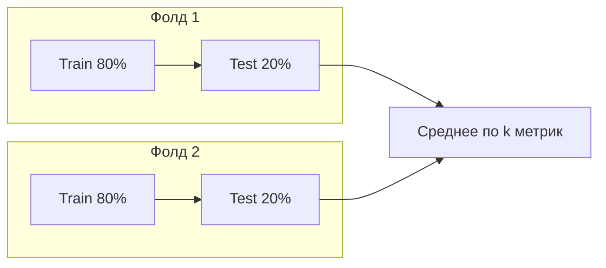

# Разбиение данных и кросс-валидация

<div class="article-tags">
  <span class="tag tag-beginner">ДЛЯ НОВИЧКОВ</span>
</div>

<span class="complexity-badge">Разработчику</span>

После очистки таблицы модель **нельзя** обучать и оценивать на одних и тех же строках — иначе метрики завысятся. Стандартный приём: разделить выборку на **train** (обучение), **validation** (подбор гиперпараметров) и **test** (финальная проверка). Подробный пример — в [проекте Melbourne](/encyclopedia/6-ai/6-02-mashinnoe-obuchenie/7).

---

## Три выборки — зачем каждая

| Выборка | Роль | Модель их «видит» при обучении? |
|---------|------|----------------------------------|
| **Train** | Подгонка весов алгоритма | Да |
| **Validation** | Подбор гиперпараметров, early stopping | Нет (только для оценки между эпохами) |
| **Test** | Честная оценка перед продом | Нет, один раз в конце |

На маленьких датасетах validation часто заменяют **k-fold кросс-валидацией** внутри train. Test при этом остаётся нетронутым.

<div class="callout callout--warning">
  <div class="callout-title">Test не для оптимизации</div>

  <div class="callout-body">
  Если подбирать гиперпараметры по test и снова смотреть на test, выборка «подглядывает» в ответы. Test используют **один раз** для финального отчёта; для перебора — validation или CV на train.
  </div>
</div>

---

## Hold-out split — train / test

Типичные пропорции hold-out split:

- **70/30** или **80/20** — универсальный старт;
- **90/10** — когда строк очень много (миллионы) и 10% test всё ещё репрезентативны.

```python
from sklearn.model_selection import train_test_split

X_train, X_test, y_train, y_test = train_test_split(
    X, y,
    test_size=0.3,
    random_state=42,
    shuffle=True,
)
```

### Обязательно перемешать

Если CSV отсортирован по дате, региону или классу, первые 70% строк могут не отражать всю выборку. `shuffle=True` (по умолчанию в sklearn) снижает риск **смещённого** train и сюрпризов на test.

### Stratify для классификации

При дисбалансе классов (1% fraud) обычный split может «потерять» редкий класс в test. Параметр `stratify=y` сохраняет доли классов:

```python
X_train, X_test, y_train, y_test = train_test_split(
    X, y, test_size=0.3, stratify=y, random_state=42
)
```

Для регрессии иногда бинарят целевую переменную или используют `StratifiedKFold` по квантилям — реже, чем в классификации.

---

## K-fold кросс-валидация

Один фиксированный split может быть «неудачным» — особенно при малых данных. **K-fold**: данные делят на k частей; k раз модель обучается на k−1 частях и проверяется на оставшейся.

```python
from sklearn.model_selection import cross_val_score
from sklearn.ensemble import RandomForestClassifier

model = RandomForestClassifier(n_estimators=100, random_state=42)
scores = cross_val_score(model, X, y, cv=5, scoring="accuracy")

print(f"Accuracy: {scores.mean():.3f} ± {scores.std():.3f}")
print("По фолдам:", scores)
```

| k | Когда уместно |
|---|----------------|
| 5 | Баланс скорости и стабильности оценки |
| 10 | Меньше данных — чуть надёжнее среднее |
| 3 | Быстрый черновой прогон |

Минус: обучение повторяется k раз — дольше, чем один split.



**GridSearchCV** в [Melbourne-проекте](/encyclopedia/6-ai/6-02-mashinnoe-obuchenie/7) — это перебор гиперпараметров **с k-fold внутри train**, без подглядывания в test.

---

## Утечка данных (data leakage)

Утечка — когда информация из **будущего** или из **test** попадает в признаки train.

| Ошибка | Пример |
|--------|--------|
| Статистики по всему датасету | `StandardScaler.fit` на train+test вместе |
| Target encoding на всём df | Средняя цена по категории с учётом test |
| Временной ряд | Train содержит строки **после** test по дате |
| Дубликаты | Одна сделка попала и в train, и в test |

Правило: всё, что «учится» из данных (`fit`, средние, частоты, кодировщики), вызывается **только на train** (или внутри каждого фолда CV), затем `transform` на validation/test.

Это главная причина оборачивать предобработку и модель в один `Pipeline` — см. [Кодирование категориальных признаков](/encyclopedia/6-ai/6-02-mashinnoe-obuchenie/4) и [Сквозной проект — цены на жильё в Мельбурне](/encyclopedia/6-ai/6-02-mashinnoe-obuchenie/7).

---

## Сколько данных нужно

Жёсткой формулы нет. Практические ориентиры:

- модель должна **видеть разные комбинации признаков** (все «углы» пространства X);
- число строк обычно **больше числа признаков**; для глубоких моделей — на порядки больше;
- **релевантность** важнее объёма: лишние столбцы мешают так же, как нехватка строк.

Пример: чтобы оценить влияние «степень × опыт × дети» на зарплату, в train должны встречаться все сочетания — иначе модель «ломается» на новой комбинации.

При нехватке данных:

- проще модель (линейная регрессия, мелкое дерево);
- регуляризация;
- [transfer learning](/encyclopedia/6-ai/6-02-mashinnoe-obuchenie/3) или полуконтролируемые методы.

---

## Метрики после split

| Задача | Метрики |
|--------|---------|
| Классификация | accuracy, precision, recall, F1, ROC-AUC, confusion matrix |
| Регрессия | MAE, RMSE, R² |

Большой **MAE на test при малом MAE на train** (как в Melbourne с `max_depth=30`) — сигнал [переобучения](/encyclopedia/6-ai/6-02-mashinnoe-obuchenie/8). Сначала проверьте shuffle и утечку, затем гиперпараметры.

---

## Чек-лист перед обучением

1. Очистка завершена ([Кодирование категориальных признаков](/encyclopedia/6-ai/6-02-mashinnoe-obuchenie/4)).
2. Split с `shuffle=True`; для классов — `stratify`.
3. `random_state` зафиксирован для воспроизводимости.
4. Предобработка в `Pipeline`, fit только на train.
5. GridSearch / CV — без test.
6. Финальная метрика — один раз на test.

---

## Связанные материалы

- [Сквозной проект — Мельбурн](/encyclopedia/6-ai/6-02-mashinnoe-obuchenie/7) — `train_test_split` и GridSearchCV
- [Смещение и дисперсия](/encyclopedia/6-ai/6-02-mashinnoe-obuchenie/8) — почему train/test расходятся
- [Машинное обучение — кросс-валидация](/encyclopedia/6-ai/6-02-mashinnoe-obuchenie/1#кросс-валидация)
- [Алгоритмы ИИ — подбор гиперпараметров](/encyclopedia/6-ai/6-02-mashinnoe-obuchenie/2)

---
