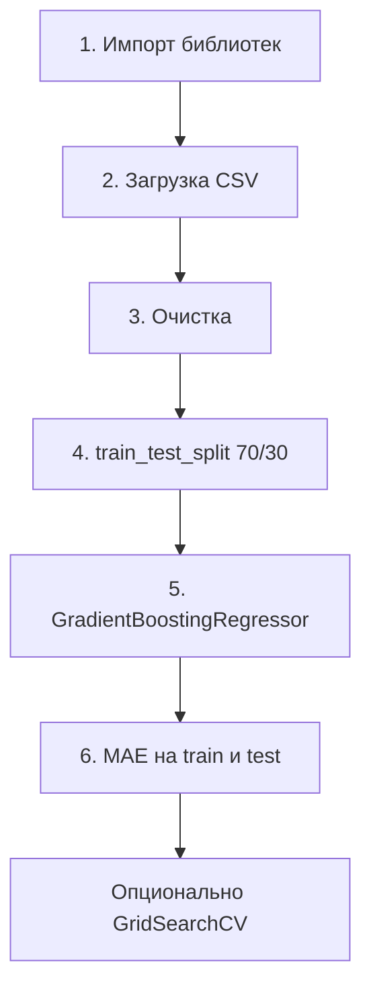

# Сквозной проект — цены на жильё в Мельбурне

<div class="article-tags">
  <span class="tag tag-beginner">ДЛЯ НОВИЧКОВ</span>
</div>

<span class="complexity-badge">Разработчику</span>

Практический маршрут для первой **регрессионной** модели на табличных данных: датасет **Melbourne Housing** (объявления о продаже жилья в Мельбурне, ~35 тыс. строк, 21 столбец), очистка в pandas, **градиентный бустинг** из scikit-learn, метрика **MAE** и настройка через **GridSearchCV**. Код можно запустить локально или в Kaggle Notebook — Jupyter не обязателен.

---

## Датасет

| | |
|---|---|
| **Источник** | [Melbourne Housing Market на Kaggle](https://www.kaggle.com/datasets/anthonypino/melbourne-housing-market) (зеркала встречаются под именем `Melbourne_housing_FULL.csv`) |
| **Целевая переменная** | `Price` — цена в австралийских долларах |
| **Признаки (после базовой очистки)** | `Suburb`, `Rooms`, `Type`, `Distance`, `Bedroom2`, `Bathroom`, `Car`, `Landsize`, `BuildingArea`, `YearBuilt`, `CouncilArea` |

В исходном файле опечатки в названиях столбцов (`Lattitude`, `Longtitude`) — их можно исправить в CSV или просто не использовать эти поля.

---

## Шесть шагов pipeline



---

## 1–2. Импорт и загрузка

```python
import pandas as pd
from sklearn.model_selection import train_test_split, GridSearchCV
from sklearn import ensemble
from sklearn.metrics import mean_absolute_error

df = pd.read_csv("Melbourne_housing_FULL.csv")
print(df.shape)
print(df.head())
```

Путь к файлу подставьте свой. Удобно держать CSV рядом с notebook или скриптом.

---

## 3. Очистка

### Удаление лишних столбцов

Столбцы с адресом, датой продажи, координатами и служебными полями для базовой модели не нужны — пригород (`Suburb`) и район (`CouncilArea`) уже несут географию.

```python
cols_to_drop = [
    "Address", "Method", "SellerG", "Date", "Postcode",
    "Lattitude", "Longtitude", "Regionname", "Propertycount",
]
df = df.drop(columns=[c for c in cols_to_drop if c in df.columns])
```

<div class="callout callout--info">
  <div class="callout-title">Отбор признаков</div>

  <div class="callout-body">
  Удаление нерелевантных столбцов ускоряет обучение и снижает шум. Позже можно вернуть, например, `SellerG` (агентство) и проверить, улучшилась ли MAE на validation.
  </div>
</div>

### Пропуски

Для первого прохода — простой вариант: **удалить строки** с любыми NaN.

```python
df = df.dropna(axis=0, how="any")
```

На проде чаще imputation (медиана, `SimpleImputer`) или отдельная обработка по столбцам — см. [Кодирование категориальных признаков](/encyclopedia/6-ai/6-02-mashinnoe-obuchenie/4) и [Data Science](/encyclopedia/3-data-markup/3-11-analiz-dannyh/12).

### Кодирование категорий

Категориальные `Suburb`, `CouncilArea`, `Type` переводим в числа **one-hot** через `pd.get_dummies` (подробнее — [4.md](/encyclopedia/6-ai/6-02-mashinnoe-obuchenie/4)):

```python
df = pd.get_dummies(df, columns=["Suburb", "CouncilArea", "Type"])
```

Подробнее о выборе кодировщика — [4.md](/encyclopedia/6-ai/6-02-mashinnoe-obuchenie/4).

### X и y

```python
X = df.drop("Price", axis=1)
y = df["Price"]
```

---

## 4. Разбиение 70 / 30

```python
X_train, X_test, y_train, y_test = train_test_split(
    X, y, test_size=0.3, random_state=42, shuffle=True
)
```

`random_state` фиксирует воспроизводимость. Для финальной оценки **не подбирайте гиперпараметры по test** — только по train (или отдельному validation). Test — для финальной проверки; для перебора параметров нужна **validation**-выборка или k-fold на train.

---

## 5. Модель — градиентный бустинг

Стартовая конфигурация (агрессивная глубина → риск переобучения):

```python
model = ensemble.GradientBoostingRegressor(
    n_estimators=150,
    learning_rate=0.1,
    max_depth=30,
    min_samples_split=4,
    min_samples_leaf=6,
    max_features=0.6,
    loss="huber",
    random_state=42,
)
model.fit(X_train, y_train)
```

| Гиперпараметр | Роль |
|---------------|------|
| `n_estimators` | Число деревьев в ансамбле |
| `learning_rate` | Вклад каждого следующего дерева |
| `max_depth` | Глубина деревьев — главный рычаг bias/variance |
| `max_features` | Доля признаков на split (как в random forest) |
| `loss='huber'` | Устойчивость к выбросам в ценах |

---

## 6. Оценка — MAE

**Mean Absolute Error** — средняя абсолютная ошибка в тех же единицах, что и `Price` (AUD):

```python
mae_train = mean_absolute_error(y_train, model.predict(X_train))
mae_test = mean_absolute_error(y_test, model.predict(X_test))
print(f"MAE train: {mae_train:,.0f}")
print(f"MAE test:  {mae_test:,.0f}")
```

При `max_depth=30` MAE на train получается **намного** ниже, чем на test — типичный сигнал **переобучения**: модель запомнила train, на новых домах ошибается сильнее.

Контекст: при ценах до миллионов AUD ошибка ~28 тыс. на train может быть приемлемой; разрыв train/test важнее абсолютного числа.

---

## Оптимизация гиперпараметров

Смягчение переобучения вручную:

```python
model_tuned = ensemble.GradientBoostingRegressor(
    n_estimators=250,
    learning_rate=0.1,
    max_depth=5,
    min_samples_split=4,
    min_samples_leaf=6,
    max_features=0.6,
    loss="huber",
    random_state=42,
)
model_tuned.fit(X_train, y_train)
```

`max_depth` с 30 до 5 — train MAE растёт, test часто **улучшается**, разрыв сужается. Меняйте **по одному** гиперпараметру и смотрите на обе выборки.

### GridSearchCV

Автоматический перебор (может занять **десятки минут** на полном датасете):

```python
base = ensemble.GradientBoostingRegressor(random_state=42)
param_grid = {
    "n_estimators": [200, 300],
    "max_depth": [4, 6],
    "min_samples_split": [3, 4],
    "min_samples_leaf": [5, 6],
    "learning_rate": [0.01, 0.1],
    "max_features": [0.8, 0.9],
    "loss": ["huber", "squared_error"],
}

grid = GridSearchCV(base, param_grid, n_jobs=-1, cv=3, scoring="neg_mean_absolute_error")
grid.fit(X_train, y_train)
print(grid.best_params_)

best = grid.best_estimator_
print("MAE test:", mean_absolute_error(y_test, best.predict(X_test)))
```

`cv=3` — кросс-валидация **внутри train**; test трогаем один раз в конце. Альтернатива при большой сетке — `RandomizedSearchCV`.

<div class="callout callout--warning">
  <div class="callout-title">Утечка и test</div>

  <div class="callout-body">
  Не подбирайте столбцы, imputation и гиперпараметры, «подглядывая» в test. Весь `GridSearchCV` — только на train (или train+val). Иначе MAE на test будет оптимистичной.
  </div>
</div>

---

## Production-вариант — Pipeline

Чтобы кодирование и модель всегда применялись одинаково:

```python
from sklearn.compose import ColumnTransformer
from sklearn.pipeline import Pipeline
from sklearn.preprocessing import OneHotEncoder
from sklearn.impute import SimpleImputer

num_cols = ["Rooms", "Distance", "Bedroom2", "Bathroom", "Car",
            "Landsize", "BuildingArea", "YearBuilt"]
cat_cols = ["Suburb", "CouncilArea", "Type"]

preprocess = ColumnTransformer([
    ("num", SimpleImputer(strategy="median"), num_cols),
    ("cat", Pipeline([
        ("imputer", SimpleImputer(strategy="constant", fill_value="missing")),
        ("onehot", OneHotEncoder(handle_unknown="ignore")),
    ]), cat_cols),
])

pipe = Pipeline([
    ("prep", preprocess),
    ("model", ensemble.GradientBoostingRegressor(random_state=42)),
])
pipe.fit(df[num_cols + cat_cols], df["Price"])
```

Такой каркас ближе к тому, что описано в [Машинное обучение — предобработка](/encyclopedia/6-ai/6-02-mashinnoe-obuchenie/1#подготовка-данных).

---

## Что дальше

- Сравнить с **RandomForestRegressor** или **LinearRegression** — baseline за 5 минут.
- Добавить **validation**-слой и early stopping для бустинга.
- Перейти к классификации — [Titanic на Kaggle](/encyclopedia/6-ai/6-02-mashinnoe-obuchenie/21).
- Углубить метрики регрессии (RMSE, R²) — [1.md](/encyclopedia/6-ai/6-02-mashinnoe-obuchenie/1#для-задач-регрессии).

---

## Связанные материалы

- [Категории обучения и стек](/encyclopedia/6-ai/6-02-mashinnoe-obuchenie/5)
- [Алгоритмы ИИ — градиентный бустинг](/encyclopedia/6-ai/6-02-mashinnoe-obuchenie/2)
- [Интеграция ML в Python](/encyclopedia/6-ai/6-05-razrabotka-ii/112)

---
