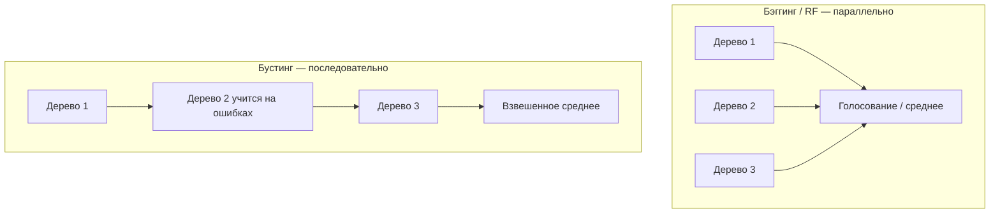

import ExternalCodeEmbed from '@site/src/components/ExternalCodeEmbed';


# Деревья решений с нуля

<div class="article-tags">
  <span class="tag tag-beginner">ДЛЯ НОВИЧКОВ</span>
</div>

<span class="complexity-badge">Разработчику</span>

**Дерево решений** — наглядный алгоритм: последовательность вопросов "если признак ≤ порога → налево, иначе направо". Подходит для классификации и регрессии, легко объясняется бизнесу — в отличие от "чёрного ящика" нейросети. Здесь — построение дерева, **энтропия**, переобучение и путь к **random forest** и **градиентному бустингу** (как в Melbourne).

---

## Когда дерево лучше нейросети

| Деревья | Нейросети |
|---------|-----------|
| Мало данных, таблица | Много размеченных изображений / текст |
| Нужна интерпретация | Максимальное качество на unstructured |
| Быстрый baseline | GPU, длинное обучение |

Классический пример: "Смогу ли сыграть в теннис?" — погода → влажность → ветер → да/нет. Так же объясняют отказ в кредите по цепочке правил.

---

## Структура дерева

- **Корень** — первый вопрос по признаку.
- **Внутренние узлы** — следующие вопросы.
- **Листья** — итоговый класс или среднее значение (регрессия).

Алгоритм **жадно** на каждом шаге выбирает признак и порог, которые лучше всего **разделяют** данные на однородные группы.

---

## Энтропия и выбор признака

**Энтропия** — мера "беспорядка" в узле: насколько смешаны классы. Чем **ниже** энтропия после split, тем лучше вопрос.

Для бинарной классификации (доля класса 1 = p, класса 0 = 1−p):

\[
H = -\bigl(p \log_2 p + (1-p) \log_2 (1-p)\bigr)
\]

- p = 0 или p = 1 → **H = 0** (чистый узел);
- p = 0.5 → **H = 1** (максимальный хаос).

На примере таблицы "повышение по службе": признак "Превышение KPI" даёт два **чистых** листа (энтропия 0), "способность к лидерству" — смешанные группы (~0.95 бит). В корень идёт KPI.

В sklearn criterion `entropy` или `gini` (индекс Джини — быстрый surrogate энтропии):

```python
from sklearn.tree import DecisionTreeClassifier

clf = DecisionTreeClassifier(criterion="entropy", max_depth=3, random_state=42)
clf.fit(X_train, y_train)
```

**Information gain** — насколько упала энтропия после split; ID3/CART выбирают максимальный gain.

---

<span id="vizualizatsiya-plot_tree"></span>

## Визуализация — `plot_tree`

Чтобы увидеть **цепочку вопросов**, по которой модель пришла к решению:

```python
import matplotlib.pyplot as plt
from sklearn.tree import DecisionTreeClassifier, plot_tree

clf = DecisionTreeClassifier(max_depth=3, random_state=42)
clf.fit(X_train, y_train)

plt.figure(figsize=(14, 8))
plot_tree(
    clf,
    feature_names=list(X_train.columns) if hasattr(X_train, "columns") else None,
    class_names=["0", "1"],
    filled=True,
    rounded=True,
    fontsize=9,
)
plt.tight_layout()
plt.show()
```

В узле: признак и порог (`Age <= 28.5`), `gini` или `entropy`, число образцов, доля классов (цвет). Лист — итоговый класс. На реальных данных используйте `max_depth=3…5`, иначе график нечитаем. Практика на [Titanic](/lab/Примеры/1157).

---

## Переобучение одного дерева

Жадный алгоритм не смотит "наперёд": первый split оптимален локально, но дерево может стать глубоким и **запомнить** train.

Признаки:

- 100% accuracy на train, провал на test;
- глубокое дерево с листьями по 1 объекту.

Ограничения:

- `max_depth`, `min_samples_leaf`, `min_samples_split`;
- обрезка (pruning) после построения.

Подробнее о bias–variance — [Смещение, дисперсия и переобучение](/encyclopedia/6-ai/6-02-mashinnoe-obuchenie/8).

---

## Бэггинг

**Bootstrap aggregating** — много деревьев на **случайных подвыборках** train (с возвращением), итог:

- **классификация** — голосование;
- **регрессия** — среднее прогнозов.

Разные bootstrap-сэмплы → разные деревья → **снижение дисперсии**. Выбросы меньше ломают один-единственный tree.

---

## Random Forest

Как бэггинг, плюс на **каждом split** рассматривается только **случайное подмножество признаков** (`max_features`). Деревья меньше коррелируют — ансамбль стабильнее.

```python
from sklearn.ensemble import RandomForestClassifier

rf = RandomForestClassifier(n_estimators=100, max_features="sqrt", random_state=42)
rf.fit(X_train, y_train)
```

Стартовая точка — **100–150 деревьев**; дальше убывающая отдача. RF быстро обучается (деревья **параллельно**) — удобный baseline.

| | Одно дерево | Random Forest |
|---|-------------|---------------|
| Интерпретация | Высокая | Ниже (сотни деревьев) |
| Переобучение | Высокий риск | Ниже |
| Скорость train | Быстро | Средне (параллельно) |

---

## Градиентный бустинг

Деревья строятся **последовательно**: каждое следующее исправляет ошибки предыдущих. Веса объектов, где модель ошиблась, растут — "дополнительное занятие" для слабых учеников.

```python
from sklearn.ensemble import GradientBoostingRegressor

gbr = GradientBoostingRegressor(n_estimators=150, learning_rate=0.1, max_depth=5, random_state=42)
gbr.fit(X_train, y_train)
```

Именно **GradientBoostingRegressor** в [Melbourne](/encyclopedia/6-ai/6-02-mashinnoe-obuchenie/7). Плюсы — часто **лучшая точность** на таблицах. Минусы:

- train **последовательный** (медленнее RF);
- легче переобучить при слишком большом `n_estimators` / `max_depth`;
- чувствительность к выбросам (фокус на ошибках).

На данных с выбросами часто предпочитают RF; на "гладких" таблицах — бустинг.



---

## Сравнение для выбора

| Метод | Обучение | Типичное качество | Интерпретация |
|-------|----------|-------------------|---------------|
| Decision Tree | Быстро | Baseline | Отличная |
| Random Forest | Параллельно | Хорошее | Средняя |
| Gradient Boosting | Последовательно | Часто лучшее | Низкая |

Справочник с API и edge cases — [Алгоритмы ИИ](/encyclopedia/6-ai/6-02-mashinnoe-obuchenie/2).

---

## Мини-пример — Iris


<ExternalCodeEmbed example="python/ai-6-6-02-mashinnoe-obuchenie-9-001" title="Мини-пример — Iris" minHeight={354} />


На Iris оба дадут ~1.0 — на реальных данных разрыв tree vs RF заметнее.

---

## Связанные материалы

- [Melbourne — GradientBoostingRegressor](/encyclopedia/6-ai/6-02-mashinnoe-obuchenie/7)
- [Смещение и дисперсия](/encyclopedia/6-ai/6-02-mashinnoe-obuchenie/8)
- [Ансамблевое моделирование в справочнике](/encyclopedia/6-ai/6-02-mashinnoe-obuchenie/2)
- [Нейросети — когда переходить дальше](/encyclopedia/6-ai/6-03-neyroseti/intro)

---
