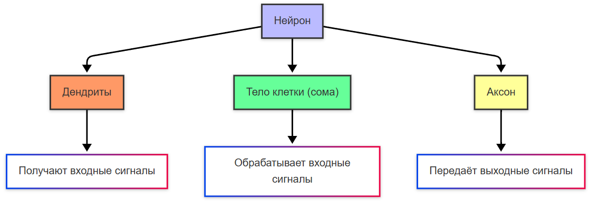
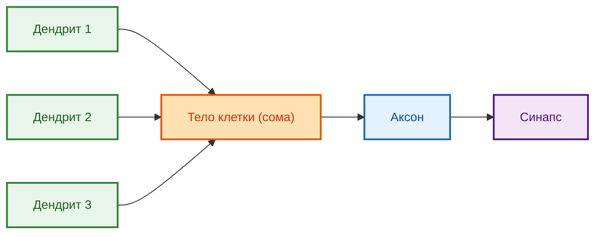
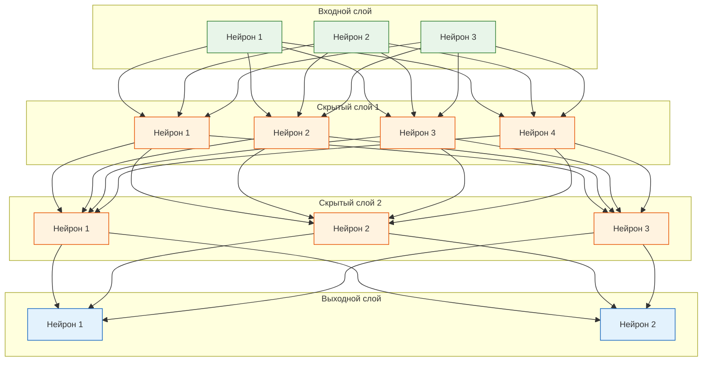

import BackpropStepPlay from '@site/src/components/BackpropStepPlay.jsx';
import NeuralNetworkDemo from '@site/src/components/NeuralNetworkDemo.jsx';

# Нейрон

<div class="article-tags">
  <span class="tag tag-required">ОБЯЗАТЕЛЬНО</span>
  <span class="tag tag-beginner">ДЛЯ НОВИЧКОВ</span>
</div>

<span class="complexity-badge">Всем</span>

## Нейрон

### Что такое нейрон?

**Нейрон** — это основная функциональная единица биологической нервной системы, включая человеческий мозг. Нейроны обрабатывают и передают информацию через электрические сигналы. 

Каждый нейрон состоит из трёх основных частей - **дендриты** (получают входные сигналы), **тело клетки** (сома, обрабатывает входные сигналы), **аксон** (передаёт выходные сигналы). 

Здесь мы сразу видим принцип - входные данные, обработка и выходные данные.

<BackpropStepPlay />

<NeuralNetworkDemo />



Принцип работы нейрона следует классической схеме обработки информации: входные данные поступают через дендриты, обрабатываются в теле клетки, результат передаётся через аксон к другим элементам системы.



**Дендрит** — это древовидное ответвление нейрона, предназначенное для приёма сигналов от других нейронов. Дендриты увеличивают площадь поверхности клетки, позволяя одновременно получать информацию от тысяч других нейронов. Каждый дендрит содержит специализированные рецепторы, распознающие химические вещества (нейротрансмиттеры), выделяемые соседними нейронами.

**Входной сигнал** — это электрический или химический импульс, поступающий к нейрону через синаптические связи. В биологических системах входной сигнал возникает при высвобождении нейротрансмиттеров в синаптическую щель, что вызывает изменение электрического потенциала на мембране дендрита. Сила входного сигнала определяется концентрацией нейротрансмиттеров и количеством активированных рецепторов.

**Тело клетки (сома)** — центральная часть нейрона, содержащая ядро и основные органеллы. Сома выполняет метаболические функции клетки и интегрирует все входящие сигналы от дендритов. В теле клетки происходит суммирование возбуждающих и тормозящих потенциалов, поступающих от разных дендритов.

**Обработка входных сигналов** в нейроне происходит через процесс суммирования потенциалов. Каждый входной сигнал вызывает локальное изменение электрического потенциала мембраны. Эти изменения распространяются к телу клетки, где алгебраически суммируются. Если суммарный потенциал достигает определённого порогового значения (обычно около -55 милливольт), нейрон генерирует выходной импульс — потенциал действия.

**Аксон** — длинное волокно, выходящее из тела клетки и передающее электрические импульсы к другим нейронам или мышечным волокнам. Аксоны могут достигать значительной длины (до одного метра у человека) и часто покрыты миелиновой оболочкой, ускоряющей проведение сигнала. На конце аксона расположены синаптические окончания, выделяющие нейротрансмиттеры для передачи сигнала следующему нейрону.

**Выходной сигнал** — это потенциал действия, распространяющийся по аксону к синаптическим окончаниям. Потенциал действия представляет собой кратковременный скачок электрического потенциала мембраны с -70 милливольт до +30 милливольт. Этот сигнал имеет всё-или-ничего характер: он либо возникает полностью при достижении порога, либо отсутствует. Частота потенциалов действия кодирует интенсивность стимула.

---

### Вес нейрона

**Вес** — это числовой параметр, определяющий значимость входного сигнала для формирования выходного результата нейрона. Термин «вес» отражает концепцию важности или влияния конкретного входа: больший вес означает большее влияние соответствующего сигнала на решение нейрона.

Сила влияния входного сигнала на выходной сигнал нейрона проявляется в математическом умножении значения входа на соответствующий весовой коэффициент. Например, если входной сигнал имеет значение 0.8, а вес равен 1.5, их произведение составит 1.2 — этот взвешенный сигнал вносит больший вклад в общую сумму, чем сигнал с весом 0.5.

**Весовой коэффициент** — это вещественное число, хранящееся в памяти искусственного нейрона или представленное биологически через количество синаптических рецепторов и эффективность синаптической передачи. В процессе обучения нейронной сети весовые коэффициенты корректируются для минимизации ошибки предсказания. Биологически вес синапса изменяется через процессы потенциации и депрессии, лежащие в основе обучения и памяти.

Пример вычисления взвешенной суммы входов искусственного нейрона:

```python
# Python — вычисление взвешенной суммы входов
inputs = [0.5, 0.8, -0.3]      # входные сигналы
weights = [1.2, 0.7, -0.9]     # весовые коэффициенты
bias = 0.1                     # смещение

weighted_sum = 0
for i in range(len(inputs)):
    weighted_sum += inputs[i] * weights[i]
weighted_sum += bias

print(f"Взвешенная сумма: {weighted_sum}")
```

```csharp
// C#: вычисление взвешенной суммы входов
double[] inputs = { 0.5, 0.8, -0.3 };
double[] weights = { 1.2, 0.7, -0.9 };
double bias = 0.1;

double weightedSum = 0;
for (int i = 0; i < inputs.Length; i++)
{
    weightedSum += inputs[i] * weights[i];
}
weightedSum += bias;

Console.WriteLine($"Взвешенная сумма: {weightedSum}");
```

```java
// Java: вычисление взвешенной суммы входов
double[] inputs = {0.5, 0.8, -0.3};
double[] weights = {1.2, 0.7, -0.9};
double bias = 0.1;

double weightedSum = 0;
for (int i = 0; i < inputs.length; i++) {
    weightedSum += inputs[i] * weights[i];
}
weightedSum += bias;

System.out.println("Взвешенная сумма: " + weightedSum);
```

В приведённых примерах:
- `inputs` — массив входных сигналов, полученных нейроном
- `weights` — массив весовых коэффициентов, соответствующих каждому входу
- `bias` — смещение, позволяющее нейрону активироваться даже при нулевых входах
- `weighted_sum` — результат суммирования произведений входов на веса с добавлением смещения


Искусственный интеллект позаимствовал понятие, и в контексте ИИ нейрон — это математическая модель, имитирующая работу биологического нейрона. Он принимает входные данные, применяет к ним весовые коэффициенты, выполняет преобразования (например, с помощью функции активации) и выдаёт выходное значение.

---

### Нейронная сеть

**Нейронная сеть** — это вычислительная система, состоящая из множества взаимосвязанных элементов обработки (нейронов), организованных в слои. Каждый нейрон принимает входные данные, применяет к ним весовые коэффициенты, суммирует результаты и пропускает через функцию активации для получения выходного значения. Связи между нейронами передают информацию от одного элемента к другому.

**Слой нейронной сети** — это группа нейронов, обрабатывающих информацию на одном этапе вычислений. Слои организованы последовательно: выходные сигналы одного слоя становятся входными для следующего. Типы слоёв:
- Входной слой принимает исходные данные без преобразования весами
- Скрытые слои выполняют промежуточные вычисления и извлечение признаков
- Выходной слой формирует окончательный результат сети

**Имитация биологических нейронов** в искусственных нейронных сетях основана на математической абстракции ключевых принципов работы биологической нервной системы. Искусственный нейрон моделирует процесс суммирования взвешенных входов и применения пороговой функции, аналогичной генерации потенциала действия в биологическом нейроне. Функция активации в искусственном нейроне имитирует нелинейное поведение биологического нейрона при достижении порога возбуждения.

**Отличия биологических и искусственных нейронных сетей** проявляются в нескольких аспектах. Биологические нейроны работают асинхронно и непрерывно, тогда как искусственные сети обычно функционируют синхронно по тактам вычислений. Биологические синапсы обладают сложной динамикой с краткосрочной и долгосрочной пластичностью, в то время как веса искусственных нейронов изменяются дискретно в процессе обучения. Биологические нейроны используют химические и электрические сигналы с переменной частотой импульсов, искусственные нейроны оперируют непрерывными или дискретными числовыми значениями. Биологические сети содержат рекуррентные связи и сложную топологию, тогда как многие искусственные архитектуры используют упрощённые прямые связи.




Приравнивать ИИ и нейросети не нужно. Нейронные сети — это конкретный метод внутри ИИ, который имитирует работу биологических нейронов для обработки данных.

---

### Компоненты нейронной сети

Компоненты нейронной сети:
- Входной слой принимает исходные данные.
- Скрытые слои выполняют вычисления и преобразования данных.
- Выходной слой выдаёт результат.


**Исходные данные** — это информация, подаваемая на вход нейронной сети для обработки. В задачах компьютерного зрения исходными данными являются пиксели изображения, в обработке естественного языка — последовательности слов или токенов, в прогнозировании временных рядов — исторические значения показателей. Исходные данные преобразуются в числовой формат, подходящий для математических операций в нейронах.

**Входной слой** — первый слой нейронной сети, непосредственно принимающий исходные данные. Количество нейронов во входном слое соответствует размерности входных данных. Например, для обработки изображения 28×28 пикселей входной слой содержит 784 нейрона (по одному на каждый пиксель). Нейроны входного слоя обычно не выполняют активацию или применяют линейную функцию, просто передавая значения следующему слою.

**Вычисления** в нейронной сети представляют собой последовательность математических операций, выполняемых каждым нейроном. Основные этапы вычислений в нейроне:
1. Умножение каждого входного значения на соответствующий весовой коэффициент
2. Суммирование всех взвешенных входов с добавлением смещения (bias)
3. Применение функции активации к полученной сумме для введения нелинейности

**Преобразования данных** — это процессы изменения представления информации при прохождении через слои сети. Каждый скрытый слой извлекает всё более абстрактные признаки из входных данных. В свёрточных сетях для изображений первый слой может выделять края и текстуры, второй слой — простые формы, третий слой — сложные объекты. Преобразования данных позволяют сети переходить от низкоуровневых признаков к высокоуровневым концепциям.

**Скрытый слой** — промежуточный слой нейронной сети, расположенный между входным и выходным слоями. Скрытые слои выполняют основную работу по извлечению признаков и построению внутреннего представления данных. Глубокие нейронные сети содержат множество скрытых слоёв, что позволяет им моделировать сложные нелинейные зависимости. Количество скрытых слоёв и нейронов в каждом слое определяет выразительную мощность сети.

**Выходной слой** — финальный слой нейронной сети, формирующий окончательный результат обработки. Архитектура выходного слоя зависит от типа решаемой задачи:
- Для бинарной классификации используется один нейрон с сигмоидной активацией
- Для многоклассовой классификации применяется несколько нейронов с softmax-активацией
- Для регрессии используются линейные нейроны без нелинейной активации
- Для генерации последовательностей применяются рекуррентные или трансформерные архитектуры

**Результат** — это выходное значение нейронной сети, интерпретируемое в контексте решаемой задачи. В классификации результат представляет вероятности принадлежности объекта к каждому классу. В регрессии результат — предсказанное числовое значение. В генеративных моделях результатом является новый объект (изображение, текст, аудио), созданный сетью на основе входных данных или случайного шума. Результат проходит постобработку для преобразования в удобный для пользователя формат.

Пример полного прохождения данных через простую нейронную сеть:

```python
# Python — полный цикл обработки данных в нейросети

import numpy as np

def sigmoid(x):
    """Функция активации сигмоида"""
    return 1 / (1 + np.exp(-x))

# Исходные данные (например, признаки объекта)
input_data = np.array([0.5, 0.8, -0.3])

# Веса первого скрытого слоя (3 входа → 4 нейрона)
weights_hidden1 = np.array([
    [0.2, 0.4, -0.5, 0.1],
    [0.6, -0.3, 0.7, 0.2],
    [-0.4, 0.5, 0.1, -0.6]
])

# Веса выходного слоя (4 нейрона → 1 выход)
weights_output = np.array([0.3, -0.7, 0.4, 0.8])
bias_output = 0.1

# Обработка во входном слое (просто передача данных)
layer_input = input_data

# Вычисления в первом скрытом слое
hidden1_input = np.dot(layer_input, weights_hidden1)
hidden1_output = sigmoid(hidden1_input)

# Вычисления в выходном слое
output_input = np.dot(hidden1_output, weights_output) + bias_output
final_output = sigmoid(output_input)

print(f"Исходные данные: {input_data}")
print(f"Выход скрытого слоя: {hidden1_output}")
print(f"Результат сети: {final_output}")
```

В этом примере:
- `input_data` представляет исходные данные, поступающие во входной слой
- `weights_hidden1` содержит весовые коэффициенты для связей между входным и первым скрытым слоем
- `hidden1_output` — результат преобразования данных в скрытом слое
- `final_output` — окончательный результат работы сети после выходного слоя

Процесс обработки данных в нейронной сети демонстрирует поэтапное преобразование информации: от исходных признаков через промежуточные представления к финальному результату, пригодному для принятия решений или дальнейшего использования.

Чтобы пройти полный цикл **обучения** (случайные веса → ошибка → подстройка `syn0` → проверка на новых векторах), см. [Первое обучение: перцептрон на NumPy](/encyclopedia/6-ai/6-03-neyroseti/2).

---
