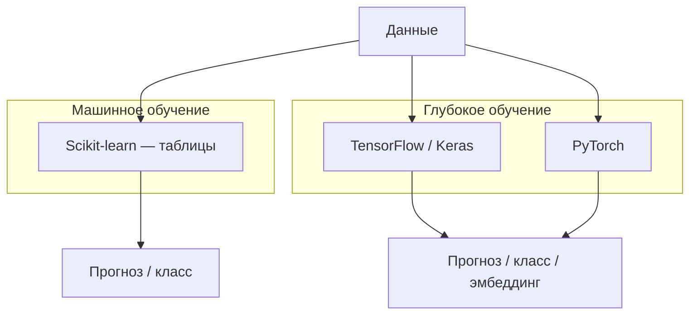

import ExternalCodeEmbed from '@site/src/components/ExternalCodeEmbed';


# Keras и TensorFlow — нейросети

<div class="article-tags">
  <span class="tag tag-beginner">ДЛЯ НОВИЧКОВ</span>
</div>

<span class="complexity-badge">Разработчику</span>

**TensorFlow** — платформа глубокого обучения от Google — вычислительный граф, автоматическое дифференцирование, GPU/TPU, экспорт в **TensorFlow Lite** (мобильные устройства) и **TensorFlow.js** (браузер). **Keras** с TensorFlow 2.x встроен как высокоуровневый API (`tf.keras`) для быстрой сборки и обучения сетей.

Табличные задачи на старте проще закрыть **scikit-learn** — см. [Scikit-learn](/encyclopedia/6-ai/6-02-mashinnoe-obuchenie/10). Keras уместен, когда нужны **изображения**, **последовательности**, **эмбеддинги** или глубокие архитектуры (CNN, LSTM, трансформеры). Теория нейрона и слоёв — [Нейрон](/encyclopedia/6-ai/6-03-neyroseti/1); базовые массивы — [NumPy — массивы и матрицы](/lab/Примеры/1129); первый код без фреймворка — [перцептрон на NumPy](/encyclopedia/6-ai/6-03-neyroseti/2).

---

## ML и DL в одной картине



| | Scikit-learn | Keras (TensorFlow) |
|---|--------------|-------------------|
| Данные | Таблицы, разреженные матрицы | Тензоры (изображения, последовательности) |
| Признаки | Часто готовят вручную (pandas) | Извлекаются слоями сети |
| Обучение | CPU, секунды–минуты | GPU желателен для больших моделей |
| Типичные задачи | Цена, отток, кластеры | CV, NLP, аудио |

Раздел **глубокое обучение** в [Машинное обучение](/encyclopedia/6-ai/6-02-mashinnoe-obuchenie/1#глубокое-обучение) даёт расширенные примеры CNN и RNN; здесь — компактный практический маршрут.

---

## Установка и проверка

```bash
pip install tensorflow
```

```python

import tensorflow as tf

print(tf.__version__)
print("GPU:", tf.config.list_physical_devices("GPU"))
```

---

## Sequential — слои друг за другом

Модель для табличных или простых задач (бинарная классификация после нормализации):


<ExternalCodeEmbed example="python/ai-6-6-03-neyroseti-114-001" title="Sequential — слои друг за другом" minHeight={720} />


| Параметр `compile` | Когда использовать |
|--------------------|------------------|
| `binary_crossentropy` | Два класса, выход `sigmoid` |
| `sparse_categorical_crossentropy` | Несколько классов, метки — целые числа 0…K-1 |
| `categorical_crossentropy` | Несколько классов, метки — one-hot |
| `mse` | Регрессия, выход `linear` |

Оптимизатор по умолчанию — `adam`; скорость обучения можно задать явно: `optimizer=tf.keras.optimizers.Adam(learning_rate=1e-3)`.

Перед `fit` полезно посмотреть архитектуру:

```python
model.summary()  # число параметров по слоям
```

Для схемы слоёв (нужен `pip install pydot graphviz`):

```python
tf.keras.utils.plot_model(model, to_file="model.png", show_shapes=True)
```

---

## Цикл обучения: Keras и PyTorch

Идеи одни и те же; отличается синтаксис.

| Шаг | Keras (`tf.keras`) | PyTorch |
|-----|-------------------|---------|
| Сборка | `Sequential` / `Model` | `nn.Module` |
| Функция потерь | в `compile(loss=...)` | `nn.CrossEntropyLoss()` и др. |
| Оптимизатор | в `compile(optimizer=...)` | `torch.optim.Adam(...)` |
| Одна эпоха | `model.fit(X, y, epochs=...)` | цикл: `forward` → `loss` → `backward` → `optimizer.step()` |
| Валидация | `validation_split` или `validation_data` | отдельный цикл без `backward` на val |
| Метрики | `metrics=["accuracy"]` в `compile` | считаете вручную или через `torchmetrics` |
| Сохранение | `model.save("model.keras")` | `torch.save(model.state_dict(), ...)` |

Сквозной пример на PyTorch — [PyTorch для разработчика](/encyclopedia/5-languages/5-02-python/333) и [практикум MNIST](/encyclopedia/5-languages/5-02-python/335).

---

## Гиперпараметры и регуляризация

| Гиперпараметр | Что делает | Типичный старт |
|---------------|------------|----------------|
| `learning_rate` | Шаг обновления весов | `1e-3` для Adam |
| Число слоёв / нейронов | Ёмкость модели | 2–3 скрытых слоя по 64–128 |
| `batch_size` | Примеров за один шаг | 32–128 |
| `epochs` | Проходов по train | 10–50; с EarlyStopping — до 100 |
| Функция активации | Нелинейность | ReLU в скрытых, sigmoid/softmax на выходе |
| `Dropout(p)` | Случайно "выключает" долю нейронов на train | 0.2–0.5 между Dense-слоями |

Признаки переобучения: `loss` на train падает, на validation растёт — см. [смещение и дисперсия](/encyclopedia/6-ai/6-02-mashinnoe-obuchenie/8). Рычаги — упростить сеть, добавить Dropout, раньше остановить обучение, больше данных или аугментация ([Data Science — подготовка для ML](/encyclopedia/3-data-markup/3-11-analiz-dannyh/12)).

Модель с Dropout и L2-регуляризацией:

```python
from tensorflow.keras import Sequential, regularizers
from tensorflow.keras.layers import Dense, Dropout

model = Sequential([
    Dense(128, activation="relu", kernel_regularizer=regularizers.l2(0.01), input_shape=(100,)),
    Dropout(0.5),
    Dense(64, activation="relu", kernel_regularizer=regularizers.l2(0.01)),
    Dropout(0.3),
    Dense(1, activation="sigmoid"),
])
model.compile(optimizer="adam", loss="binary_crossentropy", metrics=["accuracy"])
```

---

## MNIST — первая свёрточная сеть


<ExternalCodeEmbed example="python/ai-6-6-03-neyroseti-114-002" title="MNIST — первая свёрточная сеть" minHeight={480} />


Свёрточные слои (`Conv2D`) ищут локальные паттерны (штрихи, углы); пулинг уменьшает размер карты признаков. Такие сети — основа [распознавания объектов и лиц](/encyclopedia/6-ai/6-06-primenenie-ii/120).

---

## Functional API — ветвления и несколько входов

Когда нужны общие слои, несколько входов или выходов:

```python
inputs = tf.keras.Input(shape=(100,))
x = tf.keras.layers.Dense(128, activation="relu")(inputs)
x = tf.keras.layers.Dropout(0.5)(x)
outputs = tf.keras.layers.Dense(10, activation="softmax")(x)
model = tf.keras.Model(inputs=inputs, outputs=outputs)
model.compile(optimizer="adam", loss="categorical_crossentropy", metrics=["accuracy"])
```

---

## Callbacks и ранняя остановка

```python
log_dir = "logs/fit"
callbacks = [
    tf.keras.callbacks.EarlyStopping(
        monitor="val_loss", patience=5, restore_best_weights=True
    ),
    tf.keras.callbacks.ModelCheckpoint(
        "best.keras", monitor="val_accuracy", save_best_only=True
    ),
    tf.keras.callbacks.TensorBoard(log_dir=log_dir, histogram_freq=1),
]

history = model.fit(
    X_train, y_train,
    epochs=100,
    batch_size=32,
    validation_split=0.2,
    callbacks=callbacks,
)
```

**EarlyStopping** останавливает обучение, когда validation перестаёт улучшаться — защита от переобучения. **ModelCheckpoint** сохраняет лучшие веса по выбранной метрике. Подробнее — [смещение и дисперсия](/encyclopedia/6-ai/6-02-mashinnoe-obuchenie/8) и [разбиение train/validation/test](/encyclopedia/6-ai/6-02-mashinnoe-obuchenie/6).

---

## Визуализация: matplotlib и TensorBoard

После `fit` Keras возвращает объект **History** — метрики по эпохам удобно строить в matplotlib:

```python

import matplotlib.pyplot as plt

plt.figure(figsize=(10, 4))
plt.subplot(1, 2, 1)
plt.plot(history.history["loss"], label="train")
plt.plot(history.history["val_loss"], label="val")
plt.title("Loss")
plt.legend()

plt.subplot(1, 2, 2)
plt.plot(history.history["accuracy"], label="train")
plt.plot(history.history["val_accuracy"], label="val")
plt.title("Accuracy")
plt.legend()
plt.tight_layout()
plt.show()
```

Если кривые train и val расходятся — модель переобучается; если обе плохие — недообучение или мало данных/признаков.

**TensorBoard** пишет те же метрики в каталог логов (см. callback выше). Локально:

```bash
tensorboard --logdir logs/fit
```

В **Google Colab** после обучения:

```python
%load_ext tensorboard
%tensorboard --logdir logs/fit
```

В TensorBoard смотрят вкладки **Scalars** (loss, accuracy), **Graphs** (вычислительный граф) и **Histograms** (распределение весов). Общие приёмы matplotlib для аналитики — [lab/1112](/lab/Примеры/1112).

---

## Google Colab — обучение без локального GPU

[Google Colab](https://colab.research.google.com/) — Jupyter в браузере с бесплатным GPU (лимиты по времени). Удобен для учебных CNN/LSTM, когда на ноутбуке нет видеокарты.

1. **Runtime → Change runtime type → T4 GPU** (или аналог).
2. Установка зависимостей в первой ячейке: `!pip install -q tensorflow`.
3. Проверка: `import tensorflow as tf; print(tf.config.list_physical_devices("GPU"))`.
4. Датасеты — `tf.keras.datasets` (MNIST, CIFAR-10) или загрузка с Google Drive (`from google.colab import drive; drive.mount("/content/drive")`).
5. Длинные ноутбуки сохраняйте на Drive; веса — `model.save("/content/drive/MyDrive/model.keras")`.

Карта Colab-проектов (классификация изображений, генерация текста, эмоции) — в [Практикуме — проекты по ИИ](/encyclopedia/6-ai/6-05-razrabotka-ii/122#vetka-dl--glubokoe-obuchenie-v-colab). Облачный контекст — [GCP и Colab](/encyclopedia/8-infra-security/8-01-oblachnye-tehnologii/1).

---

## Сохранение и инференс

```python
model.save("model.keras")
restored = tf.keras.models.load_model("model.keras")
restored.predict(X_test[:5])
```

Для мобильных устройств — экспорт в **TFLite**; для сервера — **SavedModel** или ONNX. Обзор продакшен-развёртывания — [Применение ИИ в продакшене](/encyclopedia/6-ai/6-06-primenenie-ii/113).

---

## PyTorch — альтернатива

**PyTorch** (Meta) популярен в исследованиях и среди LLM/CV-команд: динамический граф, `torch.nn`, экосистема Hugging Face. Идеи те же (слои, loss, optimizer); синтаксис другой.

Практический вход с установкой, autograd, градиентным спуском и сквозным пайплайном — в статье [PyTorch для разработчика](/encyclopedia/5-languages/5-02-python/333). После [перцептрона на NumPy](/encyclopedia/6-ai/6-03-neyroseti/2) это естественный следующий шаг.

| Выбор | Ориентир |
|-------|----------|
| Учебник, Kaggle, корпоративный Google-стек | TensorFlow / Keras |
| Исследование, кастомные архитектуры, HF-модели | PyTorch |

---

## Дальше по маршруту

1. [Архитектуры — когда Dense, CNN, LSTM](/encyclopedia/6-ai/6-03-neyroseti/113) — матрица выбора по типу данных.
2. [Transfer learning](/encyclopedia/6-ai/6-02-mashinnoe-obuchenie/3) — EfficientNet, заморозка слоёв.
3. [Практикум DL в Colab](/encyclopedia/6-ai/6-05-razrabotka-ii/122#vetka-dl--glubokoe-obuchenie-v-colab) — классификация, char-RNN, эмоции.
4. [Распознавание лиц, объектов и текста](/encyclopedia/6-ai/6-06-primenenie-ii/120) — YOLO, OCR, NER.
5. [Облачные Cognitive API](/encyclopedia/6-ai/6-05-razrabotka-ii/120) — если своё обучение не нужно.
6. [Большие языковые модели](/encyclopedia/6-ai/6-04-modeli-i-instrumenty/1) — трансформеры поверх тех же идей эмбеддингов.
