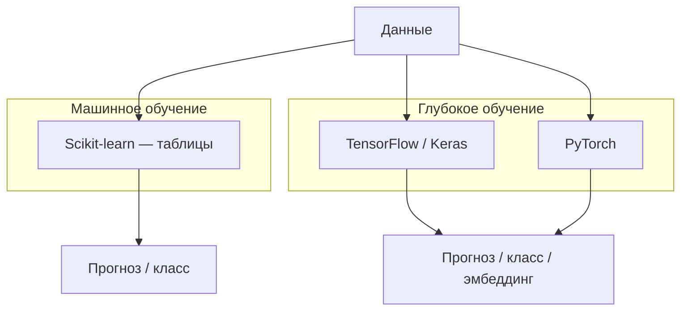

import ExternalCodeEmbed from '@site/src/components/ExternalCodeEmbed';


# Keras и TensorFlow — нейросети

<div class="article-tags">
  <span class="tag tag-beginner">ДЛЯ НОВИЧКОВ</span>
</div>

<span class="complexity-badge">Разработчику</span>

**TensorFlow** — платформа глубокого обучения от Google — вычислительный граф, автоматическое дифференцирование, GPU/TPU, экспорт в **TensorFlow Lite** (мобильные устройства) и **TensorFlow.js** (браузер). **Keras** с TensorFlow 2.x встроен как высокоуровневый API (`tf.keras`) для быстрой сборки и обучения сетей.

Табличные задачи на старте проще закрыть **scikit-learn** — см. [Scikit-learn](/encyclopedia/6-ai/6-02-mashinnoe-obuchenie/10). Keras уместен, когда нужны **изображения**, **последовательности**, **эмбеддинги** или глубокие архитектуры (CNN, LSTM, трансформеры). Теория нейрона и слоёв — [Нейрон](/encyclopedia/6-ai/6-03-neyroseti/1); массивы и матрицы — [337 — NumPy](/encyclopedia/5-languages/5-02-python/337) и [Lab 1129](/lab/Примеры/1129); первый код без фреймворка — [перцептрон на NumPy](/encyclopedia/6-ai/6-03-neyroseti/2).

<div class="callout callout--info">
  <div class="callout-title">Связь с линейной алгеброй</div>

  <div class="callout-body">
  Слой <code>Dense</code> — это умножение матрицы весов на batch признаков плюс смещение: те же операции, что в <a href="/encyclopedia/3-data-markup/3-03-myslitelnaya-baza/343">343 — Матрицы</a> и <a href="/encyclopedia/5-languages/5-02-python/337">337 — NumPy</a>. Batch из 32 строк по 784 пикселя MNIST — матрица 32×784; веса первого слоя — 784×128.
  </div>
</div>

---

## ML и DL в одной картине



| | Scikit-learn | Keras (TensorFlow) |
|---|--------------|-------------------|
| Данные | Таблицы, разреженные матрицы | Тензоры (изображения, последовательности) |
| Признаки | Часто готовят вручную (pandas) | Извлекаются слоями сети |
| Обучение | CPU, секунды–минуты | GPU желателен для больших моделей |
| Типичные задачи | Цена, отток, кластеры | CV, NLP, аудио |

Раздел **глубокое обучение** в [Машинное обучение](/encyclopedia/6-ai/6-02-mashinnoe-obuchenie/1#глубокое-обучение) даёт расширенные примеры CNN и RNN; здесь — компактный практический маршрут.

---

## Установка и проверка

```bash
pip install tensorflow
```

```python

import tensorflow as tf

print(tf.__version__)
print("GPU:", tf.config.list_physical_devices("GPU"))
```

---

## Мини-регрессия: y = k·x

Перед MNIST полезно обучить **линейную** модель на синтетике — один вход, один выход, активация `linear`, loss `mse`:

```python

import os
os.environ.setdefault("TF_CPP_MIN_LOG_LEVEL", "2")

import numpy as np
import tensorflow as tf

x = np.array([[2.0], [5.0], [8.0], [10.0]], dtype=np.float32)
y = np.array([[6.0], [15.0], [24.0], [30.0]], dtype=np.float32)  # y ≈ 3·x

model = tf.keras.Sequential([
    tf.keras.layers.Input(shape=(1,)),
    tf.keras.layers.Dense(1, activation="linear"),
])
model.compile(optimizer=tf.keras.optimizers.Adam(learning_rate=0.05), loss="mse")
history = model.fit(x, y, epochs=200, verbose=0)

print("веса:", model.get_weights())
print("предсказание для x=7:", model.predict(np.array([[7.0]]), verbose=0))
```

После обучения вес около **3**, смещение около **0**. Тот же приём — в [перцептроне на NumPy](/encyclopedia/6-ai/6-03-neyroseti/2), но там вы явно обновляете `syn0`.

<div class="callout callout--warning">
  <div class="callout-title">Масштаб данных и <code>nan</code></div>

  <div class="callout-body">
  Если входы и ответы велики (например, <code>x = 15…20</code>, <code>y = 45…60</code> при зависимости <code>y = 3x</code>), SGD с дефолтным шагом может «перепрыгнуть» минимум — веса уходят в бесконечность, <code>loss</code> становится <code>nan</code>. Решение: нормализовать данные (делить на 255 для пикселей, Min-Max для таблиц) или уменьшить масштаб синтетики (<code>x = 1…10</code>, <code>y = 3…30</code>), либо снизить <code>learning_rate</code> / взять <code>Adam</code> вместо <code>sgd</code>.
  </div>
</div>

```python
# Тот же y = 3·x, но «крупные» числа — часто nan при optimizer='sgd'
x_big = np.array([[15], [5], [12], [19], [20]], dtype=np.float32)
y_big = np.array([[45], [15], [36], [57], [60]], dtype=np.float32)

model_bad = tf.keras.Sequential([
    tf.keras.layers.Input(shape=(1,)),
    tf.keras.layers.Dense(1, activation="linear"),
])
model_bad.compile(optimizer="sgd", loss="mse")
# model_bad.fit(x_big, y_big, epochs=50, verbose=0)  # может дать nan

x_ok = x_big / 10.0
y_ok = y_big / 10.0
model_bad.fit(x_ok, y_ok, epochs=100, verbose=0)
print(model_bad.predict(np.array([[2.0]]), verbose=0))  # ≈ [[6.]] — y = 3x
```

---

## MNIST 6×6 — первый `fit` на картинках

Перед Fashion MNIST и CNN возьмите **два класса** MNIST (цифры 0 и 1), сожмите до **6×6** и нормализуйте пиксели — обучение займёт секунды на CPU:

```python
import numpy as np
import tensorflow as tf

(x_train, y_train), (x_test, y_test) = tf.keras.datasets.mnist.load_data()
idx_tr = np.where((y_train == 0) | (y_train == 1))[0]
idx_te = np.where((y_test == 0) | (y_test == 1))[0]
x_tr, y_tr = x_train[idx_tr], y_train[idx_tr]
x_te, y_te = x_test[idx_te], y_test[idx_te]

x_tr = (x_tr / 255.0).astype(np.float32)
x_te = (x_te / 255.0).astype(np.float32)
x_tr = tf.image.resize(x_tr[..., np.newaxis], (6, 6)).numpy()[..., 0]
x_te = tf.image.resize(x_te[..., np.newaxis], (6, 6)).numpy()[..., 0]

y_tr_cat = tf.keras.utils.to_categorical(y_tr, num_classes=2)
y_te_cat = tf.keras.utils.to_categorical(y_te, num_classes=2)

model = tf.keras.Sequential([
    tf.keras.layers.Input(shape=(6, 6)),
    tf.keras.layers.Flatten(),
    tf.keras.layers.Dense(2, activation="sigmoid"),
])
model.compile(optimizer="sgd", loss="binary_crossentropy", metrics=["accuracy"])
model.fit(x_tr, y_tr_cat, epochs=5, verbose=1)
print("test accuracy:", model.evaluate(x_te, y_te_cat, verbose=0)[1])
print("probabilities:", model.predict(x_te[:3], verbose=0))
```

`Flatten` превращает 6×6 в вектор длины 36; `to_categorical` — метки в one-hot; для классификации **MSE не подходит** — нужны `binary_crossentropy` и сигмоида (или один выход + `sparse_categorical_crossentropy` + softmax). **Самопроверка:** для первых 20 тестовых изображений сравните `np.argmax(predict(...))` с `y_te[:20]` и сверьте долю совпадений с `model.evaluate`.

---

## Fashion MNIST — сложнее MNIST

**Fashion MNIST** — 60 000 обучающих и 10 000 тестовых изображений **28×28** (один канал), **10 классов** одежды (футболка, брюки, кроссовки…). Формат как у классического MNIST, но задача ближе к «реальному» CV.

```python

(fashion_x, fashion_y), (test_x, test_y) = tf.keras.datasets.fashion_mnist.load_data()
fashion_x = fashion_x.astype("float32") / 255.0
test_x = test_x.astype("float32") / 255.0

model = tf.keras.Sequential([
    tf.keras.layers.Input(shape=(28, 28)),
    tf.keras.layers.Flatten(),
    tf.keras.layers.Dense(128, activation="relu"),
    tf.keras.layers.Dropout(0.2),
    tf.keras.layers.Dense(10, activation="softmax"),
])
model.compile(
    optimizer="adam",
    loss="sparse_categorical_crossentropy",
    metrics=["accuracy"],
)
model.fit(fashion_x, fashion_y, epochs=5, batch_size=128, validation_split=0.1)
```

Тот же датасет на **PyTorch** — [практикум MNIST](/encyclopedia/5-languages/5-02-python/335) (замените загрузчик на `torchvision.datasets.FashionMNIST`). Сравнение фреймворков — таблица в разделе [PyTorch — альтернатива](#pytorch--альтернатива) ниже.

---

## CIFAR-10 — цветные 32×32

**CIFAR-10** — 60 000 **RGB**-изображений **32×32**, 10 классов (самолёт, автомобиль, птица, кот, олень, собака, лягушка, лошадь, корабль, грузовик). Форма одного кадра: **`(32, 32, 3)`** — высота, ширина, три канала (R, G, B). В отличие от MNIST, канал один (grayscale).

```python
import tensorflow as tf

(x_train, y_train), (x_test, y_test) = tf.keras.datasets.cifar10.load_data()
x_train = x_train.astype("float32") / 255.0
x_test = x_test.astype("float32") / 255.0
print("shape одного изображения:", x_train[0].shape)  # (32, 32, 3)

class_names = [
    "airplane", "automobile", "bird", "cat", "deer",
    "dog", "frog", "horse", "ship", "truck",
]

model = tf.keras.Sequential([
    tf.keras.layers.Input(shape=(32, 32, 3)),
    tf.keras.layers.Conv2D(32, (3, 3), activation="relu", padding="same"),
    tf.keras.layers.MaxPooling2D((2, 2)),
    tf.keras.layers.Conv2D(64, (3, 3), activation="relu", padding="same"),
    tf.keras.layers.MaxPooling2D((2, 2)),
    tf.keras.layers.Flatten(),
    tf.keras.layers.Dense(64, activation="relu"),
    tf.keras.layers.Dropout(0.3),
    tf.keras.layers.Dense(10, activation="softmax"),
])
model.compile(
    optimizer="adam",
    loss="sparse_categorical_crossentropy",
    metrics=["accuracy"],
)
model.fit(x_train, y_train, epochs=10, batch_size=64, validation_split=0.1)
```

На CPU первые эпохи могут давать **низкую accuracy** (~1–5% на старте) — нормально для случайных весов; подбирайте число фильтров, `Dropout`, эпохи или переносите обучение в [Colab с GPU](#google-colab--обучение-без-локального-gpu). Загрузка своих JPG с диска — `tf.keras.utils.image_dataset_from_directory(..., color_mode="rgb")`.

<div class="callout callout--info">
  <div class="callout-title">Табличные данные в Keras</div>

  <div class="callout-body">
  Перед изображениями полезно сравнить sklearn и Keras на одной таблице — <a href="/lab/Примеры/1157">Lab 1157 — Titanic</a> (логистическая регрессия, дерево, Dense-сеть).
  </div>
</div>

---

## Sequential — слои друг за другом

Модель для табличных или простых задач (бинарная классификация после нормализации):


<ExternalCodeEmbed example="python/ai-6-6-03-neyroseti-114-001" title="Sequential — слои друг за другом" minHeight={720} />


| Параметр `compile` | Когда использовать |
|--------------------|------------------|
| `binary_crossentropy` | Два класса, выход `sigmoid` |
| `sparse_categorical_crossentropy` | Несколько классов, метки — целые числа 0…K-1 |
| `categorical_crossentropy` | Несколько классов, метки — one-hot |
| `mse` | Регрессия, выход `linear` |

Оптимизатор по умолчанию — `adam`; скорость обучения можно задать явно: `optimizer=tf.keras.optimizers.Adam(learning_rate=1e-3)`.

Перед `fit` полезно посмотреть архитектуру:

```python
model.summary()  # число параметров по слоям
```

Для схемы слоёв (нужен `pip install pydot graphviz`):

```python
tf.keras.utils.plot_model(model, to_file="model.png", show_shapes=True)
```

---

## Цикл обучения: Keras и PyTorch

Идеи одни и те же; отличается синтаксис.

| Шаг | Keras (`tf.keras`) | PyTorch |
|-----|-------------------|---------|
| Сборка | `Sequential` / `Model` | `nn.Module` |
| Функция потерь | в `compile(loss=...)` | `nn.CrossEntropyLoss()` и др. |
| Оптимизатор | в `compile(optimizer=...)` | `torch.optim.Adam(...)` |
| Одна эпоха | `model.fit(X, y, epochs=...)` | цикл: `forward` → `loss` → `backward` → `optimizer.step()` |
| Валидация | `validation_split` или `validation_data` | отдельный цикл без `backward` на val |
| Метрики | `metrics=["accuracy"]` в `compile` | считаете вручную или через `torchmetrics` |
| Сохранение | `model.save("model.keras")` | `torch.save(model.state_dict(), ...)` |

Сквозной пример на PyTorch — [PyTorch для разработчика](/encyclopedia/5-languages/5-02-python/333) и [практикум MNIST](/encyclopedia/5-languages/5-02-python/335).

---

## Гиперпараметры и регуляризация

| Гиперпараметр | Что делает | Типичный старт |
|---------------|------------|----------------|
| `learning_rate` | Шаг обновления весов | `1e-3` для Adam |
| Число слоёв / нейронов | Ёмкость модели | 2–3 скрытых слоя по 64–128 |
| `batch_size` | Примеров за один шаг | 32–128 |
| `epochs` | Проходов по train | 10–50; с EarlyStopping — до 100 |
| Функция активации | Нелинейность | ReLU в скрытых, sigmoid/softmax на выходе |
| `Dropout(p)` | Случайно "выключает" долю нейронов на train | 0.2–0.5 между Dense-слоями |

Признаки переобучения: `loss` на train падает, на validation растёт — см. [смещение и дисперсия](/encyclopedia/6-ai/6-02-mashinnoe-obuchenie/8). Рычаги — упростить сеть, добавить Dropout, раньше остановить обучение, больше данных или аугментация ([Data Science — подготовка для ML](/encyclopedia/3-data-markup/3-11-analiz-dannyh/12)).

Модель с Dropout и L2-регуляризацией:

```python
from tensorflow.keras import Sequential, regularizers
from tensorflow.keras.layers import Dense, Dropout

model = Sequential([
    Dense(128, activation="relu", kernel_regularizer=regularizers.l2(0.01), input_shape=(100,)),
    Dropout(0.5),
    Dense(64, activation="relu", kernel_regularizer=regularizers.l2(0.01)),
    Dropout(0.3),
    Dense(1, activation="sigmoid"),
])
model.compile(optimizer="adam", loss="binary_crossentropy", metrics=["accuracy"])
```

---

## MNIST — первая свёрточная сеть


<ExternalCodeEmbed example="python/ai-6-6-03-neyroseti-114-002" title="MNIST — первая свёрточная сеть" minHeight={480} />


Свёрточные слои (`Conv2D`) ищут локальные паттерны (штрихи, углы); пулинг уменьшает размер карты признаков. Такие сети — основа [распознавания объектов и лиц](/encyclopedia/6-ai/6-06-primenenie-ii/120).

---

## Functional API — ветвления и несколько входов

Когда нужны общие слои, несколько входов или выходов:

```python
inputs = tf.keras.Input(shape=(100,))
x = tf.keras.layers.Dense(128, activation="relu")(inputs)
x = tf.keras.layers.Dropout(0.5)(x)
outputs = tf.keras.layers.Dense(10, activation="softmax")(x)
model = tf.keras.Model(inputs=inputs, outputs=outputs)
model.compile(optimizer="adam", loss="categorical_crossentropy", metrics=["accuracy"])
```

---

## Callbacks и ранняя остановка

```python
log_dir = "logs/fit"
callbacks = [
    tf.keras.callbacks.EarlyStopping(
        monitor="val_loss", patience=5, restore_best_weights=True
    ),
    tf.keras.callbacks.ModelCheckpoint(
        "best.keras", monitor="val_accuracy", save_best_only=True
    ),
    tf.keras.callbacks.TensorBoard(log_dir=log_dir, histogram_freq=1),
]

history = model.fit(
    X_train, y_train,
    epochs=100,
    batch_size=32,
    validation_split=0.2,
    callbacks=callbacks,
)
```

**EarlyStopping** останавливает обучение, когда validation перестаёт улучшаться — защита от переобучения. **ModelCheckpoint** сохраняет лучшие веса по выбранной метрике. Подробнее — [смещение и дисперсия](/encyclopedia/6-ai/6-02-mashinnoe-obuchenie/8) и [разбиение train/validation/test](/encyclopedia/6-ai/6-02-mashinnoe-obuchenie/6).

---

## Визуализация: matplotlib и TensorBoard

После `fit` Keras возвращает объект **History** — метрики по эпохам удобно строить в matplotlib:

```python

import matplotlib.pyplot as plt

plt.figure(figsize=(10, 4))
plt.subplot(1, 2, 1)
plt.plot(history.history["loss"], label="train")
plt.plot(history.history["val_loss"], label="val")
plt.title("Loss")
plt.legend()

plt.subplot(1, 2, 2)
plt.plot(history.history["accuracy"], label="train")
plt.plot(history.history["val_accuracy"], label="val")
plt.title("Accuracy")
plt.legend()
plt.tight_layout()
plt.show()
```

Если кривые train и val расходятся — модель переобучается; если обе плохие — недообучение или мало данных/признаков.

**TensorBoard** пишет те же метрики в каталог логов (см. callback выше). Локально:

```bash
tensorboard --logdir logs/fit
```

В **Google Colab** после обучения:

```python
%load_ext tensorboard
%tensorboard --logdir logs/fit
```

В TensorBoard смотрят вкладки **Scalars** (loss, accuracy), **Graphs** (вычислительный граф) и **Histograms** (распределение весов). Общие приёмы matplotlib для аналитики — [lab/1112](/lab/Примеры/1112).

---

## Google Colab — обучение без локального GPU

[Google Colab](https://colab.research.google.com/) — Jupyter в браузере с бесплатным GPU (лимиты по времени). Удобен для учебных CNN/LSTM, когда на ноутбуке нет видеокарты.

1. **Runtime → Change runtime type → T4 GPU** (или аналог).
2. Установка зависимостей в первой ячейке: `!pip install -q tensorflow`.
3. Проверка: `import tensorflow as tf; print(tf.config.list_physical_devices("GPU"))`.
4. Датасеты — `tf.keras.datasets` (MNIST, CIFAR-10) или загрузка с Google Drive (`from google.colab import drive; drive.mount("/content/drive")`).
5. Длинные ноутбуки сохраняйте на Drive; веса — `model.save("/content/drive/MyDrive/model.keras")`.

Карта Colab-проектов (классификация изображений, генерация текста, эмоции) — в [Практикуме — проекты по ИИ](/encyclopedia/6-ai/6-05-razrabotka-ii/122#vetka-dl--glubokoe-obuchenie-v-colab). Облачный контекст — [GCP и Colab](/encyclopedia/8-infra-security/8-01-oblachnye-tehnologii/1).

---

## Сохранение и инференс

```python
model.save("model.keras")
restored = tf.keras.models.load_model("model.keras")
restored.predict(X_test[:5])
```

Для мобильных устройств — экспорт в **TFLite**; для сервера — **SavedModel** или ONNX. Обзор продакшен-развёртывания — [Применение ИИ в продакшене](/encyclopedia/6-ai/6-06-primenenie-ii/113).

---

<span id="tekst-textvectorization-i-embedding"></span>

## Текст — TextVectorization и Embedding

После [TF-IDF в sklearn](/lab/Примеры/1158) нейросеть учит **эмбеддинги** — таблицу векторов для каждого токена (слова или subword).

| Этап | Слой / инструмент | Роль |
|------|-------------------|------|
| Токенизация | `TextVectorization` | Текст → последовательность целых индексов |
| Смысл слова | `Embedding(vocab_size, dim)` | Индекс → обучаемый вектор длины `dim` |
| Агрегация | `GlobalAveragePooling1D` или LSTM | Последовательность → один вектор / контекст |
| Класс | `Dense` + sigmoid/softmax | Вероятности классов |

```python
import os
os.environ.setdefault("TF_CPP_MIN_LOG_LEVEL", "2")
import tensorflow as tf

texts = [
    "great product love it",
    "terrible waste of money",
    "good quality fast delivery",
    "broken item very disappointed",
    "excellent service",
    "worst purchase ever",
]
labels = [1, 0, 1, 0, 1, 0]  # 1 — positive

max_tokens = 500
vectorizer = tf.keras.layers.TextVectorization(
    max_tokens=max_tokens,
    output_sequence_length=12,
)
vectorizer.adapt(texts)

model = tf.keras.Sequential([
    vectorizer,
    tf.keras.layers.Embedding(max_tokens, 16),
    tf.keras.layers.GlobalAveragePooling1D(),
    tf.keras.layers.Dense(1, activation="sigmoid"),
])
model.compile(optimizer="adam", loss="binary_crossentropy", metrics=["accuracy"])
model.fit(texts, labels, epochs=80, verbose=0)

print(model.predict(["amazing deal"], verbose=0))
```

`vectorizer.adapt(texts)` строит словарь **только на train** — на production те же тексты через `vectorizer` без повторного `adapt`. Для нескольких классов эмоций — `Dense(K, activation="softmax")` и `sparse_categorical_crossentropy`; метки сначала в числа 0…K−1.

PyTorch-аналог — [практикум тональности](/encyclopedia/5-languages/5-02-python/336). Дальше по NLP — [трансформеры](/encyclopedia/6-ai/6-09-transformery-i-nlp/intro).

**Самопроверка:** обучите на [датасете эмоций](https://www.kaggle.com/datasets/kushagra3204/sentiment-and-emotion-analysis-dataset) (6 классов): `LabelEncoder` для `y`, увеличьте `max_tokens` и `output_sequence_length`.

---

## RNN и LSTM — последовательности

**RNN** и **LSTM** обрабатывают данные **по шагам**, передавая скрытое состояние во времени. Подходят для временных рядов, текста (до трансформеров), сенсоров.

| Слой | Идея |
|------|------|
| `SimpleRNN` | Базовая рекуррентная ячейка; на длинных цепочках — затухание градиента |
| `LSTM` | Вентили «запомнить / забыть»; стабильнее на длинных зависимостях |

Мини-пример: предсказать **следующее значение** ряда по окну из 10 прошлых точек:

```python
import numpy as np
import tensorflow as tf

np.random.seed(42)
t = np.arange(300, dtype=float)
series = np.sin(0.08 * t) + 0.05 * np.random.randn(300)

window = 10
X, y = [], []
for i in range(len(series) - window):
    X.append(series[i : i + window])
    y.append(series[i + window])
X = np.array(X)[..., np.newaxis]   # (samples, window, 1)
y = np.array(y)

split = int(0.8 * len(X))
X_train, X_test = X[:split], X[split:]
y_train, y_test = y[:split], y[split:]

model = tf.keras.Sequential([
    tf.keras.layers.Input(shape=(window, 1)),
    tf.keras.layers.LSTM(32),
    tf.keras.layers.Dense(1),
])
model.compile(optimizer="adam", loss="mse")
model.fit(X_train, y_train, epochs=40, batch_size=32, verbose=0)
print("test MSE:", model.evaluate(X_test, y_test, verbose=0))
```

Для **текста** вместо одного числа на шаг — вектор из `Embedding`; часто добавляют второй LSTM (`return_sequences=False`) или BiLSTM — обзор в [6-03/113](/encyclopedia/6-ai/6-03-neyroseti/113). Готовые LLM локально — [разработка ИИ / HuggingFace](/encyclopedia/6-ai/6-05-razrabotka-ii/113).

---

## PyTorch — альтернатива

**PyTorch** (Meta) популярен в исследованиях и среди LLM/CV-команд: динамический граф, `torch.nn`, экосистема Hugging Face. Идеи те же (слои, loss, optimizer); синтаксис другой.

Практический вход с установкой, autograd, градиентным спуском и сквозным пайплайном — в статье [PyTorch для разработчика](/encyclopedia/5-languages/5-02-python/333). После [перцептрона на NumPy](/encyclopedia/6-ai/6-03-neyroseti/2) это естественный следующий шаг.

| Выбор | Ориентир |
|-------|----------|
| Учебник, Kaggle, корпоративный Google-стек | TensorFlow / Keras |
| Исследование, кастомные архитектуры, HF-модели | PyTorch |

---

## Дальше по маршруту

1. [Архитектуры — когда Dense, CNN, LSTM](/encyclopedia/6-ai/6-03-neyroseti/113) — матрица выбора по типу данных.
2. [Transfer learning](/encyclopedia/6-ai/6-02-mashinnoe-obuchenie/3) — EfficientNet, заморозка слоёв.
3. [Практикум DL в Colab](/encyclopedia/6-ai/6-05-razrabotka-ii/122#vetka-dl--glubokoe-obuchenie-v-colab) — классификация, char-RNN, эмоции.
4. [Распознавание лиц, объектов и текста](/encyclopedia/6-ai/6-06-primenenie-ii/120) — YOLO, OCR, NER.
5. [Облачные Cognitive API](/encyclopedia/6-ai/6-05-razrabotka-ii/120) — если своё обучение не нужно.
6. [Большие языковые модели](/encyclopedia/6-ai/6-04-modeli-i-instrumenty/1) — трансформеры поверх тех же идей эмбеддингов.
