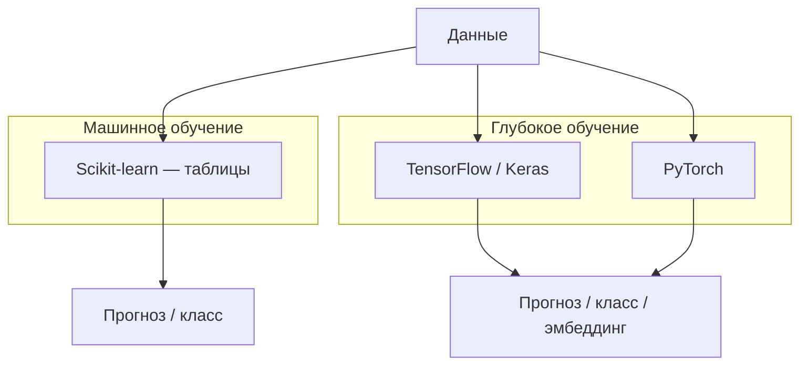

# Keras и TensorFlow — нейросети

<div class="article-tags">
  <span class="tag tag-beginner">ДЛЯ НОВИЧКОВ</span>
</div>

<span class="complexity-badge">Разработчику</span>

**TensorFlow** — платформа глубокого обучения от Google: вычислительный граф, автоматическое дифференцирование, GPU/TPU, экспорт в **TensorFlow Lite** (мобильные устройства) и **TensorFlow.js** (браузер). **Keras** с TensorFlow 2.x встроен как высокоуровневый API (`tf.keras`) для быстрой сборки и обучения сетей.

Табличные задачи на старте проще закрыть **scikit-learn** — см. [Scikit-learn](/encyclopedia/6-ai/6-02-mashinnoe-obuchenie/10). Keras уместен, когда нужны **изображения**, **последовательности**, **эмбеддинги** или глубокие архитектуры (CNN, LSTM, трансформеры). Теория нейрона и слоёв — [Нейрон](/encyclopedia/6-ai/6-03-neyroseti/1); первый код без фреймворка — [перцептрон на NumPy](/encyclopedia/6-ai/6-03-neyroseti/2).

---

## ML и DL в одной картине



| | Scikit-learn | Keras (TensorFlow) |
|---|--------------|-------------------|
| Данные | Таблицы, разреженные матрицы | Тензоры (изображения, последовательности) |
| Признаки | Часто готовят вручную (pandas) | Извлекаются слоями сети |
| Обучение | CPU, секунды–минуты | GPU желателен для больших моделей |
| Типичные задачи | Цена, отток, кластеры | CV, NLP, аудио |

Раздел **глубокое обучение** в [Машинное обучение](/encyclopedia/6-ai/6-02-mashinnoe-obuchenie/1#глубокое-обучение) даёт расширенные примеры CNN и RNN; здесь — компактный практический маршрут.

---

## Установка и проверка

```bash
pip install tensorflow
```

```python
import tensorflow as tf
print(tf.__version__)
print("GPU:", tf.config.list_physical_devices("GPU"))
```

---

## Sequential — слои друг за другом

Модель для табличных или простых задач (бинарная классификация после нормализации):

```python
import tensorflow as tf
from sklearn.datasets import load_breast_cancer
from sklearn.model_selection import train_test_split
from sklearn.preprocessing import StandardScaler

X, y = load_breast_cancer(return_X_y=True)
X_train, X_test, y_train, y_test = train_test_split(
    X, y, test_size=0.2, random_state=42, stratify=y
)

scaler = StandardScaler()
X_train = scaler.fit_transform(X_train)
X_test = scaler.transform(X_test)

model = tf.keras.Sequential([
    tf.keras.layers.Dense(64, activation="relu", input_shape=(X_train.shape[1],)),
    tf.keras.layers.Dropout(0.3),
    tf.keras.layers.Dense(32, activation="relu"),
    tf.keras.layers.Dense(1, activation="sigmoid"),
])

model.compile(
    optimizer="adam",
    loss="binary_crossentropy",
    metrics=["accuracy"],
)

history = model.fit(
    X_train, y_train,
    epochs=30,
    batch_size=32,
    validation_split=0.2,
    verbose=0,
)

loss, acc = model.evaluate(X_test, y_test, verbose=0)
print(f"Test accuracy: {acc:.3f}")
```

| Параметр `compile` | Когда использовать |
|--------------------|------------------|
| `binary_crossentropy` | Два класса, выход `sigmoid` |
| `sparse_categorical_crossentropy` | Несколько классов, метки — целые числа 0…K-1 |
| `categorical_crossentropy` | Несколько классов, метки — one-hot |
| `mse` | Регрессия, выход `linear` |

---

## MNIST — первая свёрточная сеть

```python
from tensorflow.keras.datasets import mnist
from tensorflow.keras.layers import Conv2D, MaxPooling2D, Flatten, Dense
from tensorflow.keras.utils import to_categorical

(x_train, y_train), (x_test, y_test) = mnist.load_data()
x_train = x_train.reshape(-1, 28, 28, 1).astype("float32") / 255.0
x_test = x_test.reshape(-1, 28, 28, 1).astype("float32") / 255.0
y_train = to_categorical(y_train, 10)
y_test = to_categorical(y_test, 10)

cnn = tf.keras.Sequential([
    Conv2D(32, 3, activation="relu", input_shape=(28, 28, 1)),
    MaxPooling2D(2),
    Conv2D(64, 3, activation="relu"),
    MaxPooling2D(2),
    Flatten(),
    Dense(128, activation="relu"),
    Dense(10, activation="softmax"),
])

cnn.compile(optimizer="adam", loss="categorical_crossentropy", metrics=["accuracy"])
cnn.fit(x_train, y_train, epochs=5, batch_size=128, validation_split=0.1, verbose=1)
cnn.evaluate(x_test, y_test, verbose=0)
```

Свёрточные слои (`Conv2D`) ищут локальные паттерны (штрихи, углы); пулинг уменьшает размер карты признаков. Такие сети — основа [распознавания объектов и лиц](/encyclopedia/6-ai/6-06-primenenie-ii/120).

---

## Functional API — ветвления и несколько входов

Когда нужны общие слои, несколько входов или выходов:

```python
inputs = tf.keras.Input(shape=(100,))
x = tf.keras.layers.Dense(128, activation="relu")(inputs)
x = tf.keras.layers.Dropout(0.5)(x)
outputs = tf.keras.layers.Dense(10, activation="softmax")(x)
model = tf.keras.Model(inputs=inputs, outputs=outputs)
model.compile(optimizer="adam", loss="categorical_crossentropy", metrics=["accuracy"])
```

---

## Callbacks и ранняя остановка

```python
callbacks = [
    tf.keras.callbacks.EarlyStopping(
        monitor="val_loss", patience=5, restore_best_weights=True
    ),
    tf.keras.callbacks.ModelCheckpoint(
        "best.keras", monitor="val_accuracy", save_best_only=True
    ),
]

model.fit(X_train, y_train, epochs=100, validation_split=0.2, callbacks=callbacks)
```

**EarlyStopping** останавливает обучение, когда validation перестаёт улучшаться — защита от переобучения. Подробнее — [смещение и дисперсия](/encyclopedia/6-ai/6-02-mashinnoe-obuchenie/8).

---

## Сохранение и инференс

```python
model.save("model.keras")
restored = tf.keras.models.load_model("model.keras")
restored.predict(X_test[:5])
```

Для мобильных устройств — экспорт в **TFLite**; для сервера — **SavedModel** или ONNX. Обзор продакшен-развёртывания — [Применение ИИ в продакшене](/encyclopedia/6-ai/6-06-primenenie-ii/113).

---

## PyTorch — альтернатива

**PyTorch** (Meta) популярен в исследованиях и среди LLM/CV-команд: динамический граф, `torch.nn`, экосистема Hugging Face. Идеи те же (слои, loss, optimizer); синтаксис другой.

Практический вход с установкой, autograd, градиентным спуском и сквозным пайплайном — в статье [PyTorch для разработчика](/encyclopedia/5-languages/5-02-python/333). После [перцептрона на NumPy](/encyclopedia/6-ai/6-03-neyroseti/2) это естественный следующий шаг.

| Выбор | Ориентир |
|-------|----------|
| Учебник, Kaggle, корпоративный Google-стек | TensorFlow / Keras |
| Исследование, кастомные архитектуры, HF-модели | PyTorch |

---

## Дальше по маршруту

1. [Transfer learning](/encyclopedia/6-ai/6-02-mashinnoe-obuchenie/3) — EfficientNet, заморозка слоёв.
2. [Распознавание лиц, объектов и текста](/encyclopedia/6-ai/6-06-primenenie-ii/120) — YOLO, OCR, NER.
3. [Облачные Cognitive API](/encyclopedia/6-ai/6-05-razrabotka-ii/120) — если своё обучение не нужно.
4. [Большие языковые модели](/encyclopedia/6-ai/6-04-modeli-i-instrumenty/1) — трансформеры поверх тех же идей эмбеддингов.
