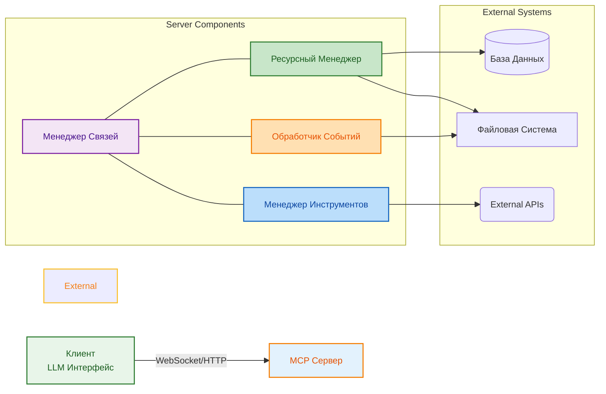

# MCP-серверы

<div class="article-tags">
  <span class="tag tag-required">ОБЯЗАТЕЛЬНО</span>
  <span class="tag tag-beginner">ДЛЯ НОВИЧКОВ</span>
</div>

<span class="complexity-badge">Всем</span>

## MCP-серверы

## Протокол MCP

**MCP** — это Model Context Protocol. Этот стандарт коммуникации позволяет моделям искусственного интеллекта взаимодействовать с внешними системами и данными через унифицированный интерфейс. Протокол определяет правила обмена сообщениями между клиентом, который запускает модель, и сервером, который предоставляет доступ к конкретным источникам информации или инструментам.

Протокол разрабатывается сообществом для решения проблемы фрагментации в области интеграции ИИ с инфраструктурой предприятия. Различные системы требуют различных методов подключения. MCP объединяет эти методы под единый контракт.

Основная задача протокола создание общего стандарта, который работает одинаково для всех типов моделей и всех типов подключений. Это упрощает разработку новых интеграций и расширяет возможности существующих систем без изменения базовой архитектуры.

Протокол поддерживает три основных направления:

1. Предоставление контекста — источники данных, к которым модель получает доступ;
2. Инструменты — функции, которые модель может вызывать для выполнения действий;
3. Ресурсы — постоянные данные и метаданные, которые доступны модели во время сеанса работы.

Все эти элементы передаются в формате JSON, что обеспечивает совместимость с множеством языков программирования и платформ. Структура сообщений чётко определена и не требует дополнительных соглашений при внедрении.

---

## История создания

Появление MCP связано с потребностью индустрии в стандартизации взаимодействия между языковыми моделями и корпоративными системами. Ранние реализации использовали различные проприетарные форматы подключения. Каждая платформа требовала собственной адаптации и настройки. Это создавало сложности при масштабировании и поддержке интеграций.

Первая версия прототипа появилась в середине 2025 года как экспериментальное решение внутри нескольких компаний. Участники проекта зафиксировали потребность в едином интерфейсе для подключения источников данных к нейросетям. Эксперименты показали эффективность унификации в вопросах безопасности и контроля доступа.

В начале 2026 года проект получил открытый статус. Разработчики опубликовали спецификацию на GitHub и привлекли сторонних участников из разных организаций. К концу первого квартала 2026 года протокол достиг статуса бета версии с поддержкой основных платформ.

Текущая стадия развития включает расширение поддержки типов ресурсов и инструментов. Сообщество продолжает добавлять новые категории подключений и улучшать документацию.

Основные этапы эволюции протокола:

| Дата | Событие | Статус |
|-----|--------|--------|
| 2025-06 | Прототип внутри компании | Internal |
| 2025-09 | Первый публичный релиз | Alpha |
| 2025-12 | Открытие репозитория | Public Release |
| 2026-01 | Бета версия | Beta |
| 2026-05 | Стабильная версия | Stable |

Протокол поддерживается некоммерческой группой энтузиастов. Финансирование осуществляется через гранты и добровольные взносы участников сообщества. Никакие патентные ограничения не мешают свободному использованию стандарта в коммерческих проектах.

---

## Архитектура протокола

Архитектура MCP строится на принципах клиент серверного взаимодействия. Клиент инициирует подключение и запрашивает услуги у сервера. Сервер отвечает на запросы и предоставляет доступ к данным или функционалу.

Взаимодействие происходит через два канала связи: прямой сокет или HTTP соединение. Выбор конкретного метода зависит от конфигурации среды развертывания. Оба способа поддерживают асинхронную доставку сообщений.

Серверная часть содержит несколько модулей:

**Ресурсный менеджер** — отвечает за доступ к файлам, базам данных и другим постоянным источникам;

**Менеджер инструментов** — реализует функции, которые могут быть вызваны внешними клиентами;

**Обработчик событий** — управляет потоком данных и уведомлениями о изменениях;

**Менеджер связей** — обеспечивает соединение между клиентом и сервером.

Каждый компонент работает независимо и обменивается данными через внутренний шину сообщений. Это позволяет масштабировать отдельные части системы без влияния на общую производительность.



Клиентская сторона содержит библиотеку для обработки входящих сообщений и отправку запросов. Эта библиотека существует для нескольких языков программирования включая JavaScript, Python и C#.

Процесс соединения состоит из следующих шагов:

1. **Подключение** — клиент устанавливает TCP соединение с сервером;
2. **Инициализация** — сервер отправляет список доступных возможностей;
3. **Запрос ресурсов** — клиент запрашивает нужный источник данных;
4. **Вызов инструментов** — клиент инициирует выполнение внешней функции;
5. **Отправка результатов** — сервер возвращает ответ с результатами;
6. **Завершение** — канал разъединяется по окончании работы.

Каждый шаг подтверждается специальным кодом состояния. Ошибки фиксируются в лог и передаются в виде структурированных объектов.

---

## Типы ресурсов

Rесурсы представляют собой любые данные, которые модель может прочитать во время работы. К ресурсам относятся файлы, базы данных, конфигурационные параметры и другие постоянные источники информации.

Типы ресурсов классифицируются по способу доступа и формату хранения:

**Файловые ресурсы** — предоставляют доступ к файловой системе. Модели могут читать текстовые файлы, скрипты и конфигурации;

**Базовые ресурсы** — работают с реляционными и нереляционными базами данных. Запросы выполняются через безопасные ограничители прав доступа;

**API ресурсы** — обращаются к внешним веб сервисам через HTTP запросы. Данные передаются в форматах JSON или XML;

**Конфигуративные ресурсы** — содержат системные настройки и переменные окружения. Доступ к этим параметрам контролируется политикой безопасности.

Структура описания ресурса содержит обязательные поля:

| Поле | Тип | Описание |
|-----|-----|----------|
| uri | string | Уникальный идентификатор ресурса |
| name | string | Человеко читаемое имя |
| mimeType | string | Формат содержимого |
| size | number | Размер в байтах |
| lastModified | timestamp | Время последнего изменения |

Пример определения файла через протокол:

```json
{
  "uri": "file:///var/log/app.log",
  "name": "Лог приложения",
  "mimeType": "text/plain",
  "size": 1048576,
  "lastModified": "2026-05-10T14:30:00Z"
}
```

Для чтения содержимого клиент использует команду ReadResource. Сервер возвращает полный текст или бинарные данные в зависимости от типа ресурса. Доступ к чувствительным файлам блокируется на уровне прав пользователя.

Ресурсы могут изменяться во время работы. Система уведомляет клиента об изменениях через событие ResourceUpdated. Клиент обновляет кэш и загружает актуальные данные.

---

## Типы инструментов

Инструменты определяют набор функций, которые модель может вызывать для выполнения действий в внешней среде. Эти функции расширяют возможности анализа и создают возможность автоматизации задач.

Классификация инструментов основана на уровне доступа и типу выполняемых операций:

**Системные инструменты** — обеспечивают управление процессами, файлами и сетевыми настройками. Эти функции требуют повышенных прав доступа;

**Прикладные инструменты** — работают с конкретными программными продуктами. Например обработка документов или взаимодействие с CRM системой;

**Информационные инструменты** — предоставляют справочные данные и выполняют вычисления. Используются для генерации ответов на вопросы;

**Административные инструменты** — контролируют состояние системы и ведут логи. Необходимы для мониторинга и диагностики.

Описание инструмента содержит следующие параметры:

| Поле | Тип | Описание |
|-----|-----|----------|
| name | string | Имя инструмента для идентификации |
| description | string | Полное описание функционала |
| inputSchema | object | Схема входных параметров |
| outputType | string | Тип возвращаемых данных |

Пример описания инструмента проверки статуса сервиса:

```json
{
  "name": "checkServiceStatus",
  "description": "Получение текущего статуса внешнего сервиса",
  "inputSchema": {
    "type": "object",
    "properties": {
      "serviceUrl": {
        "type": "string",
        "description": "URL проверяемого сервиса"
      },
      "timeout": {
        "type": "integer",
        "description": "Максимальное время ожидания в секундах"
      }
    },
    "required": ["serviceUrl"]
  },
  "outputType": "JSON"
}
```

При вызове инструмента клиент отправляет параметры в формате JSON. Сервер выполняет функцию и возвращает результат. Ошибки исполнения сопровождаются кодом и описанием.

Безопасность инструментов обеспечивается через систему разрешений. Пользователь видит только те функции, к которым имеет доступ согласно политике организации.

---

## Развертывание сервера

Развертывание MCP сервера начинается с выбора платформы и установки необходимых компонентов. Процесс отличается в зависимости от выбранной среды выполнения.

Системные требования для базовой конфигурации включают:

| Компонент | Минимум | Рекомендовано |
|-----------|---------|---------------|
| CPU | 2 ядра | 4+ ядра |
| RAM | 4 ГБ | 8 ГБ |
| SSD | 10 ГБ | 20 ГБ |
| Node.js | 18.x | 20.x LTS |
| ОС | Linux/Windows/MacOS | Linux Ubuntu 22.04 |

Установка через пакетный менеджер Node.js:

```bash
npm install @modelcontextprotocol/server-core
```

Или использование Docker контейнера:

```bash
docker pull mcp-server:v1.0
docker run --rm -p 3000:3000 mcp-server:v1.0
```

Конфигурация сервера хранится в файле config.json:

```json
{
  "server": {
    "port": 3000,
    "host": "0.0.0.0",
    "sslEnabled": true
  },
  "resources": [
    {
      "type": "filesystem",
      "path": "/Данные/resources",
      "readonly": false
    },
    {
      "type": "database",
      "connectionString": "postgresql://localhost:5432/mcp_db",
      "readonly": true
    }
  ],
  "tools": [
    {
      "name": "checkDiskSpace",
      "enabled": true
    },
    {
      "name": "listProcesses",
      "enabled": false
    }
  ],
  "authentication": {
    "method": "jwt",
    "secret": "<your_secret_key>",
    "expireMinutes": 60
  }
}
```

Запуск сервера выполняется командой:

```bash
node server/index.js --config=config.json
```

Для фоновой работы используют systemd сервис:

```ini
[Unit]
Description=MCP Server Service
After=Сеть.target

[Service]
Type=simple
User=mcp
ExecStart=/usr/bin/node /opt/mcp-server/index.js
Restart=always
RestartSec=10

[Install]
WantedBy=multi-user.target
```

Активация службы:

```bash
sudo systemctl daemon-reload
sudo systemctl enable mcp-server
sudo systemctl start mcp-server
```

Проверка статуса:

```bash
systemctl status mcp-server
journalctl -u mcp-server --no-pager
```

Следующие шаги включают настройку firewall и SSL сертификатов для производственной среды.

---

## Использование сервера

Использование MCP сервера включает подключение клиента, выбор нужных ресурсов и инструментов, а также выполнение операций. Процесс начинается с инициализации соединения.

Клиентская программа подключается к серверу через порт 3000 по умолчанию:

```javascript
const { MCPCoreClient } = require('@modelcontextprotocol/client');

async function connect() {
  const client = new MCPCoreClient('ws://localhost:3000');
  
  await client.connect();
  
  // Получение списка доступных ресурсов
  const resources = await client.listResources();
  console.log('Доступные ресурсы:', resources);
  
  // Чтение контента
  const content = await client.readResource({
    uri: 'file:///var/log/app.log'
  });
  
  console.log('Содержимое:', content);
  
  // Вызов инструмента
  const result = await client.callTool({
    name: 'checkDiskSpace',
    arguments: { path: '/Данные' }
  });
  
  console.log('Результат:', result);
  
  await client.close();
}

connect().catch(console.error);
```

Python вариант подключения:

```python
from modelcontextprotocol import MCPClient

async def main():
    async with MCPClient('http://localhost:3000') as client:
        # Подключение и получениеcapabilities
        capabilities = await client.initialize()
        print("Capabilities:", capabilities)
        
        # Список ресурсов
        resources = await client.list_resources()
        print("Resources:", resources)
        
        # Чтение файла
        log_content = await client.read_resource("file:///var/log/app.log")
        print("Log:", log_content[:500])
        
        # Вызов инструмента
        disk_result = await client.call_tool(
            "check_disk_space",
            {"path": "/Данные"}
        )
        print("Disk Status:", disk_result)

import asyncio

asyncio.run(main())
```

Команды взаимодействия:

| Команда | Описание | Параметры | Ответ |
|---------|----------|-----------|-------|
| Initialize | Инициализация соединения | none | Capabilities объект |
| ListResources | Получить список ресурсов | none | Массив ресурсов |
| ReadResource | Читать содержимое | uri | Строка или бинарные данные |
| CallTool | Выполнить инструмент | name, arguments | Результат выполнения |
| Subscribe | Подписаться на события | resourceURI | Подтверждение подписки |
| Unsubscribe | Отписаться от событий | resourceURI | Подтверждение отписки |
| Close | Завершить сеанс | none | Пустой ответ |

Обработка ошибок осуществляется через try catch блок. Код ошибки содержит код состояния и текстовое описание проблемы.

```javascript
try {
  const result = await client.callTool({
    name: 'forbiddenOperation',
    arguments: {}
  });
} catch (error) {
  console.error(`Ошибка ${error.code}: ${error.message}`);
}
```

Логирование операций помогает отслеживать активность клиентов и обнаруживать подозрительные действия.

---

## Безопасность и контроль доступа

Безопасность MCP сервера базируется на нескольких уровнях защиты. Каждый уровень предотвращает определенные типы угроз.

Аутентификация пользователей осуществляется через JWT токены. Токен содержит информацию о ролях и правах доступа. Сервер проверяет подпись и срок действия токена.

Авторизация определяет доступ к конкретным ресурсам и инструментам. Политика прав задаётся на уровне администратора. Каждый пользователь получает набор разрешений согласно должности и задачам.

Шифрование трафика обеспечивает TLS соединение. Для внутренних сетей можно использовать незашифрованный режим. Настройки выбираются при запуске сервера.

Фильтрация ввода защищает от инъекций и переполнения буфера. Все входящие данные проходят валидацию перед обработкой.

Лимиты использования предотвращают перегрузку системы. Каждый клиент ограничен количеством запросов в минуту и общим объёмом передаваемых данных.

Модель разрешения прав доступа:

| Права | Описание | Пример |
|-------|----------|--------|
| read | Только чтение данных | Просмотр файлов логов |
| write | Изменение содержимого | Обновление базы данных |
| execute | Выполнение инструментов | Запуск скриптов |
| admin | Полный доступ | Управление конфигурацией |

Пример политики доступа:

```json
{
  "policies": [
    {
      "role": "developer",
      "permissions": ["read", "execute"],
      "resources": ["/code/*", "/logs/app/*"],
      "tools": ["analyzeCode", "runTests"]
    },
    {
      "role": "admin",
      "permissions": ["read", "write", "execute", "admin"],
      "resources": ["*"],
      "tools": ["*"]
    }
  ]
}
```

Мониторинг активности записывает все запросы в отдельный журнал. Администратор может анализировать логи и выявлять злоупотребления.

Система оповещений уведомляет о подозрительных событиях. Например множественные попытки входа с одного IP адреса.

---

## Расширение функциональности

Расширение MCP сервера позволяет добавить новые типы ресурсов и инструментов. Разработка нового расширения включает следующие этапы.

Создание нового модуля начинается с определения интерфейса:

```typescript
export interface CustomResourceProvider {
  type: string;
  listResources(): Promise<Resource[]>;
  readResource(uri: string): Promise<Buffer>;
}
```

Регистрация модуля происходит в конфигурационном файле:

```json
{
  "extensions": [
    {
      "name": "CustomFileSystem",
      "path": "./extensions/custom_fs.js",
      "settings": {
        "basePath": "/custom/Данные",
        "maxFileSize": 10485760
      }
    }
  ]
}
```

Реализация расширенного инструмента:

```typescript
class CustomTool {
  name = 'getWeather';
  description = 'Получение погоды по городу';
  
  async execute(args: Record<string, any>): Promise<any> {
    const city = args.city;
    // Вызов погодного API
    return { temperature: 22, condition: 'sunny' };
  }
}

// Регистрация инструмента
server.registerTool(new CustomTool());
```

Компиляция расширений в отдельный файл:

```bash
tsc --outDir ./dist --module commonjs
```

Тестирование новых функций проводится через unit тесты:

```typescript
test('CustomTool returns correct weather Данные', async () => {
  const tool = new CustomTool();
  const result = await tool.execute({ city: 'Moscow' });
  expect(result.temperature).toBeGreaterThan(0);
});
```

Документирование новых возможностей включает описание входных и выходных параметров. Клиенты получают информацию через команду ListTools.

Механизм обновления плагинов позволяет добавлять функциональность без перезапуска сервера. Это уменьшает время простоя при развертывании изменений.

---
