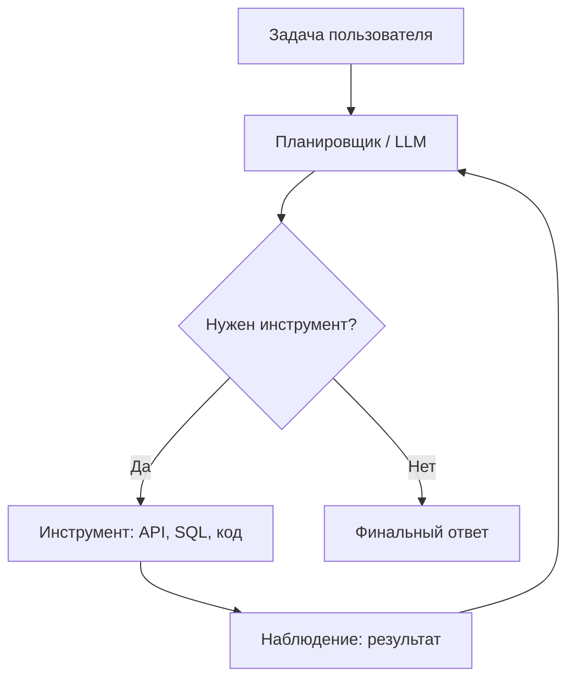
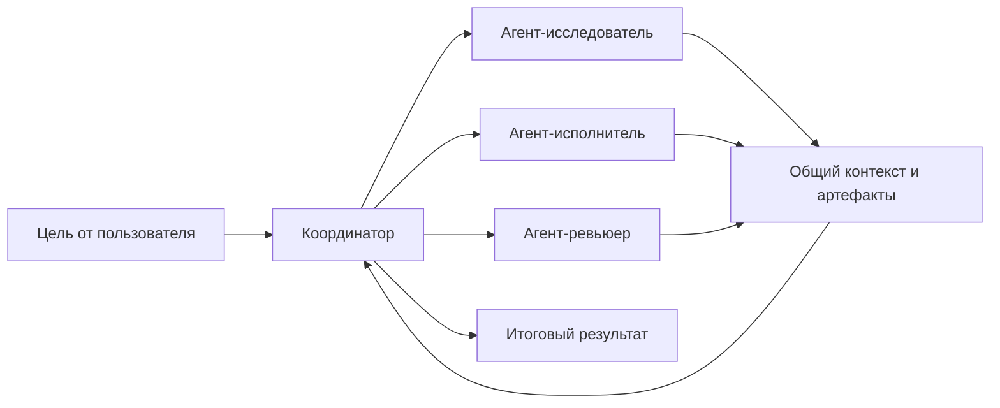

import ExternalPlayEmbed from '@site/src/components/ExternalPlayEmbed';

---

# Агенты искусственного интеллекта

  ОБЯЗАТЕЛЬНО

Разработчику

<ExternalPlayEmbed example="ai/react-loop-play" title="ReAct-цикл" minHeight={480} />

**Агент ИИ** — система, где языковая модель **не только отвечает текстом**, но и **выбирает действия** — вызвать API, выполнить запрос к БД, открыть тикет, сгенерировать файл. Отличие от обычного чата — **замкнутый цикл** "мысль → действие → результат → следующий шаг".

Основа: [генеративный ИИ](/encyclopedia/6-ai/6-01-vvedenie-v-ii/12), [модели и API](/encyclopedia/6-ai/6-04-modeli-i-instrumenty/1). Агент здесь — **слой исполнения**; знания из документов даёт **RAG**, стандартизированные tools — **MCP** — см. [три слоя архитектуры](./121). Правила в `.cursor/rules` и AGENTS.md — продолжение [библиотеки промптов](/lab/Примеры/1150). Классическая таксономия (рефлекс, модель среды, цели, полезность, обучение) — в [Типах интеллектуальных агентов](./120).

---

## Архитектура LLM-агента

Компоненты:

| Компонент | Назначение |
|-----------|------------|
| **Оркестратор** | Управляет шагами, лимитом итераций, таймаутами |
| **Инструменты (tools)** | Контракты: имя, параметры, описание для модели |
| **Память** | Краткая (в контексте) и долгая (векторное хранилище, профиль пользователя) |
| **Политики** | Что агенту запрещено (удаление данных, внешние платежи) |

В IDE и десктопах с LLM набор tools часто подключают через **[MCP](/encyclopedia/6-ai/6-04-modeli-i-instrumenty/114)** — единый протокол вместо отдельной интеграции под каждый GitHub, БД или файловый каталог. Отличие MCP от продуктового REST — в [сравнении с классическим API](/encyclopedia/6-ai/6-04-modeli-i-instrumenty/114#mcp-i-api).

---

## Память агента

Три уровня памяти путают чаще всего — у каждого своя зона ответственности:

| Уровень | Что хранит | Срок жизни | Пример |
|---------|------------|------------|--------|
| **Контекстное окно** | Текущий диалог, результаты tools | Одна сессия / один запрос | Последние 20 сообщений в `messages` |
| **RAG** | Факты из **документов** организации | Пока актуален индекс | Цитата из wiki, PDF, тикета |
| **Память агента (profile)** | Факты о **пользователе** и прошлых сессиях | Между визитами | "Предпочитает доставку курьером", "заказ #1042 в работе" |

**RAG** отвечает на вопрос "что написано в базе знаний". **Память агента** — "что мы уже знаем об этом человеке и что делали в прошлый раз". Без второго поддержка каждый раз начинается с нуля, даже если RAG идеален.

Типичная реализация долгой памяти:

1. После диалога — извлечь **атомарные факты** (имя, предпочтения, статус заказа).
2. Сохранить в vector store или key-value с привязкой к `user_id`.
3. При новом запросе — **retrieve** релевантные воспоминания и добавить в system prompt или tool context.

Библиотека **[Mem0](https://github.com/mem0ai/mem0)** автоматизирует extract → store → recall поверх любой LLM. Альтернатива — свой слой на [векторной БД](/encyclopedia/3-data-markup/3-06-nosql/812) с явной политикой TTL и удаления по запросу пользователя (GDPR, 152-ФЗ).

  
Не кладите секреты в долгую память

  

  Пароли, токены и платёжные данные не должны попадать в эмбеддинги и логи памяти. Храните только то, что пользователь осознанно разрешил запомнить, с возможностью просмотра и удаления.
  

Практика: [CartMate — support agent с Mem0](https://github.com/Sumanth077/Hands-On-AI-Engineering/tree/main/ai_agents/ai_customer_support_agent) — в [Практикуме — проекты по ИИ](/encyclopedia/6-ai/6-05-razrabotka-ii/122).

---

## Паттерны проектирования

**ReAct (Reason + Act)** — модель чередует рассуждение вслух и вызов инструмента. Удобно отлаживать: в логах видно, почему агент пошёл в SQL.

**План-and-execute** — сначала полный план, потом выполнение шагов. Стабильнее на длинных задачах, хуже адаптируется к неожиданной ошибке на шаге 3.

**Мультиагент** — несколько ролей ("аналитик", "кодер", "рецензент"). Дороже по токенам и латентности; оправдано в сложных pipeline, не в простом FAQ-боте. Паттерны потока (конвейер, параллель, router, debate) и стек инструментов — [Оркестрация AI-агентов](/encyclopedia/6-ai/6-05-razrabotka-ii/121).

## Мультиагентные системы

**Мультиагентная система (МАС)** объединяет несколько ИИ-агентов в одну рабочую схему. Каждый агент отвечает за свой этап, а вместе они решают общую задачу бизнеса или продукта.

Для новичка полезно держать в голове простую модель:

- **агент** в этом контексте — программа на базе LLM, которая получает цель, вызывает инструменты и возвращает результат;
- **мультиагентность** — распределение одной большой задачи между несколькими агентами;
- **общий контур** — единые правила, память и контроль действий через оркестратор.

### Как устроена МАС

Архитектура строится на разделении труда.

- Большая задача делится на подзадачи.
- Подзадачи получают агенты с разной специализацией.
- Промежуточные результаты складываются в общий артефакт.
- Финальный ответ проходит проверку перед отправкой пользователю.

Ключевые свойства МАС

- **Автономия** — каждый агент использует собственную логику, память и набор инструментов. Обычно это API, базы данных, поиск и файловые операции.
- **Взаимодействие** — агенты обмениваются сообщениями и координируют шаги через стандартизированные интерфейсы, включая [MCP](/encyclopedia/6-ai/6-04-modeli-i-instrumenty/114).
- **Оркестрация** — агент-координатор назначает роли, маршрутизирует данные между участниками и собирает итоговый ответ.
- **Наблюдаемость** — команда видит логи и трассировку шагов, поэтому сбои легче диагностировать. Практики эксплуатации подробно разобраны в [AgentOps и MLOps — о разделе](/encyclopedia/6-ai/6-08-agentops/intro).

### Почему МАС дают выигрыш

МАС повышают качество и устойчивость за счёт архитектуры.

- **Снижение галлюцинаций** — один агент формирует решение, второй проверяет факты или тесты, третий делает критический разбор.
- **Параллелизм гипотез** — несколько агентов решают задачу с разных подходов, а система выбирает лучший вариант или объединяет сильные части. Этот подход часто называют **Mixture-of-Agents**.
- **Устойчивость** — ошибка в одном шаге не ломает весь процесс. Оркестратор повторяет шаг, меняет стратегию или передаёт задачу другому агенту.
- **Масштабируемость** — новые роли добавляются как отдельные агенты без полной переделки всей системы.

### Где применяют МАС

**Корпоративный Service Desk**

Один агент классифицирует тикет, второй подбирает решение через [RAG](/encyclopedia/6-ai/6-04-modeli-i-instrumenty/121), третий проверяет корректность и закрывает обращение по политике SLA.

- **RAG** (Retrieval-Augmented Generation) добавляет в ответ факты из базы знаний компании.
- **SLA** (Service Level Agreement) задаёт целевое время реакции и закрытия обращений.

**Разработка ПО**

Агент-исследователь собирает контекст по репозиторию, агент-разработчик готовит патч, агент-критик запускает тесты и проводит ревью перед merge.

- Поток "исследование → реализация → проверка" снижает число пропущенных ошибок.
- Подход особенно полезен в больших кодовых базах и в задачах с множеством зависимостей.
- Про практическую оркестрацию ролей можно читать в [Оркестрация AI-агентов](/encyclopedia/6-ai/6-05-razrabotka-ii/121).

**Аналитика и логистика**

Группа агентов моделирует поставки, проверяет ограничения и предлагает сценарии с учётом рисков по срокам и стоимости.

- Один агент строит прогноз спроса.
- Второй проверяет ограничения склада и транспорта.
- Третий предлагает оптимальный план с пояснением рисков.

Для старта по теме рядом полезны:

- [Агенты искусственного интеллекта](/encyclopedia/6-ai/6-04-modeli-i-instrumenty/116)
- [RAG, MCP и агенты — три слоя архитектуры](/encyclopedia/6-ai/6-04-modeli-i-instrumenty/121)
- [Типы интеллектуальных агентов](/encyclopedia/6-ai/6-04-modeli-i-instrumenty/120)
- [AgentOps и LLM-стек — слои 4-7](/encyclopedia/6-ai/6-08-agentops/1)

---

## Безопасность

Агент наследует риски LLM и **умножает** их:

- **Prompt injection** — вредоносный текст в документе заставляет агент выполнить лишний tool call.
- **Over-permission** — агент с правами администратора БД при ошибке модели.
- **Бесконечный цикл** — без `max_iterations` и бюджета токенов.

Митигации — минимальные права (least privilege), allow-list инструментов, human-in-the-loop на деструктивных операциях, изоляция песочницы для кода.

В **мультиагентной** среде риск умножается — модель, спокойная в одиночном чате, может **подхватить деструктивные стратегии** соседей при дефиците ресурсов и слабых санкциях. Публичный разбор на длинном горизонте — эксперимент [Emergence World](./122) (Season 1, Emergence AI) — сравнение Claude, Gemini, Grok и GPT-5-mini в виртуальном городе с общей энергией и голосованиями.

  
Чеклист для tool call "shell" / "terminal"

  

  Перед выполнением команды, которую предложил агент — путь, флаги Git (`reset --hard`, `clean -fdx`, `push --force`), отсутствие `curl | bash`.

  Стоп-лист для разработчика — [Опасные скрипты](/encyclopedia/8-infra-security/8-03-zabota-o-kode-i-dannyh/101).

  

В корпоративной среде Microsoft стек часто строят на **Azure AI Foundry / Agent Service** — детали продукта меняются; принципы выше остаются.

---

## Когда агент не нужен

Обычный RAG-чат или классификатор дешевле и предсказуемее, если:

- нет побочных эффектов от действий;
- ответ всегда из фиксированной базы знаний;
- SLA по задержке жёсткий (&lt; 500 ms).

Агент оправдан для **сценариев с инструментами**: "создай отчёт по продажам за квартал и положи в SharePoint".

---

## Практика

Модуль [Начало работы с агентами ИИ в Azure](https://learn.microsoft.com/ru-ru/training/modules/ai-agent-fundamentals/) (~49 мин) — после [генеративного введения](/encyclopedia/6-ai/6-01-vvedenie-v-ii/12). Каталог: [/tools/documentation/6](/tools/documentation/6).

---

## Итоги

Агент = LLM + инструменты + контроль цикла. Проектируйте права, лимиты и наблюдаемость так же строго, как для микросервиса с доступом к продакшену. Угрозы (промпт-инъекции, sandbox, утечки) — [Безопасность при работе с ИИ](/encyclopedia/6-ai/6-10-bezopasnost-pri-rabote-s-ii/1). Эксплуатация в проде — [AgentOps](/encyclopedia/8-infra-security/8-04-devops-ci-cd/2151); контекст через [AGENTS.md и skills](/encyclopedia/8-infra-security/8-04-devops-ci-cd/2153).

---
