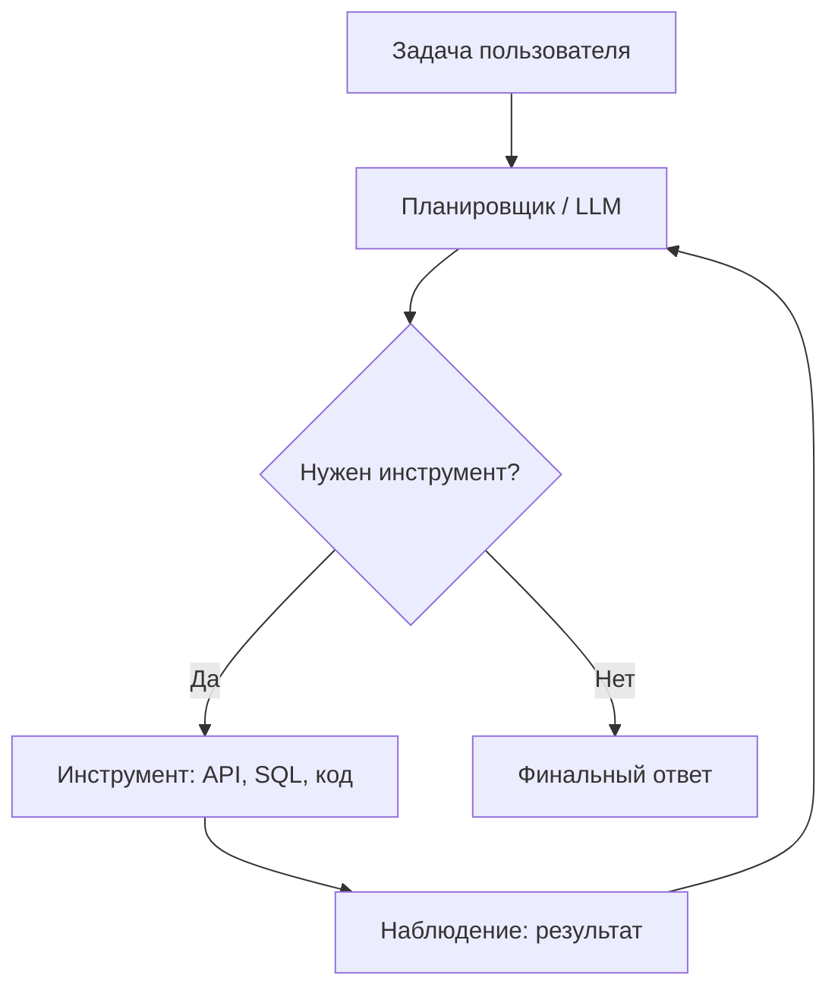

# Агенты искусственного интеллекта

  ОБЯЗАТЕЛЬНО

Разработчику

**Агент ИИ** — система, где языковая модель **не только отвечает текстом**, но и **выбирает действия**: вызвать API, выполнить запрос к БД, открыть тикет, сгенерировать файл. Отличие от обычного чата — **замкнутый цикл** «мысль → действие → результат → следующий шаг».

Основа: [генеративный ИИ](/encyclopedia/6-ai/6-01-vvedenie-v-ii/12), [модели и API](/encyclopedia/6-ai/6-04-modeli-i-instrumenty/1).

---

## Архитектура агента

Компоненты:

| Компонент | Назначение |
|-----------|------------|
| **Оркестратор** | Управляет шагами, лимитом итераций, таймаутами |
| **Инструменты (tools)** | Контракты: имя, параметры, описание для модели |
| **Память** | Краткая (в контексте) и долгая (векторное хранилище, профиль пользователя) |
| **Политики** | Что агенту запрещено (удаление данных, внешние платежи) |

---

## Паттерны проектирования

**ReAct (Reason + Act)** — модель чередует рассуждение вслух и вызов инструмента. Удобно отлаживать: в логах видно, почему агент пошёл в SQL.

**План-and-execute** — сначала полный план, потом выполнение шагов. Стабильнее на длинных задачах, хуже адаптируется к неожиданной ошибке на шаге 3.

**Мультиагент** — несколько ролей («аналитик», «кодер», «рецензент»). Дороже по токенам и латентности; оправдано в сложных pipeline, не в простом FAQ-боте.

---

## Безопасность

Агент наследует риски LLM и **умножает** их:

- **Prompt injection** — вредоносный текст в документе заставляет агент выполнить лишний tool call.
- **Over-permission** — агент с правами администратора БД при ошибке модели.
- **Бесконечный цикл** — без `max_iterations` и бюджета токенов.

Митигации: минимальные права (least privilege), allow-list инструментов, human-in-the-loop на деструктивных операциях, изоляция песочницы для кода.

В корпоративной среде Microsoft стек часто строят на **Azure AI Foundry / Agent Service** — детали продукта меняются; принципы выше остаются.

---

## Когда агент не нужен

Обычный RAG-чат или классификатор дешевле и предсказуемее, если:

- нет побочных эффектов от действий;
- ответ всегда из фиксированной базы знаний;
- SLA по задержке жёсткий (&lt; 500 ms).

Агент оправдан для **сценариев с инструментами**: «создай отчёт по продажам за квартал и положи в SharePoint».

---

## Практика

Модуль [Начало работы с агентами ИИ в Azure](https://learn.microsoft.com/ru-ru/training/modules/ai-agent-fundamentals/) (~49 мин) — после [генеративного введения](/encyclopedia/6-ai/6-01-vvedenie-v-ii/12). Каталог: [/tools/documentation/6](/tools/documentation/6).

---

## Итоги

Агент = LLM + инструменты + контроль цикла. Проектируйте права, лимиты и наблюдаемость так же строго, как для микросервиса с доступом к продакшену.

---
