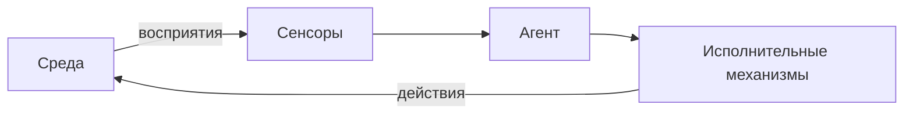
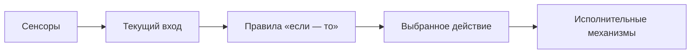
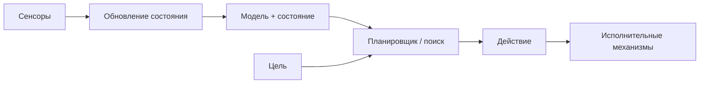
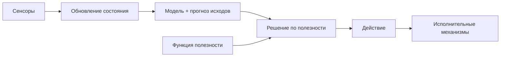
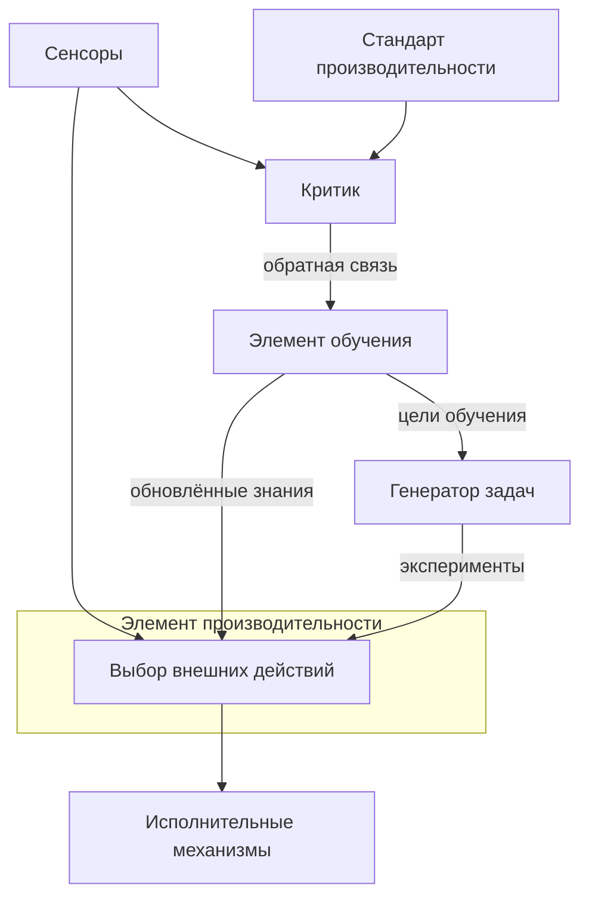

# Типы интеллектуальных агентов

Разработчику

В классической теории ИИ (**Russell & Norvig**, курс MIT, схемы вроде [ByteByteGo — Types of AI Agents](https://bytebytego.com)) **интеллектуальный агент** — сущность, которая через **сенсоры** получает **восприятия** (*percepts*) из **среды**, обрабатывает их и через **исполнительные механизмы** (*actuators*, *effectors*) отдаёт **действия** (*actions*). Чем сложнее внутренняя схема принятия решений, тем богаче поведение в частично наблюдаемой и меняющейся среде.

Современные **LLM-агенты** ([Агенты ИИ](./116)) наследуют те же идеи — цикл "наблюдение → решение → действие", память, цели и обратная связь. Ниже — пять базовых архитектур, от которых удобно отталкиваться при проектировании.

---

## Общая схема

| Элемент | Роль |
|---------|------|
| **Среда** | Всё, с чем взаимодействует агент (физический мир, API, чат, база данных) |
| **Сенсоры** | Датчики, парсеры, webhook, чтение логов — всё, что даёт вход |
| **Исполнительные механизмы** | Моторы, HTTP-запросы, shell, отправка сообщения пользователю |
| **Агент** | Логика выбора действия по восприятиям (и, при необходимости, по внутреннему состоянию) |

---

## 1. Простой рефлексный агент

**Simple reflex agent** действует **только по текущему восприятию**, без памяти прошлых шагов.

Внутри — таблица или набор **condition-action rules** (правил "условие → действие"). Пример: *если температура выше порога — включить вентилятор*.

| Плюсы | Минусы |
|-------|--------|
| Простота, предсказуемость, низкая задержка | Не видит скрытое состояние среды |
| Легко тестировать | Ошибается, если одного датчика недостаточно |

**Аналоги в разработке:** middleware "если статус 500 — retry", простые webhook без контекста, жёсткий routing в чат-боте по ключевым словам.

---

## 2. Модельный рефлексный агент

**Model-based reflex agent** хранит **внутреннее состояние**, которое обновляется после каждого восприятия. Состояние отражает то, что **сейчас не видно** сенсорами, но важно для решения (где был робот, открыта ли дверь, есть ли незакоммиченные файлы в сессии).

**Модель среды** описывает, как мир меняется от действий агента и от внешних факторов. Правила срабатывают уже по **состоянию + модели**, а не по одному датчику.

| Плюсы | Минусы |
|-------|--------|
| Работа в частично наблюдаемой среде | Нужно поддерживать модель и синхронизацию состояния |
| Учитывает "историю" в сжатом виде | Ошибка модели накапливается |

**Аналоги:** сессия пользователя в веб-приложении, контекст диалога в LLM, кэш "последний известный статус заказа" перед вызовом API.

---

## 3. Целевой агент

**Goal-based agent** явно хранит **цель** (*goal*) и выбирает действия, которые ведут к её достижению. Вместо фиксированных "если — то" используется **планирование** или **поиск**: "что будет, если сделать A?" и "приблизит ли это к цели?".

Цель можно **менять** без переписывания всех правил — достаточно подставить новую спецификацию цели. Агент гибче рефлексного, но дороже по вычислениям (перебор планов, граф состояний).

**Аналоги:** LLM-агент с задачей "собери отчёт за квартал"; план-and-execute в [Агентах ИИ](./116); маршрутизация "доставить посылку в точку B".

---

## 4. Утилитарный агент

**Utility-based agent** похож на целевой, — — $3. Один и тот же целевой результат может отличаться по риску, времени, стоимости или комфорту — утилита позволяет **сравнивать компромиссы**.

Пример: две стратегии доставки заказа — быстрая дорогая и медленная дешёвая; цель одна ("доставить"), утилита взвешивает время, деньги и репутацию.

**Аналоги:** ранжирование ответов RAG по score; выбор модели по цене/latency; multi-objective оптимизация в MLOps.

---

## 5. Обучающийся агент

**Learning agent** улучшает поведение со временем в **неизвестной** или меняющейся среде. Классическая схема делит агента на четыре блока:

| Компонент | Назначение |
|-----------|------------|
| **Элемент производительности** | То, что во внешнем мире выглядит как "агент" (как в типах 1–4) |
| **Элемент обучения** | Улучшает элемент производительности по обратной связи |
| **Критик** | Сравнивает наблюдаемые исходы со **стандартом производительности** |
| **Генератор задач** | Предлагает **эксперименты** — действия ради нового опыта, даже если они субоптимальны сейчас |

Такой агент сочетает эксплуатацию (делать лучшее известное) и исследование (пробовать новое). Подробнее про награды и среду — [обучение с подкреплением](/encyclopedia/6-ai/6-02-mashinnoe-obuchenie/1) и [нейросети — обучение с подкреплением](/encyclopedia/6-ai/6-03-neyroseti/112).

**Аналоги:** fine-tuning и RLHF; A/B тесты промптов; агент, который по логам ошибок дополняет allow-list инструментов.

---

## Сравнение типов

| Тип | Память / состояние | Цель | Оценка вариантов | Обучение |
|-----|-------------------|------|------------------|----------|
| Простой рефлексный | нет | в правилах | нет | нет |
| Модельный рефлексный | да | в правилах | нет | нет |
| Целевой | да | явная цель | поиск / план | нет |
| Утилитарный | да + прогноз | цель + компромиссы | функция полезности | нет |
| Обучающийся | да | стандарт + цели обучения | критик + эксперименты | да |

Сложность и гибкость растут сверху вниз; и стоимость ошибки, и требования к данным и наблюдаемости — тоже.

---

## Связь с LLM-агентами

Современный **LLM-агент** ([Агенты ИИ](./116)) обычно совмещает несколько уровней сразу:

| Классический тип | Где проявляется в LLM-стеке |
|------------------|----------------------------|
| Рефлексный | Жёсткие guardrails, "если tool = delete — спроси человека" |
| Модельный | Контекст чата, RAG, профиль пользователя |
| Целевой | Системный промпт с задачей, ReAct, plan-and-execute |
| Утилитарный | Выбор модели, temperature, ранжирование документов |
| Обучающийся | LoRA, eval-наборы, разбор логов агента в проде |

Практический вывод — перед внедрением агента полезно явно ответить — достаточно ли правил по текущему входу, нужна ли память состояния, как сформулирована цель, по какой метрике сравнивать планы и где будет обратная связь для улучшения.

---

## Итоги

Пять типов — **лестница выразительности**, а не взаимоисключающие продукты. Простой рефлекс покрывает автоматику с полным наблюдением; модель и цели нужны в частично наблюдаемых задачах; утилита — когда важны компромиссы; обучение — когда среда или предпочтения меняются быстрее, чем успевают обновлять правила вручную. LLM-агенты в продакшене почти всегда строят на комбинации этих слоёв плюс инженерный контроль цикла и прав.

---
