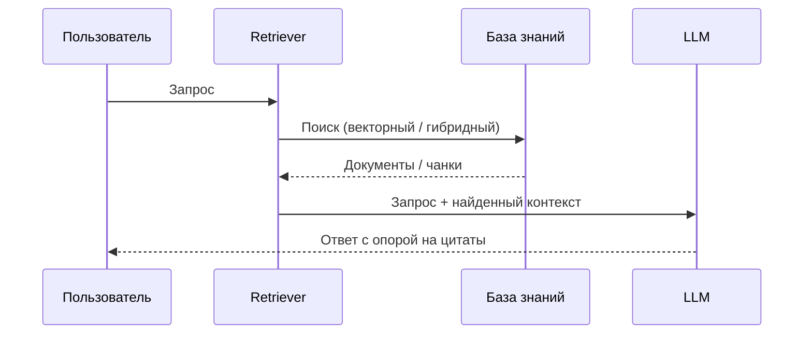
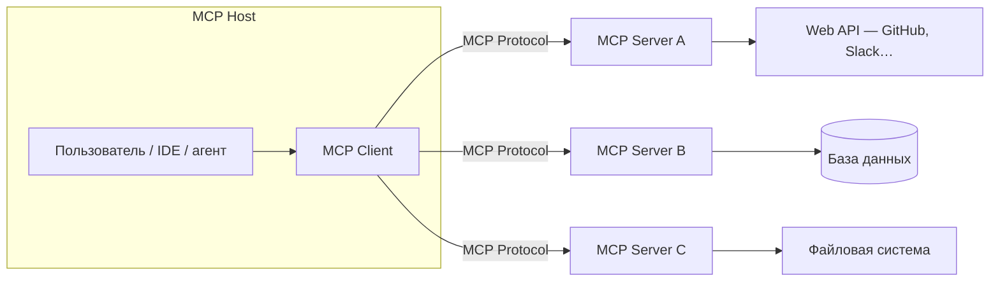
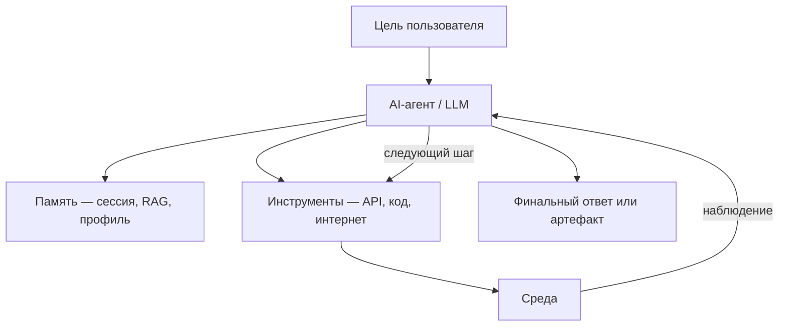
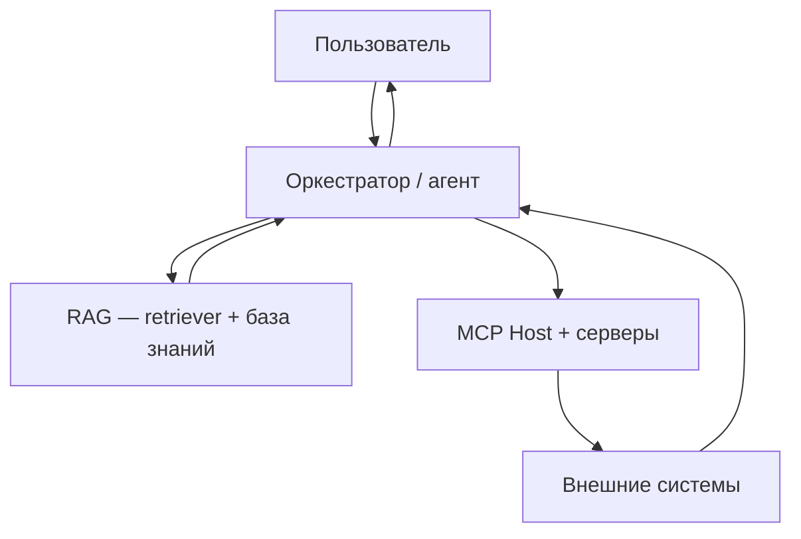

# RAG, MCP и агенты — три слоя архитектуры

  ОБЯЗАТЕЛЬНО
  ДЛЯ НОВИЧКОВ

Архитектору
Разработчику
Аналитику

В продакшене на одной LLM редко останавливаются. Типичное приложение собирают из **трёх паттернов**, которые решают разные задачи и часто работают вместе. Схема в духе [ByteByteGo — MCP, RAG and AI Agents](https://bytebytego.com) удобна как «шпаргалка архитектора»: что за что отвечает и куда смотреть в ТЗ.

| Слой | Паттерн | Вопрос, на который отвечает |
|------|---------|------------------------------|
| **Знания** | **RAG** (Retrieval-Augmented Generation) | Откуда модель берёт **факты** о ваших документах и данных? |
| **Подключения** | **MCP** (Model Context Protocol) | Как модель **единым способом** достучится до API, БД и файлов? |
| **Исполнение** | **AI-агент** | Кто **планирует шаги**, вызывает инструменты и реагирует на результат? |

Три паттерна **дополняют** друг друга: RAG подмешивает текст в промпт, MCP стандартизирует доступ к внешнему миру, агент замыкает цикл «решение → действие → наблюдение». В [семи слоях LLM-стека](/encyclopedia/6-ai/6-05-razrabotka-ii/119) RAG и агенты сидят в основном на **слое 4 (оркестрация)**; MCP — на стыке слоёв 4 и 6 (интеграция).

---

## RAG — слой знаний

**RAG** — это **дополнение генерации поиском**: LLM получает не только вопрос пользователя, но и **релевантные фрагменты** из вашей базы знаний (PDF, wiki, тикеты, код, векторный индекс).

Задача RAG — ответы по **внутренним** материалам без дообучения всей модели на каждый новый документ. Модель остаётся «общей», а актуальные цитаты подставляются **на время запроса**.

Типичные источники в базе знаний:

- корпоративные PDF и Markdown;
- **векторные БД** (эмбеддинги чанков) — см. [Векторные базы данных](/encyclopedia/3-data-markup/3-06-nosql/812);
- репозитории кода и API-спеки;
- иногда — полнотекстовый поиск (Elasticsearch и аналоги) вместе с векторным.

Этапы внедрения (кратко): индексация и чанкинг → эмбеддинги → retriever по запросу → сборка промпта → генерация. Готовый шаблон system/user для RAG — [Prompt engineering — библиотека промптов](/lab/Примеры/1150#rag). Подробнее — в [Генеративном ИИ](/encyclopedia/6-ai/6-01-vvedenie-v-ii/12), [Работе с ИИ-моделями](/encyclopedia/6-ai/6-05-razrabotka-ii/113) и [Основах разработки ИИ-решений](/encyclopedia/6-ai/6-05-razrabotka-ii/1).

  
Граница ответственности RAG

  

  RAG **читает** и **цитирует**. Создание тикета, запись в Git или отправка письма — зона агента или отдельного orchestration-кода с вызовом API.
  

---

## MCP — слой подключений

**MCP** — стандартный способ дать LLM **доступ к инструментам и ресурсам** через единый протокол. Хост (IDE, десктоп с Claude, корпоративный агент) подключает один или несколько **MCP-серверов**; каждый сервер объявляет, что можно **прочитать** (resources), **вызвать** (tools) и какие **шаблоны промптов** (prompts) доступны.

Примеры «серверов по буквам» из типовых схем:

| Сервер | Что даёт модели |
|--------|------------------|
| **A** | REST и SaaS — issues, сообщения, календарь |
| **B** | SQL/NoSQL — выборки и отчёты по схеме с ограничениями |
| **C** | Файлы — чтение конфигов, логов, репозитория в песочнице |

MCP **дополняет** продуктовый REST: мобильное приложение по-прежнему ходит в ваш бэкенд; MCP-сервер может быть тонкой обёрткой с **allow-list** операций для агента. Сравнение с классическим API — в [MCP и классический API](/encyclopedia/6-ai/6-04-modeli-i-instrumenty/114#mcp-i-api); развёртывание и безопасность — в статье [MCP-серверы](./114).

---

## AI-агент — слой исполнения

**AI-агент** (в смысле LLM-агента) — система, где модель **принимает решения и выполняет действия**: вызвать tool, перепланировать шаг, запомнить результат, повторить цикл. Это **исполнительный** слой поверх «голого» чата.

Характерные свойства:

| Свойство | Смысл |
|----------|--------|
| **Автономность** | Несколько шагов без ручного ввода на каждый вызов API |
| **Память** | Краткая (контекст) и долгая (векторное хранилище, профиль) |
| **Инструменты** | Function calling, MCP tools, выполнение кода в песочнице |
| **Реактивность** | Новое наблюдение меняет следующий шаг (ошибка SQL, пустой ответ API) |

Классическая таксономия агентов (рефлекс, модель среды, цели) — [Типы интеллектуальных агентов](./120). Практика LLM-агентов, ReAct, безопасность tool calls — [Агенты искусственного интеллекта](./116).

---

## Как слои складываются в одном продукте

Типичный **корпоративный copilot** может выглядеть так:

1. **RAG** подтягивает регламенты и фрагменты тикетов в промпт.
2. **MCP** даёт агенту ограниченный доступ к Jira, Confluence и внутренней БД.
3. **Агент** решает, нужен ли только ответ или цепочка действий («создай черновик отчёта и приложи к задаче»).

**Поддержка по базе знаний** — чаще достаточно **RAG + низкая temperature** ([параметры генерации](./118)), без агента.

**Автоматизация с побочными эффектами** (запись в БД, деплой, платежи) — нужен **агент** с жёсткими политиками; RAG и MCP — его «глаза» и «руки».

**IDE с Cursor / Claude Desktop** — **MCP** подключает репозиторий и API; агентский цикл встроен в хост; RAG по проекту может быть частью индексации IDE или отдельным MCP-resource.

---

## Что выбрать на старте

| Сценарий | Достаточно | Почему |
|----------|------------|--------|
| FAQ по внутренней wiki | RAG | Нет действий во внешних системах |
| Чат с доступом к GitHub issues | MCP (+ простой промпт) | Нужны tools, мало автономии |
| «Собери отчёт и загрузи в SharePoint» | Агент + MCP (+ опционально RAG) | Многошаговый план и побочные эффекты |
| Классификация писем | Ни RAG, ни MCP, ни агент | Достаточно fine-tuned модели или правил |

  
Порядок внедрения

  

  Сначала **RAG** на качественных чанках и eval-наборе вопросов. Затем **MCP** с минимальным allow-list tools. Агент включайте, когда появляются **сценарии с инструментами** и принят риск-профиль (лимиты итераций, human-in-the-loop, [Опасные скрипты](/encyclopedia/8-infra-security/8-03-zabota-o-kode-i-dannyh/101)).
  

---

## Итоги

- **RAG** — runtime-знания из ваших документов и индексов.
- **MCP** — стандартизированные «розетки» для tools и ресурсов.
- **AI-агент** — цикл рассуждения и действий в среде.

Три паттерна описывают **разные слои** одной архитектуры; в зрелом продукте они часто соседствуют. Детали по каждому слою — в связанных статьях выше и в [Семи слоях LLM-стека](/encyclopedia/6-ai/6-05-razrabotka-ii/119).

---
