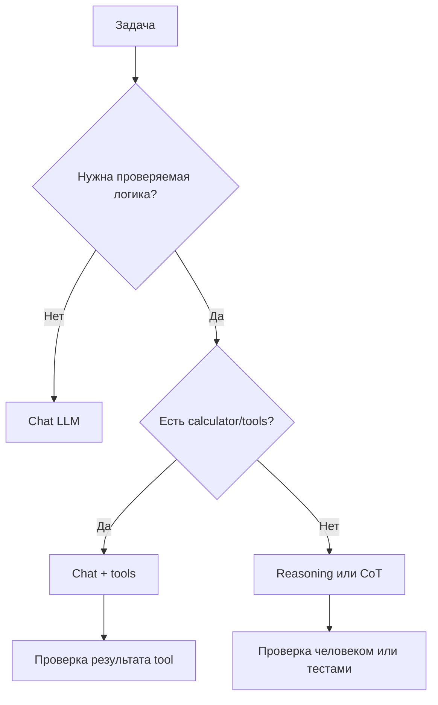
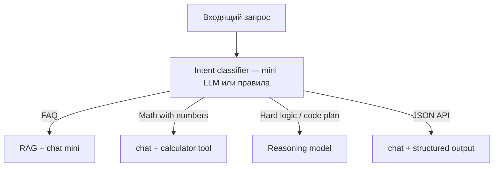
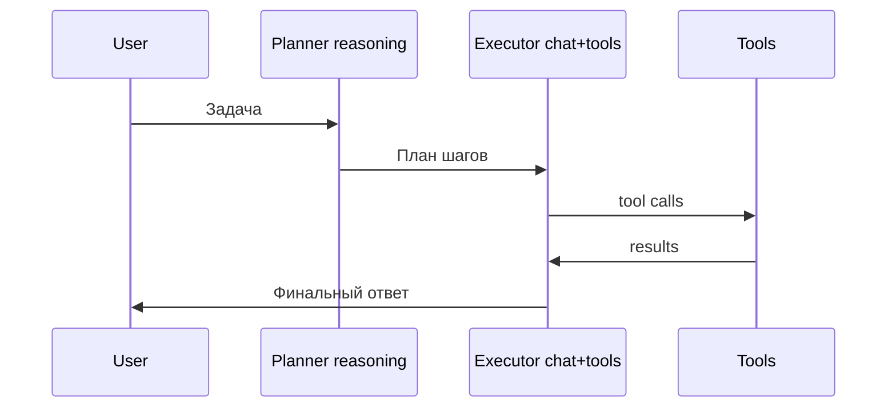

# Reasoning-модели

<div class="article-tags">
  <span class="tag tag-beginner">ДЛЯ НОВИЧКОВ</span>
</div>

<span class="complexity-badge">Всем</span>

---

**Reasoning-модели** (рассуждающие LLM) — чат-модели, которые перед финальным ответом генерируют длинную **цепочку промежуточных шагов**: "Шаг 1… Шаг 2… Следовательно…". Примеры — OpenAI **o-series** (o1, o3, o4-mini), **DeepSeek-R1**, режимы extended thinking у Claude и Gemini.

Базовая теория LLM — [большие языковые модели](./1). Про "думает ли модель как человек" — [мифы и реальность](/encyclopedia/6-ai/6-01-vvedenie-v-ii/114). Цены и thinking tokens — [сколько стоит ИИ](./126).

<div class="callout callout--tip">
  <div class="callout-title">Термины</div>

  <div class="callout-body">
  <strong>LLM</strong> (large language model) — большая языковая модель; предсказывает следующий токен текста.<br/>
  <strong>CoT</strong> (Chain-of-Thought) — приём "решай по шагам" в промпте или в обучении модели.<br/>
  <strong>Thinking tokens</strong> — служебные токены рассуждения; часто тарифицируются отдельно и увеличивают счёт.<br/>
  <strong>Latency</strong> — задержка ответа; у reasoning-моделей она выше, чем у обычного чата.<br/>
  <strong>RLHF</strong> (reinforcement learning from human feedback) — дообучение модели по оценкам людей.<br/>
  <strong>Tool</strong> — внешняя функция (калькулятор, API), которую модель вызывает через код.
  </div>
</div>

---

## Как устроены reasoning-модели

Reasoning — это **метод обучения и генерации**, отдельный "разум" в коробке:

- модель **дольше пишет** промежуточные шаги (длинный CoT);
- на математике и логике её **донастраивают** (RLHF, preference tuning) — за правильные цепочки дают "награду";
- на один запрос уходит **больше токенов** → выше цена и задержка.

Модель по-прежнему **предсказывает токены** по статистике. "Рассуждение" — устойчивый текстовый паттерн из обучающих данных и специального обучения, а не внутренний монолог сознательного агента.


У части API блок thinking **скрыт** от пользователя; у DeepSeek-R1 его иногда показывают отдельно от финального ответа.

### От обычного CoT в промпте к reasoning-модели

| Подход | Кто пишет цепочку | Где живёт логика |
|--------|-------------------|------------------|
| CoT в промпте | Вы просите "по шагам" | В вашем тексте |
| Self-consistency | Модель × N прогонов | Постобработка в коде |
| Reasoning-модель | Модель сама генерирует thinking | Внутри обучения + inference |

Reasoning-модель экономит вам **инженерию промпта** на сложных задачах, но берёт плату **токенами и временем**.

### Что происходит в одном запросе (пошагово)

**Шаг 1.** API получает system + user message.

**Шаг 2.** Модель начинает генерировать **thinking** — текст, который пользователю может не показывать.

**Шаг 3.** Модель завершает thinking и переходит к **финальному ответу**.

**Шаг 4.** Биллинг считает input + output (thinking обычно в output).

**Шаг 5.** Ваш код парсит только финальный блок (если thinking скрыт).

Подробнее про параметры длины — [118](./118).

---

## История и линейка продуктов (упрощённо)

| Период | Событие | Смысл для разработчика |
|--------|---------|------------------------|
| 2022 | Chain-of-Thought в промпте | Можно улучшить chat без новой модели |
| 2023–2024 | Self-consistency, ReAct | Агенты + tools |
| 2024 | OpenAI o1 | Reasoning "из коробки" в API |
| 2025 | o3, o4-mini, DeepSeek-R1 | Конкуренция, падение цены на reasoning |
| 2025+ | Extended thinking у Claude/Gemini | Несколько режимов в одном продукте |

Официальные страницы (проверяйте актуальные названия моделей):

- [OpenAI models](https://platform.openai.com/docs/models)
- [DeepSeek API](https://api-docs.deepseek.com/)
- [Anthropic Claude](https://docs.anthropic.com/)
- [Google Gemini](https://ai.google.dev/gemini-api/docs)

---

## Сравнение с обычным чатом

| | Обычный GPT-4o / Claude Sonnet | Reasoning (o-series, R1) |
|--|-------------------------------|---------------------------|
| Скорость | Быстрее (секунды) | Медленнее (секунды–минуты) |
| Стоимость | Ниже | Выше (thinking-токены в счёте) |
| Математика, логика, олимпиадные задачи | Хорошо с CoT в промпте | Часто лучше "из коробки" |
| Черновик текста, перефраз | Отлично | Избыточно и дорого |
| Строгий JSON для API | Удобно через [structured output](/encyclopedia/6-ai/6-05-razrabotka-ii/123) | Не всегда лучший выбор |
| SLA чат-бота | Подходит | Риск timeout |
| Batch offline | Дешёвые модели | Дорого на 10k строк |

Reasoning имеет смысл для **многошаговых проверяемых** задач (алгоритм, разбор legacy-кода). Для "напиши письмо" достаточно обычной chat-модели — см. [как выбрать модель](./125) и [стоимость](./126).



---

## Как получить похожий эффект без reasoning-модели

До o-series и R1 те же идеи давали **промпт и архитектура**:

| Метод | Суть | Стоимость |
|-------|------|-----------|
| **Chain-of-Thought** | В промпте явно просите "решай по шагам" | +output токены |
| **Self-consistency** | Несколько прогонов, выбор частого ответа | ×N запросов |
| **ReAct** | Чередование "мысль → вызов инструмента → результат" | tools + несколько шагов |
| **Калькулятор / код** | Точная арифметика через [function calling](/encyclopedia/6-ai/6-05-razrabotka-ii/123) | дешевле reasoning |
| **Decomposition** | Разбить задачу на подзадачи в коде | инженерия |

В продакшене часто **дешевле** связка "обычная LLM + tools + калькулятор", чем reasoning на каждый запрос.

### Пример промпта CoT (без reasoning-модели)

```
Реши задачу по шагам.
Шаг 1 — выпиши данные.
Шаг 2 — формула.
Шаг 3 — вычисление.
Шаг 4 — ответ одной строкой.
Задача: ...
```

Шаблоны — [Prompt engineering — библиотека](/lab/Примеры/1150).

---

## Когда reasoning уместен

**Подходит**

- сложная отладка алгоритма без готовых тестов;
- многошаговая логика (головоломки, соревновательные задачи);
- разбор незнакомого кода, где нужен план, а не однострочный патч;
- архитектурный brainstorm с последующей фиксацией человеком;
- задачи, где **нет** готового tool, но есть время на ревью.

**Лучше выбрать другой подход**

- ответы по документам — сначала [RAG](./121), а не "думать вместо базы";
- юридические и медицинские выводы без эксперта;
- чат поддержки с жёстким SLA по времени ответа;
- массовый batch, где thinking-токены съедят бюджет — см. [стоимость](./126);
- строгий JSON для интеграции — [structured output](/encyclopedia/6-ai/6-05-razrabotka-ii/123);
- простая арифметика — калькулятор.

---

## Ограничения

1. **Галлюцинация в thinking-блоке** — уверенная, но неверная цепочка; финальный ответ следует из ошибки.
2. **Арифметика** — 17×23 надёжнее через `calc` или tool, чем через prose модели.
3. **Скрытые токены** — сложнее понять, где модель "сошла с rails".
4. **Смена версии модели** — меняет длину thinking без предупреждения.
5. **Timeout** — reverse proxy обрывает долгий ответ.
6. **Непредсказуемый счёт** — thinking длина плавает.

Проверяйте **результат**, не красоту рассуждения — [критический анализ](/encyclopedia/6-ai/6-06-primenenie-ii/114).

---

## Аппаратный потолок современных LLM

Для новичка полезно держать простую картину. В больших LLM много времени уходит на движение данных внутри системы. Сами вычисления тоже важны, но итоговая скорость часто упирается в то, как быстро передаются веса и активации.

Термины этого блока

- **FLOPS** — количество операций с плавающей точкой в секунду, "сырая" вычислительная мощность;
- **HBM** — быстрая память рядом с GPU;
- **шина данных** — канал, по которому компоненты передают данные;
- **interconnect** — высокоскоростное соединение между ускорителями и узлами;
- **инференс** — запуск уже обученной модели на пользовательском запросе;
- **MoE** (Mixture of Experts) — архитектура, где для одного токена активируется только часть "экспертов", а не вся сеть.

Что происходит на практике

- модель читает веса из памяти;
- модель выполняет слой или группу слоёв;
- промежуточные активации и новые данные передаются дальше по тракту памяти;
- цикл повторяется много раз до финального токена.

Где возникает ограничение

- пропускная способность HBM;
- задержки при обмене между устройствами через interconnect;
- скорость подгрузки весов с локального накопителя в специализированных схемах;
- качество компилятора и планировщика, которые раскладывают граф вычислений по памяти и устройствам.

Почему обсуждают разреженные схемы

- активируются только нужные блоки модели;
- уменьшается объём вычислений на каждый токен;
- снижается часть трафика в памяти при хорошем маршрутизаторе;
- появляется шанс запускать более крупные модели на том же железе.

В итоге конкуренция в железе и инфраструктуре усиливается вокруг памяти и передачи данных. Поэтому растёт роль специалистов по FPGA и схемотехнике. Их задачи включают новые контроллеры памяти, новые схемы interconnect и более эффективную организацию инференса под ИИ-нагрузки.

См. также

- [Семь слоев LLM-стека](/encyclopedia/6-ai/6-05-razrabotka-ii/119)
- [Как выбрать модель и где ее запускать](./125)
- [Сколько стоит ИИ](./126)

---

## Тарификация и thinking tokens

Thinking tokens попадают в **output** (или отдельную строку прайса). Один короткий вопрос может породить **тысячи** thinking tokens.

### Формула стоимости одного запроса

```
cost ≈ (input_tokens × price_in + (thinking_tokens + answer_tokens) × price_out) / 1_000_000
```

Цены меняются — сверяйте прайс провайдера. Метод расчёта — [126](./126).

### Сравнительная таблица (ориентиры, не оферта)

| Модель (класс) | Input $/1M | Output $/1M | Thinking | Типичный запрос |
|----------------|------------|-------------|----------|-----------------|
| Chat mini | 0.10–0.30 | 0.40–1.20 | нет | $0.0003–0.002 |
| Chat flagship | 1.50–5.00 | 6.00–15.00 | нет | $0.01–0.05 |
| Reasoning mid | 1.00–3.00 | 4.00–12.00 | в output | $0.03–0.15 |
| Reasoning top | 3.00–15.00 | 12.00–60.00 | в output | $0.10–0.50+ |

**Пример A.** Задача по логике, input 400 токенов, thinking 6000, ответ 300. При $3 / $12 за 1M:

```
input  = 400 × 3 / 1e6   = $0.0012
output = 6300 × 12 / 1e6 = $0.0756
total  ≈ $0.077
```

**Пример B.** Тот же вопрос chat-модели с CoT в промпте, output 800:

```
input  = 500 × 0.15 / 1e6 = $0.000075
output = 800 × 0.60 / 1e6 = $0.00048
total  ≈ $0.0006
```

Reasoning дороже в **~100×** на этом примере — оправдан, только если chat стабильно ошибается.

### Пример C. 200 reasoning-запросов в месяц для команды

| Метрика | Значение |
|---------|----------|
| Запросов | 200 |
| Средний cost | $0.08 |
| **Итого** | **$16/мес** |

Тот же объём на chat + tools может быть **$2–5**, если tools закрывают математику.

### Пример D. Prod-бот с reasoning "по умолчанию" (антипаттерн)

| Метрика | Значение |
|---------|----------|
| Запросов/день | 1000 |
| $/запрос | $0.06 |
| Дней | 30 |
| **Итого** | **$1800/мес** |

**Исправление:** router — 95% на mini chat, 5% на reasoning по флагу `needs_deep_reasoning`.

---

## Примеры API

### OpenAI o-series (Responses / Chat Completions)

Актуальные имена моделей — в [документации OpenAI](https://platform.openai.com/docs/models). Пример структуры запроса (Python, openai SDK):

```python
from openai import OpenAI

client = OpenAI()  # OPENAI_API_KEY из окружения

response = client.chat.completions.create(
    model="o4-mini",  # замените на актуальное имя из docs
    messages=[
        {"role": "system", "content": "Ты помощник. Отвечай кратко после внутреннего анализа."},
        {"role": "user", "content": "Сколько раз встречается буква 'а' в слове 'abracadabra'? Покажи только финальный ответ."},
    ],
    max_completion_tokens=8000,
)

print(response.choices[0].message.content)
print(response.usage)
```

Поле `usage.completion_tokens` включает thinking + финальный текст. Логируйте каждый запрос — [126](./126).

Больше примеров HTTP — [lab/Примеры/1149](/lab/Примеры/1149).

### DeepSeek-R1

[DeepSeek API](https://api-docs.deepseek.com/) совместим по форме с OpenAI. Модель `deepseek-reasoner` возвращает reasoning_content и content:

```python
from openai import OpenAI

client = OpenAI(
    api_key="YOUR_DEEPSEEK_KEY",
    base_url="https://api.deepseek.com",
)

resp = client.chat.completions.create(
    model="deepseek-reasoner",
    messages=[
        {"role": "user", "content": "Докажи, что сумма первых n нечётных чисел равна n². Финальный ответ — одним абзацем."},
    ],
)

msg = resp.choices[0].message
# reasoning_content может быть доступен как доп. поле — см. актуальную docs
print("Answer:", msg.content)
print("Usage:", resp.usage)
```

R1 часто **дешевле** западных reasoning на сопоставимых задачах — пересчитывайте на **ваших** бенчмарках.

### Claude extended thinking

У Anthropic режим thinking включается параметрами API (см. [docs](https://docs.anthropic.com/)). Смысл тот же — отдельный budget на внутренние токены.

### Gemini thinking

Google Gemini 2.x family поддерживает режимы с расширенным "размышлением" — см. [Gemini API](https://ai.google.dev/gemini-api/docs).

---

## Router. Когда включать reasoning



Псевдокод router:

```python
def route(user_text: str) -> str:
    if is_faq(user_text):
        return "gpt-4o-mini"
    if needs_exact_math(user_text):
        return "gpt-4o-mini+tools"
    if user_text.startswith("/deep"):
        return "o4-mini"
    return "gpt-4o-mini"
```

Флаг `/deep` или кнопка в UI — явное согласие пользователя на **медленный и дорогой** режим.

---

## Практические рекомендации

| Задача | Подход | Почему |
|--------|--------|--------|
| Домашка по математике | Reasoning или CoT + ручная проверка | Учебный разбор шагов |
| Калькулятор в приложении | Tool/API | Точность |
| Code review | Сильный chat + тесты — [117](./117) | Reasoning избыточен |
| Архитектурный brainstorm | Reasoning; решение фиксирует человек | План, не прод |
| Support FAQ | RAG + mini | SLA и цена |
| Олимпиадная задача | Reasoning | Многошаговая логика |
| Генерация маркeting текста | Chat | Скорость |

Параметры генерации — [118](./118).

---

## Кейсы из практики

### Кейс 1. Алгоритмическая задача в интервью

**Контекст.** Кандидат использует o1 для live coding.

**Плюс.** План решения сильнее, чем у chat без CoT.

**Минус.** Latency 30–90 сек — интервьюер ждёт.

**Вывод.** Для интервью — chat + озвучивание шагов человеком; reasoning — для домашней подготовки.

### Кейс 2. SQL-оптимизация

**Контекст.** Reasoning-модель предложила переписать запрос с CTE.

**Проверка.** `EXPLAIN ANALYZE` на staging — план хуже оригинала.

**Вывод.** Reasoning дал **правдоподобный** текст; истина — в БД, не в prose.

### Кейс 3. Стартап включил reasoning на все сообщения

**Счёт.** Вырос с $40 до $620 за месяц.

**Fix.** Router + 92% запросов на mini.

**Итог.** $55/мес, качество на FAQ без изменений.

### Кейс 4. DeepSeek-R1 для русскоязычного разбора кода

**Контекст.** Legacy PHP, мало тестов.

**Результат.** План рефакторинга полезен; конкретный патч — с ошибкой в типах.

**Вывод.** Reasoning для **плана**, chat+tests для **патча**.

---

## Пошаговый сценарий. Выбор между chat и reasoning

**Шаг 1.** Запишите задачу одним предложением.

**Шаг 2.** Прогоните **chat mini + CoT** в промпте.

**Шаг 3.** Проверьте результат (тест, калькулятор, эксперт).

**Шаг 4.** Если ошибка критична и повторяется — прогоните **reasoning** на 5 эталонных примерах.

**Шаг 5.** Сравните **accuracy**, **latency**, **$/запрос**.

**Шаг 6.** Если reasoning +5% accuracy, но +20× цена — оставьте chat + tools.

**Шаг 7.** Задокументируйте решение в ADR (Architecture Decision Record).

---

## Пошаговый сценарий. Интеграция reasoning в API продукта

**Шаг 1.** Отдельный endpoint `/v1/deep` или query param `mode=reasoning`.

**Шаг 2.** Hard limit `max_completion_tokens` и timeout 120s.

**Шаг 3.** Логируйте `usage` в PostgreSQL.

**Шаг 4.** Алерт при >$X reasoning spend в день.

**Шаг 5.** UI показывает "может занять до 2 минут".

**Шаг 6.** Eval на 50 задачах перед включением по умолчанию.

См. [AgentOps](/encyclopedia/6-ai/6-08-agentops/intro), [безопасность API ключей](/encyclopedia/6-ai/6-10-bezopasnost-pri-rabote-s-ii/2).

---

## Таблица ошибок при использовании reasoning

| Ошибка | Симптом | Решение |
|--------|---------|---------|
| Reasoning на каждый запрос | Счёт ×10–100 | Router |
| Нет timeout | 504 gateway | Увеличить timeout только для `/deep` |
| Верить thinking | Ошибка в финале | Проверять результат |
| Сравнивать с demo Twitter | Завышенные ожидания | Свой eval |
| Игнорировать tools | Галлюцинации в math | Calculator |
| Скрытый thinking | Нет отладки | Логировать usage, A/B |

---

## Reasoning и агенты

[Агент](/encyclopedia/6-ai/6-04-modeli-i-instrumenty/116) — цикл LLM + tools. Reasoning-модель в агенте может:

- лучше **планировать** последовательность tools;
- **дороже** стоить на каждой итерации;
- **дольше** идти до timeout.

Частый паттерн:

- **planner** — reasoning или сильный chat (один вызов);
- **executor** — mini chat + tools (несколько вызовов);
- **critic** — mini chat проверяет результат.

См. [function calling](/encyclopedia/6-ai/6-05-razrabotka-ii/123).



---

## Reasoning и генерация кода

Для [генерации кода](./117) reasoning полезен при:

- незнакомом legacy без документации;
- поиске root cause по stack trace;
- планировании миграции.

Reasoning **не заменяет**:

- компилятор;
- unit-тесты;
- linter;
- CI.

Пайплайн: reasoning → план → chat генерирует патч → CI.

---

## Локальный reasoning

DeepSeek-R1 и distilled-модели можно запускать через [Ollama](/encyclopedia/6-ai/6-05-razrabotka-ii/113). Плюсы:

- данные не уходят в облако;
- фиксированный OPEX после покупки GPU.

Минусы:

- нужна VRAM (7B Q4 — от ~6 GB, 32B — от ~24 GB);
- latency на CPU неприемлема для интерактива;
- качество ниже облачного top-tier.

Сравнение TCO — [126](./126).

---

## Eval reasoning-моделей

Соберите **50–200** задач с **известным** правильным ответом:

| Категория | Пример проверки |
|-----------|-----------------|
| Математика | assert abs(a-b) < epsilon |
| Код | unit tests |
| Логика | эталонный ответ |
| SQL | EXPLAIN, row count |

Метрики:

- **accuracy** — доля верных;
- **cost per correct** — $ / accuracy;
- **p95 latency** — 95-й перцентиль задержки.

Модель с 95% accuracy за $0.10 может быть хуже модели с 90% за $0.001 на масштабе.

---

## FAQ

### Reasoning-модель "думает" как человек?

Нет. Это длинная генерация токенов в стиле рассуждения — см. [мифы](/encyclopedia/6-ai/6-01-vvedenie-v-ii/114).

### Можно ли скрыть thinking от пользователя, но видеть в логах?

Зависит от API. OpenAI часто не отдаёт thinking текст; DeepSeek может отдавать. Читайте docs провайдера.

### Почему reasoning ошибается в простой арифметике?

Токены текста — не ALU процессора. Для чисел — [function calling](/encyclopedia/6-ai/6-05-razrabotka-ii/123).

### o1, o3 и o4-mini — что выбрать?

Запустите eval на своих задачах. mini-класс — для объёма; top — для редких сложных кейсов.

### DeepSeek-R1 и OpenAI reasoning

Зависит от языка, latency, цены, политики данных. Сравнивайте на **своём** наборе.

### Нужен ли reasoning для RAG?

Обычно нет. RAG отвечает за факты; reasoning — за выводы. Комбинация дорогая.

### Как ограничить длину thinking?

`max_completion_tokens`, budget thinking (у провайдеров с отдельным параметром), router.

### Reasoning в streaming?

Да, но thinking может не стримиться пользователю. UX — индикатор "думаю…".

### Совместим ли reasoning с JSON mode?

Часто хуже, чем chat + structured output. Для API-контрактов — chat.

### Что дешевле — 3× chat или 1× reasoning?

Считайте на eval. Часто 3× chat + majority vote дешевле одного reasoning.

### Можно ли fine-tune reasoning?

Технически да, дорого. Для большинства — RAG + router.

### Reasoning для русского языка?

Top-модели 2024+ справляются; проверяйте на своих текстах, не на английских бенчмарках.

### Как объяснить заказчику задержку?

"Режим глубокого анализа — до N минут, стоит дороже; обычный ответ — секунды".

### Есть ли reasoning у GigaChat / YandexGPT?

Линейки обновляются — смотрите [124](./124) и официальные docs.

---

## Чек-лист перед включением reasoning в prod

- [ ] Eval на 50+ реальных задачах
- [ ] Сравнение $/correct с chat + tools
- [ ] Router, reasoning не по умолчанию
- [ ] Timeout и max_completion_tokens
- [ ] Логирование usage
- [ ] Алерт billing
- [ ] UI предупреждает о latency
- [ ] Fallback на chat при 429/503
- [ ] Юридически допустим провайдер для данных
- [ ] Human review на high-stakes ответах

---

## Чек-лист для личного использования

- [ ] Задача действительно многошаговая?
- [ ] Попробовал CoT в chat?
- [ ] Проверил ответ вручную?
- [ ] Понимаю, что запрос может стоить в 10–100× дороже?
- [ ] Не отправляю секреты даже в reasoning-чат

---

## Сравнение стратегий (итоговая таблица)

| Стратегия | Accuracy (ориентир) | $/запрос | Latency | Когда |
|-----------|---------------------|----------|---------|-------|
| Chat mini | базовая | $ | сек | FAQ, текст |
| Chat + CoT | + | $$ | сек | учёба |
| Chat + tools | ++ на math | $$ | сек | prod math |
| Self-consistency 3× | ++ | $$$ | сек×3 | offline |
| Reasoning top | +++ на logic | $$$$ | мин | редкие кейсы |
| Reasoning + tools | ++++ | $$$$$ | мин+ | исследования |

---

## Связанные материалы

- [Function calling](/encyclopedia/6-ai/6-05-razrabotka-ii/123) — связь LLM с кодом и API;
- [Агенты](/encyclopedia/6-ai/6-04-modeli-i-instrumenty/116) — цикл "задача → tool → результат";
- [Как выбрать модель](./125) — когда брать reasoning в облаке;
- [Сколько стоит ИИ](./126) — thinking tokens в бюджете;
- [Параметры генерации](./118) — max_tokens, temperature;
- [Генерация кода](./117) — code + CI, не только reasoning;
- [lab/Примеры/1149](/lab/Примеры/1149) — HTTP/API примеры;
- [lab/Примеры/1150](/lab/Примеры/1150) — CoT промпты.

---

## Глоссарий

| Термин | Определение |
|--------|-------------|
| Reasoning model | LLM с обучением на длинных цепочках рассуждения |
| Thinking tokens | Токены внутренней цепочки до финального ответа |
| CoT | Chain-of-Thought, решение по шагам |
| Router | Маршрутизация запроса на разные модели |
| Eval | Измерение качества на эталонном наборе |
| SLA | Соглашение об уровне сервиса (время ответа) |
| Tool | Внешняя функция для точных операций |

---

## Антипаттерны (кратко)

1. Reasoning для "Привет".
2. Reasoning вместо RAG по PDF.
3. Reasoning вместо SQL EXPLAIN.
4. Reasoning без лимита токенов в публичном API.
5. Доверие thinking без проверки финала.
6. Один бенчмарк из Twitter как бизнес-кейс.

---

## План изучения на неделю

| День | Действие |
|------|----------|
| 1 | Прочитать [LLM ./1](./1) и [мифы 114](/encyclopedia/6-ai/6-01-vvedenie-v-ii/114) |
| 2 | Решить 5 задач chat + CoT — [1150](/lab/Примеры/1150) |
| 3 | Те же задачи reasoning — записать usage |
| 4 | Те же задачи chat + calculator tool — [6.05/123](/encyclopedia/6-ai/6-05-razrabotka-ii/123) |
| 5 | Таблица accuracy / $ / latency |
| 6 | Написать router в 30 строк Python |
| 7 | Прочитать [126](./126) и прикинуть месячный бюджет |

---

## Детальный walkthrough стоимости (3 сценария)

### Walkthrough 1. Олимпиадная задача (один пользователь)

| Компонент | Токены |
|-----------|--------|
| System + условие задачи | 600 |
| Thinking | 4500 |
| Финальный ответ | 400 |

**При $2 / $8 за 1M (условный reasoning mid):**

```
input  = 600 × 2 / 1e6   = $0.0012
output = 4900 × 8 / 1e6  = $0.0392
total  ≈ $0.040
```

**Chat + CoT** на той же задаче, output 1200: ~$0.001 — reasoning в **40×** дороже. Оправдано, если chat **ни разу** не решил за 3 прогона.

### Walkthrough 2. Разбор 500 строк legacy на Python

| Компонент | Токены |
|-----------|--------|
| Код в input | 3200 |
| Thinking | 9000 |
| Ответ с планом | 1500 |

**Output 10500, input 3200, $3 / $12:**

```
input  = 3200 × 3 / 1e6  = $0.0096
output = 10500 × 12 / 1e6 = $0.126
total  ≈ $0.136
```

**Альтернатива:** chat без reasoning + попросить только "список рисков" — ~$0.02, но план слабее.

### Walkthrough 3. Prod — 1000 запросов/день, 5% на reasoning

| Режим | Доля | $/запрос | Запросов/день | $/день |
|-------|------|----------|---------------|--------|
| Chat mini | 95% | $0.001 | 950 | $0.95 |
| Reasoning | 5% | $0.08 | 50 | $4.00 |
| **Итого** | | | 1000 | **$4.95** |

**Без router (100% reasoning):** $0.08 × 1000 = **$80/день** → **$2400/мес**.

Урок: router — не опция, а **условие выживания** unit-экономики.

---

## Таблица провайдеров (ориентир возможностей)

| Провайдер | Reasoning линейка | Thinking в API | OpenAI-compatible | Примечание |
|-----------|-------------------|----------------|-------------------|------------|
| OpenAI | o-series | частично скрыт | native | [platform.openai.com](https://platform.openai.com/docs/models) |
| DeepSeek | R1, reasoner | часто виден | да | [api-docs.deepseek.com](https://api-docs.deepseek.com/) |
| Anthropic | Claude extended | budget параметр | свой SDK | [docs.anthropic.com](https://docs.anthropic.com/) |
| Google | Gemini thinking | режим в API | свой SDK | [ai.google.dev](https://ai.google.dev/) |
| Локально | R1 distill, QwQ | зависит от UI | Ollama | [113](/encyclopedia/6-ai/6-05-razrabotka-ii/113) |

Цены и имена моделей меняются — перед интеграцией откройте актуальный прайс.

---

## HTTP-пример (curl) DeepSeek reasoner

```bash
curl https://api.deepseek.com/chat/completions \
  -H "Content-Type: application/json" \
  -H "Authorization: Bearer $DEEPSEEK_API_KEY" \
  -d '{
    "model": "deepseek-reasoner",
    "messages": [
      {"role": "user", "content": "Если 3 кошки ловят 3 мыши за 3 минуты, сколько кошек нужно, чтобы поймать 100 мышей за 100 минут? Ответ — число."}
    ],
    "max_tokens": 8000
  }'
```

Ответ содержит `usage` — сохраните в лог. Разбор HTTP — [1149](/lab/Примеры/1149).

---

## Мониторинг reasoning в prod

| Поле в логе | Зачем |
|-------------|-------|
| model | какая reasoning-модель |
| prompt_tokens | размер input |
| completion_tokens | thinking + answer |
| latency_ms | SLA |
| route_reason | почему router выбрал reasoning |
| user_id | лимиты на пользователя |
| cost_usd | расчёт по прайсу |

**Алерты:**

- completion_tokens > 15000 на один запрос;
- reasoning > 10% всех запросов;
- daily spend > budget × 1.2.

Инструменты — Langfuse, Helicone, свой PostgreSQL — см. [126](./126).

---

## Reasoning и structured output

Для API, где контракт — **строгий JSON**, reasoning часто **избыточен**:

| Подход | JSON valid rate | $ |
|--------|-----------------|---|
| Chat + JSON schema | высокая | $ |
| Reasoning + prose | средняя | $$$$ |

Используйте [structured output](/encyclopedia/6-ai/6-05-razrabotka-ii/123). Reasoning подключайте на **другом** этапе pipeline (например, планирование), не на сериализации.

---

## Reasoning в образовании

| Плюс | Минус |
|------|-------|
| Пошаговое объяснение | Студент копирует thinking без понимания |
| Разбор доказательств | Дороже free-tier |

**Педагогика:** просите студента **воспроизвести** шаги без чата — см. [ИИ в учёбе](/encyclopedia/6-ai/6-06-primenenie-ii/116).

---

## Reasoning и безопасность

Thinking может содержать **опасные рассуждения**, даже если финальный ответ отфильтрован. Не показывайте raw thinking пользователям без модерации.

Для публичных продуктов:

- скрывайте thinking;
- логируйте только hash + token count;
- red team на jailbreak в reasoning-режиме — [6.10](/encyclopedia/6-ai/6-10-bezopasnost-pri-rabote-s-ii/intro).

---

## Матрица "задача → инструмент"

| Задача | Chat | Chat+CoT | Tools | Reasoning |
|--------|------|----------|-------|-----------|
| Перевод | ✓ | | | |
| Суммаризация | ✓ | | | |
| 17×23 | | | ✓ calc | |
| Integral | | ✓ | ✓ Wolfram | ✓ |
| Sudoku 9×9 | | ✓ | | ✓ |
| FAQ по wiki | ✓ RAG | | | |
| JSON API | ✓ schema | | | |
| План миграции монолита | | ✓ | | ✓ |

✓ — первый выбор; пусто — не первый выбор.

---

## Дополнительные кейсы

### Кейс 5. Юридический черновик

Reasoning построил логику договора. Юрист нашёл **неверную** ссылку на статью ГК. Thinking выглядел убедительно.

**Вывод:** reasoning + [право РФ](/encyclopedia/6-ai/6-06-primenenie-ii/115) — только черновик.

### Кейс 6. Игра-головоломка в Telegram-боте

1000 пользователей, reasoning на каждый ход. Счёт **$400/день**.

**Fix:** chat для подсказок, reasoning только для "решить полностью" за внутриигровую валюту.

### Кейс 7. CI nightly job

Reasoning анализирует flaky tests. 50 прогонов/ночь × $0.05 = $2.5/ночь ≈ **$75/мес** — приемлемо для команды 10 человек.

---

## Расширенный FAQ

### Как тестировать reasoning локально без API?

Ollama + distilled R1 — качество ниже, но порядок величин latency и формат ответа понять можно.

### Влияет ли temperature на reasoning?

Да. Низкая temperature — стабильнее; см. [118](./118).

### Можно ли кэшировать reasoning-ответы?

Да, если input идентичен. Осторожно с персональными данными в ключе кэша.

### Reasoning для embeddings?

Нет. Embeddings — отдельные модели — [121](./121).

### Совместим ли reasoning с batch API?

Зависит от провайдера. Batch снижает цену, но не real-time — [126](./126).

### Что такое "inference time compute"?

Вычислительный бюджет на **генерацию** thinking до ответа; trade-off качество ↔ время ↔ деньги.

---

## Заключение

Reasoning-модели — **специализированный инструмент** для многошаговых задач, где chat с промптом стабильно не тянет. Они **не заменяют** tools, RAG, тесты и человеческую проверку. В продакшене держите reasoning **за флагом**, считайте thinking tokens в FinOps и сравнивайте с chat + калькулятором на **своих** данных — не по заголовкам новостей.

---
