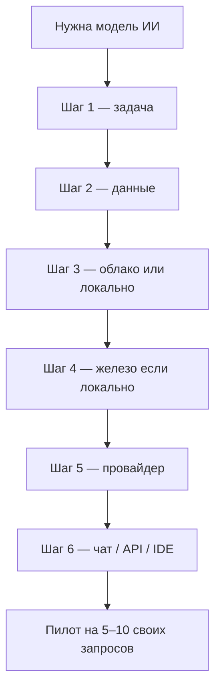
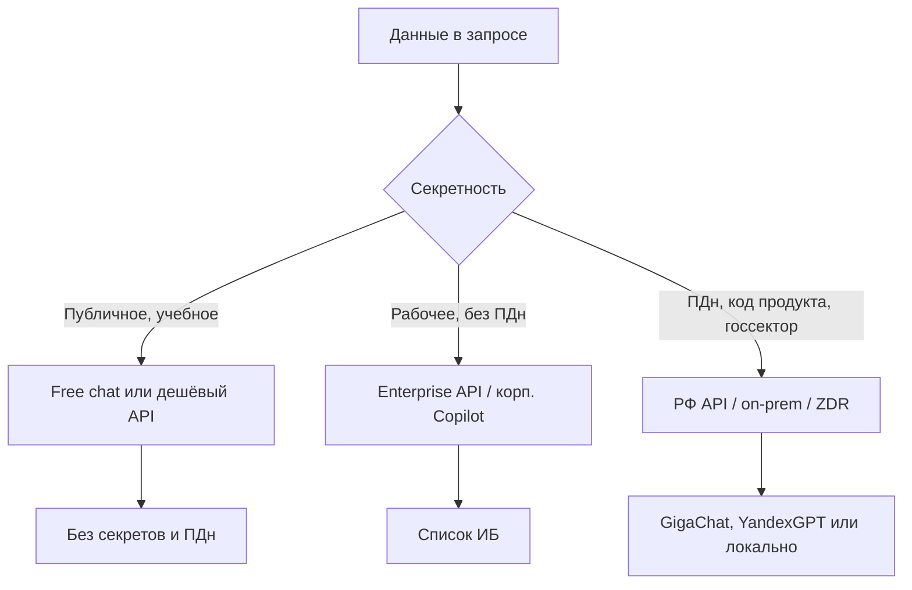
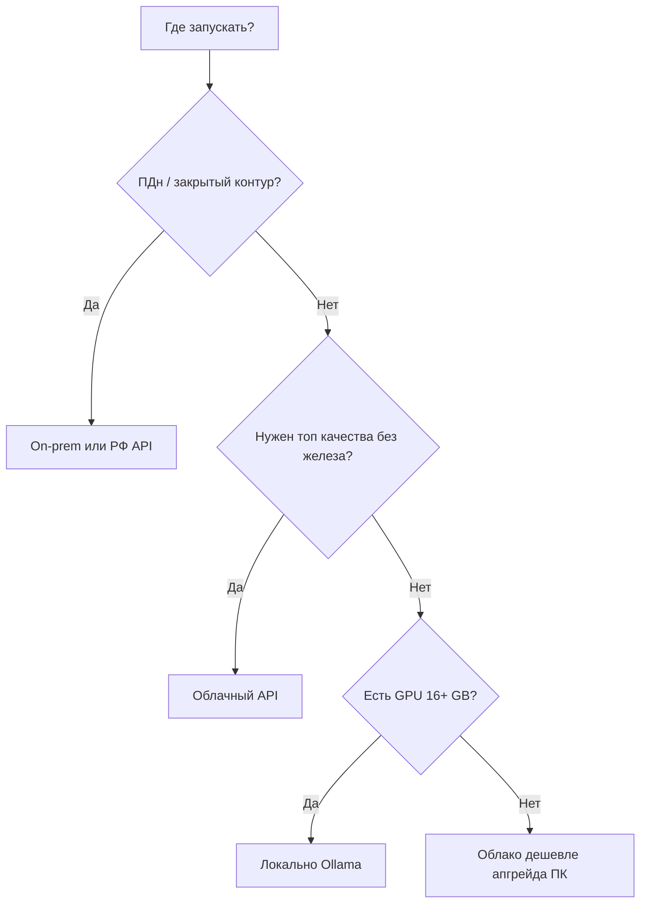
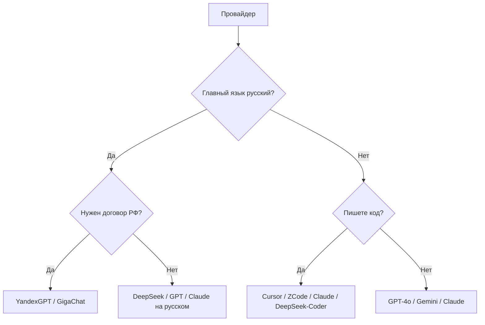

import ExternalPlayEmbed from '@site/src/components/ExternalPlayEmbed';

---

# Как выбрать модель и где её запускать

  ОБЯЗАТЕЛЬНО
  ДЛЯ НОВИЧКОВ

Всем

<ExternalPlayEmbed example="ai/model-picker-wizard-play" title="Выбор LLM" minHeight={460} />

---

ChatGPT, Claude, Gemini, DeepSeek, GigaChat, локальная Llama в Ollama — универсально "лучшей" модели нет. Подходит та, что совпадает с **задачей**, **данными**, **языком** и **бюджетом**.

Цены — [сколько стоит ИИ](./126). Российский контур — [GigaChat и YandexGPT](./124). Мифы про "самую умную нейросеть" — [мифы и реальность](/encyclopedia/6-ai/6-01-vvedenie-v-ii/114).

  
Термины

  

  <strong>LLM</strong> — большая языковая модель для текста. 
  <strong>Модель</strong> — "движок", который генерирует ответ. 
  <strong>Чат-бот</strong> — готовый продукт на базе модели с интерфейсом, памятью, инструментами и политиками безопасности. 
  <strong>ML</strong> — машинное обучение; шире, чем только LLM. 
  <strong>API</strong> — программный доступ к модели в облаке. 
  <strong>On-premise</strong> — модель в вашем контуре. 
  <strong>ПДн</strong> — персональные данные по 152-ФЗ. 
  <strong>RAG</strong> — ответы по вашим документам в реальном времени, подробнее в [RAG, MCP и агенты](./121). 
  <strong>AI-ready</strong> — готовность команды и процессов внедрять ИИ без хаоса и утечек. 
  <strong>Квантизация</strong> — сжатие весов модели для экономии RAM. 
  <strong>VRAM</strong> — видеопамять GPU. 
  <strong>ZDR</strong> — политика нулевого хранения промптов провайдером.
  

---

## Общее дерево решений

Ниже — каждый шаг подробно. Пропускать шаг 2 (данные) **нельзя** — это главный источник инцидентов и штрафов.

---

## Шаг 1. Определите задачу

Сначала зафиксируйте **одно предложение** о том, что должна делать модель. Пример — "суммаризировать обращения поддержки на русском за 5 предложений".

Хорошая формулировка отвечает на вопросы:

- **кто** пользователь (оператор, клиент, разработчик);
- **что** на входе (текст, PDF, код, таблица);
- **что** на выходе (ответ, класс, JSON, картинка);
- **какой** язык;
- **как быстро** нужен результат.

Плохая формулировка — "нужен ИИ". Так не выбрать ни модель, ни способ доступа.

### Примеры формулировок задач

| Слабо | Лучше |
|-------|-------|
| Нужен ChatGPT | Нужен черновик ответа клиенту на русском по шаблону FAQ |
| Хочу нейросеть в компанию | Нужен поиск по 500 PDF регламентов с цитатой источника |
| Напиши код | Нужен рефакторинг модуля на Python 3.12 в IDE |
| Сделай картинку | Нужны иллюстрации 1024×1024 для блога в корпоративном стиле |

| Задача | Что использовать |
|--------|------------------|
| Спросить, объяснить, черновик текста | Chat LLM в облаке или локально |
| Сложная логика, математика | [Reasoning-модели](./123) или chat + [tools](/encyclopedia/6-ai/6-05-razrabotka-ii/123) |
| Картинки, видео, голос | [Мультимодальный ИИ](/encyclopedia/6-ai/6-07-vayb-koding-i-neurokontent/5) |
| Ответы по вашим PDF и wiki | [RAG](./121) + любая LLM + [векторная БД](/encyclopedia/3-data-markup/3-06-nosql/812) |
| Прогноз по таблице, классификация строк | [Классический ML](/encyclopedia/6-ai/6-02-mashinnoe-obuchenie/1), LLM не обязателен |
| Код в IDE | Copilot, Cursor, Claude Code, [ZCode](/encyclopedia/6-ai/6-07-vayb-koding-i-neurokontent/6) — [генерация кода](./117) |
| Автономные действия в системах | [Агенты](./116) + MCP — [114](./114) |
| Извлечение JSON из текста | Chat + [structured output](/encyclopedia/6-ai/6-05-razrabotka-ii/123) |

**LLM** (Large Language Model) — модель для текста. **ML** (Machine Learning) — более широкий класс задач на данных.

### Уточняющие вопросы к задаче

- Нужен **один** ответ или **диалог** с памятью?
- Допустимы **галлюцинации** или нужны **цитаты** из документов?
- Какая **максимальная задержка** (секунды)?
- На каком **языке** ввод и вывод?
- Сколько **запросов в день** ожидается?

### Когда LLM избыточен

- Регулярные отчёты по SQL — хватит шаблона и BI.
- Спам-фильтр на миллионах писем — классический ML дешевле.
- Сортировка числовых заявок по порогам — правила и скрипты.

### Когда LLM необходим

- Свободная формулировка вопроса пользователя.
- Работа с неструктурированным текстом (PDF, тикеты).
- Черновики на естественном языке.

---

## Шаг 2. Классифицируйте данные

**ПДн** (персональные данные) — ФИО, телефон, email и любая информация, по которой можно идентифицировать человека. Подробнее — [ИИ и право в РФ](/encyclopedia/6-ai/6-06-primenenie-ii/115).

| Класс данных | Нельзя | Можно |
|--------------|--------|-------|
| Пароли, ключи, `.env` | Любой чат | Никуда; ротация секретов |
| ПДн клиентов | Free ChatGPT | Договор + РФ или enterprise |
| Исходники закрытого продукта | Публичный free | Корп. IDE или on-prem |
| Домашка, публичные статьи | — | Free chat с осторожностью — [ИИ в учёбе](/encyclopedia/6-ai/6-06-primenenie-ii/116) |
| Медицинские записи | Free tier | Регулируемый контур, согласие субъекта |
| Внутренние финансовые отчёты | Публичный API | Enterprise, локально |

**ZDR** (Zero Data Retention) — провайдер не хранит промпты для обучения. См. [политику данных](/encyclopedia/6-ai/6-10-bezopasnost-pri-rabote-s-ii/5).

### Compliance-чеклист для новичка

- [ ] Я понимаю, есть ли в запросе **ПДн**
- [ ] Я проверил **список разрешённых** сервисов (если это работа)
- [ ] Я **не** вставляю ключи API и пароли в промпт
- [ ] Для продукта с пользователями есть **договор** с провайдером (если нужен)
- [ ] Логи **не** сохраняют полный текст промпта с ПДн

### Российский контур данных

Если в запросе ПДн граждан РФ и политика требует локализации — [российские нейросети](./124), on-prem open-weight ([Saiga на Hugging Face](https://huggingface.co/)) или согласованный enterprise-контракт с хранением в РФ.

---

## Шаг 2.5. Проверьте AI-ready перед пилотом

Даже сильная модель даёт слабый результат, когда в компании нет процесса эксплуатации.  
**AI-ready** в практическом смысле — это рабочая готовность людей, данных и процессов к регулярному использованию ИИ.

Минимум AI-ready для новичка:

- [ ] Есть владелец сценария, который отвечает за качество и риски.
- [ ] Есть список допустимых данных и запрет на секреты в промптах, см. [Политика данных и выбор LLM-провайдера](/encyclopedia/6-ai/6-10-bezopasnost-pri-rabote-s-ii/5).
- [ ] Есть метрика успеха пилота, например скорость ответа поддержки, доля эскалаций, экономия времени.
- [ ] Есть процедура проверки ответов (human-in-the-loop) для критичных задач.
- [ ] Есть журнал ошибок и понятный план отката на ручной режим.
- [ ] Есть технический контур интеграции, см. [Семь слоёв LLM-стека](/encyclopedia/6-ai/6-05-razrabotka-ii/119) и [RAG, MCP и агенты](./121).

Без этих пунктов лучше запускать небольшой пилот на одном сценарии.

---

## Шаг 3. Облако или локально

| | Облако (API) | Локально (Ollama, LM Studio) |
|--|--------------|------------------------------|
| Старт | Минуты | Часы (скачать веса, настроить GPU/RAM) |
| Качество топ-моделей | GPT-4, Claude доступны | 7B–70B слабее флагманов |
| Приватность | Зависит от договора | Данные не уходят в облако |
| Стоимость | За токен / подписка | Железо + электричество — [126](./126) |
| Интернет | Нужен | Не нужен после загрузки |
| Масштабирование | Автоматически у провайдера | Покупка GPU / кластера |
| Обновление модели | Вендор обновляет | Вы качаете новые веса |

**On-premise** — модель в вашем контуре. **Облако** — запрос уходит на сервер провайдера.

### Дерево "облако или локально"

Локально имеет смысл при закрытом контуре, экспериментах без списания API и офлайн. Облако — когда нужен максимум качества без покупки GPU. Гайд — [локальные модели](/encyclopedia/6-ai/6-05-razrabotka-ii/113).

### Гибрид

Частый паттерн в компаниях:

- **прод с ПДн** — GigaChat / YandexGPT / локальная Saiga;
- **разработка** — Cursor, Claude, DeepSeek без секретов;
- **CI** — моки без реальных данных.

См. [124](./124) и [политику данных](/encyclopedia/6-ai/6-10-bezopasnost-pri-rabote-s-ii/5).

---

## Шаг 4. Размер модели и железо

Ориентиры для **квантизованных** весов GGUF (Q4–Q5). **Квантизация** — сжатие весов; меньше RAM, чуть ниже качество.

### Базовая таблица RAM / VRAM

| RAM / VRAM | Размер модели | Для чего хватит |
|------------|---------------|-----------------|
| 8 GB | 3B–7B | Простые вопросы, черновики |
| 16 GB | 7B–13B | Код, русский, небольшой RAG |
| 24–32 GB VRAM | 13B–34B | Серьёзнее код, длинный контекст |
| 48 GB+ | 70B+ | Ближе к "большим" chat, медленнее |
| 64–128 GB | 70B+ multi-GPU | On-prem мини-кластер |

**VRAM** — видеопамять GPU. **RAM** — оперативная память. Слабое железо — часто дешевле облачный API, чем апгрейд ПК — [126](./126).

### Уровни квантизации GGUF

| Формат | Размер на диске | Качество | Когда брать |
|--------|-----------------|----------|-------------|
| Q8 | Больше | Ближе к оригиналу | Если хватает VRAM |
| Q6_K | Средне | Хороший баланс | Рабочие станции |
| Q5_K_M | Средне | Рекомендуемый дефолт | 16 GB VRAM |
| Q4_K_M | Меньше | Лёгкая потеря | 8–12 GB VRAM |
| Q3 / Q2 | Минимум | Заметные артефакты | Только эксперименты |

Чем **ниже** Q — тем меньше памяти и тем хуже рассуждения на сложных задачах.

### Таблица GPU потребительского класса

| GPU | VRAM | Примерно модель (Q4–Q5) | Скорость* |
|-----|------|---------------------------|-----------|
| Intel iGPU только | 0–2 GB shared | Не для LLM | — |
| NVIDIA GTX 1650 | 4 GB | 3B очень медленно | ~2–5 tok/s |
| RTX 3060 | 12 GB | 7B–13B | ~15–40 tok/s |
| RTX 4060 Ti 16GB | 16 GB | 13B комфортно | ~25–50 tok/s |
| RTX 3090 / 4090 | 24 GB | 34B, 70B квант. | ~30–80 tok/s |
| Apple M1 8GB | unified | 7B CPU/GPU hybrid | переменно |
| Apple M2/M3 Pro 18GB+ | unified | 13B | лучше для dev |
| Apple M2 Ultra 64GB+ | unified | 70B Q4 | без discrete GPU |

*Скорость сильно зависит от контекста, бэкенда (llama.cpp, vLLM) и длины ответа. Цифры — порядок величины для планирования.

### Только CPU без GPU

Если дискретной GPU нет:

- модели **3B–7B** на Q4 через llama.cpp;
- ожидайте **1–10 tok/s** — терпимо для экспериментов, не для чата с сотней пользователей;
- для продакшена с нагрузкой — облачный API выгоднее.

### Ноутбук и сервер

| | Ноутбук dev | Сервер on-prem |
|--|-------------|----------------|
| GPU | 1 карта, ограничен TDP | Несколько GPU, 24/7 |
| Задача | Прототип, личный ассистент | RAG для отдела, десятки RPS |
| Модель | 7B–13B | 34B–70B |

### Длина контекста и память

Контекст 8k и 128k по-разному влияет на потребление VRAM во время инференса. Для RAG на длинных PDF следите за **окном контекста** — см. [контекст LLM](/encyclopedia/6-ai/6-01-vvedenie-v-ii/113).

### Когда покупать железо

Покупка GPU оправдана, если:

- месячный счёт API &gt; амортизации GPU за 12–18 месяцев;
- есть требование **офлайн** или **закрытый контур**;
- нужны **тысячи** однотипных запросов (batch).

Иначе начните с API — [126](./126).

---

## Шаг 5. Провайдер в облаке

| Если важно… | Смотрите |
|-------------|----------|
| Русский, 152-ФЗ | [GigaChat, YandexGPT](./124) |
| Код | Copilot, Cursor, Claude, [GLM-5.2 / ZCode](/encyclopedia/6-ai/6-07-vayb-koding-i-neurokontent/6), DeepSeek-Coder — [117](./117) |
| Дёшево и много запросов | DeepSeek API, младшие GPT/Gemini |
| Длинные документы | Claude, Gemini, GPT-4o — [контекст](/encyclopedia/6-ai/6-01-vvedenie-v-ii/113) |
| Reasoning | o-series, DeepSeek-R1 — [123](./123) |
| Уже есть Microsoft 365 | Copilot — [ответственное использование](/encyclopedia/6-ai/6-06-primenenie-ii/3) |
| Open weights в облаке | Самохост vLLM на VPS с GPU |

Сравнивайте **5–10 своих запросов**, а не чужие бенчмарки.

### Семейства моделей (кратко)

| Семейство | Сильные стороны | Ссылки |
|-----------|-----------------|--------|
| OpenAI GPT-4o / o-series | Универсальность, tools, reasoning | openai.com |
| Anthropic Claude | Длинный контекст, тексты | anthropic.com |
| Google Gemini | Мультимодальность, экосистема Google | ai.google.dev |
| DeepSeek | Цена, код, R1 reasoning | deepseek.com |
| Meta Llama | Open weights, локально | [huggingface.co/meta-llama](https://huggingface.co/meta-llama) |
| Mistral | Open weights, EU | huggingface.co/mistralai |
| Zhipu GLM | Open weights, 1M-контекст (GLM-5.2), coding-агенты | [ZCode и GLM-5.2](/encyclopedia/6-ai/6-07-vayb-koding-i-neurokontent/6) |
| GigaChat / YandexGPT | Русский, РФ compliance | [124](./124) |

### Дерево выбора провайдера

---

## Шаг 6. Способ доступа

| Способ | Кому подходит | Плюс |
|--------|---------------|------|
| **Веб-чат** | Новичок, учёба | Нулевая настройка |
| **API** | Разработчик, бот, продукт | Автоматизация, RAG — [1149](/lab/Примеры/1149) |
| **IDE** (Cursor, Continue) | Программист | Контекст репозитория |
| **Агент в терминале** | Опытный dev | Автономия и риски — [агенты](./116) |
| **Корп. Copilot** | Компания на M365 | Единый контракт |

### Walkthrough — первый API-запрос

1. Зарегистрируйтесь у провайдера, создайте API-ключ.
2. Сохраните ключ в `.env`, не коммитьте в git.
3. Скопируйте минимальный пример из [lab/1149](/lab/Примеры/1149).
4. Отправьте system + user message, `temperature=0.3`.
5. Зафиксируйте токены и стоимость — [126](./126).
6. Добавьте RAG — [121](./121).

### Walkthrough — локальный старт Ollama

1. Установите [Ollama](/encyclopedia/6-ai/6-05-razrabotka-ii/113).
2. `ollama pull llama3.2` или русскоязычную Saiga с [Hugging Face](https://huggingface.co/).
3. `ollama run <model>` в терминале.
4. Оцените скорость и качество на 5 своих вопросах.
5. Если мало — переходите на облако или GPU побольше.

---

## Быстрый старт по ролям

| Вы | С чего начать |
|----|---------------|
| Школьник / студент | Free chat + [ИИ в учёбе](/encyclopedia/6-ai/6-06-primenenie-ii/116) |
| Junior dev | ChatGPT/DeepSeek + [генерация кода](./117) |
| Dev в компании | Список сервисов у ИБ |
| Бот на документах | API + [RAG](./121) + [векторная БД](/encyclopedia/3-data-markup/3-06-nosql/812) |
| Госсектор / банк | GigaChat / on-prem + [право РФ](/encyclopedia/6-ai/6-06-primenenie-ii/115) |
| Маркетолог | Chat для черновиков, без ПДн клиентов в free tier |
| Аналитик | Golden set + сравнение 2 провайдеров |
| Архитектор | [119](/encyclopedia/6-ai/6-05-razrabotka-ii/119) + политика данных |

### Сценарий "студент пишет курсовую"

- Данные — публичные источники, **без** анкет респондентов с ФИО.
- Инструмент — free chat.
- Риск — плагиат и выдуманные ссылки; проверяйте источники вручную.
- См. [116](/encyclopedia/6-ai/6-06-primenenie-ii/116).

### Сценарий "junior делает pet-проект"

- Данные — открытые API, без ключей в репозитории.
- Инструмент — DeepSeek API или бесплатный tier OpenAI.
- Следующий шаг — Docker backend + `.env` — [разработка и отладка](/encyclopedia/4-code-dev/4-14-razrabotka-i-otladka/111).

### Сценарий "команда делает бота поддержки"

- Данные — FAQ без ПДн в индексе; тикеты с ПДн — только в РФ контуре.
- Инструмент — YandexGPT или GigaChat + RAG — [124](./124).
- Метрики — доля эскалаций на человека.

### Сценарий "банк, внутренний ассистент"

- Данные — ПДн, регламенты.
- Инструмент — GigaChat enterprise / on-prem.
- Обязательно — ИБ, юристы, аудит логов — [115](/encyclopedia/6-ai/6-06-primenenie-ii/115).

### Сценарий "инди-разработчик игры"

- Данные — сюжет, диалоги NPC без ПДн.
- Инструмент — локальная 7B для черновиков, Claude для полировки английского.
- Бюджет — [126](./126).

---

## Стоимость — три примера

Оценки порядка величины; актуальные цены — [126](./126).

| Профиль | Нагрузка | Вариант | Ориентир |
|---------|----------|---------|----------|
| Личный учёт | 50 запросов/день | Free chat / дешёвый API | 0–500 ₽/мес |
| Стартап MVP | 500 запросов/день, RAG | YandexGPT / DeepSeek API | 3–15 тыс. ₽/мес |
| Корпорация | 50k запросов/день, ПДн | GigaChat enterprise | Договор, не публичный прайс |

Локальная RTX 4090 — разовые ~150–200 тыс. ₽ + электричество; окупается при высоком постоянном трафике.

---

## Методика сравнения моделей

### Golden set

- 20–50 реальных запросов из вашей задачи;
- краткий эталон ответа или критерии оценки;
- одинаковый system prompt для всех кандидатов.

### Слепое сравнение

Два ответа на один вопрос без подписи модели. Оценщик ставит 1–5. Так убирается bias "ChatGPT всегда лучше".

### Что фиксировать

- модель и версия;
- `temperature`, `max_tokens` — [118](./118);
- длина RAG-контекста;
- latency и стоимость запроса.

---

## Параметры генерации

Не меняйте десять параметров сразу. Стартовые профили — [118](./118).

| Задача | temperature | Комментарий |
|--------|-------------|-------------|
| Классификация | 0–0.2 | Минимум креатива |
| Поддержка по FAQ | 0.2–0.4 | Стабильность важнее |
| Маркетинговый черновик | 0.7–0.9 | Больше вариативности |
| Извлечение JSON | 0 | + schema в промпте |

---

## Типичные ошибки выбора

- Гнаться за "самой умной" моделью из блога, без своего golden set.
- Запускать 70B локально на 8 GB RAM "потому что бесплатно".
- Отправлять ПДн в free ChatGPT "только один раз".
- Использовать reasoning-модель для перефраза письма — дорого и медленно — [123](./123).
- Игнорировать список ИБ в компании.
- Не учитывать стоимость **выходных** токенов при длинных ответах.
- RAG без обновления документов — устаревшие ответы.

---

## FAQ

### Какую модель выбрать абсолютному новичку?

Веб-чат бесплатного tier для учёбы без ПДн. Для кода — [117](./117). Алгоритм — шесть шагов выше.

### ChatGPT или Claude?

Зависит от задачи. Claude часто силён в длинных документах. GPT — в экосистеме tools и плагинов. Сравните 10 своих промптов.

### Нужна ли платная подписка?

Для серьёзной ежедневной работы без лимитов free — обычно да. Для редких вопросов хватает free. API платите по токенам — [126](./126).

### Llama локально или GPT в облаке?

Закрытый контур — Llama / Saiga. Максимум качества без железа — GPT / Claude в облаке.

### DeepSeek — хороший выбор?

Часто отличное соотношение цена/качество для кода и русского. Проверьте политику данных для корпорации.

### GigaChat только для банков?

Нет, но силён в enterprise и госсекторе. Стартапу без ПДн может подойти и YandexGPT — [124](./124).

### Сколько RAM нужно для Ollama?

От 8 GB для 7B Q4. Комфортно — 16 GB+. См. таблицы в шаге 4.

### Можно ли смешивать провайдеров?

Да, через LLM Gateway и политику маршрутизации. ПДн — только разрешённый контур.

### Что такое reasoning и нужен ли он мне?

Модели с длинной цепочкой рассуждений для математики и логики — [123](./123). Для черновиков текста — обычный chat.

### Что такое AI-ready простыми словами?

Это организационная готовность к ИИ.  
Короткая формула  

- люди и роли
- процессы и регламенты
- данные и правила доступа
- контроль качества и рисков

Практические детали по правовым ограничениям собраны в [ИИ и право в РФ](/encyclopedia/6-ai/6-06-primenenie-ii/115), по техрискам в [Безопасность при работе с ИИ](/encyclopedia/6-ai/6-10-bezopasnost-pri-rabote-s-ii/1).

### Как выбрать модель для RAG?

Часто хватает среднего chat (GPT-4o-mini, YandexGPT lite, GigaChat). Важнее качество индекса — [121](./121).

### Опасно ли отправлять код в облако?

Зависит от политики компании. Секреты и закрытые репозитории — только разрешённые IDE или on-prem.

### Что выбрать для русского языка?

[124](./124) для РФ compliance. Из международных — DeepSeek, GPT-4o. Сравните на своих текстах.

### Нужен ли GPU для обучения?

Для **использования** готовой LLM — GPU желателен локально, в облаке не нужен. Для **обучения** с нуля — кластер GPU; для fine-tune 7B — одна 24 GB карта может хватить.

### Как часто менять модель?

При регрессии качества или росте цены. Раз в квартал пересматривайте рынок — модели обновляются быстро.

### Cursor — это отдельная модель?

Cursor — IDE, под капотом разные LLM по подписке. См. [117](./117).

---

## Серверные GPU и дата-центр

Для on-prem и высокой нагрузки смотрят **не потребительские**, а серверные карты.

| GPU | VRAM | Типичное применение |
|-----|------|---------------------|
| NVIDIA A10 | 24 GB | Инференс 13B–34B, несколько потоков |
| NVIDIA A100 40/80 GB | 40–80 GB | 70B, batch, fine-tune |
| NVIDIA H100 | 80 GB | Высокий RPS, большие батчи |
| NVIDIA L40S | 48 GB | Универсальный инференс |
| 2× RTX 4090 | 48 GB total | Бюджетный on-prem 70B Q4 |

### Multi-GPU

Модели 70B+ часто **не помещаются** на одну карту. Используют:

- **tensor parallel** в vLLM;
- несколько карт с разнесением слоёв;
- более агрессивную квантизацию (Q3) — с потерей качества.

Настройка сложнее Ollama на одной машине — закладывайте время DevOps/MLOps.

---

## Аренда GPU в облаке (self-host LLM)

Если on-prem пока нет, но API дорог при объёме — арендуйте VM с GPU и поднимите vLLM / TGI.

| Провайдер | Плюсы | Минусы |
|-----------|-------|--------|
| Yandex Cloud GPU | Рубли, РФ | Нужна настройка самому |
| SberCloud | Enterprise, РФ | Часто через менеджера |
| Зарубежные VPS GPU | Широкий выбор карт | Трансграничность данных |

Перед переносом ПДн на self-host в облаке РФ — тот же compliance, что и для GigaChat API — [115](/encyclopedia/6-ai/6-06-primenenie-ii/115).

### Минимальный чеклист self-host

- [ ] Выбрана модель и квантизация под VRAM
- [ ] vLLM / llama.cpp протестирован на golden set
- [ ] HTTPS и auth перед инференс-endpoint
- [ ] Мониторинг GPU utilization
- [ ] План обновления весов и отката

---

## Параметры модели (7B, 70B) простыми словами

**B** (billion) — миллиарды параметров (весов) нейросети.

| Размер | Качество | Железо | Скорость |
|--------|----------|--------|----------|
| 3B–8B | Базовое | 8–16 GB | Быстро |
| 13B–34B | Хорошее | 16–32 GB | Средне |
| 70B+ | Ближе к флагманам | 48 GB+ | Медленно |

Больше параметров — обычно лучше рассуждения, но дороже инференс. Для классификации тикетов часто хватает 7B; для сложного кода — 34B+ или облачный флагман.

---

## Режим реального времени и пакетная обработка

| Режим | Latency | Модель | Пример |
|-------|---------|--------|--------|
| Realtime chat | &lt; 3 с до первого токена | Быстрая chat, mini | Поддержка в виджете |
| Interactive | 5–30 с | Средняя / Pro | Ассистент аналитика |
| Batch | минуты–часы | Любая, дешевле batch API | Суммаризация 10k тикетов за ночь |

Для ночной batch-обработки берите **очередь** (RabbitMQ, YMQ в Yandex Cloud) и лимитируйте параллелизм, чтобы не упереться в rate limit API.

---

## Соответствие требованиям (compliance) по сценариям

| Сценарий | Минимальные меры |
|----------|------------------|
| Личный блог, без ПДн | Не публиковать секреты; free chat ок |
| Стартап B2C с email пользователей | Договор с провайдером; РФ или ZDR |
| Медицина | Согласие субъекта; часто on-prem |
| Образование | Не загружать работы студентов с ФИО в free tier |
| Финансы | GigaChat / Yandex enterprise; аудит |
| Госсектор | On-prem; сертификация по регламенту заказчика |

Юридические детали — [ИИ и право в РФ](/encyclopedia/6-ai/6-06-primenenie-ii/115). Техническая политика — [политика данных](/encyclopedia/6-ai/6-10-bezopasnost-pri-rabote-s-ii/5).

---

## Walkthrough — выбор между тремя кандидатами

Допустим, нужен бот по внутренней wiki на русском, 200 запросов/день, без ПДн в тексте статей.

1. **Задача** — RAG + chat (шаг 1).
2. **Данные** — внутренние статьи без ПДн; ИБ разрешила облако РФ (шаг 2).
3. **Облако** — API, без покупки GPU (шаг 3).
4. **Провайдеры** — YandexGPT Lite, GigaChat, DeepSeek API (шаг 5).
5. Соберите **10 вопросов** из реальной wiki.
6. Прогоните с одинаковым RAG top-k=5, temperature=0.2.
7. Оцените фактологию по источнику, latency, цену за 1000 запросов — [126](./126).
8. Победитель → MVP на [1149](/lab/Примеры/1149) + [121](./121).

---

## Walkthrough — локальная модель для дома

1. Проверьте RAM/VRAM по таблице шага 4 (например 16 GB → 7B–13B Q4).
2. Установите Ollama — [113](/encyclopedia/6-ai/6-05-razrabotka-ii/113).
3. Скачайте `saiga` или `llama3.2` с [Hugging Face](https://huggingface.co/).
4. Прогоните 10 личных задач (письмо, объяснение кода, перевод).
5. Если качество не устраивает — либо облако, либо GPU 24 GB+.

---

## Совместимость с инструментами разработки

| Инструмент | Как подключить | Ограничение |
|------------|----------------|-------------|
| Cursor | Custom OpenAI base URL | Нужен шлюз с OpenAI-форматом |
| Continue | config.yaml openai apiBase | То же |
| LangChain | Класс ChatOpenAI с base_url | Адаптер сообщений |
| n8n / Make | HTTP node | Ручной mapping JSON |
| Telegram-бот | Backend + API | Ключ только на сервере |

Прямая вставка ключа GigaChat в плагин без корпоративного шлюза часто **запрещена** ИБ.

---

## Дополнительные FAQ

### Ollama или LM Studio?

Оба для локального инференса. Ollama удобнее в CLI и сервере. LM Studio — для GUI и экспериментов на Windows. См. [113](/encyclopedia/6-ai/6-05-razrabotka-ii/113).

### Нужен ли Mac для локальных моделей?

Apple Silicon с 16 GB+ unified memory — рабочий dev-вариант. Для 70B нужны топовые конфигурации Mac Studio.

### Можно ли запустить YandexGPT в Ollama?

Нет, веса закрыты. Локально — open-weight аналоги (Saiga, Vikhr).

### ChatGPT Plus или API?

Plus — для ручного чата в браузере. API — для продукта и автоматизации. Разные тарифы — [126](./126).

### Одна модель на всё?

Редко оптимально. Часто mini для классификации и Pro для сложных ответов — [118](./118).

### Как понять, что модель "галлюцинирует"?

Ответ не совпадает с источником RAG или содержит выдуманные ссылки. Лечение — цитирование фрагментов, снижение temperature, human review.

### Нужен ли fine-tune новичку?

Почти никогда на старте. Сначала RAG и промпты — [121](./121).

### GPU AMD для LLM?

Поддержка через ROCm и llama.cpp улучшается, но экосистема NVIDIA проще для новичка.

### Сколько весит модель 7B на диске?

Q4 GGUF — порядка 4–5 GB. Закладывайте место под несколько моделей.

### Можно ли использовать бесплатный Gemini?

Для учёбы без ПДн — да. Для продукта с пользовательскими данными — проверьте условия и регион.

---

## Чеклист перед финальным решением

- [ ] Задача сформулирована одним предложением
- [ ] Класс данных определён (ПДн / секреты / публичное)
- [ ] Выбрано облако или локально с обоснованием
- [ ] Если локально — железо проверено по таблице шага 4
- [ ] 2–3 провайдера сравнены на golden set
- [ ] Способ доступа (чат / API / IDE) согласован с командой
- [ ] Оценена месячная стоимость — [126](./126)
- [ ] Для компании — согласование с ИБ
- [ ] Параметры генерации зафиксированы — [118](./118)
- [ ] План мониторинга latency и ошибок

---

## Каталог задач и стартовые модели (2025–2026)

Ориентиры, не рейтинг. Проверяйте на golden set.

| Задача | Старт в облаке | Старт локально |
|--------|----------------|----------------|
| Объяснить тему учебника | Free chat / GPT-4o-mini | Llama 3.2 8B |
| Рерайт поста на русском | YandexGPT / DeepSeek | Saiga 7B |
| Код Python | Cursor + Claude / DeepSeek | Qwen2.5-Coder 7B |
| Суммаризация 50 стр. PDF | Claude / Gemini long context | 13B + RAG по чанкам |
| Математика олимпиадная | o-series / DeepSeek-R1 — [123](./123) | 34B+ или облако |
| Классификация тикетов | YandexGPT Lite / GigaChat-mini | 7B Q4 |
| Чат по wiki компании | GigaChat + RAG — [124](./124) | Saiga 13B + pgvector |
| Картинка для статьи | DALL·E / YandexART | Stable Diffusion локально |

---

## Безопасность при выборе модели

Выбор модели — часть threat model.

| Угроза | Митигация |
|--------|-----------|
| Утечка ПДн в free chat | Классификация данных, шаг 2 |
| Prompt injection | Санитизация, RAG marks — [безопасность RAG](/encyclopedia/6-ai/6-10-bezopasnost-pri-rabote-s-ii/3) |
| Утечка API-ключа | Secrets manager, rotate |
| Зависимость от одного вендора | Абстракция + второй провайдер |
| Галлюцинации в медицине/праве | Human-in-the-loop, дисклеймер |

Агенты с доступом к shell — только для опытных команд — [116](./116).

---

## Переход с free-чата на API

Типичный путь pet-проекта → MVP:

1. Прототип промптов в веб-чате (без ПДн).
2. Вынесение промптов в файлы репозитория.
3. Backend с одним эндпоинтом `/ask` — [117](/encyclopedia/2-system-network/2-09-osnovy-integratsionnogo-vzaimodeystviya/117).
4. Подключение API-ключа в `.env`.
5. Добавление RAG при росте базы знаний — [121](./121).
6. Метрики и лимиты расходов — [126](./126).

На шаге 4 часто меняют модель: то, что работало в ChatGPT UI, может отличаться в API другой версией — перепроверьте golden set.

---

## Длинный контекст и RAG

Два подхода к большим документам:

| Подход | Когда | Модели |
|--------|-------|--------|
| Огромное окно контекста | Один-два PDF целиком | Claude, Gemini — [113](/encyclopedia/6-ai/6-01-vvedenie-v-ii/113) |
| RAG по чанкам | Сотни документов, обновления | Любая LLM + векторный поиск |

Для корпоративной wiki с еженедельными правками **RAG** практичнее гигантского контекста: дешевле и проще обновлять индекс.

### Размер чанка в RAG

- 300–800 токенов — типичный диапазон;
- overlap 50–100 токенов — чтобы не резать мысль посередине;
- top-k 3–7 — баланс фактов и размера промпта.

---

## Сезонность и обновления рынка

Модели устаревают за месяцы, не годы.

| Сигнал | Действие |
|--------|----------|
| Вышла новая версия у текущего провайдера | Регрессионный golden set за 1 день |
| Вырос счёт API на 30% | Проверить RAG, max_tokens, mini-модель |
| ИБ запретила сервис | Миграция на разрешённый — [124](./124) |
| Появился дешёвый конкурент | A/B на 100 запросах |

Подписки на changelog OpenAI, Anthropic, DeepSeek, [Yandex Cloud](https://yandex.cloud/ru/docs/foundation-models/), [developers.sber.ru](https://developers.sber.ru/).

---

## Расширенная таблица железа (рабочие станции)

| Конфигурация | RAM | GPU | Модель inference | Примечание |
|--------------|-----|-----|------------------|------------|
| Бюджетный ПК | 16 GB | нет | 7B Q4 CPU | Медленно, для тестов |
| Dev laptop gaming | 32 GB | RTX 4060 8GB | 7B GPU, 13B Q4 CPU offload | Компромисс |
| Dev desktop | 64 GB | RTX 4090 24GB | 34B Q4, 70B Q3 | Сильный home lab |
| MacBook Air M2 | 16 GB unified | iGPU | 7B | Тихо, без CUDA |
| MacBook Pro M3 Max | 36–48 GB | unified | 13B–34B Q4 | Хорош для mobile dev |
| Workstation TR Pro | 128 GB | 2× RTX 4090 | 70B Q4 tensor parallel | Малый on-prem |

### Электричество и TCO

GPU 300–450 W под нагрузкой × 24/7 заметно в счёте за электричество. Для сравнения с API перемножьте кВт·ч на тариф и добавьте к стоимости железа — [126](./126).

---

## Сводная матрица решений

| ПДн | Язык | Бюджет | Рекомендация |
|-----|------|--------|--------------|
| Нет | RU | Низкий | DeepSeek API / free chat |
| Нет | RU | Средний | YandexGPT API |
| Да | RU | Enterprise | GigaChat / Yandex договор |
| Да | RU | CapEx | On-prem Saiga + GPU |
| Нет | EN код | Средний | Cursor + Claude |
| Да | EN | Любой | Только разрешённый ИБ контур |

---

## Итоги

Выбор LLM — **шесть шагов**: задача → данные → место запуска → железо (если локально) → провайдер → способ доступа. Универсального победителя нет; есть соответствие вашим ограничениям.

Начните с **классификации данных** — это дороже всего исправлять постфактум. Затем golden set из 10 запросов и пилот на неделю. Российский контур — [124](./124), деньги — [126](./126), право — [115](/encyclopedia/6-ai/6-06-primenenie-ii/115).

### Шпаргалка на одну страницу

1. Задача — одно предложение, таблица шага 1.
2. Данные — есть ПДн? → РФ / on-prem. Нет? → облако по бюджету.
3. Место — API для качества; Ollama для экспериментов и закрытого контура.
4. Железо — таблица RAM/VRAM шага 4 + серверные GPU при on-prem.
5. Провайдер — golden set 10 запросов, не бенчмарки из Twitter.
6. Доступ — чат для себя, API для продукта, IDE для кода.

Повторяйте оценку раз в квартал: рынок LLM меняется быстрее, чем стеки баз данных.

### Что запомнить

- Универсально лучшей модели **нет** — есть подходящая под задачу и данные.
- **Шаг 2** (классификация данных) важнее бренда модели.
- **Облако** — быстрый старт и топ-качество; **локально** — приватность и фиксированный CapEx.
- Таблицы **RAM/VRAM** и **GPU** — ориентир; измеряйте tok/s на своём железе.
- **Golden set** из 5–10 запросов бьёт любой чужой бенчмарк.
- Российский контур — [124](./124); reasoning отдельно — [123](./123); цены — [126](./126).

### Типичный путь новичка за один вечер

1. Открыть free-чат, задать 3 вопроса по учёбе (без ПДн).
2. Установить Ollama, скачать 7B, сравнить ответ с чатом.
3. Записать в заметки: что понравилось, где галлюцинация.
4. Прочитать шаг 2 этой статьи перед любой рабочей задачей.
5. Если понравился API — заглянуть в [1149](/lab/Примеры/1149) на завтра.

---

## Связанные материалы

- [Сколько стоит ИИ](./126);
- [Российские нейросети](./124);
- [Reasoning-модели](./123);
- [Параметры генерации](./118);
- [Большие языковые модели](./1);
- [RAG, MCP и агенты](./121);
- [Локальные модели](/encyclopedia/6-ai/6-05-razrabotka-ii/113);
- [Политика данных](/encyclopedia/6-ai/6-10-bezopasnost-pri-rabote-s-ii/5);
- [ИИ и право в РФ](/encyclopedia/6-ai/6-06-primenenie-ii/115);
- [Мифы и реальность](/encyclopedia/6-ai/6-01-vvedenie-v-ii/114);
- [OpenAI / API — примеры](/lab/Примеры/1149).

---
