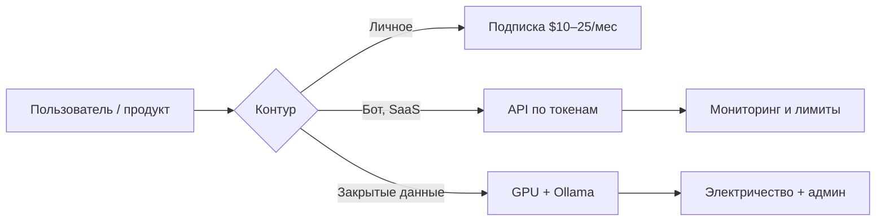

import ExternalPlayEmbed from '@site/src/components/ExternalPlayEmbed';

---

# Сколько стоит ИИ

<div class="article-tags">
  <span class="tag tag-required">ОБЯЗАТЕЛЬНО</span>
  <span class="tag tag-beginner">ДЛЯ НОВИЧКОВ</span>
</div>

<span class="complexity-badge">Всем</span>

<ExternalPlayEmbed example="ai/ai-cost-calculator-play" title="Калькулятор стоимости ИИ" minHeight={480} />

---

"ИИ бесплатный" — правда только для части сценариев. Деньги уходят в подписки, оплату **токенов** через **API**, железо, электричество и косвенные статьи (проверка ответов, безопасность, юристы). Эта статья учит **считать** расходы до того, как счёт API станет сюрпризом.

Выбор модели — [как выбрать модель](./125). Длина ответа и счёт — [параметры генерации](./118). Локальный запуск — [Ollama и локальные модели](/encyclopedia/6-ai/6-05-razrabotka-ii/113).

<div class="callout callout--tip">
  <div class="callout-title">Термины</div>

  <div class="callout-body">
  <strong>Токен</strong> — фрагмент текста; API тарифицирует запросы в токенах, не в символах.<br/>
  <strong>API</strong> — программный доступ к модели; платите за использование.<br/>
  <strong>Embedding</strong> — числовой вектор текста; нужен для [RAG](/encyclopedia/6-ai/6-04-modeli-i-instrumenty/121).<br/>
  <strong>Fine-tuning</strong> — дообучение модели на своих данных; отдельная статья расходов.<br/>
  <strong>CAPEX</strong> — разовые капитальные затраты (GPU, сервер).<br/>
  <strong>OPEX</strong> — регулярные операционные расходы (API, электричество, подписки).
  </div>
</div>

---

## Главная формула стоимости

Почти все облачные расчёты сводятся к одной формуле:

```
Стоимость запроса ≈ (input_tokens × price_in + output_tokens × price_out) / 1_000_000
```

- **input_tokens** — всё, что вы отправили модели (system prompt, история чата, RAG-контекст, JSON схемы tools);
- **output_tokens** — всё, что модель сгенерировала (ответ пользователю, thinking tokens у [reasoning-моделей](./123), tool_calls);
- **price_in / price_out** — цена провайдера **за 1 млн токенов** каждого типа.

Цены меняются — всегда сверяйте актуальный прайс на сайте провайдера. В примерах ниже используются **ориентиры** для понимания порядка величин, не договор оферты.

---

## Три способа платить

| Способ | Примеры | Когда выгодно | Тип расхода |
|--------|---------|---------------|-------------|
| **Подписка** | ChatGPT Plus, Claude Pro, Copilot | Регулярное личное использование | OPEX, фикс в месяц |
| **API pay-as-you-go** | OpenAI, DeepSeek, YandexGPT | Продукт, бот, пакетная обработка | OPEX, по факту использования |
| **Своё железо** | GPU, Ollama, on-prem | Много запросов, закрытый контур | CAPEX + OPEX (электричество) |

Часто комбинируют:

- разработка на **подписке** (удобный чат, IDE);
- прод на **API** с лимитами и мониторингом;
- чувствительные данные — **локально** или [российский API](./124).



---

## Токены — что это и как считать

**Токен** — кусок текста, на который разбивает модель вход и выход. Это **не** один символ и **не** одно слово.

| Язык / формат | Ориентир | Пример |
|---------------|----------|--------|
| Русский текст | 1 токен ≈ 2–4 символа | "Привет" ≈ 1–2 токена |
| Английский | 1 токен ≈ 4 символа | "Hello" ≈ 1 токен |
| Код Python | дороже прозы | `def foo():` — много коротких токенов |
| JSON | дороже прозы | кавычки, скобки, ключи |
| Числа | зависит от длины | `42` дешевле, чем `1234567890.12345` |

### Как узнать число токенов до запроса

- **OpenAI** — [Tokenizer](https://platform.openai.com/tokenizer) на сайте;
- **tiktoken** (Python) — библиотека для подсчёта;
- **Логи API** — после запроса в `usage.prompt_tokens` и `usage.completion_tokens`;
- **Langfuse, Helicone, Portkey** — агрегируют usage по проекту.

Прикидка без инструментов:

```
tokens ≈ символы / 3   (русский, грубо)
tokens ≈ слова × 1.3   (английский, грубо)
```

Точный подсчёт важен для RAG: 10 PDF по 50 страниц легко превращаются в **сотни тысяч** токенов при наивной индексации всего текста в каждый запрос.

---

## Раздельная тарификация input и output

Провайдеры почти всегда берут **разные** цены:

| Компонент | Что входит | Кто контролирует |
|-----------|------------|------------------|
| **input** | system prompt, user message, история, RAG-чанки, описания tools | вы (архитектура промпта) |
| **output** | ответ, JSON, tool_calls, thinking | модель + [max_tokens](./118) |
| **cached input** | повторяющийся префикс (у части провайдеров) | вы (стабильный system prompt) |
| **batch** | отложенные запросы со скидкой | вы (не real-time) |

**Thinking tokens** у [reasoning-моделей](./123) тарифицируются как output (или отдельной строкой в прайсе) — один "короткий" вопрос может стоить в 5–20 раз дороже обычного chat.

---

## Пошаговый разбор токенов (walkthrough 1)

**Задача:** пользователь спрашивает в чат-боте "Как сбросить пароль?"

**Шаг 1. System prompt**

```
Ты — помощник поддержки компании X. Отвечай кратко, по шагам. Не выдумывай ссылки.
```

Оценка: ~35 токенов.

**Шаг 2. User message**

```
Как сбросить пароль?
```

Оценка: ~8 токенов.

**Шаг 3. История чата** (2 предыдущих пары)

Оценка: ~200 токенов.

**Шаг 4. RAG** — 3 релевантных чанка по 400 токенов

Оценка: ~1200 токенов.

**Итого input:** 35 + 8 + 200 + 1200 ≈ **1443 токена**.

**Шаг 5. Output** — ответ на 150 слов по-русски

Оценка: ~200 токенов output.

**Расчёт** (условные цены: $0.15 / 1M input, $0.60 / 1M output — порядок младших моделей):

```
input_cost  = 1443 × 0.15 / 1_000_000 = $0.000216
output_cost = 200  × 0.60 / 1_000_000 = $0.000120
total       ≈ $0.00034 за один запрос
```

**1000 таких запросов в месяц:** ~$0.34 — копейки.

**Урок:** при RAG доминирует **контекст**, не ответ. Сокращать надо чанки и top-k, а не только max_tokens ответа.

---

## Пошаговый разбор токенов (walkthrough 2)

**Задача:** reasoning-модель решает задачу по SQL-оптимизации.

| Часть | Токены |
|-------|--------|
| System + схема БД (5 таблиц) | ~2500 |
| User: текст медленного запроса + EXPLAIN | ~800 |
| Output: рассуждение (thinking) | ~8000 |
| Output: финальный ответ | ~600 |

**Итого:** input ~3300, output ~8600.

**Расчёт** (условно: $2 / 1M input, $8 / 1M output — порядок reasoning):

```
input  = 3300 × 2 / 1_000_000  = $0.0066
output = 8600 × 8 / 1_000_000  = $0.0688
total  ≈ $0.075 за запрос
```

**200 таких запросов в месяц:** ~$15 — уже заметно.

**Урок:** reasoning + длинный контекст = **осознанный** выбор модели, не дефолт для каждого клика.

---

## Пошаговый разбор токенов (walkthrough 3)

**Задача:** пакетная обработка 10 000 отзывов — извлечь тональность и тему в JSON.

| Параметр | Значение |
|----------|----------|
| Средний отзыв | 80 токенов input |
| System prompt (один на батч) | 120 токенов |
| Output JSON на отзыв | 40 токенов |
| Запросов | 10 000 |

**Input на запрос:** 120 + 80 = 200 (если system в каждом; лучше вынести в кэшируемый префикс).

**Итого за 10 000:**

- input: 10 000 × 200 = **2 000 000** токенов
- output: 10 000 × 40 = **400 000** токенов

**Расчёт** ($0.10 / 1M in, $0.40 / 1M out):

```
input  = 2M × 0.10 / 1M = $0.20
output = 0.4M × 0.40 / 1M = $0.16
total  = $0.36 за 10 000 отзывов
```

**С Batch API** (скидка ~50% у части провайдеров): ~$0.18.

**Урок:** для массовой обработки смотрите [микро-ML](/encyclopedia/6-ai/6-06-primenenie-ii/113) — иногда дешевле обучить классификатор, чем гонять 10k через LLM.

---

## Таблица сценариев и порядок цены

| Сценарий | Input (порядок) | Output (порядок) | $/запрос (порядок) | Комментарий |
|----------|-----------------|------------------|--------------------|-------------|
| Короткий вопрос в чате | 100–300 | 200–500 | &lt; $0.001 | Копейки на младших моделях |
| Чат с историей 20 сообщений | 2000–5000 | 300–800 | $0.001–0.01 | Растёт история |
| RAG, 5 чанков × 500 токенов | 2500+ | ~500 | $0.001–0.02 | Доминирует контекст |
| Function calling, 3 tools | 1500+ | 200+ tool JSON | $0.002–0.02 | См. [function calling](/encyclopedia/6-ai/6-05-razrabotka-ii/123) |
| Reasoning-задача | ~500–3000 | 2000–15000 thinking | $0.02–0.20 | В разы дороже chat |
| Генерация 2000 слов статьи | 500 | 3000+ | $0.01–0.05 | Следите за max_tokens |
| Embedding 1M слов корпуса | 1M+ | — | $0.01–0.10 | Разовая индексация |
| 1000 пользователей × 10 msg/день | миллионы/мес | — | $50–500+ | Нужен cap и кэш |

---

## Примеры расчёта стоимости по провайдерам

Цены ниже — **иллюстрация метода расчёта**. Актуальные цифры — только на сайтах провайдеров.

### Пример A. Чат-бот поддержки (GPT-4o mini класс)

| Метрика | Значение |
|---------|----------|
| Запросов в день | 500 |
| Input на запрос | 1800 токенов (RAG) |
| Output на запрос | 250 токенов |
| Дней в месяце | 30 |

**Токены в месяц:**

- input: 500 × 30 × 1800 = **27 000 000**
- output: 500 × 30 × 250 = **3 750 000**

**При $0.15 / 1M input, $0.60 / 1M output:**

```
27 × 0.15 + 3.75 × 0.60 = $4.05 + $2.25 = $6.30/мес
```

### Пример B. Тот же бот на флагмане без оптимизации

| Метрика | Значение |
|---------|----------|
| Те же 500 × 30 запросов | |
| Input | 27M |
| Output | 3.75M |
| Цены флагмана | $2.50 / $10 per 1M |

```
27 × 2.50 + 3.75 × 10 = $67.50 + $37.50 = $105/мес
```

**Разница в 15+ раз** — за счёт выбора модели, не магии.

### Пример C. Copilot для команды 20 разработчиков

| Статья | Оценка |
|--------|--------|
| M365 + Copilot лицензия | ~$30/user/мес × 20 = **$600/мес** |
| API для CI (code review bot) | $50–200/мес |
| **Итого** | **$650–800/мес** OPEX |

Сравните с 20 × ChatGPT Plus ($20) = $400 — но Copilot встроен в IDE и политику компании.

### Пример D. Стартап MVP с 200 DAU

| Метрика | Значение |
|---------|----------|
| DAU | 200 |
| Сообщений на пользователя | 8/день |
| Input | 1200 токенов |
| Output | 350 токенов |

**Запросов в месяц:** 200 × 8 × 30 = **48 000**

**Токены:**

- input: 48 000 × 1200 = 57.6M
- output: 48 000 × 350 = 16.8M

**При $0.15 / $0.60:**

```
57.6 × 0.15 + 16.8 × 0.60 = $8.64 + $10.08 = $18.72/мес
```

Плюс embeddings, vector DB, мониторинг — см. шаблон бюджета ниже.

---

## Подписки для человека

| Уровень | Ориентир | Что даёт | Ограничения |
|---------|----------|----------|-------------|
| **Free** | 0 ₽ / $0 | Базовая модель, лимиты | Данные могут идти в обучение |
| **Plus / Pro** | ~$10–25/мес | Лучшая модель, больше лимитов | Не для продукта, нет API |
| **Team / Enterprise** | договор | DPA, ZDR, админка | [политика данных](/encyclopedia/6-ai/6-10-bezopasnost-pri-rabote-s-ii/5) |
| **Copilot в M365** | лицензия на пользователя | Word, Excel, Teams | [ответственное использование](/encyclopedia/6-ai/6-06-primenenie-ii/3) |
| **Cursor / Claude Code** | $20–40/мес | IDE-агент, контекст репо | Лимиты "быстрых" запросов |

### Когда подписка выгоднее API

- вы пишете **для себя**, не для тысяч пользователей;
- нужен **чат с файлами**, а не автоматизация;
- объём **&lt; 50–100 "сложных" запросов в день**;
- не нужна интеграция в ваш backend.

### Когда API выгоднее подписки

- **бот**, **SaaS**, **скрипт**, **CI**;
- нужен **контроль** max_tokens, модели, логов;
- много **однотипных** дешёвых запросов;
- [function calling](/encyclopedia/6-ai/6-05-razrabotka-ii/123) и RAG в коде.

Для учёбы free часто хватает — [ИИ в учёбе](/encyclopedia/6-ai/6-06-primenenie-ii/116). Для секретов — корп. тариф или [российский API](./124).

---

## Локальный запуск — полный расчёт

| Статья | Оценка | Тип |
|--------|--------|-----|
| GPU (новая, 12–24 GB VRAM) | ~30–150+ тыс. ₽ | CAPEX |
| RAM 32 GB+ | апгрейд ПК 10–30 тыс. ₽ | CAPEX |
| SSD под веса моделей | 500 GB–2 TB | CAPEX |
| Электричество | GPU 200–400 W × часы | OPEX |
| Время админа | обновления, квантизация | OPEX (время) |
| Качество | 7B локально слабее GPT-4 | косвенная цена |

### Формула электричества

```
кВт·ч/мес ≈ (мощность_GPU_кВт + мощность_CPU_кВт) × часы_в_день × 30
стоимость ≈ кВт·ч/мес × тариф_₽/кВт·ч
```

**Пример:** GPU 300 W + система 100 W = 0.4 кВт, 8 ч/день, 30 дней, тариф 6 ₽/кВт·ч:

```
0.4 × 8 × 30 = 96 кВт·ч
96 × 6 = 576 ₽/мес (~$6)
```

Сама электричество дешёвая — дорого **железо** и **время**.

### Окупаемость GPU и облачного API

| API в месяц | GPU за 80 000 ₽ окупается за |
|-------------|------------------------------|
| $20 | никогда (проще API) |
| $50 | ~40+ месяцев |
| $200 | ~10 месяцев |
| $500+ | 3–6 месяцев (если железо уже есть) |

Если на API стабильно уходит **$50–200/мес** и есть GPU — локальная 13B–34B может окупаться. Иначе проще облако.

**Квантизация Q4** уменьшает RAM — см. [локальные модели](/encyclopedia/6-ai/6-05-razrabotka-ii/113).

### Скрытые локальные расходы

- простой GPU, пока вы спите — 0 запросов, но электричество при 24/7;
- несколько моделей на диске — сотни GB;
- нет авт scaling — пик нагрузки = очередь или второй сервер;
- обновление модели раз в квартал — время devops.

---

## Скрытые расходы продукта

| Статья | Почему важно | Порядок $/мес |
|--------|----------------|---------------|
| Embeddings + [векторная БД](/encyclopedia/3-data-markup/3-06-nosql/812) | Индексация для RAG | $5–200 |
| Re-index | Смена embedding-модели | разовый всплеск |
| Eval, red team | [AgentOps](/encyclopedia/6-ai/6-08-agentops/intro), [OWASP LLM](/encyclopedia/6-ai/6-10-bezopasnost-pri-rabote-s-ii/2) | $0–5k (люди + API) |
| Ошибки модели в проде | Поддержка, репутация | сложно оцифровать |
| Fine-tuning | GPU-часы, разметка | $500–50k+ |
| Юристы | 152-ФЗ — [право РФ](/encyclopedia/6-ai/6-06-primenenie-ii/115) | договор |
| Мониторинг | Langfuse, Datadog, Sentry | $0–500 |
| Резервный провайдер | Fallback при outage | +20–50% к API |
| Человек в контуре | Review ответов в медицине/финансах | зарплата |

**Правило:** к строке "LLM API" в смете добавляйте **30–50%** на инфраструктуру и качество на MVP, **100%+** на зрелый prod.

---

## Шаблон бюджета MVP (таблица)

Скопируйте и подставьте свои цифры.

| # | Статья | Единица | Кол-во | Цена за ед. | $/мес | Примечание |
|---|--------|---------|--------|-------------|-------|------------|
| 1 | LLM API — input | 1M токенов | ___ | $___ | ___ | из логов или прикидки |
| 2 | LLM API — output | 1M токенов | ___ | $___ | ___ | |
| 3 | Embeddings | 1M токенов | ___ | $___ | ___ | индексация + запросы |
| 4 | Vector DB | инстанс | 1 | $___ | ___ | Chroma free / Pinecone |
| 5 | Хостинг backend | инстанс | 1 | $___ | ___ | VPS / serverless |
| 6 | Мониторинг | seat | ___ | $___ | ___ | Langfuse tier |
| 7 | Домен, CDN, email | пакет | 1 | $___ | ___ | |
| 8 | Резерв 20% | | | | ___ | непредвиденное |
| | **Итого OPEX** | | | | **$___** | |

### Типичные диапазоны MVP

| Компонент | MVP | Зрелый prod |
|-----------|-----|-------------|
| LLM API | $20–200/мес | $500–10k+/мес |
| Embeddings | $5–50 | отдельный контур |
| Vector DB | Chroma, free tier | Pinecone, Qdrant, Weaviate |
| Мониторинг | логи в файл | Langfuse, Datadog |
| Безопасность | чек-лист | red team в CI |

Монетизация — [6.06/5](/encyclopedia/6-ai/6-06-primenenie-ii/5).

---

## Шаблон бюджета по пользователям

Планирование от **DAU** (daily active users) и **запросов на пользователя**.

```
запросов_в_мес = DAU × запросов_на_юзера_в_день × 30
input_токенов   = запросов_в_мес × средний_input
output_токенов  = запросов_в_мес × средний_output

стоимость = (input_токенов × price_in + output_токенов × price_out) / 1_000_000
```

| DAU | Запросов/день | Input | Output | $/мес (mini) | $/мес (флагман) |
|-----|---------------|-------|--------|--------------|-----------------|
| 50 | 5 | 1000 | 300 | ~$2 | ~$30 |
| 200 | 8 | 1200 | 350 | ~$19 | ~$105 |
| 1000 | 10 | 1500 | 400 | ~$120 | ~$650 |
| 5000 | 12 | 2000 | 500 | ~$750 | ~$4000+ |

Колонка "флагман" — напоминание: **маршрутизация моделей** обязательна на масштабе.

---

## Шаблон годового бюджета (корпоративный)

| Квартал | CAPEX | OPEX API | OPEX лицензии | OPEX люди | Комментарий |
|---------|-------|----------|---------------|-----------|-------------|
| Q1 | GPU, сервер | пилот | Copilot trial | 0.2 FTE ML | PoC |
| Q2 | — | рост 3× | 50 seats | 0.5 FTE | пилот в отделе |
| Q3 | второй GPU? | prod | 200 seats | 1 FTE + ИБ | аудит |
| Q4 | — | оптимизация −30% | продление | eval в CI | FinOps |

**FinOps для LLM** — дисциплина учёта токенов так же, как учёт CPU в облаке.

---

## Как снизить счёт API

### Архитектура промпта

- короче **system prompt** — каждый лишний абзац × тысячи запросов;
- RAG — только **top-k** релевантных чанков, не весь документ;
- сжимайте историю — summary старых сообщений вместо полного лога;
- стабильный system → **prompt caching** (где провайдер поддерживает).

### Маршрутизация моделей

| Тип запроса | Модель |
|-------------|--------|
| Классификация intent | младшая / [микро-ML](/encyclopedia/6-ai/6-06-primenenie-ii/113) |
| Обычный FAQ | средняя |
| Сложный анализ, код | флагман |
| Reasoning | только по флагу |

Паттерн **router** — [function calling](/encyclopedia/6-ai/6-05-razrabotka-ii/123) или дешёвый классификатор.

### Технические приёмы

- кэш **идентичных** запросов (осторожно с персонализацией);
- жёсткий **max_tokens** — [118](./118);
- **Batch API** провайдера для offline-задач;
- **стриминг** не снижает цену, но улучшает UX при том же счёте;
- отказ от reasoning по умолчанию;
- [function calling](/encyclopedia/6-ai/6-05-razrabotka-ii/123) вместо "попроси модель сходить в API текстом".

### Организационные приёмы

- лимиты на пользователя / API key;
- алерт при **$X/день**;
- запрет флагмана в dev-среде;
- review топ-10 самых дорогих эндпоинтов раз в неделю.

---

## Unit-экономика SaaS с ИИ

Если вы берёте **$10/мес** с пользователя:

```
допустимый_COGS = цена_подписки × (1 - маржа)
COGS_на_ИИ = допустимый_COGS - хостинг - прочее
макс_токенов_на_юзера = COGS_на_ИИ / стоимость_среднего_запроса
```

**Пример:** $10 подписка, маржа 70%, COGS $3, на ИИ оставляем $1.50:

- средний запрос $0.003 → **~500 запросов/мес** на пользователя в ноль по ИИ;
- если пользователь делает 2000 запросов — вы в убытке без лимитов или доплаты.

Монетизация и тарифы — [6.06/5](/encyclopedia/6-ai/6-06-primenenie-ii/5).

---

## Сравнение облако / локально / гибрид

| Критерий | Облако API | Локально Ollama | Гибрид |
|----------|------------|-----------------|--------|
| Старт | минуты | дни–недели | средне |
| Пиковая нагрузка | elastic | ваше железо | burst в облако |
| Приватность | договор | максимум | чувствительное локально |
| Качество топ | да | ниже | маршрутизация |
| Предсказуемость счёта | низкая без лимитов | высокая OPEX | средняя |
| Команда | 1 dev | dev + devops | оба |

---

## Российский контур

[GigaChat](https://developers.sber.ru/) и [YandexGPT](https://yandex.cloud/ru/docs/foundation-models/) — рублёвые тарифы, пакеты токенов, оплата для юрлиц РФ.

| Фактор | Западный API | РФ API / on-prem |
|--------|--------------|------------------|
| Валюта | USD, курс | ₽ |
| 152-ФЗ | трансграничная передача | проще в контуре РФ |
| Качество русского | хорошее у топов | конкурентно на многих задачах |
| On-prem GigaChat | — | CAPEX + поддержка |

On-prem — **не** разовая покупка коробки: лицензия, обновления, GPU, мониторинг.

Сравнивайте на **своих** задачах — [российские нейросети](./124), [право РФ](/encyclopedia/6-ai/6-06-primenenie-ii/115).

---

## Инструменты учёта расходов

| Инструмент | Что даёт |
|------------|----------|
| Дашборд провайдера | Usage по ключу, billing |
| Langfuse | Трассировка, cost per trace |
| Helicone | Кэш, rate limit, аналитика |
| OpenMeter | Биллинг для SaaS поверх usage |
| Собственный middleware | Лог `usage` в PostgreSQL |

Минимум для prod: **каждый** ответ API логирует `prompt_tokens`, `completion_tokens`, `model`, `user_id`, `endpoint`.

---

## Чек-лист перед запуском в прод

- [ ] Прикидка токенов на **худший** сценарий (длинный RAG + длинный ответ)
- [ ] Лимит **max_tokens** на всех эндпоинтах
- [ ] Rate limit на пользователя и API key
- [ ] Алерт billing **$X/день** и **$Y/месяц**
- [ ] Младшая модель для 80% запросов
- [ ] Кэш embeddings и стабильного system prompt
- [ ] Запрет отправки ПДн в free-tier — [политика данных](/encyclopedia/6-ai/6-10-bezopasnost-pri-rabote-s-ii/5)
- [ ] Fallback при 429/503 — [интеграция Python](/encyclopedia/6-ai/6-05-razrabotka-ii/112)
- [ ] Ежемесячный отчёт топ-10 дорогих запросов
- [ ] Документированная **unit-экономика** на пользователя

---

## Чек-лист для личного бюджета

- [ ] Free tier хватает? Если да — не платите "на всякий случай"
- [ ] Plus нужен для **какой одной** задачи? (код, длинные файлы, картинки)
- [ ] Дублируете ли подписки (ChatGPT + Claude + Copilot)?
- [ ] API ключ лежит в скрипте без лимита? → [безопасность](/encyclopedia/6-ai/6-10-bezopasnost-pri-rabote-s-ii/2)
- [ ] Локальная модель — считали электричество и время настройки?
- [ ] Раз в квартал — пересмотр: не появился ли дешевле провайдер

---

## FAQ

### Почему счёт вырос в 10 раз за ночь?

Типичные причины:

- утечка API ключа в публичный репозиторий;
- бесконечный цикл агента с [tool calls](/encyclopedia/6-ai/6-05-razrabotka-ii/123);
- включили reasoning на все запросы;
- RAG начал подкладывать **весь** документ вместо top-k;
- бот попал на фронтpage Reddit.

**Действия:** отозвать ключ, hard limit в биллинге, rate limit, логи.

### Токены в веб-чате и в API — одно и то же?

Понятие токена **одно**, но тарифы **разные**. Подписка = пакет лимитов. API = деньги за фактические токены. Нельзя перенести "остаток чата" в API.

### Дешевле ли стриминг?

Нет. Платите за полный output. Стриминг — про UX, не про скидку.

### Сколько стоит "бесплатный" Ollama?

Софт бесплатный. Платите GPU, электричество, диск, время. Для 1–2 запросов в день — почти всегда дороже облака.

### Нужен ли fine-tuning для экономии?

Редко на старте. Чаще дешевле RAG + хороший промпт. Fine-tuning — когда нужен **стиль** или **формат**, а не факты из базы.

### Как оценить стоимость до написания кода?

1. Запишите 10 типовых запросов.
2. Посчитайте токены в Tokenizer.
3. Умножьте на ожидаемый трафик.
4. Добавьте 30% запас и 20% на embeddings.

### Что дороже — input или output?

Зависит от прайса. Часто output **в 2–5 раз** дороже input за 1M токенов. При тяжёлом RAG доминирует **input**.

### Как считать мультимодальность (картинки)?

Отдельный прайс за **изображение** или за **токены** после vision-энкодера. Смотрите документацию провайдера — [мультимодальный ИИ](/encyclopedia/6-ai/6-07-vayb-koding-i-neurokontent/5).

### Есть ли бесплатные кредиты?

У многих провайдеров — стартовый баланс для dev. Не стройте prod-экономику на них.

### Как объяснить руководству бюджет на ИИ?

Сравните с **зарплатой** аналога (поддержка, копирайтер, junior analyst) и покажите **cost per resolved ticket** или **cost per document**.

---

## Кейсы из практики (упрощённые)

### Кейс 1. Внутренний FAQ-бот (500 сотрудников)

- 30 вопросов/день, RAG по wiki
- Оптимизация: top-3 чанка, mini-модель
- **Было:** ~$90/мес на флагмане
- **Стало:** ~$12/мес
- **Сэкономили:** маршрутизация + укорочение system

### Кейс 2. Генерация описаний товаров (e-commerce)

- 50 000 SKU, обновление раз в квартал
- Batch API + шаблон JSON
- **~$40** за полный прогон vs **~$200** без batch и с длинным промптом

### Кейс 3. Стартап с утечкой ключа

- Ключ в публичном GitHub
- **$12 000** за 48 часов до блокировки
- **Урок:** pre-commit hook, secrets manager, лимит $50/день

### Кейс 4. Банк, on-prem

- CAPEX GPU **2.4M ₽**, поддержка **400k ₽/год**
- API-аналог оценивали в **$8k/мес**
- Окупаемость ~3 года при стабильной нагрузке

---

## Связь с другими статьями раздела

| Тема | Статья |
|------|--------|
| Выбор модели | [125](./125) |
| Reasoning и thinking tokens | [123 reasoning](./123) |
| max_tokens, temperature | [118](./118) |
| RAG и размер контекста | [121](/encyclopedia/6-ai/6-04-modeli-i-instrumenty/121) |
| Локальный запуск | [113](/encyclopedia/6-ai/6-05-razrabotka-ii/113) |
| Function calling (меньше лишних вызовов) | [6.05/123](/encyclopedia/6-ai/6-05-razrabotka-ii/123) |
| Микро-ML вместо LLM | [113 micro-ML](/encyclopedia/6-ai/6-06-primenenie-ii/113) |
| Безопасность и утечки ключей | [6.10](/encyclopedia/6-ai/6-10-bezopasnost-pri-rabote-s-ii/2) |
| AgentOps и мониторинг | [6.08](/encyclopedia/6-ai/6-08-agentops/intro) |

---

## Калькулятор в голове — шпаргалка

```
1 короткий chat     ≈ $0.0001 – 0.001
1 RAG-ответ         ≈ $0.001 – 0.02
1 reasoning         ≈ $0.02 – 0.20
1M токенов input    ≈ $0.10 – 2.50 (модель)
1M токенов output   ≈ $0.40 – 10.00 (модель)
MVP бот             ≈ $20 – 200/мес
Prod 1k DAU         ≈ $100 – 1000/мес
GPU окупаемость     ≈ при API > $200/мес стабильно
```

---

## План действий для новичка

1. Неделя 1 — free chat, понять задачу ([125](./125)).
2. Неделя 2 — 10 запросов через API, записать `usage` ([1149](/lab/Примеры/1149)).
3. Неделя 3 — таблица бюджета MVP (шаблон выше).
4. Неделя 4 — один способ сэкономить: короче RAG или младшая модель.
5. Перед продом — оба чек-листа в этом разделе.

---

## Детальный разбор RAG-стоимости

[RAG](/encyclopedia/6-ai/6-04-modeli-i-instrumenty/121) добавляет **два** вида расходов: индексация (разово/периодически) и контекст в каждом запросе.

### Индексация корпуса

| Параметр | Значение |
|----------|----------|
| Документов | 500 PDF |
| Средний объём | 20 страниц ≈ 10 000 слов ≈ 15 000 токенов |
| Всего токенов | 500 × 15 000 = **7 500 000** |
| Цена embedding | ~$0.02 / 1M токенов |

```
стоимость_индексации = 7.5 × 0.02 = $0.15 (один раз)
```

Дёшево. Дорого — **неправильный** RAG в runtime.

### Runtime RAG на запрос

| Ошибка | Последствие для счёта |
|--------|----------------------|
| top-k = 20 чанков по 800 токенов | 16 000 токенов input **каждый** запрос |
| весь документ в контекст | линейный рост с размером wiki |
| дублирование system в каждом чанке | +200 токенов × k |
| нет rerank — много шума | модель длиннее отвечает |

**Правильный ориентир:** 3–5 чанков × 300–500 токенов = 1500–2500 токенов RAG, не 20 000.

### Re-index при смене модели

Сменили `text-embedding-3-small` на другую — **все** векторы пересчитать. Бюджет = как первичная индексация + downtime на переиндексацию.

---

## Стоимость агентов и tool loops

[Агент](/encyclopedia/6-ai/6-04-modeli-i-instrumenty/116) с [function calling](/encyclopedia/6-ai/6-05-razrabotka-ii/123) может сделать **5–15** вызовов LLM на один вопрос пользователя.

| Шаг | Input | Output |
|-----|-------|--------|
| 1. Планирование | 2000 | 150 tool_call |
| 2. Результат tool A | +500 | 100 |
| 3. Результат tool B | +800 | 120 |
| 4. Финальный ответ | +1000 | 400 |

**Итого за один "простой" агентный запрос:** input ~4300, output ~770 — в **3–4 раза** дороже одношагового чата.

**Защита:**

- `max_iterations` в коде;
- allow-list tools;
- дешёвая модель для планирования, флагман только для финала;
- кэш результатов tool (курс валют, справочники).

---

## Стоимость по отраслям (ориентиры)

| Отрасль | Типичный паттерн | Бюджет ИИ/мес |
|---------|------------------|---------------|
| EdTech, 1 курс | чат-тьютор, 200 студентов | $30–150 |
| Support SaaS | RAG + 2k тикетов | $100–800 |
| Legal tech | длинные документы, reasoning | $500–5k |
| Маркетплейс | генерация карточек batch | $50–300 (сезонно) |
| Финтех | строгий контур, on-prem + API fallback | CAPEX + $1k+ |
| Медиа | черновики, мало RAG | $20–100 на редакцию |

Цифры сильно зависят от модели и дисциплины промптов — используйте как **порядок**, не смету.

---

## Скрипт прикидки на Python

Минимальный калькулятор для своих цифр (запустите локально):

```python
def estimate_monthly_cost(
    requests_per_day: int,
    avg_input_tokens: int,
    avg_output_tokens: int,
    price_in_per_1m: float,
    price_out_per_1m: float,
    days: int = 30,
) -> dict:
    total_requests = requests_per_day * days
    input_tokens = total_requests * avg_input_tokens
    output_tokens = total_requests * avg_output_tokens
    cost_in = input_tokens * price_in_per_1m / 1_000_000
    cost_out = output_tokens * price_out_per_1m / 1_000_000
    return {
        "requests": total_requests,
        "input_millions": round(input_tokens / 1_000_000, 2),
        "output_millions": round(output_tokens / 1_000_000, 2),
        "cost_usd": round(cost_in + cost_out, 2),
    }

# Пример: бот поддержки
print(estimate_monthly_cost(
    requests_per_day=500,
    avg_input_tokens=1800,
    avg_output_tokens=250,
    price_in_per_1m=0.15,
    price_out_per_1m=0.60,
))
# {'requests': 15000, 'input_millions': 27.0, 'output_millions': 3.75, 'cost_usd': 6.3}
```

Добавьте embeddings, vector DB и 30% резерв вручную.

---

## Ошибки при планировании бюджета

| Ошибка | Реальность |
|--------|------------|
| "Посчитали один запрос, забыли про DAU" | линейный рост |
| "Взяли цену input, забыли output" | output часто дороже |
| "Тестили на флагмане, прод на mini" | хорошо, но пересчитайте качество |
| "Не заложили агентные циклы" | счёт ×5 |
| "Free tier на прод" | ToS и лимиты |
| "Локально = бесплатно" | CAPEX и электричество |
| "Один провайдер навсегда" | цены меняются — пересмотр квартал |

---

## Глоссарий для сметы

| Термин | Кратко |
|--------|--------|
| **Token** | Единица тарификации текста |
| **Prompt** | Всё, что отправили в модель |
| **Completion** | Всё, что модель сгенерировала |
| **Context window** | Максимум токенов в одном запросе |
| **Top-k** | Сколько чанков RAG подставить |
| **Batch** | Отложенная обработка со скидкой |
| **Rate limit** | Ограничение запросов в минуту |
| **Hard cap** | Жёсткий потолок расходов в биллинге |
| **COGS** | Себестоимость на одного платящего пользователя |
| **DAU** | Уникальные пользователи за день |

---

## Мониторинг метрик FinOps

| Метрика | Формула | Алерт если |
|---------|---------|------------|
| Cost per request | spend / requests | вырос >2× за неделю |
| Cost per DAU | spend / DAU | выше unit-экономики |
| Input/output ratio | input_tokens / output_tokens | input &gt;&gt; 10× — RAG раздут |
| Cache hit rate | hits / requests | &lt; 10% при стабильном system |
| Model mix | % запросов на флагман | &gt; 20% без причины |
| Error retry cost | spend on 429/5xx retries | &gt; 5% бюджета |

Инструменты — Langfuse, дашборд провайдера, свой SQL по логам `usage`.

---

## Сезонность и пики

| Событие | Эффект | Подготовка |
|---------|--------|------------|
| Чёрная пятница (e-commerce) | ×10 генераций карточек | Batch, очередь |
| Дедлайн отчётности | ×3 support бот | rate limit, FAQ кэш |
| Вирусный пост | ×100 трафик | WAF, cap на анонимов |
| Релиз продукта | новые фичи = новые промпты | shadow traffic, лимиты |

Заложите **пиковый** месяц отдельной строкой в годовом бюджете — не умножайте средний на 12.

---

## Сравнение провайдеров API (иллюстрация расчёта)

Таблица для **одного и того же** запроса: 2000 input + 400 output токенов.

| Провайдер / модель (класс) | Input $/1M | Output $/1M | $/запрос |
|----------------------------|------------|-------------|----------|
| Младшая (mini/nano) | 0.10–0.20 | 0.40–0.80 | ~0.0004 |
| Средняя | 0.50–1.00 | 2.00–4.00 | ~0.002 |
| Флагман | 2.00–5.00 | 8.00–15.00 | ~0.01 |
| Reasoning | 2.00+ | 8.00+ + thinking | ~0.05+ |

Пересчитайте **свой** средний запрос — не усредняйте по таблице.

---

## Вопросы для согласования с финансами

- Какой **COGS на пользователя** мы допускаем?
- Есть ли **потолок** API в месяц (hard cap)?
- Кто владелец **алерта** при 80% бюджета?
- Нужен ли **отдельный** договор enterprise / РФ API?
- Заложен ли **рост трафика** ×3 после маркетинга?
- Считаем **thinking tokens** в смете reasoning?
- Есть ли план **оптимизации −30%** к Q4?

---

## Связанные материалы

- [Как выбрать модель](./125);
- [Function calling](/encyclopedia/6-ai/6-05-razrabotka-ii/123) — меньше лишних вызовов LLM;
- [Микро-ML](/encyclopedia/6-ai/6-06-primenenie-ii/113) — дешевле LLM на каждый запрос;
- [Российские нейросети](./124);
- [Параметры генерации](./118);
- [Монетизация продуктов с ИИ](/encyclopedia/6-ai/6-06-primenenie-ii/5).

---
