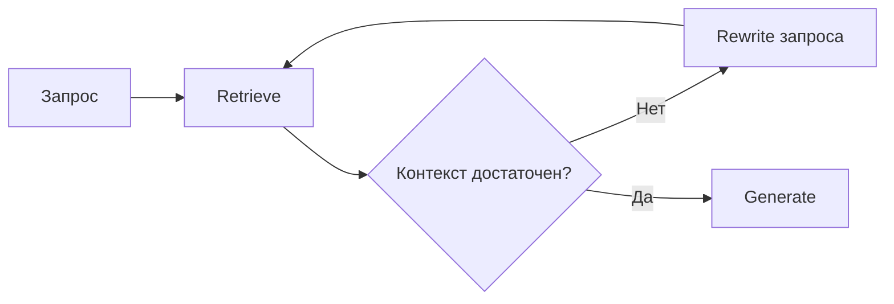

import ExternalCodeEmbed from '@site/src/components/ExternalCodeEmbed';


# Работа с ИИ-моделями

<div class="article-tags">
  <span class="tag tag-required">ОБЯЗАТЕЛЬНО</span>
  <span class="tag tag-beginner">ДЛЯ НОВИЧКОВ</span>
</div>

<span class="complexity-badge">Всем</span>

---

## Работа с ИИ-моделями

Основная цель работы с моделью — правильно её загрузить, настроить окружение, определить параметры генерации и организовать взаимодействие между пользователем (или системой) и моделью. Это может происходить как через облачные API ([OpenAI / API — готовые промпты и вызовы](/lab/Примеры/1149); текст запросов — [Prompt engineering — библиотека](/lab/Примеры/1150)), так и локально, без подключения к интернету.

Локальный запуск — это сценарий, где вы храните веса модели у себя, поднимаете локальный сервер и отправляете запросы без внешнего API.

---

## Локальное развёртывание моделей

### Как запускать модель локально

Базовый путь для первого запуска

- Скачайте `LM Studio`
- Скачайте модель с [Hugging Face](https://huggingface.co/models), например Qwen или Llama
- Включите серверный режим в `LM Studio` по адресу `http://localhost:1234/v1`
- Установите расширение `Continue` в Visual Studio Code
- Настройте чат и проверьте ответы на 5-10 реальных запросах

Но есть важные нюансы по железу, лицензиям и качеству модели.

Локальный запуск ИИ-модели обеспечивает:

- **Полный контроль над данными** — информация остаётся на вашем устройстве.
- **Автономность** — работа возможна при отсутствии интернета.
- **Гибкость** — можно изменять параметры, использовать собственные промпты, интегрировать в свои приложения.
- **Приватность** — особенно важно при работе с конфиденциальными документами, исходным кодом, внутренними базами знаний.

Для этого требуется загрузить веса модели (обычно в формате GGUF, safetensors или .bin), выбрать подходящий движок (например, `llama.cpp`, `Ollama`, `LM Studio`) и обеспечить достаточные вычислительные ресурсы. GPU-ускорение поддерживается только для совместимых видеокарт (NVIDIA с поддержкой CUDA).

Самый простой путь для новичка — LM Studio или Ollama: сначала запускаете маленькую модель, затем постепенно переходите к более тяжёлым.

Перед началом работы обязательно проверьте ресурсы компьютера. Чтобы не перегружать систему, не используйте без необходимости слишком тяжелые модели, начните с простых - к примеру, при первом запуске LM Studio предложить установить модель от Google, и можно будет потестировать сразу её. Контекстное окно ограничено (обычно 4K–32K токенов в зависимости от модели).

В LM Studio можно воспользоваться поиском, и выбрать сразу готовые модели. При загрузке модели сохранятся в локальном хранилище приложения (поэтому лучше в параметрах сразу выбрать место хранения моделей с диском побольше).

При первом запуске модель загружается в оперативную память и будет занимать 10-60 секунд. При закрытии приложения модель выгружается из памяти — при следующем запуске потребуется повторная загрузка. Избегайте одновременной загрузки нескольких моделей — это быстро исчерпает оперативную память.

Для интеграции с кодом запускайте локальный сервер - LM Studio это умеет. 

---

### Мини-словарь для новичка

- **Inference (инференс)** — применение уже обученной модели к новым запросам.
- **Weights (веса)** — параметры модели; именно их вы скачиваете как файл.
- **Checkpoint** — сохранённое состояние модели после обучения.
- **Квантизация** — сжатие весов (например, Q4/Q5) ради меньшего потребления памяти.
- **Контекстное окно** — сколько токенов модель может учитывать за один запрос.
- **Токен** — кусочек текста (слово, часть слова, символ), а не "символ" в привычном смысле.

---

### Бесплатно

Использование локальных моделей через LM Studio **бесплатно в плане прямых платежей за запросы**, но есть важные нюансы, которые необходимо учитывать.

| Аспект | Статус |
|--------|--------|
| Само приложение LM Studio (Desktop) | Бесплатно для личного использования |
| Загрузка моделей из встроенного каталога | Бесплатно (трафик оплачивается вашим провайдером) |
| Количество запросов к локальной модели | Неограниченно, без подписки |
| Отсутствие передачи данных на серверы | Полная локальность — данные не покидают ваш компьютер |

Большинство популярных моделей распространяются под лицензиями с условиями:

| Модель / Поставщик | Лицензия | Коммерческое использование | Ограничения |
|--------------------|----------|----------------------------|-------------|
| **Llama 3 / Llama 3.1** (Meta) | Llama Community License | Разрешено при соблюдении условий | Запрещено обучение на выходных данных модели для улучшения других LLM; требуется >700M MAU для уведомления Meta |
| **Mistral / Mixtral** (Mistral AI) | Apache 2.0 + дополнительные условия | Разрешено | Аналогичные ограничения на обучение |
| **Qwen** (Alibaba) | Tongyi Qianwen LICENSE | Разрешено с условиями | Требуется согласие для очень крупных развёртываний |
| **Phi-3** (Microsoft) | MIT | Разрешено | Минимальные ограничения |
| **Command R+** (Cohere) | CC-BY-NC 4.0 | **Запрещено** без коммерческой лицензии | Только некоммерческое использование |

> Для личного использования (включая обучение, эксперименты, написание кода для себя) ограничения практически не влияют. Проблемы возникают при:
> - Интеграции модели в коммерческий продукт/сервис
> - Предоставлении доступа третьим лицам за плату
> - Массовом развёртывании без соблюдения условий лицензии


---

### Требования к оборудованию

#### Оперативная память (RAM)

Минимальный объём оперативной памяти зависит от размера модели:
- Модель 3B (3 миллиарда параметров): ~6–8 ГБ RAM
- Модель 7B: ~12–16 ГБ RAM
- Модель 13B: ~24–32 ГБ RAM
- Модель 70B: 64+ ГБ RAM (часто требует GPU)

Если используется только CPU, вся модель загружается в оперативную память. При использовании GPU часть весов может храниться в видеопамяти.

---

#### Видеопамять (VRAM)

GPU значительно ускоряет генерацию. Для комфортной работы:
- 7B модель в 4-битном квантовании: ~6 ГБ VRAM
- 13B модель: ~10–12 ГБ VRAM
- 70B модель — 24+ ГБ VRAM (например, NVIDIA A100, RTX 4090)

Модели с квантованием (например, Q4_K_M) требуют меньше памяти, но немного теряют в точности.

---

#### Свободное место на диске

Веса моделей занимают от 2 ГБ (для 3B) до 40+ ГБ (для 70B в FP16). После квантования размер уменьшается:
- Llama-3-8B-Q4_K_M.gguf ≈ 4.7 ГБ
- Mistral-7B-Instruct-v0.3-Q5_K_M.gguf ≈ 5.2 ГБ

Также требуется место для временных файлов, кэша эмбеддингов, векторных баз данных.

---

## Квантование и GPU-ускорение

### Что такое квантование

**Квантование** — это техника снижения точности чисел, представляющих веса нейросети. Вместо 16-битных (`float16`) или 32-битных (`float32`) чисел используются 4-битные (`int4`) или 5-битные (`int5`) представления.

Преимущества:
- Уменьшение размера модели в 3–4 раза
- Снижение требований к RAM/VRAM
- Возможность запуска больших моделей на потребительских устройствах

Недостатки:
- Незначительное снижение качества ответов
- Потеря в сложных рассуждениях или точных вычислениях

Форматы квантования в `llama.cpp`:
- `Q4_0` — базовое 4-битное квантование
- `Q4_K_M` — улучшенное, сохраняет больше информации в ключевых весах
- `Q5_K_S`, `Q6_K` — более точные, но крупнее

Выбор формата — баланс между производительностью и качеством.

---

### GPU-ускорение

Современные фреймворки (`llama.cpp`, `vLLM`, `text-generation-webui`) поддерживают частичную или полную загрузку модели на GPU. Это достигается через библиотеки CUDA (NVIDIA) или Metal (Apple).

Пример: запуск `llama.cpp` с использованием GPU:
```bash
./main -m models/llama-3-8b.Q5_K_M.gguf -n 512 --gpu-layers 35
```
Параметр `--gpu-layers 35` указывает, сколько слоёв нейросети загрузить в видеопамять. Чем больше — тем быстрее генерация, но выше требования к VRAM.

---

## Понятия

### Что такое токен

**Токен** — минимальная единица текста, которую модель обрабатывает. Это может быть слово, подслово или символ.

Примеры:
- Слово "hello" → 1 токен
- Слово "привет" → 1 токен
- "unbelievable" → ["un", "believ", "able"] → 3 токена
- Число "2025" → 1 токен
- Пробел или знак препинания — часто отдельный токен

Модели работают не с буквами, а с токенами. Скорость генерации измеряется в **токенах в секунду** (tokens/sec). На CPU — 2–10 токенов/сек, на мощном GPU — 50–200+.

---

### Контекстное окно

**Контекстное окно** — максимальное количество токенов, которые модель может одновременно "помнить" при генерации. Это сумма входного запроса и выходного ответа.

Примеры:
- Llama-3-8B: 8192 токенов
- Mistral-7B: 32768 токенов
- Claude 3.5 Sonnet: 200 000 токенов
- Gemini 1.5 Pro: до 2 000 000 токенов

Если ваш документ длиннее контекстного окна, его нужно разбивать на части или использовать RAG (см. ниже).

---

### Что означает "7B", "70B"

Буква **B** означает **миллиард параметров** (billion). Это количество обучаемых весов в нейросети.

- **3B** — лёгкая модель, подходит для мобильных устройств, простых задач
- **7B–13B** — золотая середина: хорошее качество, запускается на RTX 3060–4090
- **34B–70B** — высокое качество, требует серверного оборудования или нескольких GPU
- **>100B** — обычно доступны только через облачные API (GPT-4, Claude Opus)

Больше параметров ≠ всегда лучше. Архитектура, качество данных и обучение играют ключевую роль.

---

Обзор AI-конструкторов, no-code и выхода на сервер без ежедневного кодинга — [Цифровые инструменты без ручного кодинга](./117).

---

## Как скачивать и устанавливать локальные модели

### Источники моделей

Основной источник — **Hugging Face Hub** (https://huggingface.co/models). Здесь размещены тысячи открытых моделей:
- **Meta** — Llama, Llama2, Llama3
- **Mistral AI** — Mistral, Mixtral, Ministral
- **Google**: Gemma, Gemma2
- **Microsoft**: Phi-3, Phi-4
- **Alibaba**: Qwen
- **DeepSeek**: Deepseek-Coder, Deepseek-MoE
- **NVIDIA**: Nemotron
- **IBM**: Granite
- **THUDM**: GLM

Фильтруйте по лицензии (MIT, Apache 2.0 — разрешено коммерческое использование), количеству параметров и задаче (chat, code, reasoning).

---

### Форматы файлов

- **GGUF** — бинарный формат, оптимизированный для `llama.cpp`. Поддерживает квантование. Используется в LM Studio, Ollama, Jan.
- **safetensors** — безопасный формат от Hugging Face, без выполнения кода при загрузке.
- **PyTorch (.bin)** — стандартный формат для обучения и тонкой настройки.

---

### Инструменты для запуска

| Инструмент | Описание | Особенности |
|-----------|--------|------------|
| **Ollama** | Простой CLI и REST API | Автоматическая загрузка, поддержка чат-интерфейса, Docker |
| **LM Studio** | Графический интерфейс + сервер | Поддержка GGUF, чат, настройка параметров, RAG |
| **Jan** | Десктопное приложение с открытым исходным кодом | Похоже на ChatGPT, поддержка локальных моделей |
| **llama.cpp** | Высокопроизводительная C++ библиотека | Минимальные зависимости, GPU-ускорение, CLI |
| **LocalAI** | OpenAI-совместимый сервер | Можно подключать как замену `openai.ChatCompletion` |
| **Text Generation WebUI** | Веб-интерфейс с множеством функций | Поддержка LoRA, переключение моделей, расширенные параметры |

Пример установки через Ollama:
```bash
ollama pull llama3:8b-instruct-q5_K_M
ollama run llama3
```

---

## Чат-интерфейс и параметры генерации

Полная **напоминалка** по семи параметрам (temperature, top_p, top_k, max_tokens, frequency/presence penalty, stop) — в статье [Параметры генерации LLM](/encyclopedia/6-ai/6-04-modeli-i-instrumenty/118). Ниже — кратко для локального стека.

### Основные параметры

| Параметр | Описание | Типичные значения |
|---------|--------|------------------|
| **Temperature** | Креативность / случайность | 0.1 (точно) – 1.0 (креативно) |
| **Top-p (nucleus sampling)** | Пул токенов с суммарной вероятностью ≥ p | 0.9 – 0.95 |
| **Top-k** | Только k самых вероятных токенов на шаге | 40–100 (зависит от модели) |
| **Max tokens** | Максимальная длина ответа | 256 – 2048 |
| **Repeat penalty** (`repeat_penalty` в llama.cpp) | Штраф за повторение (аналог frequency) | 1.0 – 1.2 |
| **Stop** | Строки остановки генерации | по шаблону промпта |

- **Низкая температура (0.1–0.3)** — предсказуемые, фактические ответы. Подходит для технических вопросов, кода.
- **Высокая температура (0.7–1.0)** — креативные, разнообразные ответы. Подходит для генерации историй, идей.

---

### Пример настройки в коде (через `llama-cpp-python`)


<ExternalCodeEmbed example="python/ai-6-6-05-razrabotka-ii-113-001" title="Пример настройки в коде (через `llama-cpp-python`)" minHeight={372} />


---

## Интеграция с кодом

### Библиотеки

- **`llama-cpp-python`** — Python-обёртка над `llama.cpp`. Поддерживает GPU, streaming, функции.
- **`transformers` (Hugging Face)** — универсальная библиотека для загрузки и запуска моделей (требует больше RAM).
- **`unsloth`** — оптимизированная версия `transformers` для быстрого fine-tuning.
- **`vLLM`** — высокопроизводительный сервер для обслуживания моделей.

---

### Запуск модели как OpenAI-совместимого API

С помощью **LocalAI** или **Ollama** можно создать эндпоинт, совместимый с `openai` SDK:

```python
from openai import OpenAI

client = OpenAI(
    base_url="http://localhost:11434/v1",  # Ollama
    api_key="ollama"
)

response = client.chat.completions.create(
    model="llama3",
    messages=[{"role": "user", "content": "Напиши функцию на Python для сортировки списка."}]
)
print(response.choices[0].message.content)
```

Это позволяет использовать существующий код без изменений. Тот же приём с `base_url` и разбор строк — [OpenAI / API — готовые промпты и вызовы](/lab/Примеры/1149); теория — [локальные модели и Ollama](/encyclopedia/6-ai/6-05-razrabotka-ii/113).

---

## Подходы к работе с ИИ-моделями

Существует три основных подхода к использованию больших языковых моделей (LLM) в практических задачах: **использование готовой модели**, **дообучение (fine-tuning)** и **RAG (Retrieval-Augmented Generation)**. Каждый из них решает разные задачи, требует разных ресурсов и подходит для разных сценариев.

---

### Как не путать обучение, дообучение и fine-tuning

- **Обучение с нуля (pretraining)** — модель учится на огромном корпусе данных с нуля. Это самый дорогой путь (обычно только крупные компании).
- **Дообучение и fine-tuning** — берёте готовую модель и адаптируете её под свой домен или формат ответов.
- **Инструкционное дообучение (instruction tuning)** — частный случай fine-tuning, где модель учат лучше следовать инструкциям "запрос → ответ".
- **RAG** — не изменяет веса модели; модель получает внешние документы прямо во время запроса.
- **Практический порядок для новичка**
- стартуйте с готовой модели
- добавьте RAG по своей базе знаний, см. [RAG, MCP и агенты](/encyclopedia/6-ai/6-04-modeli-i-instrumenty/121)
- переходите к fine-tuning после оценки на тестовом наборе, см. [Трансформеры и NLP](/encyclopedia/6-ai/6-09-transformery-i-nlp/intro)

Связанные материалы по теме  

- [Машинное обучение](/encyclopedia/6-ai/6-02-mashinnoe-obuchenie/1)
- [Обучение на базе готовой модели](/encyclopedia/6-ai/6-02-mashinnoe-obuchenie/3)
- [Параметры генерации LLM](/encyclopedia/6-ai/6-04-modeli-i-instrumenty/118)
- [Как выбрать модель и где её запускать](/encyclopedia/6-ai/6-04-modeli-i-instrumenty/125)

---

### Готовая модель без обучения

Это самый простой и распространённый способ. Модель используется "как есть" — без изменения её весов или структуры. Пользователь формулирует запрос, модель генерирует ответ на основе внутренних знаний, заложенных при предварительном обучении.

**Преимущества:**
- Минимальные требования к оборудованию
- Быстрое внедрение
- Не требуется набор обучающих данных
- Подходит для общих задач — чат, написание кода, суммаризация, перевод

**Ограничения:**
- Нет специализированных знаний (например, о вашем продукте, внутренней документации, терминологии)
- Ответы могут быть неточными в узких предметных областях
- Сложно контролировать формат вывода

**Типичные инструменты:** Ollama, LM Studio, Jan, `llama.cpp`, Hugging Face Transformers (в режиме inference)

---

### Трансферное обучение и тонкая настройка

**Трансферное обучение (transfer learning)** — предобученная модель используется как извлекатель признаков — ранние слои **заморожены**, обучается только добавленная "голова" (классификатор, проекция). Градиенты не идут в backbone. Подходит при малой разметке и близкой задаче (классификация изображений на базе ImageNet).

**Тонкая настройка (fine-tuning)** — веса **предобученной** части тоже обновляются (целиком или через LoRA/адаптеры). Модель глубже подстраивается под домен, жаргон и формат. Требует больше данных и GPU, зато даёт более сильную адаптацию, чем одна только голова.

Сравнение с **мультизадачным** и **федеративным** обучением — в статье [Обучение на базе готовой модели](/encyclopedia/6-ai/6-02-mashinnoe-obuchenie/3).

---

### Дообучение (Fine-tuning)

**Дообучение** — это процесс дополнительного обучения предварительно обученной модели на специализированном наборе данных. Веса модели изменяются, чтобы она лучше соответствовала вашей предметной области, стилю или формату вывода.

**Когда применяется:**
- Требуется строгий контроль над стилем ответа (например, техническая документация в корпоративном стиле)
- Нужна поддержка узкоспециализированной терминологии
- Задача требует специфического формата (JSON, XML, таблицы)
- Модель должна имитировать поведение конкретного эксперта

**Требования:**
- GPU с 24+ ГБ видеопамяти (RTX 3090/4090, A100 и выше)
- Набор качественных пар "ввод → ожидаемый вывод" (обычно от 100 до нескольких тысяч примеров)
- Время: от нескольких часов до нескольких дней
- Опыт в машинном обучении

**Методы дообучения:**
- **Full fine-tuning** — обновление всех параметров модели. Требует много памяти.
- **LoRA (Low-Rank Adaptation)** — обучение небольших адаптеров, которые добавляются к исходной модели. Экономит память и время.
- **QLoRA** — LoRA поверх квантованной модели. Позволяет дообучать 7B–13B модели даже на 16 ГБ VRAM.

**Инструменты:** Unsloth, Hugging Face PEFT, Axolotl, `transformers` + `bitsandbytes`

---

### RAG — генерация с внешним контекстом

**RAG (Retrieval-Augmented Generation)** — это архитектурный паттерн, при котором модель не хранит все знания внутри себя, а динамически извлекает релевантную информацию из внешнего источника (например, вашей документации) и использует её для генерации ответа. В архитектуре продукта RAG — **слой знаний**; рядом с ним обычно стоят **MCP** (подключение tools) и **агент** (многошаговые действия) — [обзор трёх слоёв](/encyclopedia/6-ai/6-04-modeli-i-instrumenty/121).

Основная цель RAG — повысить точность и достоверность генерируемых текстов, особенно в задачах, где требуется знание конкретных фактов или специализированных данных.

Пример: пользователь спрашивает у чат-бота "`Какие существуют типы нейронных сетей?`". 

Если модель обучена только на общих текстах, она может дать общее описание. Но если к ней подключён RAG, и в её базе есть документы по архитектуре ИИ, то можно получить более точную информацию, включая конкретные виды сетей (CNN, RNN, Transformer и т.п.) с ссылками на соответствующие источники.

RAG дополняет LLM, позволяя использовать внешние данные как контекст. Вместо того чтобы полагаться исключительно на внутреннее знание модели, она берёт информацию из заранее подготовленных источников и строит ответ на основе этой информации.

Концептуально, это выглядит так:
- вы разворачиваете у себя на компьютере программу для управления моделями, к примеру `LM Studio`;
- скачиваете и устанавливаете модель LLM;
- разворачиваете и включаете локальный сервер;
- загружаете модель на сервер (она выгружается в ОЗУ);
- готовите некий набор базы знаний;
- индексируете набор данных, готовите к обработке;
- настраиваете взаимодействие с моделью.

В результате, при каждом запросе будет направляться не только пользовательский промпт, но и весь контекст, а модель сможет анализировать информацию по подключенной и индексированной базе.

В отличие от использования готовых расширений, можно написать свои программы для работы:
1. Скачать `LM Studio`;
2. Скачать модель с `Hugging Face` (например, Qwen или Llama);
3. Включить режим сервера в `LM Studio` (по адресу `http://localhost:1234/v1`);
4. Создать файл `config.py` с конфигурацией:
- путь к базе знаний,
- параметры индексации,
- параметры модели,
- путь к векторному хранилищу.
5. Создать файл `index.py`, который должен:
- загружать все Markdown-файлы из директории;
- разбивать документы на чанки;
- создавать векторное хранилище.
6. Создать файл `query.py`, который будет:
- загружать векторное хранилище;
- подключаться к LM Studio;
- искать контекст и обрабатывать запрос с промптом;
- выводить результат.

Всё остальное должна делать модель через LM Studio.

Под капотом, конечно, сложнее - но мы как раз это и разберём.

**Как это работает:**
1. Пользователь задаёт вопрос.
2. Система преобразует вопрос в **эмбеддинг** (векторное представление).
3. По этому эмбеддингу выполняется поиск по **векторной базе данных**, содержащей заранее проиндексированные фрагменты ваших документов.
4. Наиболее релевантные фрагменты (чанки) добавляются в промпт как контекст.
5. Модель генерирует ответ, опираясь на этот контекст.

**Преимущества:**
- Не требуется переобучение модели
- Можно обновлять знания, просто обновляя документы в базе
- Ответы точны и актуальны
- Работает даже с небольшими моделями (3B–7B)

**Ресурсы:**
- Умеренные: CPU или GPU с 8+ ГБ VRAM
- Достаточно одного запуска индексации
- Подходит для локального развёртывания

**Идеально для:**
- Чат-ботов по внутренней документации
- Анализа кодовой базы проекта
- Ответов на вопросы по учебным материалам
- Поиска по технической базе знаний

---

## RAG-система поверх локальной модели

Рассмотрим пошагово, как создать систему, которая отвечает на вопросы по вашему проекту, используя только локальные ресурсы.

---

### Шаг 1. Подготовка файлов проекта

Предположим, у вас есть папка `my_project/` с исходным кодом, README, документацией в Markdown и конфигурационными файлами.

Цель — позволить модели отвечать на вопросы вроде:
> "Как инициализируется подключение к базе данных в этом проекте?"

---

### Шаг 2. Индексация документов

Для этого потребуется:
- Разбить документы на **чанки** (фрагменты текста)
- Преобразовать каждый чанк в **эмбеддинг** с помощью локальной модели векторизации
- Сохранить эмбеддинги и исходные тексты в **векторное хранилище**

---

#### Что такое чанк?

**Чанк** — это фрагмент текста фиксированного или переменного размера. Например:
- Размер: 512 токенов
- Перекрытие (overlap): 50 токенов (чтобы не разрывать смысл на границе)

Overlap помогает сохранить контекст между соседними чанками.

---

#### Какие модели использовать для эмбеддингов?

Локальные модели векторизации:
- `sentence-transformers/all-MiniLM-L6-v2` — лёгкая, быстрая, хороша для общих задач
- `BAAI/bge-m3` — более мощная, поддерживает мультиязычность и гибридный поиск
- `nomic-ai/nomic-embed-text-v1.5` — высокое качество, открытая лицензия

Все они работают через библиотеку `sentence-transformers`.

---

#### Пример скрипта индексации (`index.py`)


<ExternalCodeEmbed example="python/ai-6-6-05-razrabotka-ii-113-002" title="Пример скрипта индексации (`index.py`)" minHeight={678} />


Запуск:
```bash
python index.py
```

После этого в папке `./chroma_db` появится векторная база данных.

---

### Шаг 3. Запуск модели в режиме сервера

Используем **LM Studio**, так как он предоставляет OpenAI-совместимый API.

1. Скачайте LM Studio (https://lmstudio.ai/)
2. Загрузите модель, например `Llama-3-8B-Instruct-Q5_K_M.gguf`
3. Перейдите во вкладку **Local Server**
4. Нажмите **Start Server** (по умолчанию: `http://localhost:1234/v1`)

Теперь вы можете обращаться к модели через стандартный `openai` SDK.

---

### Шаг 4. RAG-запрос к модели

Создадим скрипт `rag_query.py`:


<ExternalCodeEmbed example="python/ai-6-6-05-razrabotka-ii-113-003" title="Шаг 4. RAG-запрос к модели" minHeight={720} />


Запуск:
```bash
python rag_query.py
```

Результат — точный, контекстуальный ответ, основанный на ваших документах.

---

## Параметры генерации и RAG

Для RAG-систем обычно задают **низкую temperature (0.1–0.3)** и умеренный **top_p (~0.9)**, чтобы ответ опирался на поданный контекст. Подробно про все параметры декодирования, в том числе **frequency_penalty**, **presence_penalty** и **stop** в облачных API — [Параметры генерации LLM](/encyclopedia/6-ai/6-04-modeli-i-instrumenty/118).

---

## Интеграция в приложения

Локальные модели можно интегрировать в любые приложения:

- **Десктоп**: через `llama-cpp-python` или вызов CLI-утилит
- **Веб**: запустить `llama.cpp` как HTTP-сервер или использовать LocalAI
- **Мобильные**: через ONNX-модели или специализированные движки (MLC LLM)
- **Автоматизация** — скрипты на Python, PowerShell, Bash

Пример: автоматическая генерация changelog на основе коммитов в Git.

---

## Готовая модель, fine-tuning, RAG

Выбор подхода зависит от задачи, доступных ресурсов и требований к точности.

| Критерий | Готовая модель | Fine-tuning | RAG |
|---------|----------------|-------------|-----|
| **Требования к оборудованию** | Минимальные (CPU или GPU с 6+ ГБ VRAM) | Высокие (GPU с 24+ ГБ VRAM, много RAM) | Умеренные (CPU или GPU с 8+ ГБ VRAM) |
| **Время внедрения** | Минуты–часы | Дни–недели | Часы–дни |
| **Необходимость данных** | Не требуется | Требуется набор пар "ввод → ожидаемый вывод" | Требуется база знаний в виде документов |
| **Обновление знаний** | Невозможно без замены модели | Требует повторного обучения | Просто обновить документы и пересоздать индекс |
| **Контроль над ответом** | Ограниченный | Высокий (стиль, формат, терминология) | Средний (зависит от качества контекста) |
| **Идеальный сценарий** | Общие вопросы, код, перевод | Корпоративный стиль, специфические форматы | Внутренняя документация, техническая поддержка |

Для большинства локальных применений **RAG — оптимальный выбор**: он сочетает гибкость, точность и низкие требования к оборудованию.

---

## Инструменты для локальной работы с моделями

### Hugging Face и HF Inference Endpoints

**Hugging Face Hub** — центральный репозиторий открытых моделей. Большинство современных LLM там представлены в нескольких форматах — PyTorch, safetensors, GGUF.

**HF Inference Endpoints** — облачный сервис для развёртывания моделей с платной подпиской. Подходит, если нет локального GPU, но требует интернета и оплаты.

Для локальной работы используются:
- `transformers` — загрузка и запуск моделей в PyTorch/TensorFlow
- `sentence-transformers` — эмбеддинги для RAG
- `accelerate`, `bitsandbytes` — квантование и ускорение на GPU

---

### llama.cpp и llama-cpp-python

**llama.cpp** — реализация Llama-совместимых моделей на C++ с поддержкой CPU и GPU (через CUDA/Metal). Минимальные зависимости, высокая производительность на CPU.

**llama-cpp-python** — Python-обёртка, позволяющая легко интегрировать модель в скрипты, веб-приложения, RAG-системы.

Преимущества:
- Поддержка GGUF-формата
- Возможность частичной загрузки на GPU (`n_gpu_layers`)
- Streaming-генерация
- Совместимость с OpenAI API через LocalAI

---

### LM Studio

Графическое приложение для Windows/macOS/Linux. Позволяет:
- Искать и скачивать модели из Hugging Face
- Запускать чат-интерфейс
- Настройку параметров генерации
- Запуск OpenAI-совместимого сервера (`http://localhost:1234/v1`)

Идеально для быстрого прототипирования и тестирования.

---

### Ollama

Кроссплатформенный CLI-инструмент с простым синтаксисом:
```bash
ollama run llama3 "Объясни HTTP"
```

Поддерживает:
- Автоматическую загрузку моделей
- Создание пользовательских моделей через `Modelfile`
- REST API (`http://localhost:11434/api/generate`)
- Docker-образы

---

### Jan, Unsloth, Pi, Jellybox, Lemonade

- **Jan** — десктопный клиент с открытым исходным кодом, похож на ChatGPT.
- **Unsloth** — библиотека для ускоренного fine-tuning (до 2x быстрее).
- **Pi, Jellybox, Lemonade** — экспериментальные интерфейсы, часто с фокусом на UX или мобильность.

---

### Docker и Runner

Многие инструменты (LocalAI, Ollama, Text Generation WebUI) предоставляют официальные Docker-образы. Это упрощает развёртывание в изолированной среде.

Пример:
```dockerfile
FROM ollama/ollama
COPY . /models
RUN ollama create my-model -f ./Modelfile
EXPOSE 11434
```

---

## Выбор модели

Открытые модели не являются прямой альтернативой GPT-4, но многие из них конкурируют с GPT-3.5.

| Модель | Автор | Особенности | Рекомендации |
|--------|-------|-------------|--------------|
| **Llama 3 (8B, 70B)** | Meta | Отличное качество, поддержка 8K контекста, MIT лицензия | Универсальный выбор для большинства задач |
| **Mistral / Mixtral** | Mistral AI | Высокая эффективность, 32K контекст, MoE-архитектура | Для сложных рассуждений и длинных документов |
| **Qwen** | Alibaba | Поддержка мультиязычности, сильна в коде | Для международных проектов |
| **Gemma** | Google | Лёгкие модели (2B, 7B), Apache 2.0 | Для устройств с ограничениями по памяти |
| **Phi-3** | Microsoft | Компактная (3.8B), но мощная, оптимизирована под CPU | Для мобильных и edge-устройств |
| **Deepseek-Coder** | DeepSeek | Специализирована на генерации кода | Для разработчиков |
| **Nemotron** | NVIDIA | Оптимизирована для enterprise-сценариев | Для корпоративного использования |
| **Granite** | IBM | Фокус на безопасность и соответствие стандартам | Для регулируемых отраслей |

**Совет**: начинайте с **Llama-3-8B-Instruct** или **Mistral-7B-Instruct** — они дают лучшее соотношение качества и ресурсов.

---

## LangChain

**LangChain** — это набор инструментов для построения приложений поверх LLM. Он абстрагирует взаимодействие с моделями, векторными хранилищами, инструментами и памятью.

Основные компоненты:
- **LLM** — обёртка над моделью (Ollama, LlamaCpp, HuggingFace)
- **Embeddings** — генерация эмбеддингов (HuggingFaceEmbeddings, OllamaEmbeddings)
- **VectorStore** — работа с Chroma, FAISS, Pinecone
- **Retriever** — поиск релевантных чанков
- **Chain** — цепочка операций (например, RAG Chain)
- **Agent** — система, которая может вызывать инструменты на основе промпта

Пример RAG-цепочки:


<ExternalCodeEmbed example="python/ai-6-6-05-razrabotka-ii-113-004" title="LangChain" minHeight={372} />


LangChain упрощает создание сложных систем, но добавляет зависимостей. Для простых случаев достаточно напрямую использовать `llama-cpp-python` и `Chroma`.

---

## ChromaDB и sentence-transformers

### sentence-transformers

Библиотека от SBERT.net для генерации эмбеддингов из текста. Работает на CPU/GPU, поддерживает сотни моделей.

Популярные модели:
- `all-MiniLM-L6-v2` — 384-мерный, быстрый, хорош для общих задач
- `BAAI/bge-m3` — 1024-мерный, поддержка гибридного поиска (ключевые слова + семантика)
- `nomic-embed-text-v1.5` — 768-мерный, Apache 2.0, высокое качество

---

### ChromaDB

Лёгкое векторное хранилище, работающее в памяти или на диске. Не требует отдельного сервера.

Особенности:
- Автоматическое сохранение на диск (`persist_directory`)
- Поддержка метаданных (источник файла, дата и т.д.)
- Встроенный similarity search
- Совместимость с LangChain

Индексация занимает от нескольких секунд (для 100 KB текста) до минут (для больших кодовых баз).

---

## Продвинутый RAG

Базовый RAG (чанк → эмбеддинг → top-k → промпт) покрывает большинство MVP. Когда качество поиска "плывёт" или база растёт, добавляют **варианты retrieval** и **агентный контур** вокруг RAG — подробный разбор паттернов в [GraphRAG и agentic RAG](./124). Теория GraphRAG — в [графовых БД](/encyclopedia/3-data-markup/3-06-nosql/7); runnable-примеры — в [Практикуме — проекты по ИИ](./122).

### HyDE — Hypothetical Document Embeddings

Вместо эмбеддинга **вопроса** модель сначала генерирует **гипотетический ответ** (короткий абзац "как мог бы выглядеть идеальный фрагмент документа"), эмбеддит его и ищет по индексу. Запрос пользователя часто короче и "другой по форме", чем текст в базе — HyDE сближает их в векторном пространстве.

| Плюс | Минус |
|------|-------|
| Лучше recall на размытых вопросах | +1 вызов LLM на запрос |
| Не нужно переиндексировать базу | Галлюцинация в гипотезе может увести поиск |

### Hybrid RAG — vector + graph

**Параллельный** поиск: векторный retriever находит семантически близкие чанки, граф знаний (сущности и связи из документов) отвечает на запросы вида "кто с кем связан" и "какие темы пересекаются". Результаты **сливают** в один контекст перед генерацией. Подходит для корпусов с именами, отношениями и перекрёстными ссылками — см. [GraphRAG](/encyclopedia/3-data-markup/3-06-nosql/7).

### Agentic RAG — self-reflection

Граф состояний (часто **LangGraph**), а не один проход retrieve → generate:



Узел **grading** оценивает, хватает ли найденных чанков; при провале — **переформулировка запроса** и повторный поиск. Снижает ответы "из головы" при пустом или шумном retrieval. Цена — latency и токены на каждую итерацию; задайте `max_iterations` и бюджет.

### Router RAG — несколько индексов

Один **router-агент** (или structured output) выбирает, в какую базу идти — продукты, поддержка, финансы, внутренняя wiki. При низкой релевантности — fallback на web search или эскалацию человеку. Паттерн Router в оркестрации — [Оркестрация AI-агентов](./121#маршрутизатор--иерархия-router--supervisor).

### Vision и multimodal RAG

Текстовый RAG плохо индексирует **таблицы, диаграммы и сканы**. Варианты:

- рендер страницы PDF в изображение + vision-LLM при ответе;
- мультимодальные эмбеддинги (текст + картинка в одном индексе);
- OCR/layout parsing → текст → классический RAG.

Подробнее — [трансформеры в разных модальностях](/encyclopedia/6-ai/6-09-transformery-i-nlp/8), [распознавание и structured extraction](/encyclopedia/6-ai/6-06-primenenie-ii/120).

### Инструменты вокруг RAG

| Инструмент | Роль |
|------------|------|
| **Firecrawl** | Скрапинг и очистка веб-страниц для индексации |
| **Instructor** | Structured output (Pydantic) — ответ LLM с валидацией схемы; удобно для "документ → JSON" |
| **Landing AI ADE** | Парсинг сложной вёрстки PDF/сканов (таблицы, колонки) перед RAG |
| **BM25 + vector** | Гибридный полнотекстовый и семантический поиск — см. [поиск BM25](/encyclopedia/1-basics/1-21-poisk-informatsii/1) |

Выбор паттерна: начните с **базового vector RAG**; HyDE и agentic grading добавляйте по метрикам recall на golden set, а не "на всякий случай".

---
