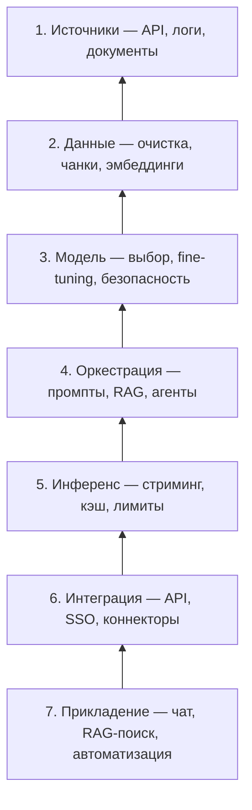

import ExternalPlayEmbed from '@site/src/components/ExternalPlayEmbed';

---

# Семь слоёв LLM-стека

  ОБЯЗАТЕЛЬНО
  ДЛЯ НОВИЧКОВ

Архитектору
Разработчику
Аналитику

<ExternalPlayEmbed example="ai/llm-stack-layers-play" title="7 слоёв LLM-стека" minHeight={520} />

Промпт и вызов API — лишь верхушка системы на LLM. Ниже лежат сбор данных, подготовка корпусов, выбор и дообучение модели, оркестрация RAG и агентов, инференс, интеграция с корпоративным ПО и, наконец, продукт для пользователя. **Семь слоёв LLM-стека** — снизу вверх — дают общий язык для ТЗ, архитектуры и оценки зрелости проекта: на каком уровне уже есть решения, а где дыры.

Горизонтальные темы проектирования (NFR, API, gateway, БД, threat modeling) — в разделе [Проектирование](/encyclopedia/7-project/7-06-proektirovanie-i-arhitektura/design/intro); там же таблица, как стыковать эти главы со слоями 2–6.

  
Как пользоваться

  

  При разборе чужого продукта или своего MVP пройдитесь по слоям 1→7. Частая ошибка — инвестировать только в слой 7 (чат-бот) и слой 5 (API модели), пропуская слои 2 (качество данных) и 4 (RAG, guardrails).
  

---

## Обзор

| Слой | Вопрос, на который отвечает |
|------|------------------------------|
| 1. Источники и сбор | Откуда берём сырьё для обучения и контекста? |
| 2. Предобработка и управление | Как превращаем сырьё в датасет, индекс, политики доступа? |
| 3. Модель и обучение | Какую базу берём и как адаптируем под домен? |
| 4. Оркестрация | Как связываем промпт, память, инструменты и сценарии? |
| 5. Инференс | Как запускаем модель в проде — задержка, стоимость, безопасность? |
| 6. Интеграция | Как подключаем стек к CRM, ERP, биллингу, IAM? |
| 7. Прикладение | Что видит пользователь и какой бизнес-эффект? |

Подробнее про роли аналитика, данных и разработки в типовом проекте — [Основы разработки ИИ-решений](./1). Теория LLM и обучение — [Большие языковые модели](./../6-04-modeli-i-instrumenty/1).

---

## Слой 1 — источники данных и сбор

Задача слоя — **достать** текст, метаданные и события из внешнего мира и положить их в контур компании.

Типичные каналы:

- веб-скрапинг и краулеры;
- открытые датасеты (Common Crawl и узкие отраслевые корпуса);
- корпоративные БД и озёра данных;
- SaaS (CRM, ERP, тикеты);
- внешние API и партнёрские фиды;
- документы PDF, DOCX, PPTX;
- логи, события, телеметрия приложений;
- IoT и edge-устройства.

На этом этапе фиксируют **право на использование** данных, срок хранения и чувствительность. Для RAG важны не «все файлы с диска», а источники с понятным владельцем и расписанием обновления. Поиск и оценка открытых корпусов — в материалах про [поиск информации](/encyclopedia/1-basics/1-21-poisk-informatsii/intro); интеграции с внешними системами — в разделе [интеграционного взаимодействия](/encyclopedia/2-system-network/2-09-osnovy-integratsionnogo-vzaimodeystviya/intro).

---

## Слой 2 — предобработка и управление данными

Сырой поток превращают в то, что можно **индексировать, версионировать и отдавать модели**.

Основные работы:

- очистка, дедупликация, снижение доли PII;
- нормализация текста и OCR для сканов;
- стратегия **чанкинга** (размер окна, перекрытие, границы по заголовкам);
- создание и переиндексация **эмбеддингов**;
- обогащение метаданными и схемами;
- версионирование датасетов и lineage;
- governance и разграничение доступа;
- защищённое хранение и кэш подготовленных фрагментов.

Для RAG качество ответа чаще упирается в слой 2. Векторный поиск и хранилища — [Векторные базы данных](/encyclopedia/3-data-markup/3-06-nosql/812); подготовка корпусов для fine-tuning и RAG — [Основы разработки ИИ-решений](./1).

---

## Слой 3 — выбор модели и обучение

Здесь решают, **какая нейросеть** будет ядром и **сколько** её менять под задачу.

- выбор foundation-модели (семейства вроде GPT, Llama, Qwen, Mistral);
- fine-tuning, LoRA, QLoRA;
- prompt-tuning и адаптеры;
- RLHF / RLAIF для предпочтений и тона;
- safety tuning и наборы для red-teaming;
- дистилляция, квантование, pruning;
- подготовка мультимодальности (изображение, аудио);
- трекинг экспериментов и eval-наборы.

Большинство продуктов останавливаются на **готовой модели + лёгкая адаптация**; полный pre-training — редкий и дорогой путь ([создание своей модели](./1#как-создать-свою-модель)). Сравнение transfer learning, fine-tuning и федеративного обучения — [Обучение на базе готовой модели](/encyclopedia/6-ai/6-02-mashinnoe-obuchenie/3). Этапы pre-training и SFT в статье про [большие языковые модели](/encyclopedia/6-ai/6-04-modeli-i-instrumenty/1).

---

## Слой 4 — оркестрация и пайплайны

Слой связывает данные, модель и бизнес-логику в **повторяемые сценарии**.

- шаблоны промптов и управление параметрами;
- фреймворки агентов (LangChain, CrewAI и аналоги);
- роли нескольких агентов и передача контекста;
- tool / function calling;
- контекст и долговременная память (**RAG**, сессии);
- планирование, перепланирование, self-reflection;
- workflow-движки (Airflow, Temporal) для пакетных и долгих задач;
- guardrails, политики, управление секретами.

RAG как паттерн — в [Основах разработки ИИ-решений](./1); агенты и вызов инструментов — [Агенты искусственного интеллекта](/encyclopedia/6-ai/6-04-modeli-i-instrumenty/116); MCP как слой интеграции tools — [MCP-серверы](/encyclopedia/6-ai/6-04-modeli-i-instrumenty/114). Как RAG, MCP и агент делят роли в одном продукте — [три слоя архитектуры](/encyclopedia/6-ai/6-04-modeli-i-instrumenty/121). Для no-code-сценариев цепочки часто собирают в iPaaS — см. [Цифровые инструменты без ручного кодинга](./117).

---

## Слой 5 — инференс и исполнение

Модель **работает** под нагрузкой: здесь измеряют latency, стоимость токена и стабильность.

- режимы real-time, batch и **streaming** ответа;
- глубина рассуждений (chain-of-thought, "думающие" модели);
- мультимодальный ввод и вывод;
- контроль детерминизма — temperature, top_p, top_k ([шпаргалка по параметрам](/encyclopedia/6-ai/6-04-modeli-i-instrumenty/118));
- кэш промптов и результатов, KV-cache на железе;
- on-device и edge-инференс;
- autoscaling, rate limiting, очереди;
- safety-фильтры на входе и выходе.

Локальный запуск и движки (Ollama, vLLM, llama.cpp) — [Работа с ИИ-моделями](./113). Онлайн- и офлайн-инференс в теории — [раздел про инференс](/encyclopedia/6-ai/6-04-modeli-i-instrumenty/1) в статье о LLM.

---

## Слой 6 — интеграция

LLM-сервис встраивают в **существующий ландшафт** предприятия.

- REST, gRPC, GraphQL как контракт для клиентов;
- SDK и CLI для разработчиков;
- шины событий и webhooks;
- коннекторы (Slack, Jira, Salesforce и др.);
- выгрузка в warehouse / lakehouse (data sinks);
- идентификация и авторизация (SSO, OIDC);
- биллинг, квоты, metering;
- feature flags и централизованный config.

Типовые паттерны внедрения в CRM/ERP и асинхронные очереди — [Архитектура](./1#архитектура) в основах разработки. Общие принципы API и обмена сообщениями — [интеграционное взаимодействие](/encyclopedia/2-system-network/2-09-osnovy-integratsionnogo-vzaimodeystviya/intro). Для **мобильных и SPA-клиентов** с LLM — BFF и угроза утечки ключей: [Безопасная интеграция LLM в мобильные и клиентские приложения](/encyclopedia/6-ai/6-10-bezopasnost-pri-rabote-s-ii/10).

---

## Слой 7 — прикладной уровень

Верхний слой — **ценность для пользователя** и измеримый эффект.

- чат-боты и copilot в IDE или CRM;
- корпоративный поиск и RAG-приложения;
- автоматизация документов (сводки, черновики, извлечение полей);
- ассистенты для кода и аналитики данных;
- автоматизация процессов (тикеты, согласования);
- прогнозная аналитика с генеративным слоем;
- рекомендации и персонализация;
- отраслевые агенты (медицина, право, поддержка);
- **мобильные** чат-ассистенты и кроссплатформенные клиенты.

Критерии зрелости продукта, экономика и риски маркетинга "на базе ИИ" — [Применение ИИ в бизнес-процессах](/encyclopedia/6-ai/6-06-primenenie-ii/1). Риски быстрой генерации без ревью — [Вайб-кодинг](/encyclopedia/6-ai/6-07-vayb-koding-i-neurokontent/1). Безопасность LLM в клиенте (ключ не в приложении) — [6.10/10](/encyclopedia/6-ai/6-10-bezopasnost-pri-rabote-s-ii/10).

---

## Минимальный путь по слоям

Для **корпоративного RAG-ассистента** чаще всего достаточно:

1. документы и wiki (слой 1);
2. чанки + эмбеддинги + векторная БД (слой 2);
3. API готовой LLM без собственного pre-training (слой 3);
4. промпт + retrieval + опционально tools (слой 4);
5. streaming API с лимитами и модерацией (слой 5);
6. SSO и REST за API-gateway (слой 6);
7. веб-чат или плагин в портал (слой 7).

Для **тонкой настройки под домен** добавляют слой 3 (LoRA/SFT) и усиливают слой 2 (разметка, eval). Для **агента с действиями** критичны слои 4 и 6 (инструменты, права, аудит).

---

## Связь с ролями в команде

| Слой | Кто чаще ведёт |
|------|----------------|
| 1–2 | Data engineer, ML engineer, аналитик данных |
| 3 | ML engineer, исследователь |
| 4–5 | Backend, ML platform, DevOps/MLOps |
| 6 | Backend, интегратор, security |
| 7 | Product, аналитик, frontend, предметный эксперт |

Один человек на старте может закрыть несколько слоев; при росте нагрузки их разводят по командам и SLA.

**Операции по слоям** — отдельные статьи в разделе [6.08 AgentOps и MLOps](/encyclopedia/6-ai/6-08-agentops/intro):

- слои **1–3** — [MLOps и LLM-стек](/encyclopedia/6-ai/6-08-agentops/2) (ingestion, index, training, registry);
- слои **4–7** — [AgentOps и LLM-стек](/encyclopedia/6-ai/6-08-agentops/1) (eval, tracing, CI gates, feedback).

DevOps-практики (Git, CI/CD, IaC) — [8.04](/encyclopedia/8-infra-security/8-04-devops-ci-cd/intro); agent-specific runbooks — [AgentOps в DevOps](/encyclopedia/8-infra-security/8-04-devops-ci-cd/2151).
