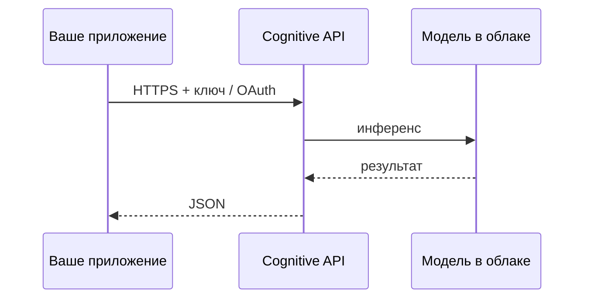

import ExternalCodeEmbed from '@site/src/components/ExternalCodeEmbed';


# Облачные API Cognitive Services

<div class="article-tags">
  <span class="tag tag-beginner">ДЛЯ НОВИЧКОВ</span>
</div>

<span class="complexity-badge">Разработчику</span>

**Cognitive Services** (термин Microsoft) обобщает **готовые модели в облаке**: вы отправляете изображение, аудио или текст по HTTPS и получаете JSON с результатом — без обучения своей нейросети и без GPU в своём ЦОД. Аналоги у **Amazon** (Rekognition, Transcribe, Comprehend), **Google** (Cloud Vision, Speech-to-Text, Natural Language API). Принципы интеграции те же, что у [REST API](/encyclopedia/2-system-network/2-09-osnovy-integratsionnogo-vzaimodeystviya/117).

Когда нужна полная кастомизация — см. [Scikit-learn](/encyclopedia/6-ai/6-02-mashinnoe-obuchenie/10), [Keras](/encyclopedia/6-ai/6-03-neyroseti/114) и [распознавание своими моделями](/encyclopedia/6-ai/6-06-primenenie-ii/120).

---

## Зачем облачный API

| Плюс | Минус |
|------|--------|
| MVP за часы | Зависимость от провайдера и региона |
| Масштаб без своего MLOps | Стоимость при миллионах вызовов |
| Обновление модели на стороне вендора | Данные уходят в облако (комплаенс) |
| SDK на Python, C#, Java, REST | Лимиты квот и rate limit |

Типичные сценарии — модерация контента, OCR счетов, субтитры к видео, теги на фото в каталоге, чат-бот с **Azure OpenAI** / Bedrock поверх тех же учётных записей.

---

## Карта сервисов по задачам

| Задача | Microsoft Azure | Amazon Web Services | Google Cloud |
|--------|-----------------|---------------------|--------------|
| Анализ изображения | Azure AI Vision | Rekognition | Cloud Vision API |
| Лица | Vision (Face) | Rekognition Faces | Vision (face detection) |
| OCR / документы | Document Intelligence | Textract | Document AI |
| Речь → текст | Speech to Text | Transcribe | Speech-to-Text |
| Текст → речь | Speech (TTS) | Polly | Text-to-Speech |
| Язык, NER, тон | Language service | Comprehend | Natural Language API |
| Перевод | Translator | Translate | Cloud Translation |
| LLM / чат | Azure OpenAI Service | Bedrock | Vertex AI (Gemini) |

Названия продуктов меняются (ранее "Cognitive Services" часто объединяют в **Azure AI services**); в документации провайдера смотрите актуальный endpoint и версию API.

---

## Общая схема вызова



1. Создать ресурс в портале (Azure, AWS, GCP).
2. Получить **ключ** и **endpoint** (или IAM-роль для AWS).
3. Вызывать REST или официальный SDK.
4. Логировать `request-id`, обрабатывать 429 (throttling) и 5xx с retry.

Секреты — в переменных окружения или Key Vault, не в репозитории.

---

## Пример — Azure AI Vision (анализ изображения)


<ExternalCodeEmbed example="python/ai-6-6-05-razrabotka-ii-120-001" title="Пример — Azure AI Vision (анализ изображения)" minHeight={588} />


Ответ может включать подпись кадра, теги, рамки объектов — пересекается с задачами из [Распознавание лиц, объектов и текста](/encyclopedia/6-ai/6-06-primenenie-ii/120).

---

## Пример — AWS Rekognition (детекция лиц)

```python

import boto3

client = boto3.client("rekognition", region_name="eu-central-1")

with open("photo.jpg", "rb") as f:
    response = client.detect_faces(Image={"Bytes": f.read()}, Attributes=["DEFAULT"])

for face in response["FaceDetails"]:
    box = face["BoundingBox"]
    print(box["Width"], box["Height"], face["Confidence"])
```

Для сравнения лиц — `CompareFaces`; для коллекций — `IndexFaces` + `SearchFacesByImage`.

---

## Пример — Google Cloud Vision (OCR)

```python
from google.cloud import vision

client = vision.ImageAnnotatorClient()
with open("scan.png", "rb") as f:
    image = vision.Image(content=f.read())

response = client.text_detection(image=image)
for text in response.text_annotations:
    print(text.description)
    break
```

Аутентификация — сервисный аккаунт JSON или Workload Identity в GKE.

---

## LLM поверх того же облака

Чат и генерация текста часто идут **отдельным** продуктом:

- **Azure OpenAI** — GPT-модели с enterprise SLA;
- **Amazon Bedrock** — Claude, Llama и др.;
- **Vertex AI** — Gemini.

Архитектура агентов и RAG — [Семь слоёв LLM-стека](/encyclopedia/6-ai/6-05-razrabotka-ii/119), [агенты ИИ](/encyclopedia/6-ai/6-04-modeli-i-instrumenty/116). Cognitive API для зрения/речи можно комбинировать с LLM: OCR → текст → промпт в GPT.

---

## Безопасность и эксплуатация

- **PII** на изображениях и в транскриптах — минимизировать хранение, шифрование, договор DPA с провайдером.
- **Регион** данных (EU, РФ) — выбирать endpoint в нужной юрисдикции.
- **Квоты** — мониторинг в портале, алерты на 429.
- **Версионирование API** — фиксировать версию в URL, тестировать при обновлении вендора.

Корпоративный контекст Microsoft — [как IT видят облака](/encyclopedia/1-basics/1-04-kak-vidyat-it-obychnye-lyudi/711); DevOps и CI для ML — [MLOps в DevOps](/encyclopedia/8-infra-security/8-04-devops-ci-cd/2151).

---

## Когда уходить с API на свою модель

Облако перестаёт быть выгодным, если:

- стабильно **> миллионов** вызовов в месяц при предсказуемой нагрузке;
- нужен **офлайн** или закрытый контур без egress;
- домен **сильно отличается** от публичных моделей (узкая медицинская визуализация, редкий язык).

Тогда — [transfer learning](/encyclopedia/6-ai/6-02-mashinnoe-obuchenie/3), деплой ONNX/TFLite, собственный endpoint за API Gateway.
