# Оркестрация AI-агентов

  ОБЯЗАТЕЛЬНО

Архитектору
Разработчику
Аналитику

Один чат с универсальной моделью хорош для прототипа, но сложный бизнес-процесс редко укладывается в один промпт. **Оркестрация AI-агентов** — это проектирование **кто**, **когда** и **с каким контекстом** вызывает модель, инструменты и память: несколько узких агентов вместо одного "монолитного" ИИ.

Базовые понятия агента, ReAct и безопасность tools — в [Агентах ИИ](/encyclopedia/6-ai/6-04-modeli-i-instrumenty/116). Слой оркестрации в [семи слоях LLM-стека](./119) — это **слой 4**; эксплуатация runtime — [AgentOps](/encyclopedia/6-ai/6-08-agentops/1).

  
Аналогия с инфраструктурой

  

  Слово "оркестрация" в IT уже знакомо из мира контейнеров: там оркестратор (Kubernetes, Docker Swarm) **распределяет** нагрузку между изолированными процессами. В AI-стеке оркестратор **распределяет подзадачи** между агентами. Чтобы не путать термины, полезно понимать, что такое [контейнер](/encyclopedia/8-infra-security/8-06-konteynerizatsiya-i-orkestratsiya/111) и зачем нужен [раздел "Контейнеризация и оркестрация"](/encyclopedia/8-infra-security/8-06-konteynerizatsiya-i-orkestratsiya/intro) — это другой, но родственный по смыслу уровень абстракции.
  

---

## Ступень сложности: нужен ли мультиагент?

Прежде чем проектировать "оркестр из пяти агентов", стоит проверить, не хватит ли более простого уровня. В [руководстве Microsoft по шаблонам агентов](https://learn.microsoft.com/ru-ru/azure/architecture/ai-ml/guide/ai-agent-design-patterns) выделяют три ступени — каждая добавляет координацию, задержку и расход токенов.

| Ступень | Суть | Когда достаточно |
|---------|------|------------------|
| **Прямой вызов модели** | Один промпт, без tools и цикла агента | Классификация, сводка, перевод в один проход |
| **Один агент с tools** | ReAct: модель сама выбирает API, RAG, SQL | Один домен, динамические, но предсказуемые действия; часто **лучший default** для enterprise |
| **Мультиагентная оркестрация** | Несколько ролей, общий контекст, агрегация | Межфункциональные задачи, разные границы безопасности, параллельная специализация |

  
Правило "один агент, много tools"

  

  Если одному агенту хватает allow-list инструментов и [MCP](/encyclopedia/6-ai/6-04-modeli-i-instrumenty/114), разбиение на несколько агентов часто **дороже в сопровождении**, чем выгода. Мультиагент оправдан, когда один агент **перегружен** инструментами, политиками или контекстом — или когда нужны **разные модели** под разные шаги.
  

Эта статья сфокусирована на **третьей ступени**. Паттерны ниже — про координацию, когда одного агента уже недостаточно.

---

## Что такое оркестрация

**Оркестрация** (от англ. *orchestration*, "дирижирование") — координация **многих исполнителей** по заранее заданным или динамически выбираемым правилам — порядок шагов, ветвления, таймауты, повтор при ошибке, сбор результатов.

В классической инфраструктуре оркестратор отвечает за:

- **планирование** — на какой ноде запустить контейнер;
- **масштабирование** — сколько реплик держать под нагрузкой;
- **связность** — сеть, секреты, тома между сервисами;
- **жизненный цикл** — перезапуск упавшего pod, rolling update.

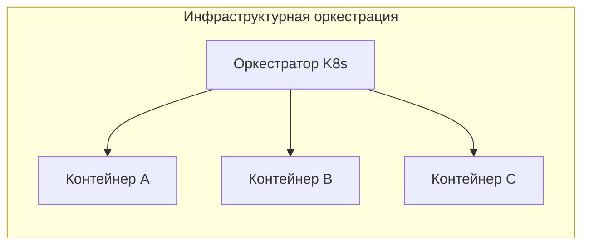

В прикладном ПИ оркестрация встречается и без Docker — CI/CD-пайплайн, BPM-система, saga в микросервисах — везде есть **дирижёр** и **исполнители**.

### Цикл AI-оркестрации в продукте

В прикладных системах (поддержка, маркетинг, аналитика) повторяется один и тот же цикл — его удобно закладывать в ТЗ и в observability:

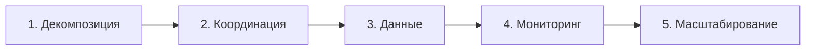

| Этап | Что делает оркестратор |
|------|-------------------------|
| **Декомпозиция** | Дробит запрос на подзадачи под роли агентов |
| **Координация** | Задаёт порядок, параллельность, маршрут, лимиты итераций |
| **Данные** | Нормализует CRM, логи, RAG; передаёт **только нужный** контекст следующему агенту |
| **Мониторинг** | Метрики, eval, обратная связь; узкие места по агентам и моделям |
| **Масштабирование** | Новый агент или модель в каталоге без переписывания всего графа |

На стыке с классическим data engineering те же идеи встречаются в **Apache Airflow** (DAG задач) и **Kubeflow** (пайплайны ML на Kubernetes) — это оркестрация **обучения и ETL**, а не диалога; для LLM-агентов чаще берут LangGraph, CrewAI, n8n или BPM-движок с вызовами API модели.

---

## Оркестрация AI-агентов

**Оркестрация AI-агентов** — централизованное управление, координация и распределение задач между несколькими **специализированными** LLM-агентами (или ролями одной модели) для автоматического решения **сложных, многоступенчатых** бизнес-процессов.

Вместо одного универсального "монолитного" ИИ задача **декомпозируется**:

| Роль агента | Пример |
|-------------|--------|
| Анализ текста | Классификация обращения, извлечение сущностей |
| Доступ к данным | SQL, CRM API, RAG по базе знаний |
| Проверка | Code review, compliance, фактчекинг |
| Синтез | Финальный ответ пользователю или запись в систему |

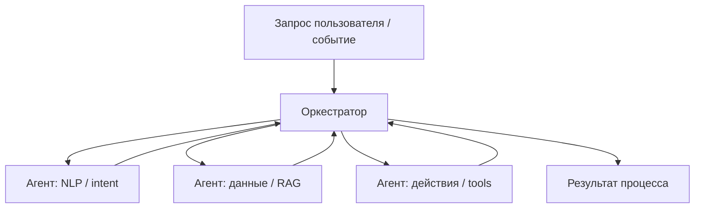

Оркестратор в коде — это не обязательно отдельная "модель-менеджер"; часто это **граф состояний** (LangGraph), **crew** с ролями (CrewAI) или **workflow** в n8n. Сущность одна — **явный контроль потока**, а не надежда на то, что один длинный промпт сам догадается о порядке шагов.

Связка с архитектурой продукта:

- **RAG** даёт знания ([три слоя](/encyclopedia/6-ai/6-04-modeli-i-instrumenty/121));
- **MCP** стандартизирует tools;
- **оркестрация** связывает агентов, память, лимиты и политики на [слое 4](./119).

Подобно дирижёру в оркестре ([формулировка из обзоров мультиагентных систем](https://routerai.ru/pages/orkestraciya-ii-agentov)), оркестратор следит, чтобы агент **вступил в нужный момент**, получил **нужные tools** и передал результат дальше без "зависания" в цикле.

---

## Доверие, последствия и человек в контуре

В проде оркестрация — это не только схема на доске, а ответ на вопрос: **можно ли доверить агенту действие с реальными последствиями?** Практический опыт внедрений (в т.ч. [перевод статьи Niall Deehan на Habr](https://habr.com/ru/articles/887370/)) сводится к двум осям:

| | Низкие последствия | Высокие последствия |
|---|-------------------|---------------------|
| **Высокое доверие** | Автоответ в FAQ, черновик письма | Закрытие тикета, обновление CRM, выплата по правилам |
| **Низкое доверие** | Подсказка человеку | Эскалация оператору, HITL перед tool call |

Сегодня многие внедрения остаются в левом верхнем квадрате — агент — "чёрный ящик", который **генерирует текст**, а человек или детерминированный код выполняет действие. Следующий шаг — **прозрачная оркестрация** — кто вызван, почему, с каким уровнем уверенности, и при каком пороге включается человек.

### Цепочка рассуждений и "судья"

Недоверие часто из‑за ответа "почему так?" без объяснения. **Chain of Thought** в промпте заставляет модель показать ход мыслей; оркестрация может **проверить** его:

- два агента параллельно оценивают, **кто компетентнее** по запросу (домен FEEL vs общий JSON);
- третий ("судья") сравнивает CoT и выбирает маршрут;
- в BPMN-процессе (Camunda и аналоги) такие ветки **аудируемы** — видно, какой агент и почему был выбран.

Это тот же паттерн **Parallel + Router**, но с явным критерием доверия, а не только с классификацией intent.

### Человек как оркестратор

Пока нет автоматического порога доверия, **человек** часто и есть оркестратор — Gemini для JSON, другой copilot для FEEL, глаза — для prod. Задача платформы — **закодировать** эту логику — политики, eval, лимиты, эскалация. Иначе масштабирование упирается в "только Саша знает, какого бота звать".

---

## Монолитный ИИ против мультиагентной схемы

| Критерий | Один большой промпт | Оркестрация агентов |
|----------|---------------------|---------------------|
| Сложность задачи | FAQ, краткая генерация | Много шагов, разные источники |
| Права и риски | Один набор tools | Least privilege по роли |
| Стоимость | Один длинный контекст | Можно дешевле: маленькая модель на классификации |
| Отладка | Трудно локализовать ошибку | Trace по шагам и агентам |
| Предсказуемость | Ниже на длинных цепочках | Паттерн задаёт структуру |

Мультиагент не значит "обязательно пять моделей": часто это **одна** foundation-модель с разными system-промптами и разными allow-list инструментов — но поток всё равно **явно** описан оркестратором.

---

## Паттерны оркестрации

Ниже — **базовые** паттерны (Sequential, Parallel, Router, Debate) и **расширенные**, как в [официальном гайде Microsoft](https://learn.microsoft.com/ru-ru/azure/architecture/ai-ml/guide/ai-agent-design-patterns): handoff, групповой чат, magentic-планирование. Их **комбинируют**: Sequential для подготовки данных → Parallel для анализа → Debate перед публикацией.

### Сводная таблица паттернов

| Паттерн | Другие имена | Координация | Главный риск |
|---------|--------------|-------------|--------------|
| Sequential | Pipeline, chain | Линейно, выход → вход | Ошибка на раннем шаге "тянет" весь конвейер |
| Parallel | Fan-out / fan-in, scatter-gather | Независимо, потом merge | Конфликт фактов без стратегии слияния |
| Router / Supervisor | Orchestrator–worker | Один диспетчер назначает исполнителей | Неверный маршрут |
| Debate / Critic | Maker–checker, generator–validator | Цикл до OK или лимита | Зацикливание, 2×–3× токены |
| Handoff | Transfer, delegation | **Один** активный агент, передача "эстафеты" | Бесконечные передачи между агентами |
| Group chat | Round table, council | Общий поток, диспетчер ходов | Длинные дискуссии, &gt;3 агентов сложно контролировать |
| Magentic | Dynamic planning | Менеджер ведёт **живой** реестр задач | Медленная сходимость, не для срочных инцидентов без лимитов |
| Saga | — (из микросервисов) | Долгий процесс + **компенсации** при сбое | Сложность учёта частично выполненных шагов |

### Последовательный конвейер (Sequential)

Линейная передача: **Агент A** завершает шаг → результат уходит **Агенту B** → и так далее. Подходит для pipeline с жёсткой зависимостью ("сначала извлечь поля, потом запрос в БД, потом оформить ответ").

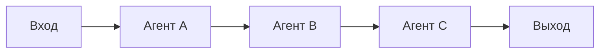

**Плюсы:** простая отладка, понятный audit trail.  
**Минусы:** суммарная латентность = сумма шагов; ошибка на шаге 2 блокирует всё.

---

### Параллельное выполнение (Parallel)

Задача **дробится** на независимые части; агенты работают **одновременно**; **агрегатор** (или финальный агент) собирает ответы.

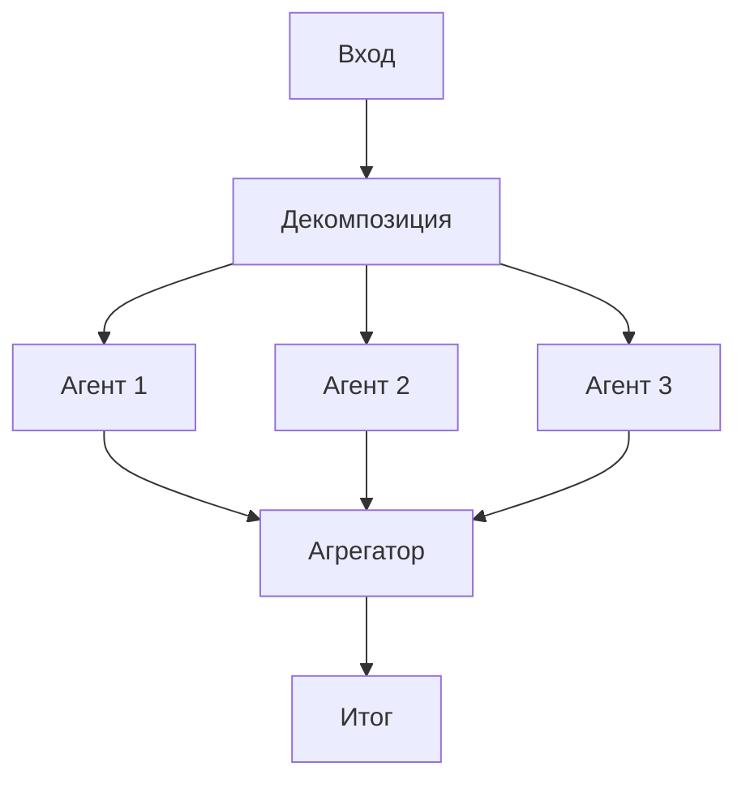

**Пример:** параллельно — поиск в Confluence, запрос в CRM и проверка SLA; агрегатор формирует единый бриф для оператора.

**Плюсы:** меньше wall-clock time.  
**Минусы:** нужна стратегия слияния конфликтующих фактов; выше расход токенов при трёх полных прогонах.

---

### Маршрутизатор / иерархия (Router / Supervisor)

**Главный агент-менеджер** принимает запрос, **классифицирует** intent, **декомпозирует** и **назначает** подзадачи исполнителям. Исполнители могут быть специализированными subgraph.

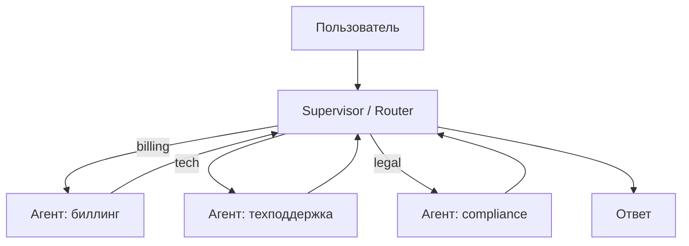

Типичная реализация: structured output (`route: tech | sales`) или tool `delegate_to_agent(name)`. В LangGraph это узлы с conditional edges.

**Плюсы:** один вход для пользователя; масштабирование экспертизы по доменам.  
**Минусы:** ошибка маршрутизации отправляет задачу "не туда" — нужны eval и fallback на человека.

---

### Дебаты и критика (Debate / Critic)

Один агент **предлагает** решение (генератор, proposer); второй **ищет** ошибки, дыры в логике, нарушения политики (критик). Цикл повторяется до **консенсуса**, лимита итераций или эскалации человеку.

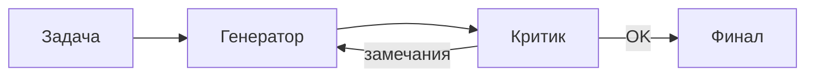

**Пример:** генерация SQL → критик проверяет только `SELECT`, запрет `DROP`, соответствие схеме.

**Плюсы:** выше качество на рискованных артефактах (код, юридический текст).  
**Минусы:** 2×–3× токены и время; критик может "застрять" в педантичности — нужен rubric в промпте.

В Microsoft-терминологии это частный случай **оркестрации группового чата** — цикл maker–checker с формальной очередью ходов.

---

### Передача задачи (Handoff)

Один агент ведёт диалог, пока не упирается в границу компетенции, затем **передаёт управление** другому (сеть → биллинг → человек). В каждый момент активен **ровно один** исполнитель — не путать с Parallel.

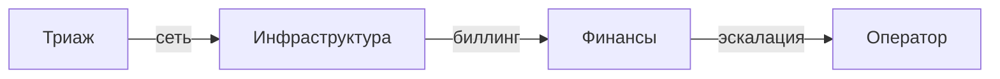

**Когда:** требования к специалисту **выясняются по ходу** разговора (типичный CRM-чат поддержки).  
**Избегать:** маршрут можно задать **детерминированно** из первого сообщения — тогда достаточно Router без цепочки handoff.

---

### Групповой чат (Group chat)

Несколько агентов пишут в **общий поток**; диспетчер решает, кто отвечает следующим. Подходит для мозгового штурма, межфункциональной оценки (парк, градостроительство) и формальных дебатов. Агенты часто в режиме **без side-effect tools** — только текст, чтобы не устроить гонку записей в БД.

**Практика:** ограничьте **≤3 агентов** в одном чате; задайте `max_turns` и критерий "задача решена".

---

### Magentic: динамический план

Для **открытых** задач без заранее известного плана (низкорисковый SRE-инцидент, исследование) менеджер-агент ведёт **реестр задач** — создаёт, уточняет, делегирует специалистам с tools, обновляет план по мере поступления логов. Это ближе к "проектному менеджеру", чем к жёсткому DAG.

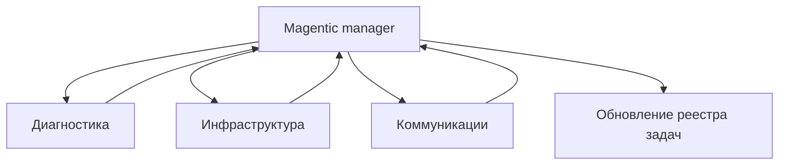

**Когда:** путь решения **нельзя** зашить в BPMN заранее.  
**Избегать:** жёсткий SLA &lt; минуты, детерминированный регламент, частые "пустые" итерации планирования.

---

### Сага для долгих процессов

**Сага** (из микросервисной архитектуры) — цепочка локальных шагов с **компенсирующими** действиями при сбое. Для AI-оркестрации: страховая заявка прошла OCR и fraud-check, но расчёт выплаты упал — откатить до состояния "на ручной проверке" с сохранёнными артефактами.

Сочетается с оркестратором–worker: центральный узел знает, какой шаг выполнен и какой **rollback** вызвать.

---

### Сравнение: когда какой паттерн

| Паттерн | Когда выбирать | Риск |
|---------|----------------|------|
| Sequential | Жёсткий порядок, черновик → ревью → публикация | Суммарная латентность |
| Parallel | Независимые источники, анализ акции с 4 сторон | Конфликт фактов |
| Router | Много типов запросов, каталог агентов | Неверный маршрут |
| Debate | Код, SQL, compliance, контракты | Зацикливание |
| Handoff | Уточнение домена в диалоге | Ping-pong между агентами |
| Group chat | Консенсус, дебаты | Шум, стоимость |
| Magentic | Инцидент, исследование без playbook | Непредсказуемая стоимость |
| Saga | Много систем, часы/дни | Сложность компенсаций |

---

## Инструменты и фреймворки

### Code-first (программирование графа и ролей)

| Инструмент | Сильная сторона | Типичное применение |
|------------|-----------------|---------------------|
| **CrewAI** | Роли, цели, tools "как команда" | Исследование, отчёты, маркетинговые pipeline |
| **AutoGen** (Microsoft) | Гибкие многоагентные чаты, human-in-the-loop | Прототипы, исследовательские сценарии |
| **LangGraph** | Циклы, ветвления, state machine поверх LangChain | Production-агенты со сложным control flow |
| **LangChain** (LCEL) | Цепочки без полноценного графа | Простые Sequential pipeline |
| **AG2** (AutoGen 2) | Многоагентные чаты, специализированные роли | Исследовательские отчёты, коллаборация агентов |
| **Agno** | Лёгкие агенты с tools и memory | SQL-агенты, аналитика, router по БД |
| **smolagents** (Hugging Face) | Агент пишет и выполняет Python на каждом шаге | Задачи с вычислениями, поиск, sandbox |

Дополнительно в enterprise часто используют **Azure AI Agent Service**, **Amazon Bedrock Agents**, **Google Vertex AI Agent Builder** — продуктовая оболочка над теми же паттернами Router + tools.

Runnable-примеры на Agno, smolagents и AG2 — в [Практикуме — проекты по ИИ](./122). Готовый **Agent Swarm** в desktop-среде без сборки графа в коде — [Kimi Work](./117#kimi-work--локальный-desktop-агент).

### Паттерн Planner → Coder → Reviewer

Частый **Sequential**-pipeline для генерации кода и артефактов:

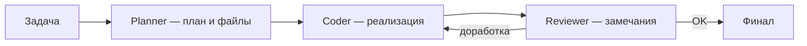

- **Planner** декомпозирует задачу и фиксирует структуру (какие модули, интерфейсы).
- **Coder** пишет код в рамках плана.
- **Reviewer** проверяет стиль, тесты, безопасность; при замечаниях возвращает на Coder.

Тот же каркас применим к SQL, отчётам и юридическим черновикам. В prod обязательны лимит итераций, sandbox для кода, human-in-the-loop перед merge в main — см. [AgentOps](/encyclopedia/6-ai/6-08-agentops/1) и [опасные tool calls](/encyclopedia/8-infra-security/8-03-zabota-o-kode-i-dannyh/101).

### No-code / Low-code

| Платформа | Сильная сторона |
|-----------|-----------------|
| **FlowiseAI** | Open-source, drag-and-drop цепочки LLM |
| **n8n** | Автоматизация бизнес-процессов + ноды LLM, webhooks, CRM |
| **Make / Zapier** | Быстрые интеграции SaaS с шагом "вызов OpenAI" |
| **Apache Airflow** | DAG для данных и триггеров вокруг ML, не диалог |
| **Kubeflow** | Пайплайны обучения/деплоя моделей на K8s |
| **[Camunda / BPMN](/encyclopedia/7-project/7-04-analitika/1231)** | Детерминированная оркестрация + вызовы LLM как service task |

Low-code ускоряет MVP; при росте нагрузки критичные ветки обычно **переносят** в LangGraph/CrewAI в git с тестами и [AgentOps](/encyclopedia/6-ai/6-08-agentops/1). Гибрид **BPMN + агент** разумен, когда регламент жёсткий, а LLM — только на шагах "понять текст" и "сформулировать ответ".

### Пример из практики: ChatDev

Исследовательский проект **ChatDev** (Университет Цинхуа) — виртуальная "компания" разработки ПО — CEO, PM, программисты, QA — все LLM-агенты. Оркестрация задаёт **раунды общения** (планерки, споры о стеке, ревью кода). На демо-сценариях так собирали мини-приложения за минуты при символической стоимости API — показательно как **координация ролей**, а не одна модель "напиши проект", даёт сложный артефакт. Для prod тот же приём переносят с eval, sandbox для кода и [опасных tool calls](/encyclopedia/8-infra-security/8-03-zabota-o-kode-i-dannyh/101).

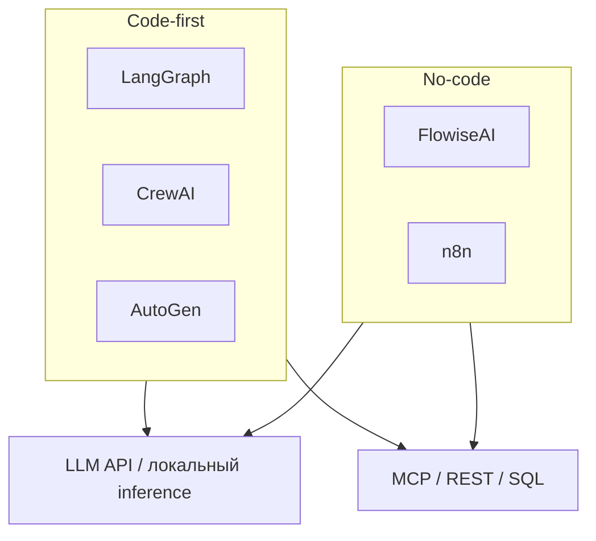

---

## Архитектура внедрения

Типовой **промышленный** контур (слои 4–6 [LLM-стека](./119)):

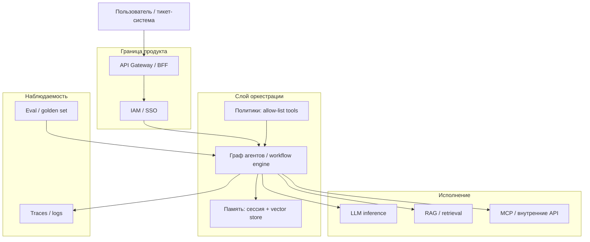

| Компонент | Задача |
|-----------|--------|
| **Gateway** | Rate limit, аутентификация, идемпотентность webhook |
| **Оркестратор** | Паттерн потока, `max_iterations`, таймауты |
| **Память** | Краткая история диалога; долгая — embeddings + metadata |
| **Инструменты** | MCP-серверы, REST, SQL с read-only ролью |
| **Observability** | Span на каждый LLM- и tool-вызов; стоимость токенов |

Развёртывание оркестратора часто совпадает с обычным backend — контейнер в Kubernetes, secrets для API-ключей, отдельный сервис inference или облачный API — см. [Docker](/encyclopedia/8-infra-security/8-06-konteynerizatsiya-i-orkestratsiya/111) и [развёртывание ИИ-моделей](./111).

---

## Оркестратор внутри продукта (маршрутизация моделей)

В потребительских и корпоративных продуктах оркестратор часто **невидим** для пользователя: он не "пять чат-ботов", а **диспетчер** запроса ([разбор на Computerra](https://www.computerra.ru/327045/chto-vnutri-u-ai-orkestratorov-i-pochemu-chatgpt-5-na-samom-dele-luchshe-chatgpt-4/)).

| Без оркестрации | С оркестратором |
|-----------------|-----------------|
| Пользователь всегда включает "самую мощную" модель | Запрос классифицируется по **сложности** |
| Переплата в токенах на простых задачах | Простое → быстрая/дешёвая модель; сложное → цепочка специалистов |
| Один контекст раздувается | Подзадачи уходят агентам с **меньшим** окном контекста |

Типичный внутренний контур:

1. **Каталог агентов/моделей** — роль, допустимые tools, лимиты, метрики качества в прошлом.  
2. **Анализ запроса** — intent, нужны ли данные, код, картинка.  
3. **Маршрут** — одна модель или parallel "несколько мнений → merge".  
4. **Сборка ответа** — согласование фрагментов, устранение противоречий.

С [MCP](/encyclopedia/6-ai/6-04-modeli-i-instrumenty/114) оркестратор выступает **диспетчером** между модулями CRM, аналитики и генерации: единый контекст для алгоритмов, сценарий вроде "собери продажи за неделю и опубликуй в чат" без ручной связки трёх сервисов.

  
FinOps

  

  Отслеживайте токены **по агенту и по run оркестрации**, а не только "счёт OpenAI". Классификация на дешёвой модели + один вызов "тяжёлой" на финале часто дешевле одного GPT-4 на весь диалог.
  

---

## Состояние, контекст и надёжность

Мультиагентная система наследует проблемы **распределённых** систем — таймауты, повторы, каскадные ошибки, гонки при Parallel.

### Контекст между агентами

Каждый переход **раздувает** промпт — CoT, tool output, промежуточные черновики. Не всегда следующему агенту нужен **полный** лог — часто достаточно **структурированной сводки** (JSON, таблица фактов). Иначе быстро упираетесь в лимит окна и падает качество ответа.

Рекомендации:

- хранить **долгое** состояние во внешнем store (БД, workflow engine), а не только в chat history;
- **checkpoint** после каждого узла графа — восстановление после деплоя или падения worker;
- при Parallel не делить **мутабельное** состояние без блокировок или версионирования.

### Надёжность

| Мера | Зачем |
|------|--------|
| Timeout и retry на LLM/tool | Сетевые сбои API |
| Валидация выхода перед следующим шагом | Не протаскивать "мусорный" JSON в SQL-агент |
| Circuit breaker на зависимом агенте | Деградация вместо бесконечных повторов |
| `max_iterations` на циклах Debate/Magentic | Анти-зацикливание |
| HITL на деструктивных tools | Платёж, удаление, mass email |

Тестирование: unit на агента, integration на граф; для LLM — **rubric + eval**, а не `assert equals` ([AgentOps](./../6-08-agentops/1)).

### Антипаттерны (частые в проде)

- Мультиагент "ради моды", когда хватает **одного агента с tools**.  
- Детерминированный BPMN заменён **недетерминированным** magentic там, где регламент фиксирован.  
- Parallel без merge-стратегии (голосование, веса, LLM-synthesis).  
- Один агент с правами админа на все tools.  
- Раздувание контекста: каждый шаг пересылает весь чат с начала времен.

---

## Бизнес-процессы: три примера

### Техподдержка (L1 → L2)

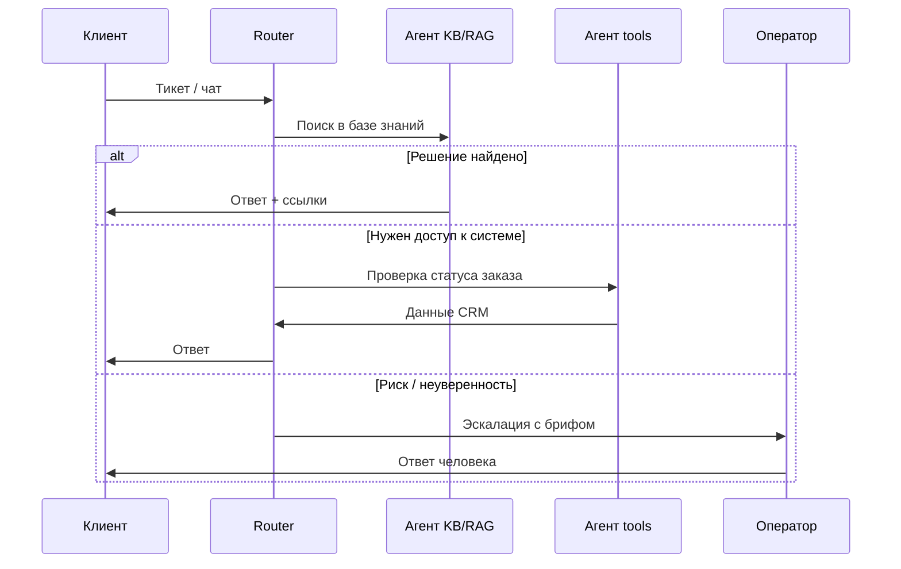

**Паттерны:** Router (тип обращения) + Sequential (RAG → tool) + human-in-the-loop на границе.

**Расширенный сценарий (маркетинг, по [RouterAI](https://routerai.ru/pages/orkestraciya-ii-agentov)):** исследователь → стратег → копирайтер → редактор (Debate/maker–checker) → оркестратор отдаёт пакет кампании; слабый текст возвращается на доработку, а не уходит в публикацию.

---

### Обработка заказа (e-commerce)

1. **Агент извлечения** — парсит письмо/PDF заказа в структуру JSON.  
2. **Parallel** — проверка остатков на складе и валидность адреса доставки.  
3. **Агент оформления** — создаёт черновик заказа в ERP (tool с подтверждением).  
4. **Critic** — сверяет сумму и НДС с прайс-листом.

Ошибка на шаге 2 не должна создавать заказ — оркестратор держит **сагу**: компенсирующие действия или статус `pending_review`.

---

### Генерация контента (маркетинг)

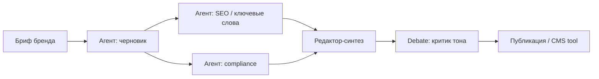

**Паттерны:** Parallel (SEO + legal) + Debate (критик брендбука) + Sequential в CMS.

---

## Как внедряют: практический порядок

1. **Один сценарий end-to-end** — один процесс (например, 20 % типовых тикетов).  
2. **Карта шагов** — какой паттерн на каждом участке (таблица выше).  
3. **Allow-list tools** — минимальные права на агента; см. [Агенты искусственного интеллекта](/encyclopedia/6-ai/6-04-modeli-i-instrumenty/116).  
4. **Golden set + eval** — 30–50 реальных запросов с ожидаемым маршрутом и ответом; порог перед prod — [AgentOps](./../6-08-agentops/1).  
5. **Версионирование промптов** — git, шаблоны из [библиотеки промптов](/lab/Примеры/1150).  
6. **Постепенное расширение** — новый исполнитель = новый узел графа, а не новый "магический" промпт.

  
Типичные ошибки

  

  - Один агент с правами админа БД "на всякий случай".  
  - Нет лимита итераций в Debate — бесконечный цикл генератор ↔ критик.  
  - Параллель без агрегатора — три противоречивых ответа пользователю.  
  - Игнорирование стоимости: три вызова GPT-4 на каждый FAQ.  
  - **Tool sprawl** — десятки разрозненных AI-SaaS без единого аудита ([типичная боль enterprise-оркестрации](https://www.prompts.ai/ru/blog/ai-model-orchestration-workflows-patterns.html)).
  

### Динамическая маршрутизация моделей

На шаге Router можно назначать не только **агента**, но и **модель**: классификация и извлечение сущностей — малый LLM; финальный отчёт — сильный; генерация изображений — отдельный endpoint. Это снижает счёт без потери качества на критичных узлах.

---

## Связь с инфраструктурной оркестрацией

AI-оркестратор и Kubernetes решают **разные** задачи, но их часто **стекируют**:

| Уровень | Что оркеструет |
|---------|----------------|
| Kubernetes | Pod'ы, реплики, health check |
| Docker / образ | Упаковка сервиса оркестратора агентов |
| LangGraph / n8n | Шаги LLM, ветвления, вызов tools |

Микросервис "agent-runtime" в кластере масштабируется HPA по очереди запросов; **логика** маршрутизации остаётся в коде графа, а не в Deployment YAML.

---

## Итоги

**Оркестрация AI-агентов** — осознанное проектирование потока между специализированными агентами (или ролями одной модели), а не надежда на один перегруженный чат. Начинайте с проверки ступени сложности; мультиагент вводите, когда один агент с tools **не тянет** по безопасности, специализации или стоимости контекста.

Опорные паттерны — **Sequential**, **Parallel**, **Router**, **Debate**, плюс **Handoff**, **Group chat**, **Magentic** и **Saga** для длинных и открытых процессов. В проде обязательны — матрица **доверие × последствия**, сжатие контекста между шагами, eval, FinOps по агентам и связка с [AgentOps](/encyclopedia/6-ai/6-08-agentops/intro).

Понимание [контейнера](/encyclopedia/8-infra-security/8-06-konteynerizatsiya-i-orkestratsiya/111) и [инфраструктурной оркестрации](/encyclopedia/8-infra-security/8-06-konteynerizatsiya-i-orkestratsiya/intro) помогает говорить с DevOps на одном языке при развёртывании agent-runtime, не смешивая это с логикой маршрутизации LLM.

---

## Дополнительные материалы

Внешние статьи, на которых опирается расширенная версия этой главы (на русском, где доступно):

| Источник | Тема |
|----------|------|
| [Microsoft — шаблоны оркестрации агентов](https://learn.microsoft.com/ru-ru/azure/architecture/ai-ml/guide/ai-agent-design-patterns) | Уровни сложности, Sequential/Parallel/Group chat/Handoff/Magentic, реализация |
| [Habr — почему агентам нужна оркестрация](https://habr.com/ru/articles/887370/) | Доверие, последствия, CoT, BPMN, HITL (перевод Niall Deehan) |
| [RouterAI — оркестрация ИИ-агентов](https://routerai.ru/pages/orkestraciya-ii-agentov) | Аналогия с дирижёром, маркетинговый pipeline, ChatDev |
| [Computerra — что внутри AI-оркестраторов](https://www.computerra.ru/327045/chto-vnutri-u-ai-orkestratorov-i-pochemu-chatgpt-5-na-samom-dele-luchshe-chatgpt-4/) | Маршрутизация по сложности, каталог агентов, MCP, контекст |
| [Zennolab Journal — AI orchestration](https://journal.zennolab.com/ai-orchestration-chto-jeto-takoe-i-kak-jeto-rabotaet/) | Цикл внедрения, отрасли, Airflow/n8n |
| [Prompts.ai — workflows и patterns](https://www.prompts.ai/ru/blog/ai-model-orchestration-workflows-patterns.html) | Saga, orchestrator–worker, governance, FinOps |
| [Reddit — how agent orchestration works in practice](https://www.reddit.com/r/learnmachinelearning/comments/1dlewks/how_does_ai_agent_orchestration_work_in_practice/?tl=ru) | Обсуждение практики (англ. тред, ru-перевод в URL) |

Внутри энциклопедии — [Агенты ИИ](/encyclopedia/6-ai/6-04-modeli-i-instrumenty/116), [RAG, MCP и агенты](/encyclopedia/6-ai/6-04-modeli-i-instrumenty/121), [Семь слоёв LLM-стека](./119), [AgentOps — слои 4–7](/encyclopedia/6-ai/6-08-agentops/1).

---
