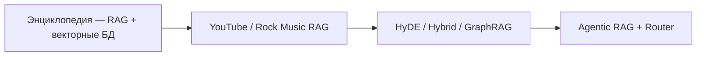

# Практикум — проекты по ИИ

  ДЛЯ НОВИЧКОВ

Разработчику

Энциклопедия даёт **теорию, архитектуру и паттерны**; длинный код — в [lab](/lab/Примеры/1149) и на [code.spirzen.ru](https://code.spirzen.ru/). Для закрепления "руками" удобен внешний сборник **[Hands-On-AI-Engineering](https://github.com/Sumanth077/Hands-On-AI-Engineering)** — ~40 проектов с README, `requirements.txt` и `.env.example` — RAG, агенты, OCR, мультимодальность. Лицензия MIT; язык инструкций — английский.

Ниже — **карта обучения** — сначала прочитайте главу энциклопедии, затем клонируйте проект и запустите по README. Не обязательно проходить всё подряд — выберите ветку под свою цель.

  
Что не копируем

  

  Туториалы из репозитория не дублируются в энциклопедии. Здесь — только <strong>маршрут</strong> и связь "навык ↔ проект". Конкретные имена моделей в репо меняются быстрее, чем паттерны — ориентируйтесь на архитектуру, а не на чекпоинт.
  

---

## Как пользоваться картой

1. Пройдите **базовый маршрут** из [раздела "ИИ"](/encyclopedia/6-ai/ai) хотя бы до [RAG, MCP и агентов](/encyclopedia/6-ai/6-04-modeli-i-instrumenty/121).
2. Выберите **ветку** (RAG, агенты, OCR, мультимодальность).
3. Клонируйте репозиторий: `git clone https://github.com/Sumanth077/Hands-On-AI-Engineering.git`
4. Перейдите в папку проекта, скопируйте `.env.example` → `.env`, заполните API-ключи.
5. После запуска сравните код с теорией в указанной главе и зафиксируйте, что изменили бы для prod ([AgentOps](/encyclopedia/6-ai/6-08-agentops/intro)).

Базовый URL проекта: `https://github.com/Sumanth077/Hands-On-AI-Engineering/tree/main/<путь>`.

---

## Этап 0 — первый вызов API

| Сначала в энциклопедии | Навык | Проект в репо |
|------------------------|-------|---------------|
| [OpenAI / API — готовые промпты](/lab/Примеры/1149) | Chat Completions, system/user, ключи | Любой минимальный RAG или агент с одним LLM-вызовом, например [Rock Music RAG](https://github.com/Sumanth077/Hands-On-AI-Engineering/tree/main/rag_apps/rock_music_rag) |

---

## Ветка 1 — RAG и поиск по знаниям

| Сначала в энциклопедии | Навык | Проект |
|------------------------|-------|--------|
| [RAG в 113](./113#rag--генерация-с-внешним-контекстом) + [векторные БД](/encyclopedia/3-data-markup/3-06-nosql/812) | Чанкинг, эмбеддинги, ChromaDB | [YouTube Transcript RAG](https://github.com/Sumanth077/Hands-On-AI-Engineering/tree/main/rag_apps/youtube_transcript_rag) |
| [Продвинутый RAG в 113](./113#продвинутый-rag) — HyDE | Гипотетический документ вместо сырого запроса | [HyDE RAG](https://github.com/Sumanth077/Hands-On-AI-Engineering/tree/main/rag_apps/hyde_rag) |
| [GraphRAG](/encyclopedia/3-data-markup/3-06-nosql/7) | Граф сущностей + тематические запросы | [GraphRAG Knowledge System](https://github.com/Sumanth077/Hands-On-AI-Engineering/tree/main/rag_apps/graphrag_knowledge_system) |
| [Продвинутый RAG в 113](./113#продвинутый-rag) — hybrid | Параллельно vector + knowledge graph | [Hybrid RAG System](https://github.com/Sumanth077/Hands-On-AI-Engineering/tree/main/rag_apps/hybrid_rag_system) |
| [Оркестрация — Router](./121#маршрутизатор--иерархия-router--supervisor) | Маршрутизация по нескольким индексам | [RAG Agent with Database Routing](https://github.com/Sumanth077/Hands-On-AI-Engineering/tree/main/rag_apps/rag_agent_with_database_routing) |
| [Продвинутый RAG в 113](./113#продвинутый-rag) — agentic | Retrieve → grade → rewrite → generate | [Self-Reflective Agentic RAG](https://github.com/Sumanth077/Hands-On-AI-Engineering/tree/main/ai_agents/agentic_rag_system) |
| [Продвинутый RAG в 113](./113#продвинутый-rag) — web | Скрапинг + RAG | [Agentic RAG with Qwen & FireCrawl](https://github.com/Sumanth077/Hands-On-AI-Engineering/tree/main/rag_apps/agentic_rag_with_qwen_and_firecrawl) |
| [Мультимодальность в 8](/encyclopedia/6-ai/6-09-transformery-i-nlp/8) | Индексация изображений и медиа | [Vision RAG](https://github.com/Sumanth077/Hands-On-AI-Engineering/tree/main/rag_apps/vision_rag), [Multimodal RAG](https://github.com/Sumanth077/Hands-On-AI-Engineering/tree/main/multimodal/multimodal_rag) |

---

## Ветка 2 — агенты и оркестрация

| Сначала в энциклопедии | Навык | Проект |
|------------------------|-------|--------|
| [Агенты ИИ](/encyclopedia/6-ai/6-04-modeli-i-instrumenty/116) | ReAct, tools, цикл агента | [Agentic SQL Search](https://github.com/Sumanth077/Hands-On-AI-Engineering/tree/main/ai_agents/agentic_sql_search) |
| [MCP-серверы](/encyclopedia/6-ai/6-04-modeli-i-instrumenty/114) | Tools через MCP | [GitHub Intelligence Agent](https://github.com/Sumanth077/Hands-On-AI-Engineering/tree/main/ai_agents/github_intelligence_agent), [Eagle Eye](https://github.com/Sumanth077/Hands-On-AI-Engineering/tree/main/ai_agents/eagle_eye) |
| [Память агента в 116](/encyclopedia/6-ai/6-04-modeli-i-instrumenty/116#память-агента) | Персистентная память между сессиями | [CartMate — AI Customer Support](https://github.com/Sumanth077/Hands-On-AI-Engineering/tree/main/ai_agents/ai_customer_support_agent) |
| [Оркестрация — Sequential](./121#конвейер-sequential) | Planner → Coder → Reviewer | [Multi-Agent Coding Assistant](https://github.com/Sumanth077/Hands-On-AI-Engineering/tree/main/ai_agents/multi_agent_coding_assistant) |
| [Оркестрация — мультиагент](./121) | Несколько ролей, отчёт | [Multi-Agent Research Assistant (AG2)](https://github.com/Sumanth077/Hands-On-AI-Engineering/tree/main/ai_agents/multi_agent_research_assistant_ag2), [Research Team](https://github.com/Sumanth077/Hands-On-AI-Engineering/tree/main/ai_agents/research_team) |
| [Фреймворки в 121](./121#инструменты-и-фреймворки) | smolagents, код как tool | [Smolagents Code Agent](https://github.com/Sumanth077/Hands-On-AI-Engineering/tree/main/ai_agents/smolagents_code_agent) |
| [AgentOps](/encyclopedia/6-ai/6-08-agentops/1) | HITL, approval перед действием | [Eagle Eye](https://github.com/Sumanth077/Hands-On-AI-Engineering/tree/main/ai_agents/eagle_eye) (review PR после одобления) |

Доменные агенты (финансы, отели, маркетинг) полезны как **примеры промптов и интеграций**, но для обучения архитектуре достаточно 2–3 проектов из таблицы выше.

---

## Ветка 3 — OCR и документы

| Сначала в энциклопедии | Навык | Проект |
|------------------------|-------|--------|
| [OCR в 120](/encyclopedia/6-ai/6-06-primenenie-ii/120) | Классическая цепочка OCR | Сравните Tesseract/EasyOCR с проектами ниже |
| [Structured extraction в 120](/encyclopedia/6-ai/6-06-primenenie-ii/120) | Картинка → валидированный JSON | [Image-to-Structured-Data](https://github.com/Sumanth077/Hands-On-AI-Engineering/tree/main/OCR/image_to_structured_data) |
| Там же | Формулы → LaTeX, локальная VLM | [LaTeX Formula OCR](https://github.com/Sumanth077/Hands-On-AI-Engineering/tree/main/OCR/latex_formula_ocr) |
| [Здравоохранение](/context/healthcare/intro) + OCR | Доменная валидация (RxNorm) | [Medical Prescription Digitizer](https://github.com/Sumanth077/Hands-On-AI-Engineering/tree/main/OCR/medical_prescription_digitizer) |
| [Structured extraction в 120](/encyclopedia/6-ai/6-06-primenenie-ii/120) | Локальный OCR, Markdown из PDF | [GLM-OCR Pro](https://github.com/Sumanth077/Hands-On-AI-Engineering/tree/main/multimodal/glm_ocr_pro) |
| [Продвинутый RAG в 113](./113#продвинутый-rag) | Layout parsing + clinical RAG | [Clinical RAG with ADE](https://github.com/Sumanth077/Hands-On-AI-Engineering/tree/main/rag_apps/clinical_rag_with_ade) |

---

## Ветка 4 — аудио, видео, мультимодальность

| Сначала в энциклопедии | Навык | Проект |
|------------------------|-------|--------|
| [Whisper в 8](/encyclopedia/6-ai/6-09-transformery-i-nlp/8) | ASR, транскрипт | [YouTube Transcript RAG](https://github.com/Sumanth077/Hands-On-AI-Engineering/tree/main/rag_apps/youtube_transcript_rag) |
| [Практика — аудио и видео в 8](/encyclopedia/6-ai/6-09-transformery-i-nlp/8#практика--audio--video-rag) | Чат с аудиофайлом | [Music Explorer](https://github.com/Sumanth077/Hands-On-AI-Engineering/tree/main/audio/music_explorer) |
| Там же | Саммари YouTube, главы | [Video Understanding Agent](https://github.com/Sumanth077/Hands-On-AI-Engineering/tree/main/multimodal/video_understanding_agent) |
| [Мультимодальность в 8](/encyclopedia/6-ai/6-09-transformery-i-nlp/8) | Vision + tool calling | [Multimodal Weather App](https://github.com/Sumanth077/Hands-On-AI-Engineering/tree/main/multimodal/multimodal_weather_app) |
| [OCR + RAG](/encyclopedia/6-ai/6-06-primenenie-ii/120) | Q&A по страницам PDF | [Image Question Answering](https://github.com/Sumanth077/Hands-On-AI-Engineering/tree/main/multimodal/image_question_answering) |

---

## Рекомендуемые мини-треки

### "Чат-бот по своим документам" (3–5 дней)

1. [113 — локальный RAG](./113) → [Rock Music RAG](https://github.com/Sumanth077/Hands-On-AI-Engineering/tree/main/rag_apps/rock_music_rag)
2. [Продвинутый RAG](./113#продвинутый-rag) → [HyDE RAG](https://github.com/Sumanth077/Hands-On-AI-Engineering/tree/main/rag_apps/hyde_rag)
3. [Agentic RAG](./113#продвинутый-rag) → [Self-Reflective Agentic RAG](https://github.com/Sumanth077/Hands-On-AI-Engineering/tree/main/ai_agents/agentic_rag_system)

### "Агент с tools" (3–5 дней)

1. [116 — агенты](/encyclopedia/6-ai/6-04-modeli-i-instrumenty/116) → [Agentic SQL Search](https://github.com/Sumanth077/Hands-On-AI-Engineering/tree/main/ai_agents/agentic_sql_search)
2. [MCP](/encyclopedia/6-ai/6-04-modeli-i-instrumenty/114) → [GitHub Intelligence Agent](https://github.com/Sumanth077/Hands-On-AI-Engineering/tree/main/ai_agents/github_intelligence_agent)
3. [121 — оркестрация](./121) → [Multi-Agent Coding Assistant](https://github.com/Sumanth077/Hands-On-AI-Engineering/tree/main/ai_agents/multi_agent_coding_assistant)

### "Документы и сканы" (2–4 дня)

1. [120 — OCR](/encyclopedia/6-ai/6-06-primenenie-ii/120) → [Image-to-Structured-Data](https://github.com/Sumanth077/Hands-On-AI-Engineering/tree/main/OCR/image_to_structured_data)
2. [Clinical RAG](https://github.com/Sumanth077/Hands-On-AI-Engineering/tree/main/rag_apps/clinical_rag_with_ade) — если интересна медицина или сложная вёрстка

---

## После практикума

- Зафиксируйте **eval** — 10–20 эталонных вопросов и ожидаемых ответов — [AgentOps](/encyclopedia/6-ai/6-08-agentops/1).
- Проверьте **безопасность** tools и секретов — [Опасные скрипты](/encyclopedia/8-infra-security/8-03-zabota-o-kode-i-dannyh/101).
- Для монетизации навыка — [Монетизация цифровых продуктов с ИИ](/encyclopedia/6-ai/6-06-primenenie-ii/5).

---

## См. также

- [Работа с ИИ-моделями](./113) — LangChain, ChromaDB, продвинутый RAG
- [Оркестрация AI-агентов](./121) — паттерны и фреймворки
- [Практический AI-стек](/encyclopedia/6-ai/6-07-vayb-koding-i-neurokontent/3) — Lovable, Supabase, Cursor, n8n
- Исходный репозиторий — [github.com/Sumanth077/Hands-On-AI-Engineering](https://github.com/Sumanth077/Hands-On-AI-Engineering)

---
