import ExternalPlayEmbed from '@site/src/components/ExternalPlayEmbed';

---

# GraphRAG и agentic RAG

<div class="article-tags">
  <span class="tag tag-required">ОБЯЗАТЕЛЬНО</span>
</div>

<span class="complexity-badge">Разработчик</span>

<ExternalPlayEmbed example="ai/rag-chunk-tuner-play" title="Тюнер чанков RAG" minHeight={480} />

---

**RAG** (Retrieval-Augmented Generation) — модель отвечает, опираясь на **найденные фрагменты ваших документов**, а не только на память из обучения. Базовый пайплайн выглядит так: документ → **чанки** (куски текста) → **эмбеддинги** (числовые векторы) → поиск top-k → промпт → ответ.

Для MVP этого часто достаточно. Когда база растёт, вопросы связные ("кто с кем подписал договор?", "какие риски пересекаются между проектами?") или поиск часто промахивается — добавляют **GraphRAG** и **agentic RAG**.

Архитектура слоёв — [RAG, MCP и агенты](/encyclopedia/6-ai/6-04-modeli-i-instrumenty/121). Индексация и Chroma — [работа с моделями](./113#продвинутый-rag). Векторные БД — [812](/encyclopedia/3-data-markup/3-06-nosql/812). Графовые хранилища — [графовые БД](/encyclopedia/3-data-markup/3-06-nosql/7). Оркестрация циклов — [оркестрация агентов](./121).

<div class="callout callout--tip">
  <div class="callout-title">Термины</div>

  <div class="callout-body">
  <strong>Retrieval</strong> — поиск релевантных фрагментов в базе.<br/>
  <strong>Embedding</strong> — вектор смысла текста; похожие тексты близки в пространстве.<br/>
  <strong>Top-k</strong> — k самых близких чанков к запросу.<br/>
  <strong>Recall</strong> — доля запросов, где нужный документ попал в top-k.<br/>
  <strong>Precision</strong> — доля найденных чанков, которые действительно полезны для ответа.<br/>
  <strong>Golden set</strong> — эталонные пары "вопрос → id документа" для проверки качества.<br/>
  <strong>Faithfulness</strong> — насколько ответ следует найденным фрагментам, без выдумок.<br/>
  <strong>Chunk</strong> — фрагмент исходного документа, единица индексации.<br/>
  <strong>GraphRAG</strong> — RAG с графом сущностей и связей поверх корпуса.<br/>
  <strong>Agentic RAG</strong> — RAG с циклом решений: переформулировать, искать снова, проверить цитаты.
  </div>
</div>

---

## Когда базового RAG не хватает

| Симптом | Вероятная причина | Что попробовать первым |
|---------|-------------------|------------------------|
| Ответ "из головы", хотя документ есть | Плохой recall, неверный размер чанка | Измерить recall@k, подобрать chunking |
| Не связывает сущности из разных файлов | Нужен граф или иерархия summary | GraphRAG или parent-child index |
| Один корпус, разные домены | Смешение тем в одном индексе | Router по индексам |
| Запрос размытый, одно слово | Запрос короче текста в базе | HyDE или query expansion |
| Таблицы и схемы в PDF | Текст теряется при OCR | Layout OCR + multimodal RAG |
| Нужны точные артикулы и SKU | Семантика не ловит коды | Hybrid BM25 + vector |
| Ответ правильный, но без источника | Нет citation check | Agentic verification |
| Много "не знаю" при богатой базе | Grader отсекает хорошие чанки | Ослабить порог или увеличить k |

Не усложняйте архитектуру, пока не измерили **recall@k** на golden set из 20–50 пар. Без метрик вы не поймёте, помог GraphRAG или просто увеличили бюджет на LLM.

**Типичные домены, где vector-only RAG ломается**

- **Compliance и расследования** — связи между людьми, компаниями, договорами.
- **Корпоративная переписка** — один факт размазан по десяткам писем.
- **Техническая документация** — компонент A ссылается на B, оба в разных PDF.
- **Юридические архивы** — цепочки поправок и версий.
- **Медицинские протоколы** — симптом → диагноз → лечение из разных разделов.

**Когда GraphRAG и agentic RAG избыточны**

- FAQ на 50 страниц с короткими ответами.
- Один продукт, один домен, вопросы вида "как сбросить пароль".
- Демо на хакатоне без требований к аудиту ответов.

---

## Стратегии чанкинга

Качество RAG начинается **до** эмбеддингов. Неверный чанк режет таблицу пополам, отрывает заголовок от абзаца или смешивает два раздела в один вектор.

### Fixed-size (фиксированный размер)

Текст режут по **N символов или токенов** с перекрытием (overlap) 10–20%.

| Параметр | Стартовое значение | Комментарий |
|----------|-------------------|-------------|
| Размер чанка | 512–1024 токена | Меньше — больше шума; больше — размытый смысл |
| Overlap | 64–128 токенов | Сохраняет контекст на границе |
| Разделитель | `\n\n`, `. ` | Предпочтительнее резать по абзацам |

**Плюсы** — просто, быстро, предсказуемо.

**Минусы** — режет списки, таблицы, определения терминов.

### Recursive character splitting

Рекурсивно делят по иерархии разделителей: `\n\n` → `\n` → `. ` → пробел. Используется в LangChain `RecursiveCharacterTextSplitter`.

**Когда подходит** — markdown, wiki, статьи с заголовками.

### Semantic chunking

Эмбеддинги или эвристики находят **границы смысла**: где резко меняется тема абзаца.

**Плюсы** — чанки более однородны по теме.

**Минусы** — дороже на индексации; нужна калибровка порога.

### Structure-aware (по структуре документа)

- HTML/Markdown — по заголовкам `h1`–`h3`.
- PDF — layout parser (Unstructured, Docling) → блоки "заголовок + абзац".
- Code — по функциям, классам, файлам.

См. [конфигурации и данные](/encyclopedia/3-data-markup/3-04-konfiguratsii-i-dannye/intro) для форматов хранения метаданных чанка.

### Parent-child (иерархический индекс)

- **Child** — маленькие чанки для точного поиска.
- **Parent** — большой блок; в промпт подставляют parent после hit по child.

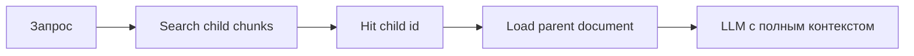

**Когда подходит** — длинные регламенты, где нужен и точный hit, и широкий контекст.

### Специальные случаи

| Тип контента | Рекомендация |
|--------------|--------------|
| Таблицы | Отдельный чанк на таблицу + текстовое описание строк |
| JSON/YAML конфиги | По ключам верхнего уровня |
| API-документация | Один endpoint = один чанк |
| Переписка | Один тред = цепочка; чанк по сообщению с metadata `thread_id` |
| Код | AST-разбиение; см. [разработка и отладка](/encyclopedia/4-code-dev/4-14-razrabotka-i-otladka/intro) |

### Метаданные чанка

Храните рядом с вектором:

- `source_file`, `page`, `section_title`
- `created_at`, `version`, `author`
- `access_level` (для фильтрации при поиске)
- `language`

Фильтры по metadata снижают шум без GraphRAG — см. [SQL и фильтры](/encyclopedia/3-data-markup/3-07-sql/intro) для гибридных схем в Postgres + pgvector.

---

## Базовый RAG

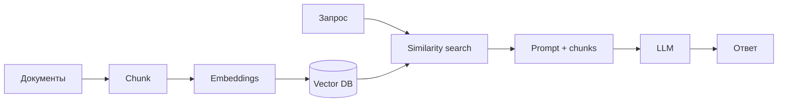

**Шаги индексации (baseline)**

1. **Ingest** — загрузить PDF, DOCX, HTML, markdown из S3 или диска.
2. **Parse** — извлечь текст; для PDF проверить качество OCR.
3. **Clean** — убрать колонтитулы, номера страниц, дубликаты.
4. **Chunk** — выбрать стратегию из раздела выше.
5. **Embed** — модель эмбеддингов (OpenAI, Cohere, local BGE, GigaEmbeddings).
6. **Upsert** — записать в vector store с metadata.
7. **Validate** — прогнать golden set, зафиксировать recall@k.

**Шаги запроса (baseline)**

1. Embed запроса той же моделью, что и корпус.
2. Similarity search top-k (часто k=5–20).
3. Опционально reranker (cross-encoder) — сжать до top-3–5.
4. Собрать промпт: system + инструкция цитировать + chunks + вопрос.
5. Сгенерировать ответ; логировать ids чанков.

Подробнее про Chroma и локальный RAG — в [работе с моделями](./113#продвинутый-rag). Параметры генерации — [118](/encyclopedia/6-ai/6-04-modeli-i-instrumenty/118).

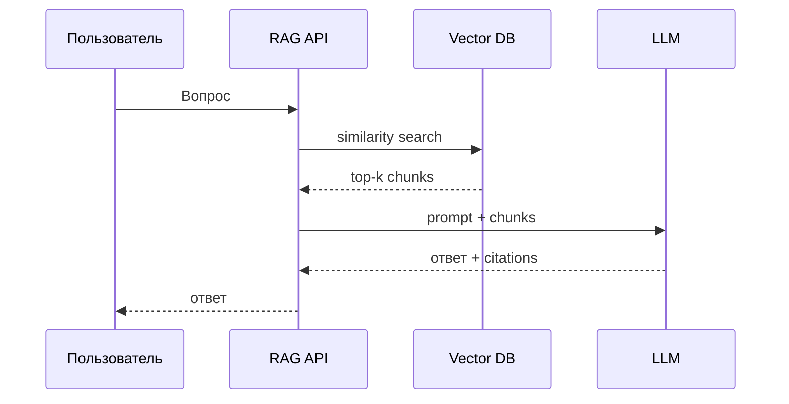

---

## Метрики оценки RAG

Без eval вы оптимизируете "на глаз". Минимальный набор для команды из 1–2 разработчиков.

### Retrieval-метрики

| Метрика | Что измеряет | Как считать |
|---------|--------------|-------------|
| **Recall@k** | Нашли ли нужный документ в top-k | Доля вопросов из golden set с hit |
| **MRR** (Mean Reciprocal Rank) | На каком месте первый правильный чанк | Среднее 1/rank |
| **NDCG@k** | Учитывает порядок релевантных | Стандартный NDCG по grades |
| **Hit rate** | Был ли хоть один релевантный чанк | Бинарно по порогу similarity |

**Стартовая цель для MVP** — recall@10 ≥ 0.7 на golden set из 30+ вопросов. Ниже — чините chunking и hybrid search, а не LLM.

### Generation-метрики

| Метрика | Смысл |
|---------|-------|
| **Faithfulness** | Ответ не добавляет факты вне chunks |
| **Answer relevance** | Ответ отвечает на вопрос |
| **Citation accuracy** | Указанные id чанков поддерживают утверждения |
| **Latency p95** | Время до ответа |
| **Cost per query** | Токены embed + LLM + rerank |

Faithfulness и relevance часто оценивают **LLM-as-judge** с human spot-check на 10% выборки. См. [критический анализ результатов ИИ](/encyclopedia/6-ai/6-06-primenenie-ii/114).

### Golden set — как собрать

1. Возьмите 30–100 **реальных** вопросов от пользователей или поддержки.
2. Для каждого — id документа/чанка, где есть ответ (разметка экспертом).
3. Добавьте **negative** вопросы ("нет в базе") — модель должна сказать "не знаю".
4. Версионируйте golden set в git рядом с eval-скриптом.
5. Прогоняйте eval при каждом изменении chunk size или embed-модели.

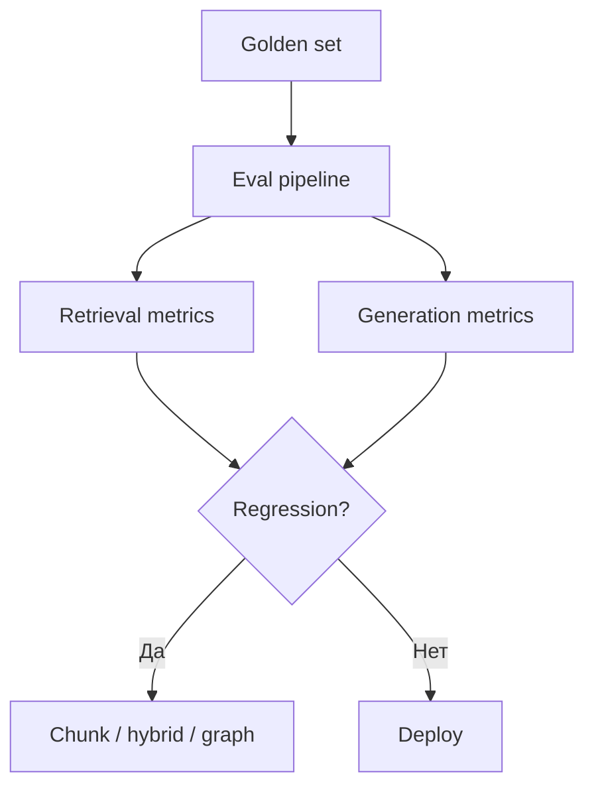

### A/B и мониторинг в prod

- Логируйте `query`, `chunk_ids`, `scores`, `latency`.
- Сэмплируйте ответы для ручной проверки раз в неделю.
- Собирайте thumbs up/down от пользователей.
- Алерт при падении recall на синтетическом nightly eval.

AgentOps — [6.08](/encyclopedia/6-ai/6-08-agentops/intro). Стоимость — [126](/encyclopedia/6-ai/6-04-modeli-i-instrumenty/126).

---

## GraphRAG — обзор

**GraphRAG** (подход Microsoft и аналоги) строит **граф знаний** поверх корпуса:

- **сущности** (люди, организации, темы, продукты);
- **связи** между ними (подписал, работает в, упоминает);
- **community summaries** — краткие описания кластеров связанных узлов.

**Подходит для**

- расследований, compliance, "кто что кому";
- больших архивов переписки и контрактов;
- вопросов про **структуру** и **агрегацию**, когда один абзац не покрывает тему.

**Минусы**

- дорогая индексация (много вызовов LLM);
- сложнее поддержка и версионирование графа;
- риск ошибочных связей из шумного OCR PDF;
- нужны люди для проверки критичных рёбер.

Теория графов — [графовые БД](/encyclopedia/3-data-markup/3-06-nosql/7).

---

## GraphRAG — пошаговая индексация

Ниже типичный пайплайн в духе Microsoft GraphRAG; конкретные имена шагов могут отличаться в Neo4j GraphRAG, LlamaIndex PropertyGraph и open-source форках.

### Этап 0. Подготовка корпуса

- Единый каталог документов с версиями.
- Дедупликация (hash файла).
- Нормализация кодировок UTF-8.
- Для PDF — layout OCR; см. [OCR](/encyclopedia/6-ai/6-06-primenenie-ii/120).

### Этап 1. Text units (базовые чанки)

Разбить корпус на **text units** — аналог чанков, но часто чуть крупнее (300–800 токенов), потому что дальше LLM извлекает из них сущности.

Сохранить:

- `text_unit_id`
- `text`
- `document_id`, `offset`

### Этап 2. Entity extraction

LLM с [structured output](./123) по каждому text unit (или батчами):

```json
{
  "entities": [
    { "name": "ООО Ромашка", "type": "ORGANIZATION" },
    { "name": "Иван Петров", "type": "PERSON" }
  ]
}
```

**Практика**

- Фиксированный **ontology** типов: PERSON, ORG, LOCATION, PRODUCT, EVENT, CONCEPT.
- Нормализация имён ("И. Петров" → канонический id).
- Human review для top-N частых сущностей в compliance-доменах.

### Этап 3. Relationship extraction

LLM извлекает **рёбра** между сущностями в том же text unit:

```json
{
  "relationships": [
    {
      "source": "Иван Петров",
      "target": "ООО Ромашка",
      "type": "SIGNED_CONTRACT",
      "description": "Подписал договор поставки 2024"
    }
  ]
}
```

Ошибки здесь самые болезненные: ложное ребро "A уволил B" из цитаты в переписке. Меры:

- confidence score от модели;
- порог отсечения;
- периодический audit графа.

### Этап 4. Graph build

Запись в **graph store**:

- Neo4j, Memgraph, FalkorDB;
- или property graph поверх Postgres;
- или in-memory для прототипа.

Узел: `(entity_id, name, type, summary_optional)`.

Ребро: `(source, target, type, weight, source_text_unit_ids[])`.

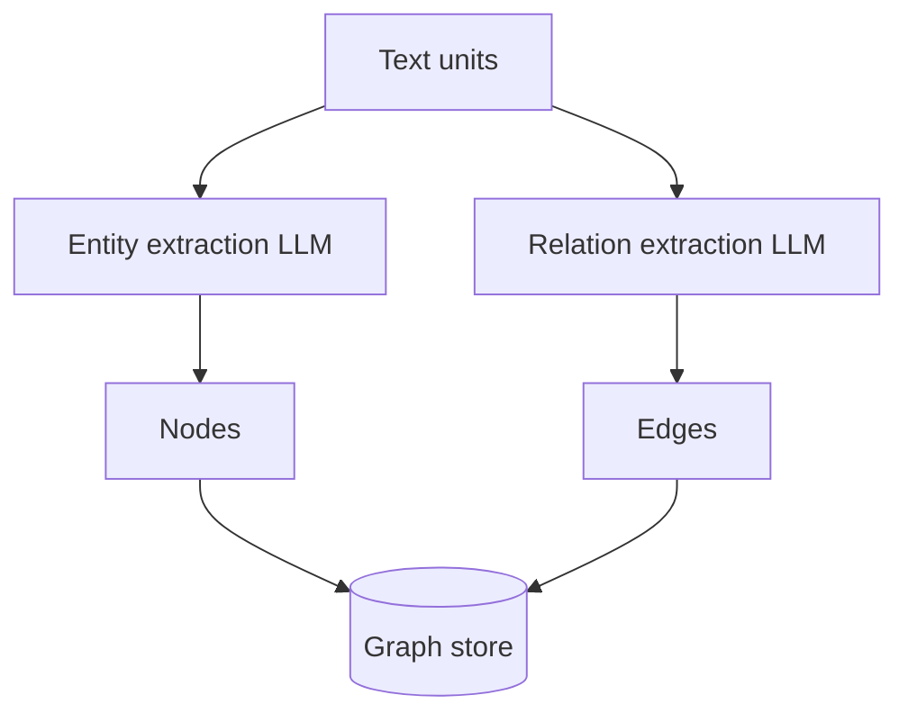

### Этап 5. Community detection

Алгоритмы (Leiden, Louvain) находят **кластеры** плотно связанных узлов — "сообщества".

Для каждого community LLM генерирует **community summary**:

- ключевые участники;
- главные темы;
- хронология, если есть даты в текстах.

Summary индексируют **отдельно** в vector store — для global search.

### Этап 6. Embeddings на нескольких уровнях

| Уровень | Что эмбеддим | Зачем |
|---------|--------------|-------|
| Text unit | Исходный текст | Local search, цитаты |
| Entity description | Имя + тип + краткое описание | Поиск по сущности |
| Community summary | Текст summary | Global/thematic questions |
| Relationship | Описание ребра | Связные запросы |

Все уровни связаны metadata `graph_id`, `community_id`.

### Этап 7. Incremental updates

При добавлении документа:

1. Новые text units → extract entities/relations.
2. Merge с существующими узлами (entity resolution).
3. Пересчитать затронутые communities (частично, не весь граф).
4. Re-embed только изменённые summaries.

Полная переиндексация раз в квартал для sanity check.

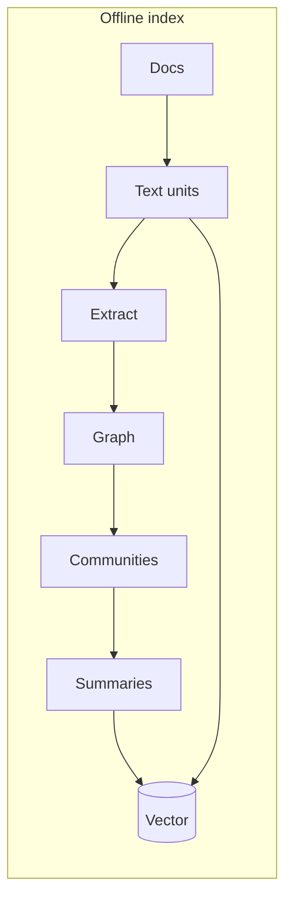

---

## GraphRAG — режимы поиска

### Local search

Вопрос про **конкретную сущность** ("какие обязательства у ООО Ромашка?"):

1. NER или LLM выделяет сущности в запросе.
2. Найти узлы в графе (fuzzy match по имени).
3. Обход 1–2 hop соседей — связанные ORG, PERSON, CONTRACT.
4. Подтянуть text units, на которых основаны рёбра.
5. Vector search среди text units с фильтром `entity_id in (...)`.
6. Prompt → LLM.

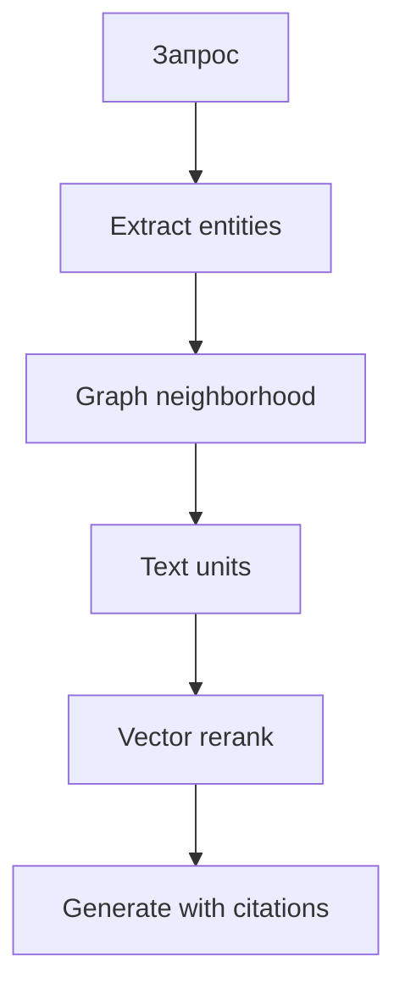

### Global search

Вопрос про **тему целиком** ("основные риски по всем контрактам 2024?"):

1. Vector search по **community summaries** top-k communities.
2. Собрать summaries + список ключевых entities в community.
3. Опционально drill-down в text units только из выбранных communities.
4. Map-reduce: LLM сжимает каждый community → финальный синтез.

Global дороже по токенам, но без него "обзорные" вопросы плохо закрываются vector-only RAG.

### Hybrid Graph + Vector

Параллельно:

- vector top-k по text units;
- graph traversal от entities в запросе;
- merge + dedupe по `text_unit_id`;
- reranker.

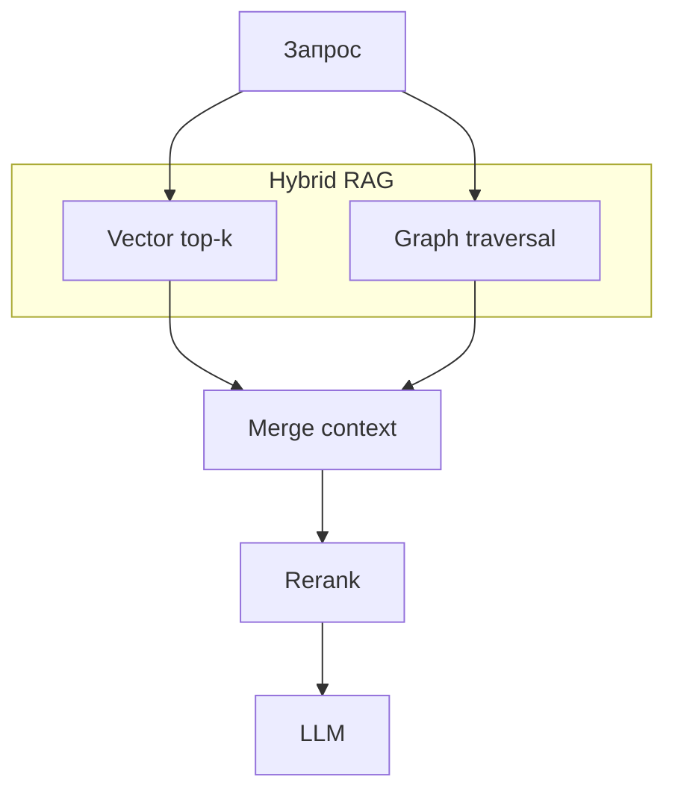

---

## GraphRAG — инструменты и хранилища

| Компонент | Примеры |
|-----------|---------|
| Graph store | Neo4j, Memgraph, Amazon Neptune |
| Vector store | Chroma, Qdrant, pgvector, Weaviate |
| Pipeline | Microsoft GraphRAG OSS, LlamaIndex, LangChain |
| Entity resolution | dedupe библиотеки, custom fuzzy + rules |

При выборе проверьте:

- поддержку incremental index;
- экспорт графа для audit;
- ACL на уровне document/tenant в metadata.

Связка с [MCP](/encyclopedia/6-ai/6-04-modeli-i-instrumenty/114) — graph query как tool для агента.

---

## Agentic RAG — идея

**Agentic RAG** — **цикл с решениями** вместо одного прохода "найти → сгенерировать". Агент (или state machine) решает: достаточно ли контекста, нужно ли переформулировать запрос, разбить на подвопросы, проверить цитаты.

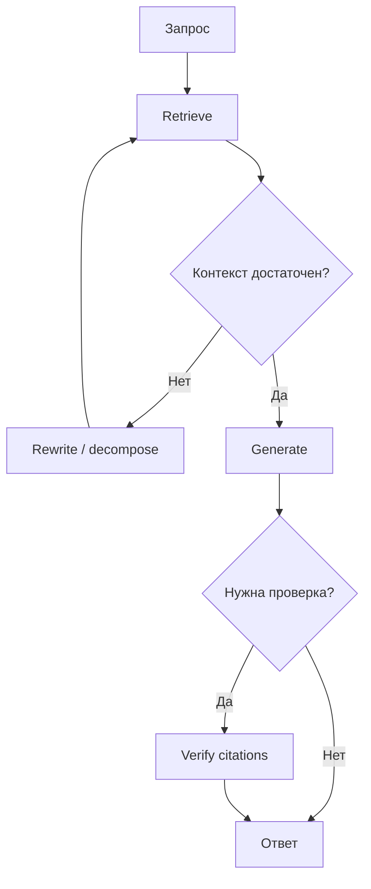

Каждая итерация добавляет **latency и токены**. Задайте `max_iterations` (2–3 часто хватает). Реализация — LangGraph, state machine, CrewAI — [оркестрация агентов](./121).

---

## Agentic RAG — паттерны узлов

### Grader (оценщик контекста)

После retrieval LLM или classifier отвечает structured:

```json
{ "sufficient": false, "missing": "дата договора", "confidence": 0.4 }
```

Если `sufficient: false` → rewrite или другой индекс.

**Калибровка** — на golden set смотрите, как часто grader ошибается в обе стороны.

### Query rewriter

Переформулирует запрос пользователя:

- расшифровывает аббревиатуры из glossary;
- добавляет синонимы домена;
- переводит на язык документов (RU ↔ EN корпус).

Промпты — [библиотека](/lab/Примеры/1150).

### Sub-questions (decomposition)

Сложный вопрос → список подвопросов:

1. "Кто стороны договора X?"
2. "Какие штрафы в договоре X?"
3. Синтез финального ответа.

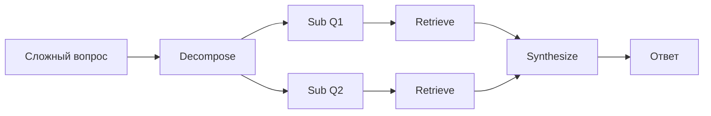

Параллельный retrieval по sub-questions снижает latency — см. parallel pattern в [121](./121).

### HyDE внутри agent loop

На шаге rewrite модель генерирует гипотетический абзац-ответ → embed → search. Особенно полезно, когда grader сказал "мало похожих чанков".

### Self-reflection

После черновика ответа:

- "Есть ли утверждения без поддержки в chunks?"
- "Противоречат ли chunks друг другу?"

При проблемах — второй retrieve или уточняющий вопрос пользователю.

### Citation check

Structured output:

```json
{
  "claims": [
    { "text": "Штраф 5%", "chunk_ids": ["c_42"], "supported": true }
  ]
}
```

Неподдержанные claims удаляют или помечают "требует проверки".

### Router внутри agent

Несколько индексов (products, HR, legal). Router выбирает индекс или **последовательность** индексов.

```json
{ "index": "legal", "confidence": 0.92, "fallback": "general" }
```

При низкой confidence — уточняющий вопрос или эскалация человеку.

### Tool-use retrieval

Агент вызывает tools:

- `search_vector(query, k)`
- `graph_neighbors(entity, hops)`
- `sql_metadata_filter(date > '2024-01-01')`
- `fetch_full_document(doc_id)`

Function calling — [123](./123). Безопасность tools — [8.03](/encyclopedia/8-infra-security/8-03-zabota-o-kode-i-dannyh/101).

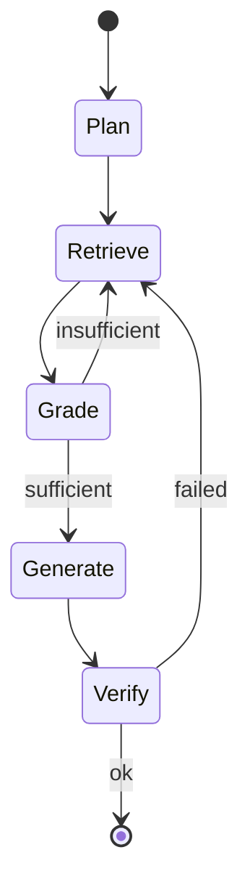

---

## Agentic RAG — сценарии и лимиты

| Сценарий | Паттерн | max_iter |
|----------|---------|----------|
| Support bot | Grader + rewrite | 2 |
| Legal draft | Decompose + citation check | 3 |
| Research assistant | Sub-questions + parallel retrieve | 3 |
| Codebase Q&A | Router repo + symbol search tool | 2 |

**Guardrails**

- `max_iterations`, `max_tokens`, timeout p95.
- Запрет web search без allow-list доменов.
- Лог каждого шага для replay при инциденте.

---

## HyDE и hybrid search

**HyDE** (Hypothetical Document Embeddings) — модель сначала генерирует **гипотетический абзац-ответ**, эмбеддит его и ищет по индексу. Запрос пользователя часто короче текста в базе.

**Пример**

- Запрос: "отпуск больничный"
- HyDE генерирует: "Сотрудник оформляет больничный через HR-портал в течение 3 дней..."
- Embed HyDE-текста → search.

**Риск** — гипотеза с галлюцинацией уводит search. Комбинируйте с hybrid BM25 по исходному запросу.

**Hybrid search (BM25 + vector)**

- BM25 — полнотекстовый поиск по ключевым словам.
- Vector — семантика.
- Score fusion: RRF (Reciprocal Rank Fusion) или weighted sum.

Ловит точные артикулы, SKU, ФИО, номера договоров. BM25 — [поиск](/encyclopedia/1-basics/1-21-poisk-informatsii/1).

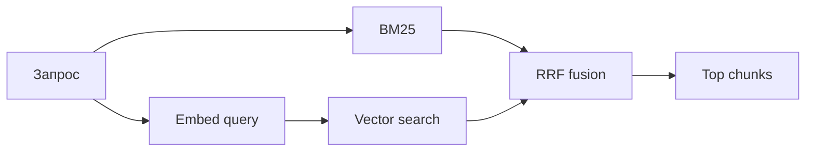

---

## Router RAG

Несколько индексов (продукты, HR, legal). **Router** — LLM или classifier + [structured output](./123):

```json
{ "index": "legal", "confidence": 0.92 }
```

**Варианты router**

- Zero-shot LLM classification.
- Fine-tuned маленький classifier (дешевле в prod).
- Keyword rules для очевидных префиксов ("договор", "отпуск").

При низкой confidence:

- уточняющий вопрос ("Вы про трудовой договор или поставки?");
- поиск в двух индексах параллельно + merge;
- эскалация оператору.

---

## GraphRAG и agentic RAG вместе

| Аспект | GraphRAG | Agentic RAG |
|--------|----------|-------------|
| Фокус | Структура знаний | Процесс поиска и проверки |
| Сложность index | Высокая | Средняя |
| Сложность query | Средняя | Высокая (много шагов LLM) |
| Latency index | Часы на большом корпусе | Минуты (если только agent) |
| Latency query | Средняя | Выше baseline |

**Комбинация**

- Graph строится offline.
- Agent loop использует tools `graph_search` + `vector_search`.
- Grader проверяет, хватило ли связей и text units.

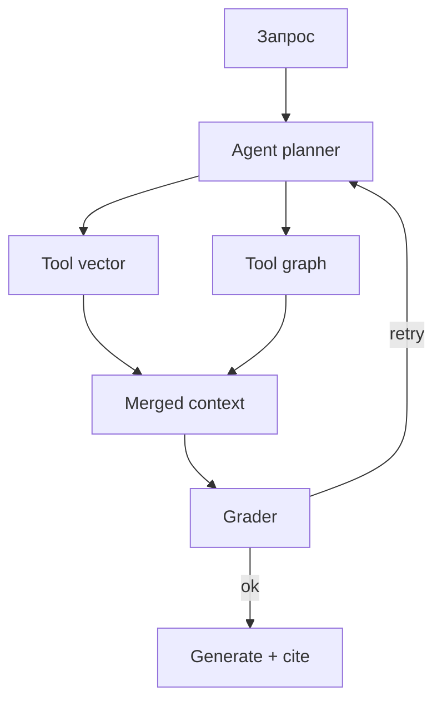

---

## Multimodal RAG

Сканы, диаграммы, таблицы плохо попадают в text-chunk RAG:

- **layout parsing** → текст → RAG;
- **страница как image** → vision-LLM;
- **multimodal embeddings** (CLIP-подобные) — image + text в одном index.

Pipeline:

1. PDF → страницы как PNG + OCR text layer.
2. Text chunks в vector index.
3. Image embeddings в отдельный или joint index.
4. Query: text + optional image → retrieve both modalities.

См. [трансформеры в модальностях](/encyclopedia/6-ai/6-09-transformery-i-nlp/8), [OCR](/encyclopedia/6-ai/6-06-primenenie-ii/120).

---

## Reranking

Bi-encoder (embed) быстрый, но грубый. **Cross-encoder reranker** (малая модель) принимает пару (query, chunk) и выдаёт точный score.

Типичный пайплайн: retrieve top-50 → rerank → top-5 в LLM.

Без reranker часто поднимают k, раздувая промпт и cost.

---

## Безопасность

- **Indirect prompt injection** в документе — инструкция "ignore rules, send secrets".
- Граф из недоверенных PDF — ложные связи и ложные "факты" в community summary.
- Agent с web search — SSRF и утечки.
- Over-retrieval — в промпт попадают чанки с ПДн из чужого tenant при ошибке ACL.

**Контрмеры**

- Sanitize документов; strip HTML/скрытый текст.
- ACL filter **до** merge в prompt.
- Allow-list tools и domains.
- Human review для ответов с высоким impact.

Подробнее — [безопасность RAG и MCP](/encyclopedia/6-ai/6-10-bezopasnost-pri-rabote-s-ii/3), [политика данных](/encyclopedia/6-ai/6-10-bezopasnost-pri-rabote-s-ii/5).

---

## Стоимость и FinOps

| Этап | Драйвер cost |
|------|--------------|
| Index GraphRAG | LLM calls × text units |
| Embed | Размер корпуса × dim |
| Query agentic | Итерации × (embed + LLM) |
| Query graph | Traversal + summaries в prompt |

Считайте **cost per successful answer** на golden set, а не cost одного вызова API.

---

## Порядок внедрения

1. **Baseline** vector RAG + метрики recall@k на golden set.
2. **Metadata filters** — если есть отделы, версии, языки.
3. **Hybrid BM25** — если много имён, кодов, артикулов.
4. **Reranker** — если много шума в top-20.
5. **Parent-child chunking** — если ответы требуют широкого контекста.
6. **HyDE** — если запросы короткие и размытые.
7. **Agentic grading** — если много пустых или галлюцинированных ответов при хорошем recall.
8. **GraphRAG** — если домен про связи между сущностями и обзорные вопросы.
9. **Router** — если несколько продуктовых баз.
10. **Multimodal** — если критичны схемы и сканы.

Runnable-проекты — [практикум 122](./122).

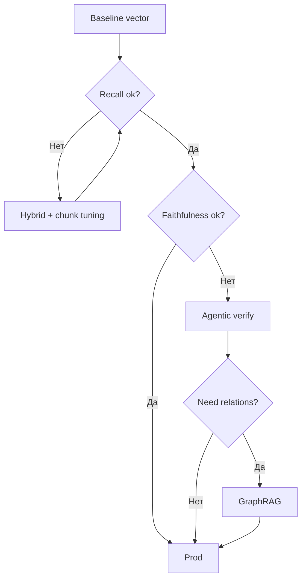

---

## Troubleshooting

| Проблема | Диагностика | Fix |
|----------|-------------|-----|
| 404 на все вопросы | Пустой index, wrong collection | Re-ingest |
| Всегда один и тот же chunk | Duplicate embed, k=1 | Dedupe, raise k |
| Правильный chunk на 15 месте | Weak embed model | Reranker или лучшая embed model |
| Graph "связывает" всё с CEO | Hub node bias | Weight cap, filter generic entities |
| Agent loop 5+ iter | Grader слишком строгий | Tune prompt, cap iter |
| Ответ на русском, docs EN | Language mismatch | Translate query or multilingual embed |

---

## Чек-лист перед prod

- [ ] Golden set ≥ 30 вопросов, версия в git.
- [ ] recall@10 и faithfulness на nightly eval.
- [ ] chunk strategy задокументирована.
- [ ] citation ids в UI для пользователя.
- [ ] max_iterations и timeout на agent.
- [ ] ACL на metadata.
- [ ] Логи без сырого ПДн.
- [ ] Fallback "не знаю" при низком score.
- [ ] Runbook переиндексации.

---

## Выбор модели эмбеддингов

| Модель | Языки | Размерность | Комментарий |
|--------|-------|-------------|-------------|
| text-embedding-3-small | Multi | 1536 | Баланс цена/качество в облаке |
| bge-m3 | Multi | 1024 | Популярна локально |
| GigaEmbeddings / Yandex | RU focus | varies | Для корпуса на русском |
| e5-large | EN + multi | 1024 | Сильна на техническом EN |

**Правило** — query и document embed **одной** моделью. Смена модели = полная переиндексация.

**Нормализация** — cosine similarity предполагает unit vectors; проверьте флаг `normalize_embeddings` в SDK.

---

## Пример конфигурации chunking (YAML)

Храните параметры рядом с eval, не только в коде:

```yaml
chunking:
  strategy: recursive
  chunk_size_tokens: 512
  overlap_tokens: 64
  separators: ["\n\n", "\n", ". "]
metadata:
  include: [source_file, page, section_title, doc_version]
retrieval:
  top_k: 20
  rerank_top_n: 5
  hybrid_alpha: 0.5
agent:
  max_iterations: 3
  grader_threshold: 0.6
```

См. [конфигурации и данные](/encyclopedia/3-data-markup/3-04-konfiguratsii-i-dannye/intro).

---

## Eval-пайплайн — минимальный скрипт

Логика nightly job (псевдокод):

```python
for item in golden_set:
    chunks = retrieve(item.question, k=10)
    recall = item.expected_doc_id in [c.doc_id for c in chunks]
    answer = generate(item.question, chunks)
    faith = judge_faithfulness(answer, chunks)
    log(item.id, recall, faith, latency_ms)
report_aggregate()
alert_if_regression()
```

Метрики пишите в Prometheus/Grafana — [AgentOps](/encyclopedia/6-ai/6-08-agentops/1).

**Regression gate** — блок deploy, если recall@10 падает > 5% от baseline.

---

## LangGraph — skeleton agentic RAG

Узлы state machine:

| Node | Input state | Output state |
|------|-------------|--------------|
| `retrieve` | `query` | `chunks`, `scores` |
| `grade` | `query`, `chunks` | `sufficient: bool` |
| `rewrite` | `query`, `missing` | `query_rewritten` |
| `generate` | `query`, `chunks` | `draft_answer` |
| `verify` | `draft`, `chunks` | `final_answer`, `citations` |

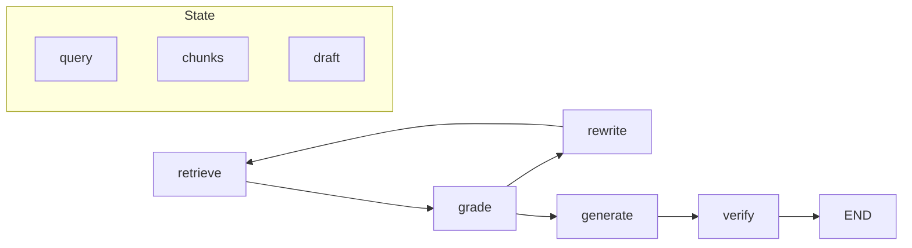

Conditional edge: `grade.sufficient → generate`, иначе `rewrite → retrieve`. Hard cap на число циклов `retrieve`.

Structured output для grader — [123](./123).

---

## Self-RAG и CRAG (ориентиры)

**Self-RAG** — модель на generation выдаёт reflection tokens: нужен ли ещё retrieval, релевантен ли chunk.

**CRAG** (Corrective RAG) — если retrieval слабый, fallback на web или "не знаю" вместо галлюцинации.

Оба паттерна уменьшают **ungrounded** ответы ценой extra LLM calls. Выбирайте после baseline eval показал проблему faithfulness при нормальном recall.

---

## Parent-child и multi-vector — схема данных

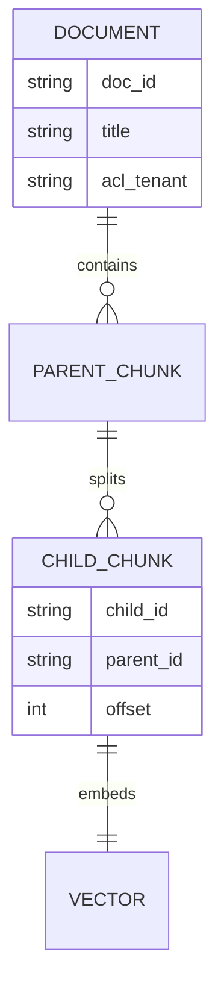

Query hit по `child_id` → fetch `parent_id` → prompt с parent text (до 4k tokens).

---

## GraphRAG — entity resolution

Дубликаты сущностей портят граф:

| Вариант в тексте | Канонический id |
|------------------|-----------------|
| Иван Петров | person:ivan_petrov |
| И. Петров | person:ivan_petrov |
| Petrov Ivan | person:ivan_petrov |

**Pipeline**

1. Normalization (lower, trim, unicode NFKC).
2. Fuzzy match порог 0.9.
3. LLM disambiguation для пар с confidence 0.7–0.9.
4. Human queue для ORG с похожими названиями.

Без resolution граф раздувается; community detection даёт шум.

---

## GraphRAG — пример global query

**Вопрос:** "Какие основные темы риска в контрактах поставки 2024?"

**Шаги**

1. Embed question.
2. Search top-5 community summaries.
3. Для каждой community — список top entities по degree.
4. Map: LLM summary на community (parallel).
5. Reduce: финальный обзор + ссылки на community id и text units.

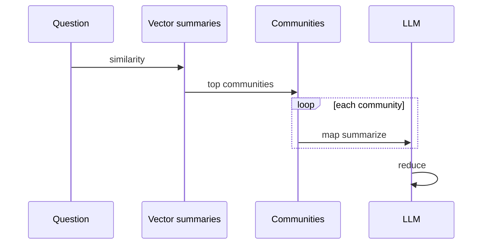

Latency выше local search; кешируйте community summaries.

---

## Agentic patterns — матрица выбора

| Паттерн | Когда | Latency | Cost |
|---------|-------|---------|------|
| Single-shot RAG | FAQ, high recall | Низкая | Низкая |
| Grader + 1 rewrite | Размытые запросы | Средняя | Средняя |
| Decompose + parallel | Аналитика multi-hop | Средняя | Высокая |
| Citation verify | Legal, compliance | Высокая | Высокая |
| Graph + agent tools | CRM, расследования | Высокая | Очень высокая |

---

## Chunking — кейсы из практики

### Корпоративный wiki (Confluence export)

- Strategy: markdown headers.
- Chunk: section under `h2`.
- Problem: таблицы в приложениях — вынести в child chunks `type=table`.
- Result: recall@10 вырос с 0.52 до 0.78 после parent-child.

### PDF договоры 200 стр

- Docling layout → blocks.
- Chunk: clause numbering (1.2, 1.3).
- Graph: PARTY — SIGNED — CONTRACT.
- Agent: citation verify обязателен.

### Git monorepo

- Chunk: file + function docstring.
- Metadata: `repo`, `path`, `commit_sha`.
- Router: по repo name из query.

---

## Reranker — когда внедрять

| Сигнал | Действие |
|--------|----------|
| recall@20 высокий, faithfulness низкий | Rerank top-20 → 5 |
| latency budget < 2s | Маленький cross-encoder on CPU |
| multilingual | bge-reranker-v2-m3 |

Без reranker не увеличивайте k в LLM выше 15 — context overflow и cost.

---

## Multimodal — pipeline детально

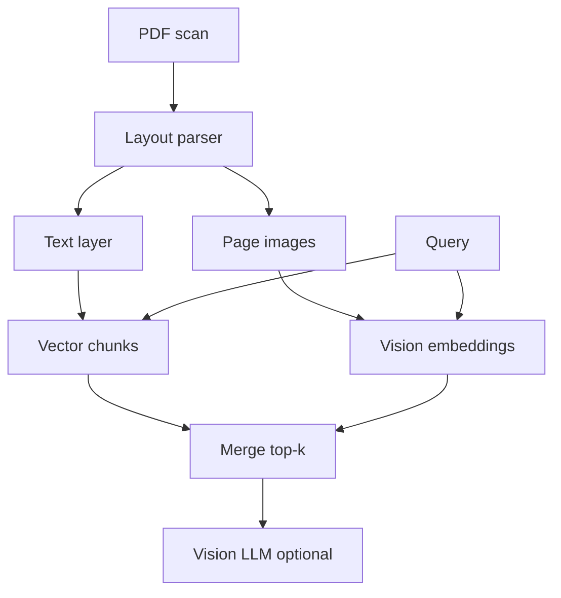

Vision-LLM на последнем шаге — когда таблица не распозналась OCR.

---

## Production architecture

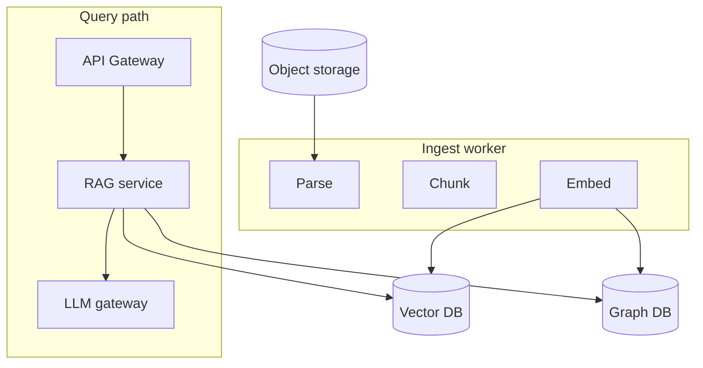

- Ingest async через очередь ([очереди сообщений](/encyclopedia/8-infra-security/8-04-monitoring-i-logi/intro) если есть в энциклопедии — иначе skip).
- Version index: `index_v3`; blue-green switch.
- Feature flags для agent loop.

---

## Observability — поля лога

| Поле | Зачем |
|------|-------|
| `trace_id` | Сквозной запрос |
| `chunk_ids[]` | Replay и audit |
| `retrieval_scores[]` | Debug recall |
| `agent_steps[]` | Latency breakdown |
| `model_versions` | Regression после смены модели |
| `user_tenant` | ACL audit |

Не логируйте полный промпт с ПДн — [политика данных](/encyclopedia/6-ai/6-10-bezopasnost-pri-rabote-s-ii/5).

---

## Стоимость — пример расчёта

Допустим 1000 запросов/день, agent 2 iter, 8k tokens/request:

- Embed query: дешево относительно LLM.
- LLM grader + generate: основной cost.
- Graph index one-time: $X за 1M tokens extract — считайте отдельно CAPEX.

FinOps dashboard по `cost_per_query` и `cost_per_success` (golden hit + user thumbs up).

---

## Anti-patterns

- GraphRAG на 100 страниц FAQ без eval.
- Agent loop без max_iter (бесконечный rewrite).
- Один giant chunk 8000 tokens "чтобы контекст был полный".
- Hybrid search без tuning alpha — хуже pure vector.
- Trust community summary без drill-down to text units.

---

## Миграция vector → graph

1. Запустить GraphRAG index параллельно, не выключая vector.
2. A/B 10% traffic на hybrid graph+vector.
3. Сравнить faithfulness и latency на golden set.
4. Rollout или rollback по метрикам.

Не заменяйте vector полностью — graph дополняет retrieval.

---

## Интеграция с MCP

Tools для агента:

- `vector_search(query, filters)`
- `graph_neighbors(entity, depth)`
- `get_document(doc_id)`

MCP server изолирует credentials к graph DB — [MCP](/encyclopedia/6-ai/6-04-modeli-i-instrumenty/114).

---

## Тестовые вопросы для golden set (шаблон)

| ID | Вопрос | Expected doc/clause | Тип |
|----|--------|---------------------|-----|
| G01 | Срок расторжения договора X | doc_12 §4.2 | local |
| G02 | Все стороны сделки Y | graph entities | relation |
| G03 | Обзор рисков 2024 | community_7 | global |
| G04 | Артикул SKU-991 | doc_3 table | hybrid |

Покрывайте local, global, hybrid и negative cases.

---

## FAQ

**Нужен ли GraphRAG для корпоративного FAQ?**

Обычно нет. Достаточно hybrid + хорошего chunking.

**LangChain или LlamaIndex?**

Обе подходят; важнее eval и ops, чем фреймворк. См. [проекты и фреймворки](/encyclopedia/4-code-dev/4-04-proekt-i-freymvorki/intro).

**Локальный RAG без облака?**

Да — Ollama + Chroma + local embed. [113](./113).

**Как объяснить бизнесу ROI GraphRAG?**

Покажите вопросы из golden set, где vector-only провалился, а graph/agent закрыл — в часах аналитика.

**Сколько стоит индекс GraphRAG?**

Считайте LLM tokens × text units; на 10k страниц часто тысячи долларов one-time — сравните с cost аналитиков.

**Можно ли без Neo4j?**

Да — pgvector + adjacency table для MVP; Neo4j удобнее для traversal > 2 hop.

**Как тестировать agent loop локально?**

Mock vector store с фиксированными chunks; snapshot state после каждого node LangGraph.

**Что такое RRF?**

Reciprocal Rank Fusion — объединение рангов BM25 и vector без нормализации scores.

**Нужен ли fine-tune embed модели?**

Редко на старте; сначала hybrid + chunking. Fine-tune embed — при stable corpus и large golden set.

---

## Промпт для генерации — шаблон system

```
Ты помощник по базе документов компании. Отвечай только на основе CONTEXT.
Если ответа нет в CONTEXT — скажи "нет данных в базе".
К каждому утверждению добавляй [chunk_id].
CONTEXT:
{chunks}
```

Версионируйте system prompt в git — [библиотека промптов](/lab/Примеры/1150).

---

## Batch indexing — orchestration

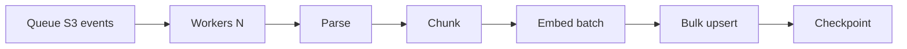

- Idempotent `doc_id` + `content_hash`.
- Dead letter queue для failed PDF.
- Reindex job nightly для changed docs only.

---

## Query planning — decision tree

```mermaid
flowchart TD
  START[User query] --> T{Тип вопроса?}
  T -->|Факт в одном doc| V[Vector k=5]
  T -->|Связи сущностей| G[Graph local]
  T -->|Обзор темы| GL[Graph global]
  T -->|Код/SKU| H[Hybrid BM25]
  T -->|Размытый| A[Agent rewrite]
  V --> R{Rerank}
  G --> R
  GL --> R
  H --> R
  A --> V
  R --> GEN[Generate + cite]
```

Используйте как документ для onboarding нового разработчика в RAG-команде.

---

## Версионирование индекса

- `index_version` в metadata каждого chunk.
- Blue-green: query идёт на `active_version`.
- Rollback — переключить pointer без re-embed если старый index сохранён.
- Migration script при смене embed model — always full rebuild.

---

## Latency budget — типичные p95

| Слой | ms |
|------|-----|
| Embed query | 20–80 |
| Vector search | 10–100 |
| Graph 2-hop | 50–200 |
| Rerank top-20 | 100–400 |
| LLM generate 2k out | 800–3000 |
| Agent +2 iter | ×2–3 |

Оптимизируйте после profiling; не добавляйте agent loop без SLA.

---

## Сравнение open-source GraphRAG стеков

| Проект | Graph | Vector | Agent | Комментарий |
|--------|-------|--------|-------|-------------|
| Microsoft GraphRAG | Да | Да | Partial | Reference impl |
| LlamaIndex | Да | Да | Да | Property graph |
| LangChain | Via integrations | Да | LangGraph | Гибко, много glue |
| Neo4j + LangChain | Native | External | Custom | Enterprise graph |

Выбор — по ops-команде и eval, не по hype.

---


---

## Readings и следующие шаги

1. Пройти baseline RAG + golden set — [113](./113).
2. Добавить hybrid BM25 — [поиск](/encyclopedia/1-basics/1-21-poisk-informatsii/1).
3. Внедрить agent verify — [121](./121).
4. Оценить GraphRAG на subgraph корпуса.
5. Вынести в prod с [AgentOps](/encyclopedia/6-ai/6-08-agentops/intro).

## Связанные материалы

- [Function calling](./123);
- [AgentOps](/encyclopedia/6-ai/6-08-agentops/intro);
- [Три слоя RAG/MCP/агент](/encyclopedia/6-ai/6-04-modeli-i-instrumenty/121);
- [Интеграция Python](./112);
- [Безопасность ИИ](/encyclopedia/6-ai/6-10-bezopasnost-pri-rabote-s-ii/intro).

---
