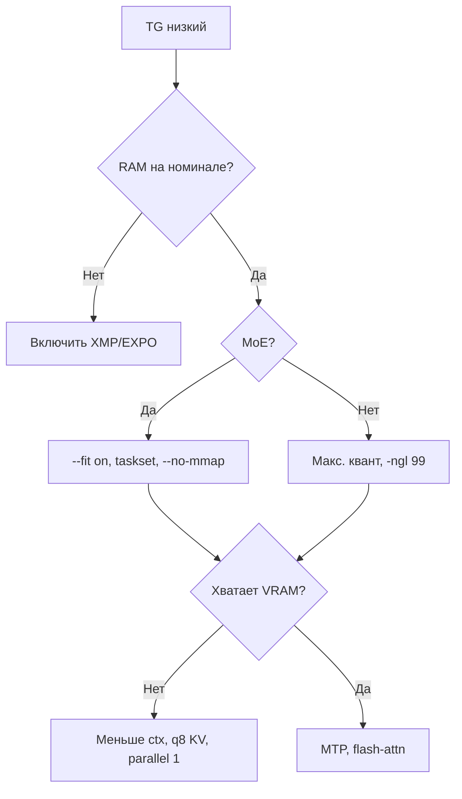

# Оптимизация локального инференса LLM

<div class="article-tags">
  <span class="tag tag-required">ОБЯЗАТЕЛЬНО</span>
  <span class="tag tag-beginner">ДЛЯ НОВИЧКОВ</span>
</div>

<span class="complexity-badge">Продвинутый</span>

---

Локальная модель уже отвечает, но текст появляется медленно, сессия падает с нехваткой памяти или MoE-модель то летит, то ползёт. Эта статья про то, **что именно крутить** после первого запуска через [Работу с ИИ-моделями](./113).

Практические замеры и флаги `llama.cpp` собраны по [мегагайду Kartikey Chauhan](https://carteakey.dev/blog/local-inference/local-llm-optimization/) (RTX 4070 12 GB, i5-12600K, 32 GB DDR5). Цифры в таблицах — ориентир; на вашем ПК будут свои.

**С чего начать, если вы ещё не ставили модель**

- [Работа с ИИ-моделями](./113) — LM Studio, Ollama, первый чат, RAG
- [Как выбрать модель](/encyclopedia/6-ai/6-04-modeli-i-instrumenty/125) — размер, квант, облако или дом
- [Параметры генерации](/encyclopedia/6-ai/6-04-modeli-i-instrumenty/118) — `temperature`, `top_p`, длина ответа

---

## Словарь перед настройкой

| Термин | Простыми словами |
|--------|------------------|
| **Инференс** | Работа уже обученной модели на вашем запросе ([теория](/encyclopedia/6-ai/6-04-modeli-i-instrumenty/1#вывод-llm)) |
| **VRAM** | Видеопамять GPU. Сюда же попадает [KV-кэш](#контекст-и-kv-кэш) |
| **GGUF** | Файл весов для `llama.cpp` / Ollama ([форматы в 113](./113#форматы-файлов)) |
| **Квантизация** | Сжатие весов (Q4, Q5, Q8). Меньше гигабайт — чуть ниже качество |
| **Контекст** | Сколько токенов модель держит в "памяти" за один диалог ([статья про контекст](/encyclopedia/6-ai/6-01-vvedenie-v-ii/113)) |
| **KV-кэш** | Буфер промежуточных данных внимания; растёт с длиной контекста |
| **MoE** | Mixture of Experts — большая модель, но на каждый токен считается только часть "экспертов" ([Mixture of Experts](/encyclopedia/6-ai/6-04-modeli-i-instrumenty/1#mixture-of-experts)) |
| **Offload** | Часть слоёв на GPU, часть в оперативной памяти |
| **TG** | Token generation — скорость выдачи ответа (токенов в секунду). Именно её чувствует пользователь |
| **TTFT** | Time to first token — пауза до первого слова ответа |
| **PP** | Prompt processing — как быстро модель "прочитала" ваш промпт |
| **OOM** | Out of memory — закончилась VRAM или RAM |
| **XMP / EXPO** | Профиль в BIOS, чтобы оперативная память работала на заявленной частоте (DDR5-6000 и т.д.) |
| **MTP** | Multi-Token Prediction — ускорение за счёт черновика нескольких токенов сразу |

---

## Что измерять

Сначала поймите, **какая фаза** тормозит. Иначе можно неделю крутить batch, а узкое место — частота RAM.

| Метрика | Что показывает | Где обычно упирается |
|---------|----------------|----------------------|
| **TTFT** | Задержка до первого токена | Загрузка файла модели, длинный промпт |
| **PP** | Скорость обработки входа | Размер batch, GPU |
| **TG** | Скорость потока ответа | VRAM, RAM, размещение слоёв |
| **VRAM при старте** | Влезли ли веса и KV-кэш | Длина контекста, `--parallel`, квант |
| **VRAM через час работы** | Рост до OOM | Маленький запас `--fit-target`, CUDA graphs |
| **Acceptance rate** (при MTP) | Сколько черновиков приняла основная модель | Точность KV у draft и target |

Тестируйте на **той же длине контекста**, с которой работаете. Короткий промпт из 50 токенов не покажет, как ведёт себя RAG на 64k.

В сборке `llama.cpp` есть `llama-bench` — синтетические замеры PP и TG.

### Скорость ответа глазами пользователя

| TG, токен/с | Как ощущается |
|-------------|---------------|
| меньше 5 | Тяжело читать в реальном времени |
| 5–10 | Похоже на скорость чтения |
| 10–20 | Нормальный чат |
| 20–40 | Быстро, удобно для кода и агентов |
| 40 и выше | Ответ "льётся" почти сразу |

---

## Какой движок выбрать

| Инструмент | Подходит для |
|------------|--------------|
| [Ollama](./113#ollama) | Быстрый старт, Docker, мало настроек |
| [LM Studio](./113#lm-studio) | Окно с чатом и локальный OpenAI API |
| **llama.cpp** | Все флаги из этой статьи, максимум контроля |
| [vLLM](./111) | Много одновременных пользователей на сервере |
| **mlx** | Mac на Apple Silicon |

Ollama внутри использует `llama.cpp`, но **не открывает** ряд важных параметров (`--fit`, квантизацию KV, batch, переменные CUDA). Когда Ollama/LM Studio упёрлись в потолок — поднимают `llama-server` напрямую.

Дальше в тексте — **llama.cpp на NVIDIA (CUDA)**. Идеи про KV-кэш и квант переносятся на другие рантаймы; имена флагов — только у llama.cpp.

### Бэкенды llama.cpp при сборке

- **CUDA** (`-DGGML_CUDA=ON`) — видеокарты NVIDIA
- **Vulkan** (`-DGGML_VULKAN=ON`) — AMD, Intel, кроссплатформа
- **Metal** — macOS, Apple Silicon
- **CPU** — без GPU-флага; отладка и очень маленькие модели

---

## Чеклист по убыванию эффекта

Типичный порядок на домашнем ПК (сверху — чаще всего даёт заметный прирост):

| # | Действие | Зачем |
|---|----------|-------|
| 1 | Включить **XMP/EXPO** в BIOS | MoE читает экспертов из RAM; медленная RAM режет TG в разы |
| 2 | **MTP** (если модель поддерживает) | Несколько токенов за один проход GPU |
| 3 | Сборка **QAT** (например Gemma 4 Q4 QAT) | Меньше VRAM при качестве ближе к Q8 |
| 4 | Linux или план **"Высокая производительность"** в Windows | Меньше троттлинга CPU и CUDA |
| 5 | Сборка llama.cpp **из исходников** | Свежие ядра для MoE |
| 6 | `--fit on` | Автоматически кладёт слои на GPU под ваш VRAM |
| 7 | `-ctk q8_0 -ctv q8_0` | KV-кэш в два раза меньше — место под слои |
| 8 | `--parallel 1` | Один слот KV вместо нескольких |
| 9 | `taskset` на **P-ядра** Intel | E-ядра тормозят MoE |
| 10 | `--flash-attn on` | Меньше памяти на длинном контексте |
| 11 | `--no-mmap` и `--mlock` | Ровный TG без page fault и swap |

---

## Железо и иерархия памяти

Модель на каждом шаге **перечитывает веса** из памяти. Чем быстрее шина — тем выше TG.

```
VRAM (видеопамять)          ~600–1000 ГБ/с
Unified (Apple Silicon)     ~200–400 ГБ/с
ОЗУ DDR4/DDR5               ~50–200 ГБ/с
NVMe SSD                    ~5–7 ГБ/с
```

**Плотная модель** (Llama, Mistral без MoE)

- все веса участвуют в каждом токене;
- для полной скорости их держат в VRAM;
- spill в RAM сильно бьёт по TG.

**MoE** (Mixtral, Qwen3-MoE, DeepSeek)

- общий размер может быть 70B–120B, но **активных** параметров на токен — единицы миллиардов;
- эксперты часто лежат в оперативной памяти;
- без XMP/EXPO RAM может работать на 4800 МГц вместо 6000 — и TG падает кратно.

Проверка частоты RAM в Linux:

```bash
sudo dmidecode -t memory | grep -E "Speed|Configured"
```

Строка `Configured Memory Speed` должна совпадать с наклейкой на планках (профиль XMP/EXPO в BIOS).

### Сколько VRAM на какую модель

| VRAM | Плотные модели (ориентир) | MoE с offload в RAM |
|------|---------------------------|---------------------|
| 8 GB | 7B–13B в Q4 | 30B–70B, большая часть на CPU |
| 12 GB | 13B–20B Q4; 7B Q8 | 70B–120B+ |
| 24 GB | 34B Q4; 13B Q8 | 120B+ с умеренным offload |
| 48 GB+ | 70B Q8 | Большая доля слоёв на GPU |

Подробнее про выбор размера — [Как выбрать модель](/encyclopedia/6-ai/6-04-modeli-i-instrumenty/125#шаг-4-размер-модели-и-железо).

**Освободить VRAM под модель**

- подключить монитор к **встроенной графике** материнской платы;
- дискретная GPU остаётся только для инференса;
- обычно +500–1000 MB VRAM.

### CPU на гибридных Intel (12-го поколения и новее)

У таких процессоров есть **P-ядра** (быстрые) и **E-ядра** (экономичные). MoE на каждом токене гоняет экспертов через CPU — если процесс попал на E-ядра, TG падает на 20–30%.

Привязка к P-ядрам (пример i5-12600K, ядра 0–11):

```bash
taskset -c 0-11 llama-server ...
```

- `--threads` — примерно число P-ядер минус 1–2 под ОС;
- потоков больше, чем P-ядер, — обычно хуже, а не лучше.

---

## ОС и питание

### Linux

На том же железе часто даёт на 15–20% больше токенов в секунду, чем Windows: проще выставить режим CPU и убрать лишнее с GPU.

Минимальная проверка:

```bash
cat /sys/devices/system/cpu/cpu0/cpufreq/scaling_governor
cat /sys/devices/system/cpu/cpu0/cpufreq/energy_performance_preference
```

Оба значения — `performance`.

В KDE/GNOME часто стоит `power-profiles-daemon`. Симптом: в sysfs всё `performance`, а TG то 20 tok/s, то 14 после перезагрузки. Помогает `tuned` с профилем `throughput-performance` (пакет `tuned-ppd` в Arch/CachyOS).

Режим **без графического рабочего стола** (headless) освобождает 200–400 MB RAM и VRAM композитора:

```bash
sudo systemctl isolate multi-user.target
sudo systemctl isolate graphical.target   # вернуть GUI
```

### Windows

- Параметры питания → **Высокая производительность** или **Максимальная производительность**
- NVIDIA Control Panel → Power management mode → **Prefer maximum performance**
- [WSL2](https://learn.microsoft.com/windows/wsl/) с CUDA близок к нативному Linux; небольшой overhead по VRAM

### macOS и Apple Silicon

Советы про CUDA сюда не переносятся. Сравните `llama.cpp` с бэкендом Metal и фреймворк **mlx**. Unified memory — CPU и GPU делят один пул RAM ([выбор железа](/encyclopedia/6-ai/6-04-modeli-i-instrumenty/125#таблица-gpu-потребительского-класса)).

---

## Сборка llama.cpp

Пакет из репозитория дистрибутива часто отстаёт на месяцы. MoE заметно ускоряли от релиза к релизу — собирайте с [GitHub](https://github.com/ggml-org/llama.cpp):

```bash
git clone https://github.com/ggml-org/llama.cpp
cd llama.cpp && mkdir build && cd build

cmake .. \
  -DCMAKE_BUILD_TYPE=Release \
  -DGGML_CUDA=ON \
  -DLLAMA_CURL=ON \
  -DGGML_NATIVE=ON \
  -DGGML_LTO=ON \
  -DGGML_CUDA_GRAPHS=ON \
  -DGGML_CUDA_FA=ON \
  -DGGML_CUDA_FA_ALL_QUANTS=ON \
  -DCMAKE_CUDA_ARCHITECTURES=89
# 89 — RTX 40xx; 86 — 30xx; 75 — 20xx

cmake --build . --config Release \
  --target llama-server llama-bench llama-fit-params llama-cli --parallel
```

| Бинарник | Для чего |
|----------|----------|
| `llama-server` | HTTP-сервер, [OpenAI-совместимый API](./113#запуск-модели-как-openai-совместимого-api) |
| `llama-bench` | Замеры PP и TG |
| `llama-fit-params` | Подбор `-ngl` и `-ot` без запуска сервера |
| `llama-cli` | Быстрый тест в терминале |

Документация по флагам сервера — [README llama.cpp](https://github.com/ggml-org/llama.cpp/blob/master/tools/server/README.md).

---

## Модель и квантизация

### Плотные модели и MoE

| | Плотная (dense) | MoE |
|--|-----------------|-----|
| Параметров на один токен | Все | Малая доля (например 3B из 80B) |
| Нужна ли вся модель в VRAM | Желательно для max TG | Нет, эксперты в RAM |
| Главные рычаги | Квант, длина контекста | `--fit`, скорость RAM |
| Примеры | Llama 3, Mistral, Gemma | Qwen3, DeepSeek, Mixtral |

На маркетинге "120B" для MoE смотрите на **активные** параметры — от них зависит TG.

### Уровни GGUF

| Квант | Размер относительно FP16 | Качество |
|-------|--------------------------|----------|
| Q2_K | ~25% | Сильная потеря, только если иначе не влезает |
| Q4_K_M | ~35% | Рабочий баланс |
| Q4_K_XL, UD-Q4 | ~35% | Часто лучше Q4_K_M при том же размере |
| Q5_K_M, Q5_K_XL | ~40% | Близко к оригиналу |
| Q8_0 | ~65% | Практически без потерь |

**PTQ** — квантизация уже обученных весов. **QAT** (quantization-aware training) — модель учили с учётом округления; Q4 QAT у [Gemma](https://huggingface.co/google) часто по смыслу ближе к Q8 PTQ и занимает меньше VRAM. На 12 GB это разница между "всё в RAM" и "большинство слоёв на GPU".

Правило: берите **самый тяжёлый** квант, который влезает в VRAM + RAM вместе с выбранным [контекстом](/encyclopedia/6-ai/6-01-vvedenie-v-ii/113).

Подробнее про Q4/Q5 в [113](./113#что-такое-квантование).

---

## Размещение слоёв на GPU и CPU

Для плотной модели, которая целиком в VRAM, достаточно `-ngl 99` (все слои на GPU) и блока про [KV-кэш](#контекст-и-kv-кэш).

Для MoE главный выигрыш — **сколько блоков transformer остаётся на GPU**, а какие тензоры экспертов уходят в RAM.

### Авторазмещение (`--fit on`)

Сервер при старте смотрит свободный VRAM и подбирает `-ngl` и `-ot`:

```bash
llama-server \
  -m model.gguf \
  --fit on \
  --fit-ctx 65536 \
  --fit-target 512 \
  ...
```

- `--fit-ctx` — минимальный контекст, под который резервируют KV-кэш
- `--fit-target` — запас VRAM в мегабайтах; для постоянного сервера ставьте **512** и выше; для картинок (mmproj) на 12 GB стабильнее **2048**

Без запуска сервера:

```bash
llama-fit-params -m model.gguf -fitt 512 -fitc 65536
```

Вывод можно вписать в systemd-скрипт. `--fit on` оставьте для экспериментов с новой моделью.

### Ручные флаги

- `-ngl` / `--n-gpu-layers` — число блоков на GPU
- `-ot` / `--override-tensor` — regex, какие тензоры на CPU:

```bash
--override-tensor ".ffn_(up|down|gate)_(ch|)exps=CPU"
```

У части моделей есть **shared expert** (`_shexp`) — он активен всегда. Паттерн только для `_exps` оставляет shared на GPU, съедает VRAM и даёт OOM. Фрагмент `(ch|)exps` покрывает оба варианта.

`--n-cpu-moe N` — грубо "сколько MoE-слоёв оставить на CPU". На машине с 64 GB RAM и моделью ~60 GB можно уйти в swap и подвесить систему — сначала `llama-fit-params`.

---

## Контекст и KV-кэш

При [авторегрессии](/encyclopedia/6-ai/6-04-modeli-i-instrumenty/1) модель на каждом шаге смотрит на все предыдущие токены. Чтобы не пересчитывать внимание заново, **KV-кэш** хранит уже посчитанные Key и Value. Он живёт в VRAM и **растёт вместе с длиной диалога** (промпт + ответ + [RAG-чанки](./113#rag--генерация-с-внешним-контекстом)).

Ориентир по VRAM только на KV (зависит от модели):

| Контекст | KV в f16 | KV в q8_0 |
|----------|----------|-----------|
| 8k | ~0.5 GB | ~0.25 GB |
| 32k | ~2 GB | ~1 GB |
| 64k | ~4 GB | ~2 GB |
| 128k | ~8 GB | ~4 GB |

На карте 12 GB и контексте 128k с f16 до 8 GB уходит **только** на кэш. Для кода часто хватает 64k; для длинного RAG — 128k, но осознанно ([GraphRAG](./124) тоже ест контекст).

### Квантизация KV (`-ctk`, `-ctv`)

```bash
-ctk q8_0 -ctv q8_0
```

KV занимает примерно вдвое меньше, чем в f16. Освободившиеся 1–2 GB часто позволяют держать ещё один слой на GPU — прямой плюс к TG.

`--parallel N` — число **параллельных диалогов** на одном сервере. У каждого свой KV-кэш. Один пользователь в homelab → `--parallel 1`.

### Flash Attention (`--flash-attn on`)

Механизм внимания без полной матрицы N×N в памяти. На длинном контексте и маленьком VRAM включают почти всегда. Подробнее — [трансформеры и оптимизации](/encyclopedia/6-ai/6-09-transformery-i-nlp/6).

### Стартовые профили (один пользователь)

| Сценарий | fit-target | Контекст | KV | parallel | batch |
|----------|------------|----------|-----|----------|-------|
| Текст, 12 GB | 512 MiB | 64k | q8_0 / q8_0 | 1 | 1024 |
| Текст, 24 GB | 512–768 MiB | 128k | q8_0 / q8_0 | 1–2 | 1024 |
| Картинки, 12 GB | 512+ MiB | 64k | q8_0 / q8_0 | 1 | 256 |
| MTP | 512+ MiB | 64k | см. раздел MTP | 1 | 1024 |

---

## Память процесса

```bash
--no-mmap   # загрузить веса в RAM целиком до старта генерации
--mlock     # запретить ОС сбрасывать страницы в swap
```

- **mmap** — файл модели подключается к памяти "лениво"; при random access к экспертам MoE возможны микропаузы (page fault)
- **mlock** — важен при высоком `vm.swappiness` и модели впритык к объёму RAM

Старт дольше, зато TG ровнее на длинных сессиях.

---

## MTP и speculative decoding

Обычная генерация — **один токен за один полный проход** всех весов. **Speculative decoding** угадывает несколько следующих токенов лёгкой моделью; основная проверяет их за один шаг.

**MTP** (Multi-Token Prediction) — вариант для моделей, у которых есть официальный draft (Gemma 4, часть Qwen). Пример замеров Gemma 4 26B на RTX 4070 12 GB ([пост автора](https://carteakey.dev/blog/gemma-4-26b-qat-mtp/)):

| Конфигурация | TG |
|--------------|-----|
| Без MTP | ~38.5 tok/s |
| QAT + MTP | ~100.6 tok/s |

```bash
llama-server \
  -m base-qat.gguf \
  --spec-draft-model mtp-draft.gguf \
  --spec-type draft-mtp \
  --spec-draft-n-max 2 \
  ...
```

- `--spec-draft-n-max 2` — для тяжёлой MoE на 12 GB; на легче моделях пробуют 4–6
- KV **целевой** модели — `-ctk`, `-ctv`; **черновика** — `-ctkd`, `-ctvd`. На Gemma 4 `q8_0` на target резал acceptance почти до нуля; `f16` на обоих давал acceptance выше 70% и итоговый выигрыш. Для каждой модели — свой замер

---

## Картинки и multimodal

Флаг `--mmproj` указывает на файл **проектора** — он переводит изображение в токены для LLM. Весит 1–3 GB VRAM.

На 12 GB рабочий набор:

- `--fit-target 2048`
- `--batch-size 256`
- `--ubatch-size 512` (одна картинка = сотни токенов; меньший ubatch → ошибка при загрузке)

Текст и vision с одной GPU удобнее развести по **разным портам** или разным инстансам `llama-server`. Мультимодальность в теории — [трансформеры в разных модальностях](/encyclopedia/6-ai/6-09-transformery-i-nlp/8).

---

## Если TG всё ещё низкий

Проверьте по порядку:

1. XMP/EXPO в BIOS
2. CPU governor и EPP → `performance`
3. Частота P-ядер под нагрузкой
4. Свободный VRAM до старта (`nvidia-smi`)
5. Swap (`pswpin` / `pswpout` в `/proc/vmstat`) в длинной сессии
6. Температура CPU/GPU (троттлинг)
7. Процесс не размазан по E-ядрам

| Симптом | Частая причина | Что попробовать |
|---------|----------------|-----------------|
| TG стабильно в 3 раза ниже ожидаемого | RAM не на номинале | XMP в BIOS |
| TG разный после каждой перезагрузки | power-profiles-daemon | tuned, throughput-performance |
| Провалы через 20–40 минут | swap | `--mlock`, меньше модель |
| OOM в середине диалога | малый `--fit-target` | 512 MiB и больше |
| MTP не ускоряет | низкий acceptance | KV f16, меньше `spec-draft-n-max` |



---

## Безопасность локального сервера

`llama-server`, LM Studio и Ollama поднимают **HTTP-сервис**. Для доступа извне:

- VPN (Tailscale, WireGuard);
- reverse proxy с аутентификацией;
- firewall и лимиты запросов.

Проброс порта 8080 на роутер без защиты — плохая идея.

Разбор рисков — [Безопасность при работе с ИИ](/encyclopedia/6-ai/6-10-bezopasnost-pri-rabote-s-ii/intro), [OWASP LLM Top 10](/encyclopedia/6-ai/6-10-bezopasnost-pri-rabote-s-ii/2).

---

## Куда читать дальше

- [Работа с ИИ-моделями](./113) — Ollama, RAG, LangChain
- [Развёртывание на сервере](./111) — vLLM, Docker, прод
- [Большие языковые модели](/encyclopedia/6-ai/6-04-modeli-i-instrumenty/1) — инференс, MoE, KV в теории
- [Сколько стоит свой GPU](/encyclopedia/6-ai/6-04-modeli-i-instrumenty/126) — когда локаль окупается API
- [Микро-ML на edge](/encyclopedia/6-ai/6-06-primenenie-ii/113) — когда полная LLM избыточна
- [Семь слоёв LLM-стека](./119) — где в архитектуре продукт лежит слой инференса

Углубление по флагам и бенчмаркам — [Local LLM Inference Optimization](https://carteakey.dev/blog/local-inference/local-llm-optimization/), серия [Local Inference](https://carteakey.dev/blog/local-inference/) на том же сайте.
