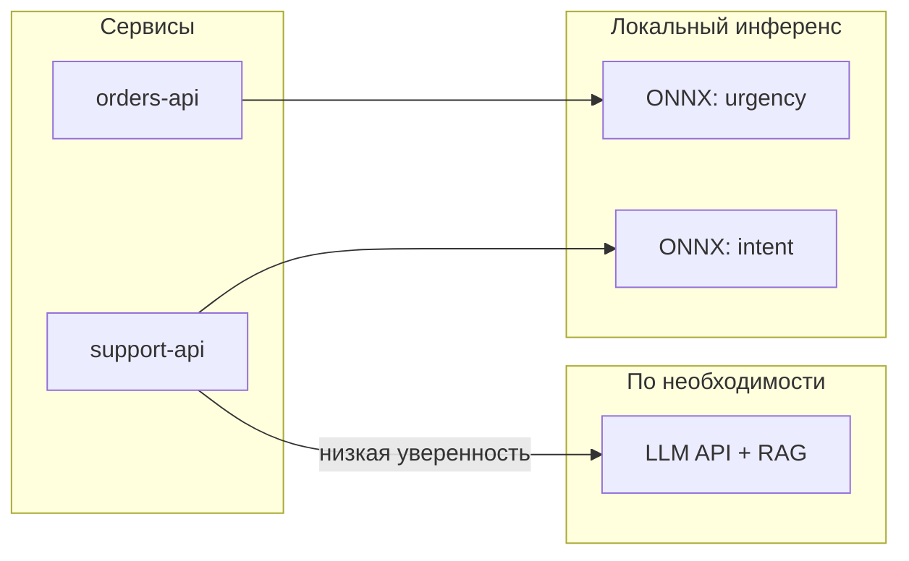

# Микро-ML — когда ИИ нужен в каждом сервисе

<div class="article-tags">
  <span class="tag tag-required">ОБЯЗАТЕЛЬНО</span>
  <span class="tag tag-beginner">ДЛЯ НОВИЧКОВ</span>
</div>

<span class="complexity-badge">Всем</span>

## Зачем "микро", если есть ChatGPT

Крупные языковые модели (LLM) удобны как универсальный интерфейс: один API закрывает чат, суммаризацию, классификацию на естественном языке. Но в распределённой системе из десятков сервисов постоянные вызовы облачного API дают предсказуемые проблемы:

- **Задержка** — сеть + очередь + длинный контекст; для антифрода, ранжирования или автодополнения нужны миллисекунды, а не секунды.
- **Стоимость** — оплата за токены растёт с каждым микросервисом и каждым запросом пользователя.
- **Конфиденциальность** — персональные данные, медицинские записи, внутренние логи нельзя безусловно отправлять наружу.
- **Доступность** — офлайн, закрытые контуры, сбои провайдера.

**Микро-ML** (иногда говорят *edge ML*, *TinyML*, *on-device inference*) — это размещение **маленькой, узкой модели** рядом с данными: в сервисе, на шлюзе, на телефоне, в прошивке. Задача одна (спам / не спам, категория тикета, эмбеддинг для поиска), модель компактная, инференс детерминированный по SLA.

Это не противопоставление LLM, а **распределение ролей**: тяжёлая генерация и сложный диалог — в центре; высокочастотные, структурированные решения — локально.

---

## Центральный LLM API и модель в сервисе

| Критерий | Центральный LLM (API) | Микро-модель в сервисе |
|----------|------------------------|-------------------------|
| Задача | Открытый текст, рассуждение, многоформатный ввод | Фиксированная: классификация, скоринг, NER, эмбеддинг |
| Латентность | Сотни мс — секунды | Единицы — десятки мс |
| Стоимость запроса | Зависит от токенов | Фиксированная CPU/GPU на узле |
| Обновление | Провайдер меняет модель | Вы контролируете версию и откат |
| Объяснимость | Сложнее для регуляторов | Проще: фичи, веса, пороги |

Типичная **гибридная** схема: микросервис `orders` вызывает локальный классификатор "срочность"; только для 5% неуверенных кейсов — запрос к LLM с RAG по базе знаний. Так снижают и счёт, и риск утечки полного текста заказа.

---

## Малые языковые модели (SLM)

**SLM** (Small Language Model) — компактные трансформеры (порядка сотен миллионов — нескольких миллиардов параметров), обученные для узких сценариев: извлечение полей из формы, перефразирование шаблона, классификация намерения в чат-боте.

Их используют, когда:

- контекст короткий (инструкция + один документ);
- нужен **структурированный выход** (JSON по схеме) без "творчества";
- допустимо дообучение (LoRA) на внутренних диалогах поддержки.

Пример вызова через `transformers` (инференс на CPU/GPU сервиса):

```python
from transformers import pipeline

classifier = pipeline(
    "text-classification",
    model="distilbert-base-uncased-finetuned-sst-2-english",
    device=-1,  # CPU
)
result = classifier("Payment failed after card update", truncation=True)
# [{'label' —'NEGATIVE', 'score': 0.97}]
```

На практике для продакшена модель **экспортируют** в ONNX или TensorRT и грузят без полного стека Python — см. ниже.

---

## Экспорт моделей - ONNX, TFLite и Core ML

Обучение часто делают в PyTorch или TensorFlow, а в продакшен отдают **статический граф** с фиксированными размерами батча (или динамическими осями, если рантайм поддерживает).

**ONNX** — обменный формат; рантаймы: ONNX Runtime, OpenVINO, TensorRT. Подходит для серверных микросервисов на Linux и Windows.

```python
import torch
from transformers import AutoModelForSequenceClassification

model = AutoModelForSequenceClassification.from_pretrained("my-ticket-model")
model.eval()
dummy = torch.randint(0, 1000, (1, 128))
torch.onnx.export(
    model,
    (dummy,),
    "ticket_classifier.onnx",
    input_names=["input_ids"],
    output_names=["logits"],
    dynamic_axes={"input_ids": {0: "batch", 1: "seq"}, "logits": {0: "batch"}},
    opset_version=17,
)
```

В **.NET** тот же файл подключают через `Microsoft.ML.OnnxRuntime` — удобно для сервисов на ASP.NET Core без Python в контейнере.

**TensorFlow Lite** — мобильные и встраиваемые устройства (Android, IoT).

**Core ML** — экосистема Apple.

Выбор рантайма определяется не "модой", а **где крутится бинарник**: Kubernetes-под, мобильное приложение, камера на линии.

---

## Квантование и сжатие

Чтобы модель поместилась в память пода и быстрее считалась, применяют:

- **INT8 / FP16 квантование** — меньше весов, быстрее матричные умножения; небольшая потеря качества на классификации часто приемлема.
- **Дистилляция** — большая модель учит маленькую на тех же данных.
- **Прунинг** — обнуление слабых весов.

В ONNX Runtime квантованная модель подключается так же, как полноразмерная; на этапе CI сравнивают метрики на hold-out выборке — **не выкатывают сжатие без A/B на latency и accuracy**.

---

## Архитектура — один LLM на всех и модель на сервис

**Один центральный LLM** оправдан, когда:

- мало сервисов и низкая частота запросов;
- задачи сильно различаются по формулировкам, нужен общий "мозг";
- команда не готова поддерживать MLOps на каждом домене.

**Модель на сервис (или на домен)** — когда:

- разные команды владеют `billing`, `search`, `moderation`;
- нужны независимые релизы и SLO (p99 latency);
- регулятор требует, чтобы PII не покидал контур `payments`.

Паттерн **model registry** (MLflow, Vertex, внутренний артефакт-стор): версия `ticket-urgency:3.2` задеплоена только в `support-api`, а `fraud-scorer:1.0` — в `payments-worker`. Общий LLM остаётся опциональным "эскалатором".



---

## Практический чеклист внедрения

1. **Сформулировать задачу числом** — accuracy, recall@k, MAE; не "сделать умнее".
2. **Собрать размеченную выборку** из прод-логов (с анонимизацией).
3. **Бейзлайн** — логистическая регрессия / маленький BERT; сравнить с правилами.
4. **Экспорт + бенчмарк** latency на целевом железе (тот же CPU limit, что в K8s).
5. **Контракт API** — вход: JSON с полями; выход: метка + score + версия модели.
6. **Наблюдаемость** — дрейф входов, доля fallback на LLM, алерты по падению confidence.

Если без разметки нельзя — микро-ML не заменит LLM с few-shot промптом; но как только накопились тысячи примеров, перенос на локальный классификатор обычно окупается за месяцы.

---

## Связь с остальным разделом ИИ

- [Машинное обучение](/encyclopedia/6-ai/6-02-mashinnoe-obuchenie/1) — типы обучения, метрики, sklearn.
- [Большие языковые модели](/encyclopedia/6-ai/6-04-modeli-i-instrumenty/1) — когда центральный API уместен.
- [Разработка ИИ-решений](/encyclopedia/6-ai/6-05-razrabotka-ii/1) — RAG, промпты, развёртывание.
- [Применение ИИ в бизнес-процессах](/encyclopedia/6-ai/6-06-primenenie-ii/1) — критерии выбора облака vs on-premise.

---

## Краткий итог

Микро-ML — не уменьшенная копия ChatGPT, а **специализированные модели на границе данных**: быстрее, дешевле на масштабе, проще для compliance. LLM остаётся слоем для сложного языка и редких кейсов; SLM и классические ML-модели в ONNX — рабочая основа для "ИИ в каждом сервисе" без единой зависимости от внешнего API.
