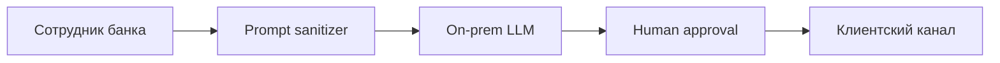

# ИИ и право в РФ

  ОБЯЗАТЕЛЬНО
  ДЛЯ НОВИЧКОВ

Всем

---

ИИ в продукте упирается в **закон** — персональные данные, биометрия, маркировка контента, договоры с обработчиком. Ниже — практический обзор для разработчиков, аналитиков и владельцев сервисов. Цель — понять **где спросить юриста** и **что заложить в архитектуру** до запуска.

Техническая безопасность — [6.10](/encyclopedia/6-ai/6-10-bezopasnost-pri-rabote-s-ii/intro). Российские API — [GigaChat и YandexGPT](/encyclopedia/6-ai/6-04-modeli-i-instrumenty/124). Выбор сервиса по данным — [как выбрать модель](/encyclopedia/6-ai/6-04-modeli-i-instrumenty/125). Учёба и ПДн студентов — [ИИ в учёбе](/encyclopedia/6-ai/6-06-primenenie-ii/116).

  
Не юридическая консультация

  

  Нормы и разъяснения регуляторов <strong>меняются</strong>. Перед запуском в prod сверяйте актуальные редакции законов, приказы Роскомнадзора и отраслевые требования (банк, медицина, госсектор) с <strong>юристом</strong>.
  

  
Термины

  

  <strong>ПДн</strong> (персональные данные) — информация о конкретном человеке (ФИО, телефон, email, фото). 
  <strong>Оператор ПДн</strong> — организация, которая решает, зачем и какие данные обрабатывать (обычно ваш продукт). 
  <strong>Обработчик</strong> — тот, кто обрабатывает данные по поручению оператора (облако LLM, хостинг). 
  <strong>On-premise</strong> — данные и модель в контуре заказчика, без зарубежного облака. 
  <strong>Трансграничная передача</strong> — передача ПДн за пределы РФ. 
  <strong>Биометрия</strong> — особая категория ПДн (лицо, голос, отпечаток и др.). 
  <strong>DPA</strong> (data processing agreement) — договор поручения обработки с провайдером.
  

---

## Ключевые законы и темы

| Тема | Ориентир в РФ | Что затрагивает в ИИ-продукте |
|------|---------------|-------------------------------|
| Персональные данные | **152-ФЗ** "О персональных данных" | Промпты, логи, fine-tune, RAG |
| Биометрия | **572-ФЗ**, спецрежим биометрических ПДн | Face ID, голос, KYC |
| Информация, реклама | Закон об информации, реклама | Маркировка, недостоверная реклама |
| Синтетический контент | Практика маркировки развивается | Текст, видео, аудио от модели |
| Экспериментальные режимы | Песочницы у регулятора | Ограниченный перимeter тестов |
| Авторское право | ГК РФ | Обучение, генерация, датасеты |
| Критическая инфраструктура | 187-ФЗ, отраслевые акты | Гос и КИИ-сектор |

Проекты с EU — дополнительно GDPR. Здесь фокус на РФ. Матрица провайдеров — [политика данных](/encyclopedia/6-ai/6-10-bezopasnost-pri-rabote-s-ii/5).

---

## 152-ФЗ для разработчика — принципы

**Персональные данные** — любая информация, относящаяся к **определённому или определяемому** физлицу.

| Принцип | Практика в ИИ-продукте |
|---------|------------------------|
| Законное основание | Согласие, договор или закон — осознанное решение, не "удобно скинули в ChatGPT" |
| Цель обработки | В политике явно: "поддержка", "чат-бот", "аналитика обращений" |
| Минимизация | Не слать в LLM лишние поля; маскировать в логах |
| Локализация | Хранение ПДн граждан РФ — на серверах в РФ (уточняйте у юриста) |
| Обработчик | Договор с Yandex Cloud / Sber / иным провайдером LLM |
| Трансграничная передача | Отдельный режим; зарубежный API с ПДн — высокий риск |
| Срок хранения | Логи промптов — политика удаления |
| Права субъекта | Запрос на удаление, доступ, уточнение |

Free ChatGPT с данными клиентов — типичное нарушение политики компании и потенциально 152-ФЗ.

---

## 152-ФЗ — сценарии для ИИ-продуктов

Ниже типовые сценарии. Для каждого нужны **основание**, **категория данных** и **контур обработки**.

### Чат поддержки с историей диалога

**Данные** — email, имя, текст обращения, история тикета.

**Риски**

- Промпт уходит в облако LLM без DPA.
- Логи содержат ПДн без TTL.
- Оператор видит чужие тикеты в RAG без ACL.

**Архитектура**

- Российский enterprise LLM или on-prem.
- Маскирование email/телефона перед отправкой в модель (если позволяет юрист).
- Retention логов 30–90 дней по политике.
- Согласие в оферте + уведомление об ИИ.

### HR-бот (отпуск, справки, KPI)

**Данные** — ФИО, должность, табельный номер, оценки.

**Риски**

- Автоматизированное решение без уведомления субъекта.
- Утечка зарплатных тем через промпт.

**Меры**

- Основание — трудовой договор + локальный акт + согласие где нужно.
- Запрет free-API.
- Human-in-the-loop для кадровых решений.

### RAG по внутренней базе знаний

**Данные** — документы с ПДн клиентов/сотрудников в чанках.

**Риски**

- Индекс в облаке без шифрования и ACL.
- Ответ цитирует чужой договор другому пользователю.

**Меры**

- Metadata `tenant_id`, filter при search.
- On-prem vector DB для чувствительных корпусов.
- См. [GraphRAG и безопасность](/encyclopedia/6-ai/6-05-razrabotka-ii/124).

### Аналитика обращений (summarization)

**Данные** — массовая обработка тикетов, темы, тональность.

**Риски**

- Псевдонимизация недостаточна — re-identification.
- Aggregates всё равно могут содержать цитаты с ПДн.

**Меры**

- Anonymization pipeline до LLM.
- Запрет цитирования дословных имён в отчётах наружу.

### Scoring и antifraud

**Данные** — поведение, транзакции, device fingerprint.

**Риски**

- Решение только алгоритмом без обжалования.
- Дискриминация — см. этику [ответственное использование](/encyclopedia/6-ai/6-06-primenenie-ii/3).

**Меры**

- Уведомление об автоматизированном решении.
- Процедура пересмотра человеком.

### Генерация писем и документов

**Данные** — шаблон + ПДн контрагента в промпте.

**Риски**

- Draft уходит в training logs провайдera (проверьте enterprise ZDR).

**Меры**

- Enterprise tier с zero data retention.
- Локальная модель для legal.

### Fine-tuning и дообучение

**Данные** — датасет диалогов поддержки.

**Риски**

- ПДн "запекаются" в веса модели.
- Невозможность удалить субъекта из модели.

**Меры**

- Anonymize dataset; юрист + DPO на каждый датасет.
- Prefer RAG вместо fine-tune на сырых ПДн.

### Голосовой ассистент

**Данные** — голос (биометрия), транскрипт.

**Риски**

- Биометрия без основания 572-ФЗ.
- Хранение аудио без срока.

**Меры**

- Отдельная правовая оценка; см. раздел биометрии ниже.

### Обработка изображений (KYC, паспорт)

**Данные** — скан документа, selfie.

**Риски**

- Особые категории; трансграничная передача.
- CV-модель в зарубежном облаке.

**Меры**

- On-prem OCR + verification; аккredited процессы в финтехе.

### Маркетинг и персонализация

**Данные** — профиль, история покупок, сегменты.

**Риски**

- Генерация рекламы без маркировки ИИ.
- Профiling без согласия.

**Меры**

- Согласие на маркетинг отдельно; маркировка синтетики.

---

## Классификация данных в промптах

Внутренняя матрица для команды (не публичный документ):

| Уровень | Примеры | Куда можно LLM |
|---------|---------|----------------|
| Public | FAQ, маркeting copy | Free/API по политике |
| Internal | Confluence без ПДн | Enterprise РФ или on-prem |
| Confidential | CRM, договоры | On-prem / ZDR enterprise |
| Restricted | Паспорт, здоровье, биометрия | Только изолированный контур + юрист |

Процесс **data classification** до code review на интеграцию LLM. См. [безопасность 6.10](/encyclopedia/6-ai/6-10-bezopasnost-pri-rabote-s-ii/1).

---

## Согласия пользователя

Для B2C и B2B2C обычно нужны:

- **Политика конфиденциальности** — что собираете, куда отправляете, срок хранения;
- **Согласие на обработку ПДн** — отдельным флагом, если требуется по основанию;
- **Согласие на автоматизированные решения** — если scoring или отказ без человека;
- **Уведомление об ИИ** — "ответ формирует модель, возможны ошибки".

В форме регистрации явно укажите, что текст может передаваться **третьему лицу** (LLM-провайдеру). См. [ответственное использование](/encyclopedia/6-ai/6-06-primenenie-ii/3).

### B2B SaaS

- DPA между вашей компанией и клиентом-оператором.
- Sub-processor list (OpenAI, Yandex, AWS).
- Клиент решает, какие данные класть в ваш чат.

### Шаблоны согласий — что описать (не готовый текст)

Юрист готовит финальные формулировки. Разработчику полезно понимать **блоки**:

**1. Политика конфиденциальности**

- Кто оператор (реквизиты).
- Какие категории ПДн (идентификация, контакт, поведение в продукте).
- Цели (оказание услуги, поддержка, улучшение модели — если вообще допустимо).
- Правовые основания по каждой цели.
- Сроки хранения и удаления.
- Кому передаём (хостинг, LLM-провайдер, analytics).
- Трансграничная передача — да/нет, куда.
- Права пользователя и контакт DPO/ответственного.
- Cookies и логи.

**2. Согласие на обработку ПДн (checkbox)**

- Короткий текст со ссылкой на политику.
- Отдельные чекбоксы для маркетинга и необязательных целей.
- Возможность отозвать согласие без потери базовой услуги (если применимо).

**3. Согласие / уведомление об ИИ**

- Что ответы генерирует модель.
- Возможны ошибки; не медицинская/юридическая консультация.
- Какие данные уходят в модель (текст чата, файлы).
- Используются ли данные для обучения провайдера (enterprise vs consumer API).

**4. Согласие на биометрию**

- Отдельный документ; часто отдельный процесс идентификации.
- Цель (идентификация, доступ в офис).
- Срок хранения шаблона.

**5. Согласие на автоматизированные решения**

- Какие решения принимаются алгоритмом.
- Как обжаловать.
- Контакт для человеческого пересмотра.

**UI-практика**

- Не прятать согласие в 40 страницах без ссылки.
- Сохранять версию политики и timestamp согласия в БД.
- При смене политики — re-consent flow для существенных изменений.

---

## Статус ИИ и экспериментальные режимы

Государство и отрасли периодически вводят **экспериментальные правовые режимы** (песочницы) для новых технологий. Для стартапа это может означать:

- упрощённые процедуры в **ограниченном** периметре;
- обязательные отчёты и меры защиты;
- запрет масштабирования на всю страну без выхода из режима.

**Что проверить с юристом**

- Попадает ли продукт под действующую песочницу.
- География и категории пользователей.
- Обязательная отчётность регулятору.
- Срок окончания режима и план миграции в обычное регулирование.

Если продукт в **критической инфраструктуре**, **госсекторе** или **финансах** — отдельные регламенты ЦБ, ФСТЭК, отраслевые стандарты. Универсального чек-листа без отрасли нет.

---

## Отраслевые требования — банки и финтех

Банки и финансовые организации работают под надзором **Банка России** и внутренними стандартами ИБ.

**Типичные ограничения для ИИ**

- Запрет или жёсткий контроль **трансграничной** передачи ПДн и платёжных данных.
- Требования к **журналированию** и неизменяемости логов.
- Разделение контуров (DEV/TEST/PROD).
- Сертифицированные СЗИ, иногда ГОСТ-криптография.

**Сценарии**

| Сценарий | Обычный подход |
|----------|----------------|
| Чат поддержки банка | On-prem LLM, маскирование счёта/карты |
| AML/KYC summarization | Изолированный контур, без облака |
| Генерация ответов оператору | Human approval каждого сообщения клиенту |
| Code copilot в банке | Без отправки исходников в public API |

**Практика для разработчика**

- Threat model на prompt injection в RAG по внутренним регламентам.
- Запрет paste клиентских данных в free ChatGPT — политика + DLP.
- Contractual SLA с провайдером LLM на локализацию и удаление.

См. [инфраструктура и секреты](/encyclopedia/8-infra-security/8-03-zabota-o-kode-i-dannyh/intro).

---

## Отраслевые требования — медицина

Медицинские данные — повышенная чувствительность; плюс профессиональная ответственность врача.

**Риски ИИ в med**

- Диагностика и назначение по чату без лицензии.
- Утечка истории болезни в LLM.
- Галлюцинации в дозировках и противопоказаниях.

**Практика**

- ИИ как **assistive** tool для врача, не замена решения.
- Дисклеймер для пациента — не медконсультация.
- On-prem или медицинский облачный контур по договору.
- Минимизация ПДн в промпте; de-identification.

Telemedicine и запись к врачу — отдельные лицензии и локальные акты. Перед med-продуктом — отраслевой юрист.

---

## Отраслевые требования — госсектор и КИИ

**Госсектор**

- Закупки через реестр отечественного ПО.
- Требования к хранению данных на территории РФ.
- Интеграция с ЕСИА, СМЭВ — отдельные регламенты.
- Ограничения на зарубежные SaaS на рабочих местах.

**Критическая информационная инфраструктура (КИИ)**

- Категорирование объектов.
- Уведомление регуляторов об инцидентах.
- Запрет зависимостей от недружественных юрисдикций в критичных узлах.

**ИИ в gov**

- Чатботы на сайтах ведомств — публичные данные, без ПДн в free API.
- Внутренние copilot — часто только on-prem open-weight модели.
- RAG по нормативке — контроль версий документов и цитирования.

---

## Трансграничная передача и зарубежные API

Передача ПДн граждан РФ в зарубежный дата-центр — **отдельный правовой режим**. На практике:

- Consumer ChatGPT/Claude с клиентскими ПДн — высокий риск для компании-оператора.
- Enterprise с DPA и указанием региона — обсуждается с юристом; всё равно может быть запрет отрасли.
- **Пseudonymization** не отменяет 152-ФЗ, если человек определяем.

**Технические альтернативы**

- [Российские нейросети](/encyclopedia/6-ai/6-04-modeli-i-instrumenty/124).
- On-prem [Ollama / LM Studio](/encyclopedia/6-ai/6-05-razrabotka-ii/113).
- Proxy-слой, который блокирует ПДn regex до API.

---

## Маркировка синтетического контента

Требования к **маркировке** контента, созданного ИИ (текст, изображение, аудио, видео), развиваются.

| Канал | Рекомендация |
|-------|--------------|
| Публикации, блог, соцсети | Пометка "создано с помощью ИИ" / "сгенерировано" |
| Реклама | Закон о рекламе; не вводить в заблуждение |
| Новости и факты | Редакционная проверка; ИИ не первоисточник |
| Продукт | Watermark, badge в UI, метаданные EXIF/C2PA |
| Поддержка клиентов | "Ответ подготовлен с участием ИИ" |
| Email рассылка | Footer с указанием генерации |

Deepfake и голос — [дипфейки и биометрия](/encyclopedia/6-ai/6-10-bezopasnost-pri-rabote-s-ii/8). Генерация изображений — [мультимодальный контент](/encyclopedia/6-ai/6-07-vayb-koding-i-neurokontent/5).

**Техническая реализация маркировки**

- Поле `generated_by_ai: true` в CMS.
- Visible badge в UI чата.
- Metadata в API response для downstream систем.
- Watermark на изображениях (видимый или стеганография — по политике).

---

## Биометрия

**Биометрические персональные данные** (лицо, голос, отпечаток) — **особый режим**:

- распознавание лиц на видео, KYC, голосовая биометрия;
- часто нужны **аккредитация**, **ЕБС** (единая биометрическая система) или иные основания — зависит от сценария.

**Сценарии**

| Сценарий | Комментарий |
|----------|-------------|
| Face unlock в офисе | HR + биометрия + ИБ |
| Голосовая верификация в банке | ЕБС / отраслевые правила |
| Deepfake detection | Не путать с законным сбором биометрии |
| "Fun filter" с лицом | Всё равно оценить ПДн и согласие |

Компьютерное зрение — [распознавание лиц](/encyclopedia/6-ai/6-06-primenenie-ii/120). Публичную биометрию без юриста не запускайте.

---

## Оператор и обработчик

| Роль | Кто | Ответственность |
|------|-----|-----------------|
| **Оператор ПДн** | Ваша компания | Цели, основания, права субъектов |
| **Обработчик** | Облако LLM, хостинг | Обработка по поручению, меры защиты |
| **Субобработчик** | CDN, monitoring SaaS | Должен быть в цепочке договоров |

В договоре с обработчиком фиксируют:

- предмет и duration обработки;
- категории ПДn;
- меры защиты (шифрование, access control);
- список субобработчиков и уведомление об изменениях;
- удаление или возврат данных по окончании;
- уведомление об инцидентах в срок;
- аудит и сертификаты (ISO 27001, at rest encryption);
- запрет использования данных для обучения моделей (если нужно).

---

## Реагирование на инциденты

Инцидент в контексте ИИ — не только взлом. Примеры:

- Утечка API-ключа → массовый доступ к промптам с ПДn.
- Prompt injection → exfiltration данных из RAG.
- Ошибка ACL → пользователь A видит чанки пользователя B.
- Сотрудник вставил базу клиентов в публичный чат.
- Логи с ПДn попали в публичный S3 bucket.

### Фазы response (playbook для команды)

**1. Detect (0–1 ч)**

- Алерты на аномальный трафик API.
- Жалоба пользователя или DLP.
- Назначить incident commander (dev + legal + PR).

**2. Contain (1–4 ч)**

- Rotate API keys, revoke tokens.
- Отключить affected feature flag.
- Block egress если SSRF.
- Preserve logs для расследования (immutable storage).

**3. Assess (4–24 ч)**

- Какие категории ПДn затронуты.
- Сколько субъектов.
- Был ли трансborder transfer.
- Root cause (code, config, human).

**4. Notify**

- Внутренний CEO/board по политике.
- Роскомнадзор / субъекты — **по указанию юриста** и severity.
- Клиенты-B2B по SLA.

**5. Remediate**

- Patch ACL, sanitize RAG, retrain staff.
- Postmortem без blame; action items в backlog.

**6. Document**

- Timeline, impact, lessons.
- Обновление политики и training.

См. [инциденты ИБ](/encyclopedia/6-ai/6-10-bezopasnost-pri-rabote-s-ii/1), [утечки секретов](/encyclopedia/8-infra-security/8-03-zabota-o-kode-i-dannyh/101).

### Таблица эскалации

| Severity | Пример | Действие |
|----------|--------|----------|
| P1 | Массовая утечка ПДn наружу | Stop ship, юрист, notify |
| P2 | ACL bug, ограниченный круг | Hotfix 24h, notify affected |
| P3 | ПДn в dev logs | Purge logs, process fix |
| P4 | Near miss | Postmortem internal |

---

## DPIA-подход для новых фич с ИИ

Data Protection Impact Assessment — практика оценки рисков **до** релиза. В РФ формально может отличаться от GDPR, но checklist полезен:

- Описание обработки (что, зачем, кто).
- Нecessity и proportionality.
- Риски для субъектов (ошибка модели, bias, утечка).
- Меры mitigation (minimization, on-prem, HITL).
- Остаточный риск и решение go/no-go.

Проводите DPIA при: новом LLM-провайдере, RAG на ПДn, биометрии, scoring.

---

## Чек-лист перед запуском в РФ

- [ ] Классификация данных в промптах (ПДn / нет / биометрия).
- [ ] Допустимый провайдер (РФ / enterprise / on-prem).
- [ ] Политика конфиденциальности и согласия обновлены, версии в БД.
- [ ] DPA с обработчиком подписан.
- [ ] Логи без сырого ПДn или с маскированием и TTL.
- [ ] Маркировка ИИ-контента в UI.
- [ ] Биометрия — только после юридической оценки.
- [ ] План инцидента (утечка промпта с `.env` / ПДn).
- [ ] Обучение сотрудников — no paste in ChatGPT.
- [ ] Отраслевые доптребования (банк/med/gov) проверены.
- [ ] Процедура запросов субъектов (удаление, доступ).

---

## 152-ФЗ — сценарий образовательной платформы

**Данные** — ФИО ученика, email родителя, ответы на тесты, переписка с tutor-ботом.

**Основания**

- Договор с родителем/студентом на оказание образовательных услуг.
- Согласие на обработку ПДн при регистрации.

**ИИ-специфика**

- Tutor-бот: уведомление, что ответы генерирует модель.
- Нельзя отправлять детские ПДn в зарубежный consumer API без оценки.
- Логи диалогов — срок хранения и доступ только support с RBAC.

См. [ИИ в учёбе](/encyclopedia/6-ai/6-06-primenenie-ii/116).

---

## 152-ФЗ — сценарий маркетплейса с рекомендациями

**Данные** — история покупок, просмотры, адрес доставки.

**Риски**

- Персonalized описания товаров через LLM с ПДn в промпте.
- Segments "беременные клиенты" без правового основания.

**Меры**

- Aggregated prompts без имён.
- Opt-in на персонализацию.
- Маркировка сгенерированных описаний.

---

## 152-ФЗ — сценарий внутреннего copilot разработчика

**Данные** — исходный код, тикеты Jira с email, комментарии code review.

**Риски**

- Paste `.env` и secrets в промпт — [безопасность кода](/encyclopedia/8-infra-security/8-03-zabota-o-kode-i-dannyh/101).
- Code в public GitHub Copilot training (consumer).

**Меры**

- Enterprise copilot с ZDR.
- Pre-commit hook блокирует secrets в prompt plugins.
- Локальный [Ollama](/encyclopedia/6-ai/6-05-razrabotka-ii/113) для closed source.

---

## Шаблон описания цели обработки (для политики)

Блок для юриста, не копировать без адаптации:

**Цель 1 — оказание услуги чат-поддержки**

- Категории ПДn: имя, email, текст обращения.
- Действия: сбор, запись, передача обработчику LLM для генерации ответа, хранение истории 90 дней.
- Основание: исполнение договора оферты п. …
- Обработчики: ООО "Хостинг", ООО "LLM Provider RU".

**Цель 2 — улучшение качества модели (опционально)**

- Только обезличенные данные или явное согласие отдельным чекбоксом.
- Возможность opt-out без потери поддержки.

**Цель 3 — маркетинг**

- Только при отдельном согласии; не смешивать с поддержкой.

---

## Шаблон уведомления об автоматизированных решениях

Элементы UI и текста оферты:

- Какие решения принимает алгоритм (скoring, лимит, блокировка).
- Логика **на уровне пользователя** (факторы без trade secret overload).
- Как запросить пересмотр человеком (email, форма, SLA 30 дней).
- Право предоставить дополнительные сведения.

Для ИИ-чата без legal effect иногда достаточно disclaimer "не является решением".

---

## Банки — дополнительные требования (обзор)

**ЦБ РФ и стандарты ИБ**

- Политика управления рисками ИИ (в крупных банках формируется).
- Запрет утечки PAN, CVV, PIN в любые внешние сервисы.
- Журналы операций — WORM storage в некоторых классах систем.

**Типовой архитектурный контур**

**DLP**

- Regex + ML на PAN/phone в clipboard и browser extension.
- Block paste в публичные чаты.

**Аудит**

- Квартальный review: какие системы подключены к LLM.
- Pen-test prompt injection на internal RAG.

---

## Медицина — клиники и telemed

**Роли**

- Врач — оператор решения; ИИ — assistive.
- МИС — оператор ПДn пациента.

**ИИ-сценарии**

| Сценарий | Правовой акцент |
|----------|-----------------|
| Transcription приёма | Согласие пациента, хранение аудио |
| Summary карты | Минимизация, не в consumer LLM |
| Chatbot triage на сайте | Disclaimer, не диагноз |
| Radiology CAD | Регистрация медизделия |

**Incident**

- Утечка фрагмента карты в промпте — как P1 med incident + юрист.

---

## Госсектор — закупки и контуры

**Отечественное ПО**

- Реестр Минцифры для госзакупок — проверяйте LLM-платформу в контракте.

**СМЭВ и ЕСИА**

- ИИ не должен логировать UID ЕСИА в third-party SaaS.

**Государственные чатботы**

- Только verified corpus (нормативка с version date).
- Escalation to operator при low confidence.

**КИИ**

- Категорирование объекта — определяет допустимость foreign dependency.

---

## Реагирование — шаблон внутреннего тикета

**Заголовок:** `[P2] LLM ACL leak tenant A→B`

**Поля**

- Detection time / who detected
- Affected users count estimate
- Data categories (email, contract text, …)
- Root cause hypothesis
- Containment actions taken
- Legal notified Y/N
- Customer comms draft link
- Postmortem due date

Храните шаблон в Confluence/Notion; drill раз в полгода.

---

## Реагирование — коммуникация пользователю (черновик для юриста)

Структура письма, не финальный текст:

1. Что произошло (факт без лишних деталей).
2. Какие данные могли быть затронуты.
3. Что мы уже сделали (fix, rotate keys).
4. Что может сделать пользователь (смена пароля, осторожность с фishing).
5. Контакт support и сроки ответа.

Не обещайте "100% не утекло", если не доказано.

---

## Реагирование — технические шаги для dev on-call

**Hour 0**

- Disable feature flag `llm_rag_enabled`.
- Rotate `OPENAI_API_KEY`, `INTERNAL_RAG_TOKEN`.
- Snapshot logs to cold storage.

**Hour 1–4**

- Identify commit introducing ACL bug.
- Hotfix filter `tenant_id` mandatory on vector query.
- Re-run spot check golden ACL tests.

**Day 1–3**

- Forensic: list affected `user_id` from access logs.
- Legal review notification threshold.

**Week 1**

- Postmortem; add integration test `test_tenant_isolation`.

См. [инциденты](/encyclopedia/6-ai/6-10-bezopasnost-pri-rabote-s-ii/1).

---

## Vignette — сотрудник и ChatGPT

**Ситуация:** менеджер вставил Excel с 500 email клиентов в free ChatGPT "сделай сегментацию".

**Проблемы:** 152-ФЗ, NDA, политика компании, возможная трансграничная передача.

**Response:** DLP alert → revoke access session → notify DPO → training → disciplinary по локальным правилам.

**Prevention:** approved enterprise tool + block consumer domains on proxy.

---

## Vignette — RAG цитирует чужой договор

**Ситуация:** пользователь tenant A получил chunk из tenant B из-за missing filter.

**Response:** P2 incident, hotfix ACL, notify tenants if required.

**Prevention:** integration tests + metadata filter on every query path.

---

## Vignette — deepfake в рекламе

**Ситуация:** маркeting сгенерировал лицо "похожее на знаменитость".

**Проблемы:** реклама, право на изображение, маркировка ИИ.

**Response:** stop campaign, legal review, replace asset.

См. [дипфейки](/encyclopedia/6-ai/6-10-bezopasnost-pri-rabote-s-ii/8).

---

## Авторское право и обучение моделей

Краткий orientir для продукта (не legal advice):

- Генерация по запросу пользователя — отдельный от training pipeline вопрос.
- Scraping сайтов для training — риски лицензий и robots.txt.
- В договоре с провайдером: **training opt-out** для enterprise.

Монетизация контента — [5](/encyclopedia/6-ai/6-06-primenenie-ii/5).

---

## Роль DPO и юриста в AI-фичах

| Этап | Юрист | DPO | Dev |
|------|-------|-----|-----|
| Idea | Go/no-go | Risk | Feasibility |
| Design | Основание ПДn | Minimization | Architecture |
| MVP | DPA draft | DPIA | Logs design |
| Launch | Sign-off | Breach process | Monitoring |

Не запускайте биометрию и scoring без их участия.

---

## Чек-лист интеграции нового LLM-провайдера

- [ ] Юрисдiction processing data.
- [ ] DPA подписан, subprocessors list.
- [ ] Training on customer data — off?
- [ ] Retention logs provider-side.
- [ ] SOC2 / ISO reports получены.
- [ ] Fallback provider в DR plan.
- [ ] Data classification matrix updated.

---

## Сроки хранения и удаление

| Данные | Типичный срок | Действие по запросу субъекта |
|--------|---------------|------------------------------|
| Логи промптов support | 30–90 дней | Удаление по ticket |
| История чата пользователя | До удаления аккаунта | Export + erase |
| Fine-tune dataset | До конца проекта | Переобучение без субъекта сложно — избегайте |
| Backup | По политике ИБ | Cascade delete с юристом |

**Право на забвение** — технически удалите из БД, логов, бэкапов по процедуре; LLM weights могут не поддерживать unlearn.

---

## Субъекты данных — обработка запросов

**Запрос доступа** — выгрузить, что храните о пользователе, включая summary диалогов.

**Запрос удаления** — удалить аккаунт, чаты, индексы RAG с его документами.

**SLA** — часто 30 дней; автоматизируйте ticket workflow.

**ИИ-специфика** — проверьте, не остались ли chunks в vector index после delete user.

---

## FAQ

**Можно ли анонимизировать промпт regex и слать в US API?**

Зависит от того, остаётся ли человек определяемым. Решает юрист; regex — не silver bullet.

**Нужно ли согласие на каждый чат?**

Обычно достаточно оферты + политики при регистрации; отдельные цели — отдельные чекбоксы.

**Клиент-B2B сам оператор — мы обработчик?**

Часто да; нужен DPA и ваши subprocessors в приложении.

**Логируем промпты для debug — legal?**

С minimization, TTL, access control и основанием в политике.

**Нужна ли регистрация оператора в РКН?**

Зависит от категории и объёма обработки — уточняет юрист при запуске prod.

**Можно ли хранить embeddings ПДn?**

Embeddings могут считаться обработкой ПДn — minimization и основание те же.

**Copilot в Microsoft 365 для компании в РФ?**

Enterprise договор + DPA; проверьте region processing.

---

---

## Договор с LLM-провайдером — checklist пунктов

- Territory of processing (RF only clause).
- Prohibition of sub-processing without notice.
- Security annex (encryption at rest/transit).
- Audit rights once per year.
- Data deletion within N days after contract end.
- Incident notification within 24–72 hours.
- No training on Customer Data (explicit).
- Liability cap and insurance (negotiate with legal).

---

## Матрица "фича — правовой риск"

| Фича | Риск | Mitigation |
|------|------|------------|
| Chat support | ПДn в промпте | Enterprise RF, TTL logs |
| RAG on contracts | ACL leak | Tenant filter tests |
| Voice bot | Биометрия | Legal review |
| Image gen ads | Маркировка, deepfake | Watermark + disclosure |
| Code copilot | Secrets leak | DLP, local model |
| Student essay API | Minors ПДn | Parent consent |

---

## Регуляторы и источники для мониторинга

- Роскомнадзор — разъяснения по 152-ФЗ.
- Банк России — положения по ИБ кредитных организаций.
- Минздрав — для med software (не путать с consumer wellness apps).
- Минцифры — реестр ПО, экспериментальные режимы.

Подписка юриста на digest раз в квартал дешевле штрафа.

---

## Internal policy — пример правил для сотрудников

1. Запрещено вводить ПДn клиентов в consumer GenAI.
2. Разрешено только корпоративный copilot с SSO.
3. Инцидент — сообщить security@ в течение 1 часа.
4. Обучение при onboarding и ежегодный refresh.
5. Тестовые данные — synthetic, не copy prod.

Публикуйте на wiki рядом с [ответственным использованием](/encyclopedia/6-ai/6-06-primenenie-ii/3).

---

## Краткая памятка разработчику (на стену)

- Нет ПДn в public API.
- DPA подписан до prod.
- Маркировка ИИ в UI.
- Инцидент — security@ 1 час.
- Юрист на биометрию и scoring.

---

## Типовые вопросы юристу перед релизом

1. Мы оператор или обработчик для этой фичи?
2. Нужно ли отдельное согласие на передачу текста LLM-провайдеру?
3. Допустима ли трансграничная передача при enterprise EU/US region?
4. Какие сроки хранения логов промптов?
5. Нужна ли маркировка для этого типа контента?
6. Попадаем ли под отраслевой стандарт (банк/med)?

Запишите ответы в ADR рядом с архитектурой.

---

## Синтетический контент — UI-паттерны

| Паттерн | Где |
|---------|-----|
| Badge "AI" на сообщении | Chat widget |
| Footer в email | Рассылки |
| Watermark на image | Генератор картинок |
| Metadata `ai_generated` | CMS API |
| Toggle "улучшить текст ИИ" | Формы с opt-in |

Согласуйте тексты badge с юристом (не обещать "100% точность").

---

## Связанные материалы

- [Российские нейросети](/encyclopedia/6-ai/6-04-modeli-i-instrumenty/124);
- [Enterprise-тарифы и ZDR](/encyclopedia/6-ai/6-10-bezopasnost-pri-rabote-s-ii/5);
- [ИИ в учёбе](/encyclopedia/6-ai/6-06-primenenie-ii/116);
- [Монетизация с ИИ](/encyclopedia/6-ai/6-06-primenenie-ii/5);
- [Дипфейки](/encyclopedia/6-ai/6-10-bezopasnost-pri-rabote-s-ii/8).

---
