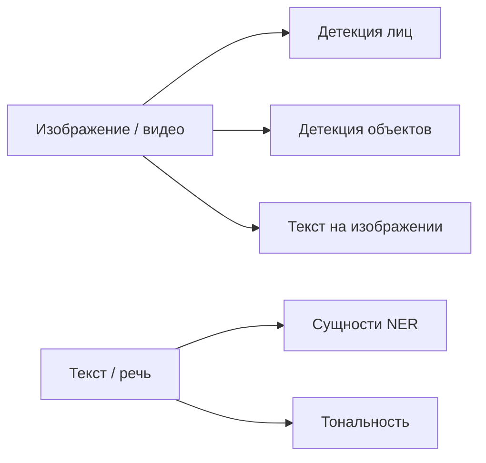

# Распознавание лиц, объектов и текста

<div class="article-tags">
  <span class="tag tag-beginner">ДЛЯ НОВИЧКОВ</span>
</div>

<span class="complexity-badge">Разработчику</span>

Три прикладных направления узкого ИИ часто идут в одном продукте: **камера** находит лица и объекты, **микрофон** — речь, **текст** — сущности и тональность. Ниже — как устроены задачи, какие метрики смотреть и когда обучать свою модель, а когда вызывать [облачный API](/encyclopedia/6-ai/6-05-razrabotka-ii/120). Расширенный обзор архитектур — в [Принцип работы современных ИИ-систем](/encyclopedia/6-ai/6-03-neyroseti/112); код CNN — [Keras и TensorFlow](/encyclopedia/6-ai/6-03-neyroseti/114).

---

## Три задачи — три выхода



| Задача | Вход | Выход |
|--------|------|--------|
| **Лицо** | Кадр | Bounding box, иногда эмбеддинг для сравнения |
| **Объект** | Кадр | Класс + координаты рамки (часто несколько объектов) |
| **Текст (NLP)** | Строка или транскрипт | Метки сущностей, тональность, категория |

**Классификация изображения** («что на картинке в целом») — один класс на всё фото. **Детекция** — несколько объектов с координатами. **Сегментация** — маска по пикселям; подробнее в [Алгоритмы ИИ](/encyclopedia/6-ai/6-02-mashinnoe-obuchenie/2).

---

## Распознавание лиц

Цепочка в проде обычно такая:

1. **Детекция** — найти область лица (Haar cascades, MTCNN, RetinaFace, модели в OpenCV и облачных API).
2. **Выравнивание** — поворот и масштаб по ключевым точкам (глаза, нос).
3. **Эмбеддинг** — вектор фиксированной длины (FaceNet, ArcFace); сравнение по косинусному расстоянию.
4. **Решение** — порог «тот же человек / другой» или классификатор эмоций поверх кропа.

```python
# Иллюстрация: эмбеддинги через готовую библиотеку (нужен pip install deepface)
from deepface import DeepFace

result = DeepFace.verify(
    img1_path="person_a_1.jpg",
    img2_path="person_a_2.jpg",
    model_name="Facenet",
    enforce_detection=False,
)
print(result["verified"], result["distance"])
```

<div class="callout callout--warning">
  <div class="callout-title">Этика и право</div>

  Биометрия и видеонаблюдение регулируются законом (в т.ч. 152-ФЗ в РФ, GDPR в ЕС). Нужны основания обработки, уведомление субъектов, контроль качества на разных группах населения — модели часто хуже работают на тёмной коже при смещённом обучающем наборе.
</div>

Облачные **Face API** (Azure AI Vision, Amazon Rekognition) закрывают детекцию и сравнение без своего GPU — см. [Cognitive Services](/encyclopedia/6-ai/6-05-razrabotka-ii/120).

---

## Детекция объектов

**YOLO**, **SSD**, семейство **R-CNN** предсказывают для каждого кадра набор рамок `(x, y, w, h)` и класс (человек, автомобиль, знак).

Типичный стек разработчика:

- обучение — PyTorch + Ultralytics YOLO или TensorFlow;
- инференс в реальном времени — ONNX, TensorRT, OpenVINO;
- разметка — Label Studio, CVAT.

Метрики: **mAP** (mean Average Precision) на тестовом наборе с IoU-порогом; в бизнесе добавляют задержку (FPS) и долю ложных срабатываний на линии.

[Transfer learning](/encyclopedia/6-ai/6-02-mashinnoe-obuchenie/3) на COCO/ImageNet ускоряет запуск: заморозить backbone, дообучить голову на своих классах («дефект», «шлем», «QR на коробке»).

---

## Текст — OCR, NER, тональность

### OCR (текст на изображении)

**Optical Character Recognition** извлекает строки с фото документов, вывесок, сканов. Цепочка: предобработка (бинаризация, выравнивание) → детекция строк → распознавание символов (CRNN, трансформеры). Готовые движки: Tesseract, EasyOCR, облачный **Document Intelligence** / **Vision Read API**.

### NER (именованные сущности)

Из текста извлекают **персоны, организации, локации, даты**:

```python
# pip install spacy && python -m spacy download ru_core_news_sm
import spacy

nlp = spacy.load("ru_core_news_sm")
doc = nlp("Иванов подписал договор в Москве 12 мая 2025 года.")
for ent in doc.ents:
    print(ent.text, ent.label_)
```

Для русского и доменной лексики (медицина, право) часто дообучают трансформеры (BERT-подобные) на размеченном корпусе или используют облачный **Language** API.

### Тональность и классификация текста

Бинарная или многоклассовая задача для sklearn (`TfidfVectorizer` + `LogisticRegression`) или fine-tuned BERT. Для длинных отзывов смотрят macro-F1 по классам.

---

## Своя модель или облако

| Критерий | Своя модель (Keras / PyTorch / OpenCV) | Облачный Cognitive API |
|----------|----------------------------------------|-------------------------|
| Данные | Есть разметка или можно собрать | Мало данных, нужен быстрый MVP |
| Задержка / офлайн | Edge, закрытый контур | Допустим HTTPS-вызов |
| Стоимость | GPU, MLOps | Оплата за 1000 вызовов |
| Кастомизация | Полная | Ограничена fine-tune / Custom Vision |

Гибрид: детекция на устройстве, тяжёлый OCR в облаке.

---

## Метрики и типичные ошибки

| Ошибка | Последствие |
|--------|-------------|
| Утечка: аугментация до split | Завышенный mAP на тесте |
| Один порог для всех сцен | Пропуски на тёмных кадрах |
| Игнор bias в лицах | Дискриминация в проде |
| OCR без проверки языка | Мусор в полях формы |

Связанные разделы: [компьютерная графика](/encyclopedia/9-spinoff/9-08-kompyuternaya-grafika/11) (аугментации, TFRecord), [тестирование ML](/encyclopedia/7-project/7-05-testirovanie/1273).

---

## Маршрут чтения

1. [Keras и TensorFlow](/encyclopedia/6-ai/6-03-neyroseti/114) — MNIST, CNN.
2. [Transfer learning](/encyclopedia/6-ai/6-02-mashinnoe-obuchenie/3) — свои классы на ImageNet.
3. [Cognitive Services](/encyclopedia/6-ai/6-05-razrabotka-ii/120) — REST без обучения.
4. [Алгоритмы ИИ](/encyclopedia/6-ai/6-02-mashinnoe-obuchenie/2) — YOLO, сегментация, NLP-разделы справочника.
