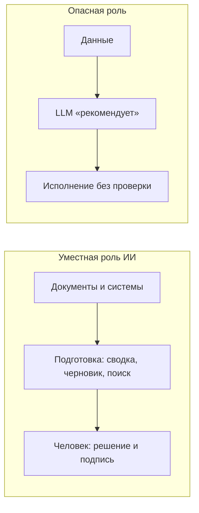

# ИИ, топ-менеджмент и AI-washing в корпоративном ПО

  ОБЯЗАТЕЛЬНО
  ДЛЯ НОВИЧКОВ

Всем

Производители корпоративного софта — BPM, CRM, ERP, HRM, ECM — массово добавляют в продукты блоки «ИИ-ассистент для руководителя»: сводки для совета директоров, «рекомендации» по сделкам, прогнозы в один клик. Маркетинг адресован **лицам, принимающим решения (ЛПР)** — CEO, CFO, владельцам бизнеса. Со стороны это выглядит как технологичность и соответствие тренду.

С инженерной и управленческой точки зрения картина иная: **топ-менеджер — последний человек, которому нужно передавать финальное решение системе на вероятностных прогнозах**. Ниже — почему так, что такое **AI-washing**, где ИИ действительно помогает и какие ограничения закладывать в контракт с вендором.

Техническая база: [что такое ИИ на самом деле](/encyclopedia/6-ai/6-01-vvedenie-v-ii/1), [генеративный стек](/encyclopedia/6-ai/6-01-vvedenie-v-ii/12). Практика контроля — [ответственное использование](/encyclopedia/6-ai/6-06-primenenie-ii/3), [критический анализ ответов](/encyclopedia/6-ai/6-06-primenenie-ii/114).

---

## Почему «ИИ для CEO» — маркетинг, а не архитектура

Топ-менеджер несёт **юридическую, финансовую и репутационную** ответственность за решения. Генеративная модель (LLM):

| Свойство LLM | Последствие для управленческого решения |
|--------------|----------------------------------------|
| Вероятностный вывод (следующий токен) | Даже при «99% уверенности» остаётся доля ошибки; в масштабе компании один промах может стоить миллионов |
| Нет субъекта ответственности | В чате модель может написать «ошибся» — в годовом отчёте или перед регулятором это не снимает ответственности с человека |
| Слабая объяснимость | Сложно восстановить цепочку «почему именно этот вывод» для аудита и суда |
| Галлюцинации | Правдоподобный, но ложный текст — особенно опасен для занятого ЛПР, который читает сводку по диагонали |

**Валидация ответа ИИ для топ-менеджера часто дороже, чем принять решение самому**: нужно проверить цифры, источники, юридические формулировки, контекст, которого не было в промпте. Если проверять некогда — доверие к «ассистенту» превращается в иллюзию контроля.

ИИ не «думает» и не «советует» в смысле профессиональной экспертизы. Он **сжимает и переформулирует** уже имеющиеся данные и шаблоны из обучающего корпуса. Для стратегии, M&A, кадровых решений с высоким риском, ответов регулятору это недостаточная основа без жёсткого human-in-the-loop.

Подход «CEO готовится к совету директоров через чат с LLM» как **единственный** источник аналитики противоречит базовым принципам риск-менеджмента. Как инструмент **черновика** при полной проверке — допустим; как замена финансовому директору, юристу и совету — нет. Критика перегиба в сторону «AI First без процессов» — в материале [AI First](/encyclopedia/6-ai/6-04-modeli-i-instrumenty/112); здесь акцент на **роли ЛПР и вендоров ERP-класса**.

---

## AI-washing - маркетинговая кнопка «AI» в BPM, CRM и ERP

**AI-washing** — навешивание ярлыка «искусственный интеллект» на функции, где достаточно отчёта, правила или классического ML, чтобы:

1. **Обосновать CAPEX/OPEX** — проще согласовать бюджет на «инновационный ИИ-модуль», чем на доработку отчёта или интеграцию с хранилищем.
2. **Держать конкурентный паритет** — у конкурента в презентации есть «AI Copilot»; отсутствие такой же кнопки воспринимается как отставание, даже без доказанной ценности.
3. **Создать инфоповод для ЛПР** — генеративный ИИ понятен прессе и совету директоров; «улучшили отчётность GL» — нет.

Типичный сценарий: в CRM появляется чат «проанализируй воронку и предложи действия»; в BPM — «сгенерируй регламент»; в ERP — «спрогнозируй закупки». Под капотом часто **вызов внешнего API** (GPT-класс) + промпт, иногда RAG по документации вендора, без глубокой связи с вашими мастер-данными и без гарантий по SLA на качество текста.

Организации боятся «отстать от хайпа» и внедряют LLM там, где нужна **детерминированная логика с аудитом** (проводки, лимиты, согласования, SOX). Итог полярный:

- сотрудники **игнорируют** «умную» панель как шум;
- или **верят** сформулированному уверенно тексту — и это уже риск.

См. также: [этические и технические проблемы внедрения](/encyclopedia/6-ai/6-06-primenenie-ii/112) (избыточный LLM в CRM), [корпоративный и индивидуальный режим ИИ](/encyclopedia/6-ai/6-06-primenenie-ii/2).

---

## Где уместен ИИ - подготовка, не решение

Если отсечь маркетинг, остаются **узкие сценарии** — ускорение рутины там, где вы уперлись в потолок объёма информации, а не замена суждения:

| Сценарий | Что делает ИИ | Что делает человек |
|----------|---------------|-------------------|
| **Саммаризация** | Сжимает протоколы, письма, отчёты | Проверяет факты и выводы, принимает решение |
| **Поиск по базе (RAG)** | Находит фрагменты по запросу («отгрузки по региону X за 3 года») | Сверяет с источником в ERP/BI, интерпретирует |
| **Черновики** | Первый вариант письма, приказа, структуры слайдов | Редактирует, подписывает, несёт ответственность |
| **Рутина разработки/контента** | Массовые правки, шаблоны CSS, поиск паттерна в репозитории | Проверяет diff, тесты, безопасность |

Во всех случаях формулировка продукта должна быть **«подготовить материал»**, а не **«рекомендовать решение»**. Кнопки «принять рекомендацию ИИ» в критичных процессах без обязательного шага валидации — красный флаг при выборе вендора.

Для разработчиков интеграций с CRM/ERP — раздел [разработка ИИ](/encyclopedia/6-ai/6-05-razrabotka-ii/1): там описаны паттерны middleware и классификации обращений; отличайте **автоматизацию черновика** от **автоисполнения без человека**.

---

## Метафора - быстрый стажёр с галлюцинациями

Полезная модель для закупки и обучения ЛПР:

> **ИИ в корпорации — очень быстрый, иногда «галлюцинирующий» джун.** Ему можно поручить черновую работу с информацией; допускать к финальным финансовым и стратегическим решениям без жёсткого контроля — нарушение профессиональной этики и риск-менеджмента. «Глаз да глаз» — обязателен.

«Джун» не подписывает договор, не отвечает в суде, не знает неформального контекста совета директоров. Топ-менеджер как раз для этого и нужен — не для того, чтобы переложить суждение на статистику токенов.

---

## Что требовать от вендора и ИТ при внедрении

Минимальный набор для корпоративного контура (дополняет [политики ответственного ИИ](/encyclopedia/6-ai/6-06-primenenie-ii/3)):

| Мера | Смысл |
|------|--------|
| **Human-in-the-loop** | Любое действие, инициированное ИИ (проводка, смена статуса сделки, отправка письма клиенту), — только после явного подтверждения сотрудником |
| **Аудит** | Лог: запрос, версия модели, источники RAG, ответ, кто утвердил; срок хранения по compliance |
| **Зоны данных** | ИИ только на данных низкой критичности или в **песочнице** до валидации; запрет утечки PII/коммерческой тайны в публичный API |
| **Разделение «аналитика» и «исполнение»** | Отчёт и черновик — да; автоматическое «согласно рекомендации ИИ» в ERP — только с workflow и правами |
| **Метрики не «внедрили AI»** | Время на подготовку материала, доля исправлений после ИИ, инциденты ошибочных фактов — не количество кликов по чату |

При оценке тендера задавайте прямые вопросы: **какая модель, где хостинг, обучается ли на ваших данных, кто отвечает за ошибочную «рекомендацию» по договору**, есть ли offline/локальный режим для чувствительных контуров.

---

## Итоги

- **Топ-менеджмент** нуждается в ответственности и контексте, а не в иллюзии «второго мнения» от LLM без проверки.
- **AI-washing** в BPM/CRM/ERP гонит бюджеты и ожидания; реальная ценность — в подготовке информации и рутине, не в передаче решений.
- **Передавать стратегические и финансовые решения** вероятностной системе без аудита — нарушение риск-менеджмента; допустимая роль — **предобработка** под контролем человека.

Дальше: [критический разбор ответов](/encyclopedia/6-ai/6-06-primenenie-ii/114), [агенты и усиление рисков](/encyclopedia/6-ai/6-04-modeli-i-instrumenty/116), практика на Learn — [навигатор](/tools/documentation/6).

---
