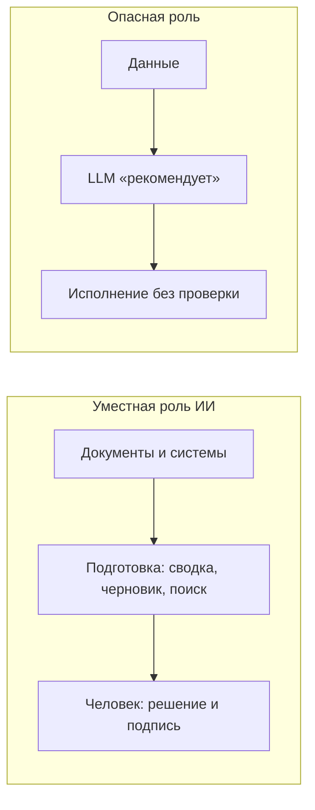

# ИИ, топ-менеджмент и AI-washing в корпоративном ПО

  ОБЯЗАТЕЛЬНО
  ДЛЯ НОВИЧКОВ

Всем

> **Зачем эта статья.** Если вы видите в презентации CRM фразу «ИИ-советник для CEO» — полезно понимать, что за кнопкой стоит технически, кому она реально помогает и где маркетинг расходится с рисками. Материал для руководителей, закупок, аналитиков и ИТ — без углубления в обучение моделей.

Производители корпоративного софта — **BPM**, **CRM**, **ERP**, **HRM**, **ECM** — массово добавляют блоки «ИИ-ассистент для руководителя»: сводки для совета директоров, «рекомендации» по сделкам, прогнозы в один клик. Реклама адресована **лицам, принимающим решения (ЛПР)** — CEO, CFO, владельцам бизнеса. Со стороны это выглядит как технологичность и соответствие тренду.

С инженерной и управленческой точки зрения картина иная: **топ-менеджер — последний человек, которому уместно передавать финальное решение системе на вероятностных прогнозах**. Ниже — почему так, что такое **AI-washing**, где ИИ действительно помогает и какие ограничения закладывать в контракт с вендором.

Техническая база: [что такое ИИ на самом деле](/encyclopedia/6-ai/6-01-vvedenie-v-ii/1), [генеративный стек](/encyclopedia/6-ai/6-01-vvedenie-v-ii/12). Практика контроля — [ответственное использование](/encyclopedia/6-ai/6-06-primenenie-ii/3), [критический анализ ответов](/encyclopedia/6-ai/6-06-primenenie-ii/114).

---

## Словарь — термины без жаргона

| Термин | Простыми словами |
|--------|------------------|
| **ЛПР** (лицо, принимающее решение) | Человек, который подписывает бюджет, договор, кадровое решение или отчёт перед регулятором |
| **BPM** | Система описания и исполнения бизнес-процессов («согласование заявки», «онбординг сотрудника») |
| **CRM** | Учёт клиентов, сделок, воронки продаж |
| **ERP** | Учёт ресурсов предприятия: склад, закупки, финансы, производство |
| **HRM / ECM** | Кадры и документооборот |
| **LLM** (большая языковая модель) | Программа, которая **продолжает текст** по статистике обучающих данных; ChatGPT и аналоги — из этой семьи |
| **Галлюцинация** | Убедительный, но **ложный** факт в ответе модели (выдуманная цифра, «цитата», ссылка) |
| **RAG** | Поиск по **вашим** документам + вставка найденного фрагмента в промпт; ответ опирается на базу знаний компании, а не только на интернет из обучения |
| **Промпт** | Текст запроса к модели («сожми протокол совета за 2025 год в один абзац») |
| **Human-in-the-loop** | Человек **явно подтверждает** действие до исполнения (проводка, письмо клиенту, смена статуса сделки) |
| **AI-washing** | Маркетинговая метка «ИИ» на функции, где достаточно отчёта, правила или классического ML |
| **CAPEX / OPEX** | Капитальные и операционные расходы; «модуль ИИ» часто проще согласовать в бюджете, чем «доработку отчёта» |
| **SOX** | Требования к внутреннему контролю и аудиту (актуально для публичных компаний и их IT-процессов) |

---

## Что такое «корпоративный софт» в этом контексте

Это системы учёта и процессов (склад, сделки, кадры, проводки), в которых годами копятся **мастер-данные**: контрагенты, остатки, проводки, кадровые дела. Ошибка в ERP может привести к неверной отчётности; ошибка в CRM — к потере сделки или утечке персональных данных.

Вендоры таких систем продают **долгие контракты** и модули. Когда в релизе появляется «Copilot для руководителя», задача маркетинга — показать, что продукт «в тренде ИИ». Задача заказчика — отделить **реальную экономию времени** (черновик, поиск) от **иллюзии принятия решений** (кнопка «согласно рекомендации ИИ»).

---

## Почему «ИИ для CEO» — маркетинг, а не архитектура

Топ-менеджер несёт **юридическую, финансовую и репутационную** ответственность за решения. Генеративная модель (LLM) устроена иначе:

| Свойство LLM | Последствие для управленческого решения |
|--------------|----------------------------------------|
| Вероятностный вывод (следующий токен) | Даже при высокой «уверенности» в тексте остаётся доля ошибки; в масштабе компании один промах может стоить миллионов |
| Нет субъекта ответственности | В чате модель может написать «ошибся» — в годовом отчёте или перед регулятором ответственность остаётся на человеке и юрлице |
| Слабая объяснимость | Сложно восстановить цепочку «почему именно этот вывод» для аудита и суда |
| Галлюцинации | Правдоподобный, но ложный текст — особенно опасен для занятого ЛПР, который читает сводку по диагонали |

**Валидация ответа ИИ для топ-менеджера часто дороже, чем принять решение самому**: нужно проверить цифры, источники, юридические формулировки, контекст, которого не было в промпте. Если проверять некогда — доверие к «ассистенту» превращается в иллюзию контроля.

### Как LLM «думает» на самом деле (для неспециалиста)

Модель **не** ведёт внутренний совет директоров. Она **предсказывает следующее слово** (токен) по шаблонам из огромного корпуса текстов. Ответ звучит экспертно, потому что в обучении были тысячи отчётов и презентаций в похожем стиле. Это **сжатие и переформулировка** уже встречавшихся формулировок плюс ваши данные в промпте — **без** гарантии, что цифра из сводки совпала с GL в ERP.

Для стратегии, M&A, кадровых решений с высоким риском, ответов регулятору нужен жёсткий **human-in-the-loop**: человек с полномочиями проверяет и подписывает.

Подход «CEO готовится к совету директоров **только** через чат с LLM» противоречит базовым принципам риск-менеджмента. Как инструмент **черновика** при полной проверке — допустим; как замена финансовому директору, юристу и совету — нет. Критика перегиба в сторону «AI First без процессов» — в материале [AI First](/encyclopedia/6-ai/6-04-modeli-i-instrumenty/112); здесь акцент на **роли ЛПР и вендоров ERP-класса**.

### Мини-кейс — сводка для совета директоров

1. Система CRM+ИИ строит «прогноз закрытия квартала» по воронке.
2. CEO получает абзац: «рост 12%, рисков нет».
3. **Что проверить вручную:** выгрузка из BI, определение «закрытой» сделки, валюта, отменённые сделки, крупные сделки в статусе «устное согласие».
4. **Типичная ошибка:** доверить формулировку модели без сверки с GL — в отчёте красивая цифра, в учёте расхождение.

---

## AI-washing — маркетинговая кнопка «AI» в BPM, CRM и ERP

**AI-washing** — навешивание ярлыка «искусственный интеллект» на функции, где достаточно отчёта, правила или классического ML, чтобы:

1. **Обосновать CAPEX/OPEX** — проще согласовать бюджет на «инновационный ИИ-модуль», чем на доработку отчёта или интеграцию с хранилищем.
2. **Держать конкурентный паритет** — у конкурента в презентации есть «AI Copilot»; отсутствие такой же кнопки воспринимается как отставание, даже без доказанной ценности.
3. **Создать инфоповод для ЛПР** — генеративный ИИ понятен прессе и совету директоров; «улучшили отчётность GL» — нет.

### Чем «настоящий» ML отличается от «чата в шапке»

| Признак | Классический ML / правила | Типичный «ИИ-модуль» вендора |
|---------|---------------------------|------------------------------|
| Поведение | Предсказуемое: «если сумма > лимита — на согласование» | Текст ответа меняется от формулировки промпта |
| Аудит | Лог правила, версия модели скоринга | Нужен отдельный лог промпта и ответа |
| Данные | Обычно ваши транзакции в контуре | Часто вызов **внешнего API** (GPT-класс) |
| Ошибка | Ошибка классификации, измеримая метрика | Галлюцинация в тексте «рекомендации» |

Типичный сценарий: в CRM появляется чат «проанализируй воронку и предложи действия»; в BPM — «сгенерируй регламент»; в ERP — «спрогнозируй закупки». Под капотом часто **вызов внешнего API** + промпт, иногда RAG по документации вендора, без глубокой связи с вашими мастер-данными и без гарантий по SLA на качество текста.

Организации боятся «отстать от хайпа» и внедряют LLM там, где нужна **детерминированная логика с аудитом** (проводки, лимиты, согласования, SOX). Итог полярный:

- сотрудники **игнорируют** «умную» панель как шум;
- или **верят** сформулированному уверенно тексту — и это уже риск.

См. также: [этические и технические проблемы внедрения](/encyclopedia/6-ai/6-06-primenenie-ii/112), [корпоративный и индивидуальный режим ИИ](/encyclopedia/6-ai/6-06-primenenie-ii/2).

---

## Где уместен ИИ — подготовка, не решение

Если отсечь маркетинг, остаются **узкие сценарии** — ускорение рутины там, где вы уперлись в потолок объёма информации, а замена суждения не требуется:

| Сценарий | Что делает ИИ | Что делает человек |
|----------|---------------|-------------------|
| **Саммаризация** | Сжимает протоколы, письма, отчёты | Проверяет факты и выводы, принимает решение |
| **Поиск по базе (RAG)** | Находит фрагменты по запросу («отгрузки по региону X за 3 года») | Сверяет с источником в ERP/BI, интерпретирует |
| **Черновики** | Первый вариант письма, приказа, структуры слайдов | Редактирует, подписывает, несёт ответственность |
| **Рутина разработки/контента** | Массовые правки, шаблоны, поиск паттерна в репозитории | Проверяет diff, тесты, безопасность |

Во всех случаях формулировка продукта должна быть **«подготовить материал»**, а **«рекомендовать решение»** — только с обязательным шагом валидации. Кнопки «принять рекомендацию ИИ» в критичных процессах без явного подтверждения — красный флаг при выборе вендора.

Для разработчиков интеграций с CRM/ERP — раздел [разработка ИИ](/encyclopedia/6-ai/6-05-razrabotka-ii/1): там описаны паттерны middleware и классификации обращений; отличайте **автоматизацию черновика** от **автоисполнения без человека**.

---

## Метафора — быстрый стажёр с галлюцинациями

Полезная модель для закупки и обучения ЛПР:

> **ИИ в корпорации — очень быстрый, иногда «галлюцинирующий» джун.** Ему можно поручить черновую работу с информацией; допускать к финальным финансовым и стратегическим решениям без жёсткого контроля — нарушение профессиональной этики и риск-менеджмента. «Глаз да глаз» — обязателен.

«Джун» не подписывает договор, не отвечает в суде, не знает неформального контекста совета директоров. Топ-менеджер как раз для этого и нужен — для ответственности и контекста, а не для перекладывания суждения на статистику токенов.

---

## Что требовать от вендора и ИТ при внедрении

Минимальный набор для корпоративного контура (дополняет [политики ответственного ИИ](/encyclopedia/6-ai/6-06-primenenie-ii/3)):

| Мера | Смысл |
|------|--------|
| **Human-in-the-loop** | Любое действие, инициированное ИИ (проводка, смена статуса сделки, отправка письма клиенту), — только после явного подтверждения сотрудником |
| **Аудит** | Лог: запрос, версия модели, источники RAG, ответ, кто утвердил; срок хранения по compliance |
| **Зоны данных** | ИИ только на данных низкой критичности или в **песочнице** до валидации; запрет утечки PII/коммерческой тайны в публичный API |
| **Разделение «аналитика» и «исполнение»** | Отчёт и черновик — да; автоматическое «согласно рекомендации ИИ» в ERP — только с workflow и правами |
| **Метрики не «внедрили AI»** | Время на подготовку материала, доля исправлений после ИИ, инциденты ошибочных фактов — не количество кликов по чату |

### Вопросы на тендере (развернутый чек-лист)

| # | Вопрос | Зачем спрашивать |
|---|--------|------------------|
| 1 | Какая **модель** (название, версия), **где хостинг** (ваш облак, регион, субпроцессор)? | 152-ФЗ, GDPR, требования ИБ |
| 2 | **Обучается** ли на ваших данных? Как отозвать данные? | Риск утечки и «запоминания» коммерческой тайны |
| 3 | Кто по **договору** отвечает за ошибочную «рекомендацию»? | Лимит ответственности, SLA |
| 4 | Есть ли **offline / on-prem** для чувствительного контура? | Банки, госсектор, закрытые контуры |
| 5 | Что в **логе** при споре с регулятором? | Воспроизводимость решения |
| 6 | Как отключается модуль **без** остановки ERP? | Риск vendor lock-in на «обязательный ИИ» |
| 7 | Какие **метрики качества** текста на ваших данных (не демо)? | AI-washing отсекается цифрами |

---

## Типичные ошибки при внедрении «ИИ для руководителя»

| Ошибка | Последствие | Что делать |
|--------|-------------|------------|
| KPI «число запросов в чат» | Рост шума, ноль влияния на решения | Метрики времени подготовки и доли правок |
| Обучение «нажмите Copilot» без критики | Доверие к галлюцинациям | [Критический разбор](/encyclopedia/6-ai/6-06-primenenie-ii/114) в онбординге |
| Публичный ChatGPT для отчётности | Утечка в обучение / логи вендора | Только одобрённые корпоративные контуры |
| ИИ в проводках без workflow | SOX, необратимые ошибки | Только черновик + подпись бухгалтера |

---

## Итоги

- **Топ-менеджмент** нуждается в ответственности и контексте; иллюзия «второго мнения» от LLM без проверки создаёт управленческий риск.
- **AI-washing** в BPM/CRM/ERP гонит бюджеты и ожидания; реальная ценность — в подготовке информации и рутине, в передаче решений без аудита — нет.
- **Стратегические и финансовые решения** вероятностной системе без аудита противоречат риск-менеджменту; допустимая роль — **предобработка** под контролем человека.

Дальше: [критический разбор ответов](/encyclopedia/6-ai/6-06-primenenie-ii/114), [агенты и усиление рисков](/encyclopedia/6-ai/6-04-modeli-i-instrumenty/116), практика на Learn — [навигатор](/tools/documentation/6).

---
