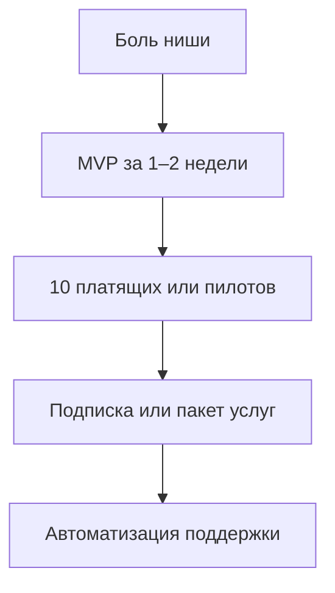

# Монетизация цифровых продуктов с ИИ

  ДЛЯ НОВИЧКОВ

Всем

Макроэкономика рынка LLM — в [обзоре монетизации](/encyclopedia/6-ai/6-06-primenenie-ii/2). Здесь — **что может сделать один человек или маленькая команда**, владеющая ИИ как инструментом производства (код, контент, автоматизация).

---

## Теория монетизации цифрового продукта

Монетизация в цифровом продукте строится на связке трёх величин:

- **ценность** для пользователя;
- **частота** возникновения задачи;
- **издержки переключения** на альтернативу.

Формула практического выбора ниши проста:

`доход = платящие пользователи × средний чек × период удержания`.

ИИ влияет в первую очередь на скорость создания и улучшения продукта, но устойчивый доход формируют только повторяемая ценность и удержание.

---

## Навык, который продаётся

Ценность для клиента — **результат за измеримое время**. Клиент платит за сокращение издержек, рост выручки или снижение рутины, а не за сам факт применения ИИ:

| Навык | Пример результата для заказчика |
|-------|----------------------------------|
| Быстрый MVP | Лендинг + форма + CRM за неделю |
| Автоматизация | n8n-сценарий: заявка → классификация LLM → задача в Notion |
| Доработка | Интеграция RAG с внутренней базой знаний |
| Обучение | Воркшоп по безопасным промптам для отдела |

ИИ сокращает время черновика; **ответственность, деплой и поддержка** остаются вашим торговым предложением.

---

## Продуктовая рамка JTBD

Подход Jobs-To-Be-Done помогает не раствориться в "фичах ИИ". Пользователь "нанимает" ваш продукт выполнить конкретную работу:

- сократить время операции;
- снизить число ошибок;
- убрать рутину в коммуникациях;
- стандартизировать выходной артефакт.

Если в формулировке ценности отсутствует измеримая "работа", продукт трудно продать независимо от качества модели.

---

## Модели дохода

### 1. Подписка (SaaS)

Пользователь платит ежемесячно за доступ к вашему сервису (дашборд, бот, генератор отчётов).

- **Плюсы**: предсказуемый cash flow.
- **Минусы** — поддержка, uptime, конкуренция с бесплатными чатами.
- **Совет**: узкая ниша ("генератор КП для монтажников ОВиК") бьёт "ещё один ChatGPT".

Технически: Stripe / ЮKassa / Robokassa + хостинг из [пути без ручного кодинга](/encyclopedia/6-ai/6-05-razrabotka-ii/117).

### 2. Разовая продажа цифрового товара

- Шаблоны n8n, промпт-паки, Notion-базы, UI-kit.
- Курсы и интенсивы (запись + чат поддержки).

Площадки — Gumroad, Boosty, собственный сайт. Главное — **лицензия** (можно ли перепродавать, использовать в агентстве).

### 3. Услуги (фриланс / студия)

- Аудит "как внедрить ИИ в отдел продаж".
- Сборка MVP под ключ.
- Сопровождение: N часов в месяц на правку промптов и сценариев.

Ценообразование: фикс за этап + почасовка за изменения. Фиксируйте scope в ТЗ, иначе получите бесконечные запросы в духе "подкрути промпт".

### 4. API-обёртка и white-label

Вы берёте дешёвый inference (DeepSeek, локальная Llama) и даёте **удобный API** или виджет с вашей логикой, лимитами и биллингом.

- Следите за **маржой**: токены × нагрузка × поддержка.
- Укажите в оферте лимиты и запрет на незаконный контент.

### 5. Партнёрство и аффилиат

Обучающие курсы, облака, no-code-платформы платят за привлечение. Доход нестабилен, но дополняет портфель без своего продукта.

---

## Unit-экономика для новичка

Даже на раннем этапе полезно считать базовые показатели:

| Метрика | Что показывает | Базовый ориентир |
|---------|----------------|------------------|
| **CAC** | стоимость привлечения одного клиента | должна окупаться через LTV |
| **LTV** | доход от клиента за весь период | выше CAC минимум в 3 раза |
| **Payback** | срок возврата CAC | лучше до 6 месяцев |
| **Churn** | отток клиентов | снижение важнее роста трафика |

Для AI-продукта добавьте отдельную метрику: **себестоимость inference на клиента**. Она напрямую влияет на маржу и устойчивость цены.

---

## Путь от идеи к первым деньгам

1. **Ниша** — поговорите с 5 представителями целевой аудитории; ИИ не заменит интервью.
2. **MVP** — [конструкторы + агент](/encyclopedia/6-ai/6-05-razrabotka-ii/117), не месяцы разработки.
3. **Цена** — начните с низкой для пилотов, поднимайте после кейсов.
4. **Кейс** — цифры ("сократили время ответа с 2 ч до 15 мин").
5. **Масштаб** — документация, онбординг, меньше ручной настройки на клиента.

---

## Стратегии позиционирования на конкурентном рынке

Конкурировать "по общей мощности модели" обычно невыгодно для маленькой команды. Рабочие стратегии:

- **Вертикальная специализация** — одна индустрия, глубокий контекст, терминология и интеграции.
- **Процессная специализация** — один узкий сценарий, который выполняется лучше и быстрее универсальных инструментов.
- **Комплаенс-специализация** — продукт с учётом локальных регуляторных требований и аудита.

Такая специализация повышает барьер копирования и позволяет удерживать цену даже при появлении новых базовых моделей.

---

## Юридические и этические границы

| Тема | Практика |
|------|----------|
| **Персональные данные** | 152-ФЗ: согласие, хостинг в РФ при необходимости, договор с обработчиком |
| **Авторство** | Договор должен говорить, кому принадлежит код и промпты |
| **Галлюцинации** | В B2B — disclaimer + human review для решений с деньгами |
| **Лицензия модели** | Open-weight ≠ "делай что угодно"; читайте license на Hugging Face |
| **Налоги** | ИП / самозанятость / ООО — по законодательству вашей страны |

Подробнее про риски в компании — [ответственное использование](./3).

---

## Академический баланс риска и роста

С точки зрения управления продуктом полезно разделять два контура:

- **контур роста** — эксперименты, быстрые гипотезы, запуск новых офферов;
- **контур контроля** — юридическая проверка, безопасность, финансовая устойчивость.

Успешные AI-продукты развиваются, когда эти контуры работают параллельно. Только рост без контроля приводит к инцидентам. Только контроль без роста приводит к стагнации и потере рынка.

---

## Типичные ошибки

- **Продавать "доступ к ChatGPT"** без добавленной ценности — пользователь уйдёт на бесплатный чат.
- **Игнорировать поддержку** — SaaS на промптах ломается при смене модели вендора.
- **Нет метрик** — без retention и churn непонятно, жить ли продукту.
- **Секреты в демо** — скриншоты с API-ключами убивают доверие и безопасность.

---

## Сколько реалистично ждать

Ориентиры для соло-разработчика (не гарантия):

| Этап | Срок | Цель |
|------|------|------|
| Первый платёж | 1–3 мес | 1–3 пилота или 10 продаж шаблона |
| Стабильный side income | 6–12 мес | повторяющиеся клиенты или MRR |
| Основной доход | 12–24 мес | продукт + процессы без 80 ч/нед |

ИИ убирает часть рутины, **не** убирает маркетинг и переговоры.

---

## Связанные материалы

- [Генерация кода](/encyclopedia/6-ai/6-04-modeli-i-instrumenty/117)
- [Критерии зрелости AI-продукта](./1)
- [Карьера в IT](/encyclopedia/1-basics/1-26-karera-v-it-i-mify/intro) — если монетизация через найм, а не свой продукт

---
