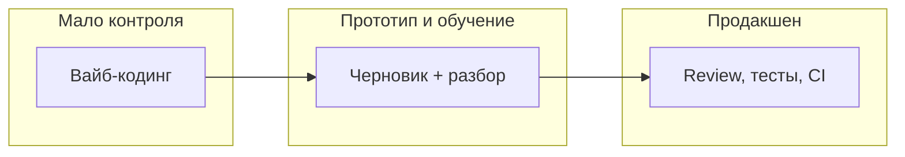
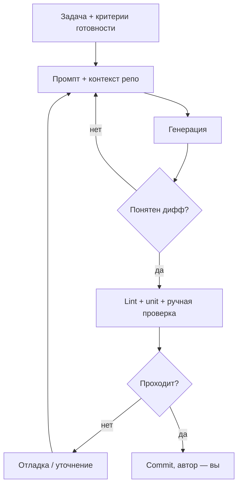

# Вайб-кодинг

  ОБЯЗАТЕЛЬНО
  ДЛЯ НОВИЧКОВ

Всем

**[Вайб-кодинг](/glossary/В#вайб-кодинг)** (англ. *vibe coding*, от *vibe* — "настроение, атмосфера") — способ программировать, при котором разработчик описывает задачу на естественном языке, получает код от большой языковой модели (LLM) или агента и вносит его в проект, опираясь на ощущение "вроде работает", без систематического разбора логики, границ и последствий. Термин закрепился в индустрии в начале 2025 года; подробнее о происхождении — ниже.

Вайб-кодинг пересекается с нормальной ИИ-помощью, но это не одно и то же. Осознанный цикл с промптом, review, тестами и ответственностью автора описан в [Генерации кода](/encyclopedia/6-ai/6-04-modeli-i-instrumenty/117). Смежный феномен однотипного "пустого" вывода — [нейрослоп](/glossary/Н#нейрослоп) ([статья](./2)).

---

## Откуда взялся термин

В феврале 2025 года термин популяризировал **Андрей Карпатый** — исследователь в области ИИ, сооснователь OpenAI, бывший директор по ИИ в Tesla. В [своём посте](https://x.com/karpathy/status/1891344405783838976) он описал режим, близкий к "разговору с ИИ": смотришь на результат, говоришь правки, копируешь фрагменты, запускаешь — и часто этого достаточно для прототипа. Карпатый подчёркивал, что для серьёзных систем всё равно нужны навыки отладки и понимание кода, когда модель "застревает".

СМИ и отраслевые обзоры ([Business Insider](https://www.businessinsider.com/silicon-valley-vibe-coding-2025), [TechCrunch](https://techcrunch.com/2025/03/08/a-quarter-of-startups-in-ycs-current-cohort-have-codebases-that-are-almost-entirely-ai-generated/) про долю ИИ-кода в Y Combinator, [Forbes](https://www.forbes.com/sites/josipamajic/2025/03/10/the-ai-revolution-thats-making-vcs-bet-big-on-human-intuition/)) быстро подхватили формулировку. В [русскоязычной Википедии](https://ru.wikipedia.org/wiki/%D0%92%D0%B0%D0%B9%D0%B1-%D0%BA%D0%BE%D0%B4%D0%B8%D0%BD%D0%B3) термин связывают с методом программирования через LLM; в [Neolurk](https://neolurk.org/wiki/%D0%92%D0%B8%D0%B1%D0%B5-%D0%BA%D0%BE%D0%B4%D0%B8%D0%BD%D0%B3) — с ироничным контекстом "код по наитию".

---

## Что такое "вайб" в IT-сленге

Слово **vibe** в английском — "атмосфера, ощущение". В сетевой культуре "поймать вайб" значит действовать интуитивно, без глубокого анализа. В разработке это проявляется так:

- промпт в два предложения вместо критериев готовности;
- зелёный запуск в IDE вместо тестов и чтения диффа;
- "модель сказала, что так правильно" вместо сверки с документацией;
- отказ разбирать чужой (сгенерированный) код до инцидента в проде.

Исторически близкий термин — **программирование методом копирования-вставки** ([Википедия](https://ru.wikipedia.org/wiki/%D0%9F%D1%80%D0%BE%D0%B3%D1%80%D0%B0%D0%BC%D0%BC%D0%B8%D1%80%D0%BE%D0%B2%D0%B0%D0%BD%D0%B8%D0%B5_%D0%BC%D0%B5%D1%82%D0%BE%D0%B4%D0%BE%D0%BC_%D0%BA%D0%BE%D0%BF%D0%B8%D1%80%D0%BE%D0%B2%D0%B0%D0%BD%D0%B8%D1%8F-%D0%B2%D1%81%D1%82%D0%B0%D0%B2%D0%BA%D0%B8)): код берут с форума или из ответа ИИ и вставляют, не понимая механизм. LLM ускорила этот паттерн до промышленных масштабов.

---

## Спектр — от прототипа до продакшена

Вайб-кодинг — не бинарная схема "плохо/хорошо", а позиция на шкале контроля.

| Режим | Типичная задача | Контроль | Риск |
|-------|-----------------|----------|------|
| **Вайб-кодинг** | "Сделай калькулятор за вечер" | Минимальный | Навык не растёт, баги копятся |
| **ИИ как черновик** | Объяснение API, набросок функции | Человек правит и учится | Умеренный |
| **ИИ в командном процессе** | Фича в репозитории с CI | Lint, тесты, code review | Зависит от дисциплины команды |
| **Агент с доступом к shell** | Миграция, массовый рефакторинг | Чеклист, sandbox, [опасные команды](/encyclopedia/8-infra-security/8-03-zabota-o-kode-i-dannyh/101) | Высокий при автопринятии |

Карпатый и критики вроде [Саймона Уиллисона](https://simonwillison.net/2025/Mar/19/vibe-coding/) сходятся: для прототипа и личных скриптов "вайб" допустим; для эволюции чужого продакшена критичны понимание кода, тесты и сопровождение ([Ars Technica](https://arstechnica.com/ai/2025/03/will-the-future-of-software-development-run-on-vibes/)).

---

## Инструменты, с которыми связывают вайб-кодинг

Любой генератор кода можно использовать осознанно или "по вайбу". Чаще всего речь о:

| Класс | Примеры | Типичный сценарий вайба |
|-------|---------|-------------------------|
| Чат с моделью | ChatGPT, Gemini, DeepSeek | Скопировать блок в проект без адаптации |
| IDE-ассистент | GitHub Copilot, JetBrains AI, Tabnine | Принять всё подряд из автодополнения |
| Агентная среда | Cursor Agent, [Claude Code](./4), Codex | "Сделай фичу" без ревью диффа |
| No-code + ИИ | Конструкторы с текстовым вводом | MVP без модели данных и безопасности |

Архитектура агентов — [Агенты ИИ](/encyclopedia/6-ai/6-04-modeli-i-instrumenty/116). Сравнение сервисов и промптов — [статья 117](/encyclopedia/6-ai/6-04-modeli-i-instrumenty/117).

  
Полезные обзоры на русском

  [Skillbox — что такое vibe coding](https://skillbox.ru/media/code/vibe-coding/) · [Яндекс Практикум](https://practicum.yandex.ru/blog/chto-takoe-vibe-coding/) · [Хабр — разбор термина и рисков](https://habr.com/ru/articles/943856/)

---

## Почему это соблазнительно

У вайб-кодинга есть **реальные** плюсы, из-за которых им увлекаются:

- **Скорость черновика** — форма, CRUD, boilerplate, тестовые заглушки.
- **Снижение порога входа** — новичок видит рабочий пример и может учиться по диффу.
- **Разгрузка рутины** — документация, регулярки, миграции схемы "под присмотром".
- **Демо для стейкхолдеров** — кликабельный прототип за часы ([NYT о "идее без кода"](https://www.nytimes.com/2025/02/27/technology/personaltech/vibecoding-ai-software-programming.html)).

Проблема начинается, когда тот же режим переносят на **долгоживущий** код без смены привычек.

---

## Риски для разработчика и продукта

### Навыки и карьера

Формируется слой специалистов, которые **не умеют** объяснить свой дифф на ревью, починить регрессию без нового промпта или оценить сложность задачи. Рынок всё ещё платит за ответственность за систему, а не за скорость копирования.

### Качество и сопровождение

ИИ предсказывает **вероятный** следующий [токен](/encyclopedia/6-ai/6-04-modeli-i-instrumenty/1#от-текста-к-числам--как-llm-видит-строку), а не бизнес-инварианты. Типичные артефакты вайб-кода:

- несуществующие методы и устаревшие версии библиотек;
- лишние зависимости и дублирование логики;
- отсутствие обработки ошибок и граничных случаев;
- уязвимости (SQL-инъекции, захардкоженные секреты, слабая авторизация).

Подробнее о "мусорном" однотипном выводе — [нейрослоп](./2). Проверки — [тестирование](/encyclopedia/7-project/7-05-testirovanie/intro), [безопасность кода](/encyclopedia/8-infra-security/8-03-zabota-o-kode-i-dannyh/intro).

### Ответственность и право

Автор коммита — **человек**. Лицензии обучающих данных, копилефт в сгенерированном фрагменте и утечка секретов в промпт — зона риска команды. Корпоративные политики — в [ответственном использовании ИИ](/encyclopedia/6-ai/6-06-primenenie-ii/3).

### Иллюзия скорости

"Сгенерировали за 30 секунд" часто оборачивается часами подгонки: неверный стек, конфликт со стилем репозитория, скрытые баги. Итоговое время сравнивают с написанием вручную с тестами, а не с первым ответом чата.

---

## Признаки вайб-кодинга

Отметьте честно для последнего изменения:

- [ ] Не могу пересказать алгоритм своими словами.
- [ ] Не запускал тесты / линтер после вставки кода.
- [ ] Не читал весь дифф, только "зелёная галочка".
- [ ] В прод ушло то, что "модель уверенно предложила".
- [ ] При ошибке первый шаг — новый промпт, а не отладчик.
- [ ] В репозитории появились файлы, назначение которых неясно.

Три и более пункта — сигнал сместиться к процессу из следующего раздела.

---

## Осознанная альтернатива — тот же ИИ, другой процесс

Практические шаги:

1. **Один модуль за раз** — не "перепиши весь проект".
2. **Эталон стиля** — 30–80 строк вашего кода в промпте ([117](/encyclopedia/6-ai/6-04-modeli-i-instrumenty/117), шаблоны — [1150](/lab/Примеры/1150)).
3. **Обязательный review** — свой или коллеги; для агентов — построчный дифф.
4. **Тест как спецификация** — особенно для бизнес-логики и API.
5. **Секреты вне чата** — [гигиена репозитория](/encyclopedia/8-infra-security/8-03-zabota-o-kode-i-dannyh/117).
6. **Учёба по сгенерированному** — "почему здесь `async`", "что делает эта SQL".

Для новичка ИИ уместен как **репетитор**: объяснение, разбор ошибки, подсказка следующего шага — при условии, что вы сами набираете и меняете код ([советы для новичка](/encyclopedia/1-basics/1-12-sovety-dlya-novichka/intro)).

---

## Вайб-кодинг и смежные термины

| Термин | Смысл | Связь |
|--------|--------|--------|
| **Copilot / pair programming с ИИ** | Ассистент в IDE | Нейтрально; итог зависит от дисциплины |
| **AI-first / AI-generated codebase** | Большая доля кода от модели | Организационный выбор; нужны процессы QA |
| **Нейрослоп** | Однотипный низкокачественный ИИ-вывод | Частый **результат** вайб-кодинга в контенте и коде |
| **Prompt engineering** | Умение формулировать задачу | [Библиотека шаблонов](/lab/Примеры/1150) против размытых вайб-запросов |
| **Human-in-the-loop** | Человек в контуре решения | Обязателен в проде |

В форумной и мемной культуре вайб-кодинг иногда подают как "ИИ сделает за вас" — см. [Neolurk — ИИ это демоны](https://neolurk.org/wiki/%D0%98%D0%98_%D1%8D%D1%82%D0%BE_%D0%B4%D0%B5%D0%BC%D0%BE%D0%BD%D1%8B) и [Вайб](https://neolurk.org/wiki/%D0%92%D0%B0%D0%B9%D0%B1). Для учебника важнее инженерная грань: кто отвечает за merge.

---

## Для кого какая рекомендация

| Аудитория | Рекомендация |
|-----------|--------------|
| **Школьник / студент** | Генерацию использовать для объяснений; задачи на экзамене решать самому |
| **Джун** | Черновик от ИИ + обязательный разбор; параллельно [основы языка](/encyclopedia/5-languages/languages) |
| **Мидл+** | ИИ ускоряет рутину; архитектуру и контракты проектируете вы |
| **Тимлид / архитектор** | Политика: что можно в промпт, обязательный CI, метрики качества |
| **Стартап на демо** | Вайб-прототип допустим; перед инвестором и prod — hardening |

---

## Итог

**Вайб-кодинг** — программирование через LLM и агентов с опорой на интуицию "сойдёт", без обязательного понимания и проверки. Термин описывает поведение, а не конкретный продукт. ИИ в разработке остаётся мощным ускорителем, если сохраняются критерии готовности, review, тесты и личная ответственность за коммит.

Дальше по теме: [практический AI-стек — Lovable, Supabase, Cursor, n8n, ChatGPT](./3) · [нейрослоп](./2) · [практика с ChatGPT, Gemini, DeepSeek](/encyclopedia/6-ai/6-04-modeli-i-instrumenty/117) · [нейросети для новичка](/encyclopedia/6-ai/6-03-neyroseti/111).

---

## Источники и чтение

- [Википедия — Вайб-кодинг](https://ru.wikipedia.org/wiki/%D0%92%D0%B0%D0%B9%D0%B1-%D0%BA%D0%BE%D0%B4%D0%B8%D0%BD%D0%B3)
- [Neolurk — Вайб-кодинг](https://neolurk.org/wiki/%D0%92%D0%B8%D0%B1%D0%B5-%D0%BA%D0%BE%D0%B4%D0%B8%D0%BD%D0%B3)
- [Википедия — Программирование методом копирования-вставки](https://ru.wikipedia.org/wiki/%D0%9F%D1%80%D0%BE%D0%B3%D1%80%D0%B0%D0%BC%D0%BC%D0%B8%D1%80%D0%BE%D0%B2%D0%B0%D0%BD%D0%B8%D0%B5_%D0%BC%D0%B5%D1%82%D0%BE%D0%B4%D0%BE%D0%BC_%D0%BA%D0%BE%D0%BF%D0%B8%D1%80%D0%BE%D0%B2%D0%B0%D0%BD%D0%B8%D1%8F-%D0%B2%D1%81%D1%82%D0%B0%D0%B2%D0%BA%D0%B8)
- [Википедия — Claude Code](https://ru.wikipedia.org/wiki/Claude_Code)

{/* sidebar-collections */}

---

## В подборках

Статья входит в [тематические подборки](/about/collections) и блок «С чего начать?» на [главной](/). Соседние шаги того же маршрута:

**ИИ для разработчика** — [Вайб-кодинг и нейроконтент — о разделе](/encyclopedia/6-ai/6-07-vayb-koding-i-neurokontent/intro), [AgentOps и MLOps — о разделе](/encyclopedia/6-ai/6-08-agentops/intro), [Разработка ИИ — о разделе](/encyclopedia/6-ai/6-05-razrabotka-ii/intro), [MLOps и LLM-стек — слои 1–3](/encyclopedia/6-ai/6-08-agentops/2), [Модели и инструменты — о разделе](/encyclopedia/6-ai/6-04-modeli-i-instrumenty/intro), [Трансформеры и NLP — о разделе](/encyclopedia/6-ai/6-09-transformery-i-nlp/intro).

{/* /sidebar-collections */}

---
