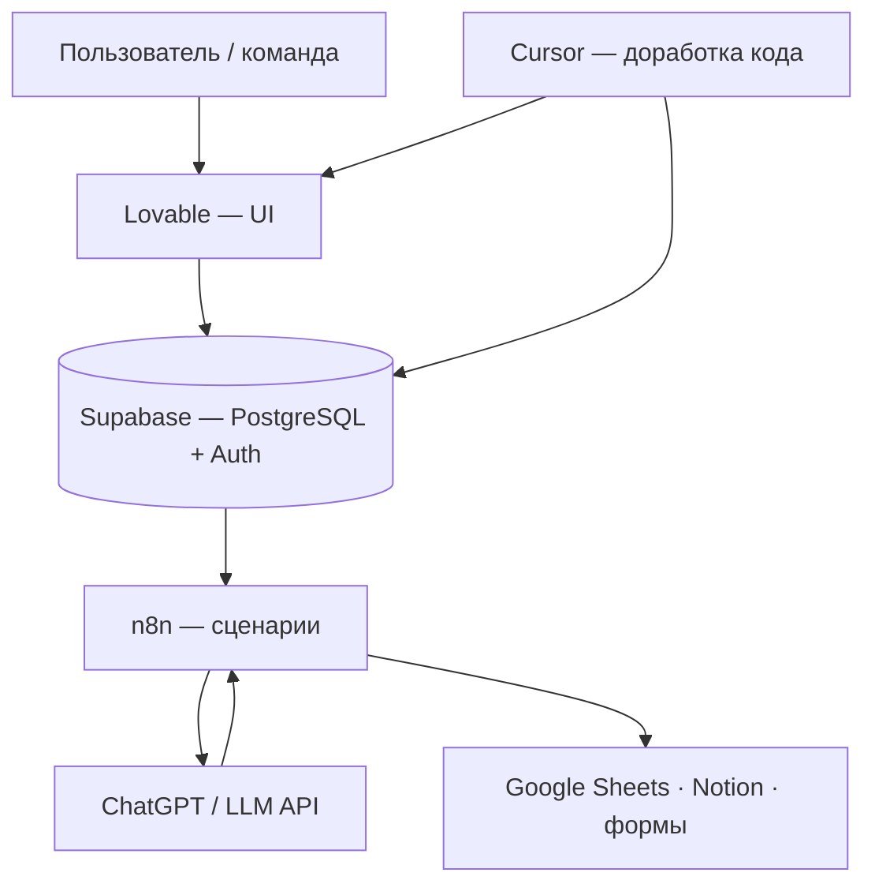
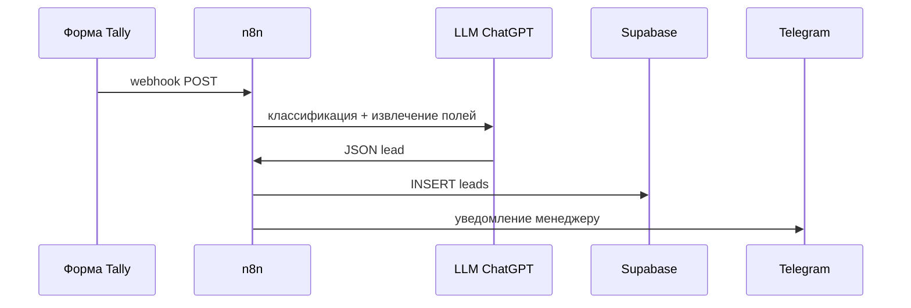
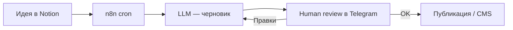

# Практический AI-стек — Lovable, Supabase, Cursor, n8n и ChatGPT

<div class="article-tags">
  <span class="tag tag-beginner">ДЛЯ НОВИЧКОВ</span>
</div>

<span class="complexity-badge">Разработчику</span>
<span class="complexity-badge">Аналитику</span>

[Вайб-кодинг](./1) описывает риск "кода по наитию". Эта статья — **практическая карта** — как собрать рабочий продукт или автоматизацию на популярном AI-стеке, сохранив критерии готовности, review и ответственность за merge. Общая теория no-code и AI-конструкторов — в [Цифровых инструментах без ручного кодинга](/encyclopedia/6-ai/6-05-razrabotka-ii/117); цикл промпт → проверка → merge — в [Генерации кода](/encyclopedia/6-ai/6-04-modeli-i-instrumenty/117).

---

## Карта стека — кто за что отвечает

Пять инструментов закрывают разные слои одного продукта. Их редко заменяют друг другом — чаще **связывают** в цепочку.

| Инструмент | Слой | Что делает | Типичная роль в проекте |
|------------|------|------------|-------------------------|
| **ChatGPT** | Модель + прототип | Чат, Custom GPT, Assistants API, черновики промптов и кода | Формулировка гипотез, классификация текста, RAG-бот для команды |
| **Lovable** | UI + фронтенд | Генерация React-приложения из текста, итерации в чате, деплой | Лендинг, дашборд, mini-CRM с формами за часы |
| **Supabase** | Данные + auth | PostgreSQL, REST/Realtime API, аутентификация, storage, Edge Functions | Единое хранилище для приложения и автоматизаций |
| **Cursor** | IDE-агент | Редактирование репозитория, Agent, MCP, рефакторинг | Доработка экспорта из Lovable, бэкенд-логика, тесты |
| **n8n** | Оркестрация | Визуальный граф триггеров, HTTP, LLM-узлы, cron | Связка форм, таблиц, Notion и Telegram без отдельного бэкенда |



<div class="callout callout--tip">
  <div class="callout-title">С чего начать</div>

  <div class="callout-body">
  Сначала зафиксируйте **одну рабочую гипотезу** ("менеджер видит заявки из формы в одной таблице"), затем выберите минимальный набор инструментов под неё. Полный стек из пяти сервисов нужен только когда гипотеза подтверждена и масштаб растёт.
  </div>
</div>

---

## Настройка среды — порядок действий

### 1. Supabase — фундамент данных

1. Создайте проект на [supabase.com](https://supabase.com) (или разверните [self-hosted](https://supabase.com/docs/guides/self-hosting)).
2. Спроектируйте **схему таблиц** до генерации UI — сущности, связи, RLS-политики (кто какие строки видит).
3. Сохраните `SUPABASE_URL` и `SUPABASE_ANON_KEY` в `.env`; service role key — только на сервере и в n8n, никогда во фронтенде.
4. Включите Row Level Security для таблиц с пользовательскими данными.

Подробнее про managed PostgreSQL — [управление СУБД](/encyclopedia/3-data-markup/3-08-upravlenie-rsubd/3).

### 2. Lovable — интерфейс и первый деплой

1. Опишите экраны и роли ("таблица лидов, фильтр по статусу, кнопка экспорта").
2. Подключите Supabase как backend — Lovable генерирует клиентские вызовы к таблицам.
3. После каждой итерации проверяйте **согласованность схемы БД**, а не только внешний вид.
4. Экспортируйте проект в **Git** — точка перехода к Cursor.

### 3. Cursor — инженерная доработка

1. Клонируйте репозиторий, откройте в Cursor.
2. Задайте Agent **узкий scope** — один модуль, один PR ([риски вайба](./1)).
3. Добавьте lint, тесты, типизацию там, где генератор "схлопнул" логику.
4. Секреты — через `.env` и [гигиену репозитория](/encyclopedia/8-infra-security/8-03-zabota-o-kode-i-dannyh/117), не в промпт.

### 4. n8n — автоматизации между системами

1. Облако [n8n.io](https://n8n.io) или self-hosted ([Docker](/encyclopedia/1-basics/1-13-soft-prodvinutogo-polzovatelya/3)).
2. Подключите credentials — Supabase (HTTP или Postgres), OpenAI, Google Sheets, Notion.
3. Каждый workflow — **один бизнес-сценарий** с понятным именем и логом ошибок.
4. Webhook-URL n8n — endpoint для форм и Lovable serverless.

Обзор iPaaS — [интеграционное взаимодействие](/encyclopedia/2-system-network/2-09-osnovy-integratsionnogo-vzaimodeystviya/112) и [low-code](/encyclopedia/8-infra-security/8-02-low-code-no-code/1).

### 5. ChatGPT — модель и быстрые GPT-приложения

1. **Custom GPT** (в интерфейсе ChatGPT) — инструкции, файлы знаний, Actions к вашему API; без кода, для команды и пилотов.
2. **Assistants API** — программный доступ, threads, tools; когда нужен embed в свой продукт. Минимальный каркас `chat.completions` — [OpenAI / API — готовые промпты и вызовы](/lab/Примеры/1149).
3. **Промпт-библиотека** — версионируйте system prompt в Git рядом с n8n-workflow, а не только в UI OpenAI. Шаблоны формулировок — [Prompt engineering — библиотека](/lab/Примеры/1150).

Параметры temperature, top_p и stop — [напоминалка 118](/encyclopedia/6-ai/6-04-modeli-i-instrumenty/118).

---

## GPT-приложения, автоматизации и агенты через визуальные интерфейсы

"Визуально" здесь значит: вы **собираете поведение** из блоков и инструкций, а исполняемый код генерирует платформа.

| Подход | Интерфейс | Когда уместен | Ограничение |
|--------|-----------|---------------|-------------|
| **Custom GPT** | Конструктор OpenAI | FAQ, онбординг, черновики документов | Нет тонкой интеграции с вашей БД без Actions |
| **GPT Actions** | OpenAPI-схема + GPT | Чтение/запись в Supabase через REST | Нужен безопасный API и auth |
| **n8n + LLM-узел** | Граф узлов | Классификация заявок, суммаризация, маршрутизация | Сложные ветки — документируйте схему |
| **Lovable + Edge Function** | Чат + код на Supabase | Логика на стороне БД, webhook | Требует review в Cursor |
| **Cursor Agent** | IDE | Рефакторинг, миграции, генерация тестов | Нужен Git и human-in-the-loop |

Цикл [агента ИИ](/encyclopedia/6-ai/6-04-modeli-i-instrumenty/116) — "задача → tool → наблюдение → следующий шаг". В n8n tool — это HTTP-запрос, узел Postgres или Code; в Custom GPT — Action; в Cursor — terminal, MCP, правка файлов.

**Пример сценария "заявка с формы"**



<div class="callout callout--warning">
  <div class="callout-title">Side effects у агентов</div>

  <div class="callout-body">
  Узел, который пишет в БД или шлёт письмо, — **необратимое действие**. В n8n включайте error workflow, лимит retries и тестовую ветку на копии таблицы. Подробнее про эксплуатацию агентов — [AgentOps](/encyclopedia/6-ai/6-08-agentops/intro).
  </div>
</div>

---

## Микросервисы и MVP — четыре типовых паттерна

Под "микросервисом" в vibe-стеке обычно имеют **отдельный сервис с одной зоной ответственности**, а не Kubernetes-кластер. Для MVP достаточно Supabase + один фронт + n8n.

### Mini-CRM

**Задача** — лиды, статусы, история касаний, один дашборд для продаж.

| Компонент | Реализация |
|-----------|------------|
| Данные | Таблицы `leads`, `contacts`, `activities` в Supabase |
| UI | Lovable — kanban или таблица с фильтрами |
| Ввод | Форма на сайте → webhook n8n → INSERT |
| Обогащение | LLM-узел — категория, приоритет, краткое резюме письма |

**Критерий готовности** — менеджер меняет статус без SQL; RLS не даёт видеть чужие сделки.

### Task-борд

**Задача** — задачи команды, дедлайны, assignee, комментарии.

| Компонент | Реализация |
|-----------|------------|
| Данные | `tasks`, `projects`, `comments`; Realtime для обновлений |
| UI | Lovable или экспорт + доработка в Cursor |
| Автоматизация | n8n — напоминание в Slack/Telegram за день до дедлайна |
| Синхронизация | Двусторонний sync с Notion (см. ниже) при гибридной команде |

### Контент-пайплайн

**Задача** — от идеи до опубликованного поста или статьи с согласованием.



Таблица `content_queue` в Supabase хранит статус (`draft`, `review`, `published`). LLM генерирует **черновик**; финальный текст утверждает человек — иначе получится [нейрослоп](./2).

### Research-бот

**Задача** — собрать ответ по теме из нескольких источников, выдать структурированный отчёт.

| Компонент | Реализация |
|-----------|------------|
| Поиск | API (Serper, Tavily) или RSS через n8n |
| Сynthesis | ChatGPT с жёстким JSON-schema в промпте |
| Память | Supabase `research_runs` + pgvector для прошлых отчётов ([RAG](/encyclopedia/6-ai/6-04-modeli-i-instrumenty/121)) |
| UI | Простая форма "тема + глубина" на Lovable |

**Критерий готовности** — каждый факт ссылается на источник; галлюцинации отсекаются пост-валидацией URL.

---

## Интеграция внешних источников в единую систему

Разрозненные таблицы в Google Sheets, базы Notion и ответы форм сводят к **Supabase как system of record**, а n8n — к шине синхронизации.

### Google Таблицы

| Направление | n8n-узлы | Замечание |
|-------------|----------|-----------|
| Sheets → Supabase | Google Sheets Trigger / Read → Postgres Insert | Задайте ключ дедупликации (`email`, `external_id`) |
| Supabase → Sheets | Postgres Select → Google Sheets Update | Для отчётов бухгалтерии и "живых" сводок |
| Двусторонний sync | Merge по timestamp + conflict rule | Правило "побеждает более новая `updated_at`" |

OAuth Google — через credentials n8n; service account — для серверных сценариев без UI.

### Notion

- **Notion Trigger** — новая страница в базе → запись в Supabase.
- **Notion Update** — обратная запись статуса после LLM-обработки.
- Маппинг property → column фиксируйте в таблице `sync_map`, а не "в голове".

Notion удобен для людей; Supabase — для приложения, RLS и API. Дублирование без правил sync быстро расходится.

### Формы (Tally, Google Forms, Typeform)

1. Форма шлёт **webhook** в n8n (или в Supabase Edge Function).
2. n8n валидирует поля (regex email, обязательные ключи).
3. LLM-узел опционален — только если нужна классификация или нормализация текста.
4. INSERT в Supabase + уведомление.

<div class="callout callout--info">
  <div class="callout-title">Единая модель данных</div>

  <div class="callout-body">
  Перед подключением третьего источника нарисуйте **одну ER-диаграмму** — `lead`, `source`, `raw_payload`. Сырые JSON из форм храните в `jsonb`-колонке для аудита; в рабочие поля попадает только нормализованное.
  </div>
</div>

---

## Гипотезы, промпт-инжиниринг и автоматизация бизнес-процессов

### Проектирование гипотез

Продуктовая гипотеза в AI-стеке формулируется измеримо:

| Элемент | Пример |
|---------|--------|
| **Пользователь** | Менеджер по продажам в команде из 5 человек |
| **Боль** | Заявки теряются между почтой и таблицей |
| **Решение** | Одна воронка в Supabase + уведомление за 5 минут |
| **Метрика успеха** | 100% заявок в системе за 2 недели пилота |
| **Бюджет времени** | 3 вечера на MVP |

Если метрику нельзя измерить — сначала добавьте логирование в n8n и отчёт в Supabase, потом наращивайте LLM.

### Промпт-инжиниринг для процессов

Промпт для автоматизации — **спецификация**, а не "магическая фраза". Минимальный каркас:

```text
Роль: классификатор заявок B2B-сервиса.
Вход: JSON с полями name, email, message.
Выход: только JSON {"category": "...", "priority": 1-3, "summary": "..."}.
Категории: pricing, support, partnership, spam.
Правила:
- priority 3 — упоминание срочности или крупного бюджета;
- spam — пустой message или типовой SEO-спам;
- если данных мало — category "support", priority 2.
Запрещено: выдумывать факты не из message.
```

Версионируйте такие блоки в репозитории; в n8n храните ссылку на файл или используйте узел **Set** с константой и датой ревизии.

Системные приёмы:

- **Few-shot** — 2–3 эталонных входа/выхода в промпте для стабильного JSON.
- **Structured output** — response format JSON / JSON Schema в API OpenAI.
- **Низкая temperature** (0–0.3) для классификации; выше — для черновиков текста ([Параметры генерации LLM — напоминалка](/encyclopedia/6-ai/6-04-modeli-i-instrumenty/118)).
- **Eval на golden set** — 20–50 реальных заявок с эталонной разметкой; прогоняйте после смены промпта.

### Автоматизация бизнес-процесса — чеклист

1. **As-is** — опишите текущие шаги на бумаге (кто, что, сколько минут).
2. **To-be** — один автоматизированный путь без "и тут Вася решает".
3. **Исключения** — что делать при ошибке API, дубликате, пустом поле (fallback в очередь `manual_review`).
4. **HITL** — где обязателен человек (оплата, юридический текст, финальный пост).
5. **Мониторинг** — алерт в Telegram, если workflow упал 2 раза подряд.

Корпоративный контекст внедрения — [Применение ИИ в бизнесе](/encyclopedia/6-ai/6-06-primenenie-ii/1); монетизация MVP — [статья 5](/encyclopedia/6-ai/6-06-primenenie-ii/5).

---

## Сборка end-to-end — пример "мини-продукт за неделю"

| День | Действие |
|------|----------|
| 1 | Гипотеза + схема Supabase + RLS |
| 2 | Lovable — UI списка и карточки; форма Tally → n8n |
| 3 | n8n — LLM-классификация, INSERT, Telegram |
| 4 | Cursor — тесты, правка типов, `.env.example` |
| 5 | Google Sheets sync для отчёта руководителю |
| 6–7 | Custom GPT для FAQ команды + документация runbook |

Runbook — короткий markdown в репо — credentials, URL webhook, как перезапустить workflow, кому писать при падении.

---

## Контроль качества — тот же стек, другие привычки

| Риск вайба | Контрмера в этом стеке |
|------------|-------------------------|
| Красивый UI, битая БД | Схема Supabase до пикселей в Lovable |
| Слепой merge от Agent | PR только с просмотренным диффом в Cursor |
| Нестабильный LLM в prod | Golden set, temperature 0, structured output |
| Секреты в промпте | Vault / `.env`, [Опасные скрипты](/encyclopedia/8-infra-security/8-03-zabota-o-kode-i-dannyh/101) |
| "Слоп" в контент-пайплайне | Human review перед публикацией ([нейрослоп](./2)) |
| Нет воспроизводимости | Git для кода, экспорт JSON workflow n8n |

<div class="callout callout--tip">
  <div class="callout-title">Маршрут чтения</div>

  <div class="callout-body">
  Термин и риски — [Вайб-кодинг](./1). Промпты и review кода — [Генерация кода — ChatGPT, Gemini и DeepSeek](/encyclopedia/6-ai/6-04-modeli-i-instrumenty/117). No-code границы — [6.05 / 117](/encyclopedia/6-ai/6-05-razrabotka-ii/117). Эксплуатация агентов — [AgentOps](/encyclopedia/6-ai/6-08-agentops/intro).
  </div>
</div>

---

## Итог

**Lovable** ускоряет интерфейс, **Supabase** — данные и auth, **Cursor** — инженерную доработку, **n8n** — визуальные автоматизации, **ChatGPT** — рассуждение и классификацию. Вместе они закрывают mini-CRM, task-борды, контент-пайплайны и research-ботов с интеграцией Google Sheets, Notion и форм. Устойчивый результат даёт связка **гипотеза → схема данных → промпт как спецификация → human-in-the-loop**, а не бесконечные итерации "сделай красивее" без метрик.

---

## См. также

- [Claude Code — установка, контекст и практический проект](./4)
- [n8n в софте продвинутого пользователя](/encyclopedia/1-basics/1-13-soft-prodvinutogo-polzovatelya/6)
- [RAG, MCP и агенты](/encyclopedia/6-ai/6-04-modeli-i-instrumenty/121)
- [Микросервисы — о разделе](/encyclopedia/8-infra-security/8-05-mikroservisy-i-integratsiya/intro)

---
