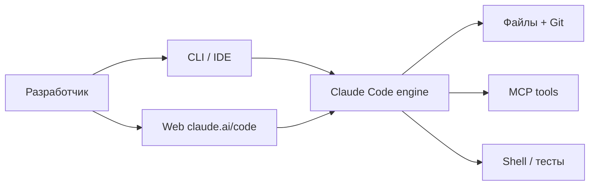
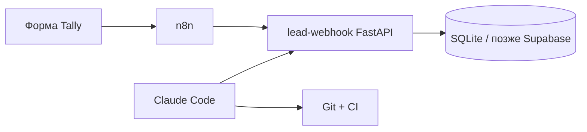

import ExternalCodeEmbed from '@site/src/components/ExternalCodeEmbed';


# Claude Code — установка, контекст и практический проект

<div class="article-tags">
  <span class="tag tag-required">ОБЯЗАТЕЛЬНО</span>
  <span class="tag tag-beginner">ДЛЯ НОВИЧКОВ</span>
</div>

<span class="complexity-badge">Разработчику</span>

**Claude Code** — агентный инструмент Anthropic для разработки: читает репозиторий, правит файлы, запускает shell и Git, подключает внешние системы через [MCP](/encyclopedia/6-ai/6-04-modeli-i-instrumenty/114). Доступен в **терминале**, **VS Code / Cursor**, **Desktop**, **JetBrains** и **браузере** ([claude.ai/code](https://claude.ai/code)). Ниже — установка (macOS/Windows), терминал и Git, сессии, plan mode, MCP, безопасность и практикум lead-webhook. Сравнение с Cursor — [4.14 / 1113](/encyclopedia/4-code-dev/4-14-razrabotka-i-otladka/1113); формулировки задач для агента — [библиотека промптов](/lab/Примеры/1150); риски слепого merge — [вайб-кодинг](./1).

Официальная документация — [code.claude.com/docs](https://code.claude.com/docs/en/overview).

---

## Где запускать — CLI, IDE, Desktop и веб

| Поверхность | Когда уместна | Особенности |
|-------------|---------------|-------------|
| **CLI** (`claude`) | Полный контроль, скрипты, CI, Ralph-loop | Shift+Tab — смена permission mode; pipe и `-p` для one-shot |
| **VS Code / Cursor** | Inline diff, @-mentions, plan review | Расширение из Marketplace; тот же движок, что в CLI |
| **Desktop** | Параллельные сессии, визуальный diff, расписание | Изолированные git worktree, side chat |
| **Web** (claude.ai/code) | Репозиторий без локального clone, длинные задачи | `--teleport` / `--remote` — перенос сессии в терминал |
| **JetBrains** | IntelliJ, PyCharm, WebStorm | Плагин + терминал с теми же командами |

`CLAUDE.md`, skills, hooks и MCP работают **на всех поверхностях** — конфигурация единая.



---

## Установка и первый запуск

### Системные требования

- macOS 13+, Linux (Debian/Fedora/Alpine через пакетные менеджеры), Windows 10 1809+ или WSL
- Подписка Claude или аккаунт Anthropic Console (часть возможностей — только Anthropic API)
- На Windows для Bash-tool рекомендуется **Git for Windows**; иначе shell идёт через PowerShell

### Установка (рекомендуемый native installer)

**macOS, Linux, WSL:**

```bash
curl -fsSL https://claude.ai/install.sh | bash
```

**Windows PowerShell:**

```powershell
irm https://claude.ai/install.ps1 | iex
```

**Альтернативы**

| Способ | Команда | Автообновление |
|--------|---------|----------------|
| Homebrew | `brew install --cask claude-code` | Вручную: `brew upgrade claude-code` |
| WinGet | `winget install Anthropic.ClaudeCode` | Вручную: `winget upgrade Anthropic.ClaudeCode` |
| npm | `npm install -g @anthropic-ai/claude-code` | Зависит от политики npm |
| apt (Debian/Ubuntu) | см. [setup](https://code.claude.com/docs/en/setup) | `apt upgrade claude-code` |

### Проверка и вход

```bash
claude --version
claude doctor
cd your-project
claude
```

При первом запуске — OAuth-авторизация в браузере. Для API-биллинга вместо подписки — `claude auth login --console`. Статус входа — `claude auth status`. Секреты API храните в env, не в репозитории ([гигиена](/encyclopedia/8-infra-security/8-03-zabota-o-kode-i-dannyh/117)).

### macOS — типичная настройка

| Шаг | Действие |
|-----|----------|
| 1 | Native installer — автообновление в фоне |
| 2 | `claude doctor` — проверка PATH и версии |
| 3 | Терминал iTerm2/Terminal.app — Shift+Enter для новой строки ([terminal config](https://code.claude.com/docs/en/terminal-config)) |
| 4 | Desktop-приложение — опционально для параллельных сессий и визуального diff |

На Apple Silicon и Intel Desktop-бинарники разные; CLI одинаков для обеих архитектур.

### Windows — типичная настройка

| Шаг | Действие |
|-----|----------|
| 1 | PowerShell **от имени пользователя** (не обязательно admin): `irm https://claude.ai/install.ps1 \| iex` |
| 2 | Закрыть и открыть PowerShell — иначе `claude` не в PATH |
| 3 | Установить **Git for Windows** — Bash-tool для shell-команд агента |
| 4 | При ошибке PATH — перезапуск терминала или добавление каталога установки в переменные среды ([troubleshoot](https://code.claude.com/docs/en/troubleshoot-install)) |

**WSL2** — предпочтительный вариант, если стек проекта Linux-only (Docker, make, bash-скрипты). Native Windows удобен для PowerShell-проектов и .NET.

**CMD vs PowerShell:** установщик для CMD — отдельная команда из [setup](https://code.claude.com/docs/en/setup); промпт `PS C:\` означает PowerShell.

### Каталог `.claude/` в проекте

После настройки в репозитории появляется конфигурация агента:

| Файл / папка | Назначение |
|--------------|------------|
| `CLAUDE.md` | Правила проекта (может быть в корне без `.claude/`) |
| `.claude/settings.json` | Permission mode, allow/deny — **коммитят** |
| `.claude/settings.local.json` | Личные allow для Bash — **в .gitignore** |
| `.claude/skills/` | Команды `/skill-name` |
| `.claude/agents/` | Custom subagents |
| `.mcp.json` | MCP-серверы проекта |

Глобально — `~/.claude/settings.json`, `~/.claude.json` (MCP), транскрипты в `~/.claude/projects/`.

<div class="callout callout--info">
  <div class="callout-title">Диагностика конфигурации</div>

  <div class="callout-body">
  `/doctor` — версия и окружение; `/context` — что заняло контекст; `/hooks` и `/mcp` — что реально загрузилось ([debug config](https://code.claude.com/docs/en/debug-your-config)).
  </div>
</div>

### Базовые команды CLI

| Команда | Назначение | Пример |
|---------|------------|--------|
| `claude` | Интерактивная сессия | `claude` |
| `claude "задача"` | Одноразовая задача в сессии | `claude "исправь падающий тест auth"` |
| `claude -p "запрос"` | Print mode — ответ и выход | `git diff \| claude -p "краткий review"` |
| `claude -c` | Продолжить последний диалог в каталоге | `claude -c` |
| `claude -r` | Выбрать сессию из истории | `claude -r` |
| `claude --permission-mode plan` | Старт в plan mode | см. ниже |
| `/help` | Список slash-команд | внутри сессии |
| `/clear` | Очистить контекст диалога | |
| `/compact` | Сжать историю | |
| `/cost` | Токены и стоимость | |
| `/init` | Сгенерировать `CLAUDE.md` | |
| `/review` | Code review изменений | |
| `/mcp`, `/hooks` | Диагностика MCP и hooks | |
| `exit` или Ctrl+D | Выход | |

<div class="callout callout--tip">
  <div class="callout-title">Windows в этой энциклопедии</div>

  <div class="callout-body">
  Команды выше ориентированы на bash. В PowerShell эквивалент pipe — `Get-Content app.log -Tail 200 | claude -p "..."`. Для привычного bash-окружения на Windows удобен WSL или Git Bash. Отдельные Unix-команды (`grep`, `ls`) без bash — <a href="/encyclopedia/2-system-network/2-05-terminal/104#tot-zhe-grep-na-windows">Microsoft Coreutils</a> (Preview).
  </div>
</div>

---

## Терминал, Git и Cursor

### Интерактивный терминал

Claude Code в CLI — полноценная TUI-сессия — агент читает stdout/stderr команд, показывает diff перед apply, запрашивает разрешения.

| Приём | Назначение |
|-------|------------|
| **Shift+Tab** | Цикл permission modes |
| **Shift+Enter** | Новая строка в промпте (настраивается в [terminal-config](https://code.claude.com/docs/en/terminal-config)) |
| **Ctrl+G** | Открыть план или большой текст в `$EDITOR` |
| **Esc** | Прервать генерацию |
| `@файл` | Явно добавить файл в контекст |
| `claude --ide` | Подключиться к открытому VS Code/Cursor |

One-shot из скриптов и CI — `claude -p "..."` (без интерактива). Обновление бинарника — `claude update`.

### Git в повседневной работе

Claude Code работает с Git **напрямую** — branch, commit, diff, иногда PR.

| Задача | Пример промпта / команды |
|--------|--------------------------|
| Коммит | `claude "закоммить изменения — conventional commits"` |
| Новая ветка | `claude "ветка fix/auth-422 от main, только правки auth"` |
| Review перед push | `/review` или `git diff main \| claude -p "security review"` |
| Продолжить работу над PR | `claude --from-pr 123` |
| Параллельные фичи | `claude --worktree` — изолированная копия ([worktrees](https://code.claude.com/docs/en/worktrees)) |

Агент видит `git status`, `git log`, `git diff` — полезно указать в `CLAUDE.md` политику веток (`main` только через PR).

### Cursor и Claude Code вместе

Расширение **Claude Code** ставится в Cursor из Marketplace (то же, что в VS Code). Типичное разделение:

| Задача | Инструмент |
|--------|------------|
| Tab-дополнение, точечный edit | Cursor |
| Мультифайловый рефакторинг, shell, тесты | Claude Code в терминале Cursor |
| Plan + diff в IDE | Claude Code panel в Cursor |
| CI и headless review | `claude -p` в GitHub Actions |

**Синхронизация правил:** один источник истины — `ARCHITECTURE.md` или `AGENTS.md`; в `CLAUDE.md` и `.cursorrules` — ссылки на него ([Использование AI-ассистентов в разработке](/encyclopedia/4-code-dev/4-14-razrabotka-i-otladka/1113)). **Git** — общий синхронизатор: Claude Code коммитит, Cursor открывает тот же diff.

```mermaid
flowchart LR
  P[Plan в Claude Code plan mode] --> I[Implement acceptEdits]
  I --> T[make test в терминале]
  T --> C[Cursor — мелкие правки Tab]
  C --> R[/review в Claude Code]
  R --> G[git commit + push]
```

---

## Контекстная инженерия — как говорить с агентом

**Контекстная инженерия** — осознанная сборка того, что попадает в окно модели — файлы, правила, diff, результаты tools. Качество ответа определяется контекстом сильнее, чем "красотой" формулировки ([Генерация кода — ChatGPT, Gemini и DeepSeek](/encyclopedia/6-ai/6-04-modeli-i-instrumenty/117)).

### Слои контекста в Claude Code

| Слой | Источник | Когда загружается |
|------|----------|-------------------|
| Системные правила | Платформа Anthropic | Каждый запрос |
| **CLAUDE.md** | Корень проекта, вложенные каталоги | Старт сессии |
| **Auto memory** | `~/.claude/projects/...` | Между сессиями одного проекта |
| Skills | `.claude/skills/` | По триггеру или `/skill-name` |
| Диалог + tool results | Текущая сессия | Накапливается до compact |
| @-mentions / Read | Явно указанные файлы | По запросу |

### CLAUDE.md — контракт с агентом

Файл в корне (или `docs/CLAUDE.md` со ссылкой) — аналог `.cursorrules`. Минимальный каркас:

```markdown
## Проект lead-webhook

FastAPI-сервис: POST /leads, валидация, запись в SQLite.

### Команды
- `make test` — pytest
- `make lint` — ruff check .
- `make run` — uvicorn app.main:app --reload

### Соглашения
- Pydantic v2 для DTO
- Все эндпоинты покрыты тестами в tests/
- Секреты только из env WEBHOOK_SECRET

### Запрещено
- DROP/DELETE без явного запроса пользователя
- Новые зависимости без согласования
```

Команда `/init` генерирует черновик по структуре репозитория — его **редактируют**, а не принимают вслепую.

### Принципы эффективного промпта

1. **Критерий готовности** — "тесты зелёные", "OpenAPI совпадает со spec.md", а не "сделай API".
2. **Границы** — один модуль, одна ветка, список файлов "не трогать".
3. **Эталон** — 30–80 строк вашего стиля из соседнего файла.
4. **Верификация** — "после правок запусти `make test` и покажи вывод".
5. **Явные unknowns** — "если API пакета не уверен — напиши, что проверить в доке".

Параметры генерации (temperature, structured output) — [Параметры генерации LLM — напоминалка](/encyclopedia/6-ai/6-04-modeli-i-instrumenty/118). Готовые шаблоны с построчным разбором — [Prompt engineering — библиотека](/lab/Примеры/1150).

### Экономия контекста

- `/compact` — когда история раздулась после длинного исследования.
- **Субагент Explore** — поиск по кодовой базе без засорения главного чата.
- Skills — длинные инструкции подгружаются **только при вызове**, а не на каждый turn.
- Вложенные `CLAUDE.md` в монорепо — правила ближе к пакету ([large codebases](https://code.claude.com/docs/en/large-codebases)).

---

## Сессии и slash-команды

### Управление сессиями

Сессия — сохранённый диалог, привязанный к каталогу проекта. Транскрипт пишется в `~/.claude/projects/.../*.jsonl`.

| Команда | Назначение |
|---------|------------|
| `claude -c` / `--continue` | Продолжить последнюю сессию в каталоге |
| `claude -r` / `--resume` | Picker всех сессий |
| `claude -r "auth-refactor"` | Resume по имени |
| `claude -n auth-refactor` | Имя сессии при старте |
| `/rename auth-refactor` | Переименовать текущую |
| `/branch try-v2` | Ответвить диалог, не теряя оригинал |
| `claude --continue --fork-session` | Fork из CLI |
| `claude --from-pr 42` | Сессия, создавшая PR |
| `/clear` | Пустой контекст; старый диалог сохранён |
| `/export` | Экспорт в файл или буфер |

В picker — поиск `/`, фильтр по ветке `Ctrl+B`, все проекты `Ctrl+A` ([sessions](https://code.claude.com/docs/en/sessions)).

### Slash-команды — справочник

| Команда | Назначение |
|---------|------------|
| `/help` | Все команды и skills |
| `/init` | Черновик `CLAUDE.md` |
| `/review` | Review текущих изменений |
| `/plan` | Plan mode на один промпт |
| `/compact [фокус]` | Сжать историю с акцентом |
| `/context` | Диаграмма заполнения контекста |
| `/cost` | Токены и стоимость сессии |
| `/memory` | Auto memory проекта |
| `/add-dir ../lib` | Доп. каталог для чтения |
| `/agents` | Subagents — создать и редактировать |
| `/mcp` | Статус MCP-серверов |
| `/hooks` | Список hooks |
| `/plugin` | Плагины и marketplaces |
| `/permissions` | Allow/deny и недавние отказы |
| `/model` | Смена модели в сессии |
| `/loop` | Polling / повтор промпта в сессии |
| `/goal` | Условие завершения задачи |
| `/desktop` | Перенос сессии в Desktop app |
| `/doctor` | Диагностика окружения |

Bundled skills ведут себя как slash-команды — `/code-review`, `/debug`, `/batch`.

---

## Продвинутые возможности

### Субагенты (subagents)

Специализированные агенты с **отдельным контекстом** и ограниченными tools. Claude делегирует задачу, когда описание subagent совпадает с запросом.

| Встроенный | Модель | Назначение |
|------------|--------|------------|
| **Explore** | Haiku | Read-only поиск по репо |
| **Plan** | как у родителя | Исследование в plan mode |
| **general-purpose** | как у родителя | Многошаговые задачи с правками |

Создание своего — markdown с YAML frontmatter в `.claude/agents/` или `~/.claude/agents/`:

```yaml
---
name: security-reviewer
description: Сканирует diff на SQLi, утечки секретов, слабую auth. Use when reviewing PR or before merge.
tools: Read, Grep, Glob, Bash
model: sonnet
---

Ты security-реviewer. Читай только diff и связанные файлы.
Вывод: таблица finding | severity | файл | рекомендация.
Не правь код — только отчёт.
```

Управление — slash-команда `/agents`. Параллельные независимые сессии — **agent view** (`claude agents`) и **agent teams** ([документация](https://code.claude.com/docs/en/agents)).

### Планирование задач

| Механизм | Когда использовать |
|----------|-------------------|
| **Plan subagent** | Read-only обход репо в plan mode |
| **`/goal`** | Явное условие выхода ("пока `make test` красный — продолжай") |
| **Ultraplan** | План в облаке, review в браузере, execute в CLI ([ultraplan](https://code.claude.com/docs/en/ultraplan)) |
| **Todo-лист в сессии** | Многошаговые задачи с видимым прогрессом |

```text
Разбей задачу на шаги с критерием готовности каждого.
Шаг N — done только после зелёного make test. Сначала план без правок.
```

### Skills (навыки агентов)

Папка `.claude/skills/<name>/SKILL.md` — переиспользуемая процедура с командой `/name`.

```yaml
---
description: Деплой staging по чеклисту команды. Use when user says deploy staging.
---

## Шаги
1. `git fetch && git status`
2. `make test && make lint`
3. Только при успехе — `make deploy-staging`
4. При ошибке — остановись и покажи лог
```

Bundled skills — `/code-review`, `/debug`, `/loop`. Custom commands из `.claude/commands/` работают так же, как skills.

### MCP — внешние tools

MCP подключает БД, GitHub, Linear, браузер и custom API как tools агента.

**Уровни конфигурации**

| Уровень | Файл | Область |
|---------|------|---------|
| Пользователь | `~/.claude.json` → `mcpServers` | Все проекты |
| Проект | `.mcp.json` в корне | Только этот репо |
| CLI | `claude --mcp-config ./mcp.json` | Одна сессия |

Пример `.mcp.json`:

```json
{
  "mcpServers": {
    "postgres": {
      "command": "npx",
      "args": ["-y", "@modelcontextprotocol/server-postgres", "postgresql://localhost/leads"]
    },
    "github": {
      "command": "npx",
      "args": ["-y", "@modelcontextprotocol/server-github"],
      "env": { "GITHUB_TOKEN": "${GITHUB_TOKEN}" }
    }
  }
}
```

Управление в сессии — `/mcp` (статус, переподключение). Токены — только через env, не в коммите. Архитектура протокола — [MCP-серверы](/encyclopedia/6-ai/6-04-modeli-i-instrumenty/114). Корпоративные allowlist — [managed MCP](https://code.claude.com/docs/en/managed-mcp).

### Plugins — готовые bundles

```bash
claude plugin install code-review@claude-plugins-official
claude plugin install ralph-wiggum@claude-plugins-official
```

Плагин может включать skills, agents, hooks и MCP. Marketplaces — `/plugin marketplace add`. Создание своего — [plugins](https://code.claude.com/docs/en/plugins).

### Hooks — детерминированная автоматизация

Shell-команды на событиях жизненного цикла. Пример — автоформат после правки:


<ExternalCodeEmbed example="json/ai-6-6-07-vayb-koding-i-neurokontent-4-001" title="Hooks — детерминированная автоматизация" minHeight={336} />


Файл — `~/.claude/settings.json` или `.claude/settings.json`. Список событий — `PreToolUse`, `PostToolUse`, `Notification`, `Stop` и др. ([hooks guide](https://code.claude.com/docs/en/hooks-guide)).

---

## Plan mode, разрешения и Ralph-loop

### Permission modes

Режим задаёт, **когда Claude спрашивает** перед edit или shell. Переключение в CLI — **Shift+Tab** (цикл default → acceptEdits → plan → …).

| Mode | Поведение | Когда использовать |
|------|-----------|-------------------|
| `default` | Спрашивает перед опасными действиями | Старт, прод, незнакомый репо |
| `acceptEdits` | Авто-правки файлов в working tree | Итерации с review через `git diff` |
| `plan` | Только чтение и read-only shell | Архитектура до первого коммита |
| `auto` | Классификатор вместо prompt (research preview) | Длинные задачи, Anthropic API |
| `dontAsk` | Только pre-approved tools | CI, скрипты |
| `bypassPermissions` | Без prompt (опасно) | Только container/VM |

Plan mode — исследование **без правок** исходников. Старт:

```bash
claude --permission-mode plan
```

или префикс `/plan` к промпту. После плана — approve с переходом в `acceptEdits` или `auto`.

Default для проекта:

```json
{
  "permissions": {
    "defaultMode": "plan"
  }
}
```

Файл — `.claude/settings.json`. Тонкая настройка — `permissions.allow` / `deny` ([permissions](https://code.claude.com/docs/en/permissions)).

<div class="callout callout--warning">
  <div class="callout-title">bypassPermissions и root</div>

  <div class="callout-body">
  `--dangerously-skip-permissions` эквивалентен `bypassPermissions`. На Linux/macOS запуск под root/sudo **заблокирован**. Для автономного прогона используйте devcontainer или sandbox, а не рабочую машину с доступом к prod.
  </div>
</div>

### Ralph-loop — код в цикле до completion promise

**Ralph** (от community-метафоры "bash while true") — паттерн **повторного запуска одного промпта**, пока агент не выведет completion promise или не исчерпает лимит итераций. В официальных плагинах Anthropic — команда `/ralph-loop` со **Stop hook**, который перехватывает выход и подаёт тот же промпт снова.

```text
/ralph-loop "Реализуй POST /leads по spec.md. Тесты make test должны пройти.
Выведи <promise>COMPLETE</promise> только когда всё зелёное." \
  --completion-promise "COMPLETE" \
  --max-iterations 25
```

| Параметр | Назначение |
|----------|------------|
| `--completion-promise` | Строка в `<promise>...</promise>` — сигнал "готово" |
| `--max-iterations N` | **Обязательный** предохранитель от бесконечного цикла |
| Stop hook | Блокирует exit, пока promise не найден |

**Практика без YOLO-mode:** разрешения на `make test`, `git commit` и т.д. добавляют в `.claude/settings.local.json`; при нехватке прав Claude выводит `<PROMISE>NEED_PERMISSIONS</PROMISE>` и останавливается — вы дописываете allow и `claude --continue`.

Флаги передают **через пробел** (`--max-iterations 25`), не `--max-iterations=25` — иначе старые версии парсера игнорировали лимит.

Смежные команды — `/loop` (polling внутри сессии), `/goal` (условие завершения), **Routines** в облаке ([scheduled tasks](https://code.claude.com/docs/en/scheduled-tasks)).

---

## Рабочие сценарии, автоматизация и безопасность

### Типовые сценарии в команде

| Сценарий | Старт | Контроль |
|----------|-------|----------|
| **Исправить падающий тест** | `claude "pytest tests/test_auth.py -x — почини и объясни root cause"` | Запуск теста агентом + ваш review diff |
| **Рефакторинг модуля** | plan mode → approve → `acceptEdits` | `/review` перед commit |
| **Онбординг в legacy** | `claude --permission-mode plan "карта модулей и рисков"` | Subagent Explore |
| **Миграция зависимостей** | Ralph-loop с `--max-iterations` + DoD "lint + test" | Sandbox / отдельная ветка |
| **PR review** | `claude --from-pr N` или GitHub Action | Human merge |
| **Инцидент — разбор логов** | `tail -500 app.log \| claude -p "анomalies + гипотезы"` | Без auto-edit в prod |
| **Документация API** | `claude -p "OpenAPI из app/main.py"` | Ручная сверка с кодом |

### Автоматизация вне интерактива

| Механизм | Пример |
|----------|--------|
| **Headless** | `claude -p "translate new i18n keys" --allowedTools "Edit"` |
| **GitHub Actions** | [claude-code-action](https://code.claude.com/docs/en/github-actions) — triage issues, review PR |
| **Hooks Stop** | Ralph-loop — повтор до `<promise>COMPLETE</promise>` |
| **Routines / Desktop schedule** | Ежедневный `/review` открытых PR |
| **Channels** | Webhook CI → push в активную сессию ([channels](https://code.claude.com/docs/en/channels)) |

### Безопасность — минимальный чеклист

| Угроза | Мера |
|--------|------|
| Destructive shell | `default` или `plan` mode; deny `Bash(rm -rf *)` |
| Утечка секретов в промпт | `.env` в `.gitignore`; PreToolUse hook на `cat .env` |
| Prompt injection из файлов | Review untrusted input; sandbox для web fetch |
| Bypass в prod | Только devcontainer/VM; `permissions.disableBypassPermissionsMode` в managed settings |
| MCP с prod-БД | Read-only user; отдельный MCP на staging |
| Protected paths | `.git`, `.claude` (частично), shell rc — не auto-approve ([permission modes](https://code.claude.com/docs/en/permission-modes)) |

Изоляция — [devcontainer](https://code.claude.com/docs/en/devcontainer), [sandboxed Bash](https://code.claude.com/docs/en/sandboxing). Политика опасных команд — [Опасные скрипты](/encyclopedia/8-infra-security/8-03-zabota-o-kode-i-dannyh/101).

---

## Практический проект — webhook для лидов

Сквозной сценарий: мини-сервис из [AI-стека](./3) дорабатывается в Claude Code с plan → implement → test → review.

### Цель и Definition of Done

| Критерий | Проверка |
|----------|----------|
| POST `/leads` принимает JSON `&#123;email, message&#125;` | curl + pytest |
| Невалидный email → 422 | test_invalid_email |
| Дубликат email → 409 | test_duplicate |
| SQLite через SQLAlchemy | файл `leads.db` в .gitignore |
| `make test` и `make lint` зелёные | CI-ready |

### Фаза 0 — каркас репозитория

```bash
mkdir lead-webhook && cd lead-webhook
git init
claude /init   # или вручную CLAUDE.md по шаблону выше
```

Структура после первой сессии:

```text
lead-webhook/
├── CLAUDE.md
├── .claude/settings.json      # defaultMode: plan на первый день
├── app/
│   ├── main.py
│   ├── models.py
│   └── schemas.py
├── tests/
│   └── test_leads.py
├── Makefile
├── pyproject.toml
└── spec.md                    # контракт API одной страницей
```

### Фаза 1 — plan mode

```bash
claude --permission-mode plan
```

Промпт:

```text
Прочитай spec.md. Предложи план: модели, роуты, тесты, Makefile.
Не редактируй файлы. В конце — список файлов для создания.
```

Review плана в редакторе (Ctrl+G в CLI). Approve → `acceptEdits`.

### Фаза 2 — реализация

```bash
claude --permission-mode acceptEdits
```

```text
Реализуй план. После каждого модуля запускай make test.
Новых pip-зависимостей без списка в pyproject.toml не добавляй.
```

При необходимости — subagent Explore для поиска паттернов в вашем другом репо.

### Фаза 3 — Ralph-loop на "дожим"

После установки плагина ralph-loop:

```text
/ralph-loop "Доведи lead-webhook до DoD в CLAUDE.md. make test && make lint без ошибок.
<promise>COMPLETE</promise> только при полном DoD." \
  --completion-promise "COMPLETE" --max-iterations 15
```

### Фаза 4 — review и коммит

```text
/review
```

```text
Закоммить с сообщением feat: add lead webhook API. Conventional Commits.
```

### Фаза 5 — интеграция с n8n (из статьи 3)

Webhook URL сервиса → узел HTTP Request в n8n → LLM-классификация → Supabase. Claude Code генерирует **OpenAPI snippet** для n8n:

```bash
claude -p "По app/main.py выведи JSON Schema тела POST /leads для n8n"
```



---

## Контроль качества — не вайб

| Риск | Контрмера в Claude Code |
|------|-------------------------|
| Merge без понимания | Plan mode → diff review → `/review` |
| Бесконечный Ralph | `--max-iterations`, явный DoD в промпте |
| Утечка секретов | `.env` в .gitignore; deny на cat .env в hooks |
| Опасный shell | default mode; sandbox / devcontainer |
| [Нейрослоп](./2) в тестах | DoD "каждый тест проверяет assert, не pass" |

Эксплуатация агентов в prod — [AgentOps](/encyclopedia/6-ai/6-08-agentops/intro). Опасные команды — [Опасные скрипты](/encyclopedia/8-infra-security/8-03-zabota-o-kode-i-dannyh/101).

---

## Итог

**Claude Code** закрывает полный цикл разработки в терминале и браузере: установка через native installer, `CLAUDE.md` и skills для контекста, subagents и MCP для масштаба, hooks и plugins для автоматизации, plan mode и granular permissions для безопасности, Ralph-loop — для итераций "пока тесты не зелёные". Практический результат — измеримый DoD, Git и review, а не "вроде работает".

---

## См. также

- [Официальный Quickstart](https://code.claude.com/docs/en/quickstart)
- [Best practices](https://code.claude.com/docs/en/best-practices)
- [Практический AI-стек](./3)
- [Генерация кода — ChatGPT, Gemini, DeepSeek](/encyclopedia/6-ai/6-04-modeli-i-instrumenty/117)
- [Википедия — Claude Code](https://ru.wikipedia.org/wiki/Claude_Code)

---
