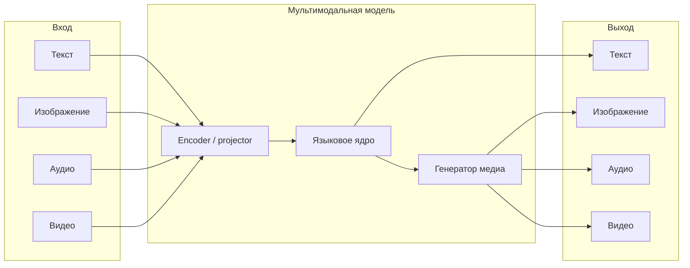
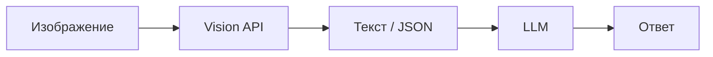

# Мультимодальный ИИ

  ДЛЯ НОВИЧКОВ

Всем

**Мультимодальный ИИ** (англ. *multimodal AI*) — системы, которые одновременно работают с несколькими типами данных — текстом, изображениями, звуком, видео, иногда таблицами, 3D-сценами и сенсорными потоками. В отличие от узкоспециализированных моделей "только текст" или "только картинка", мультимодальный стек связывает модальности в одном контуре — понимает фото в чате, озвучивает ответ, генерирует ролик по сценарию или извлекает таблицу из скана документа.

Техническая база — [трансформеры в разных модальностях](/encyclopedia/6-ai/6-09-transformery-i-nlp/8), [нейросети](/encyclopedia/6-ai/6-03-neyroseti/111) и современные [LLM](/encyclopedia/6-ai/6-04-modeli-i-instrumenty/1). Практика нейроконтента — рядом с [нейрослопом](./2) и ответственным использованием ИИ в медиа.

---

## Что такое мультимодальный ИИ

Модальность — способ представления информации для машины. Текст — последовательность токенов; изображение — сетка пикселей или патчей; аудио — волна или спектрограмма; видео — последовательность кадров плюс звуковая дорожка.

Мультимодальная система решает одну из задач:

- **понимание** — извлечь смысл из входа (описать картинку, расшифровать речь, найти лицо);
- **синтез** — создать выход в другой модальности (картинка по тексту, озвучка по сценарию);
- **диалог** — принимать смешанный ввод и отвечать текстом, голосом или медиа.

Примеры продуктов — **GPT-4o**, **Gemini**, **Claude** (с изображениями), **Whisper** (аудио → текст), **Midjourney** (текст → изображение), **Sora** и **Runway** (текст → видео), **ElevenLabs** и **Suno** (текст → речь и музыка).

---

## Режимы преобразования

Каждый режим обозначают парой "вход → выход". Ниже — основные и смежные.

| Режим | Сокращение | Пример |
|-------|------------|--------|
| Текст → текст | Text-to-Text | Чат, перевод, саммари |
| Текст → изображение | Text-to-Image | Иллюстрация по промпту |
| Изображение → текст | Image-to-Text | Подпись, OCR, VQA |
| Текст → аудио | Text-to-Speech (TTS) | Озвучка диктора |
| Аудио → текст | Speech-to-Text (STT / ASR) | Транскрипт подкаста |
| Текст → видео | Text-to-Video | Ролик по сценарию |
| Видео → текст | Video-to-Text | Описание сцены, субтитры |
| Изображение → изображение | Image-to-Image | Стилизация, апскейл, inpainting |
| Видео → видео | Video-to-Video | Смена стиля, интерполяция кадров |
| Аудио → аудио | Audio-to-Audio | Шумоподавление, клон голоса |
| Текст + изображение → текст | Multimodal QA | "Что на этой схеме?" |
| Текст + аудио → текст | — | Встреча с записью и расшифровкой |

Дополнительные связки в продуктах:

- **Text-to-3D** — модель по описанию (Meshy, Rodin, часть игровых пайплайнов).
- **Image-to-Video** — оживление статичного кадра (Runway, Pika, Kling).
- **Speech-to-Speech** — перевод с сохранением тембра (новые режимы в GPT-4o, Meta Seamless).
- **Any-to-Any** — единая модель с несколькими выходами (Gemini, GPT-4o).

  
Промпт остаётся интерфейсом

  

  Для генерации изображений, видео и звука пользователь по-прежнему формулирует задачу текстом (или прикладывает референс). Качество сильно зависит от конкретности промпта — см. <a href="/lab/Примеры/1150">библиотеку промптов</a> и раздел про <a href="./2">нейрослоп</a>, когда шаблонный запрос даёт шаблонный результат.
  

---

## Распознавание изображений, лиц, данных и полезной информации

### Изображения

- **Классификация** — "кошка / собака", дефект на конвейере, тип документа.
- **Детекция и сегментация** — bounding box, маска объекта (YOLO, SAM, DETR).
- **OCR** — текст с фото, скана, вывески (TrOCR, PaddleOCR, cloud Vision API).
- **Captioning** — связное описание сцены на естественном языке.
- **Visual Question Answering (VQA)** — ответ на вопрос по картинке.
- **Извлечение структуры** — таблицы с фото, поля формы, диаграммы → JSON.

Подробнее о прикладных сценариях — [распознавание лиц, объектов и текста](/encyclopedia/6-ai/6-06-primenenie-ii/120).

### Лица и биометрия

- **детекция лица** — найти область на кадре;
- **распознавание** — сопоставить с базой (доступ, CRM);
- **верификация** — "это тот же человек?" для 2FA;
- **атрибуты** — возрастная оценка, эмоция, поворот головы (с этическими ограничениями);
- **deepfake-детекция** — отличить синтетику от съёмки.

Биометрия регулируется законом; в проде нужны согласие пользователя, хранение эмбеддингов, а не сырых фото, и политика [безопасности при работе с ИИ](/encyclopedia/6-ai/6-10-bezopasnost-pri-rabote-s-ii/1).

### Аудио

- **ASR** — речь в текст ([Whisper](/encyclopedia/6-ai/6-09-transformery-i-nlp/8#аудио--whisper-и-ast), Yandex SpeechKit, Google STT).
- **диаризация** — кто когда говорил на записи встречи.
- **классификация звуков** — сирена, стук, музыкальный жанр.
- **извлечение сущностей** — имена, даты, суммы из транскрипта.
- **sentiment / emotion** — тональность звонка в кол-центре.

### Видео

- **действия и события** — падение, драка, пересечение линии (аналитика CCTV).
- **трекинг объектов** — траектория машины, счётчик посетителей.
- **субтитры и главы** — ASR + сегментация по смыслу.
- **саммари** — краткое содержание длинного ролика или стрима.
- **извлечение кадров-ключей** — превью, моменты для монтажа.

Типичный production-пайплайн — **каскад** специализированных моделей (детектор → OCR → LLM), а не одна "всевидящая" сеть: проще отлаживать latency и качество по этапам.

---

## Архитектурные подходы

### Комбинированный (модульный, каскадный)

Отдельные модели на каждую модальность, связанные API или оркестратором.

**Плюсы** — замена одного блока без переобучения всего стека, предсказуемая стоимость, зрелые SDK (Whisper + GPT).

**Минусы** — ошибки накапливаются по цепочке; контекст между модальностями теряется на стыках.

### Сквозной (end-to-end)

Одна модель обучена сразу на парах "мультимодальный вход → выход". Примеры — **CLIP** (image + text в общее пространство), **Whisper** (mel → текст), **GPT-4o** (текст + картинка + аудио в одном чате), **Flamingo**, **LLaVA**.

**Плюсы** — единый контекст, меньше ручной склейки, сильнее zero-shot на смешанных задачах.

**Минусы** — дороже inference, сложнее отладка "где ошиблась модальность", нужны большие обучающие корпуса.

### Гибридный

Ядро — LLM или unified transformer; модальности подключают **adapter**, **projector** или **LoRA**. Vision-encoder (ViT, SigLIP) превращает картинку в "визуальные токены"; аудио-encoder (Whisper-encoder) — в токены речи; генерация изображений/видео часто вынесена в **отдельный diffusion-блок**, управляемый языковой моделью.

| Подход | Когда выбирать |
|--------|----------------|
| Комбинированный | MVP, жёсткие SLA, уже есть ASR/OCR-провайдер |
| Сквозной | Ассистент "загрузи файл и спроси" |
| Гибридный | Продукт с чатом + генерацией медиа по запросу |

Связь с NLP-разделом — [трансформеры в разных модальностях](/encyclopedia/6-ai/6-09-transformery-i-nlp/8).

---

## Сферы применения

| Область | Задачи мультимодального ИИ |
|---------|----------------------------|
| **Медиа и маркетинг** | Баннеры, ролики, озвучка рекламы, локализация |
| **E-commerce** | Поиск по фото, виртуальная примерка, описание карточки |
| **Медицина** | Анализ снимков, расшифровка консультаций (с валидацией врача) |
| **Образование** | Разбор диаграмм, субтитры лекций, интерактивные тьюторы |
| **Безопасность** | Видеоаналитика, контроль доступа по лицу |
| **Документооборот** | OCR счетов, извлечение полей, сверка с договором |
| **Игры и кино** | Концепт-арт, аниматика, Foley, локализация голоса |
| **Доступность** | Субтитры, audio description, упрощение сложных схем |
| **Разработка** | Скриншот UI → код, диаграмма → спецификация |
| **Поддержка** | Бот принимает фото поломки и лог одновременно |

---

## Технологии генерации изображений

Современный стек опирается на **диффузионные модели** (Stable Diffusion, DALL·E 3, Flux, Imagen), **авторегрессию по патчам** (часть ранних DALL·E) и **GAN/VAE** в узких нишах. Общая схема Text-to-Image:

1. Текстовый encoder (CLIP, T5) превращает промпт в эмбеддинг.
2. U-Net или transformer-декодер итеративно убирает шум из латентного тензора.
3. VAE декодирует латент в пиксели.

Управление генерацией:

- **prompt / negative prompt** — что включить и исключить;
- **seed** — воспроизводимость;
- **ControlNet, IP-Adapter** — поза, глубина, референс-стиль;
- **LoRA / DreamBooth** — персональный стиль или персонаж;
- **inpainting / outpainting** — дорисовка области или холста.

Теория диффузии — [введение в ИИ, типы моделей](/encyclopedia/6-ai/6-01-vvedenie-v-ii/112) и [нейросети, генеративные модели](/encyclopedia/6-ai/6-03-neyroseti/112).

---

## Улучшение фотографий и редактирование

| Задача | Технология | Примеры инструментов |
|--------|------------|----------------------|
| Апскейл | Super-resolution GAN, diffusion upscale | Topaz Gigapixel, Magnific AI, Real-ESRGAN |
| Шум и размытие | Denoising, deblur | Topaz Photo AI, DxO |
| Inpainting | Mask + diffusion | Photoshop Generative Fill, Stable Diffusion |
| Удаление объекта | Object removal | Clipdrop, Cleanup.pictures |
| Цвет и свет | Relighting, grade | Relight AI, Lightroom AI |
| Восстановие лиц | Face restoration | CodeFormer, GFPGAN |
| Смена фона | Segmentation + fill | Remove.bg, Canva |

Редактирование часто комбинируют: нейросеть предлагает вариант, человек доводит в классическом редакторе. Для продакшена фиксируют **версию модели** и **исходник** — важно при [маркировке ИИ-контента](/encyclopedia/6-ai/6-04-modeli-i-instrumenty/113).

---

## Создание художественных эффектов

- **стилизация** — "в стиле масляной живописи", anime, pixel art (img2img, style transfer);
- **перенос стиля нейросети** — NST и современные diffusion-аналоги;
- **фильтры движения** — cinemagraph, parallax из одного кадра;
- **типографика и постеры** — Ideogram, Recraft (текст на изображении);
- **3D и изометрия** — промпты с "isometric", "low poly", последующая доработка в Blender.

Художественный эффект — это управляемое отклонение от фотореализма; ключевые рычаги — **стrength** (насколько менять исходник), **reference image** и **консистентный персонаж** через LoRA.

---

## Технологии генерации видео

Видео — последовательность кадров + временная согласованность. Подходы:

| Подход | Суть | Ограничения |
|--------|------|-------------|
| **Text-to-Video** | Диффузия в пространстве "кадр × время" | Длина 5–20 с, артефакты физики |
| **Image-to-Video** | Первый кадр задан, модель анимирует | Дрейф объекта, "плывущие" детали |
| **Video diffusion** | Шум снимается по всей клипе сразу | Высокие требования к GPU |
| **Интерполяция** | Между ключевыми кадрами | Хорошо для slow-motion |
| **Аватар / talking head** | Аудио → движение губ | Deepfake-риски, нужно согласие |

Типичный workflow создателя: сценарий → раскадровка (Midjourney/Flux) → анимация клипов (Runway, Kling) → монтаж → озвучка (ElevenLabs) → цветокор в DaVinci.

Обзор форматов и кодеков — [аудио и видео в IT](/encyclopedia/1-basics/1-17-audio-i-video/1).

---

## Создание анимированных сцен и видеороликов

Практические шаги:

1. **Сценарий и тайминг** — длительность, количество сцен, реплики.
2. **Референсы** — персонаж, палитра, ракурс (одинаковый seed/LoRA для консистентности).
3. **Генерация клипов** — по 3–10 секунд на сцену; проще контролировать, чем один длинный ролик.
4. **Склейка** — CapCut, Premiere, DaVinci; переходы скрывают скачок стиля между клипами.
5. **Звук** — музыка (Suno), SFX, голос (TTS).
6. **Субтитры** — Whisper → SRT.

Для объясняющих роликов и курсов популярен пайплайн "слайды + аватар" (HeyGen, Synthesia): меньше артефактов движения, чем у чистого Text-to-Video.

---

## Технологии генерации аудио

| Направление | Задача | Архитектуры / продукты |
|-------------|--------|-------------------------|
| **TTS** | Озвучка текста | VITS, Tortoise, ElevenLabs, PlayHT |
| **Voice cloning** | Копия тембра по образцу | С этическими и юридическими лимитами |
| **Music generation** | Трек по жанру/тексту | Suno, Udio, MusicGen, AIVA |
| **SFX / ambience** | Звуки окружения | AudioGen, ElevenLabs SFX, библиотеки + генерация |
| **Source separation** | Выделить голос/инструмент | Demucs, Spleeter |
| **Enhancement** | Шумоподавление, мастер | Adobe Podcast, Krisp |

Музыкальные модели обучают на парах "описание / лирика → аудио"; длина трека и права на обучающие данные — частый предмет споров с правообладателями.

---

## Музыка, эффекты окружения и дикторская озвучка

Три слоя звукового дизайна для видео и игр:

### Музыкальное сопровождение

- **фоновая музыка** — задаёт настроение; промпт с жанром, темпом (BPM), инструментами;
- **адаптивная музыка** в играх — отдельные стемы (ударные, мелодия), склейка по состоянию игры;
- **лицензии** — коммерческие планы Suno/Udio, стоки (Epidemic Sound) или собственная генерация с проверкой политики платформы.

### Эффекты окружения (ambience, Foley, SFX)

- **ambience** — дождь, офис, толпа, ветер (односложные промпты + слои);
- **Foley** — шаги, хлопок двери, часто записывают вручную; ИИ дополняет библиотеку;
- **синхрон с видео** — пока вручную в DAW (Reaper, Logic); автоматическая привязка к кадру — область исследований.

### Дикторская озвучка

- выбор **голоса** (пол, возраст, акцент) в каталоге TTS;
- **SSML / паузы** — ударения, темп, эмоция;
- **клонирование** — только с письменным согласием актёра;
- **мультиязычность** — один текст → несколько дорожек (ElevenLabs multilingual, Azure Neural TTS).

Связка для ролика: сценарий → TTS по абзацам → таймкод в монтажке → музыка тише −18…−24 dB под голос → SFX на переходах.

---

## Топ 10 нейросетей для редактирования изображений

Рейтинг ориентирован на практику 2025–2026; порядок может меняться по задаче.

| № | Сервис / модель | Сильные стороны |
|---|-----------------|-----------------|
| 1 | **Adobe Photoshop (Generative Fill)** | Inpainting в профессиональном UI, интеграция с слоями |
| 2 | **Adobe Firefly** | Коммерчески "безопасные" данные обучения, текстовые правки |
| 3 | **Clipdrop (Stable Diffusion)** | Быстрое удаление объектов, relight, upscale |
| 4 | **Topaz Photo AI** | Апскейл, шум, лицо — для фотографов |
| 5 | **Magnific AI** | Агрессивный creative upscale, детализация |
| 6 | **Canva Magic Edit** | Простой inpainting для маркетинга |
| 7 | **Krea AI** | Real-time правки, img2img в браузере |
| 8 | **Runway (image tools)** | Часть видео-стека, хороший erase/fill |
| 9 | **GFPGAN / CodeFormer** (локально) | Восстановление лиц на старых фото |
| 10 | **Stable Diffusion + ControlNet** (ComfyUI / A1111) | Максимальный контроль для продвинутых |

Локальный Stable Diffusion требует GPU и навыков пайплайна; облачные сервисы снимают ops, но дают меньше контроля.

---

## Топ 10 нейросетей для генерации изображений

| № | Сервис / модель | Сильные стороны |
|---|-----------------|-----------------|
| 1 | **Midjourney** | Эстетика "из коробки", стили, community |
| 2 | **DALL·E 3** (ChatGPT, API) | Понимание сложных промптов, интеграция с чатом |
| 3 | **Flux** (Black Forest Labs) | Фотореализм, типографика, open weights (варианты) |
| 4 | **Stable Diffusion 3 / SDXL** | Open source, LoRA, self-host |
| 5 | **Adobe Firefly** | Корпоративные лицензии, вектор и макеты |
| 6 | **Ideogram** | Текст на картинке, постеры, логотипы-черновики |
| 7 | **Leonardo AI** | Игровые ассеты, консистентные персонажи |
| 8 | **Google Imagen 3** | Качество в экосистеме Google / Vertex |
| 9 | **Recraft** | Вектор, бренд-стили, иллюстрация |
| 10 | **Microsoft Designer (Copilot)** | Быстрые макеты в экосистеме Microsoft |

Выбор зависит от бюджета, лицензии (коммерция / персонажи), нужды в локальном хостинге и важности текста на изображении.

---

## Топ 10 нейросетей для генерации видео

| № | Сервис / модель | Сильные стороны |
|---|-----------------|-----------------|
| 1 | **OpenAI Sora** | Длинные клипы, сложная физика (по мере раскатки) |
| 2 | **Runway Gen-3 Alpha** | Профессиональный монтажный стек, img2video |
| 3 | **Kling** (Kuaishou) | Длительность, движение персонажей |
| 4 | **Luma Dream Machine** | Быстрые клипы, camera motion |
| 5 | **Pika** | Стилизация, эффекты, community |
| 6 | **Google Veo** | Интеграция с Google Cloud / Film tooling |
| 7 | **Hailuo / Minimax** | Доступность, Text-to-Video |
| 8 | **Stable Video Diffusion** | Open weights, img2video локально |
| 9 | **HeyGen** | Аватары, озвучка, корпоративное обучение |
| 10 | **Synthesia** | Диктор в кадре, шаблоны для бизнеса |

Для чистого кинематографического Text-to-Video ожидайте короткие клипы и ручной отбор; аватары стабильнее для "говорящей головы".

---

## Топ нейросетей для генерации аудио

Универсального "топ-10" меньше — рынок разделён на TTS, музыку и SFX. Ниже сильные представители по классам.

### Синтез речи (TTS и клонирование)

| Сервис | Особенности |
|--------|-------------|
| **ElevenLabs** | Качество голоса, клон, мультиязычность, SFX |
| **PlayHT** | Озвучка длинных текстов, API |
| **Murf** | Презентации, e-learning |
| **Azure Neural TTS** | Enterprise, SSML, много языков |
| **OpenAI TTS** | API в экосистеме GPT |

### Музыка

| Сервис | Особенности |
|--------|-------------|
| **Suno** | Песни с вокалом по тексту |
| **Udio** | Жанры, структура трека |
| **AIVA** | Инструментальная музыка, саундтреки |
| **Soundraw** | Настройка длины и настроения |
| **Meta MusicGen** | Open research, локальный запуск |

### Звуковые эффекты и окружение

| Сервис | Особенности |
|--------|-------------|
| **ElevenLabs Sound Effects** | Генерация SFX по описанию |
| **AudioGen** (Meta) | Исследовательская модель ambience |
| **Stable Audio** | Музыка и SFX в стеке Stability |

---

## Риски и ответственный нейроконтент

Мультимодальный ИИ ускоряет производство, но усиливает типичные проблемы:

- **deepfake** и подмена голоса — юридические и репутационные риски;
- **авторское право** на стиль, персонажей, музыку;
- **галлюцинации** в OCR и медицинских снимках;
- **нейрослоп** — однотипные картинки и ролики без идеи ([статья](./2));
- **утечка данных** — загрузка конфиденциальных сканов в публичный чат.

Политики команды, маркировка синтетики и human review — в [безопасности при работе с ИИ](/encyclopedia/6-ai/6-10-bezopasnost-pri-rabote-s-ii/1) и [маркировке контента](/encyclopedia/6-ai/6-04-modeli-i-instrumenty/113).

  
Проверяйте факты и права

  

  OCR и "описание картинки" могут ошибаться в цифрах и мелком тексте. Музыка и голос — только через сервисы с понятной лицензией на коммерческое использование. Клон голоса реального человека без согласия запрещён этикой и законом во многих юрисдикциях.
  

---

## Итог

**Мультимодальный ИИ** объединяет текст, зрение, звук и видео в одних продуктах — от чата с фото до полного пайплайна "сценарий → кадры → ролик → озвучка". Режимы Text-to-Image, Image-to-Text, ASR и TTS складываются в архитектуры от простого каскада до единых моделей вроде GPT-4o и Gemini. Для творческой работы выбирают стек по задаче — Midjourney и Flux для картинок, Runway и Kling для видео, ElevenLabs и Suno для звука — с ручной доводкой и контролем качества.

Дальше по теме: [трансформеры в разных модальностях](/encyclopedia/6-ai/6-09-transformery-i-nlp/8) · [распознавание лиц и объектов](/encyclopedia/6-ai/6-06-primenenie-ii/120) · [нейрослоп](./2) · [практикум по аудио и видео](/encyclopedia/6-ai/6-05-razrabotka-ii/122).

{/* sidebar-collections */}

---

## В подборках

Статья входит в [тематические подборки](/about/collections) и блок "С чего начать?" на [главной](/). Соседние шаги того же маршрута:

**ИИ для разработчика** — [Вайб-кодинг и нейроконтент — о разделе](/encyclopedia/6-ai/6-07-vayb-koding-i-neurokontent/intro), [Нейрослоп](/encyclopedia/6-ai/6-07-vayb-koding-i-neurokontent/2), [Трансформеры и NLP — о разделе](/encyclopedia/6-ai/6-09-transformery-i-nlp/intro), [Модели и инструменты — о разделе](/encyclopedia/6-ai/6-04-modeli-i-instrumenty/intro).

{/* /sidebar-collections */}

---
