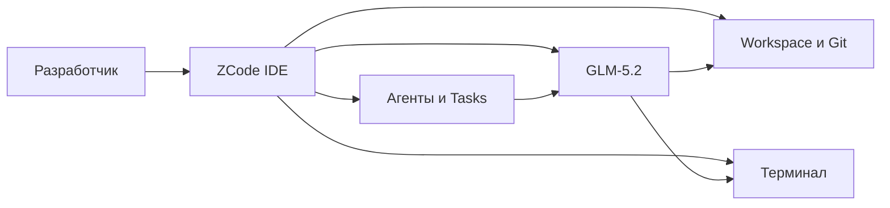

# ZCode и GLM-5.2 — IDE-агент, длинный контекст и вайб-кодинг

<div class="article-tags">
  <span class="tag tag-beginner">ДЛЯ НОВИЧКОВ</span>
</div>

<span class="complexity-badge">Разработчику</span>

**[ZCode](https://zcode.z.ai/en)** — десктопная среда разработки с встроенным **[ИИ-агентом](/encyclopedia/6-ai/6-04-modeli-i-instrumenty/116)**. Программа умеет читать ваш проект, править файлы, запускать команды в терминале и вести длинную задачу по шагам. Создатель — компания **[Z.ai](https://z.ai)** (лаборатория Zhipu AI, в научных публикациях часто **THUDM**). В версии **3.0** ZCode заточен под модель **GLM-5.2** — крупную [языковую модель](/encyclopedia/6-ai/6-04-modeli-i-instrumenty/1) для программирования с очень большим **контекстным окном** (до миллиона [токенов](/encyclopedia/6-ai/6-04-modeli-i-instrumenty/1#от-текста-к-числам--как-llm-видит-строку)).

На лендинге ZCode слоган *Simple, Fast, Vibe-Ready* — разработка в духе [вайб-кодинга](./1), когда вы описываете задачу словами, а агент собирает код, но при этом остаётся полноценная **IDE** (integrated development environment, среда разработки) с Git, терминалом и review.

Официальные материалы:

- [zcode.z.ai](https://zcode.z.ai/en) — скачивание и обзор возможностей
- [GLM Coding Plan](https://docs.z.ai/devpack/overview) — подписка и подключение к другим агентам
- [Анонс GLM-5](https://z.ai/blog/glm-5) — линейка моделей Z.ai

---

## Термины перед стартом

| Термин | Простыми словами | Где почитать подробнее |
|--------|------------------|------------------------|
| **IDE** | Редактор кода + терминал + отладка в одном приложении (как VS Code или IntelliJ) | [Разработка и отладка](/encyclopedia/4-code-dev/4-14-razrabotka-i-otladka/intro) |
| **ИИ-агент** | Программа, которая сама планирует шаги, вызывает инструменты (файлы, shell, API) и меняет проект | [Агенты ИИ](/encyclopedia/6-ai/6-04-modeli-i-instrumenty/116) |
| **LLM / языковая модель** | Нейросеть, которая продолжает текст; в ZCode она "думает" над кодом | [Большие языковые модели](/encyclopedia/6-ai/6-04-modeli-i-instrumenty/1) |
| **Контекст** | Сколько текста (файлов, истории чата, вывода команд) модель держит в "памяти" за один запрос | [Контекст и промпты](/encyclopedia/6-ai/6-01-vvedenie-v-ii/113) |
| **Токен** | Условная единица текста (~3–4 символа латиницы или меньше для кириллицы) | [От текста к числам](/encyclopedia/6-ai/6-04-modeli-i-instrumenty/1#от-текста-к-числам--как-llm-видит-строку) |
| **Open-weight** | Веса модели можно скачать и запустить у себя (не только через облачный API) | [Локальные модели](/encyclopedia/6-ai/6-05-razrabotka-ii/113) |
| **Вайб-кодинг** | Программирование через диалог с ИИ, часто без глубокого разбора каждой строки | [Вайб-кодинг](./1) |

---

## Модель GLM-5.2

**GLM-5.2** вышла **13 июня 2026** — это обновление линейки GLM-5 (после GLM-5, GLM-5-Turbo и GLM-5.1). **GLM** (General Language Model) — семейство моделей Zhipu; в каталоге [Hugging Face](https://huggingface.co/zai-org) они публикуются от имени организации `zai-org`.

Модель рассчитана на **агентное программирование**. ИИ выполняет цепочку шагов подряд:

- планирует изменения;
- пишет и правит код;
- запускает тесты;
- исправляет ошибки по выводу терминала.

Такие сценарии называют **long-horizon** (длинный горизонт задачи). Примеры — рефакторинг целого репозитория, миграция фреймворка, сборка MVP из десятка файлов.

### Основные характеристики

| Параметр | GLM-5.2 | GLM-5.1 |
|----------|---------|---------|
| Контекст | **1 000 000** токенов (вариант `glm-5.2[1m]`) | около 200 000 |
| Максимум на ответ | до **131 072** токенов | не раскрывалось |
| Архитектура | линейка GLM-5, [MoE](/encyclopedia/6-ai/6-04-modeli-i-instrumenty/1#mixture-of-experts) | 744B параметров всего, ~40B активных на токен |
| Режимы рассуждения | **High**, **Max** | один режим |
| Лицензия весов | **MIT** | MIT |
| Где взять | [GLM Coding Plan](https://docs.z.ai/devpack/overview), API Z.ai, встроена в ZCode | то же |

**MoE** (Mixture of Experts, смесь экспертов) — способ сделать модель большой по объёму знаний, но относительно экономной при каждом запросе. У GLM-5 в линейке заявлено около **744 млрд** параметров всего, при этом на один токен активируется порядка **40 млрд** — как у плотной модели среднего размера. Подробнее про архитектуру — в разделе [Mixture of Experts](/encyclopedia/6-ai/6-04-modeli-i-instrumenty/1#mixture-of-experts).

Режимы **High** и **Max** — разная "глубина" внутреннего рассуждения перед ответом (аналогично [reasoning-моделям](/encyclopedia/6-ai/6-04-modeli-i-instrumenty/123)). **Max** обычно точнее на сложных задачах, но медленнее и дороже по квоте.

### Контекст в миллион токенов

Контекст — это всё, что модель видит за один вызов:

- открытые файлы проекта;
- история диалога с агентом;
- вывод команд из терминала;
- ваши уточнения и правки.

При коротком контексте на 10–15-м шаге агент часто "забывает" ранние договорённости и дублирует файлы или ломает уже согласованную структуру. Окно в **1M токенов** по задумке Z.ai позволяет держать в памяти крупный репозиторий или длинную сессию. Это облегчает [вайб-кодинг](./1) на прототипах, но **не отменяет** Git, code review и [тесты](/encyclopedia/7-project/7-05-testirovanie/intro).

<div class="callout callout--info">
  <div class="callout-title">Независимые бенчмарки</div>

  <div class="callout-body">
  На момент релиза Z.ai публиковала характеристики и доступность GLM-5.2, но <strong>не выкладывала</strong> сторонние оценки вроде SWE-bench или Terminal-Bench. Перед переносом на продакшен прогоните модель на своём репозитории — см. <a href="/encyclopedia/6-ai/6-04-modeli-i-instrumenty/125">как выбрать модель</a>.
  </div>
</div>

### Открытые веса и свой сервер

Веса GLM-5.2 распространяются под лицензией **MIT** — коммерческое использование разрешено при сохранении уведомления об авторских правах. Скачать можно с [Hugging Face](https://huggingface.co/zai-org) после публикации релиза; для запуска на своём железе обычно берут **vLLM**, **SGLang** или community-сборки **GGUF** под [Ollama](/encyclopedia/6-ai/6-05-razrabotka-ii/113) и LM Studio.

Плюсы open-weight для команды:

- код и промпты остаются в вашем контуре;
- нет жёсткой привязки к одному облачному API;
- модель можно поставить рядом с Llama, Qwen и DeepSeek в [сравнительной таблице](/encyclopedia/6-ai/6-04-modeli-i-instrumenty/125).

Минусы:

- нужны мощные GPU и администрирование;
- задержка и стоимость инференса — ваша зона ответственности.

---

## Редактор ZCode

**ZCode** — отдельное десктопное приложение, заточенное под экосистему Z.ai и модель GLM-5.2 "из коробки".

Отличия от [Cursor](/encyclopedia/4-code-dev/4-14-razrabotka-i-otladka/1113):

- **ZCode** поставляется вместе с GLM и интерфейсом Tasks под длинные агентные сессии.
- **Cursor** — форк VS Code; модель (Claude, GPT, локальная) выбирается отдельно.

Типичный цикл работы в ZCode:

1. **План** — описать задачу и критерии готовности ([промпты](/lab/Примеры/1150)).
2. **Код** — агент правит файлы и запускает сборку.
3. **Review** — просмотреть diff и замечания агента.
4. **Deploy** — выкатить изменения через Git и [CI/CD](/encyclopedia/8-infra-security/8-04-devops-ci-cd/11).



### Элементы интерфейса

**Tasks (задачи)**

- длинная цель разбивается на подзадачи с таймлайном;
- видно, что уже сделано ("подключить AI-ходы", "починить sidebar");
- удобно для фич, которые агент ведёт часами.

**Workspace (рабочая область)**

- открывается папка с [Git-репозиторием](/encyclopedia/4-code-dev/4-13-osnovy-raboty-s-git/intro);
- агент видит структуру проекта и зависимости стека.

**Агенты**

- один или несколько агентов на сложную цель (multi-agent в ZCode 3.0);
- режим **Ask before changes** — перед записью в файл агент спрашивает разрешение (human-in-the-loop, см. [AgentOps](/encyclopedia/6-ai/6-08-agentops/1)).

**Skills (навыки)**

- сохранённые сценарии и пресеты команд;
- по смыслу близко к skills в [Claude Code](./4).

**Terminal (терминал)**

- встроенный shell (на скриншотах — **zsh**);
- агент выполняет `npm test`, `git status` и т.д. в той же среде, что и вы.

**Code review**

- подсказки по коду до открытия pull request;
- пересекается с идеей [генерации кода](/encyclopedia/6-ai/6-04-modeli-i-instrumenty/117) с обязательным просмотром diff.

На [лендинге](https://zcode.z.ai/en) Z.ai также заявляет:

- понимание кодовой базы в нескольких репозиториях;
- автоматический review;
- стыковку с issue tracker'ами и привычными редакторами команды.

### Установка

На [zcode.z.ai](https://zcode.z.ai/en) в открытом доступе — установщик **.dmg для Apple Silicon** (Mac на чипах M1/M2/M3). Сборки для Windows и Linux на сайте не рекламировались — проверяйте актуальный список перед выбором стека.

| Шаг | Действие |
|-----|----------|
| 1 | Скачать ZCode с [zcode.z.ai](https://zcode.z.ai/en) |
| 2 | Войти в аккаунт Z.ai или оформить [GLM Coding Plan](https://docs.z.ai/devpack/overview) |
| 3 | Открыть **Workspace** на каталоге с Git-репозиторием |
| 4 | Создать **Task** (⌘N) с описанием цели и критериев готовности |
| 5 | Выбрать **GLM-5.2** или **GLM-5.2 Max** и режим подтверждения правок |

API-ключи и токены храните в переменных окружения или менеджере секретов, не в Git — см. [гигиену секретов](/encyclopedia/8-infra-security/8-03-zabota-o-kode-i-dannyh/117).

---

## ZCode, Cursor и Claude Code

Все три относятся к **IDE-агентам** — программам, где ИИ встроен в процесс разработки, а не живёт в отдельной вкладке браузера. Общая таблица подходов — в [Цифровых инструментах без ручного кодинга](/encyclopedia/6-ai/6-05-razrabotka-ii/117).

| Критерий | ZCode | Cursor | Claude Code |
|----------|-------|--------|-------------|
| Что это | IDE + агенты Z.ai | IDE на базе VS Code + агенты | Агент Anthropic в терминале, IDE, Desktop, веб |
| Модель по умолчанию | GLM-5.2 | на выбор (Claude, GPT, …) | Claude |
| Открытые веса | да, GLM под MIT | нет | нет |
| Контекст | до 1M (заявлено для GLM-5.2) | зависит от модели | зависит от тарифа Claude |
| Несколько агентов | да (ZCode 3.0) | subagents, Task tool | subagents, [MCP](/encyclopedia/6-ai/6-04-modeli-i-instrumenty/114) |
| Платформы | macOS Apple Silicon (на старте) | Windows, macOS, Linux | Windows, macOS, Linux, WSL |
| Статья в энциклопедии | эта страница | [4.14 / 1113](/encyclopedia/4-code-dev/4-14-razrabotka-i-otladka/1113) | [Claude Code](./4) |

<div class="callout callout--tip">
  <div class="callout-title">Как выбрать инструмент</div>

  <div class="callout-body">
  <ul>
    <li><strong>ZCode</strong> — единый стек Z.ai, GLM-5.2 и Tasks на Mac с Apple Silicon.</li>
    <li><strong>Cursor</strong> — команда уже сидит в Cursor и хочет менять модели (Claude, GPT, локальные через Continue).</li>
    <li><strong>Claude Code</strong> — приоритет экосистемы Anthropic, MCP и запуск из CI.</li>
  </ul>
  Инструменты можно комбинировать. Для продакшена в любом случае нужны Git, review и <a href="/encyclopedia/8-infra-security/8-04-devops-ci-cd/11">CI/CD</a>.
  </div>
</div>

---

## GLM-5.2 вне ZCode

Модель не привязана только к ZCode. Подписка **[GLM Coding Plan](https://docs.z.ai/devpack/overview)** даёт доступ к GLM из других coding-агентов:

- [Claude Code](./4)
- [Cline](https://cline.bot)
- OpenCode, Roo Code, Goose, OpenClaw и др. (полный список — в [документации](https://docs.z.ai/devpack/overview))

Тарифы начинаются примерно с **$18/мес** (Lite); есть Pro, Max и Team. Лимиты обновляются в **5-часовых** и **недельных** окнах — прогресс виден в Usage Statistics.

В план входят модели:

- **GLM-5.2** — сложные задачи, длинный контекст;
- **GLM-5-Turbo** — ускоренный вариант линейки;
- **GLM-4.7** — рутина, экономия квоты;
- **GLM-4.5-Air** — лёгкая модель для простых запросов.

Z.ai рекомендует GLM-5.2 для тяжёлых сценариев и GLM-4.7 для повседневных правок. На пиковых часах (14:00–18:00 UTC+8) списание квоты за GLM-5.2 может идти с множителем — детали в [обзоре плана](https://docs.z.ai/devpack/overview).

Дополнительно в подписку входят MCP-инструменты Z.ai:

- распознавание изображений (Vision);
- поиск в вебе;
- чтение страниц (Web Reader);
- Zread.

### Подключение GLM к Claude Code

GLM Coding Plan отдаёт endpoint, совместимый с API Anthropic. В `~/.claude/settings.json` задают переменные окружения:

```json
{
  "env": {
    "ANTHROPIC_BASE_URL": "https://api.z.ai/api/anthropic",
    "ANTHROPIC_AUTH_TOKEN": "YOUR_ZAI_API_KEY",
    "ANTHROPIC_DEFAULT_OPUS_MODEL": "glm-5.2",
    "ANTHROPIC_DEFAULT_SONNET_MODEL": "glm-5.2",
    "ANTHROPIC_DEFAULT_HAIKU_MODEL": "glm-4.5-air"
  }
}
```

Актуальные URL, имена моделей и лимиты — в [документации Z.ai](https://docs.z.ai/devpack/overview). Ключ в репозиторий не кладут. Установка и режимы Claude Code — в [статье 4](./4).

Подписка рассчитана на **официально поддерживаемые** клиенты. Прямой доступ через самописный SDK без разрешения может урезать квоту — см. Usage Policy на сайте Z.ai.

---

## Вайб-кодинг и контроль качества

Длинный контекст GLM-5.2 и декомпозиция **Tasks** в ZCode хорошо подходят для сценариев, которые Андрей Карпатый назвал [вайб-кодингом](./1). Вы формулируете фичу словами, агент часами ведёт репозиторий, правит интерфейс и гоняет команды в терминале. Так быстро собирают прототипы и pet-проекты.

Для продакшена тот же режим без дисциплины даёт [нейрослоп](./2) — однотипный код без обработки ошибок и без понимания архитектуры. Минимальный чеклист:

- держать **Ask before changes** на чужом и боевом коде;
- читать **diff** перед принятием — как в [генерации кода](/encyclopedia/6-ai/6-04-modeli-i-instrumenty/117);
- не откладывать **тесты и CI** "на потом";
- ограничить [опасные команды](/encyclopedia/8-infra-security/8-03-zabota-o-kode-i-dannyh/101) в терминале;
- формулировать задачи по шаблонам из [библиотеки промптов](/lab/Примеры/1150).

Теория агентов и политики инструментов — [Агенты ИИ](/encyclopedia/6-ai/6-04-modeli-i-instrumenty/116). Эксплуатация в команде — [AgentOps](/encyclopedia/6-ai/6-08-agentops/intro).

---

## Безопасность и данные

**Облачный GLM**

- исходники и промпты обрабатываются на серверах Z.ai;
- сверьте с политикой компании — [ИИ в IDE](/encyclopedia/6-ai/6-10-bezopasnost-pri-rabote-s-ii/5);
- в промпт не попадают пароли, ключи API и персональные данные клиентов.

**Свой сервер с весами MIT**

- трафик в сторонний API не уходит;
- нужны GPU, патчи безопасности и мониторинг — [локальные модели](/encyclopedia/6-ai/6-05-razrabotka-ii/113).

**Агент с терминалом**

- те же риски, что у [Cursor Agent и Claude Code](/encyclopedia/6-ai/6-10-bezopasnost-pri-rabote-s-ii/4);
- изолированный workspace, минимальные права, подтверждение деструктивных команд;
- review правок агента в Git так же, как правок человека — [опасные скрипты](/encyclopedia/8-infra-security/8-03-zabota-o-kode-i-dannyh/101).

---

## Дальше

- [Вайб-кодинг](./1) — термин, риски, спектр контроля
- [Claude Code](./4) — установка, MCP, plan mode, практикум
- [Как выбрать модель](/encyclopedia/6-ai/6-04-modeli-i-instrumenty/125) — GLM рядом с DeepSeek, Qwen, Claude
- [Генерация кода](/encyclopedia/6-ai/6-04-modeli-i-instrumenty/117) — промпты и цикл review
- [Цифровые инструменты без ручного кодинга](/encyclopedia/6-ai/6-05-razrabotka-ii/117) — Kimi Work, no-code, IDE-агенты
- [Сколько стоит ИИ](/encyclopedia/6-ai/6-04-modeli-i-instrumenty/126) — подписки и API

---
