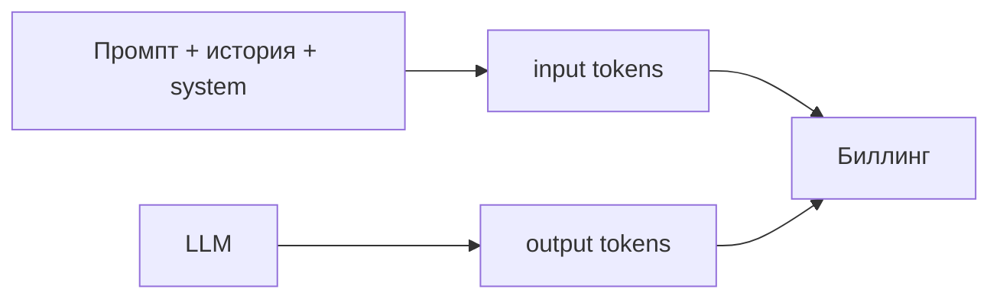

import ExternalPlayEmbed from '@site/src/components/ExternalPlayEmbed';

# Экономия токенов

  ДЛЯ НОВИЧКОВ

Разработчику

<ExternalPlayEmbed example="ai/tokenization-play" title="Токенизация текста" minHeight={460} />

**Токен** — минимальная единица текста, с которой работает [большая языковая модель](/encyclopedia/6-ai/6-04-modeli-i-instrumenty/1). Это не обязательно целое слово: токеном может быть короткое слово, часть слова, отдельный символ или знак препинания. Модель не «читает» строку как человек — сначала **токенизатор** нарезает текст на такие кусочки, присваивает каждому числовой ID и только потом передаёт последовательность в нейросеть.

При массовом использовании ChatGPT, Claude, Gemini и IDE-агентов (Cursor, Claude Code, Codex) расход токенов напрямую превращается в **деньги**, **скорость** и **лимит контекста**. Ниже — теория токенизации, практические приёмы экономии и пример community-решения [Caveman](https://github.com/juliusbrussee/caveman).

Полная цепочка «строка → токены → векторы» и сравнение character / word / subword — в [Больших языковых моделях](/encyclopedia/6-ai/6-04-modeli-i-instrumenty/1#от-текста-к-числам--как-llm-видит-строку). Здесь акцент на **стоимости и управлении объёмом** при разработке с ИИ.

---

## Как текст превращается в токены

### Токенизатор и словарь

У каждой модели свой **словарь** (vocabulary) — таблица из десятков или сотен тысяч уникальных токенов. Фраза «Привет, мир!» для конкретной модели может выглядеть как массив ID, например `[1243, 15, 2843, 4]` — уже не текст, а индексы в этой таблице.

Числа в примерах **иллюстративные**: GPT, Claude, Gemini и Llama режут один и тот же русский абзац по-разному.

### BPE — самый распространённый метод

Современные LLM почти всегда используют **подсловную** токенизацию. Самая популярная схема — **Byte Pair Encoding** (BPE):

1. Словарь начинается с отдельных символов (или байтов).
2. Алгоритм многократно находит **самую частую пару** соседних фрагментов и склеивает её в новый токен.
3. Процесс останавливается, когда словарь достигает заданного размера.

В результате в словаре оказываются:

| Тип фрагмента | Пример |
|---------------|--------|
| **Целые короткие слова** | `the`, `and`, `дом` — если часто встречались при обучении |
| **Части слов (субслова)** | `нейро` + `сеть`, `un` + `believ` + `able` |
| **Символы и знаки** | редкие буквы, эмодзи, пунктуация, иногда пробел |

Близкий родственник — **SentencePiece** (byte-level BPE без привязки к границам слов). Его применяют Llama, часть открытых моделей и ряд мультиязычных стеков.

### Русский vs английский

Большинство флагманских моделей (GPT, Claude, Gemini) обучались преимущественно на **английском** корпусе. Их BPE-словари лучше «упаковывают» латиницу:

| Текст | Типичное число токенов |
|-------|------------------------|
| `apple` | 1 |
| `яблоко` | 2–3 |
| Один и тот же по смыслу абзац на русском | примерно в **2–3 раза больше**, чем на английском |

Причина — богатая **морфология** кириллицы: падежи, окончания, приставки реже попадают в словарь целиком и чаще режутся на несколько субслов.

**Отечественные** модели (YandexGPT, GigaChat и др.) изначально настраивают токенизатор под кириллицу — для русскоязычных промптов это снижает перерасход относительно «западных» API. Выбор модели под язык — часть экономики, см. [Как выбрать модель и где её запускать](/encyclopedia/6-ai/6-04-modeli-i-instrumenty/125).

---

## На что влияют токены

### Стоимость запросов

Провайдеры API выставляют счёт за **входные** (prompt) и **выходные** (completion) токены — отдельными тарифами. В веб-чатах лимит часто завязан на подписку, но принцип тот же: длинный диалог и многословный ответ «съедают» квоту быстрее.

У **агентов** один пользовательский запрос часто равен **десяткам** вызовов LLM (план, tool calls, перечитывание файлов). См. [Cost и quota в AgentOps](/encyclopedia/6-ai/6-08-agentops/1#cost-и-quota).

### Контекстное окно

**Контекстное окно** — максимальный объём токенов, который модель удерживает в одном запросе (промпт + ответ). Например, у GPT-4o — порядка 128 000 токенов. При превышении лимита старые сообщения **отбрасываются** или сжимаются — агент «забывает» начало переписки и детали из ранних файлов.

Длинный `CLAUDE.md`, весь репозиторий в @-mentions и история из 50 сообщений конкурируют за **один** бюджет.

### Скорость генерации

LLM выдаёт ответ **последовательно** — токен за токеном (авторегрессия). Меньше токенов в ответе → быстрее пользователь видит результат и ниже latency на шаге агента.

Параметр `max_tokens` в API задаёт **верхнюю границу** длины completion; его имеет смысл выставлять осознанно, а не «с запасом на всякий случай» — см. [Параметры генерации LLM](/encyclopedia/6-ai/6-04-modeli-i-instrumenty/118).

---

## Вход vs выход: где теряется бюджет

| Компонент | Когда растёт | Что делать |
|-----------|--------------|------------|
| **System prompt** | Длинные роли, дубли правил в каждом запросе | Вынести в файл, кешировать, убрать воду |
| **История чата** | Один чат на десятки несвязанных задач | Новая сессия на новую задачу |
| **Контекст репозитория** | @codebase на весь монорепо | Узкий scope, grep, конкретные файлы |
| **Tool results** | Большие JSON из логов и API | Фильтрация, пагинация, summary |
| **Completion** | Модель «расписывает» с вступлениями | Лимит длины, лаконичный стиль |

Главный рычаг — **сокращать и вход, и выход**: оплата всегда идёт за суммарно обработанные и сгенерированные токены, а не за «символы на экране».

---

## Оптимизация промптов и общения

### Формулируйте задачу кратко и структурно

- Одна цель на сообщение; критерии готовности — списком.
- Технический контекст — JSON, diff, сигнатура функции, а не пересказ всего проекта.
- Шаблоны — [Prompt engineering — библиотека](/lab/Примеры/1150); цикл review — [Генерация кода](/encyclopedia/6-ai/6-04-modeli-i-instrumenty/117).

### Английский для промптов к западным моделям

Если вы пишете **код и спецификации** на английском, а общаетесь с GPT/Claude на русском — попробуйте **перевести промпт** на английский для API-вызовов. Экономия 2–3× на входе часто перекрывает усилие на формулировку. Ответ модели при этом можно попросить на русском отдельной строкой в промпте.

### Ограничивайте длину ответа

Явные рамки в промпте:

- «Без вступлений и заключений».
- «Только diff и краткий changelog».
- «Максимум 150 слов» / «до 20 строк кода».

В API — `max_tokens`, `stop` sequences, в некоторых SDK — режим «краткий ответ».

### Очищайте контекст диалога

Новый чат или новая сессия агента — на **каждую несвязанную задачу**. В длинной переписке модель при каждом запросе заново получает всю историю: вы платите за «входной» контекст многократно.

В Claude Code и Cursor полезны команды сброса контекста, узкие @-mentions и отказ от таскания в сессию файлов «на всякий случай».

### Лаконичные стили вывода

Для кода и рутинных agent-run программисты применяют **системные инструкции** и skills, которые запрещают вежливые вступления («Конечно, я с удовольствием помогу…») и требуют телеграфный стиль. Это тот же принцип, что и у [Caveman](#caveman--skill-для-сжатия-вывода-агента) ниже — экономия прежде всего на **completion-токенах**.

---

## Технические приёмы для API и разработки

### Prompt caching

**Anthropic** (Claude) и **OpenAI** предлагают **кеширование** повторяющегося префикса промпта: длинный system prompt, документация, база знаний. Повторные запросы с тем же началом могут стоить **на порядок дешевле** на входных токенах (до ~90% скидки у части тарифов — уточняйте актуальные цены в документации провайдера).

Условие: **стабильный** префикс и осмысленный порядок полей в запросе.

### Model routing

Не гоняйте флагман (GPT-4o, Claude Sonnet) на тривиальные шаги:

| Задача | Достаточно |
|--------|------------|
| Классификация, теги, sentiment | mini / Flash / Haiku |
| Исправление опечатки в комментарии | малая или локальная модель |
| Архитектура, сложный рефакторинг | флагман |

Маршрутизация по сложности — стандартная практика [AgentOps](/encyclopedia/6-ai/6-08-agentops/1#model-routing).

### Урезайте system-инструкции

Длинное описание роли «ты — опытный senior с 20 годами…» редко улучшает код, но всегда увеличивает счёт. Оставляйте **инварианты**: стек, запреты, формат ответа, пути в репозитории. Подробности — в [AGENTS.md и skills](/encyclopedia/8-infra-security/8-04-devops-ci-cd/2153), а не в каждом user message.

### Структурированные данные — компактно

Перед отправкой в модель:

- **минифицируйте** JSON (без лишних пробелов);
- убирайте HTML-комментарии и неиспользуемые поля;
- для логов — последние N строк или агрегат, а не полный дамп.

### RAG и контекст

В retrieval-контурах режьте **top-k** чанков, дедуплицируйте похожие фрагменты, не подмешивайте целую вики, если нужен один абзац политики. Лишний контекст — лишние input-токены и риск «забыть» суть задачи.

### Локальный инференс

Для высокочастотных или конфиденциальных шагов — [Ollama](/encyclopedia/6-ai/6-05-razrabotka-ii/113) и self-hosted vLLM: платите за железо и электричество, а не за каждую тысячу токенов в облаке.

---

## Экономия vs качество

Сжатие контекста и ответов — не бесплатно.

| Риск | Когда проявляется |
|------|-------------------|
| Потеря нюансов задачи | Слишком короткий промпт без критериев |
| Хуже онбординг и документация | Caveman-стиль в обучающих материалах |
| Пропуск edge cases | Ответ «тезисно» без тестов и уточнений |
| Ложная экономия | Дешёвая модель ломает архитектуру → дорогие переделки |

Разумный баланс: **флагман** на проектирование и опасные diff, **сжатие и mini-модели** на рутину, **review человека** перед merge — как в [вайб-кодинге](./1) против [нейрослопа](./2).

---

## Caveman — skill для сжатия вывода агента

На фоне роста счетов за API в 2025–2026 годах в сообществе разработчиков распространился open-source проект **[Caveman](https://github.com/juliusbrussee/caveman)** — skill для Claude Code и совместимых агентов. Слоган репозитория: *why use many token when few token do trick* («зачем много токенов, если мало делают дело»).

### Что делает

Caveman — это **набор правил** (skill), который заставляет модель:

- убирать вежливые обороты и повторы;
- отвечать короткими фразами в духе «Claude думать → Claude сделать»;
- фокусироваться на действии (код, команда, diff), а не на объяснении процесса.

Авторы заявляют экономию порядка **65–75%** completion-токенов на типичных agent-сессиях. Точная цифра зависит от задачи и базовой многословности модели; имеет смысл замерять на своём репозитории через dashboard провайдера.

### Почему тема стала заметной

1. **Корпорации** (OpenAI, Anthropic, Google, GitHub) сами ужимают дефолтные ответы ассистентов — меньше «воды», короче system prompts.
2. **IDE-агенты** умножают расход: каждый шаг плана — отдельный вызов LLM.
3. В репозиторий Caveman внесён вклад со стороны **OpenAI** (Shane Swindler) — поддержка **Codex**, что сигнализирует: сжатие вывода воспринимается индустрией как инженерная задача, а не только мем.

### Как подключить

Репозиторий: [github.com/juliusbrussee/caveman](https://github.com/juliusbrussee/caveman). Установка — по инструкции в README (skill для Claude Code / совместимых сред). Общая модель skills и rules в проекте — [Контекст агента](/encyclopedia/8-infra-security/8-04-devops-ci-cd/2153).

### Когда уместен, когда нет

| Сценарий | Caveman / телеграфный стиль |
|----------|------------------------------|
| Рутинный рефакторинг, фиксы, agent-run в знакомом репо | Уместен |
| Обучающие статьи энциклопедии, онбординг джуна | Не уместен |
| Архитектурные решения с trade-offs | Нужен развёрнутый ответ |
| Продакшен-инцидент, postmortem | Полнота важнее экономии |

Caveman — крайний, но показательный случай общего принципа: **token-aware prompting**. Тот же эффект частично дают короткий system prompt, `max_tokens`, новая сессия на задачу и model routing без отдельного плагина.

---

## Краткий чек-лист

1. Понимаете, что API считает **токены**, не символы — русский обычно дороже английского на западных моделях.
2. Новая сессия на новую задачу; в промпт — только нужный контекст.
3. Явный лимит длины ответа; для API — `max_tokens` и компактный system.
4. Тяжёлую модель — на сложное; mini / Flash — на классификацию и мелочи.
5. Повторяющийся префикс — под **prompt caching**, если провайдер поддерживает.
6. Агентам — skills вроде Caveman только там, где краткость не вредит review и обучению.

---

## Читать дальше

- [Большие языковые модели — токенизация и BPE](/encyclopedia/6-ai/6-04-modeli-i-instrumenty/1#от-текста-к-числам--как-llm-видит-строку)
- [Генерация кода — рабочий цикл](/encyclopedia/6-ai/6-04-modeli-i-instrumenty/117)
- [AgentOps — cost, quota, routing](/encyclopedia/6-ai/6-08-agentops/1)
- [Claude Code — контекст и сессии](./4)
- [Caveman на GitHub](https://github.com/juliusbrussee/caveman)

{/* sidebar-collections */}

---

## В подборках

Статья входит в [тематические подборки](/about/collections) и блок "С чего начать?" на [главной](/). Соседние шаги того же маршрута:

**ИИ для разработчика** — [Вайб-кодинг и нейроконтент — о разделе](/encyclopedia/6-ai/6-07-vayb-koding-i-neurokontent/intro), [Вайб-кодинг](/encyclopedia/6-ai/6-07-vayb-koding-i-neurokontent/1), [Генерация кода](/encyclopedia/6-ai/6-04-modeli-i-instrumenty/117), [AgentOps и MLOps — о разделе](/encyclopedia/6-ai/6-08-agentops/intro).

{/* /sidebar-collections */}

---
