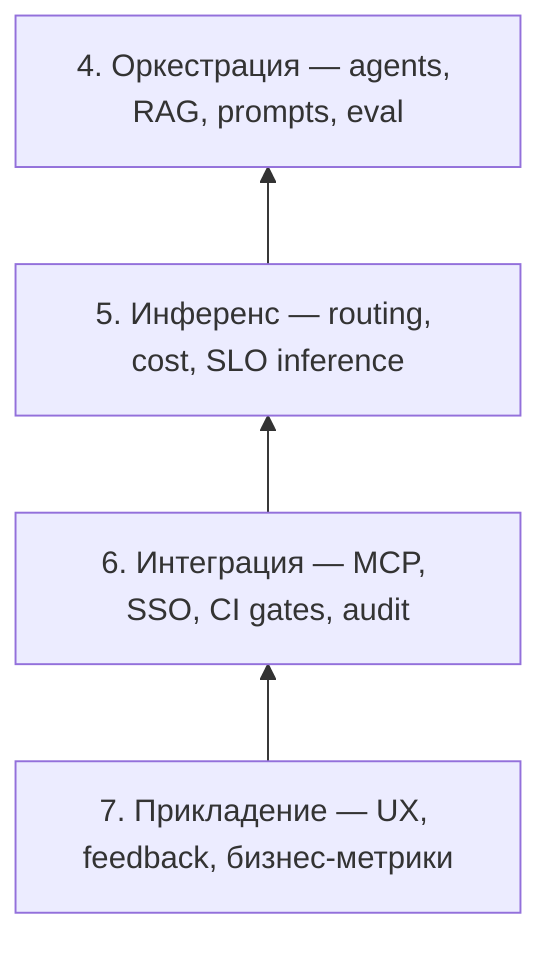
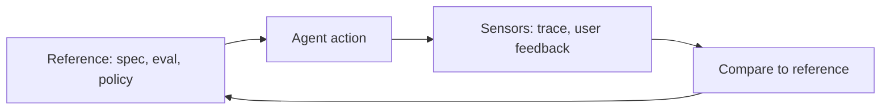
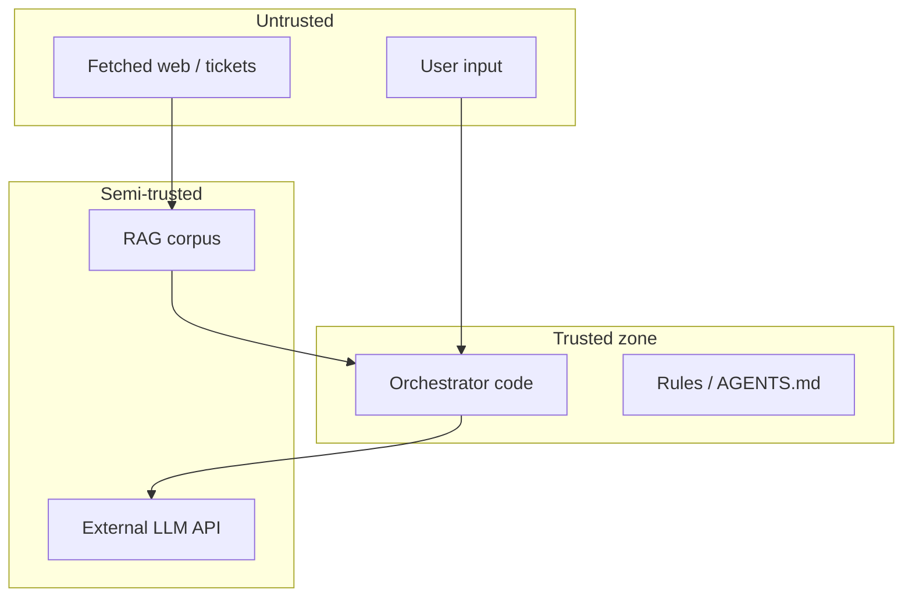
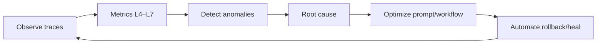

# AgentOps и LLM-стек — слои 4–7

  ОБЯЗАТЕЛЬНО

Архитектору
Разработчику
Инженеру

[Семь слоёв LLM-стека](/encyclopedia/6-ai/6-05-razrabotka-ii/119) описывают продукт снизу вверх. **AgentOps** — дисциплина **эксплуатации** верхней половины стека: там, где модель уже подключена к данным, но поведение системы **недетерминировано**, есть **tools с side effects** и нужны eval, tracing и human-in-the-loop.

Слои **1–3** (источники, подготовка данных, обучение модели) — зона **[MLOps](./2)**. AgentOps **потребляет** их артефакты — индекс RAG, checkpoint, eval-набор — и отвечает за то, что происходит **в runtime** от промпта до действия в prod.

Полный цикл AgentOps (история Ops, multi-agent Git, AGENTS.md, инструменты) — [8.04 AgentOps](/encyclopedia/8-infra-security/8-04-devops-ci-cd/2151).

  
Как читать пару статей

  

  Сначала [MLOps — слои 1–3](./2), затем эта статья. Вместе они закрывают все семь слоёв с точки зрения **операций**, а не только архитектуры.
  

---

## Теоретические основы AgentOps

**AgentOps** опирается на premis: LLM-агент — **кибер-физическая система** в soft sense. «Физика» здесь — API, Git, БД, биллинг: модель выдаёт tokens, orchestration превращает их в **действия** с необратимыми или дорогими последствиями. Классический DevOps мониторит **инфраструктуру**; MLOps — **артефакты обучения**; AgentOps — **траекторию принятия решений** в runtime.

### Агент в теории ИИ

Классическая модель **BDI** (Belief–Desire–Intention) описывает rational agent:

- **Beliefs** — что агент «знает» о мире (контекст, RAG, memory);
- **Desires** — цели (user task, KPI);
- **Intentions** — зафиксированный план действий (tool sequence).

LLM-агент реализует BDI **приближённо**: beliefs = prompt + retrieval; desires = user message + system goals; intentions = plan-and-execute или ReAct loop. AgentOps делает beliefs и intentions **наблюдаемыми** через trace, потому что внутреннее состояние модели **непрозрачно**.

Сравнение с [типами интеллектуальных агентов](/encyclopedia/6-ai/6-04-modeli-i-instrumenty/120): LLM-agent — **goal-based** + **learning** (through feedback), с **utility** в виде reward от eval/human.

### Недетерминизм как операционная проблема

Inference LLM — **сampling** из распределения $P(token | context)$. Temperature &gt; 0 → разные runs. Операционные следствия:

| Свойство ПО | Свойство агента |
|-------------|-----------------|
| Reproducible build | Statistically reproducible **eval** |
| Exact unit test | Rubric + threshold + multiple trials |
| Binary pass/fail | Distribution of outcomes |

Теория **probabilistic testing**: вместо «assert equals» — «95% runs pass rubric on golden set». AgentOps CI принимает **flakiness budget** явно, как CI уже принимает flaky integration tests с retry policy.

### Три столпа observability

SRE-метафора **logs, metrics, traces** для агентов:

| Столп | Классика | AgentOps |
|-------|----------|----------|
| **Logs** | Строка приложения | Prompt, completion, tool I/O (redacted) |
| **Metrics** | RPS, latency | Tokens/run, cost, eval score, tool error rate |
| **Traces** | HTTP span tree | LLM span → tool span → sub-agent span |

Добавляется четвёртый измеримый слой — **decisions**: какой tool выбран, какой doc_id процитирован, какой branch в multi-agent graph.

### Principal–agent problem

В экономике **principal–agent problem** — principal (компания) делегирует agent (сотрудник/подрядчик) задачу при **asymmetric information**: agent знает больше о своих действиях. LLM-агент literalizes метафору: delegator (human) не видит все промежуточные рассуждения.

Mitigations из теории контрактов переносятся в AgentOps:

- **monitoring** (tracing);
- **incentive alignment** (eval metrics = business KPI);
- **bonding** (approval gates на risky actions);
- **limited authority** (least privilege tools).

---

## Карта AgentOps на слоях 4–7

| Слой | Архитектурный вопрос ([Семь слоёв LLM-стека](/encyclopedia/6-ai/6-05-razrabotka-ii/119)) | Вопрос AgentOps |
|------|------------------------------------------------------------------------|-----------------|
| **4. Оркестрация** | Как связать промпт, память и tools? | Как **версионировать**, **тестировать** и **откатывать** workflow агента? |
| **5. Инференс** | Как модель работает под нагрузкой? | Как **лимитировать** cost/latency и **fallback** между моделями? |
| **6. Интеграция** | Как встроить LLM в ландшафт? | Как **аудировать** tool calls, секреты и egress в prod? |
| **7. Прикладение** | Какую ценность видит пользователь? | Как собирать **feedback**, измерять **качество** и **эскалировать** к человеку? |

DevOps (сборка, деплой контейнеров, [IaC](/encyclopedia/8-infra-security/8-04-devops-ci-cd/215)) идёт **горизонтально** через слои 5–6. AgentOps добавляет **вертикаль** «решение модели → последствие в мире».

### Замкнутый контур управления

**Reference** — prompts, rules, golden evals, SLO. **Sensors** — Langfuse, thumbs, ticket resolution. Отклонение → **corrective action**: patch prompt, disable tool, rollback index ([MLOps L2](./2)). Это **control theory** в дискретном event-driven виде.

---

## Слой 4 — оркестрация (ядро AgentOps)

Здесь живут RAG, промпты, агенты, multi-agent graphs, guardrails. Большинство инцидентов AgentOps начинается на этом слое: «агент зациклился», «вызвал не тот tool», «retrieval принёс устаревший документ».

### Что версионировать в Git

- шаблоны промптов и system instructions;
- конфиг RAG (chunk size, top_k, reranker);
- списки tools и MCP server manifests;
- лимиты (`max_iterations`, timeout, budget tokens);
- eval datasets и expected tool traces;
- [rules и skills](/encyclopedia/8-infra-security/8-04-devops-ci-cd/2153) для IDE-агентов.

Промпт только в SaaS UI без экспорта в репозиторий — **не воспроизводимый релиз**. Черновики формулировок и построчный разбор полей — [Prompt engineering — библиотека](/lab/Примеры/1150); RAG в промпте — якорь [#rag](/lab/Примеры/1150#rag).

### Eval на слое 4

Классические unit-тесты проверяют `f(x)`. AgentOps eval проверяет **траекторию**:

| Тип eval | Пример |
|----------|--------|
| **Tool sequence** | На запрос «найди баг в auth» — сначала `grep`, потом `read`, без `shell rm` |
| **RAG grounding** | Ответ содержит citation из актуального doc_id |
| **Regression** | 50 golden tasks после смены prompt v2 → v3 |
| **Safety** | Prompt injection в документе не приводит к exfiltration секрета |
| **Multi-agent** | Reviewer получил полный diff, не summary от planner |

Eval гоняют в CI **до merge** prompt/workflow change — аналог test gate в [CI/CD](/encyclopedia/8-infra-security/8-04-devops-ci-cd/11).

### Multi-agent orchestration

Паттерны — [Мультиагентные команды и DevOps-pipeline](/encyclopedia/8-infra-security/8-04-devops-ci-cd/2152):

- **Planner → Coder → Reviewer** с shared artifact (PR, design doc);
- **Debate** двух агентов + arbiter;
- **Subagents** (Cursor Task tool, LangGraph nodes).

AgentOps мониторит **межагентный bus**: dropped messages, duplicate work, ping-pong без лимита раундов.

### Guardrails

- allow-list tools per environment (dev vs prod MCP);
- block destructive shell patterns — [Опасные скрипты](/encyclopedia/8-infra-security/8-03-zabota-o-kode-i-dannyh/101);
- PII redaction перед external LLM;
- output schema validation (JSON mode + pydantic).

Три слоя приложения (RAG / MCP / agent) — [RAG, MCP и агенты — три слоя архитектуры](/encyclopedia/6-ai/6-04-modeli-i-instrumenty/121). AgentOps накладывает **политики** на каждый.

### Теория оркестрации

**ReAct** (Reason + Act) — чередование **verbal reasoning** и **action**; теоретически повышает interpretability: каждый tool call предшествует явной rationale строкой. Операционный плюс — проще post-mortem.

**Plan-and-Execute** — двухфазный процесс: сначала полный plan (DAG шагов), затем execution. **Теория**: снижает variance на длинных задачах, повышает latency и хуже adapts к unexpected tool error mid-flight.

**State machine view**: agent run = переходы `(state, action) → state'`, где state = messages + tool results. AgentOps хранит **полный state trajectory** для replay и counterfactual («что если на шаге 3 вызвать другой tool»).

**Prompt as program**: system prompt + tool schemas = **domain-specific language** без formal semantics. «Компилятор» отсутствует; **eval suite** играет роль test suite интерпретатора.

### Prompt injection и attack surface

**Prompt injection** — когда untrusted data (email body, webpage, ticket) содержит инструкции, конкурирующие с system prompt. Теоретически это **confused deputy**: agent с privileges выполняет чужую цель.

Defense in depth на L4:

- **separation** trusted instructions vs untrusted content (XML tags, delimiters);
- **tool allow-list** минимальных capabilities;
- **output filtering**;
- **human approve** на exfiltration vectors.

Связь с [безопасностью агентов](/encyclopedia/6-ai/6-04-modeli-i-instrumenty/116#безопасность).

---

## Слой 5 — инференс

Слой 5 в [Семь слоёв LLM-стека](/encyclopedia/6-ai/6-05-razrabotka-ii/119) — streaming, cache, autoscaling. AgentOps добавляет **экономику и надёжность** agent run, где один user request = **десятки** LLM calls.

### Model routing

| Сигнал | Действие |
|--------|----------|
| Задача «plan architecture» | Premium model (Claude, GPT-4 class) |
| «Fix typo in comment» | Small / local model |
| Rate limit / 5xx | Fallback chain DeepSeek → Qwen → cached response |
| Compliance | Self-hosted vLLM, данные не уходят наружу |

Router config — в git; изменения проходят eval regression.

### Cost и quota

- **Budget per run** — hard stop после N tokens или $X;
- **Budget per tenant** — SaaS copilot не сжигает весь monthly cap одним пользователем;
- Dashboard: cost per PR, cost per support ticket, cost per agent session.

Runaway agent loop без `max_iterations` — классический финансовый инцидент AgentOps.

### SLO инференса для агентов

| Метрика | Зачем |
|---------|-------|
| p95 latency **на шаг** | UX multi-step agent |
| Time-to-first-token | Streaming chat |
| Error rate by model/provider | Fallback triggers |
| Queue depth | Backpressure при spike |

Связка с [SRE](/encyclopedia/8-infra-security/8-04-devops-ci-cd/2111) и [мониторингом](/encyclopedia/8-infra-security/8-04-devops-ci-cd/19).

### Self-hosted inference

[Развёртывание моделей](/encyclopedia/6-ai/6-05-razrabotka-ii/111) — vLLM, TGI, Ollama. AgentOps для self-host: health checks, rolling update weights **без** downtime agent sessions, canary на новой quant версии.

### Теория multi-step cost и latency

Один user turn агента — **цепочка** $n$ LLM calls с random variables $T_i$ (latency) и $C_i$ (cost). Total latency $\sum T_i$ часто **dominates UX**; total cost $\sum C_i$ — **O(n)** при fixed price per token.

**Оптимизация**:

- **speculative decoding** на L5 (draft model + verify);
- **caching** identical prefix (KV-cache reuse);
- **early exit** — stop when confidence high;
- **cheaper model** для draft steps, expensive для final.

**Queueing theory**: при burst traffic agent runs попадают в queue; без backpressure SLA L7 рушится. M/M/k модель очереди — грубая оценка нужных GPU replicas.

### Fallback как state machine

Provider outage → transition to **degraded mode**: smaller model, cached answer, «try again later», human handoff. Degraded mode **должен быть явным** в product copy и metrics — иначе silent quality drop.

---

## Слой 6 — интеграция

Агент в prod **не изолирован**: Git, Jira, Slack, БД, облако, browser. Слой 6 — где AgentOps встречается с **security и DevOps**.

### MCP и API audit

Каждый tool call логируется:

- who (agent id, user id, session);
- what (tool name, sanitized args);
- when (trace span);
- result (success / error / redacted).

[MCP-серверы](/encyclopedia/6-ai/6-04-modeli-i-instrumenty/114) — один server на домен; credentials rotate, scopes minimal.

### CI/CD gates для agent-generated changes

| Gate | Слой |
|------|------|
| lint + unit tests | DevOps |
| agent eval suite | AgentOps L4 |
| secret scan | DevOps + Sec |
| human approve on `infra/` | AgentOps L6 |
| deploy staging → smoke | DevOps |

Агент коммитит в тот же Git — [GitFlow](/encyclopedia/8-infra-security/8-04-devops-ci-cd/12), [GitHub Actions](/encyclopedia/8-infra-security/8-04-devops-ci-cd/2112).

### Identity и tenancy

- SSO для human; service account для agent runner;
- agent действует **от имени** пользователя или **от имени** bot — явно в audit log;
- row-level security в RAG: agent видит только docs tenant'а.

### Egress policy

Sandbox runner: allow GitHub API + npm registry; deny arbitrary `curl`. Cloud agents — VPC, private link к internal MCP.

### Теория trust boundaries

**Trust boundary crossing** — каждый tool call из semi/untrusted в prod systems. AgentOps audit log = **proof of boundary crossing**.

**Zero trust для агентов**: каждый tool call authenticated; no persistent god-mode token; session-scoped credentials.

### CI как social contract

Pipeline — **конституция** репозитория: что **может** попасть в main. Agent-generated code подчиняется **тем же** законам, что human code — идея **equality of artifacts** в AgentOps.

---

## Слой 7 — прикладение

Верхний слой — chat, copilot, automation UI. AgentOps на L7 — **продуктовые** метрики и петля обратной связи.

### Feedback loops

| Сигнал | Тип | Использование |
|--------|-----|---------------|
| 👍/👎 на ответ | Explicit | Fine-tune eval weights |
| Accept/reject diff | Implicit | Coder agent quality |
| Time-to-resolution ticket | Business | ROI support bot |
| Escalation to human | Negative signal | Regression case |

Feedback без PII в clear text; хранение с retention policy.

### Human-in-the-loop UX

Любое действие с **необратимым** эффектом — confirm dialog:

- merge to main;
- delete resource;
- payment;
- prod deploy;
- mass email.

[Применение ИИ в бизнесе](/encyclopedia/6-ai/6-06-primenenie-ii/1) — зрелость продукта; [вайб-кодинг](/encyclopedia/6-ai/6-07-vayb-koding-i-neurokontent/1) — когда HITL пропущен.

### Качество для пользователя

- **Task success rate** — решена ли задача пользователя (не «красивый текст»);
- **Hallucination rate** на grounded QA;
- **Citation accuracy** в RAG-поиске;
- **CSAT** vs baseline без ИИ.

A/B: prompt v2 vs v3 на 5% traffic с eval guardrails.

### Теория измерения качества на L7

**Outcome vs output quality**: пользователю важен **outcome** (биллинг исправлен), не fluency текста. Метрики:

- **Task success rate** — binary или Likert после session;
- **Deflection rate** — % тикетов без human (support bot);
- **Time-to-resolution** — сравнение с baseline.

**Survivorship bias**: успешные agent sessions логируются чаще, чем abandoned — корректируйте sampling в analytics.

**Goodhart's law**: когда метрика становится целью, агент (или команда) оптимизирует метрику, а не пользу. Пример: minimize tokens → короткие бесполезные ответы. Баланс нескольких metrics + периодический human audit.

### Human-in-the-loop как optimal stopping

Теория **optimal stopping**: при каком confidence **остановиться** и эскалировать человеку. Практика — threshold на eval score или на «risk class» action. Destructive action → always stop.

---

## AgentOps automation pipeline (слои 4–7)

Непрерывный цикл ([AIMultiple — AgentOps](https://aimultiple.com/agentops)):

| Стадия | Примеры по слоям |
|--------|------------------|
| Observe | Langfuse trace: 12 LLM spans, 4 tool calls, $0.47 |
| Metrics | L7 task success 82%; L5 p95 8s; L4 eval pass 94% |
| Detect | L4 loop &gt; 20 steps; L5 429 from provider |
| Root cause | Stale index (MLOps L2); ambiguous tool description (L4) |
| Optimize | Reindex; patch skill; switch model route |
| Automate | Disable tool; revert prompt tag `v3.1-bad` |

---

## Теория eval для агентов

Eval — **центральная** операция AgentOps, потому что classical correctness proof недоступен.

### Уровни eval

| Уровень | Что проверяем | Метод |
|---------|---------------|-------|
| **Component** | Retriever, single tool | Unit eval с mock |
| **Trajectory** | Sequence of tools | Golden path matching |
| **End-to-end** | User task solved | Human or LLM-as-judge |
| **Production** | Live feedback | Implicit signals L7 |

### LLM-as-judge

Модель оценивает output другой модели по rubric. **Риски**: positional bias, self-preference, leniency. Mitigation: swap order A/B, multiple judges, calibration на human-labeled subset.

**Inter-rater reliability** (Cohen's κ) — согласие human vs judge; низкий κ → rubric ambiguous.

### Golden datasets

Static set **не ловит drift** навсегда. MLOps + AgentOps процесс **continuous golden curation**: каждый prod incident → новый case в eval set ([аналог regression tests после bugfix](/encyclopedia/7-project/7-05-testirovanie/intro)).

---

## Граница MLOps ↔ AgentOps

| Артеfact | Кто создаёт (MLOps L1–3) | Кто эксплуатирует (AgentOps L4–7) |
|----------|--------------------------|-----------------------------------|
| Vector index v12 | Data pipeline, reindex job | RAG retrieval в agent run |
| Fine-tuned LoRA | Training job, model registry | Loaded at inference L5 |
| Eval set «support QA» | Data team | CI gate L4 |
| Chunk policy 512/64 | L2 config | Citation quality L7 |

Инцидент «агент врёт» часто корень в **L2** (плохие чанки) — см. [MLOps — слои 1–3](./2). AgentOps **диагностирует** симптом на L4–7 и **эскалирует** data/model команде.

---

## Инструменты

| Задача | Примеры |
|--------|---------|
| Tracing L4–6 | Langfuse, AgentOps, LangSmith, Arize Phoenix |
| Eval L4 | Braintrust, Patronus, custom pytest + LLM judge |
| Cost L5 | Helicone, Portkey, LiteLLM proxy |
| Guardrails L4 | Guardrails AI, Azure Content Safety |
| Prod analytics L7 | Product analytics + trace correlation |

Подробная таблица — [Инструменты AgentOps](/encyclopedia/8-infra-security/8-04-devops-ci-cd/2154).

---

## Роли в команде

| Слой | Роли |
|------|------|
| L4 | ML platform, backend, prompt engineer |
| L5 | ML infra, DevOps/SRE |
| L6 | Backend, security, integration |
| L7 | Product, UX, domain expert |

Platform team часто владеет **сквозным** AgentOps playbook; product — метриками L7.

---

## Уровни зрелости AgentOps

| Уровень | Характеристика |
|---------|----------------|
| 0 | Chat без logs; prompts в голове |
| 1 | Prompts в git; manual trace review |
| 2 | Automated tracing; golden eval в CI |
| 3 | Cost caps, routing, MCP audit |
| 4 | Closed loop L7 feedback → L4 prompt/index; multi-agent governance |

Зрелость L4–7 **ограничена** зрелостью L1–3: eval на L4 бессмысленен при отсутствии labeled retrieval set с L2.

---

## Минимальный AgentOps для MVP

1. **L4** — prompts в git; 10 golden evals; `max_iterations=15`.
2. **L5** — один provider + budget cap; logging tokens/run.
3. **L6** — MCP allow-list; agent PR только через CI.
4. **L7** — thumbs feedback; HITL на destructive tools.

---

## Маршрут чтения

| # | Статья |
|---|--------|
| 1 | [MLOps — слои 1–3](./2) |
| 2 | [Семь слоёв LLM-стека](/encyclopedia/6-ai/6-05-razrabotka-ii/119) |
| 3 | [Агенты ИИ](/encyclopedia/6-ai/6-04-modeli-i-instrumenty/116) |
| 4 | [AgentOps — обзор](/encyclopedia/8-infra-security/8-04-devops-ci-cd/2151) |
| 5 | [Мультиагентные команды](/encyclopedia/8-infra-security/8-04-devops-ci-cd/2152) |
| 6 | [AGENTS, skills, rules](/encyclopedia/8-infra-security/8-04-devops-ci-cd/2153) |
| 7 | [Инструменты](/encyclopedia/8-infra-security/8-04-devops-ci-cd/2154) |

---

## См. также

- [AgentOps — о разделе](./intro)
- [Развёртывание моделей](/encyclopedia/6-ai/6-05-razrabotka-ii/111)
- [DevOps — о разделе](/encyclopedia/8-infra-security/8-04-devops-ci-cd/intro)
