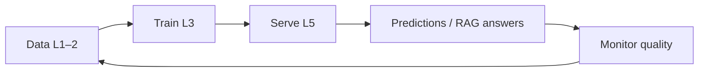
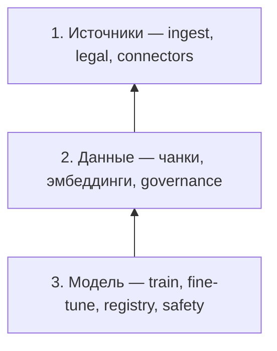
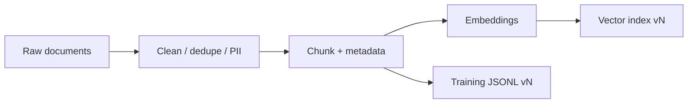
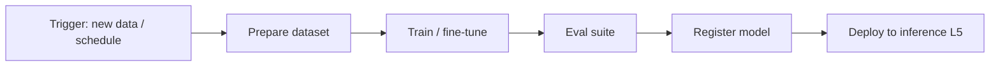

# MLOps и LLM-стек — слои 1–3

  ОБЯЗАТЕЛЬНО

Архитектору
Разработчику
Инженеру
Аналитику

[Семь слоёв LLM-стека](/encyclopedia/6-ai/6-05-razrabotka-ii/119) начинаются с **данных и модели**. **MLOps** (Machine Learning Operations) — дисциплина, которая переводит эксперименты data scientist'а в **повторяемые пайплайны**: версионирование датасетов, автоматическое обучение, registry моделей, мониторинг drift и безопасный вывод в prod.

Для LLM-продуктов MLOps на слоях **1–3** питает всё, что выше: RAG-индекс, fine-tuned adapter, eval-набор для [AgentOps на слоях 4–7](./1). Плохой слой 2 → галлюцинации на L7, как бы ни был настроен агент.

  
MLOps и DevOps

  

  DevOps ([8.04](/encyclopedia/8-infra-security/8-04-devops-ci-cd/intro)) доставляет **код и контейнеры**. MLOps добавляет **данные и веса** как first-class артефакты с lineage и reproducibility. AgentOps ([обзор](/encyclopedia/8-infra-security/8-04-devops-ci-cd/2151)) начинается там, где модель **принимает решения** в runtime.
  

---

## Теоретические основы MLOps

**MLOps** формализует идею, что модель машинного обучения — **не статичный артеfact**, а **процесс**: данные меняются, распределение запросов смещается, бизнес-правила обновляются, а веса, обученные на вчерашнем корпусе, завтра дают другой error rate. Классическая разработка ПО опирается на детерминизм: один и тот же бинарник при одних входах ведёт себя одинаково. ML-система **стохастична** на этапе обучения и **чувствительна к сдвигу входов** на этапе inference — это требует отдельной операционной дисциплины.

### Три столпа MLOps

| Столп | Смысл | В LLM-стеке (L1–3) |
|-------|-------|---------------------|
| **Reproducibility** | Любой эксперiment можно повторить по hash данных, кода и seed | DVC + git commit + frozen embedding model |
| **Automation** | Train, eval, deploy, reindex — без ручных «скопируй csv» | Scheduled pipelines, CI for ML |
| **Monitoring** | Drift, quality, cost — с триггером на retrain/reindex | nDCG drop, sync lag, eval regression |

### ML-система как feedback loop

Петля замкнута **метриками качества**: в классическом ML — accuracy, AUC; в RAG — grounded answer rate, citation hit rate; в fine-tuned LLM — win-rate против baseline. Без замкнутого контура MLOps превращается в одноразовый train-and-forget.

### CRISP-ML и TDSP

**CRISP-DM** (Cross-Industry Standard Process for Data Mining) — шесть фаз: Business Understanding → Data Understanding → Data Preparation → Modeling → Evaluation → Deployment. **CRISP-ML(Q)** добавляет явный **Quality Assurance** и цикл мониторинга после деплоя.

**TDSP** (Team Data Science Process от Microsoft) разбивает проект на **инкременты** с checkpoint'ами: каждый спринт заканчивается воспроизводимым pipeline и отчётом eval. Для LLM-проекта типичный инкремент — «новый источник wiki + reindex + regression eval», а не «переобучили всё с нуля».

Связь с аналитикой — [CRISP-DM и MLOps](/encyclopedia/3-data-markup/3-11-analiz-dannyh/2).

### Data-centric AI

Andrew Ng и сообщество **data-centric AI** подчёркивают: при фиксированной архитектуре модели **качество данных** чаще даёт больший выигрыш, чем очередной sweep гиперпараметров. В LLM-продукте это означает инвестиции в L1–2 (чистый corpus, хорошие чанки, актуальный индекс) **раньше**, чем в очередной LoRA-rank.

Операционный вывод: команда MLOps тратит время на **data quality gates**, **lineage** и **labeling pipeline**, потому что «мусор на входе» на L7 выглядит как «модель галлюцинирует».

### Артеfact'ы MLOps vs DevOps

| DevOps | MLOps (дополнительно) |
|--------|------------------------|
| Git commit | + dataset hash, model version |
| Docker image | + weights, tokenizer, index snapshot |
| Unit test | + data validation, eval metrics threshold |
| Rollback tag | + previous index alias, previous checkpoint ID |

Теория **immutable infrastructure** переносится на **immutable datasets**: raw zone append-only; transform порождает новую версию, старая остаётся для audit и rollback.

---

## Карта MLOps на слоях 1–3

| Слой | Архитектурный вопрос ([Семь слоёв LLM-стека](/encyclopedia/6-ai/6-05-razrabotka-ii/119)) | Вопрос MLOps |
|------|------------------------------------------------------------------------|--------------|
| **1. Источники** | Откуда сырьё? | Как **собирать**, **легализовать** и **расписать** обновления? |
| **2. Данные** | Как готовим датасет и индекс? | Как **версионировать**, **валидировать** и **переиндексировать**? |
| **3. Модель** | Какую базу и адаптацию? | Как **тренировать**, **регистрировать** и **катить** checkpoint? |

---

## Эволюция — от ML к MLOps

| Этап | Проблема | Решение |
|------|----------|---------|
| Notebook-only | «У меня работает» на ноутбуке | Reproducible pipelines |
| Ручной deploy | Pickle на FTP | Model registry + CI |
| Data drift | Модель деградирует молча | Monitoring + retrain trigger |
| LLM era | Prompt + RAG + LoRA | Unified lineage data ↔ model ↔ eval |

MLOps formalized практики, которые раньше жили в Kaggle и академии: **experiment tracking**, **feature/data stores**, **automated retraining**. Для LLM акцент сместился с batch scoring на **retrieval quality** и **adapter lifecycle**, но принципы те же.

### Три волны ML в production

**Первая волна (до ~2015)** — batch scoring: модель обучили offline, раз в квартал пересчитали скоры, выгрузили в CRM. Ops минимален; drift замечали по жалобам бизнеса.

**Вторая волна (2015–2022)** — online inference, feature stores, real-time fraud и рекомендации. Появились Kubeflow, MLflow, мониторинг drift, A/B моделей.

**Третья волна (2022–сейчас)** — foundation models + RAG + adapters. Train смещается к **curate data** и **eval prompts/chains**; «модель» часто арендуется по API, а собственный IP — **индекс, LoRA, eval suite**.

### Стохастичность и воспроизводимость

Обучение нейросети зависит от **seed**, порядка батчей, floating-point nondeterminism на GPU. MLOps фиксирует:

- `random_seed`, версию CUDA/cuDNN;
- exact docker image training job;
- hash training script **и** hash train split.

Полный bitwise-reproducibility на GPU часто недостижим; операционная цель — **statistical reproducibility**: eval metrics на holdout попадают в узкий доверительный интервал при re-run.

---

## Слой 1 — источники данных и сбор

Задача — **достать** контент в контур компании с понятным **владельцем**, **расписанием** и **правом использования**.

### Каналы ingestion

- корпоративные wiki, SharePoint, Confluence;
- тикеты (Jira, Zendesk), CRM, ERP;
- репозитории кода и `docs/`;
- логи приложений (для analytics copilot — с осторожностью);
- открытые датасеты и licensed feeds;
- веб-краулинг (robots.txt, ToS);
- API партнёров и internal microservices.

Интеграционные паттерны — [интеграционное взаимодействие](/encyclopedia/2-system-network/2-09-osnovy-integratsionnogo-vzaimodeystviya/intro).

### MLOps на L1

| Практика | Зачем |
|----------|-------|
| **Data contract** | SLA источника: частота sync, schema, owner |
| **Legal / compliance** | Лицензия на обучение и inference; GDPR erase |
| **Ingestion pipeline** | Airflow, Dagster, dbt, Fivetran — idempotent jobs |
| **Raw zone** | Immutable copy в lake (S3, ADLS) до трансформаций |
| **Catalog** | DataHub, Alation — «что за таблица `support_tickets_v2`» |
| **PII tagging** | Метка чувствительности до попадания в LLM |

### Расписание и freshness

RAG с индексом **месячной** давности отвечает по устаревшей политике. MLOps фиксирует:

- `last_synced_at` per source;
- alert если sync failed &gt; N hours;
- dependency graph: «Confluence space HR → index chunk_set_hr».

### Типичные ошибки L1

- «скопировали папку с диска» без owner;
- смешали prod и test данные в одном corpus;
- забыли исключить `.env` и credentials из crawl;
- нет механизма **delete** при GDPR request.

### Теория data ingestion

**Lambda architecture** (batch + speed layer) в LLM-контуре часто выглядит так: **batch** — nightly full sync в raw lake; **speed** — webhook на новый Confluence page → incremental chunk. MLOps выбирает компромисс **latency freshness vs cost**: каждый incremental embed стоит денег; каждый day-old index — риск wrong answer.

**Data contract** (концепция из data mesh) — формальный документ между **producer** (владелец Jira) и **consumer** (RAG pipeline): schema полей, SLA обновления, semantics «closed ticket» vs «resolved». Нарушение контракта — alert MLOps, не «тихий» баг retrieval.

**Правовая база**: training vs inference rights могут различаться (лицензия Common Crawl ≠ корпоративный SharePoint). На L1 юридическая классификация — часть pipeline metadata, иначе compliance-инцident на L7.

---

## Слой 2 — предобработка и управление данными

Сырой поток превращают в **версионируемые** артефакты для RAG и обучения.

### Pipeline подготовки

### Чанкинг и метаданные

| Решение | Влияние |
|---------|---------|
| Размер чанка 256 vs 1024 | Precision/recall retrieval |
| Overlap 0 vs 128 | Связность абзацев |
| Split by heading vs fixed window | Качество citation |
| Metadata (author, date, product) | Filtered search |

Изменение политики чанкинга = **новая версия индекса** — reindex job, не «hot patch».

### Версионирование данных

| Инструмент | Роль |
|------------|------|
| **DVC** | Git-like для больших файлов + pipeline stages |
| **LakeFS** | Branch/commit на data lake |
| **Delta / Iceberg** | ACID таблицы, time travel |
| **Hugging Face Datasets** | Hub для NLP corpora |

Lineage: «index v47 ← embedding model e5-v2 ← chunk_policy_512 ← raw_confluence_2025-05-30».

### Vector index operations

[Векторные БД](/encyclopedia/3-data-markup/3-06-nosql/812) — Pinecone, Qdrant, pgvector, Weaviate.

MLOps задачи:

- **blue/green index** — новый index параллельно, switch alias;
- **embedding model upgrade** — full re-embed (дорого, планируется);
- **eval retrieval** — nDCG, MRR на labeled query set;
- **access control** — tenant_id в metadata filter.

### Data quality gates

Перед publish index vN в prod:

- % пустых чанков &lt; threshold;
- duplicate ratio;
- language detection sanity;
- spot-check 50 random chunks human review;
- regression eval vs index vN-1.

### Governance

- кто может добавить source в prod corpus;
- audit log read access к sensitive collections;
- retention: удаление тикетов старше 3 лет → reindex.

Подготовка для fine-tuning — [Основы разработки ИИ](/encyclopedia/6-ai/6-05-razrabotka-ii/1).

### Теория retrieval и эмбеддингов

RAG на L2 опирается на **dense retrieval**: запрос и документ mapped в общее d-мерное векторное пространство **R**^d; близость — cosine similarity или dot product. Качество retrieval задаёт **верхнюю границу** качества ответа: если gold passage не попал в top_k, модель на L4 **не может** честно процитировать источник ([ограничения LLM](/encyclopedia/6-ai/6-01-vvedenie-v-ii/1)).

**Метрики IR** (Information Retrieval):

| Метрика | Формула / смысл | MLOps use |
|---------|-----------------|-----------|
| **Precision@k** | Доля релевантных среди top-k | Мало шума в контексте |
| **Recall@k** | Доля найденных релевантных | Полнота для сложных вопросов |
| **MRR** | Mean Reciprocal Rank первого hit | FAQ-сценарии |
| **nDCG** | Учёт градаций релевантности | Ranking с reranker |

**Hybrid search** (BM25 + dense) теоретически снижает risk «semantic drift»: редкие SKU и error codes лучше ловит lexical match, параграфы смысла — embedding.

**Chunking как bias**: fixed window вносит **structural bias** — таблица разрезана пополам, заголовок оторван от тела. MLOps A/B тестирует chunk policies так же, как A/B тестируют модели.

### Embedding drift

Смена embedding-модели (`e5-small` → `e5-large`) меняет геометрию пространства — **полный re-embed обязателен**. Старые и новые векторы **несопоставимы** без cross-encoder recalibration. Это операционное событие уровня major release, с eval gate и rollback alias.

---

## Слой 3 — модель и обучение

Выбор foundation-модели и **адаптация** под домен — с experiment tracking и registry.

### Спектр адаптации

| Глубина | MLOps overhead | Когда |
|---------|----------------|-------|
| API-only (GPT, Claude) | Низкий | Старт, general tasks |
| RAG без training | Средний (L2) | Корпоративный QA |
| LoRA / QLoRA SFT | Высокий | Tone, format, domain terms |
| Full fine-tune | Очень высокий | Редко, узкий домен |
| Pre-training | Экстремальный | Гипerscale only |

[Обучение на базе готовой модели](/encyclopedia/6-ai/6-02-mashinnoe-obuchenie/3) — transfer learning vs fine-tuning.

### Experiment tracking

Каждый run фиксирует:

- git commit training script;
- dataset version (DVC hash);
- hyperparameters (lr, epochs, rank LoRA);
- metrics (loss, eval perplexity, task accuracy);
- hardware (A100 x 4, 6h);
- **artifact** — adapter weights, merged checkpoint.

| Платформа | Сильные стороны |
|-----------|-----------------|
| **MLflow** | Open source, registry, deployment |
| **Weights & Biases** | UX, sweeps, artifacts |
| **Neptune** | Enterprise experiment mgmt |
| **Azure ML / Vertex** | Managed cloud pipelines |

### Model registry

Стадии: `Staging` → `Production` → `Archived`.

Промotion в Production требует:

- eval на holdout **и** golden AgentOps set (связь с [L4 eval](./1));
- safety / red-team pass для regulated domains;
- sign-off owner;
- rollback plan (previous registry version).

### Training pipelines (CI for ML)

Orchestration: Kubeflow Pipelines, Metaflow, SageMaker Pipelines, Azure ML jobs.

### Safety и compliance tuning

- RLHF / RLAIF для preference;
- red-team datasets;
- refusal behavior on jailbreak prompts;
- documentation model card (bias, limits, training data summary).

### Optimization artifacts

- **Quantization** GGUF / GPTQ / AWQ — для edge и cost;
- **Distillation** — smaller student model;
- **Merge LoRA** into base before deploy — [Развёртывание и обслуживание ИИ-моделей](/encyclopedia/6-ai/6-05-razrabotka-ii/111).

### Теория fine-tuning и generalization

**Transfer learning**: foundation model уже содержит общие представления языка; fine-tuning (SFT, LoRA) сдвигает decision boundary в **узком домене** — тон поддержки, формат JSON-ответа, внутренний жargon.

**Bias–variance** в операционном виде:

- **Underfitting** (high bias) — модель игнорирует домен; лечится данными и SFT.
- **Overfitting** (high variance) — отлично на train JSONL, плохо на live queries; лечится regularization, больше diverse data, early stopping.

**Catastrophic forgetting** — при агрессивном fine-tune модель теряет общие способности. MLOps mitigates: LoRA вместо full weights, mixed general+domain batches, eval **и** на general benchmark **и** на domain.

**RLHF / RLAIF** — оптимизация под **preference** (человек или AI-judge выбирает лучший из двух ответов). Операционно это отдельный pipeline с versioning reward model и safety regression suite.

### Pre-training vs adaptation — экономика

Pre-training LLM с нуля — капиталоёмкий процесс (GPU-months, данные terabyte scale). MLOps большинства компаний **останавливается на адаптации**: API + RAG + optional LoRA. Теоретически pre-training нужен только при уникальном языке/модальности или стратегической независимости от vendor.

---

## MLOps automation pipeline

Аналог AgentOps-цикла для нижних слоёв:

| Стадия | L1 | L2 | L3 |
|--------|----|----|-----|
| **Observe** | Sync lag, ingest errors | Index size, query latency | Train loss, GPU util |
| **Metrics** | Freshness SLA | nDCG, duplicate % | Eval accuracy, calibration |
| **Detect** | Source offline | Retrieval regression | Overfit, eval drop |
| **Root cause** | API token expired | Bad chunk policy | Data leak in train set |
| **Optimize** | Retry sync | Tune chunk / embed model | Hyperparam sweep |
| **Automate** | Auto-disable source | Scheduled reindex | Retrain trigger on drift |

**Data drift** — распределение live queries ≠ train; **concept drift** — меняются правила бизнеса. Trigger retrain или reindex по порогам.

### Теория drift

| Тип | Определение | Пример в LLM/RAG |
|-----|-------------|------------------|
| **Covariate drift** | $P(X)$ изменилось, $P(Y|X)$ stable | Новые продукты в каталоге, те же типы вопросов |
| **Prior drift** | $P(Y)$ изменилось | После релиза чаще спрашивают про billing |
| **Concept drift** | $P(Y|X)$ изменилось | «Refund» теперь означает другой процесс после смены политики |

**Detection**: statistical tests (KS, PSI) на embedding запросов; drop nDCG на labeled set; рост «I don't know» rate.

**Response policy**:

- covariate → reindex / augment corpus;
- concept → retrain LoRA или обновить prompts/guardrails на L4 ([AgentOps](./1));
- prior → capacity planning, routing, FAQ update.

### Уровни зрелости MLOps

| Уровень | Характеристика |
|---------|----------------|
| 0 | Notebooks, ручной deploy |
| 1 | Versioned data + automated train script |
| 2 | CI eval, model registry, staged rollout |
| 3 | Automated drift detection, retrain/reindex triggers |
| 4 | Continuous eval in prod, closed loop с AgentOps L7 feedback |

---

## Инструменты MLOps

### Data и pipelines

| Инструмент | Назначение |
|------------|------------|
| **DVC** | Version data + ML pipeline |
| **Airflow / Dagster / Prefect** | Orchestration |
| **dbt** | SQL transforms в warehouse |
| **Great Expectations / Soda** | Data quality tests |
| **Feast / Tecton** | Feature store (classic ML; частично для LLM features) |

### Training и registry

| Инструмент | Назначение |
|------------|------------|
| **MLflow** | Experiments + Model Registry |
| **W&B** | Tracking, artifacts, sweeps |
| **Hugging Face Hub** | Models + datasets hosting |
| **Kubeflow** | K8s-native ML workflows |
| **Ray Train** | Distributed training |

### LLM-specific

| Инструмент | Назначение |
|------------|------------|
| **LangSmith Datasets** | Eval pairs для chains |
| **Argilla / Label Studio** | Human annotation SFT |
| **Unstructured / LlamaIndex ingest** | Document → chunks |
| **Haystack / txtai** | RAG pipeline frameworks |

### Monitoring

| Инструмент | Назначение |
|------------|------------|
| **Evidently AI** | Data drift reports |
| **WhyLabs** | ML observability |
| **Arize / Fiddler** | Model monitoring |

Deploy inference — [Развёртывание моделей](/encyclopedia/6-ai/6-05-razrabotka-ii/111); classic DevOps — [контейнеризация](/encyclopedia/8-infra-security/8-06-konteynerizatsiya-i-orkestratsiya/intro).

---

## Связь MLOps → AgentOps

| MLOps output (L1–3) | AgentOps consumer (L4–7) |
|---------------------|--------------------------|
| Index `support_v12` | RAG tool в agent L4 |
| LoRA `billing-tone-v3` | Model route L5 |
| Eval set `agent_golden_50` | CI gate L4 |
| Data freshness SLA | Answer quality L7 |

Runbook при деградации качества:

1. AgentOps trace показывает low retrieval score → **L2**.
2. Check index version, last reindex → **MLOps**.
3. Fix chunk / re-embed → promote index → **AgentOps** re-run eval.

Подробно по верхним слоям — [AgentOps — слои 4–7](./1).

---

## MLOps vs DevOps vs AgentOps

| | DevOps | MLOps (L1–3) | AgentOps (L4–7) |
|---|--------|--------------|-----------------|
| Главный артеfact | Code | Data, weights | Traces, prompts, policies |
| Тест | Unit, integration | Data validation, eval metrics | Tool sequence, task success |
| Rollback | Previous image | Previous index / checkpoint | Previous prompt version |
| Owner | Platform / dev | Data + ML engineer | ML platform + product |

---

## Governance и model cards

**Model card** (Mitchell et al., Google) — документ прозрачности: intended use, limitations, training data summary, eval results, ethical considerations. В MLOps model card **версионируется** вместе с checkpoint и **блокирует** promotion без заполнения mandatory fields.

**Data sheet for datasets** — аналог для L1–2: provenance, consent, known biases, recommended use. Для RAG corpus «data sheet» отвечает на вопрос: «можно ли этим индексом отвечать клиентам tier-1?»

**Lineage graph** (OpenLineage, Marquez): каждый chunk в index v47 **ссылкой** на raw file, transform job, embedding run. При GDPR delete user_id=123 lineage находит **все** производные chunks для purge.

**RBAC на данные**: engineer может reindex staging; prod index promotion — role `ml-platform-admin`. Теория **least privilege** переносится с SecOps на data plane.

---

## Минимальный MLOps для RAG-MVP

1. **L1** — 1–2 источника с owner; nightly sync; raw backup.
2. **L2** — chunk policy в git; pgvector index; manual reindex script + version tag.
3. **L3** — API foundation model; опционально LoRA позже.
4. **Eval** — 20 вопросов с expected doc_id; гонять после каждого reindex.

---

## Роли

| Слой | Роли |
|------|------|
| L1 | Data engineer, integration dev |
| L2 | ML engineer, data analyst |
| L3 | ML engineer, researcher |

При росте — отдельная **ML platform** команда и shared feature/index services.

---

## Маршрут чтения

| # | Статья |
|---|--------|
| 1 | [Семь слоёв LLM-стека](/encyclopedia/6-ai/6-05-razrabotka-ii/119) |
| 2 | [Машинное обучение](/encyclopedia/6-ai/6-02-mashinnoe-obuchenie/1) |
| 3 | [Основы разработки ИИ](/encyclopedia/6-ai/6-05-razrabotka-ii/1) |
| 4 | [Векторные БД](/encyclopedia/3-data-markup/3-06-nosql/812) |
| 5 | [AgentOps — слои 4–7](./1) |
| 6 | [Развёртывание моделей](/encyclopedia/6-ai/6-05-razrabotka-ii/111) |

---

## См. также

- [AgentOps — о разделе](./intro)
- [AgentOps — DevOps обзор](/encyclopedia/8-infra-security/8-04-devops-ci-cd/2151)
- [CRISP-DM и MLOps](/encyclopedia/3-data-markup/3-11-analiz-dannyh/2) — жизненный цикл аналитики

{/* sidebar-collections */}

---

## В подборках

Статья входит в [тематические подборки](/about/collections) и блок «С чего начать?» на [главной](/). Соседние шаги того же маршрута:

**ИИ для разработчика** — [AgentOps и MLOps — о разделе](/encyclopedia/6-ai/6-08-agentops/intro), [Трансформеры и NLP — о разделе](/encyclopedia/6-ai/6-09-transformery-i-nlp/intro), [Вайб-кодинг](/encyclopedia/6-ai/6-07-vayb-koding-i-neurokontent/1), [Разработка и отладка — о разделе](/encyclopedia/4-code-dev/4-14-razrabotka-i-otladka/intro), [Вайб-кодинг и нейроконтент — о разделе](/encyclopedia/6-ai/6-07-vayb-koding-i-neurokontent/intro), [Low-code, No-code — о разделе](/encyclopedia/8-infra-security/8-02-low-code-no-code/intro).

{/* /sidebar-collections */}

---
