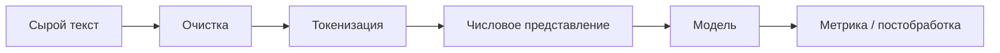

# NLP и работа с текстом

  ОБЯЗАТЕЛЬНО
  ДЛЯ НОВИЧКОВ

Разработчику

**Natural Language Processing (NLP)** — область ИИ, где вход и выход — **естественный язык**: предложения, абзацы, диалоги, документы. В отличие от табличного машинного обучения ([Scikit-learn](/encyclopedia/6-ai/6-02-mashinnoe-obuchenie/10)), текст **не подаётся** в модель как набор числовых столбцов без предварительной обработки. Сначала его нормализуют, разбивают на токены, превращают в числа — и только потом обучают или вызывают нейросеть.

С 2017 года доминирующая архитектура для NLP — **трансформер** ([следующая статья](./2)). До неё широко применялись bag-of-words, TF-IDF, рекуррентные сети (RNN, LSTM). Эти методы остаются полезны для baseline и узких задач, но для качества на сложном языке сегодня почти всегда берут предобученный трансформер.

---

## Задачи NLP

| Задача | Вход | Выход | Пример |
|--------|------|-------|--------|
| **Классификация текста** | Документ или фраза | Метка класса | Спам / не спам, категория тикета |
| **NER** (Named Entity Recognition) | Текст | Метки сущностей | Имя, организация, дата |
| **Тональность** | Отзыв, пост | positive / negative / neutral | Анализ отзывов |
| **Машинный перевод** | Текст на языке A | Текст на языке B | en → ru |
| **Суммаризация** | Длинный документ | Краткий пересказ | Новостная выжимка |
| **QA** (question answering) | Вопрос + контекст | Ответ или span | Поиск по документу |
| **Генерация** | Промпт или префикс | Продолжение текста | Чат-бот, дополнение кода |
| **Извлечение отношений** | Пара сущностей + контекст | Тип связи | «работает в», «основан» |

Многие продуктовые системы комбинируют несколько задач: чат-бот классифицирует намерение, извлекает сущности и генерирует ответ.

---

## От текста к признакам

Классический pipeline NLP:

**Очистка** — Unicode, лишние пробелы, приведение регистра (если уместно), удаление HTML-разметки, нормализация дат и чисел по правилам домена.

**Токенизация** — разбиение на единицы для модели: символы, слова или **подслова** (BPE, WordPiece, SentencePiece). Современные LLM почти всегда используют subword — см. [Большие языковые модели](/encyclopedia/6-ai/6-04-modeli-i-instrumenty/1#от-текста-к-числам--как-llm-видит-строку).

**Числовое представление** — ID токенов, one-hot (редко), эмбеддинги, контекстуальные векторы после прохода через трансформер.

---

## Корпуса и разметка

Модель учится на **корпусах** — больших наборах текстов:

- **Неразмеченные** — веб, книги, Wikipedia, Common Crawl; используются для предобучения (language modeling).
- **Размеченные** — пары «текст — метка», «текст — перевод», span-аннотации для NER; нужны для fine-tuning и оценки.

Для русского языка часто используют

- [Russian SuperGLUE](https://russiansuperglue.com/) и аналоги для бенчмарков;
- корпуса с Hugging Face (`ai-forever/ru`, `sberbank-ai/ru`, RuSentiment и др.);
- внутренние документы компании (с учётом лицензий и персональных данных).

  
Качество данных

  Смещение корпуса (гендер, регион, жаргон) переносится в модель. Перед обучением на внутренних текстах проверяют PII, секреты и баланс классов — как в [кодировании признаков](/encyclopedia/6-ai/6-02-mashinnoe-obuchenie/4) для табличных данных.

---

## Метрики

| Задача | Типичные метрики |
|--------|------------------|
| Классификация | Accuracy, F1, precision, recall, ROC-AUC |
| NER | Entity-level F1 (exact match) |
| Перевод | BLEU, chrF, COMET |
| Суммаризация | ROUGE, BERTScore |
| QA | Exact Match, F1 по span |
| Генерация | Perplexity, human eval, rubric-based eval |

Для генерации одной цифры часто недостаточно — нужны эталонные промпты и ревью человеком или LLM-as-judge с осторожностью к смещению.

---

## Классические baseline и нейросети

**До трансформеров** на практике часто пробовали:

1. **Bag-of-words + TF-IDF** + логистическая регрессия или SVM — быстрый baseline для классификации.
2. **Word2Vec / GloVe / fastText** — статические эмбеддинги слов; для русского есть `fastText` с подсловами.
3. **BiLSTM + CRF** — сильный вариант для NER до появления BERT.
4. **Seq2seq на LSTM** — перевод и суммаризация до Transformer.

Сравнение с трансформерами — в [обзоре архитектур](./5) и [трендах 2018–2021](./7).

---

## Инструменты

| Инструмент | Назначение |
|------------|------------|
| **spaCy** | NER, токенизация, пайплайны, `ru_core_news_*` |
| **NLTK** | обучение, простые корпуса |
| **Hugging Face `transformers`** | предобученные модели, fine-tuning |
| **`datasets`** | загрузка корпусов |
| **`tokenizers`** | быстрые BPE/WordPiece |
| **PyTorch / TensorFlow** | обучение и инференс |

Практика с готовыми чекпоинтами — [статья 6](./6). Сквозной CV+NLP — [распознавание текста](/encyclopedia/6-ai/6-06-primenenie-ii/120).

---

## Дальше

- [Что такое трансформер — архитектура и особенности](./2)
- [Машинное обучение — категории обучения](/encyclopedia/6-ai/6-02-mashinnoe-obuchenie/5) — supervised vs self-supervised в NLP

---
