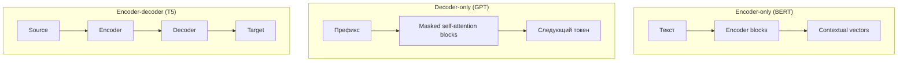

import ExternalPlayEmbed from '@site/src/components/ExternalPlayEmbed';

---

# Что такое трансформер — архитектура и особенности

<div class="article-tags">
  <span class="tag tag-required">ОБЯЗАТЕЛЬНО</span>
  <span class="tag tag-beginner">ДЛЯ НОВИЧКОВ</span>
</div>

<span class="complexity-badge">Всем</span>

<ExternalPlayEmbed example="ai/attention-heatmap-play" title="Self-attention heatmap" minHeight={400} />

<ExternalPlayEmbed example="ai/transformer-block-stepper" title="Блок трансформера" minHeight={460} />

**Transformer** — архитектура нейросети для последовательностей, предложенная в 2017 году в статье [*Attention Is All You Need*](https://arxiv.org/abs/1706.03762) (Vaswani et al.). Она заменила рекуррентные связи **механизмом внимания (attention)** и позволила обучать модели на длинных текстах **параллельно** на GPU.

Трансформер лежит в основе BERT, GPT, T5, современных LLM и многих систем зрения и речи — [обзор семейств](./5), [мультимодальность](./8).

---

## Проблема RNN и место трансформера

**RNN / LSTM** обрабатывают токены **по одному**, передавая скрытое состояние слева направо. Это создаёт три практических ограничения:

- слабая параллелизация на обучении;
- затухание градиента на длинных цепочках;
- трудный доступ к контексту из далёких позиций.

Трансформер на каждом слое **смотрит на все позиции сразу** через attention и строит новое представление каждого токена как взвешенную смесь остальных.

---

## Scaled dot-product attention

Для каждой позиции вычисляют три вектора — **Query (Q)**, **Key (K)**, **Value (V)** — линейными проекциями эмбеддинга.

Веса внимания (scaled dot-product attention):

```
Attention(Q, K, V) = softmax( (Q · K^T) / sqrt(d_k) ) · V
```

- `Q · K^T` — насколько текущая позиция "интересуется" каждой другой;
- деление на `sqrt(d_k)` стабилизирует softmax при большой размерности;
- softmax даёт распределение весов; умножение на $V$ — итоговое смешанное представление.

**Self-attention** — Q, K, V берутся из **одной и той же** последовательности (текст анализирует сам себя).

**Cross-attention** — Q из декодера, K и V из энкодера (перевод: декодер "смотрит" на исходное предложение).

---

## Multi-head attention

Один head учит один тип связей. **Multi-head attention** запускает несколько независимых head параллельно, конкатенирует результаты и прогоняет через линейный слой.

Типичная интерпретация (упрощённо):

- один head — синтаксис (подлежащее ↔ сказуемое);
- другой — coreference ("она" ↔ "Мария");
- третий — тематическая близость.

На практике head'ы **не размечены вручную** — паттерны возникают при обучении.

---

## Блок трансформера

Каждый слой (encoder или decoder block) содержит:

1. **Multi-head self-attention** (+ residual + LayerNorm)
2. **Feed-forward network (FFN)** — два линейных слоя с активацией (GELU/ReLU), применяется **к каждой позиции отдельно**
3. Снова residual + LayerNorm

**Residual connection** (`x + SubLayer(x)`) облегчает градиентный поток в глубоких сетях (десятки и сотни слоёв).

**Layer normalization** стабилизирует активации внутри блока.

---

## Positional encoding

Self-attention **инвариантен к перестановке** токенов без дополнительной информации о порядке. Поэтому к эмбеддингам добавляют **позиционное кодирование** — синусоиды (в оригинальной статье) или обучаемые **positional embeddings** (в GPT, BERT).

---

## Encoder, decoder и три семейства моделей



| Схема | Механизм | Типичные задачи |
|-------|----------|-----------------|
| **Encoder-only** | Двусторонний контекст (MLM) | Классификация, NER, embedding |
| **Decoder-only** | Causal mask — только прошлые токены | Генерация, чат, код |
| **Encoder-decoder** | Cross-attention | Перевод, суммаризация |

**Causal (маскированное) self-attention** в декодере запрещает позиции "видеть будущее" — иначе модель подсмотрела бы ответ при обучении language modeling.

Подробный разбор семейств — [статья 5](./5).

---

## Ключевые особенности

| Особенность | Следствие |
|-------------|-----------|
| Параллелизм по длине | Быстрое обучение на GPU/TPU |
| Прямые связи между любыми токенами | Лучше длинные зависимости, чем у vanilla RNN |
| Квадратичная сложность по длине `O(n²)` | Узкое место для очень длинных документов → Longformer, FlashAttention |
| Большое число параметров | Нужны большие корпуса и regularization |
| Контекстуальные эмбеддинги | Одно слово — разные векторы в разных предложениях |

---

## Связь с LLM

GPT-подобные LLM — **стек decoder-only блоков** + causal LM на предобучении. BERT давал сильные **encoder**-эмбеддинги для понимания; GPT — **генерацию**. Современные чаты (GPT-4, Claude, Llama) — масштабирование decoder-only + instruction tuning + RLHF.

Теория и код блока attention — [следующая статья](./3). Практика Hugging Face — [статья 6](./6).

---

## Дальше

- [Устройство трансформеров — теория и практика с нуля](./3)
- [Контекст — эмбеддинги и окно](/encyclopedia/6-ai/6-01-vvedenie-v-ii/113)

---
