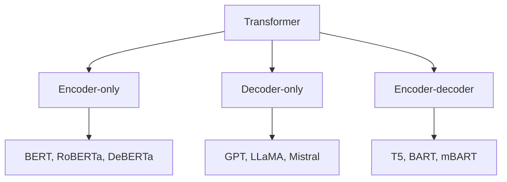

# Обзор и разбор трансформерных архитектур

  ОБЯЗАТЕЛЬНО

Разработчику

После [*Attention Is All You Need*](https://arxiv.org/abs/1706.03762) (2017) появилось **семейство** архитектур с общим каркасом attention + FFN, но разными схемами обучения и блоков. Ниже — карта основных линий; хронология breakthrough'ов — [тренды 2018–2021](./7).

---

## Три оси классификации

| Ось | Варианты |
|-----|----------|
| **Topology** | encoder / decoder / both |
| **Objective** | MLM, CLM, span corruption, denoising |
| **Scale** | tiny (millions) → frontier (100B+) |

---

## Encoder-only

### BERT (2018)

**Bidirectional Encoder Representations from Transformers** — encoder + **Masked Language Modeling (MLM)** + **Next Sentence Prediction (NSP)**.

- случайные 15% токенов маскируют; модель восстанавливает их с учётом **обеих** сторон контекста;
- сильные **sentence / token embeddings** для классификации и NER;
- типичный fine-tune — добавить head на `[CLS]` или на каждый token.

### RoBERTa (2019)

Пересмотр рецепта BERT: больше данных, динамическое маскирование, без NSP, длиннее обучение. Часто **строго лучше** BERT при том же размере.

### ALBERT (2019)

**Factorized embeddings** + **cross-layer parameter sharing** — меньше параметров, сравнимое качество; дольше обучение на step.

### DeBERTa (2020)

Disentangled attention — отдельные представления для содержания и позиции; улучшение на GLUE и SuperGLUE.

### DistilBERT (2019)

**Дистилляция** BERT в модель ~40% размера, ~60% скорости, ~97% качества — edge и latency-sensitive сервисы.

---

## Decoder-only

### GPT (2018–2020)

**Generative Pre-trained Transformer** — только decoder, **causal language modeling** (предсказание следующего токена).

| Версия | Параметры | Заметка |
|--------|-----------|---------|
| GPT-1 | 117M | Transfer + fine-tune |
| GPT-2 | 1.5B | Zero-shot emergent abilities |
| GPT-3 | 175B | In-context learning, few-shot |

Современные LLM (GPT-4, Claude, Llama 3, Gemma) — та же **decoder-only** линия + RLHF, MoE, длинный контекст.

### LLaMA / Mistral / Qwen

Открытые или частично открытые decoder-only модели; Llama — RMSNorm, SwiGLU, RoPE; Mistral — sliding window attention; Qwen — сильный multilingual.

---

## Encoder-decoder

### T5 (2019)

**Text-to-Text Transfer Transformer** — **все задачи как текст**: `"translate English to German: …"`, `"summarize: …"`. Обучение — **span corruption** (Random spans → `<extra_id>` tokens).

Удобен, когда вход и выход — **разные** тексты (перевод, суммаризация).

### BART (2019)

Denoising autoencoder — шумят текст (shuffle, mask, delete), модель восстанавливает. Сильная **генеративная** seq2seq альтернатива T5.

### mBART / mT5

Мультиязычные варианты — перевод и cross-lingual transfer, важны для **русского** в связке с английским.

---

## Длинный контекст

Стандартный attention — $O(n^2)$ по памяти. Обходы:

| Модель / техника | Идея |
|------------------|------|
| **Longformer / BigBird** | Sparse attention — local + global tokens |
| **Linformer / Performer** | Аппроксимация attention |
| **FlashAttention** | IO-aware exact attention на GPU |
| **RoPE + YaRN / NTK** | Экstrapolation позиций для LLM |

---

## Как выбрать архитектуру

| Задача | Первая гипотеза |
|--------|-----------------|
| Классификация, NER, embedding | Encoder (BERT, RuBERT, e5) |
| Чат, генерация, код | Decoder (GPT, Llama, Qwen) |
| Перевод, суммаризация seq2seq | T5, BART, mT5 |
| Мало VRAM, latency | DistilBERT, TinyBERT, `rubert-tiny` |
| Длинный документ | Longformer, RAG + chunking, long-context LLM |

  
С 2022 года

  Многие продуктовые задачи «понимания» решают <strong>промптом</strong> к большой decoder-only LLM или RAG вместо fine-tune BERT. Классические encoder-модели остаются дешевле на inference и предсказуемее для узкой классификации.

---

## Сравнение objective

| Objective | Модели | Направление контекста |
|-----------|--------|------------------------|
| MLM | BERT, RoBERTa | Двусторонний (на masked позициях) |
| CLM | GPT, Llama | Только слева направо |
| Span corruption | T5 | Encoder видит corrupted, decoder генерирует |
| Denoising | BART | Восстановление исходного текста |

---

## Дальше

- [Тренды NLP 2018–2021](./7) — хронология и бенчмарки
- [Предобученные модели на практике](./6)
- [Мультимодальные трансформеры](./8)

---
