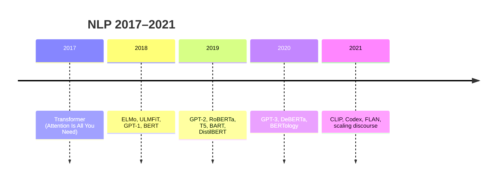

# Современные тренды в NLP (2018–2021)

  НЕ ОБЯЗАТЕЛЬНО

Разработчику

Период **2018–2021** задал современный NLP: **pre-training + fine-tuning**, доминирование **Transformer**, бенчмарки **GLUE / SuperGLUE**, рост **масштаба** до GPT-3. Ниже — хронология ключевых работ и идей; архитектурные детали — [обзор семейств](./5).

Общая история ИИ шире — [статья про историю](/encyclopedia/6-ai/6-01-vvedenie-v-ii/11). После 2021 — instruction tuning, ChatGPT, RAG; см. [LLM](/encyclopedia/6-ai/6-04-modeli-i-instrumenty/1).

---

## Линия времени

---

## 2017 — фундамент

**Transformer** (Vaswani et al.) — self-attention без RNN; machine translation SOTA на WMT. Все последующие тренды — вариации этого каркаса ([статья 2](./2)).

---

## 2018 — «ломаем» pipeline feature engineering

| Работа | Идея | Влияние |
|--------|------|---------|
| **ELMo** | BiLSTM embeddings от языковой модели | Контекстные векторы до BERT |
| **ULMFiT** | LM pre-train + fine-tune классификатора | Рецепт transfer для NLP |
| **GPT-1** | Transformer decoder + LM + task fine-tune | Линия генеративных LLM |
| **BERT** | MLM + encoder | SOTA на GLUE; волна «BERT для всего» |

**GLUE** (General Language Understanding Evaluation) — набор задач (NLI, similarity, QA) и единый leaderboard. Соревнование за доли процента на GLUE стимулировало RoBERTa, ALBERT, DeBERTa.

---

## 2019 — масштаб данных и text-to-text

- **GPT-2** — больше параметров и данных; дискуссия о «слишком опасной» генерации; emergent zero-shot на некоторых задачах.
- **RoBERTa** — «BERT done right»; снятие NSP, dynamic masking.
- **T5** — унификация задач как **text-to-text**; mT5 для multilingual.
- **BART** — denoising seq2seq.
- **DistilBERT, TinyBERT, MobileBERT** — сжатие для prod.
- **XLNet** — permutation LM (альтернатива MLM/CLM).

Тренд: **одна архитектура — много задач** через fine-tune или prompt.

---

## 2020 — масштаб параметров и few-shot

### GPT-3 (175B)

Показал **in-context learning** — без gradient update модель решает задачу по **примерам в промпте** (few-shot). Порог, после которого «размер имеет значение», стал инженерной максимой (**scaling laws** — Kaplan et al., 2020).

### Другие вехи

- **DeBERTa**, **ELECTRA** — эффективнее BERT на SuperGLUE.
- **RAG** (Lewis et al.) — retrieval + generator; мост к продуктовым QA.
- **Wav2Vec 2.0** — self-supervised speech → трансформерный NLP для аудио ([статья 8](./8)).

**SuperGLUE** — более сложный бенчмарк после «насыщения» GLUE human-level.

---

## 2021 — мультимодальность и instruction

| Работа | Суть |
|--------|------|
| **CLIP** | Совместное обучение текста и изображений; zero-shot classification |
| **DALL·E** | Текст → изображение через transformer |
| **Codex** | GPT на коде → GitHub Copilot |
| **FLAN** | Instruction fine-tuning на множестве задач |
| **LoRA** (Hu et al., 2021) | PEFT — дешёвый fine-tune больших моделей |

К концу 2021 индустрия готовилась к **chat-first** продуктам (ChatGPT — конец 2022).

---

## Смена парадигм (итог периода)

| Было (до 2017) | Стало (2018–2021) |
|----------------|-------------------|
| Feature engineering (n-grams, POS) | End-to-end neural |
| Одна модель на задачу | Pre-train once, fine-tune many |
| RNN/LSTM | Transformer |
| Миллионы параметров | Миллиарды (GPT-3) |
| Supervised only | Self-supervised LM на web-scale |

---

## Бенчмарки, которые стоит знать

| Бенчмарк | Что измеряет |
|----------|--------------|
| **GLUE / SuperGLUE** | Понимание текста (EN) |
| **Russian SuperGLUE** | То же для русского |
| **SQuAD** | Extractive QA |
| **WMT** | Machine translation |
| **XNLI** | Cross-lingual NLI |
| **Perplexity** | Качество LM (ниже — лучше) |

Leaderboard'ы на [paperswithcode.com](https://paperswithcode.com/) и Hugging Face — ориентир, но **не замена** eval на ваших данных.

---

## Что пришло после 2021 (кратко)

- **ChatGPT / instruction models** — UX чата вместо fine-tune head.
- **RLHF / DPO** — выравнивание под предпочтения.
- **Long context** (128k+) — документы целиком.
- **Open weights** (Llama, Mistral, Qwen) — self-host LLM.

Эти темы развёрнуты в [разделе моделей](/encyclopedia/6-ai/6-04-modeli-i-instrumenty/intro) и [AgentOps](/encyclopedia/6-ai/6-08-agentops/intro).

---

## Дальше

- [Обзор архитектур](./5)
- [Практика с предобученными моделями](./6)
- [Мультимодальные трансформеры](./8)

---
