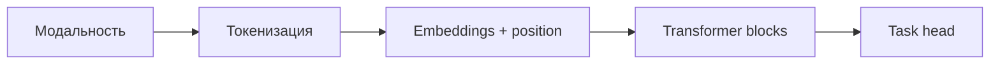

# Трансформеры в разных модальностях — текст, зрение, звук

<div class="article-tags">
  <span class="tag tag-notrequired">НЕ ОБЯЗАТЕЛЬНО</span>
</div>

<span class="complexity-badge">Разработчику</span>

**Transformer** изначально создавался для **последовательностей токенов**. Тот же блок attention + FFN применяют к **патчам изображения**, **фреймам спектrogram** и **мультимодальным парам** "текст + картинка". Единая идея — представить данные как последовательность эмбеддингов и моделировать **глобальные зависимости** через attention.

NLP-основа — [статьи 1–2](./1). CV-применение в продуктах — [распознавание](/encyclopedia/6-ai/6-06-primenenie-ii/120). CNN по-прежнему сильны локально; трансформеры доминируют в **foundation models**.

---

## Общая схема переноса



| Модальность | "Токен" | Positional info |
|-------------|---------|-----------------|
| Текст | Subword | Absolute, RoPE |
| Изображение | Patch 16×16 | 2D index → 1D sequence |
| Аудио | Time-frequency bin | Frame index |
| Видео | Patch × time | Spatial + temporal |

---

## Зрение (Vision Transformer, ViT)

**ViT** (Dosovitskiy et al., 2020) режет изображение на **пatches** (например 16×16 px), линейно проецирует каждый patch в вектор, добавляет **class token** и positional embeddings, прогоняет через **encoder** как BERT.

- На **малых** датасетах ViT проигрывает ResNet без огромного pre-train.
- На **JFT-300M** и ImageNet-21k — конкурентен или лучше CNN.
- **DeiT**, **Swin Transformer** — эффективность и иерархия для detection/segmentation.

**DETR** — detection через transformer + bipartite matching; end-to-end без anchors (медленнее converges, но проще pipeline).

Практика: `google/vit-base-patch16-224` на Hugging Face; fine-tune head на свой датасет — тот же `Trainer`, что и для BERT.

---

## Мультимодальность — CLIP и LLaVA

**CLIP** (2021) обучает **два encoder'а** (image + text) на парах "картинка — подпись" из интернета. Cosine similarity в общем пространстве → **zero-shot** классификация по текстовым меткам.

**LLaVA**, **GPT-4V**, **Gemini** — LLM + vision encoder через **projector**; картинка превращается в "visual tokens" в контексте языковой модели. Диалог по изображению, OCR, diagram understanding.

---

## Аудио — Whisper и AST

### Whisper (OpenAI)

Encoder-decoder transformer на **mel-spectrogram**; обучен на 680k часов weakly supervised speech. Задачи:

- speech-to-text (multilingual + translation to English);
- language identification;
- robustness к шуму и акцентам.

```python

import whisper

model = whisper.load_model("base")
result = model.transcribe("audio.mp3", language="ru")
print(result["text"])
```

Размеры: `tiny` → `large` — trade-off качество / VRAM.

### Wav2Vec 2.0 / HuBERT

Self-supervised **speech representations** → fine-tune ASR с малым объёмом размеченной речи. Transformer (или CNN frontend + transformer) на raw waveform или features.

### Audio Spectrogram Transformer (AST)

Spectrogram как "картинка" → ViT-подход для **classification** звуков (esc50, audioset).

---

## Видео

**TimeSformer**, **Video Swin** — attention по spatial и temporal patches. Задачи: action recognition, video QA. Вычислительно дорого; часто **sample frames** + 2D CNN/ ViT.

---

## Единые мультимодальные модели

| Модель | Модальности | Применение |
|--------|-------------|------------|
| **CLIP** | image + text | Search, zero-shot |
| **Whisper** | audio → text | Transcription |
| **Flamingo / IDEFICS** | image + text → text | VQA, captioning |
| **ImageBind** | image, text, audio, depth, … | Joint embedding |
| **GPT-4o** | text, audio, image in/out | Универсальный ассистент |

---

## Выбор под задачу

| Задача | Стартовая точка |
|--------|-----------------|
| OCR + NLP | TrOCR, Vision-LLM, cloud Read API |
| ASR русский | Whisper `medium/large`, Yandex SpeechKit |
| Классификация изображений | ViT, ConvNeXt, fine-tune ResNet baseline |
| Поиск по каталогу | CLIP / sentence-transformers multimodal |
| Чат по документу с картинками | Multimodal LLM + RAG |

<div class="callout callout--tip">
  <div class="callout-title">Modality fusion</div>

  <div class="callout-body">
  Ранние системы склеивали отдельные модели (ASR → текст → LLM). Современный тренд — <strong>end-to-end</strong> или один LLM с adapter под модальность; для prod часто остаётся **каскад** ради latency и отладки.
  </div>
</div>

---

## Практика — audio / video RAG

Каскад **ASR → индекс → LLM** остаётся рабочим default в prod: проще отлаживать, чем end-to-end мультимодальную модель на весь пайплайн.

### YouTube и подкасты

1. **Транскрипт** — [Whisper](#аудио--whisper-и-ast) или API провайдера; для YouTube — извлечение аудиодорожки или готовых субтитров.
2. **Чанкинг** по таймкодам — каждый фрагмент с метаданными `start_sec`, `end_sec`.
3. **Индекс** в ChromaDB / Qdrant — [векторные БД](/encyclopedia/3-data-markup/3-06-nosql/812).
4. **Ответ** с ссылкой на таймкод — "в 12:34 автор говорит о…".

Паттерн совпадает с текстовым RAG; отличие — источник и обязательная **привязка к времени** в UI.

### Чат с аудиофайлом

Универсальные мультимодальные модели (Gemini, GPT-4o) принимают **файл или URL** и отвечают на вопросы о транскрипте, эмоциях, инструментах. Для повторяемых запросов и экономии токенов предпочтительнее один раз транскрибировать Whisper и дальше работать как с текстовым RAG.

### Video understanding

Для длинных роликов без полного просмотра моделью:

- **саммари по главам** (главы как структурированный JSON);
- **key takeaways** и action items;
- опционально — индексация глав в RAG для точечных вопросов.

Вычислительно дешевле, чем подавать весь ролик в контекст: сначала сжатие, потом Q&A по сжатию.

Примеры для запуска — [Практикум — проекты по ИИ](/encyclopedia/6-ai/6-05-razrabotka-ii/122) (ветка "аудио, видео, мультимодальность") — YouTube Transcript RAG, Music Explorer, Video Understanding Agent.

---

## Связь с разделом NLP

Текстовый трансформер — **ядро** multimodal stack: vision/audio encoder лишь **поставляет tokens** в языковую модель. Поэтому маршрут [6.09](./intro) логично читать перед [LLM и агентами](/encyclopedia/6-ai/6-04-modeli-i-instrumenty/intro).

---

## Дальше

- [Распознавание лиц, объектов и текста](/encyclopedia/6-ai/6-06-primenenie-ii/120)
- [Keras и TensorFlow — CNN](/encyclopedia/6-ai/6-03-neyroseti/114)
- [Большие языковые модели](/encyclopedia/6-ai/6-04-modeli-i-instrumenty/1)

---
