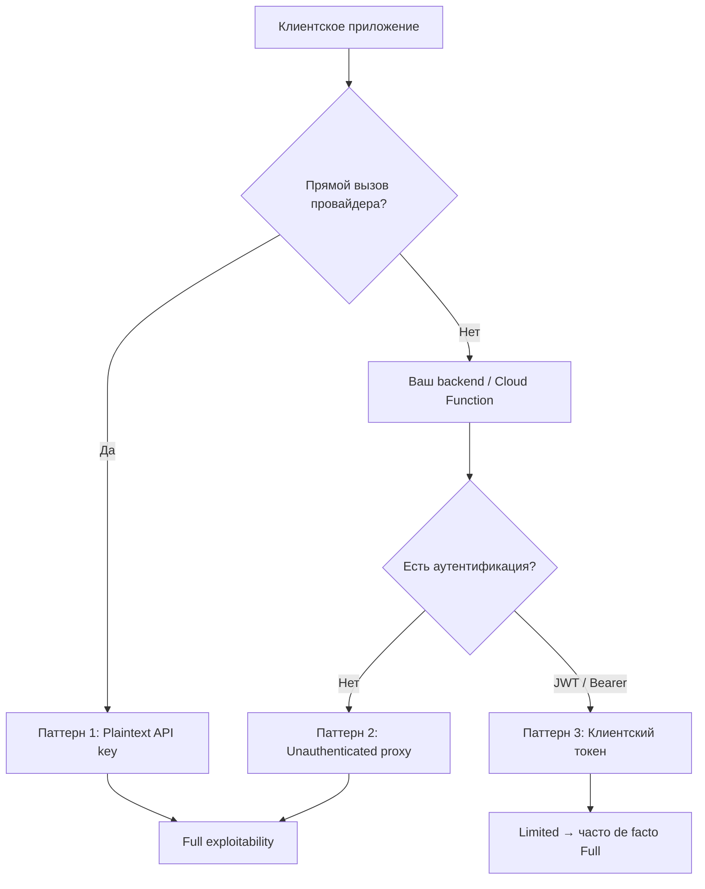
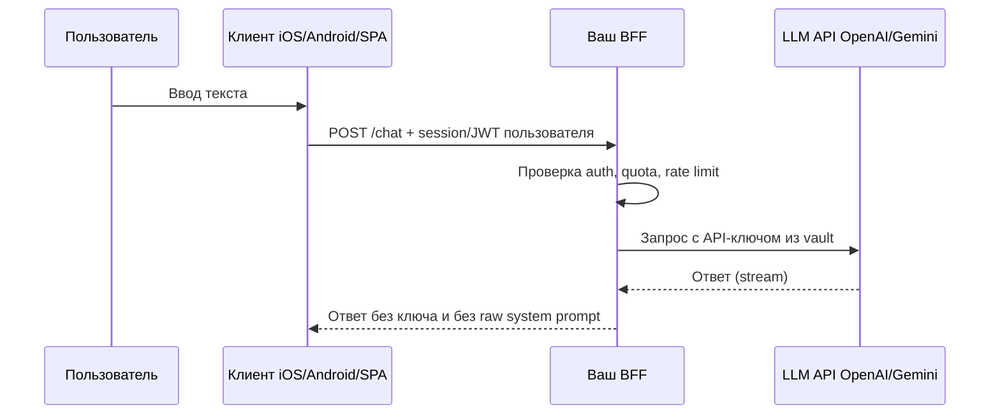

# Безопасная интеграция LLM в мобильные и клиентские приложения

<div class="article-tags">
  <span class="tag tag-required">ОБЯЗАТЕЛЬНО</span>
  <span class="tag tag-beginner">ДЛЯ НОВИЧКОВ</span>
</div>

<span class="complexity-badge">Разработчику</span>
<span class="complexity-badge">Архитектору</span>

Чат с GPT в мобильном приложении кажется простым: взять API-ключ OpenAI, вставить в Swift/Kotlin/Flutter — и готово. На практике **любой секрет в клиенте уже скомпрометирован**: его видят MITM-прокси, декомпилятор, jailbreak и конкурент с Charles Proxy. Эмпирические исследования показывают, что **большинство** LLM-приложений в магазинах всё равно светят credentials в сетевом трафике — чаще не из-за «лени», а из-за **ложного чувства безопасности** от backend-прокси без аутентификации.

Здесь — золотое правило, три типовых паттерна утечки, референс-архитектура и чек-лист. OWASP-коды **LLM02**, **LLM07**, **LLM10** — в [OWASP LLM Top 10](./2); хранение ключей в vault — в [Политике данных](./5). Для слоёв 6–7 LLM-стека — [Семь слоёв](./../6-05-razrabotka-ii/119).

<div class="callout callout--warning">
  <div class="callout-title">Золотое правило</div>

  <div class="callout-body">
  <strong>Ключ провайдера LLM живёт только на сервере</strong>, который вы контролируете. Клиент (iOS, Android, браузер, desktop) аутентифицируется <em>к вам</em> — не к OpenAI напрямую. TLS, обфускация и certificate pinning не отменяют это правило: они замедляют атакующего, но не делают клиент доверенным.
  </div>
</div>

---

## Почему клиент не может хранить секрет

| Утверждение разработчика | Реальность |
|--------------------------|------------|
| «Ключ в нативном коде, пользователь не найдёт» | Бинарник декомпилируют; на iOS FairPlay мешает статике, но **трафик** всё равно читают |
| «HTTPS защищает ключ» | HTTPS защищает от **третьих лиц в сети**, не от владельца устройства с установленным CA |
| «Спрятали в Firebase Remote Config» | Конфиг скачивается на клиент — это тот же публичный канал |
| «Сделали backend-прокси» | Прокси **без auth** = открытый relay; ключ провайдера спрятан, но **ваш счёт** всё равно платит за чужие запросы |

Исследование *Mind your key* (Gao et al., 2026, [arXiv:2606.12212](https://arxiv.org/html/2606.12212v3)) по 444 iOS-приложениям с LLM-функциями: **64%** передавали credentials в перехватываемом трафике, **52%** от уязвимых — полностью эксплуатируемы. Через 90 дней после responsible disclosure исправили только **28%**. Вывод переносится на Android, React Native, Electron и SPA: платформа меняется, **модель угроз клиента** — нет.

Финансовый вектор называют **LLMjacking**: украденный ключ = неограниченные запросы на **ваш** биллинг у провайдера. В отчётах инцидентов фигурируют потери **десятки тысяч долларов в сутки** на одном скомпрометированном ключе. Контроль бюджета — [FinOps](/encyclopedia/8-infra-security/8-16-finops-pet-project/1).

---

## Три паттерна утечки

Эмпирическая типология (iOS, 2025) — полезный каркас для code review и threat model.



### Паттерн 1 — Plaintext API key (~19%)

Приложение вызывает `api.openai.com`, `generativelanguage.googleapis.com` и т.д. напрямую. Ключ в заголовке `Authorization: Bearer sk-proj-...` или в query-параметре.

**Риск:** полный доступ к аккаунту разработчика у провайдера — любые модели, любые промпты, смена лимитов. В ~**47%** таких случаев в том же запросе уходит **system prompt** — ядро бизнес-логики приложения. Один перехват = **LLMjacking** + копирование IP (OWASP **LLM07**).

### Паттерн 2 — Unauthenticated backend proxy (~33%)

Ключ провайдера лежит на сервере (Google Cloud Function, Firebase, custom `api.example.com/chat`), но endpoint **принимает POST без проверки клиента**.

**Риск:** атакующему достаточно URL и JSON-схемы из одного перехваченного запроса. Это **открытый relay** к LLM — классифицируется как Full exploitability. Исправление требует **архитектурного** изменения (добавить auth), а не ротации ключа — поэтому такие дыры живут месяцами.

### Паттерн 3 — JWT/Bearer на прокси (~48%)

Самый частый паттерн. Клиент получает JWT и ходит на ваш backend; backend держит ключ OpenAI/Gemini. Теоретически — «ограниченная» эксплуатация (только surface вашего API, срок жизни токена).

**На практике** перехваченный JWT **replay**-ят, а серверы часто настроены криво:

| Антипаттерн | Доля среди «вечных» JWT (кейс-стади) |
|-------------|--------------------------------------|
| Статический bearer без expiry | 43% |
| JWT с `exp` через 100+ дней | 20% |
| Сервер принимает просроченный JWT | 17% |
| JWT без claim `exp` | 17% |

Токен с lifetime **100 лет** или replay **через 128 дней** после expiry — не «Limited», а фактически постоянный доступ.

---

## Референс-архитектура: BFF / LLM Gateway

**BFF** (Backend for Frontend) — тонкий backend под конкретный клиент (мобильный, web), который:

1. **Аутентифицирует пользователя** приложения (OAuth, session cookie, Firebase Auth с проверкой на сервере, Sign in with Apple + server validation).
2. **Авторизует** запрос (подписка, квота, rate limit per `user_id`).
3. **Хранит** ключ провайдера в секрет-хранилище (env на сервере, Vault, AWS Secrets Manager — не в репозитории).
4. **Собирает** запрос к LLM: system prompt остаётся **на сервере**, клиент шлёт только user message.
5. **Логирует** usage без PII и без полного текста промптов (или с редакцией).
6. **Ограничивает** `max_tokens`, timeout, число запросов в минуту.



### Что клиенту можно отдавать

| Допустимо | Недопустимо |
|-----------|-------------|
| Короткоживущий **session token** вашего backend (минуты–часы) | API-ключ провайдера (`sk-...`, `x-api-key` Anthropic) |
| Публичный `app_id` для аналитики | Долгоживущий JWT на 365 дней «чтобы не логиниться» |
| Endpoint вашего BFF | Прямой URL Cloud Function без auth |

Подробнее про JWT и API keys в интеграциях — [токены и API-ключи](/encyclopedia/8-infra-security/8-05-mikroservisy-i-integratsiya/1121#tokens-i-api-keys), [сессии и JWT](/encyclopedia/2-system-network/2-09-osnovy-integratsionnogo-vzaimodeystviya/113).

### Минимальный контракт BFF

```http
POST /v1/chat
Authorization: Bearer <user_session_jwt>
Content-Type: application/json

{"message": "Текст пользователя", "conversation_id": "uuid"}
```

Сервер добавляет system prompt, model id, safety-фильтры и вызывает провайдера. Клиент **никогда** не знает `sk-proj-...`.

---

## JWT для LLM-прокси: чек-лист сервера

Переносите с [интеграционной безопасности](/encyclopedia/2-system-network/2-09-osnovy-integratsionnogo-vzaimodeystviya/113), но для LLM это критично из-за **стоимости** каждого replay:

- [ ] Claim **`exp`** обязателен; типичный TTL — **15–60 минут** для мобильной сессии, не годы.
- [ ] Сервер **отклоняет** токены с `exp` в прошлом (проверьте clock skew, но не «игнорируем expiry»).
- [ ] Подпись проверяется с актуальным секретом / JWKS; при ротации — revoke старых `kid`.
- [ ] Токен привязан к **пользователю** и при необходимости к `device_id` / subscription tier.
- [ ] Rate limit и **quota** на `sub` (user id), не только на IP.
- [ ] План **ротации** signing secret и отзыва сессий при инциденте.

Анонимный Firebase Auth + gateway к OpenAI без проверки expiry на gateway — типичный провал из полевых исследований.

---

## Клиентские «защиты» и их пределы

Часть приложений пытается скрыть трафик от MITM:

| Механизм | Замысел | Ограничение |
|----------|---------|-------------|
| HTTP proxy bypass (`NWConnection`) | Не идти через системный прокси | Обходится VPN-level capture |
| Certificate pinning | Не доверять чужому CA | Редко внедряется корректно; не спасает от владельца устройства |
| Custom encryption поверх TLS | Спрятать payload | Ключ расшифровки всё равно в клиенте |
| WebSocket вместо REST | Усложнить перехват | Endpoint и токен всё равно извлекаются |

Многослойная защита (proxy bypass + шифрование + WebSocket) сильно усложняет анализ, но **не заменяет** server-side ключ и auth на BFF. Для энциклопедии важнее не «как спрятаться от mitmproxy», а **не класть секреты в клиент**.

---

## Связь с OWASP LLM Top 10

| ID | Как проявляется в мобильном клиенте | Контрмера |
|----|-------------------------------------|-----------|
| **LLM02** | Утечка API-ключа и PII в трафике | BFF, классификация данных — [Политика данных](./5) |
| **LLM07** | System prompt в теле запроса с клиента | System prompt только на сервере |
| **LLM10** | Украденный ключ → неограниченный биллинг | Budget alerts, rate limit, отдельные ключи per env |

Полная таблица — [OWASP LLM Top 10](./2).

---

## Инцидент: что делать

1. **Немедленно отозвать** скомпрометированный ключ в кабинете провайдера (OpenAI, Google AI Studio и т.д.).
2. Выпустить **новый** ключ; старый считать утёкшим навсегда.
3. Проверить **billing** и аномалии usage (много IP, всплеск токенов).
4. Задеплоить BFF с auth, если его не было.
5. Уведомить пользователей, если утекли **их** данные (не только ключ).

Для pet-проекта включите **spending limit** и email-alert при превышении порога — [FinOps](/encyclopedia/8-infra-security/8-16-finops-pet-project/1).

---

## Практический чек-лист перед релизом

### Архитектура

- [ ] Нет строк `sk-`, `org-`, provider API key в исходниках клиента и в CI-артефактах приложения.
- [ ] Все вызовы LLM идут **только** на ваш backend, не на `api.openai.com` из приложения.
- [ ] Backend endpoint требует **аутентификацию пользователя** (не «секретный URL»).
- [ ] System prompt и выбор модели — **только на сервере**.

### Токены и лимиты

- [ ] JWT/session: есть `exp`, сервер отклоняет просроченные токены.
- [ ] Rate limit per user; `max_tokens` на запрос.
- [ ] У провайдера: budget cap и алерты.

### Проверка

- [ ] Прогон трафика через mitmproxy на тестовом устройстве: **нет** provider key в логах.
- [ ] Попытка вызвать BFF без `Authorization` → **401/403**.
- [ ] Попытка replay старого JWT после logout → отказ.

Кросс-платформа: [мобильные приложения](/encyclopedia/1-basics/1-19-programma/3), [Swift — публикация в App Store](/encyclopedia/5-languages/5-14-swift/272), [Android](/encyclopedia/1-basics/1-035-bazovaya-informatika/213).

---

## FAQ

<div class="faq-list">

<div class="faq-item">
  <p class="faq-q"><span class="faq-label">Вопрос.</span> Пользователь вводит **свой** API-ключ в настройках приложения — это безопасно для разработчика?</p>
  <p class="faq-a"><span class="faq-label">Ответ.</span> Для <strong>вашего</strong> биллинга — да: ключ принадлежит пользователю. Риски смещаются на него (утечка с устройства). Вам всё равно нужно безопасно хранить ключ на устройстве (Keychain/Keystore), не логировать и не отправлять на ваш сервер без согласия.</p>
</div>

<div class="faq-item">
  <p class="faq-q"><span class="faq-label">Вопрос.</span> Можно ли вызывать LLM **on-device** (Core ML, llama.cpp в приложении)?</p>
  <p class="faq-a"><span class="faq-label">Ответ.</span> Да — ключ провайдера не нужен, платите за разработку и размер модели. Другие риски: качество, батарея, обновление модели. См. on-device инференс в <a href="/encyclopedia/6-ai/6-05-razrabotka-ii/119">слое 5 LLM-стека</a>.</p>
</div>

<div class="faq-item">
  <p class="faq-q"><span class="faq-label">Вопрос.</span> Backend-прокси в Supabase Edge Function без auth — «временно для MVP»?</p>
  <p class="faq-a"><span class="faq-label">Ответ.</span> Временные открытые endpoint'ы <strong>сканируют боты за часы</strong>. MVP с LLM без auth = подарок счёта конкурентам. Минимум — API key вашего backend или session пользователя с первого дня.</p>
</div>

<div class="faq-item">
  <p class="faq-q"><span class="faq-label">Вопрос.</span> Certificate pinning решит проблему?</p>
  <p class="faq-a"><span class="faq-label">Ответ.</span> <strong>Нет</strong> как единственная мера. Pinning усложняет MITM на чужих сетях, но не защищает от реверса и не заменяет отсутствие ключа в клиенте. См. также сравнение pinning на iOS/Android в исследованиях IMC.</p>
</div>

</div>

---

## Итоги

Безопасная интеграция LLM в клиент — это **не** «спрятать ключ получше», а **вынести доверие на сервер**: BFF с аутентификацией пользователя, короткими токенами, квотами и ключом провайдера в vault. Backend-прокси без auth и «вечный» JWT — два самых дорогих антипаттерна; они чаще встречаются, чем plaintext `sk-` в заголовке.

Дальше по разделу: [OWASP LLM Top 10](./2) · [политика данных](./5) · [red team](./6) · [итоги](./98) · [чек-лист](./99).

---

## Источники

- Gao P. et al. — *Mind your key: An Empirical Study of LLM API Credential Leakage in iOS Apps* — [arXiv:2606.12212v3](https://arxiv.org/html/2606.12212v3) (2026)
- Ibrahim M. et al. — *LM-Scout: analyzing the security of language model integration in android apps* — [arXiv:2505.08204](https://arxiv.org/abs/2505.08204) (аналогичные риски на Android)
- Sysdig — *LLMjacking: stolen cloud credentials used in new AI attack* (финансовый вектор утечки ключей)
- [OWASP LLM Top 10](./2) · [Семь слоёв LLM-стека](/encyclopedia/6-ai/6-05-razrabotka-ii/119)

---
