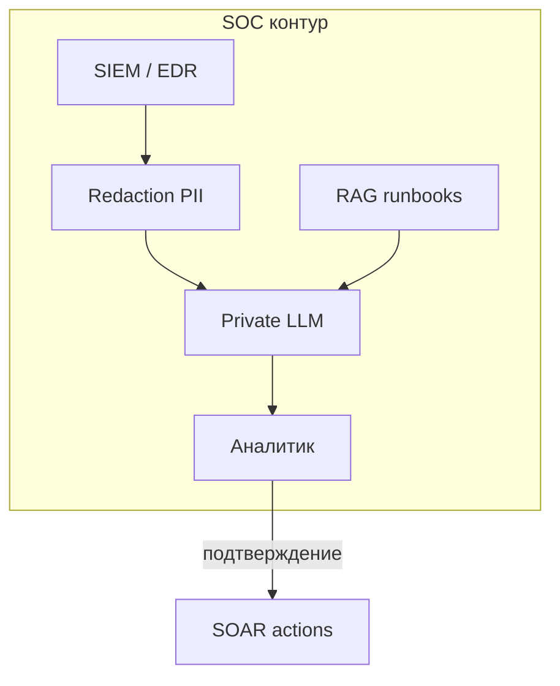

# ИИ в SOC и на стороне защитника

  ОБЯЗАТЕЛЬНО

Инженеру
Архитектору

**SOC** (Security Operations Center) тонет в алертах, логах и отчётах. LLM обещает **суммаризацию**, **классификацию** и **подсказки по playbooks** — но те же модели несут риски **утечки**, **галлюцинаций** и **чрезмерной автономии** (OWASP LLM02, LLM09, LLM06).

Здесь — где ИИ **уместен** на стороне защитника и где нужны жёсткие ограничения. Базовый SIEM — [мониторинг и SIEM](/encyclopedia/8-infra-security/8-07-informatsionnaya-bezopasnost/114).

---

## Типичные use case

| Задача | Польза ИИ | Риск |
|--------|-----------|------|
| **Triage алертов** | Краткое "что случилось" по 500 событиям | Пропуск критичного, ложное "ложноположительное" |
| **Суммаризация инцидента** | Черновик отчёта для руководства | Утечка PII/секретов в промпт |
| **Поиск по runbooks** | RAG по внутренней wiki ИБ | Injection в документацию |
| **Фишинг-детект** | Классификация писем, объяснение | Adversarial текст обходит классификатор |
| **Генерация правил** | Черновик Sigma/YARA | Ошибочное правило блокирует prod |
| **Threat intel** | Сводка отчётов CVE/APTs | Галлюцинация CVE |

---

## Риски для SOC

### 1. Утечка через облачный LLM

Аналитик вставляет в ChatGPT:

- фрагмент **SIEM** с внутренними IP, именами, хешами;
- **сырой дамп** памяти или credentials из инцидента.

Это **LLM02** — нарушение политики и возможная утечка в обучение. Решение — [политика данных](./5): только enterprise/ZDR или **on-prem** модель в контуре SOC.

### 2. Галлюцинации под давлением времени

Ночной инцидент → аналитик доверяет summary бота → **ложный IOC** или неверная атрибуция → потеря времени.

**Правило:** ИИ — **черновик**; решения о блокировке и эскалации — **человек**.

### 3. Автономные "агенты SOC"

Идея — бот сам **блокирует IP**, **изолирует хост**, **отзывает токены**.

Опасность: ложный positive → **само-DoS**; компрометация бота → **lateral movement** от имени SOC.

Минимум: **read-only** рекомендации; деструктивные playbooks — только после подтверждения — [песочница агента](./4).

### 4. Атака на RAG wiki ИБ

Злоумышленник с доступом к Confluence кладёт страницу с injection → SOC-бот выполняет вредоносную инструкцию. См. [RAG security](./3).

---

## Архитектура безопасного внедрения

| Слой | Требование |
|------|------------|
| **Данные** | Редакция IP/имён перед LLM; классификация |
| **Модель** | On-prem или VPC; ZDR |
| **Выход** | Citations к сырым событиям; не выдумывать CVE |
| **Действия** | SOAR только с HITL для block/isolate |
| **Аудит** | Лог всех промптов в SOC (retention по политике) |

---

## ИИ против ИИ-атакующего

Защитник тоже использует ИИ:

- детект **синтетического фишинга** (стилистика, метаданные);
- анализ **полиморфного malware** (assist, не автономный вердикт);
- **OSINT** суммаризация.

Атакующий использует ИИ для **обфускации** и **масштаба**. Гонка вооружений — обновление моделей детекта и обучение аналитиков.

Связь с [жизненным циклом атаки](/encyclopedia/8-infra-security/8-07-informatsionnaya-bezopasnost/129).

---

## Чек-лист для CISO / lead SOC

- [ ] Запрет consumer LLM для сырых логов
- [ ] Утверждённый вендор с DPA для SOC use case
- [ ] RAG только на проверенных runbooks
- [ ] Нет автоматического containment без human approve
- [ ] Регулярный red team на SOC-бота — [глава 6](./6)
- [ ] Обучение: ИИ не заменяет расследование

---

## Итоги

ИИ в SOC **сокращает рутину**, но не снимает ответственность аналитика. Данные инцидентов — **максимально чувствительны**; облачный free-чат недопустим. Автономия — только в рамках [AgentOps](/encyclopedia/6-ai/6-08-agentops/1) с жёсткими trust boundaries.

---
