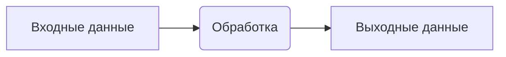
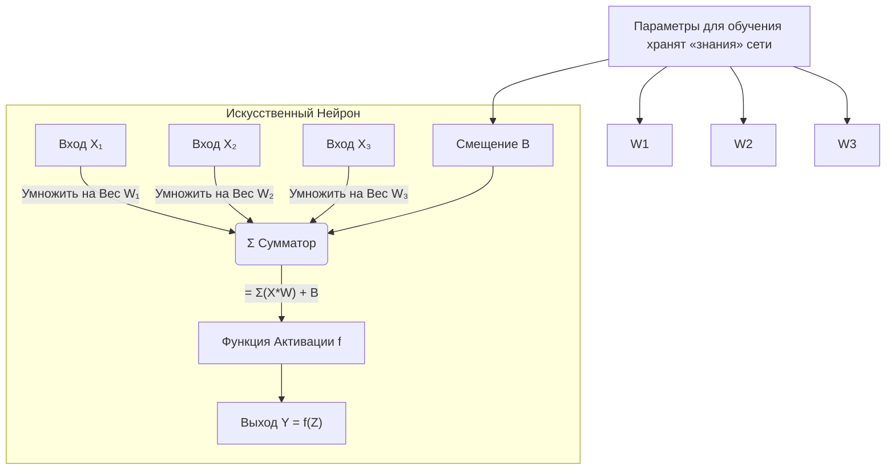
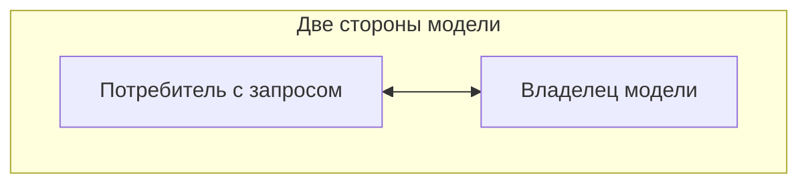
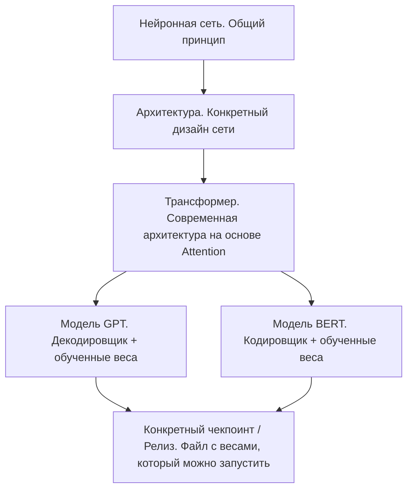
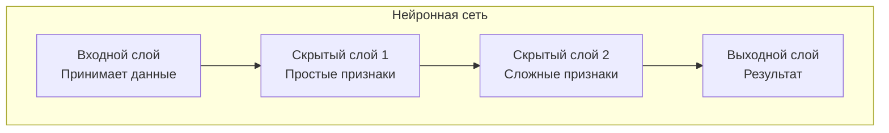
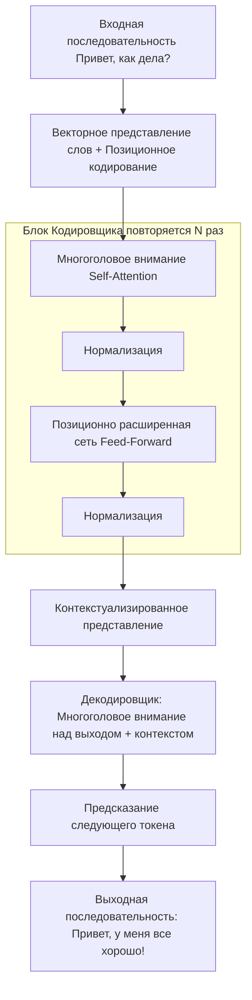

---
title: Что такое искусственный интеллект на самом деле
tags: [beginner, advanced, notrequired, all]
---

# Что такое искусственный интеллект на самом деле

<div class="article-tags">
  <span class="tag tag-beginner">ДЛЯ НОВИЧКОВ</span>
  <span class="tag tag-notrequired">НЕ ОБЯЗАТЕЛЬНО</span>
  <span class="tag tag-inprogress">В РАЗРАБОТКЕ</span>
</div>
<span class="complexity-badge">Всем</span>

## Что такое искусственный интеллект на самом деле

### Введение

Данная статья является ключевой для знакомства с технологиями искусственного интеллекта и нейросетей.

Для начала, запомним три ключевых тезиса:
1. Искусственный интеллект (ИИ), или AI - это понятие из научной фантастики. Его не существует в природе, это просто маркетинговый термин.
2. ИИ - всего лишь инструмент, а не полноценная сущность.
3. Нейронные сети - это реализация базовой схемы:



Начиная с 2021 года, технологический мир активно заполняется повесткой по продвижению термина "искусственный интеллект", и всего, что с ним связано. Его используют в рекламе операционных систем, в описании мобильных приложений, в государственных программах цифровизации и в корпоративных отчётах. При этом само понятие претерпело странную трансформацию, из узкой технической категории оно превратилось в универсальный ярлык для любых автоматизированных решений. Чтобы понять суть происходящего, требуется вернуться к истокам технологии и отделить инженерную реальность от маркетинговой риторики.

Здесь я планирую разъяснить основу. Прошу быть внимательными.

---

### Самое-самое важное

Официально, термин "искусственный интеллект", появился в 1956 году на Дартмутском семинаре. Участники определили цель направления как создание машин, способных решать задачи, требующие человеческого интеллекта.

В 1958 году Фрэнк Розенблатт представил **перцептрон** - первую практическую модель искусственной нейронной сети, способную распознавать простые образы. Это устройство работало на основе математических операций с весами связей между искусственными нейронами.

Так, пара новых терминов, не так ли? Давайте сразу обозначим.

> **Нейрон** - это специализированная клетка нервной системы, которая обрабатывает и передает информацию.

Нейроны имеются у нас в мозгу, и именно они отвечают за наше мышление. Представьте, что у вас в голове имеется невероятное множество клеток, связанных между собой в единую сеть. Когда поступает импульс, в нейрон загружаются данные, сигнал, если проще говорить. Такой импульс обрабатывается в нейроне, и формируется новый, обработанный сигнал, который, в свою очередь, передаётся другому.

Если проще, каждый нейрон в сети:
- получает входящие данные;
- обрабатывает данные;
- передаёт обработанные данные другим нейронам.

Передаются такие сигналы через **синапсы**, обеспечивающие связь.

> **Искусственный нейрон** - это как раз и есть перцептрон, математическая модель, которая *имитирует работу биологического нейрона*.

Каждый перцептрон состоит из:
- входов (это входные данные, например, пиксели изображения, слова, показатели датчиков - какая-то исходная информация);
- выхода (это результат работы нейрона);
- весов (каждому входу присваивается вес);
- сумматора (который вычисляет взвешенную сумму входов);
- смещения (для вычисления порога активации);
- функции активации (которая преобразует сумму в выходной сигнал).

Да, можно не учитывать сумматор, смещение и функцию активации, просто объединив их в единый термин "обработка". Технически, формула примерно такая:

```
Выход = Функция_Активации( (Вход₁ * Вес₁) + (Вход₂ * Вес₂) + ... + Смещение )
```

Но не заморачивайтесь, вы здесь не за этим. А что за **вес**? А это как раз самый важный параметр для обучения нейронной сети.

> **Вес** - это числовой коэффициент (обычно дробное число), который показывает силу и важность связи между двумя нейронами (или между входом и нейроном).

Условно, вы принимаете решение, идти ли вам на прогулку. Вы учитываете факторы:
- Светит ли солнце? (Да = 1, Нет = 0);
- Идёт ли дождь? (Да = 1, Нет = 0);
- Есть ли свободное время (Да = 1, Нет = 0).

Ваши личные предпочтения и есть веса, например:
- Вес для солнца = +5.0 (очень положительно влияет на решение);
- Вес для дождя = -10.0 (очень сильно отговаривает вас);
- Вес для времени = +3.0 (влияет положительно, но меньше, чем солнце).

Итоговое решение:
```
(1 * 5.0) + (0 * -10.0) + (1 * 3.0) = +8
```
Положительное число - идём гулять. Веса как раз и формализовали наши предпочтения.

Так, вся информация, которую сеть извлекает из данных в процессе обучения, хранится исключительно в значениях весов. Вес показывает, насколько сильно данный вход влияет на результат. Больший абсолютный вес = большое влияние, а близкий к 0 = слабое влияние, где связь почти отсутствует.

Создаётся программа, которая выполняет функции перцептрона, принимая данные, обрабатывая и выдавая результат. Остаётся лишь настроить её, обучить.

> **Обучение** - это настройка весов. 

Процесс обучения нейронной сети представляет собой итеративную подстройку всех её весов так, чтобы на известных входных данных получались правильные (или близкие к правильным) выходные данные.

Сначала веса устанавливаются случайными маленькими числами, затем сеть делает предсказание, вычисляет ошибку. С помощью алгоритма обратного распространения ошибки и градиентного спуска вычисляется, как нужно изменить каждый вес, чтобы ошибка уменьшилась. Веса немного изменяются, и процесс повторяется тысячи, а то и миллионы раз, пока ошибка не станет минимальной.



Получается, что нейроном является некий *микропроцессор*, который взвешивает все "за" и "против", и принимает простое решение - выход. А вес - это значимость каждого конкретного "за" и "против" для этого нейрона. Обучение является поиском идеальных значений этих значимостей для решения конкретной задачи.

Получается, для решения задач нужно обучать каждую нейросеть профильно. Она не может работать универсально - есть режим, заготовки, и профильность.

Технология в своём фундаменте работала ещё тогда, с 1956-го года, и именно она породила значительный интерес в области научной фантастики, благодаря чему популяризировались темы, поднимаемые в культуре и искусстве - те самые "роботы", "андроиды", "репликанты". Но тема пошла на спад, когда безуспешные попытки учёных сделать машину "умной" не принесли своих плодов.

Прорывом было решение добавить больше слоёв, создав многослойные архитектуры и применив алгоритм обратного  распространения ошибки, только вот технически мир ещё не был готов, применение было ограниченным из-за нехватки вычислительных мощностей и обучающих данных.

В начале 2000-х судьба так сложилась, что появились технологии, заложившие фундамент для развития. Появился интернет вещей, смартфоны массово распространились и конечно же, появился мобильный интернет, крупнейшие поисковики, и технологии хранения неструктурированных данных (NoSQL).

Это привело к росту цифровых следов - корпорации получили доступ к невероятным объёмам информации, которые стали достаточными для обучения моделей на реальных сценариях использования.

Получается, современные "AI" технологии благодарны не новым технологиям, а именно **избытку информации**.

---

## Современный ИИ


### Техническая суть современных решений

Мы всё время слышим "нейросеть", "ИИ". Как же её используют?

Есть несколько сценариев:
1. Базовый, потребительский. Это доступ к готовому онлайн-сервису, к примеру, [ChatGPT](https://chatgpt.com/). Система развёрнута на мощностях разработчиков, и работает в их среде. Нам, потребителям, предоставляется доступ к чату с нейросетью или иным инструментам, которые система предоставляет.
2. Собственный, производственный. Это полное развёртывание оффлайн-набора модели на своих серверах, для выполнения своих задач.

В первом случае, пользователь просто обращается с задачей, даёт данные, формирует запрос и получает результат.

Во втором случае же компания самостоятельно обучает свою вариацию нейросети, обученной на решение определённых задач. Технически, это просто обратная сторона от потребителя.



Для понимания всего этого массива, нужно изучить понятия в определённой иерархии:



> **Нейронная сеть** - это вычислительная система, состоящая из множества взаимосвязанных простых процессоров (искусственных нейронов), организованных в **слои**.

Как мы помним, есть *входной слой*, *выходной слой*, и промежуточные слои для обработки и преобразования данных (именно они обеспечивают сложность).

Информация проходит последовательно через слои, и каждый слой извлекает все более сложные и абстрактные признаки. Допустим, для изображения, первый слой - края, второй слой - углы и текстуры, третий - части объектов (глаз, ухо), глубокие слои - целые объекты (лицо). 



Конкретный, обученный "мозг" со своим набором знаний называется **моделью**. Такую модель можно скопировать и использовать.

> **Модель** - это конкретный экземпляр нейронной сети после обучения, использующий архитектуру и настроенные параметры.

Получается, что в модели закладывается:
- архитектура (сколько слоев, нейронов, как они соединены);
- настроенные (обученные) параметры, определяющие все значения весов и смещений.

Параметры представляют собой миллионы или даже миллиарды чисел.

Когда обучают модель, выполняют последовательность действий:
1. Получают сеть со случайными весами.
2. Подают ей огромный объем данных (тексты, картинки).
3. Нейросеть выдает определённые предсказания.
4. Сравнивают предсказания с правильными ответами.
5. С помощью алгоритма обратного распространения ошибки и градиентного спуска понемногу подкручивать все веса, чтобы уменьшать ошибку.
6. Повторяют миллионы раз, пока сеть не научится давать верные ответы.

Готовым продуктом будет модель, в которой есть определённая архитектура и натренированные веса. Когда вы скачиваете GPT или Stable Diffusion - то скачивается как раз модель.

До 2017 года для работы с последовательностями использовались **RNN (рекуррентные сети)** и **LSTM**. Они обрабатывали данные последовательно (слово за словом), что медленно и плохо улавливало дальние связи в тексте. Проще говоря, нейросеть довольно быстро забывала контекст.

Эту проблему решили революционной технологией **трансформера**.

> **Трансформер** - это архитектура нейронной сети, которая обрабатывает **все элементы последовательности (например, все слова в предложении) одновременно (параллельно)**, используя механизм **"внимания" (Attention)**, чтобы понимать контекст и связи между ними.

Механизм внимания для каждого слова в предложении вычисляет, насколько сильно ему нужно "обращать внимание" на все остальные слова (включая его самого) в этом же предложении. Нейросеть изначально не знает общий порядок слов, поэтому к вектору каждого слова прибавляется специальный сигнал (кодировка), который несет информацию о его позиции в предложении (1-е, 2-е, 10-е слово).

Кодировщик принимает входную последовательность (исходный текст), обрабатывает её и формирует "смысловое представление". Декодировщик использует это представление и уже сгенерированную часть выходной последовательности, чтобы предсказать следующее слово (токен) в ответе.

Если проще, то это просто грамотная комбинация технологий обработки и предсказания на основе вычисления вероятности.



Благодаря тому, что вся последовательность стала обрабатываться сразу, обучение стало в разы быстрее, чем у RNN, а архитектура позволяла масштабироваться с ростом данных и вычислительной мощности. Кроме того, основные технологии масштабируемости появились как раз в 2010-2015-х, и вся эта цепочка совпадений позволила именно сейчас начать полноценно эксплуатировать инновации, и выстраивать новую бизнес-модель.

Теперь система оценивает значимость каждого элемента последовательности относительно других, что позволяет обрабатывать длинные тексты параллельно.

Обучают такие модели в два этапа:
1. **Предобучение** использует неструктурированные массивы текста для формирования общих закономерностей языка.
2. **Тонкая настройка** адаптирует модель под конкретные задачи через примеры диалогов или инструкций.

Во время обучения, модель оперирует символами и их статистическими связями, но при этом не обладает внутренним представлением о мире, не имеет целей и не способна к абстрактному рассуждению.

А генерация текста происходит через выбор **наиболее вероятных** последовательностей токенов. При этом модель не проверяет фактическую достоверность утверждений — она лишь оценивает их стилистическую правдоподобность. Это объясняет феномен **галлюцинаций**: уверенно сформулированные, но ложные утверждения, возникающие из статистических закономерностей обучающих данных.

Получается, задавая вопрос нейронной сети, вы не получаете какой-то осмысленный ответ, а именно **наиболее вероятное предположение**. Это важно понимать, и нельзя полагаться всем бизнесом на такие неточности.

---

### Рождение технологического пузыря

В 2022–2023 годах компании вроде OpenAI начали активно продвигать свои модели под термином **искусственный интеллект**. Этот выбор названия оказался стратегически важным, создал ассоциацию с научной фантастикой и будущим технологий. Реальные возможности систем оказались вторичны по отношению к маркетинговому нарративу.

Под маркетинговым нарративом в данном случае подразумеваем, что компания нарисовала некое **видение** уже существующих технологий, преподнеся под научно-фантастическим соусом, и уверяя всех в том, что в будущем такие модели станут абсолютным искусственным интеллектом, превосходящим человека. Хотя технически, речь просто о вычислениях на основе статистики и вероятности, а не о реальном размышлении.

Но простые люди-то этого не знают! Им говорят "ИИ", они и ожидают того самого, что был представлен в научной фантастике!

Крупные технологические корпорации последовали примеру, интегрируя ИИ-функции во **все продукты**. Появились *умные* функции в операционных системах, *ИИ-ассистенты* в офисных пакетах, автоматизированные инструменты в средах разработки. Конкурентное давление заставило компании внедрять технологии не ради решения конкретных задач, а для соответствия тренду.

Массовые инвестиции привели к дефициту специализированного оборудования. Корпорации скупали графические процессоры для обучения моделей, что вызвало рост цен и перебои в поставках. Государственные структуры, не разобравшись в сути технологий, запустили программы цифровизации с обязательным требованием интеграции ИИ. Ожидания строились на предположении, что технологии автоматически сделают услуги быстрее и дешевле.

Реальность оказалась иной. Внедрение ИИ в госсекторе часто сводится к установке чат-ботов на сайтах ведомств. Эти системы не решают проблем с бюрократическими процедурами — они лишь добавляют *промежуточный слой* между гражданином и сотрудником. При этом расходы на лицензии, серверы и сопровождение увеличивают операционные издержки без заметного улучшения качества услуг.

---

### Как происходит внедрение?

Типичный коммерческий проект по внедрению ИИ следует стандартному шаблону. Заказчик объявляет тендер на **интеллектуальную систему автоматизации**. Исполнитель выбирает готовую модель — чаще всего открытую версию вроде DeepSeek или Llama. Для работы с внутренними документами подключается векторная база данных, например Chroma или Weaviate.

Модель разворачивается на серверах заказчика или в облаке. В базу загружаются внутренние регламенты, инструкции и шаблоны документов. Проводится минимальная тонкая настройка на несколько тысяч примеров запросов и ответов. Система тестируется на контрольных вопросах. После успешной демонстрации подписывается акт приёмки.

Объём реальной инженерной работы в таких проектах минимален. Основные усилия уходят на оформление документации и согласование этапов. При этом стоимость контракта часто достигает сотен тысяч долларов благодаря маркетинговой упаковке решения как **инновационного ИИ-продукта**. Технологическая сложность проекта не соответствует его цене.

Подобные схемы работают до тех пор, пока заказчик не столкнётся с реальными задачами. 

Модель не справляется с исключениями из правил, не понимает контекст специфических запросов и генерирует ошибочные рекомендации. Тогда начинается цикл доработок: расширение обучающего набора, добавление правил фильтрации, внедрение механизма ручной верификации. В итоге система превращается в полуавтоматический инструмент, где человек проверяет каждый вывод модели.

---

### Последствия и как это использовать

Массовое внедрение ИИ-технологий повлияло на рынок труда не так, как предсказывали аналитики. Вместо постепенной автоматизации рутинных задач произошли точечные сокращения в поддержке, тестировании и техническом письме. 

При этом спрос на специалистов по машинному обучению не вырос пропорционально — рынку требуются не исследователи, а **инженеры по развёртыванию готовых решений**.

В университетах появились новые специальности под названием **инженер ИИ** или **специалист по большим языковым моделям**. Программы обучения часто сводятся к освоению библиотек вроде *Hugging Face Transformers*, работе с векторными базами данных и базовым курсам по статистике. Студенты получают узкие навыки, применимые только в текущем технологическом цикле.

Когда интерес к ИИ нормализуется, эти специальности потеряют актуальность. Выпускники окажутся без глубоких знаний в фундаментальных дисциплинах — алгоритмах, архитектуре систем, теории вероятностей. Их подготовка окажется недостаточной для перехода в смежные области, что создаст социальную проблему переобучения целого поколения специалистов.

Рынок труда демонстрирует абсурдные явления:
- Рекрутеры составляют вакансии через языковые модели;
- Соискатели генерируют резюме и сопроводительные письма теми же инструментами;
- На этапе отбора применяются системы анализа текста для выявления *ИИ-следов*;
- Решения о найме принимаются на основе сводок, подготовленных алгоритмами.

Человеческий фактор сокращается до формального утверждения выводов системы.

Работа с персональными данными создаёт риски утечек и манипуляций. Модели запоминают фрагменты обучающих данных, включая конфиденциальную информацию. При генерации ответов система может случайно раскрыть персональные сведения. Даже при использовании локальных развёртываний остаётся уязвимость к атакам через промпт-инъекции.

Это дошло до того, что даже системы стали проектировать через ИИ. Системное программирование требует понимания архитектуры компьютера, работы с памятью и низкоуровневыми интерфейсами. Языковые модели не способны проектировать надёжные ядра операционных систем, драйверы устройств или криптографические алгоритмы. Ошибки в таких компонентах приводят к критическим сбоям и уязвимостям безопасности.

Это проблема. Нужно использовать систему **по назначению**.

Современные языковые модели эффективны в автоматизации рутинных операций. Они генерируют шаблоны кода для стандартных задач, создают скелеты архитектуры приложений, подсказывают синтаксис языков программирования. Для опытных разработчиков это инструмент ускорения работы, а не замена мышления.

Модели служат продвинутыми экспертными системами. Они отвечают на вопросы по документации, объясняют принципы работы технологий, помогают находить решения типовых проблем. Для новичков такие системы заменяют наставника на первых этапах обучения, предоставляя мгновенный доступ к знаниям.

В обработке медиа модели выполняют предсказуемые операции: удаление фона на изображениях, апскейлинг с сохранением деталей, шумоподавление в аудио, стабилизация видео. Эти задачи основаны на распознавании паттернов и не требуют творческого подхода. Результаты полезны для подготовки материалов, но не заменяют работу дизайнера или видеомонтажёра.

Системы анализа данных выявляют корреляции в больших массивах информации. Они строят прогнозы на основе исторических трендов, классифицируют объекты по заданным критериям, кластеризуют похожие элементы. Такие инструменты вспомогательны для аналитиков, но не заменяют интерпретацию результатов в контексте бизнеса.

---

### Чёткие ограничения и риски

Нейросети не обладают интеллектом, не формируют внутренние представления о мире, не имеют целей и намерений, не способны к абстрактному мышлению. Все выводы системы основаны на статистических закономерностях обучающих данных без понимания смысла.

Нельзя генерировать творческий контент! Это иллюзия. Изображения, созданные нейросетями, содержат артефакты и нарушения физических законов. Музыкальные композиции повторяют структуры обучающего набора без развития темы. Литературные тексты демонстрируют стилистическую монотонность и отсутствие глубокой драматургии. Пользователи быстро устают от однообразия генераций.

Полное возложение ответственности на ИИ недопустимо. Система не несёт юридической или этической ответственности за свои действия. При аварии в критически важной системе виновным окажется человек, принявший решение доверить управление алгоритму. Отсутствие механизма объяснения решений усложняет диагностику ошибок и восстановление после сбоев.

Технологии машинного обучения и обработки естественного языка имеют ценность как инструменты автоматизации. Они ускоряют рутинные операции, снижают когнитивную нагрузку на специалистов, предоставляют доступ к знаниям. Однако их возможности ограничены областью предсказуемых, структурированных задач.

Устойчивое развитие требует честной оценки возможностей технологий. Инвестиции в ИИ должны направляться на решение конкретных проблем бизнеса и общества, а не на следование трендам. Образовательные программы должны фокусироваться на фундаментальных дисциплинах, а не на обучении работе с конкретными моделями.

Технологии машинного обучения станут зрелой инженерной дисциплиной, когда общество перестанет воспринимать их как магию. Поэтому, изучайте, погружайтесь в тему - вам станет понятнее.

---