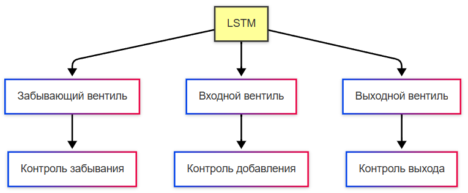
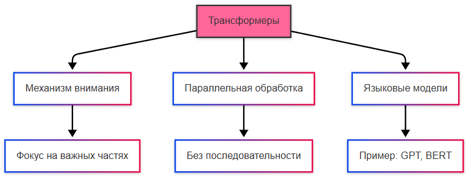
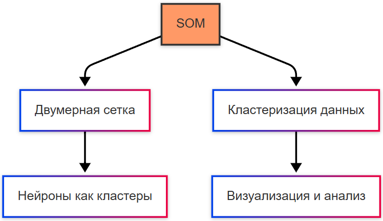

---
title: Архитектуры нейронных сетей
tags: [beginner, advanced, notrequired, all]
---

# Архитектуры нейронных сетей

  ДЛЯ НОВИЧКОВ
  НЕ ДЛЯ НОВИЧКОВ
  НЕ ОБЯЗАТЕЛЬНО
  В РАЗРАБОТКЕ

Всем

## Типы нейросетей

### Полносвязные нейронные сети

Полносвязные нейронные сети (Fully Connected Neural Networks) - базовая архитектура, где каждый нейрон одного слоя связан со всеми нейронами следующего слоя. Это применимо для классификации и регрессии, вроде прогнозирования цен. Но неэффективно для больших объёмов данных из-за сложности вычисления.

Сеть состоит из входного слоя, одного или нескольких скрытых слоёв и выходного слоя. Входной слой принимает исходные данные и передаёт их в скрытые слои. Скрытые слои преобразуют данные через нелинейные функции активации, такие как ReLU или сигмоида. Выходной слой формирует окончательный результат — вероятности классов для классификации или числовое значение для регрессии. Каждое соединение между нейронами имеет вес, который корректируется в процессе обучения методом обратного распространения ошибки. Смещение добавляется к каждому нейрону для сдвига функции активации. Обучение происходит итеративно: сеть получает пример, вычисляет предсказание, сравнивает его с правильным ответом, корректирует веса для уменьшения ошибки.

---

### Свёрточные нейронные сети

Свёрточные нейронные сети (Convolutional Neural Networks, CNN) специально разработаны для работы с изображениями и видео. Включают свёрточные слои, которые применяют фильтры для выделения признаков (например, края, текстуры). Это применимо для распознавания объектов на изображениях, автономном вождении автомобилей, медицинской диагностике по снимкам.

Архитектура включает свёрточные слои, слои подвыборки и полносвязные слои. Свёрточный слой применяет небольшие фильтры к локальным областям входного изображения. Каждый фильтр обнаруживает определённый признак — вертикальный край, горизонтальную линию, пятно определённого цвета. Фильтры перемещаются по изображению с заданным шагом, формируя карты признаков. Слой подвыборки уменьшает пространственное разрешение карт признаков, сохраняя наиболее значимую информацию. Макс-пулинг выбирает максимальное значение в окне, средний пулинг вычисляет среднее. Несколько блоков свёртки и подвыборки чередуются, постепенно увеличивая количество карт признаков и уменьшая их размер. Завершающие полносвязные слои объединяют признаки для принятия окончательного решения. Свёрточные слои обладают свойством совместного использования весов: один фильтр применяется ко всей области изображения, что резко снижает количество обучаемых параметров по сравнению с полносвязной сетью.

---

### Рекуррентные нейронные сети

Рекуррентные нейронные сети (Recurrent Neural Networks, RNN) нужны для работы с последовательными данными, такими как текст, временные ряды или аудио. Нейроны в RNN имеют память: они передают информацию о предыдущих шагах в текущий момент. Это учитывает контекст и порядок элементов в последовательности, благодаря чему можно реализовать генерацию текста, перевод языка, и анализировать временные ряды (например, прогнозирование курсов). Однако стандартные RNN могут страдать от проблемы затухающих градиентов (vanishing gradients).

Рекуррентность — это свойство моделей сохранять информацию о предыдущих шагах обработки данных.

Градиент — это вектор, указывающий направление наибольшего роста функции. В машинном обучении градиент используется для оптимизации весов модели.

Основной элемент — рекуррентный нейрон, который получает два входа: текущий элемент последовательности и скрытое состояние с предыдущего шага. Скрытое состояние служит кратковременной памятью сети, передаваясь от шага к шагу. На каждом шаге времени сеть вычисляет новое скрытое состояние и выходное значение. Один и тот же набор весов применяется на каждом шаге последовательности, что позволяет обрабатывать последовательности произвольной длины. Обучение происходит через алгоритм обратного распространения во времени: вычисление градиентов распространяется назад по всей последовательности. Стандартная RNN использует простую функцию активации для обновления скрытого состояния, что ограничивает способность запоминать долгосрочные зависимости. При обработке длинных последовательностей градиенты могут экспоненциально уменьшаться или расти, затрудняя обучение на отдалённых шагах.

---

### Долговременная краткосрочная память

Долговременная краткосрочная память (Long Short-Term Memory, LSTM) это подтип RNN, который решает проблему затухающих градиентов. Здесь добавляются специальные механизмы, такие как «забывающий» и «входной» вентили, чтобы контролировать поток информации. Это позволяет работать с длинным контекстом.

Ячейка памяти LSTM содержит три вентиля и состояние ячейки. Вентиль забывания определяет, какую часть предыдущего состояния ячейки сохранить. Вентиль входа решает, какую новую информацию добавить в состояние ячейки. Вентиль выхода контролирует, какая часть обновлённого состояния ячейки станет скрытым состоянием на текущем шаге. Состояние ячейки передаётся по отдельной линии с минимальными преобразованиями, что позволяет сохранять информацию на длительные периоды без значительного затухания градиентов. Каждый вентиль реализован как нейронная сеть с сигмоидной активацией, выдающая значения от нуля до единицы — степень пропускания информации. Состояние ячейки обновляется комбинацией предыдущего состояния, умноженного на выход вентиля забывания, и кандидатского значения, умноженного на выход вентиля входа. Такая архитектура даёт сети гибкий контроль над потоком информации во времени.

---

### Трансформеры

Трансформеры (Transformers, и нет, это не автоботы или десептиконы) это архитектура, которая заменила RNN и LSTM в большинстве задач обработки естественного языка. Она использует механизм внимания (attention), позволяющий модели сосредотачиваться на наиболее важных частях входных данных. Если в RNN есть последовательная обработка данных, здесь есть параллельная обработка. Это очень эффективно для больших объёмов данных. Примеры - языковые модели, те же GPT и BERT.

Базовый блок трансформера включает механизм много голов внимания и полносвязную сеть прямого распространения. Механизм внимания вычисляет веса связи между всеми парами позиций в последовательности. Каждый элемент получает представление через три вектора: запрос, ключ и значение. Вес внимания между позициями определяется скалярным произведением запроса одной позиции и ключа другой. Результат взвешивается значениями всех позиций, формируя контекстуализированное представление. Много голов внимания позволяет модели одновременно фокусироваться на разных аспектах последовательности — синтаксических, семантических, прагматических. Позиционное кодирование добавляется к входным эмбеддингам для сохранения информации о порядке элементов, так как трансформер не имеет встроенной последовательности обработки. Стек энкодеров преобразует входную последовательность в контекстные представления. Стек декодеров генерирует выходную последовательность автогрессивно, используя маскированное внимание для предотвращения утечки информации из будущих позиций. Остаточные соединения и нормализация слоёв стабилизируют обучение глубоких сетей.

---

### Генеративно-состязательные сети

Генеративно-состязательные сети (Generative Adversarial Networks, GAN) - генератор создаёт новые данные (например, изображения), а дискриминатор пытается отличить реальные данные от сгенерированных. Это две составляющие сети. Такой тип используется для создания искусственных лиц, генерации музыки, улучшения качества изображений.

Генератор принимает случайный вектор из латентного пространства и преобразует его в данные целевого типа — изображение, аудиофрагмент, текстовый вектор. Архитектура генератора часто использует транспонированные свёртки для постепенного увеличения разрешения изображения от низкого к высокому. Дискриминатор получает на вход как реальные данные из обучающего набора, так и сгенерированные примеры. Сеть выводит вероятность того, что вход принадлежит реальному распределению. Обучение происходит в минимаксной игре: генератор стремится максимизировать ошибки дискриминатора, дискриминатор стремится минимизировать свои ошибки. На практике обучение разбивается на этапы: сначала дискриминатор обучается на смеси реальных и сгенерированных данных, затем генератор обновляет веса для обмана дискриминатора. Процесс продолжается до достижения равновесия, когда дискриминатор не может надёжно отличить сгенерированные данные от реальных. Существуют модификации архитектуры — условные GAN, где генерация управляется дополнительным условием, Wasserstein GAN с улучшенной функцией потерь, CycleGAN для трансляции изображений без парных примеров.

---

### Самоорганизующиеся карты Кохонена

Самоорганизующиеся карты Кохонена (Self-Organizing Maps, SOM) используются для кластеризации и визуализации данных. Нейроны организованы в двумерную сетку, где каждый нейрон представляет собой кластер. Используется для анализа рынка, карт предпочтений пользователей.

Карта представляет собой двумерную решётку нейронов, каждый из которых имеет весовой вектор той же размерности, что и входные данные. Обучение происходит в два этапа: соревновательный и кооперативный. На соревновательном этапе для каждого входного примера находится нейрон-победитель — нейрон с весовым вектором, наиболее близким к входу по евклидовой метрике. На кооперативном этапе веса нейрона-победителя и его соседей корректируются в направлении входного вектора. Радиус соседства постепенно уменьшается в процессе обучения, сначала охватывая всю карту, затем сужаясь до локальной области. Скорость обучения также снижается со временем. После завершения обучения каждый нейрон карты представляет кластер входных данных. Расстояние между весовыми векторами соседних нейронов визуализируется через карты расстояний, где большие скачки указывают на границы кластеров. Карта сохраняет топологию исходных данных: непрерывные переходы в многомерном пространстве отображаются на непрерывные переходы на двумерной решётке.

---

### Радиально-базисные функциональные сети

Радиально-базисные функциональные сети (Radial Basis Function Networks, RBFN) используют радиально-базисные функции для аппроксимации данных. Радиально-базисные функции — это математические функции, которые зависят от расстояния между точкой данных и центром. Аппроксимация данных — это процесс построения математической модели, которая приближает (аппроксимирует) реальные данные. Цель аппроксимации — найти функцию, которая наилучшим образом описывает зависимость между входными и выходными данными.

Сеть состоит из трёх слоёв: входного, скрытого с радиальными базисными функциями и выходного линейного слоя. Входной слой передаёт данные без преобразования. Скрытый слой содержит нейроны, каждый из которых реализует радиально-базисную функцию. Наиболее распространённая функция — гауссиана с центром в определённой точке пространства входов и заданной шириной. Выход нейрона зависит от евклидова расстояния между входным вектором и центром функции: максимальное значение при совпадении, экспоненциальное убывание с увеличением расстояния. Центры базисных функций определяются кластеризацией обучающих данных или случайной инициализацией с последующей оптимизацией. Ширина функций может быть одинаковой для всех нейронов или адаптироваться под локальную плотность данных. Выходной слой вычисляет взвешенную сумму выходов скрытых нейронов. Веса выходного слоя обучаются методом наименьших квадратов или градиентным спуском. Обучение часто разделяется на два этапа: определение центров и ширин базисных функций неуправляемым методом, обучение весов выходного слоя управляемым методом. Такая архитектура обеспечивает локальную чувствительность: изменение входа влияет преимущественно на ближайшие базисные функции, что упрощает интерпретацию и повышает устойчивость к шуму в данных.

---
