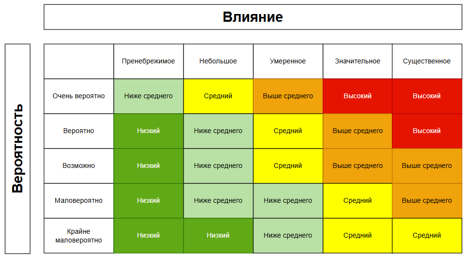
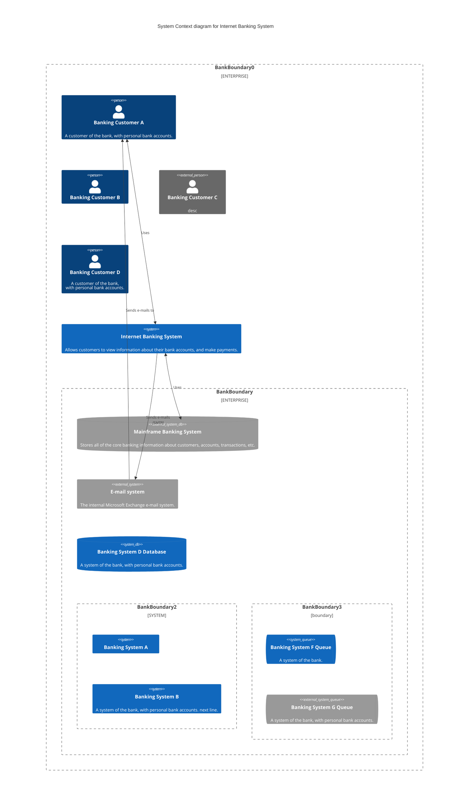

---
title: 6.07. Аналитика
---

# 6.07. Аналитика

# Раздел в разработке

# История аналитики

Аналитика как способ познания и принятия решений существовала задолго до появления компьютеров - собственно, в древности люди тоже анализировали данные. Пример - учёт урожая, распределение ресурсов, военные стратегии. Это всё аналитика, но современное понимание этой науки отличается от классического, особенно в контексте информационных технологий, и формировалось оно постепенно, под влиянием развития науки, экономики и техники. Аристотель имеет два сочинения - «Первая Аналитика» и «Вторая Аналитика», и это были просто рассуждения с логическим мышлением. Здесь важно отметить, что Аристотель называл формальную логику «аналитикой», а слово «логика» стали использовать позднее, после его смерти.

Поэтому да, аналитика существует ещё с древнейших времён.

В начале XX века термин «аналитик» ассоциировался с бухгалтерами, экономистами и статистиками - специалистами, которые обрабатывали данные для прогнозирования, выявления тенденций, оптимизации процессов и поддержки управленческих решений. Эти профессионалы анализировали финансовые отчёты, рыночные показатели и производственные циклы, но их работа была в основном ручной и не связывалась с автоматизированными системами (всё правильно, ведь систем не было!). В зависимости от области деятельности, аналитики работали в финансах, маркетинге, медицине, научных исследованиях и даже промышленности.

И представьте, как нужно было прогнозировать? Перед вами выгружают вагон с отчётами, которые писались вручную различными филиалами или подразделениями, и нужно было всё это изучить, структурировать, систематизировать, подготовить сводку, сделать выводы, какие-то прогнозы и в конце концов резюмировать это всё. Грязная работа, которая «выручает» начальников и руководителей, которым главное - понимать, куда всё идёт. Именно поэтому «бухгалтера» были приближенными в любом бизнесе, ведь они сочетали эти функции, порой и без специально выделенных для этого людей. Причем это только **финансовые показатели**, порой требовалось анализировать чужие отчеты, результаты деятельности конкурентов, чтобы понимать, у кого имеются полезные решения. Тем не менее, этим и занимается аналитик - сбор данных из различных источников, обработка этих данных от ошибок, дубликатов, пустых значений, формирование выводов и предложений.

Поэтому можно сказать, что сначала аналитики были именно финансовые и маркетинговые. Но мир, бизнес и экономика стремительно развивались - с появлением каждой новой технологии или изобретением устройств, отрасли менялись, и требовалось во всё это погружаться.

С приходом эпохи компьютеров в середине XX века ситуация уже изменилась, ведь в **1950-1960-х** годах первые ЭВМ начали внедряться в государственные и корпоративные структуры, и возникла острая потребность в людях, способных «переводить» бизнес-задачи на язык машин. Тогда и появился термин «**системный аналитик**» (system analyst). Его роль заключалась в том, чтобы понимать как бизнес-требования, так и технические возможности систем, выступая посредником между заказчиками и программистами.

Первые системные аналитики, разумеется, были инженерами или математиками, ведь вся вычислительная сфера была связана именно с ними. Это потом они переквалифицировались в IT окончательно. Они проектировали архитектуру систем, определяли потоки данных, разрабатывали спецификации - всё это требовало глубокого понимания как логики бизнеса, так и принципов работы программного обеспечения. Появление понятия «бизнес-логика» стало естественным следствием, ведь это та часть системы, которая отражает правила, процессы и политики организации, отличные от технической реализации.

К **1980-1990-м** годам, с ростом сложности программных продуктов и масштабов автоматизации, роль аналитика стала более специализированной. Разделение труда привело к появлению нового термина «**бизнес-аналитик**». В отличие от системного аналитика, фокусировавшегося на технических аспектах, бизнес-аналитик сосредоточился на изучении потребностей бизнеса, моделировании процессов, сборе и документировании требований. Он стал ключевой фигурой на стыке управления и технологий.

Изначально понятие «аналитик» в IT считалось производным от других профессий и не имело чётких границ. Только к началу 2000-х годов, с развитием методологий управления проектами (PMBOK, PRINCE2) и стандартов вроде BABOK (Business Analysis Body of Knowledge), профессия бизнес- и системного аналитика окончательно оформилась как самостоятельная дисциплина с собственными компетенциями, сертификациями и карьерными траекториями.

Так что профессия аналитика в IT имеет двоякое происхождение - аналитик сам по себе существовал с древности, системный аналитик был больше математиком, а бизнес-аналитик и вовсе новая профессия.

И если первые компьютеры были именно академическими инструментами, а техногиганты изначально заключали контракт с небольшими компаниями с всего несколькими разработчиками, процесс был совсем иным, как и подходы к разработке - всё было **хаотично**, так как они были первооткрывателями. Позднее, с ростом индустрии и увеличением количества компаний разработчиков, стало очевидно, что одним договором, устными встречами и простыми текстовыми описаниями требования описывать уже недостаточно. Нужны были какие-то унифицированные языки моделирования, которые бы позволяли визуализировать процессы, структуры и поведение систем. Именно здесь на сцену вышли стандартизированные нотации, ставшие инструментами профессионального аналитика.

Когда заказчик (инициатор) формирует идею, она, как правило, устная и размытая, но содержащая основную цель и бизнес-логику. Но когда дело доходит до документирования таких целей, в игру вступают юристы - а юридический язык крайне тяжелый, ведь он избегает «лишних слов», и действует исключительно с целью «засудить» и «защититься от суда», словом, прикрывает задницу. Но дайте юридический документ математику - он поседеет! Поэтому аналитику приходилось «расшифровывать» такие документы, рисовать для себя более наглядную модель и описывать документацию. Каждый рисовал, ведь одно дело общие требования, но когда тебе нужно формировать архитектуру решения, из документа легко вытащить лишь сущности, а связи между ними - куда сложнее. Поэтому рисовалась **схема связей между сущностями**, но каждый делал это по своему, без единого подхода.

В середине 1990-х годов был разработан **UML** (Unified Modelling Language), ставший результатом объединения нескольких подходов к объектно-ориентированному моделированию. Ключевые фигуры — Грейди Буч, Айвар Джекобсон и Джеймс Рамбо (образовали так называемую «Банду трио»). В 1997 году UML был официально принят OMG (Object Management Group) как международный стандарт. UML позволил аналитикам и разработчикам описывать архитектуру ПО с помощью диаграмм: вариантов использования, классов, последовательностей, состояний и других. Это резко снизило недопонимание между командами.

**BPMN** (Business Process Model and Notation) появился позже, в начале 2000-х. Конкретно, BPMN 1.0 изначально разрабатывался Business Process Management Initiative (BPMI), а в 2005 году был передан OMG, который официально стандартизировал его. BPMN стал «языком» для описания бизнес-процессов в наглядной, графической форме. Благодаря простоте восприятия и богатой семантике (шлюзы, события, потоки) он быстро стал стандартом в бизнес-аналитике, особенно в банках, логистике и государственных структурах - сейчас это стандарт BPMN 2.0, появившийся в 2011 году.

Стандартизация этих и иных нотаций (вроде ERD (Entity-Relationship Diagram) для моделирования данных, DFD (Data Flow Diagram) и IDEF) означала, что аналитик больше не просто «рисовал схемы для себя», а создавал общепонятные артефакты, которые могли использоваться на всех этапах жизненного цикла ПО: от анализа требований до тестирования и сопровождения.

То есть, без аналитики, раньше разработка ПО частенько начиналась с кода, программисты понимали задачу «на слух», и сразу приступали к реализации. А как мы помним, зачастую источником задачи был именно заказчик. Это приводило к множеству ошибок, переделок и «неправильным» продуктам. Далеко ходить не надо - фрилансеры с заказами, техническое задание которых ограничивалось фразой «сделай мне сайт», понимают, о чём я. Позднее аналитик стал ключевой фигурой на старте проекта, ведь именно он собирал, уточнял, моделировал, документировал и координировал, что делало процесс системным. Особенно важной аналитика стала в условиях высокой стоимости ошибок. Чем позже обнаруживается ошибка в требованиях, тем дороже её исправление. По оценкам IEEE и исследованиям Standish Group, исправление ошибки на этапе эксплуатации может быть в 100 раз дороже, чем на этапе анализа.

История IT полна примеров катастроф, вызванных игнорированием аналитики. Можно выделить два ярких случая.

Первый - проект **NHS Connecting for Health** (Великобритания, 2002–2013), одна из самых масштабных неудач в истории государственных IT-проектов. Целью ставили создать единую электронную медицинскую систему для всей Англии, проект стоил более 12 миллиардов фунтов стерлингов, но был закрыт с минимальными результатами. Причинами провала были такие проблемы, как отсутствие чёткого анализа потребностей врачей и больниц, непродуманная архитектура, пренебрежение бизнес-процессами здравоохранения, слабая роль аналитиков на начальных этапах. Вместо глубокого анализа внедрялись «коробочные решения», которые не работали в реальных условиях. Работавшие в государственных структурах поймут, о чём речь - «добровольно-принудительное внедрение» без учёта интересов.

Второй - крах системы учёта труда в компании **Hewlett-Packard** (2010). HP внедряла новую систему учёта рабочего времени для 65 000 сотрудников. Проект провалился: система не учитывала локальные особенности стран, правила начисления оплаты были ошибочны, что привело к неверным выплатам и судебным искам. Причины - недостаточный анализ требований в разных регионах, отсутствие моделирования бизнес-логики, недооценка роли бизнес-аналитиков при глобальной автоматизации.

Что забавно, проблема игнорирования или недооценки важности аналитики существует всегда - практически на каждом проекте заказчику нужно «быстрее», он продавливает именно свою точку зрения и собственное видение, которое порой бывает рискованным или необдуманным. Если он продавит, и решение окажется неудачным, он всё равно обвинит команду разработки, что это они всё криво сделали. Сегодня аналитики есть везде, а этап разработки часто может быть короче, чем этап аналитики, ведь это снижает неопределённость, минимизирует риски и повышает шансы на успех проекта.


# Основы анализа

Что такое анализ?

Как мы помним, слово анализ пришло из греческого языка - «analysis», в переводе «разложение», «разбор». Поэтому технически, это процесс разбора чего-либо на части, но в профессиональной сфере (особенно в управлении проектами IT) это целенаправленное исследование с целью понимания, улучшения и проектирования.

У этого понятия есть широкий смысл - метод познания, при котором объект (система, процесс, проблема) мысленно или практически расчленяется на составляющие, чтобы понять их взаимосвязи, выявить закономерности, обнаружить узкие места и сформулировать решения.

А в контексте информационных технологий анализ - это промежуточный мост между реальным миром и цифровым решением, который отвечает на вопросы «что нужно бизнесу?», «какие у него процессы, правила, идеи?», «какие проблемы мешают эффективной работе?», «как технологии могут это изменить?». Например, если бизнес хочет автоматизировать приём заказов, аналитик не просто запишет «надо сделать форму», а изучит текущий процесс (как принимаются заказч сейчас), выявит участников (менеджеры, клиенты, склад), определит правила (скидки, сроки, проверка наличия), найдёт исключения (возвраты, ошибки), спроектирует, как это будет работать в системе.

Аналитика же - это активное выявление, структурирование и трансформирование знаний. Она включает в себя сбор информации, моделирование, формализацию, проверку согласованности и прогнозирование последствий изменений.

Анализ часто путают с диагностикой или контролем, но его цель не только найти проблему, но и понять её корни, контекст и возможные пути решения. Без понимания нельзя создать эффективное решение. Мой брат мне приводил хороший пример в сфере строительства, когда строители строго выполняют по документации, и могут не понимать, почему в этом месте должен быть углон на столько-то градусов, а уровень выше на 3 сантиметра. Ошиблись на сантиметр - здание рухнет. И роль аналитики аналогичная - если ошибся аналитик, система либо не заработает, либо будет работать не так, как нужно.

В зависимости от фокуса выделяют:
	- *бизнес-анализ* - изучение целей, процессов и потребностей организации;
	- *системный анализ* - исследование возможностей и ограничений технических систем;
	- *функциональный анализ* - определение, что система должна делать;
	- *анализ требований* - формализация ожиданий от продукта;
	- *процессный анализ* - моделирование и оптимизация рабочих потоков.

**Исследование** - это целенаправленный процесс сбора, изучения и интерпретации информации для понимания предмета, выявления проблем и поиска решений. В аналитике исследование — это не просто «посмотреть», а систематическое изучение бизнес-контекста, процессов, данных и требований с использованием интервью, документации, наблюдения и аналитических техник.

Мы уже изучали «объекты», и «сущности». Они очень важны для аналитиков. Это любой элемент реального или цифрового мира, который можно выделить и описать. В бизнес-анализе это человек (клиент, сотрудник), документ (договор, заявка), система (CRM, ERP), событие (оформление заказа, оплата). В моделировании это сущность в ERD/UML, которая имеет атрибуты (свойства) и участвует во взаимодействиях.

А что такое взаимосвязь? Это логическая или функциональная связь между объектами, процессами или данными. Показывает, как элементы влияют друг на друга. К примеру, клиент делает заказ, заказ **содержит** товары. Без понимания взаимосвязей невозможно построить корректную модель системы.

**Закономерность** - это повторяющаяся, предсказуемая связь между явлениями или данными, которая позволяет обобщать, прогнозировать и принимать решения. К примеру, 80% отказов клиентов происходят при ожидании ответа более 3 минут - это закономерность, которая указывает на проблему в сервисе. Аналитик ищет закономерности в данных, процессах и поведении пользователей, чтобы выявить скрытые правила системы.

Узкое место - это элемент процесса или системы, который ограничивает общую производительность и становится причиной задержек, ошибок или перегрузки. К примеру, все заявки проходят через одного менеджера на согласовании - это и есть узкое место. Выявление узких мест — одна из ключевых задач аналитики при оптимизации процессов.

**Формулирование** - это процесс точного, однозначного и понятного выражения мысли, требования или правила. В аналитике важно не просто понять, что нужно бизнесу, но и сформулировать это так, чтобы разработчики, тестировщики и заказчики понимали одинаково.

**Решение** - это вариант действия, направленный на устранение проблемы или достижение цели. Это может быть предложенная стратегия по изменению процесса, автоматизации, реорганизации данных, внедрения новой логики. Аналитик не всегда принимает решение, но оценивает альтернативы и предлагает обоснованный вариант.

**Процесс** - это упорядоченная последовательность действий, направленных на достижение определённого результата. Процесс имеет участников (роли), шаги (задачи), входы и выходы, а также правила и условия переходов.

**Структурирование** - это приведение разрозненной, хаотичной информации в упорядоченный, логичный и понятный вид. Это может быть преобразование устных рассказов менеджера в таблицу требований, группировка функций по модулям системы, построение дерева процессов.

**Выявление** - это процесс обнаружения скрытых, неочевидных или несформулированных элементов: требований, проблем, правил, исключений. Часто заказчики сами не знают, что им нужно. Аналитик «выявляет» это через вопросы, анализ данных, сравнение с лучшими практиками.

**Трансформирование** - это преобразование информации из одной формы в другую для лучшего понимания или использования. Системная адаптация с сохранением сути.


# Профессиональный анализ

Разработка программного обеспечения — это не просто реализация кода. Это проектирование сложной socio-технической системы, в которой технологическое решение должно точно соответствовать реальным потребностям бизнеса, пользователей и окружающей среды. Однако потребности эти редко поступают в виде чётких, непротиворечивых и структурированных требований. Чаще они разрознены, частично скрыты, сформулированы в терминах доменной области или выражены через боли, которые заказчик даже не осознаёт как системные. Именно поэтому в ИТ-проектах необходима промежуточная инженерная роль — **аналитик**, чья задача — трансформировать неструктурированную, часто эвристическую информацию в формализованную модель требований.

Без профессионального анализа возникает **дизайн без замысла**: разработчики конструируют систему, опираясь на собственное воображение, упрощённые интерпретации или фрагментарные указания. Это приводит к многочисленным итерациям, несоответствию продукта целям, избыточным функциям, высокой стоимости поддержки и, в конечном итоге, к провалу проекта. Анализ — это систематическая деятельность, направленная на **понимание**, **формализацию** и **валидацию** того, что должно быть построено, зачем и как оно будет использоваться.

---

### Что такое аналитика?

В ИТ-контексте термин «аналитика» употребляется в двух принципиально разных смыслах, что часто вызывает путаницу.

1. **Аналитика как результат** — это готовые данные, представленные в виде отчётов, дашбордов, метрик и визуализаций, которые служат основой для принятия решений. Пример: «аналитика продаж за квартал», «аналитика поведения пользователей в приложении». В этом случае подразумевается, что система уже существует, собирает данные и автоматически или с участием специалиста по данным (data analyst) производит их обработку.

2. **Аналитика как процесс** — это профессиональная инженерная деятельность по исследованию, структурированию, интерпретации и моделированию информации с целью выявления и формализации требований к будущей системе. Эта деятельность осуществляется до и в начале разработки и является предпосылкой для создания работающего решения.

Настоящая глава посвящена **аналитике как процессу** — той деятельности, которая обеспечивает корректную постановку задачи для всех последующих этапов ИТ-проекта.

---

### Аналитическое мышление: инструментарий разума

Профессиональный анализ невозможен без развитого **аналитического мышления** — когнитивной способности разлагать сложные явления на составляющие, выявлять взаимосвязи, сопоставлять гипотезы с фактами и делать логически обоснованные выводы. Аналитическое мышление включает в себя несколько ключевых компонентов:

- **Системное мышление** — способность видеть объект не как набор изолированных элементов, а как целостную систему с внутренними связями и внешними взаимодействиями. Системное мышление позволяет понимать, как изменение одного компонента повлияет на другие, а также учитывать влияние внешней среды (рынка, регуляторики, технологий).
  
- **Критическое мышление** — умение подвергать сомнению исходные утверждения, выявлять предпосылки, проверять логическую целостность аргументов и избегать когнитивных искажений (например, эффекта подтверждения или ложного консенсуса).

- **Внимание к деталям** — способность замечать несоответствия, пробелы, двусмысленности и скрытые допущения в информации, получаемой от заинтересованных сторон.

- **Методичность** — строгое следование проверенным процедурам сбора, обработки и верификации информации, что обеспечивает воспроизводимость и прозрачность аналитического процесса.

Эти когнитивные навыки становятся основой для применения конкретных техник анализа и моделирования.

---

### Техники анализа и моделирования

Профессиональный аналитик оперирует широким арсеналом методов, каждый из которых служит определённой цели: от стратегического позиционирования до детального проектирования процессов.

#### SWOT, PESTLE, MOST — анализ внешнего и внутреннего контекста

Эти фреймворки используются на ранних стадиях проекта для понимания окружения, в котором будет функционировать система. Они отвечают не на вопрос «как устроена система?», а на вопрос «почему она нужна и каковы её условия существования?».

- **SWOT** (Strengths, Weaknesses, Opportunities, Threats) — анализ сильных и слабых сторон организации (внутренние факторы) в сочетании с возможностями и угрозами внешней среды. Позволяет выявить стратегические цели, которые система должна поддерживать.

- **PESTLE** (Political, Economic, Social, Technological, Legal, Environmental) — макроанализ внешних факторов, влияющих на бизнес. Особенно важен при разработке решений для регулируемых отраслей (финансы, здравоохранение, энергетика).

- **MOST** (Mission, Objectives, Strategies, Tactics) — внутреннее стратегическое выравнивание. Проверяет, соответствуют ли тактические действия (включая разработку ИТ-системы) общей миссии и стратегии компании.

Эти методы редко используются в чистом виде в повседневной работе аналитика, но их структура помогает формировать первичный контекстный фрейм, который предотвращает «слепую разработку» в вакууме.

#### Mind Mapping (ментальные карты) — структурирование неструктурированного

Ментальные карты — это визуальный инструмент организации мышления. В отличие от линейного текста, карта отражает иерархические и ассоциативные связи между идеями. Аналитик использует их для:

- фиксации первоначальных идей в ходе интервью или мозгового штурма;
- выявления ключевых категорий предметной области;
- построения «карт знаний» по доменной области;
- подготовки структуры требований или пользовательских историй.

Хотя ментальные карты не являются формальным артефактом спецификации, они служат мощным когнитивным протезом для аналитика — особенно на стадии погружения в новую предметную область.

#### Дизайн процесса (BPMN) — визуализация автоматизируемого поведения

Когда речь идёт о системах, автоматизирующих бизнес-процессы (например, BPM-системы, ERP, CRM), ключевым артефактом становится **диаграмма бизнес-процесса**. Стандарт BPMN (Business Process Model and Notation) предоставляет унифицированный язык для описания:

- последовательности операций;
- участников (ролей и систем);
- точек принятия решений;
- исключений и компенсаций;
- интеграционных интерфейсов.

Для разработчика BPMN-диаграмма — это не картинка, а **выполняемая или как минимум проверяемая модель**. Она становится основой для настройки workflow-движков (включая такие платформы, как ELMA365 или BPMSoft). Более того, корректно построенная BPMN-модель позволяет заранее оценить сложность реализации, выявить потенциальные «узкие места» и согласовать логику с заказчиком без написания ни строчки кода.


### Системный анализ и требования: глубины понимания

Системный анализ — это ядро профессиональной аналитики в ИТ. Он направлен на выявление **функциональных и нефункциональных требований** к системе, а также на построение модели её поведения, структуры и взаимодействий. Важно различать **уровни глубины анализа**, которые зависят от характера проекта, его критичности и доступных ресурсов:

1. **Стратегический уровень** — определение целей системы, её места в бизнес-архитектуре, ключевых показателей эффективности (KPI). Здесь важны фреймворки вроде SWOT или MOST.

2. **Тактический уровень** — моделирование процессов, ролей, данных и правил. Именно на этом уровне применяются BPMN, use-case-диаграммы, глоссарии предметной области.

3. **Операционный уровень** — детальная проработка интерфейсов, логики валидации, алгоритмов, интеграционных контрактов. Часто выполняется совместно с архитектором или старшим разработчиком, но инициируется аналитиком.

Глубина анализа не должна быть ни избыточной (что ведёт к бюрократии и задержкам), ни недостаточной (что порождает неопределённость и переделки). Профессиональный аналитик умеет **адаптировать уровень детализации** под стадию проекта, риски и команду.

---

### Кто такой аналитик в ИТ?

Аналитик — это инженер, специализирующийся на **переводе доменных задач в технические спецификации**. Он выступает в роли **лингва-франка** между бизнесом и разработкой. Его основная ответственность — гарантировать, что система, которую строят разработчики, действительно решает ту проблему, ради которой она создавалась.

#### Почему аналитика критична для успеха проекта?

Разработчики — профессионалы в области реализации, а не в области понимания бизнес-контекста. Они могут писать код без аналитика, но:

- велика вероятность реализации **неверных или неполных требований**;
- разработка будет идти **итеративно и хаотично**, без чёткого направления;
- возникнет **избыточная сложность**, так как каждый разработчик будет интерпретировать задачу по-своему;
- тестирование будет затруднено, поскольку не будет чёткого ожидаемого поведения.

Аналитик снижает **энтропию коммуникации**. Он формализует требования, устраняет противоречия, согласовывает приоритеты и обеспечивает **единый источник истины** для всей команды.

---

### Виды аналитиков

В зависимости от фокуса и глубины взаимодействия с доменом и технологией выделяют несколько ролей:

- **Бизнес-аналитик (Business Analyst, BA)** — работает на стыке бизнеса и ИТ. Его главная задача — понять бизнес-цели, процессы и потребности пользователей и перевести их в требования. Часто не вникает в технические детали реализации.

- **Системный аналитик (Systems Analyst)** — более технически ориентированная роль. Он проектирует архитектуру взаимодействия компонентов, моделирует потоки данных, определяет интеграционные точки. Системный аналитик часто участвует в проектировании API, баз данных и микросервисов.

- **Продуктовый аналитик (Product Analyst)** — фокусируется на поведении пользователей в уже работающем продукте. Использует инструменты аналитики (Amplitude, Mixpanel, Google Analytics) для выявления точек роста и оптимизации user experience.

- **Data Analyst / Аналитик данных** — работает с массивами данных, строит отчёты, метрики, прогнозные модели. Его деятельность относится к аналитике как результату, а не как процессу проектирования.

В небольших командах функции BA и системного аналитика часто совмещаются в одном лице. В крупных проектах — разделяются для повышения экспертизы.

---

### Предметная область и её освоение

**Предметная область** (domain) — это совокупность знаний, правил, терминов, процессов и сущностей, характерных для конкретной сферы деятельности (например, страхование, логистика, медицина, производство). Именно в рамках предметной области формулируются бизнес-требования.

Разработчики, как правило, **не погружаются глубоко в предметную область** по нескольким причинам:

1. **Ограниченность времени и ресурсов** — их основная задача — реализация, а не изучение домена.
2. **Профессиональная специализация** — их экспертиза сосредоточена на технологиях, а не на бизнес-процессах.
3. **Риск когнитивной перегрузки** — одновременное освоение домена и решение сложных технических задач снижает эффективность.

Аналитик же **обязан освоить предметную область** на достаточном уровне, чтобы:

- правильно интерпретировать термины и концепции;
- выявлять скрытые бизнес-правила;
- строить корректные модели данных и процессов;
- задавать уточняющие вопросы, которые не приходят в голову разработчикам.

Это не означает, что аналитик должен стать экспертом в медицине или бухгалтерии. Но он должен говорить на языке заказчика и понимать логику его деятельности.

---

### Документирование: не «бумажка», а инженерный артефакт

В профессиональной ИТ-среде **документирование — это часть инженерного процесса**, а не бюрократическая формальность. Хорошая документация:

- фиксирует принятые решения;
- служит основой для тестирования и сдачи;
- обеспечивает преемственность при смене команды;
- ускоряет онбординг новых участников;
- снижает риски, связанные с потерей знаний.

Артефакты аналитика включают:

- **Глоссарий терминов** — устраняет двусмысленность;
- **Модели процессов (BPMN)** — визуализируют логику;
- **Use-case-спецификации** — описывают сценарии взаимодействия;
- **User stories с акцепт-критериями** — если используется agile-подход;
- **Требования к данным и интеграциям** — для архитекторов и разработчиков;
- **Матрицы трассировки** — связывают требования с тестами и задачами.

Документация должна быть **живой**: обновляться по мере уточнения требований, но при этом **контролируемой** — с версионированием и чётким статусом (черновик, согласовано, утверждено).

### Техники выявления требований: от хаоса к структуре

Выявление требований — это не пассивный сбор пожеланий, а **активный процесс исследования**, в ходе которого аналитик взаимодействует с заинтересованными сторонами, анализирует существующие системы и моделирует будущее состояние. Ниже приведены ключевые техники, каждая из которых имеет своё назначение, сильные стороны и ограничения.

#### Интервью и опросы

**Индивидуальное интервью** позволяет глубоко погрузиться в точку зрения конкретного стейкхолдера, особенно если речь идёт о ключевом пользователе или эксперте домена. Аналитик задаёт открытые вопросы, уточняет контекст, выявляет скрытые допущения. Формат подходит для получения качественных, а не количественных данных.

**Фокус-группа** (групповое интервью) эффективна, когда необходимо согласовать позиции нескольких ролей (например, бухгалтера, логиста и менеджера по продажам). Динамика группы может породить новые идеи, но также несёт риск доминирования одного участника или «группового мышления».

Анкетирование (в том числе **метод Дельфи**) применяется для сбора количественных данных или получения консенсуса от экспертов при невозможности личной встречи. Метод Дельфи предполагает несколько раундов анонимного анкетирования с обратной связью по итогам каждого раунда, что позволяет сойтись к обоснованному мнению без давления авторитетов.

#### Мозговой штурм и ролевые техники

**Мозговой штурм** ориентирован на генерацию идей без критики на начальном этапе. Его цель — выйти за рамки текущих решений. Однако для перехода от идей к требованиям необходим последующий этап отбора и структурирования.

**Ролевая игра** (role-playing) заставляет участников «примерить» на себя роли пользователей или систем. Это особенно полезно при проектировании интерфейсов или сложных сценариев взаимодействия (например, обработка чрезвычайной ситуации). Через симуляцию выявляются неочевидные исключения и edge-кейсы.

#### Сценарные и визуальные методы

**Раскадровка** (storyboarding) — пошаговое описание пользовательского сценария в виде последовательности кадров или описаний. Позволяет визуализировать user journey, включая эмоции, действия и системные ответы. Часто используется в UX-анализе, но применима и в бизнес-анализе.

**Прототипирование** — создание упрощённой модели интерфейса, процесса или системы. Прототип может быть бумажным, интерактивным (в Figma, Adobe XD) или даже функциональным (low-code mock). Главная цель — **ранняя валидация** гипотез с пользователями без затрат на разработку.

#### Анализ существующих артефактов

**Сбор и анализ документации** — изучение регламентов, инструкций, нормативных актов, старых ТЗ. Позволяет понять, как процесс описан «на бумаге», даже если в реальности он отличается.

**Анализ функций существующей системы** — реверс-инжиниринг текущего решения. Особенно важен при миграциях, реинжиниринге или интеграциях. Анализ может включать просмотр логов, трассировку вызовов, интервью с пользователями о «как на самом деле работает».

**Извлечение данных** — работа с дашбордами, отчётами, SQL-запросами, логами. Этот метод ближе к data-driven подходу и позволяет подтвердить или опровергнуть гипотезы количественно (например, «90% заказов создаются в первой половине дня»).

#### Интроспекция

Редко упоминаемый, но важный метод — **самостоятельное размышление аналитика**. Интроспекция не заменяет сбор данных, но помогает сформулировать гипотезы, выстроить логические цепочки, заметить противоречия. Профессиональный аналитик постоянно «прокручивает» информацию в уме, даже вне формальных сессий.

Эффективность выявления требований определяется не количеством использованных техник, а **целенаправленным подбором** методов под тип проблемы, аудиторию и контекст.

---

### Стратегия анализа и оценка затрат

Анализ — это не бесконечный процесс. Он требует **чёткой стратегии**, которая включает:

- определение **границ исследования** (что входит, что нет);
- выбор **уровня детализации** (high-level vs. detailed);
- планирование **итераций** (особенно в agile-среде);
- оценку **ресурсов**: времени, экспертов, инструментов.

Затраты на анализ измеряются в **человеко-часах**, но их нельзя рассматривать изолированно. Инвестиции в качественный анализ **снижают общую стоимость проекта** за счёт:

- сокращения количества переделок;
- уменьшения числа дефектов на этапе тестирования;
- повышения скорости разработки (ясные требования = меньше ожиданий и уточнений);
- снижения рисков срыва сроков.

Оценка часто строится на основе **аналогов** (предыдущих проектов) или **моделей сложности** (например, количество процессов × средняя сложность × коэффициент неопределённости).

---

### Как организовать процесс анализа

Процесс анализа должен быть **структурирован, но гибок**. Рекомендуемая последовательность:

1. **Инициация** — понимание целей проекта, определение ключевых стейкхолдеров, сбор первичного контекста (через PESTLE, SWOT и т.п.).
2. **Погружение** — интервью, анализ документов, изучение предметной области, построение глоссария.
3. **Моделирование** — создание BPMN-диаграмм, use-case-моделей, прототипов.
4. **Согласование** — презентация моделей заказчику, фиксация обратной связи, уточнение требований.
5. **Формализация** — документирование в виде спецификаций, user stories, матриц трассировки.
6. **Передача в разработку** — проведение аналитических сессий с командой, ответы на уточняющие вопросы.
7. **Сопровождение** — участие в refinement, уточнение требований по ходу реализации.

В agile-проектах этапы 3–6 повторяются итеративно в рамках каждого спринта. В waterfall — выполняются последовательно и завершаются фазой утверждения.

---

### Сдача анализа: передача ответственности

«Сдача анализа» — это не просто отправка документа по email. Это **формальный переход ответственности** от аналитика к разработчикам и тестировщикам. Для этого необходимы:

- **Чёткие акцепт-критерии** — что считается «готовым» требованием;
- **Утверждение ключевыми стейкхолдерами** — подпись, согласование в системе управления требованиями (например, Jira, Confluence, Polarion);
- **Проведение аналитической сессии** — «walkthrough» с командой разработки, где аналитик объясняет логику, контекст и граничные случаи;
- **Наличие обратной связи** — механизм, позволяющий разработчикам оперативно задавать уточняющие вопросы.

Только после этого аналитик может считать свою часть работы завершённой. Однако в реальности он остаётся «гарантом смысла» до тех пор, пока требование не реализовано и не принято заказчиком.


# Бизнес-аналитик

В современных IT-проектах, особенно в условиях высокой неопределённости, динамично меняющихся рынков и требований заказчиков, роль бизнес-аналитика выходит далеко за рамки простого «сборщика пожеланий». Это центральная фигура, обеспечивающая **смысловую и функциональную связь** между бизнесом и технической реализацией. Бизнес-аналитик — не просто посредник, а **инженер требований**, **интерпретатор бизнес-реальности** и **гарант того, что разрабатываемое решение действительно решает нужную проблему**.

Для понимания роли бизнес-аналитика необходимо сначала определить, что такое бизнес-анализ как дисциплина, и какую ценность он создаёт в контексте жизненного цикла программного продукта.

---

### Что такое бизнес-анализ?

**Бизнес-анализ** — это дисциплина, направленная на **выявление потребностей заинтересованных сторон**, **формулирование требований к решению**, **оценку возможных вариантов реализации** и **обеспечение соответствия итогового результата бизнес-целям**. Согласно определению из стандарта IIBA (International Institute of Business Analysis), бизнес-анализ — это «практика включения изменений в организации путём определения потребностей и рекомендации решений, которые приносят ценность заинтересованным сторонам».

Важно подчеркнуть: бизнес-анализ не ограничивается IT. Он применим в любых областях, где происходят изменения — от внедрения новых бизнес-процессов до реорганизации структуры компании. Однако в IT-контексте он приобретает особую значимость, поскольку именно здесь ошибки в интерпретации требований приводят к **значительным финансовым потерям**, **удлинению сроков**, **росту технического долга** и **даже провалу продукта**.

Бизнес-анализ — это не набор инструментов, а **способ мышления**: системный, ориентированный на ценность, основанный на доказательствах и вовлечении стейкхолдеров. Эта дисциплина требует как **аналитических**, так и **коммуникативных компетенций**, поскольку ключевая её задача — **перевод бизнес-языка в технический, и наоборот**, без искажений.

---

### Потребность заказчика: между желанием и необходимостью

**Потребность заказчика** — это не то, что он просит, а то, что ему необходимо для достижения бизнес-цели. Часто заказчик формулирует решение, а не проблему: «Мне нужна кнопка для экспорта в Excel» вместо «Мне нужно быстро получать отчёты в формате, совместимом с офисными приложениями». В этом различии — суть работы бизнес-аналитика.

Потребность может быть:

- **Явной** — чётко сформулированной и осознанной;
- **Неявной** — существующей, но не высказанной, иногда даже не осознаваемой самим заказчиком;
- **Латентной** — не имеющей отношения к текущей задаче, но могущей повлиять на архитектуру или гибкость решения.

Бизнес-аналитик должен уметь различать **реальную потребность** от **предлагаемого решения**, поскольку реализация решения без понимания цели часто приводит к созданию функциональности, которая не приносит ценности. При этом аналитик не должен отвергать предложенные заказчиком решения, а использовать их как **точку входа в диалог**, который позволит раскрыть скрытые требования и контекст.

---

### Понимание рынка и процессов: контекст как основа анализа

Бизнес-аналитик работает не в вакууме. Его выводы и рекомендации должны быть основаны на **глубоком понимании как внутренней, так и внешней среды**:

- **Внутренняя среда** включает бизнес-процессы организации, организационную структуру, корпоративную культуру, существующие ИТ-системы, регламенты и ограничения.
- **Внешняя среда** — это рынок, конкуренты, регуляторные требования, тренды, поведение клиентов и технологические возможности.

Понимание процессов — это не просто описание последовательности действий, а выявление **целей процесса**, **точек принятия решений**, **источников данных**, **ролей участников**, **метрик эффективности** и **потенциальных узких мест**. Без этого аналитик рискует оптимизировать не ту часть системы или внедрить решение, которое конфликтует с существующими практиками.

Анализ рынка позволяет бизнес-аналитику понимать, какие решения уже существуют, как они устроены, какие у них сильные и слабые стороны, и какое **уникальное предложение** может быть реализовано в рамках проекта. Это особенно важно в продуктоориентированных командах, где конкурентоспособность продукта — ключевой критерий успеха.

---

### Основные задачи бизнес-аналитика

Задачи бизнес-аналитика многогранны и зависят от зрелости организации, типа проекта и жизненного цикла разработки. Однако можно выделить **ядерный набор функций**, которые выполняются в большинстве случаев:

1. **Выявление и анализ требований** — сбор информации от стейкхолдеров, интерпретация, уточнение, верификация.
2. **Моделирование бизнес-логики** — создание абстракций, описывающих поведение системы (диаграммы, сценарии, правила).
3. **Формулирование решений** — предложение альтернатив, оценка их стоимости и ценности.
4. **Управление требованиями** — отслеживание изменений, разрешение конфликтов, поддержание актуальности спецификаций.
5. **Обеспечение согласованности** — сведение разных точек зрения в единую модель, достижение консенсуса.
6. **Оценка рисков и последствий** — прогнозирование влияния решений на бизнес и систему.
7. **Поддержка внедрения и валидации** — участие в тестировании, обучении, мониторинге эффекта от внедрения.

Эти задачи не являются линейными. Они часто повторяются итеративно, особенно в гибких методологиях, где требования уточняются по мере разработки.

---

### Роли бизнес-аналитика: участник, фасилитатор, аналитик

В зависимости от контекста и фазы проекта бизнес-аналитик принимает на себя **разные роли**, каждая из которых требует специфических навыков:

- **Участник** — в этой роли аналитик включён в обсуждение как равноправный член команды, вносит вклад в принятие решений, основываясь на своём понимании требований и ограничений.
- **Фасилитатор** — здесь аналитик выступает как нейтральный модератор, организуя встречи, интервью, воркшопы, помогая стейкхолдерам выразить свои мысли, избегая доминирования одних и подавления других.
- **Аналитик** — в этой роли он сосредоточен на структурировании, анализе, моделировании и документировании информации, выявляя скрытые зависимости, противоречия и возможности оптимизации.

Эффективный бизнес-аналитик должен уметь **плавно переключаться между ролями**, сохраняя при этом объективность и ориентацию на ценность.

### Бизнес-требования: от цели к спецификации

**Бизнес-требования** — это формализованное выражение потребностей организации или заинтересованных сторон, направленное на достижение стратегических или операционных целей. Они отвечают на вопрос: *«Что должно измениться, чтобы бизнес получил ценность?»*

Важно отличать **бизнес-требования** от **функциональных** и **нефункциональных**. Бизнес-требования описывают **цель** и **контекст**, а не техническую реализацию. Например:

- **Бизнес-требование**: «Сократить время обработки заказа клиентом до 5 минут».
- **Функциональное требование**: «Система должна позволять клиенту оформить заказ в три клика».
- **Нефункциональное требование**: «Время отклика интерфейса оформления заказа не должно превышать 800 мс».

Бизнес-требования обычно формулируются на языке бизнеса и должны быть проверяемыми, измеримыми и привязанными к бизнес-метрикам (KPI). Они служат основой для всех последующих уровней детализации.

---

### Бизнес-логика: формализация правил и поведения

**Бизнес-логика** — это совокупность правил, условий, последовательностей действий и ограничений, определяющих, **как система должна вести себя в ответ на внешние или внутренние события**. Это ядро поведенческой модели системы.

Бизнес-аналитик не изобретает логику, но **выявляет её из практики, регламентов и целей бизнеса**, а затем **формализует** так, чтобы разработчики могли однозначно её реализовать. Формализация может происходить через:

- **Сценарии использования** (Use Cases);
- **Правила принятия решений** (Decision Tables, Decision Trees);
- **Состояния и переходы** (State Machines);
- **Потоки данных и контроля** (BPMN, Activity Diagrams).

Ключевая задача аналитика — **избежать неоднозначности**. Например, фраза «если клиент постоянный, дать скидку» не является корректной бизнес-логикой. Нужно уточнить: кто считается постоянным (например, совершивший ≥3 покупки за 6 месяцев), какова величина скидки, распространяется ли она на все товары и т.п.

Бизнес-логика — это не «код в голове», а **документированная модель**, доступная для проверки, валидации и изменения. Она должна быть отделена от технической реализации, чтобы при изменении архитектуры или стека не терялась суть бизнес-правил.

---

### Бизнес-риски: идентификация и управление неопределённостью

**Бизнес-риски** — это потенциальные события или условия, которые, если произойдут, могут негативно повлиять на достижение целей проекта или бизнеса. В отличие от технических рисков, бизнес-риски связаны с **рынком, поведением пользователей, юридическими аспектами, стратегическими ошибками**.

Примеры бизнес-рисков:
- Низкий уровень принятия нового функционала пользователями;
- Изменение законодательства, делающее решение нерелевантным;
- Появление конкурента с более эффективным решением;
- Завышенные ожидания от ROI.

Бизнес-аналитик участвует в **оценке вероятности и воздействия** рисков, а также в разработке **мер по их смягчению**. Для этого применяются техники:

- **SWOT-анализ** (Strengths, Weaknesses, Opportunities, Threats) — не только для продукта, но и для самого решения;
- **Анализ «что, если»** (What-if analysis);
- **Картирование рисков** с расчётом ожидаемого ущерба.

Важно: риски не устраняются полностью — они **управляются**. Аналитик помогает команде принимать **осознанные решения** с учётом возможных негативных сценариев.

---

### Сбор требований: от хаоса к структуре

**Сбор требований** — это не единовременное действие, а **непрерывный процесс выявления, уточнения и согласования информации** от заинтересованных сторон. Цель — получить полную, непротиворечивую и проверяемую картину того, что должно быть реализовано.

Существуют различные **техники сбора требований**, каждая из которых подходит для определённого контекста:

1. **Интервью** — структурированный или неструктурированный диалог с ключевыми стейкхолдерами. Эффективен при работе с экспертами или при выявлении скрытых потребностей.
2. **Наблюдение** (Shadowing) — прямое наблюдение за работой пользователей в их реальной среде. Позволяет выявить «неформальные» практики, не отражённые в регламентах.
3. **Воркшопы и фасилитированные сессии** — коллективное обсуждение с визуализацией (например, через карточки, диаграммы), способствующее достижению консенсуса.
4. **Прототипирование** — создание макета интерфейса или процесса для быстрой обратной связи. Особенно полезно, когда заказчик не может чётко сформулировать ожидания.
5. **Анализ документов** — изучение регламентов, отчётов, логов, спецификаций существующих систем.
6. **Опросы и анкетирование** — для сбора количественных данных от большой аудитории.

Эффективный сбор требований требует **комбинации техник** и **итеративного подхода**. Однократное интервью редко даёт полную картину.

---

### User Story и Use Case: два подхода к описанию поведения

**User Story** и **Use Case** — это два распространённых артефакта, используемых для описания взаимодействия пользователя с системой. Несмотря на внешнее сходство, они имеют разную глубину и назначение.

**User Story** — краткая формулировка потребности в формате:  
> «Как `[роль]`, я хочу `[цель]`, чтобы `[выгода]`».

Пример: «Как менеджер по продажам, я хочу видеть историю заказов клиента, чтобы быстрее предлагать релевантные товары».

User Stories ориентированы на **ценность**, а не на детали. Они используются в Agile-подходах для планирования итераций. Однако они не описывают **альтернативные сценарии**, **ограничения**, **исключения** — для этого нужны дополнительные артефакты (например, сценарии или спецификации поведения).

**Use Case** — более формализованная модель, включающая:
- Актора (роль);
- Основной успешный сценарий;
- Альтернативные и исключительные потоки;
- Предусловия и постусловия;
- Технические и бизнес-ограничения.

Use Case даёт **полную картину взаимодействия**, что делает его предпочтительным в проектах с высокой степенью сложности, регуляторными требованиями или когда важна строгая верифицируемость.

Бизнес-аналитик должен уметь **выбирать подход**, соответствующий контексту проекта, а также **комбинировать оба метода**: например, использовать User Story для backlog’а и Use Case — для детального проектирования критически важных функций.

---

### Приоритизация требований: как выбрать, что делать первым

Не все требования одинаково важны. **Приоритизация** — это процесс ранжирования требований по критериям ценности, срочности, риска и усилий. Это позволяет команде **максимизировать отдачу от вложенных ресурсов**.

Рассмотрим три распространённые методики:

1. **MoSCoW** — классификация на:
   - **Must have** — критически важные для запуска;
   - **Should have** — важные, но не критичные;
   - **Could have** — желательные, но не обязательные;
   - **Won’t have (now)** — отложенные.

   Проста в применении, но субъективна и не учитывает усилия.

2. **Kano-модель** — классифицирует функции по влиянию на удовлетворённость:
   - **Базовые** (ожидаются по умолчанию, их отсутствие вызывает недовольство);
   - **Производительные** (чем больше — тем лучше);
   - **Восхитительные** (неожиданные, вызывают восторг).

   Помогает понять, какие функции «обязаны быть», а какие создадут конкурентное преимущество.

3. **RICE** — количественная модель на основе:
   - **Reach** (охват);
   - **Impact** (влияние на пользователя);
   - **Confidence** (уверенность в оценке);
   - **Effort** (трудозатраты).

   Формула: `RICE = (Reach × Impact × Confidence) / Effort`. Позволяет объективно сравнивать разнородные инициативы.

Выбор методики зависит от зрелости команды, доступности данных и типа проекта. Бизнес-аналитик должен уметь **обосновывать приоритеты**, а не просто расставлять метки.


### Основы бизнес-анализа

Бизнес-анализ фокусирует внимание на задачах организации, получая ответ на вопрос - а зачем вообще всё это нужно бизнесу?


Анализ требований включает в себя изучение представленных ожиданий, и перевод желаний в чёткие, измеримые и записанные требования. Бизнес хочет чего-то определённого. Здесь важно провести черту - бизнес-аналитик изучает потребность, возможно даже общаясь с пользователями, и формирует технически не точные бизнес-требования. А системный аналитик изучает бизнес-требования и формирует технически более точные требования. Но оба аналитика занимаются анализом требований, отличается лишь субъект - у бизнеса это, к примеру, пользователи, а у системного - бизнес.


То есть, анализ требований представляет собой формализацию ожиданий.

Порой разделения нет, и аналитик выполняет fullstack (фуллстек) функции - и бизнеса, и системного, из-за чего работа ведётся от самого начала до технической тонкости.

**Бизнес-аналитик** - это специалист, который переводит бизнес-цели в конкретные задачи для команды, выявляет потребности, анализирует процессы и помогает создавать решения, которые приносят ценность бизнесу. Именно он задаётся вопросами «Зачем?», «Что нужно?», «Как лучше?», изучает и делает понятным. 

Это профессионал, который исследует бизнес-проблемы и возможности, выявляет требования заинтересованных сторон, моделирует процессы и предлагает решения, направленные на повышение эффективности, снижение затрат или рост прибыли. Он работает на стыке бизнеса, технологий и управления изменениями, и ему придётся заниматься сбором, анализом, интерпретацией данных, подготовкой отчётов, выявлением проблем и возможностей для оптимизации, взаимодействовать с различными отделами и проводить исследования.

**Бизнес-цели** - это конкретные, измеримые, достижимые, релевантные и ограниченные по времени результаты, которые организация стремится достичь для реализации своей стратегии и миссии. 

Простыми словами - это то, чего организация хочет добиться. Заработать 10 миллионов, сократить издержки на 20%, выйти на новый рынок. Здесь важно понимать, что бизнесу плевать на тонкости, именно для этого он нанимает аналитиков. Вообще, вы же представляете, кто такой «бизнесмен»? Они живут по другим правилам, у них свои вопросы, и это руководство, которое даёт задачу в двух словах, а специалист принимает в работу и разбирается, беспокоя руководителя только если возникли проблемы.

Бизнес-аналитику может «прилететь» задача разобраться - как сократить время ожидания клиента перед получением результата оказания услуги, как ускорить процесс выдачи кредита. Порой может быть тонкая и конкретная задача - допустим, в имеющемся процессе выполняется запрос в другую систему, и нужно ускорить выполнение запроса.

Существует специальное мнемоническое правило (запоминалка, проще говоря), которое помогает формулировать чёткие, измеримые и выполнимые цели - SMART.

В **SMART** каждая буква - критерий, которому должна соответствовать цель:
	- **S** (Specific) - конкретная, означает, что цель ясная, без размытых формулировок;
	- **M** (Measurable) - измеримая, можно измерить прогресс и результат;
	- **A** (Achievable) - достижимая, реалистичная с учётом ресурсов. Иногда A трактуют как Agreed, то есть согласованная;
	- **R** (Relevant) - значимая, релевантная, соответствует стратегии и имеет смысл. Иногда R трактуют как Realistic - реалистичная;
	- **T** (Time-bound) - ограниченная по времени, имеющая чёткий срок.

Таким образом, бизнес-цели, соответствующие критериям SMART, должны быть конкретными, измеримыми, достижимыми, значимыми и ограниченными во времени. «Хочу увеличить продажи» не соответствует SMART, слишком расплывчато - как, когда, насколько? Вот аналитику и придётся заниматься изучением ситуации, задавая правильные вопросы и получать правильные ответы. Если цель всё ещё не соответствует SMART - уточняем снова и снова, пока не добьёмся соответствия.

Здесь мы приходим к логическому заключению, что именно SMART помогает отделить желания от задач. Поэтому лучше придерживаться этим принципам как основе планирования, контроля и отчётов.

Желание может быть следствием потребности.

**Потребность** - это то, без чего заказчик чувствует дискомфорт, неудобство или упущенную выгоду. Проблема, которую хочется решить, или возможность, которую хочется реализовать. Осознанное или неосознанное состояние недостатка чего-либо, побуждающее к действию с целью его устранения или удовлетворения.

Важно отличать **потребность** от **решения**. Если заказчик говорит «мне нужна кнопка «Экспорт в Excel» - это решение. Аналитик углубляется и ищет потребность решения - простым вопросом «Зачем?» - «Чтобы быстро делиться отчётами с бухгалтерией». Значит потребность в быстрой передаче данных в понятном формате.

Есть интересный **метод для выявления потребности 5 Why** - задавать пять раз подряд вопрос «Почему?» (или «Зачем?», на английском слово «Why» означает то же самое). Разумеется это не топорно, а грамотно должно быть, к примеру, «Что будет, если этого не сделать?», и смотреть на боль, потери, риски, мечты. Наблюдать за реальным поведением, а не только слушать/читать слова.

Чтобы разбираться, нужно понимание рынка и процессов. Это не просто «знать что-то», а уметь видеть контекст, в котором живёт бизнес, и механизмы, как он работает внутри. 

**Понимание рынка** — это знать, кто твои клиенты, конкуренты, тренды и правила игры, способность анализировать внешнюю среду (клиенты, конкуренты, регуляторы, технологии, тренды), чтобы выявлять возможности и угрозы для бизнеса. 

Чтобы развивать понимание рынка, нужно изучать клиентские сегменты (кто покупает, зачем, что их разражает?), следить за конкурентами (что они делают, что у них хорошо или плохо?), анализировать тренды (технологии, законы, поведение потребителей), читать отраслевые отчёты, интервью, отзывы, форумы.

**Понимание процессов** — это знать, как внутри компании что-то делается: кто что делает, зачем и как можно сделать лучше, способность декомпозировать, визуализировать и анализировать внутренние рабочие потоки компании, чтобы находить узкие места, дублирование, потери и точки роста.

Чтобы развивать понимание процессов, нужно рисовать AS-IS процессы, как есть сейчас, задавать вопросы «А зачем этот шаг?», «Кто это делает? Почему?», искать места, где теряется время/деньги/нервы, и конечно общаться с сотрудниками, которые знают реальность лучше всех.
Бизнес-цели порождают определённые процессы, работающие по определённым правилам. Совокупность таких правил представляет собой фактический мозг продукта или системы. Это бизнес-логика.

**Бизнес-логика** - это правила, которые определяют, как система должна вести себя в разных ситуациях, чтобы соответствовать целям бизнеса. Не «что нажать», а «что должно произойти, если нажать» и «когда можно нажимать, а когда нельзя». Всё это представляет собой совокупность правил, условий, алгоритмов и ограничений, которые отражают политику, процессы и требования бизнеса и определяют поведение системы при выполнении бизнес-функций.

Поэтому, если разработчик задаётся вопросом, а зачем это - то ему нужно идти за разъяснением именно к аналитику, который владеет пониманием бизнес логики.

Код - реализация логики. Интерфейс - то, как пользователь взаимодействует с логикой. А бизнес-логика уже отражает суть, что должно произойти, при каких условиях, в каком порядке, с какими ограничениями. Ньюанс лишь в том, что логику надо формулировать ещё до того, как разработчик начнёт писать код.

Бизнес-аналитик формулирует бизнес-логику в несколько этапов.

1. Собирает правила из разных источников - интервью с бизнесом, юристами, бухгалтерами, операторами, анализ текущих процессов (AS-IS), изучение документов (регламенты, договоры, политики, инструкции).
2. Структурирует и формализует в виде сценариев (use case, user stories), таблиц решений, диаграмм состояний, псевдокода или правил «ЕСЛИ…ТО».
3. Валидирует с заинтересованными сторонами - «Правильно ли я понял?», «А если так?», «А если иначе?».
4. Документирует и передаёт команде в виде требований (SRS, BRD, User Stories), в виде схем, матриц, прототипов с пояснениями, иногда в виде тест-кейсов для QA.

Логика часто живёт «в головах», и никто правила не записывал, потому что «всегда так делали». Аналитику придётся вытаскивать это наружу. Исключения - тоже логика, ведь не бывает «всегда», может быть «кроме», «если…», «при условии…». Придётся ловить эти ньюансы. Логика также может быть противоречивой, когда разные субъекты говорят отличающиеся друг от друга вещи, и это нужно согласовывать. К тому же, логика может меняться - новые законы, сезонные акции, изменение стратегии, нужно предусмотреть гибкость, например, настраиваемые правила.
Порой логика не имеет здравого смысла. То, что кажется очевидным нам, может быть неочевидно системе, поэтому нужно писать ВСЁ, даже «если корзина пуста - не показывать кнопку «Оплатить»». Часто на этом и прогорают аналитики.

Чтобы разобраться в логике, нужно также рисовать схемы, проверять вместе с реальными пользователями, формулировать однозначно, связывать с бизнес-целью. В итоге бизнес-логика должна представлять собой чётко сформулированные правила поведения системы, которые бизнес-аналитик извлек из реальных процессов, согласовал с заинтересованными сторонами и передаёт команде для реализации, чтобы продукт работал «как надо», а не «как получилось.

### Нужен ли бизнес-аналитику код? И нужно ли углубляться в технический стек?

Этот вопрос часто вызывает дискуссии. Ответ: **код писать не обязательно, но понимать — обязательно**.

Бизнес-аналитик не обязан быть разработчиком, но должен обладать **технической грамотностью**, достаточной для:

- понимания архитектурных ограничений (например, почему интеграция с устаревшей системой требует дополнительного времени);
- оценки сложности реализации требований («можно ли это сделать за спринт или это требует рефакторинга ядра?»);
- корректного общения с инженерами без искажений смысла;
- распознавания технических компромиссов и их последствий.

Углублённое знание конкретного стека (например, Spring Boot или .NET Core) не требуется — это задача архитекторов и разработчиков. Однако **понимание общих принципов**: клиент-серверная архитектура, REST vs GraphQL, синхронные и асинхронные операции, принципы безопасности, базы данных — критически важно.

В некоторых контекстах (например, в low-code/no-code платформах, таких как **ELMA365**, **OutSystems**, **Mendix**) бизнес-аналитик может напрямую участвовать в конфигурации логики. В таких средах знание синтаксиса не требуется, но понимание структуры данных, триггеров и workflow — обязательно. Здесь граница между аналитиком и разработчиком размывается, но цель остаётся прежней: **точно выразить бизнес-намерение в форме, пригодной для выполнения системой**.

Следовательно, **техническая компетентность — не про написание кода, а про осознанное участие в проектировании решения**.

---

### Управление требованиями: от возникновения до устаревания

**Управление требованиями** — это систематический процесс **идентификации, документирования, анализа, отслеживания и контроля изменений** в требованиях на протяжении всего жизненного цикла проекта или продукта.

Этот процесс включает:

1. **Атрибутирование требований** — каждое требование должно иметь:
   - уникальный идентификатор;
   - источник (кто запросил);
   - приоритет;
   - статус (предложено, утверждено, реализовано, отклонено);
   - связи с другими требованиями, тестами, задачами.

2. **Трассировка (traceability)** — установление связей между:
   - бизнес-требованиями и функциональными;
   - функциональными и тест-кейсами;
   - тест-кейсами и дефектами.

   Это позволяет отвечать на вопросы: «Какие тесты покрывают это требование?», «Что сломается, если мы уберём этот функционал?»

3. **Контроль изменений** — любое изменение в требованиях должно проходить оценку влияния, согласование и фиксацию. Это особенно важно в регулируемых отраслях (медицина, финансы).

4. **Версионирование и актуализация** — требования устаревают. Аналитик отвечает за поддержание документации в актуальном состоянии, особенно при итеративной разработке.

Инструменты управления требованиями варьируются от простых таблиц (Confluence, Excel) до специализированных систем (Jira с аддонами, Jama Connect, IBM DOORS, qmsWrapper). Выбор зависит от масштаба проекта и требований к аудиту.

Ключевой принцип: **требования — это живой артефакт, а не разовый отчёт**.

---

### Анализ конкурентных продуктов и предложений на рынке

Бизнес-аналитик не ограничивается внутренними потребностями — он обязан понимать **внешний контекст**, в котором будет существовать продукт. **Конкурентный анализ** помогает:

- выявить лучшие практики (best practices);
- избежать ошибок, уже совершённых другими;
- определить уникальное торговое предложение (УТП);
- обосновать архитектурные и функциональные решения.

Методы конкурентного анализа:

- **Feature mapping** — сравнение функциональности по категориям;
- **User journey benchmarking** — сопоставление пользовательских сценариев;
- **Теневой анализ** — прохождение пользовательского пути в продуктах конкурентов;
- **Отзывы и рейтинги** — анализ фидбэка в App Store, Google Play, G2, Capterra.

Важно не копировать, а **понимать мотивацию** стоящую за функциями конкурентов. Например, наличие чата в приложении банка может быть не «модным трендом», а ответом на высокую стоимость звонков в колл-центр.

Результаты анализа фиксируются в **аналитических записках**, **матрицах сравнения** или **SWOT-диаграммах**, которые становятся основой для стратегических решений.

---

### Потенциальный эффект от реализации задачи

Перед тем как включать задачу в бэклог, необходимо оценить её **потенциальный эффект** — то есть **измеримое улучшение бизнес-показателей**, которое она принесёт.

Эффект может быть:

- **Количественным**: рост конверсии на 5%, снижение времени обработки заявки на 30%, уменьшение количества звонков в поддержку на 200 в день.
- **Качественным**: улучшение пользовательского опыта, повышение лояльности, снижение когнитивной нагрузки.

Оценка эффекта требует **гипотезного мышления**: «Если мы внедрим X, то Y изменится на Z». Гипотеза должна быть проверяемой. После релиза проводится **валидация**: действительно ли эффект достигнут?

Бизнес-аналитик играет ключевую роль в **формулировке гипотез**, **определении метрик успеха** и **анализе пост-релизных данных**. Без этого команда рискует оптимизировать «ради активности», а не ради ценности.

---

### SWOT-анализ: структурированная оценка стратегического контекста

**SWOT-анализ** (Strengths, Weaknesses, Opportunities, Threats) — это метод стратегического планирования, позволяющий оценить внутренние и внешние факторы, влияющие на инициативу.

В контексте IT-проекта SWOT помогает:

- **Strengths (Сильные стороны)** — что у нас уже есть (например, зрелая команда, доступ к данным, доверие пользователей);
- **Weaknesses (Слабые стороны)** — что ограничивает (например, устаревший фронтенд, отсутствие A/B-тестирования);
- **Opportunities (Возможности)** — внешние условия, которые можно использовать (например, рост рынка, новые регуляторные требования, технологии);
- **Threats (Угрозы)** — внешние риски (новые конкуренты, санкции, утечки данных у других игроков).

SWOT не даёт прямых решений, но **структурирует мышление** и помогает избежать слепых зон. Например, сильная техническая команда (Strength) может быть использована для быстрого захвата ниши (Opportunity), но только если не игнорировать угрозу (Threat) в виде жёстких сроков патентования.

Бизнес-аналитик часто инициирует SWOT-сессии на этапе инициации проекта или при оценке крупных эпиков.

---

### Модель и схема процесса: в чём разница?

Нередко эти понятия путают, хотя они отражают **разные уровни абстракции**.

- **Схема процесса** — это **визуальное представление последовательности шагов**, часто в виде блок-схемы или BPMN-диаграммы. Она отвечает на вопрос: *«Что делается и в каком порядке?»*  
  Пример: «Клиент оформляет заказ → система проверяет наличие → бухгалтерия выставляет счёт → склад отгружает товар».

- **Модель процесса** — это **формализованное, многомерное описание**, включающее не только последовательность, но и:
  - роли участников (RACI-матрица);
  - входы и выходы;
  - бизнес-правила;
  - KPI;
  - исключения и альтернативные пути;
  - связи с другими процессами и системами.

Модель — это **аналитический артефакт**, который можно использовать для симуляции, оптимизации, аудита. Схема — это **инструмент коммуникации**, упрощённое представление для широкой аудитории.

Бизнес-аналитик создаёт схемы для быстрого согласования, но строит модели — для глубокого анализа и проектирования. Путаница между ними приводит к тому, что «процесс нарисован, но не понят».


### Риски

Вместе с логикой существуют и опасности. Это бизнес-риски, всё, что может пойти не так и помешать бизнесу достичь цели. Например: клиенты не купят, закон изменится, система упадёт, сотрудники уйдут, бюджет сожгут. Нужно не просто предусмотреть, но и подготовиться к рискам.

**Риск** — это событие или условие, которое, если произойдёт, окажет негативное (или иногда позитивное) влияние на цели проекта или бизнеса. 

**Бизнес-риск** — это риск, связанный с неопределённостью в рыночной, операционной, финансовой, юридической или стратегической среде, способный повлиять на прибыль, репутацию, выполнение обязательств или устойчивость бизнеса.

Можно выделить основные виды бизнес-рисков:
	- Рыночный - падение спроса, появление конкурента, изменение трендов;
	- Операционный - сбой системы, ошибка сотрудника, задержка поставки;
	- Финансовый - рост курса валюты, нехватка бюджета, невыплата клиентом;
	- Юридический - изменение законов, штрафы, судебные иски и претензии;
	- Технологический - устаревание ПО, хакерская атака, несовместимость систем;
	- Репутационный - негатив в СМИ, плохие отзывы, утечка данных;
	- Стратегический - ошибка в выборе направления, неудачный запуск продукта.

Анализ рисков включает в себя ряд шагов:
1. **Идентификация рисков** - нужно спросить себя «Что может пойти не так?». Методы - мозговой штурм, интервью, анализ похожих проектов, SWOT, чек-листы.
2. **Оценка рисков** - нужно оценить по двум параметрам:
	- Вероятность - насколько вероятно, что случится?
	- Влияние - насколько сильно ударит по цели?

Часто для оценки используют **матрицу рисков**, которая отображает соотношение влияния и вероятности. Так и определяют степень (уровень) риска.



Визуально это просто - зеленый приемлемый, желтый средний, красный критичный.

3. **Приоритизация**, с фокусом на высоковероятных и высоковлияющих рисках (красная зона). Низковероятные получают низкий приоритет, и соответственно могут просто игнорироваться или мониториться без фокуса.
4. **Разработка мер реагирования**. На каждый риск используется свой подход. Можно выбрать одну из четырёх стратегий, либо комбинировать:
	- Избегать - убрать причину риска и не допускать возникновения;
	- Передать - переложить риск на другого (страхование, аутсорсинг);
	- Смягчить - уменьшить вероятность или влияние;
	- Принять - признать и подготовиться к последствиям.
5. **Мониторинг и контроль**. Нужно регулярно пересматривать список рисков, добавлять новые, закрывать устаревшие, и для этого ведут реестр рисков. В таком реестре обычно пишется риск, его вероятность, влияние, стратегия и ответственного.

При работе с рисками не нужно бояться говорить «а если», лучше услышать это на этапе проектирования, чем после провала. Нужно привязывать риск к целям, документировать, и говорить на языке бизнеса, используя их как аргумент. Именно риски позволят убедить несогласных с решением, отстоять время, бюджет или ресурсы.

# Системный аналитик

### Что такое системный анализ?

Системный анализ представляет собой методологию, направленную на изучение сложных систем с целью выявления, формализации и структурирования их свойств, поведения и взаимодействий с окружающей средой. В контексте разработки программного обеспечения системный анализ служит основой для перехода от неформальных, часто расплывчатых потребностей заказчика к чётко определённым, проверяемым и реализуемым требованиям.

В отличие от общего аналитического подхода, применяемого в социальных или экономических науках, **системный анализ в IT фокусируется на построении модели системы**, которая отвечает функциональным и нефункциональным ожиданиям заинтересованных сторон и при этом технически осуществима в рамках заданных ограничений. Это дисциплина, сочетающая элементы инженерии требований, информационного моделирования и архитектурного проектирования на ранней стадии жизненного цикла разработки.

Системный аналитик — это специалист, выполняющий эту трансформацию: он не просто фиксирует пожелания заказчика, а **интерпретирует, уточняет, логически связывает и верифицирует** их, превращая в основу для проектирования и реализации.


В отличие от бизнес-аналитика, для системного аналитика важно углубиться в технические тонкости, поэтому анализ тут бывает системный, функциональный и процессный.

Системный анализ фокусируется на том, что технически можно выполнить, а что нельзя, и какие имеются границы, ресурсы и архитектура. Заказчику всегда можно сказать «технически возможно всё», и добавить «но…», указав риски, цену, сложности и последствия. А чтобы их понимать, надо видеть возможности и ограничения:


Функциональный анализ фокусируется на том, что должна делать система. Важно определить чистый список действий - должна сохранять, отправлять, проверять, и так далее.


Процессный анализ фокусируется на потоках, шагах и оптимизации. Нужно определить, как выполняется работа сейчас (как она движется - так формируется поток), где узкие места и как сделать быстрее/дешевле. Да, «дешевле» важно для обоих - как бизнеса, так и системного, вопрос лишь в том, кто-то экономит и какие есть ресурсы, потому надо учитывать всё. Схематично любой процесс состоит из шагов:


Когда анализируем процессы, каждый шаг каждого процесса может представлять собой такой же процесс, и иметь свои шаги, свой результат. Чтобы выявить шаг, нужно понять, где начало, где конец - каково входящее состояние сущностей и каково исходящее:


Под изменением состояния можно подразумевать абсолютно что угодно - поле в базе данных, значение переменной, статус документа, баланс на счёте. Также к этому относится и действие - к примеру, при отправке уведомления на Email, на входящем состоянии у пользователя не было сообщение, а на исходящем - будет. Отсюда результат - наличие Email-сообщения. И всё в таком духе - под эту формулу можно подгонять что угодно.


---

### Перевод бизнес-требований в техническое задание

Одна из центральных задач системного аналитика — интерпретация бизнес-требований и их преобразование в форму, пригодную для реализации инженерной командой. Бизнес-требования, как правило, выражаются в терминах целей, метрик, процессов и ролей: *«нам нужно ускорить обработку заявок»*, *«клиенты должны видеть статус заказа в реальном времени»*, *«бухгалтерия хочет ежедневный отчёт по поступлениям»*. Такие формулировки носят декларативный характер и не содержат информации о том, **как** достичь желаемого результата.

Системный аналитик проводит работу по **декомпозиции**, **контекстуализации** и **формализации** этих требований. Он выявляет:

- **Актёров** — кто взаимодействует с системой;
- **Сценарии использования** — в каких условиях и для каких целей система будет применяться;
- **Границы системы** — что входит в неё, а что является внешним окружением;
- **Ограничения** — регуляторные, технические, временные или организационные рамки;
- **Критерии приемки** — как будет проверяться, что требование выполнено.

Результатом этой работы становится **техническое задание (ТЗ)** — документ, фиксирующий согласованные требования к системе. ТЗ может варьироваться по форме: от структурированного текстового документа до набора пользовательских историй с акцептанс-критериями, дополненного диаграммами и спецификациями интерфейсов. Важно понимать, что ТЗ — это **не конечный продукт**, а живой артефакт, подлежащий уточнению и актуализации по мере развития проекта.

---

### Техническое задание, спецификации и требования: уточнение терминов

Термины «требования», «спецификации» и «техническое задание» часто используют в разговорной практике как синонимы, однако в профессиональном контексте они имеют чёткие различия:

- **Требования (requirements)** — это заявленные или выявленные потребности заинтересованных сторон. Они могут быть бизнес- (why), пользовательскими (who, what) или системными (how). Требования — это **что** система должна делать или обеспечивать.
- **Спецификации (specifications)** — формализованное описание требований в терминах, понятных разработчикам и тестировщикам. Спецификация отвечает на вопрос **как** система будет удовлетворять требованиям — например, через API-контракт, формат сообщений, логику обработки.
- **Техническое задание** — это совокупность спецификаций, дополненная контекстом, ограничениями, критериями качества и другими элементами, необходимыми для планирования, реализации и верификации системы. ТЗ — это **организующий документ**, связывающий бизнес-намерения с инженерной деятельностью.

Корректное разграничение этих понятий позволяет избежать подмены целей средствами: например, требование «система должна быть быстрой» требует спецификации в виде «время ответа на запрос /api/orders не должно превышать 300 мс при нагрузке до 1000 RPS».

### Анализ функциональных и нефункциональных требований

Процесс системного анализа включает не только выявление того, **что** должна делать система, но и **каким образом** она должна это делать с учётом качества, надёжности, масштабируемости и других характеристик. Для этого требования разделяют на две категории: **функциональные** и **нефункциональные**.

**Функциональные требования** описывают поведение системы в ответ на определённые входные данные или действия пользователя. Они отвечают на вопрос: *«Какие задачи система должна выполнять?»*. Примеры:  
— «Пользователь может авторизоваться по логину и паролю»;  
— «Система создаёт PDF-отчёт по завершённым заказам за выбранный период»;  
— «При создании заявки система проверяет наличие обязательных полей и возвращает ошибку, если они не заполнены».

Такие требования часто формулируются через **сценарии использования (use cases)** или **пользовательские истории**, и поддаются верификации с помощью тест-кейсов. Системный аналитик должен обеспечить их полноту (все необходимые функции учтены), непротиворечивость (нет конфликтующих условий) и однозначность (нет двусмысленных формулировок).

**Нефункциональные требования (NFR)**, напротив, определяют **качественные характеристики системы** — её производительность, безопасность, удобство использования, совместимость и т.д. Они отвечают на вопросы: *«Насколько быстро?», «Насколько надёжно?», «Какие стандарты безопасности соблюдаются?»*. Примеры:  
— «Система должна поддерживать одновременную работу не менее 5000 пользователей»;  
— «Данные, передаваемые между клиентом и сервером, шифруются с использованием TLS 1.3»;  
— «Интерфейс должен соответствовать WCAG 2.1 уровня AA».

Нефункциональные требования часто игнорируются на ранних этапах, но именно они определяют **пригодность системы для эксплуатации в реальных условиях**. Системный аналитик обязан выявлять такие требования в ходе интервью, анализа аналогов или регуляторных требований (например, GDPR, HIPAA). Важно формулировать NFR **измеримо**, чтобы их можно было проверить: вместо «система должна быть быстрой» — «время отклика на 95-м перцентиле не превышает 800 мс».

---

### Проектирование архитектурных решений: роль системного аналитика и границы компетенции

Вопреки распространённому мнению, системный аналитик **участвует в проектировании архитектурных решений**, но не занимается их **окончательной детализацией или реализацией**. Его вклад заключается в том, чтобы:

- Определить **структурные ограничения**, вытекающие из требований (например: необходимость интеграции с внешней системой через SOAP-интерфейс накладывает ограничение на выбор протоколов);
- Предложить **варианты архитектурных паттернов** на уровне компонентов и их взаимодействия (например: «для поддержки масштабируемости обработки заказов целесообразно выделить отдельный микросервис»);
- Смоделировать **основные потоки данных**, границы подсистем и точки интеграции (часто в виде диаграмм компонентов, последовательностей или контейнер-диаграмм по методологии C4);
- Убедиться, что архитектурные гипотезы **соответствуют бизнес-целям** и не вносят избыточной сложности.

Однако **архитектор** — это отдельная роль, отвечающая за техническую целостность системы, выбор стека технологий, обеспечение соответствия принципам надёжности, масштабируемости и сопровождаемости на длительной временной дистанции. Архитектор принимает окончательные решения по структуре системы, учитывая не только текущие требования, но и прогнозируемую эволюцию, затраты на технический долг и стратегические приоритеты компании.

Таким образом, системный аналитик **задаёт рамки** и **формулирует проблемное пространство**, в котором архитектор ищет оптимальное решение. Это разделение необходимо для предотвращения перегрузки аналитика техническими деталями и избежания ситуаций, когда архитектура проектируется без учёта реальных бизнес-потребностей.

---

### Отличие системного аналитика от бизнес-аналитика

Хотя обе роли работают с требованиями и взаимодействуют с заказчиком, их **фокус, цели и артефакты** принципиально различаются.

**Бизнес-аналитик** сосредоточен на **бизнес-процессах, метриках эффективности и стратегических целях организации**. Он отвечает за выявление «боли» бизнеса, анализ текущих операций, моделирование «как есть» и «как должно быть», оценку ROI от внедрения изменений. Его основные инструменты — BPMN-диаграммы, анализ стоимости-выгоды, карты потоков создания ценности (Value Stream Mapping). Результат его работы — **понимание того, зачем нужна система и какие бизнес-задачи она решает**.

**Системный аналитик**, в свою очередь, работает **на стыке бизнеса и технической реализации**. Он принимает результаты работы бизнес-аналитика и трансформирует их в **спецификации, модели данных, контракты API, диаграммы взаимодействия**. Его цель — сделать требования **понятными, реализуемыми и проверяемыми для инженерной команды**. Он говорит на языке как бизнеса, так и разработки, но его продукт — не бизнес-модель, а технический артефакт, пригодный для проектирования и кодирования.

На практике в небольших командах эти роли могут совмещаться, но в крупных проектах, особенно с высокой сложностью домена или регуляторными требованиями, чёткое разделение повышает качество требований и снижает риски недопонимания.

### Хард-скиллы системного аналитика: компетенции, лежащие в основе профессии

Системный аналитик — это профессия, требующая синтеза знаний из нескольких областей. В отличие от узкоспециализированных ролей, таких как frontend-разработчик или QA-инженер, аналитик должен обладать **широкой технической эрудицией** и способностью быстро осваивать новые предметные области. Его хард-скиллы можно разделить на несколько ключевых блоков.

**1. Инженерия требований (Requirements Engineering).**  
Это фундаментальная дисциплина, включающая:
- Техники сбора требований (интервью, workshops, анализ документов, наблюдение за пользователями);
- Методы моделирования: use case-диаграммы, диаграммы последовательностей (UML, BPMN), потоки данных (DFD), модели сущность–связь (ERD);
- Подходы к управлению требованиями: трассировка (traceability), приоритизация (MoSCoW, Kano), версионирование и контроль изменений;
- Знание стандартов, таких как ISO/IEC/IEEE 29148 («Systems and software engineering — Life cycle processes — Requirements engineering»).

**2. Понимание архитектурных паттернов и технологий.**  
Системный аналитик не обязан писать код, но должен понимать:
- Принципы клиент-серверной архитектуры, REST/SOAP, очередей сообщений (Kafka, RabbitMQ), микросервисов и монолитов;
- Различия между реляционными и нереляционными СУБД, базовые принципы нормализации и денормализации;
- Основы безопасности: аутентификация, авторизация, принципы защиты от инъекций, XSS, CSRF;
- Принципы отказоустойчивости, горизонтального масштабирования, кэширования.

Эти знания позволяют ему корректно формулировать требования, избегать технически неосуществимых решений и эффективно взаимодействовать с архитекторами и разработчиками.

**3. Работа с моделями данных и API.**  
Системный аналитик часто создаёт или ревьюирует:
- Логические и физические модели данных;
- Контракты API (в форматах OpenAPI/Swagger, AsyncAPI);
- Примеры payload’ов запросов и ответов;
- Схемы валидации (JSON Schema и др.).

Эти артефакты служат основой для договорённостей между командами и гарантируют согласованность интерфейсов.

**4. Знание методологий разработки.**  
Понимание различий между Waterfall, Scrum, Kanban, SAFe позволяет аналитику адаптировать свои практики под контекст проекта:
- В итеративных методологиях акцент делается на инкрементальной детализации требований;
- В план-ориентированных проектах требуется полная спецификация на старте;
- В гибридных подходах аналитик совмещает элементы документирования и оперативного уточнения.

**5. Владение инструментами.**  
Типичный инструментарий включает:
- Confluence, Notion, SharePoint — для документирования;
- Jira, Azure DevOps, YouTrack — для управления задачами и трассировки требований;
- Draw.io, Lucidchart, PlantUML — для моделирования;
- Postman, Swagger Editor — для работы с API;
- SQL-клиенты — для верификации данных в существующих системах.

Критически важно, что системный аналитик использует эти инструменты не ради формальности, а как средства **обеспечения прозрачности, согласованности и воспроизводимости** требований.

---

### Постановка задач для разных ролей на основе аналитических артефактов

Работа системного аналитика завершается не созданием документа, а **передачей контекста** команде. Эффективная постановка задач предполагает адаптацию одного и того же аналитического ядра под потребности разных участников проекта.

**Для разработчиков** требуется:
- Чёткое описание поведения системы в виде сценариев или спецификаций;
- Полную контрактную спецификацию API (методы, параметры, статус-коды, примеры);
- Модель данных с описанием сущностей, связей и бизнес-правил;
- Нефункциональные требования, влияющие на реализацию (например: «операция должна быть идемпотентной»).

**Для тестировщиков** необходимы:
- Акцептанс-критерии, сформулированные в виде Given-When-Then;
- Граничные условия и сценарии ошибок;
- Ожидаемые результаты для каждого тестового случая;
- Метрики нефункционального тестирования (например: «проверить, что при 1000 одновременных запросов время ответа ≤ 500 мс»).

**Для DevOps-инженеров и SRE** важно:
- Понимание нефункциональных требований к масштабируемости, мониторингу, логированию;
- Сведения о зависимостях между компонентами;
- Требования к окружениям (например: необходимость отдельного staging для тестирования интеграций);
- SLA и SLO, если они определены.

**Для архитектора** системный аналитик предоставляет:
- Описание границ системы и её интеграционных точек;
- Перечень критически важных нефункциональных требований;
- Выявленные технические ограничения (например: необходимость поддержки устаревшего протокола);
- Сценарии, которые могут повлиять на выбор архитектурного паттерна (например: необходимость обработки событий в реальном времени).

Таким образом, системный аналитик выступает в роли **оркестратора контекста**: он не навязывает решения, но обеспечивает каждую роль той информацией, которая необходима для принятия обоснованных технических решений.

---

### Взаимодействие системного аналитика с командой на протяжении жизненного цикла проекта

Системный аналитик вовлечён в проект не только на этапе сбора требований. Его участие сохраняется на всех ключевых фазах:

- **На этапе запуска проекта** он участвует в инициации, определении scope, анализе рисков и составлении предварительной модели системы.
- **Во время проектирования** он уточняет детали, участвует в сессиях архитектурного проектирования, помогает сформулировать технические ограничения.
- **На этапе разработки** он отвечает на уточняющие вопросы, участвует в refinement-сессиях, вносит корректировки в требования при выявлении противоречий или упущений.
- **При тестировании** он участвует в верификации, проверяет соответствие реализации исходным требованиям, помогает интерпретировать спорные случаи.
- **На этапе сдачи и поддержки** он может участвовать в подготовке документации для эксплуатации, передаче контекста службе поддержки, а также в анализе обратной связи от пользователей для будущих итераций.

Важно подчеркнуть: системный аналитик — **не посредник**, а **активный участник инженерного процесса**. Его компетенция заключается в способности сохранять целостность требований при их трансформации в работающую систему.


## Исследование систем

Исследование систем — фундаментальная компетенция аналитика, находящаяся на пересечении технического понимания, архитектурного видения и способности к абстрактному мышлению. В отличие от поверхностного изучения функциональности или интерфейсов, исследование системы предполагает проникновение в её суть: выявление взаимосвязей между компонентами, распознавание логики работы, понимание ограничений и возможностей, а также формирование целостного образа системы как единого, живого организма. Такой подход становится особенно критичным в условиях наследственных (legacy) решений, сложных интеграций или высоконагруженных распределённых архитектур, где каждая деталь может повлиять на целостность, производительность и безопасность всей экосистемы.

Успешное исследование невозможно без **умения видеть проект целиком**. Аналитик не рассматривает систему как набор отдельных экранов, форм или API-эндпоинтов. Он воспринимает её как совокупность процессов, данных, взаимодействий и контекстов. Этот целостный взгляд позволяет избежать локальных решений, которые нарушают архитектурную целостность или создают скрытые зависимости между компонентами. Именно способность видеть систему «в профиль и анфас» отличает системного аналитика от исполнителя, ограниченного рамками отдельной задачи.

---

### Как знакомиться с системой: методология первого погружения

Первое знакомство с системой — критический этап, формирующий базовое ментальное представление. Оно начинается задолго до изучения кода или базы данных. В первую очередь, аналитик получает доступ к доступной документации: техническим спецификациям, архитектурным схемам, руководствам администратора, пользовательским инструкциям и, при наличии, модели домена. Отсутствие такой документации уже является сигналом о техническом долге и требует более пристального внимания.

Затем следует **функциональное погружение**: последовательное прохождение типовых пользовательских сценариев. Аналитик не просто «тыкает кнопки», а сознательно идентифицирует:
- границы системы (что внутри, что вне);
- ключевые пользовательские роли и сценарии;
- точки входа и выхода (внешние взаимодействия);
- циклы жизнедеятельности сущностей (например, заказ: создание → оплата → сборка → доставка → завершение).

Параллельно проводится **структурное погружение**: изучение архитектуры. Здесь важно различать уровни абстракции:
- **Логическая архитектура** — компоненты, их обязанности, доменные модели;
- **Физическая архитектура** — серверы, контейнеры, сети, окружения;
- **Технологический стек** — языки, фреймворки, базы данных, брокеры сообщений.

На этом этапе особенно полезны диаграммы C4 (Context, Containers, Components, Code), которые позволяют визуализировать систему на разных уровнях детализации. Если таких диаграмм нет, их создание часто становится первой аналитической задачей.

---

### Анализ архитектуры: от корней к деталям

Понимание архитектуры — это не просто знание, какие технологии используются, а осознание **причин их выбора** и **следствий** этого выбора. Аналитик задаёт вопросы:
- Почему выбран именно этот паттерн взаимодействия между сервисами?
- Как обеспечивается согласованность данных при распределённости?
- Какова стратегия масштабирования и восстановления после сбоев?
- Где находятся узкие места (bottlenecks)?

Ключевой навык — **реконструкция архитектуры из поведения системы**. При отсутствии документации или устаревших схем аналитик использует наблюдение за трафиком (через прокси или логи), анализ зависимостей между микросервисами, изучение конфигурационных файлов и манифестов (в случае контейнеризации). Это — своего рода **реверс-инжиниринг архитектуры**, направленный на восстановление целостной картины.

Особое внимание уделяется **точкам интеграции**. Каждое внешнее взаимодействие — потенциальный источник сложности, отказоустойчивости и технического долга. Аналитик должен чётко понимать:
- тип интеграции (синхронная/асинхронная);
- протокол (REST, SOAP, gRPC, Kafka и др.);
- формат данных (JSON, XML, Avro, Protobuf);
- контракт (API specification, schema);
- стратегию обработки ошибок и повторных попыток.

---

### Формирование вариантов технической реализации

На основе понимания текущей системы аналитик переходит к проектированию решений. Это не этап разработки, а **аналитическое моделирование альтернатив**. Цель — не предложить единственно верное решение, а сформировать обоснованный набор вариантов, каждый из которых сопровождается оценкой:
- сложности реализации;
- влияния на существующую архитектуру;
- рисков;
- затрат на сопровождение;
- совместимости с долгосрочной стратегией развития системы.

При этом аналитик опирается на принципы **инкрементальности** и **минимизации разрушительных изменений**. В идеале новое решение должно органично вписываться в существующую экосистему, а не требовать её полной перестройки.

---

### Анализ систем-источников и реверс-инжиниринг процессов

Во многих проектах (особенно при миграциях или интеграциях) аналитик работает не с «чистым листом», а с существующими системами-источниками. Здесь ключевая задача — **декомпозиция бизнес-процессов**, реализованных в legacy-системе. Реверс-инжиниринг процессов включает:
- восстановление сквозных сценариев по логам и аудит-таблицам;
- интервьюирование ключевых пользователей и суперпользователей;
- анализ правил обработки данных (часто закодированных в триггерах, хранимых процедурах или бизнес-правилах);
- выявление неочевидных зависимостей и «костылей», поддерживающих работоспособность системы.

Такой анализ позволяет не просто «скопировать» функциональность, а **переосмыслить** её в контексте новых требований и архитектурных принципов.

---

### UX-исследования, макетирование и прототипирование

Аналитик не обязан быть дизайнером, но обязан понимать, **как пользователь взаимодействует с системой**. UX-исследования помогают выявить болевые точки, избыточные шаги, когнитивную нагрузку и несоответствие интерфейсов реальным задачам. На основе этих данных создаются **макеты** — статические визуализации будущих экранов, форм, навигации. Они служат основой для обсуждения с заказчиком и разработчиками.

На следующем этапе — **прототипирование**. В отличие от макета, прототип демонстрирует поведение: переходы, валидации, реакции на действия. Прототипы интерфейсов модулей, особенно в части настройки интеграций или конфигурации сложных параметров, позволяют заранее выявить неудобства и архитектурные узкости. Например, если для настройки интеграции требуется заполнить 15 полей на трёх вкладках без подсказок — это сигнал о необходимости упрощения или автоматизации.

---

### Анализ интеграций: API, протоколы и контейнеры данных

Интеграции — одна из самых сложных областей анализа. Аналитик должен уметь **читать и интерпретировать спецификации API**, понимать различия между подходами:
- **REST** — ресурс-ориентированный, статус-коды как часть контракта, stateless;
- **SOAP** — строгий XML-контракт, встроенная поддержка безопасности и транзакций;
- **асинхронные сообщения** — через брокеры (Kafka, RabbitMQ), где важны топики, схемы сообщений, гарантии доставки (at-least-once, exactly-once).

Критически важно понимать **контейнеры данных** — то, как данные упаковываются для передачи. Например, в REST API может использоваться JSON, но структура объекта должна быть согласована между сторонами. Аналитик формирует **маппинг полей**, учитывая различия в типах, форматах дат, кодировках и семантике.

Особое внимание — **обработка ошибок**: как система реагирует на недоступность endpoint’а, невалидный запрос, timeout? Эти сценарии должны быть явно описаны в требованиях.

---

### Маппинг данных и миграции

При замене систем или интеграции с внешними источниками возникает задача **миграции данных**. Аналитик участвует в проектировании маппинга: сопоставлении сущностей и атрибутов между источником и целью. Это включает:
- идентификацию ключей и уникальных идентификаторов;
- преобразование типов и форматов;
- разрешение конфликтов (например, дублирующихся записей);
- обработку исторических данных;
- валидацию полноты и целостности после миграции.

Маппинг оформляется в виде таблиц или спецификаций, часто с примерами значений. Это не просто техническая задача — она тесно связана с семантикой данных и бизнес-правилами.

---

### Анализ баз данных: SQL и NoSQL

Аналитик не обязан писать сложные SQL-запросы, но должен понимать **структуру и логику хранения данных**. При работе с **реляционными базами** он анализирует:
- схемы (DDL);
- связи между таблицами (внешние ключи);
- индексы и их влияние на производительность;
- использование представлений, триггеров, хранимых процедур.

В случае **NoSQL** (документные, ключ-значение, колоночные, графовые) акцент смещается:
- как данные группируются (в документе, в строке);
- какие паттерны запросов поддерживаются;
- как обеспечивается согласованность и масштабируемость.

Понимание этих различий позволяет аналитику корректно формулировать требования к хранению, извлечению и агрегации данных, не противореча архитектурным ограничениям используемых СУБД.

---

### Анализ высоконагруженных, облачных и микросервисных систем

В распределённых системах аналитик сталкивается с новыми классами проблем:
- **латентность** между сервисами;
- **частичные сбои** и необходимость идемпотентности;
- **трассировка запросов** по цепочке сервисов;
- **управление состоянием** в stateless-архитектуре.

Облачная среда добавляет слои абстракции: балансировщики, API-шлюзы, функции как сервис (FaaS), управляемые базы данных. Аналитик должен понимать, **какие ограничения и возможности накладывает облачная платформа** на проектируемое решение.

В микросервисной архитектуре особенно важна **граница ответственности** каждого сервиса. Аналитик помогает определить, в каком сервисе должна реализовываться та или иная бизнес-функция, избегая дублирования логики и «сервисного спагетти».

### Проверка соответствия реализованной функциональности требованиям: техническая сторона верификации

Проверка реализации — не просто сопоставление «то, что сделано» с «то, что было описано», а строгая процедура верификации, охватывающая как функциональные, так и нефункциональные аспекты. С технической точки зрения, аналитик должен убедиться, что реализация соответствует не только букве требований, но и их **смысловому контексту**, а также **архитектурным ограничениям**.

Для этого используется комбинация методов:

1. **Формальные проверки по спецификациям.** Требования должны быть выражены в виде проверяемых утверждений (например, «После подтверждения оплаты заказ переходит в статус “Готов к сборке” в течение 5 секунд»). Реализация проходит верификацию через автоматизированные тесты или ручную проверку с фиксацией исходных условий и ожидаемых результатов.

2. **Анализ логики в коде и конфигурациях.** В системах с конфигурируемой логикой (например, workflow-движки, правила обработки в BPM-системах) аналитик проверяет не только поведение в UI, но и корректность настройки правил: цепочек переходов, условий ветвления, действий по событиям. Это особенно важно в случае ELMA365, BPMSoft и подобных платформ, где логика часто выносится из кода в настраиваемые модели.

3. **Интеграционная валидация.** Если требование предполагает взаимодействие с внешней системой, проверяется не только успешный сценарий, но и обработка ошибок, таймаутов, повторных вызовов. Используются фейковые (mock) или тестовые инстансы внешних систем, чтобы смоделировать все возможные состояния.

4. **Соответствие контрактам API.** При наличии спецификации (OpenAPI, WSDL), реализация проверяется на строгое следование контракту: структура запроса/ответа, HTTP-статусы, заголовки, обработка ошибок. Отклонения от контракта могут вызвать сбои в смежных системах.

5. **Проверка данных.** Аналитик убеждается, что данные, создаваемые или модифицируемые системой, соответствуют ожидаемым форматам, типам и семантике. Например, поле «дата рождения» не должно содержать будущие даты, а сумма заказа — отрицательные значения, если это не предусмотрено бизнес-логикой.

Такой подход обеспечивает не только корректность поведения, но и долгосрочную поддерживаемость системы, поскольку явно задокументированные и проверенные контракты снижают риски регрессий при будущих изменениях.

---

### Работа с метриками: от сбора до интерпретации

Метрики — количественные показатели состояния и поведения системы. Для аналитика они служат объективным источником информации о том, **как система используется на практике**, а не только в теоретических сценариях. Работа с метриками включает несколько этапов:

- **Определение ключевых метрик.** На основе бизнес-целей и требований к системе формируется набор KPI: время обработки заявки, доля успешных транзакций, частота ошибок определённого типа, время отклика API. Эти метрики должны быть измеримы, сопоставимы во времени и привязаны к конкретным процессам.

- **Интеграция с системами мониторинга.** Аналитик взаимодействует с инженерами по надёжности (SRE) или DevOps-командой для настройки сбора метрик через инструменты вроде Prometheus, Datadog, Grafana или встроенных решений облачных платформ (Azure Monitor, AWS CloudWatch). Важно, чтобы метрики логировались с достаточным контекстом: идентификатор сессии, версия сервиса, география запроса и т.п.

- **Интерпретация данных.** Сбор — лишь первый шаг. Аналитик должен уметь отличать шум от сигнала: например, рост числа ошибок может быть вызван не багом, а изменением поведения пользователей (новый тип запросов). Для этого применяются методы временного анализа, корреляции с другими событиями (релизами, нагрузочными тестами) и сегментации (по регионам, ролям, версиям).

- **Использование в улучшении системы.** Метрики становятся основой для принятия решений: если 95-й перцентиль времени обработки заявки превышает SLA, это сигнал к оптимизации. Если определённый экран вызывает высокий процент отказов — требуется UX-ревизия. Таким образом, метрики превращаются из пассивного отчёта в активный инструмент управления качеством.

---

### Конфигурирование и настройка систем под новые требования

В современных ИТ-ландшафтах значительная часть логики выносится в **конфигурацию**, а не в код. Это позволяет быстрее адаптировать систему под меняющиеся требования без полного цикла разработки. Аналитик в таких случаях становится не только формулировщиком требований, но и **проектировщиком конфигурационных моделей**.

Конфигурирование включает:
- **Настройку workflow и бизнес-процессов.** Определение состояний, переходов, условий, исполнителей, таймаутов. Аналитик должен понимать семантику движка процессов, чтобы не проектировать несогласованные или циклические цепочки.
- **Параметризацию правил.** Например, настройка условий скидок, валидации полей, маршрутизации обращений. Здесь критически важно обеспечить читаемость и сопровождаемость правил, избегая сложных вложенных условий.
- **Кастомизацию UI.** В конфигурируемых платформах (например, low-code) аналитик может участвовать в проектировании форм, экранов, отчётов через drag-and-drop интерфейсы или декларативные описания.
- **Управление версиями конфигураций.** Конфигурации должны версионироваться так же, как и код, чтобы обеспечить откат в случае ошибок и соответствие требованиям аудита.

Ключевой принцип — **конфигурация как код** (Configuration as Code). Это означает, что все настройки хранятся в системе контроля версий, проходят ревью и тестирование. Аналитик, работая с такими системами, должен соблюдать дисциплину, аналогичную разработке: чёткие комментарии, атомарные изменения, документирование причин изменений.

---

### Observability: концепция и практическое применение

Observability — свойство системы, позволяющее выводить её внутреннее состояние на основе внешних выходных данных (логов, метрик, трассировок). В отличие от традиционного мониторинга, который проверяет известные сценарии («работает ли сервис?»), observability помогает отвечать на вопросы, которые заранее не были сформулированы («почему пользователи не могут оформить заказ в регионе X?»).

Три столпа observability:
1. **Логи (Logs)** — структурированные записи событий. Современные системы используют форматы вроде JSON с контекстными полями (trace_id, user_id, service_name), что позволяет эффективно фильтровать и агрегировать.
2. **Метрики (Metrics)** — числовые агрегированные показатели во времени (например, количество запросов в секунду, средняя задержка).
3. **Трассировки (Traces)** — полный путь запроса через распределённую систему. Каждый вызов между сервисами помечается одним идентификатором (trace ID), что позволяет визуализировать цепочку и выявлять узкие места.

Аналитик, даже не будучи инженером по надёжности, должен понимать, **какие данные доступны через observability-инструменты**, и использовать их при:
- анализе инцидентов;
- верификации поведения в продакшене;
- планировании новых функций (например, оценка нагрузки на существующие сервисы);
- документировании неявных ограничений системы.

Инструменты вроде Jaeger (трассировки), Loki (логи), Prometheus (метрики) и Grafana (визуализация) становятся частью рабочего окружения аналитика в зрелых инженерных командах. Умение составлять запросы к таким системам (например, PromQL, LogQL) значительно повышает эффективность анализа.


# Требования

### **Что такое требование?**

В контексте разработки программного обеспечения и управления ИТ-проектами **требование** — это формализованное, проверяемое и однозначное описание потребности, ожидания или ограничения, предъявляемого к продукту, системе, процессу или его компонентам. Требование служит основой для проектирования, реализации, тестирования и сопровождения решения. Оно отражает то, **что** должно быть сделано, а не **как** это должно быть сделано.

С научной точки зрения, требование — это утверждение, фиксирующее желаемое состояние системы или её поведение в определённых условиях. Ключевое свойство требования — его возможность быть интерпретированным однозначно всеми участниками проекта: аналитиками, разработчиками, тестировщиками, заказчиками и экспертами предметной области.

Не следует путать требование с пожеланием, идеей или задачей. Пожелание («Хотелось бы, чтобы система работала быстрее») — это неформальное выражение потребности и не является требованием до тех пор, пока оно не будет уточнено, измерено и формализовано («Система должна обрабатывать 10 000 запросов в секунду при задержке не более 200 мс»).

---

### **Управление требованиями как дисциплина**

**Управление требованиями (Requirements Management, RM)** — это систематическая дисциплина, охватывающая полный жизненный цикл требований: от их выявления до реализации и последующей поддержки. Она включает в себя процессы планирования, сбора, анализа, спецификации, верификации, валидации, отслеживания и контроля изменений.

Главная цель управления требованиями — обеспечить, чтобы система, в итоге реализованная, соответствовала реальным потребностям заинтересованных сторон, а также чтобы все требования были **прослеживаемы**, **согласованы**, **реализуемы**, **тестируемы** и **приоритизированы**.

В практической работе управление требованиями предотвращает такие типичные проблемы, как:
- упущенные или недопонятые функции,
- избыточные или противоречивые требования,
- «размытые» цели проекта,
- постоянные изменения без контроля,
- несоответствие конечного продукта ожиданиям заказчика.

Роль аналитика в этом процессе — не только фиксировать, но и **структурировать**, **анализировать**, **согласовывать** и **поддерживать актуальность** требований на протяжении всего проекта.

---

### **Классификация требований по BABOK**

Согласно *Business Analysis Body of Knowledge (BABOK v3)* — международному стандарту в области бизнес-анализа, — требования делятся на четыре категории:

1. **Бизнес-требования (Business Requirements)**  
   Отражают стратегические цели и высокий уровень результатов, которых организация стремится достичь. Формулируются на уровне компании или подразделения. Пример: «Сократить время обработки заказов на 30 % за счёт автоматизации складских операций».

2. **Требования заинтересованных сторон (Stakeholder Requirements)**  
   Описывают потребности отдельных групп или лиц, чьи интересы затрагивает система. Эти требования служат мостом между бизнес-целями и технической реализацией. Пример: «Оператор склада должен видеть статус каждого заказа в реальном времени».

3. **Требования к решению (Solution Requirements)**  
   Детализируют характеристики самого продукта или системы. Подразделяются на:
   - **функциональные** (что система делает),
   - **нефункциональные** (как хорошо она это делает: производительность, безопасность, удобство и т.д.).

4. **Переходные требования (Transition Requirements)**  
   Временные условия, необходимые для перехода от текущего состояния к будущему. Актуальны только в процессе внедрения. Пример: «Система должна поддерживать параллельную работу со старой и новой платформой в течение трёх месяцев».

Эта классификация важна, поскольку позволяет аналитику выстраивать логическую цепочку: от стратегии бизнеса → к интересам пользователей → к архитектуре и функциональности → к условиям внедрения.

---

### **Типы требований в IT-практике**

В инженерной среде, особенно в разработке ПО, чаще используют более прикладную классификацию, ориентированную на техническую реализацию:

- **Функциональные требования**  
  Описывают **поведение системы**: какие действия она должна выполнять в ответ на определённые входные данные или события. Пример: «При нажатии кнопки «Отправить» система должна валидировать форму и отправить данные на сервер».

- **Нефункциональные требования (NFR)**  
  Задают **качественные характеристики** системы: производительность, масштабируемость, надёжность, безопасность, удобство использования, совместимость и т.п. Пример: «Система должна поддерживать до 10 000 одновременных пользователей без падения производительности».

- **Переходные требования**  
  Как и в BABOK, это временные условия, необходимые для миграции, обучения, интеграции или отката. Пример: «Данные из устаревшей CRM-системы должны быть перенесены в новую без потерь».

Для технических специалистов понимание различий между функциональными и нефункциональными требованиями критически важно: первые определяют **логику работы**, вторые — **границы допустимого поведения**. Игнорирование NFR часто приводит к тому, что система «работает», но «не масштабируется», «не защищена» или «непригодна в эксплуатации».

---

### **Процессы управления требованиями**

Управление требованиями — это не разовое событие, а непрерывный цикл, включающий следующие ключевые этапы:

1. **Планирование управления требованиями**  
   На этом этапе определяется, *как именно* будет вестись работа с требованиями: какие методы сбора будут использованы, как будет осуществляться приоритизация, как будут фиксироваться изменения, кто участвует в согласовании и т.д. Результат — **План управления требованиями (Requirements Management Plan, RMP)**.

2. **Разработка требований**  
   Включает:
   - **сбор** (elicitation) — извлечение информации от заинтересованных сторон,
   - **анализ** — синтез, структурирование, выявление противоречий и пробелов.

3. **Проверка (verification)**  
   Убедиться, что требования корректно сформулированы, полны, непротиворечивы и соответствуют стандартам качества.

4. **Управление изменениями**  
   Любое изменение требований должно проходить формальный процесс: оценка влияния, согласование, документирование, обновление связанных артефактов.

Эти процессы итеративны и могут повторяться на разных этапах проекта — особенно в гибких методологиях, где требования уточняются по мере развития продукта.

---

### **План управления требованиями (RMP)**

**План управления требованиями** — это документ, регламентирующий подход к работе с требованиями в конкретном проекте. Он не описывает сами требования, а определяет **процедуры** их обработки. В типичный RMP входят:

- Подход к определению и документированию требований (форматы, шаблоны, инструменты).
- Методы сбора и анализа (например, интервью, прототипирование).
- Критерии качества требований (SMART, INVEST и др.).
- Процедура приоритизации (MoSCoW, значение/усилия и т.п.).
- Стратегия отслеживания (traceability matrix).
- Процесс управления изменениями (change control board, workflow).
- Роли и ответственности (часто в виде матрицы RACI).

Наличие RMP особенно важно в крупных, сложных или регулируемых проектах (например, в банковской сфере, здравоохранении), где отсутствие контроля над требованиями чревато юридическими и финансовыми рисками.

---

### **Матрица RACI в контексте требований**

**Матрица RACI** — инструмент распределения ролей в процессе работы с требованиями. Для каждого артефакта или действия определяются:

- **R (Responsible)** — кто выполняет работу (например, бизнес-аналитик составляет спецификацию),
- **A (Accountable)** — кто несёт окончательную ответственность за результат (часто product owner или руководитель проекта),
- **C (Consulted)** — кто предоставляет экспертную информацию (разработчик, архитектор, юрист),
- **I (Informed)** — кто должен быть проинформирован о результате (тестировщики, поддержка).

Пример для функционального требования:
- **R**: бизнес-аналитик,
- **A**: product owner,
- **C**: архитектор и ведущий разработчик,
- **I**: команда QA и технический писатель.

Чёткое распределение ролей снижает риск «серых зон» ответственности и ускоряет согласование.

---

### **Жизненный цикл требования**

Требование проходит несколько фаз, образующих его **жизненный цикл**:

1. **Выявление потребностей** — понимание проблемы или возможности.
2. **Формулирование** — перевод потребности в текст требования.
3. **Анализ и приоритизация** — оценка реализуемости, стоимости, влияния.
4. **Согласование и утверждение** — валидация с заинтересованными сторонами.
5. **Реализация** — разработка и тестирование по требованию.
6. **Верификация и валидация** — проверка соответствия.
7. **Поддержка и изменение** — обновление при изменении контекста.
8. **Архивирование или утилизация** — когда требование устаревает.

Каждый этап сопровождается метаданными: дата создания, автор, статус, версия, связи с другими требованиями и задачами.


**Сбор требований** — это процесс, когда аналитик вытаскивает на свет то, что заказчик хочет, нуждается и ожидает — даже если сам этого до конца не осознаёт. Обычно сбор требований возлагается именно на бизнес-аналитика, однако системному аналитику тоже придётся с этим работать. Это совокупность методов и техник, направленных на выявление, документирование, анализ и согласование потребностей и ожиданий заинтересованных сторон относительно будущей системы, продукта или процесса.

Требования нужно собирать, чтобы не делать лишнего (тратить время и деньги), чтобы не упустить важное (и не переделывать потом), чтобы все говорили на одном языке (бизнес, IT, QA, маркетинг и другие), и конечно чтобы потом измерить успех, сравнив результат с требованиями.

Имеется множество подходов к сбору требований, и выбор зависит от ситуации, проекта, команды, бюджета, сроков и зрелости бизнеса.
1. **Интервью** (Interviews) - это беседа аналитика с заинтересованными лицами (заказчиками, пользователями, экспертами) с целью выявления потребностей, проблем и ожиданий. Его нужно использовать на старте проекта, когда нужно глубоко погрузиться в предметную область, или когда участники не могут сформулировать требования сами. К примеру, аналитик встречается с менеджером по продажам и спрашивает «Как вы сейчас обрабатываете заказы? Что вызывает сложности? Что бы вы хотели автоматизировать?», но это в самом начале. Если же проект уже работает, и задача более узкая, могут быть более простые или наоборот, сложные интервью.
2. **Анкетирование / Опросы** (Questionnaires & Surveys) - это сбор информации от большой группы людей с помощью структурированных вопросов (онлайн или на бумаге). Использовать, когда нужно собрать мнения от многих пользователей или получить статистику, приоритеты,  наболевшее. К примеру, опрос клиентов о том, какой функцией в личном кабинете пользуются, какую хотели бы видеть.
3. **Мозговой штурм** (Brainstorming) - групповая сессия, где участники генерируют идеи без критики, чтобы найти нестандартные решения или выявить скрытые потребности. Использовать для поиска инноваций, когда нужно «взболтать» мышление команды, или на этапе генерации идей для нового продукта. К примеру, можно всей командой из 10 человек собраться и за 45 минут сгенерировать 50 идей, как улучшить текущую ситуацию.
4. **Наблюдение** (Observation / Job Shadowing) - аналитик наблюдает, как пользователи выполняют задачи в реальной обстановке, чтобы выявить неочевидные проблемы и реальные процессы (а не те, что «на бумаге»). Используется, когда пользователи не могут точно описать свою работу, или когда есть подозрение, что процессы «в теории» и «на практике» отличаются. Пример - аналитик целый день сидит рядом с оператором колл-центра и видит, что тот 10 раз копирует данные из одного окна в другое, а это можно автоматизировать, к примеру, автозаполнением.
5. **Анализ документов** (Document Analysis) - изучение существующих документов — регламентов, инструкций, отчётов, спецификаций, писем, чатов — для выявления скрытых требований и правил. На самом деле, это крупнейший вариант. Используется, когда есть наследие в виде старых систем или процессов, или для понимания юридических, финансовых, нормативных требований. Аналитик может читать договора, законы, копаться в архивах или запрашивать что-то ещё, и находить нужное для работы.
6. **Ролевые игры / Сценарии использования** (Use Cases / User Stories / Role Playing) - это моделирование ситуаций взаимодействия пользователя с системой для выявления шагов, условий, исключений и ожидаемых результатов. Используется для описания функциональных требований, в Agile Scrum проектах (через User Story) и чтобы «прожить» сценарий, найти в нём дыры и уязвимости.
7. **Прототипирование** (Prototyping) - создание упрощённой модели интерфейса или процесса (бумажной, цифровой, интерактивной), чтобы визуализировать требования и получить обратную связь ДО разработки. Использовать в тех случаях, когда сложно описать словами, для согласования с пользователями, и чтобы избежать дорогостоящих переделок. Самый простой пример - кликабельный макет формы заказа. 
8. **Фокус-группы** (Focus Groups) - групповое обсуждение с целевой аудиторией под руководством модератора для сбора мнений, реакций, идей. Используется для оценки восприятия нового продукта или функции, для сбора эмоциональной обратной связи. Результаты могут сказать о многом.
9. **Семинары требований** (Requirements Workshops) - организованная сессия с участием всех ключевых стейкхолдеров для совместного определения, приоритизации и согласования требований. Использовать, когда нужно быстро согласовать много сторон, для сложных или конфликтных проектов.

### **Формулирование требований**

Формулирование — это процесс перевода выявленных потребностей в точные, однозначные и проверяемые утверждения. На этом этапе аналитик превращает неформальные высказывания заинтересованных сторон в технически корректные артефакты.

Качественное требование должно обладать следующими свойствами (часто обобщаемыми под акронимом **SMART** или **CARS**):

- **Понятность (Clarity)** — отсутствие двусмысленностей, жаргона без пояснений, расплывчатых формулировок вроде «интуитивный интерфейс».
- **Полнота (Completeness)** — все необходимые условия и контексты явно указаны.
- **Непротиворечивость (Consistency)** — требование не вступает в конфликт с другими.
- **Проверяемость (Testability)** — по требованию можно составить тест-кейс или сценарий верификации.
- **Реализуемость (Feasibility)** — требование технически достижимо в рамках заданных ограничений.
- **Проследимость (Traceability)** — возможность связать требование с бизнес-целью и с итоговой реализацией.

Пример неудачной формулировки:  
> «Система должна быть быстрой».  

Пример корректной:  
> «При 95-м процентиле нагрузки (до 5000 одновременных сессий) время ответа на запрос авторизации не должно превышать 300 мс».

Формулирование требует не только технической грамотности, но и умения задавать уточняющие вопросы, выявлять скрытые допущения и «невысказанные» ожидания.

---

### **Декомпозиция задач: вертикальная и горизонтальная**

Декомпозиция — это разбиение сложного требования или функциональности на более мелкие, управляемые компоненты. Это необходимо для планирования, оценки и распределения работ.

Существует два основных подхода:

1. **Вертикальная декомпозиция**  
   Разбивает функциональность **по уровням абстракции**: от высокоуровневого пользовательского сценария к детальным шагам реализации. Например:  
   - Уровень 1: «Пользователь может оформить заказ».  
   - Уровень 2: «Выбор товара → добавление в корзину → ввод данных доставки → оплата».  
   - Уровень 3: «Валидация email-адреса при вводе контактных данных».  

   Такой подход обеспечивает **сквозную реализацию ценности**: даже небольшая часть функционала приносит ощутимый результат (MVP-логика).

2. **Горизонтальная декомпозиция**  
   Разделяет задачу **по технологическим слоям**: UI, бизнес-логика, база данных, интеграции и т.д. Например:  
   - UI-часть: форма оформления заказа,  
   - Логика: расчёт итоговой суммы,  
   - БД: сохранение заказа в таблицу `orders`,  
   - Интеграция: отправка уведомления в CRM.  

   Горизонтальное разбиение удобно для распределения между специалистами (фронтенд, бэкенд), но не гарантирует поставку работающего функционала на ранних этапах.

В современной практике предпочтение отдаётся **вертикальной декомпозиции**, особенно в Agile-средах, поскольку она поддерживает принцип **инкрементальной ценности**.

---

### **Оценка объёма работ**

Оценка — это прогноз ресурсов (время, усилия, стоимость), необходимых для реализации требований. Точность оценки критически влияет на реалистичность графика и бюджета проекта.

#### **Что оценивается?**
- Трудозатраты (человеко-часы, человеко-дни),
- Техническая сложность,
- Риски (неопределённость, зависимости, интеграции),
- Необходимость дополнительных исследований (spike’и).

#### **Методы оценки**
1. **Аналоговая (по схожим задачам)** — используется историческая статистика.
2. **Параметрическая** — расчёт по формуле (например, «1 экран = 20 человеко-часов»).
3. **Экспертная** — мнение опытных разработчиков.
4. **Planning Poker / Story Points** — относительная оценка в безразмерных единицах, часто применяемая в Scrum.
5. **T-shirt sizing (S/M/L/XL)** — грубая категоризация по сложности на ранних этапах.

#### **Алгоритм оценки (рекомендуемый):**
1. Разбить требование на задачи (по вертикали!).
2. Уточнить неопределённости (провести spike при необходимости).
3. Выбрать метод оценки, соответствующий стадии проекта.
4. Включить буфер на риски (10–30 % в зависимости от новизны).
5. Утвердить оценку с командой (коллективная ответственность повышает точность).
6. Зафиксировать допущения и ограничения, на которых строилась оценка.

**Важно:** оценка — это не обязательство, а прогноз. Чем больше неопределённости, тем шире должен быть диапазон (например, 16–24 часа вместо «20 часов»).

---

### **Верификация и валидация: два разных процесса**

Часто эти термины путают, но их различие принципиально:

- **Верификация (Verification)** — *«делаем ли мы продукт правильно?»*  
  Проверка, что требования и реализация соответствуют внутренним стандартам, спецификациям и техническим критериям.  
  Инструменты:  
  - **Definition of Ready (DoR)** — критерии готовности требования к разработке (полное, понятное, оценено, имеет acceptance criteria),  
  - **Definition of Done (DoD)** — критерии завершения задачи (код написан, покрыт тестами, задокументирован, прошёл ревью),  
  - **Ревью требований** — коллегиальный анализ спецификации на полноту и качество.

- **Валидация (Validation)** — *«делаем ли мы правильный продукт?»*  
  Подтверждение, что реализованное решение действительно решает проблему заказчика.  
  Инструменты:  
  - **Согласование с заинтересованными сторонами**,  
  - **Три Amigo** — совместная сессия аналитика, разработчика и тестировщика для обсуждения acceptance criteria,  
  - **User Acceptance Testing (UAT)** — тестирование конечными пользователями в реальных условиях,  
  - **Демонстрации функционала** — регулярные показы работающего продукта.

Верификация — внутренний контроль качества; валидация — подтверждение соответствия бизнес-нуждам.

---

### **Передача требований команде разработки**

Передача — это не просто «бросание спецификации через стену», а **налаживание контекста**. Эффективная передача включает:

- **Презентацию требования** на планировании (grooming/planning session),
- **Обсуждение acceptance criteria** с участием всех ролей (Три Amigo),
- **Демонстрацию прототипов или макетов** (если есть),
- **Пояснение бизнес-ценности** — зачем это нужно заказчику,
- **Фиксацию открытых вопросов** и сроков их закрытия.

Аналитик выступает в роли **хранителя контекста**: он должен быть доступен в ходе реализации для уточнений, разъяснений и оперативного согласования изменений.

---

### **Поддержка в ходе разработки**

Реализация редко идёт строго по изначальному описанию. Возникают вопросы:
- «А что делать, если поле пустое?»
- «Какой статус считать “завершённым”?»
- «Как обрабатывать ошибку интеграции?»

Аналитик обязан:
- оперативно отвечать на запросы,
- уточнять или корректировать требования при обнаружении противоречий,
- участвовать в refinement’е (уточнении) бэклога,
- поддерживать **актуальность документации**.

Это **неотъемлемая часть цикла управления требованиями**.

### **Спецификация требований к программному обеспечению (SRS)**

**Software Requirements Specification (SRS)** — это формальный документ, описывающий функциональные и нефункциональные требования к системе, её внешнее поведение, ограничения и взаимодействие с окружением. SRS служит основой для проектирования, разработки, тестирования и приёмки продукта.

Хотя в Agile-средах SRS часто заменяется на гибкие артефакты (бэклог, пользовательские истории), в регулируемых отраслях (медицина, авиация, финансы) и при разработке сложных систем SRS остаётся обязательным элементом жизненного цикла.

#### **Стандартная структура SRS (в соответствии с IEEE 830-1998 и адаптированными практиками)**

1. **Введение**  
   - Цель документа,  
   - Область применения,  
   - Определения, аббревиатуры, термины,  
   - Ссылки на нормативные документы и источники,  
   - Обзор структуры документа.

2. **Общее описание**  
   - Перспектива продукта (как он вписывается в экосистему),  
   - Классы пользователей и характеристики,  
   - Ограничения (технические, юридические, временные),  
   - Предположения и зависимости,  
   - Диаграммы контекста (например, диаграмма потоков данных или Use Case overview).

3. **Функциональные требования**  
   - Организуются по подсистемам, модулям или пользовательским ролям,  
   - Каждое требование имеет уникальный идентификатор (например, `FR-101`),  
   - Описывается триггер, входные данные, поведение системы, выходные данные, ошибочные сценарии.

4. **Нефункциональные требования**  
   - Группируются по категориям: производительность, безопасность, надёжность, удобство использования, совместимость, масштабируемость и т.д.,  
   - Формулируются количественно, где возможно (например, «Время восстановления после сбоя — не более 5 минут»).

5. **Внешние интерфейсы**  
   - Пользовательские интерфейсы (описание или ссылка на макеты),  
   - Аппаратные интерфейсы,  
   - Программные интерфейсы (API, протоколы, форматы данных),  
   - Коммуникационные интерфейсы (сетевые протоколы, порты).

6. **Приложения**  
   - Глоссарий,  
   - Диаграммы,  
   - Примеры данных,  
   - Матрица прослеживаемости (если включена в SRS).

SRS не должен содержать решений архитектуры, алгоритмов или деталей реализации — только **что** система должна делать, а не **как**.

---

### **Типичные ошибки при формулировании и управлении требованиями**

1. **Расплывчатость и неоднозначность**  
   Использование субъективных формулировок: «удобный», «быстрый», «интуитивный». Такие требования невозможно проверить.

2. **Отсутствие измеримости в нефункциональных требованиях**  
   «Система должна быть надёжной» — бессмысленно без указания метрик: MTBF, допустимое время простоя, RTO/RPO.

3. **Игнорирование контекста использования**  
   Требование описано без учёта сценариев, ролей пользователей или исключительных ситуаций.

4. **Смешение уровней абстракции**  
   В одном документе — стратегические цели и детали UI-элементов — это нарушает структуру и усложняет управление.

5. **Отсутствие прослеживаемости**  
   Невозможно понять, какое требование реализовано в каком коде или покрыто каким тестом — это ведёт к «утерянным» функциям и регрессиям.

6. **Недооценка нефункциональных требований**  
   Часто рассматриваются как «второстепенные», хотя именно они определяют эксплуатационную пригодность системы.

7. **Отсутствие версионирования и контроля изменений**  
   Без фиксации изменений невозможно восстановить причинно-следственные связи при сбоях или спорах.

---

### **Почему участники проекта не работают с едиными требованиями?**

Несогласованность возникает не из-за «плохой воли», а из-за системных причин:

1. **Фрагментация источников**  
   Требования хранятся в разных местах: в Confluence, Jira, Excel, устных договорённостях, email’ах. Единого источника истины нет.

2. **Отсутствие единой терминологии**  
   Один и тот же термин (например, «аккаунт») может означать разное для бизнеса, разработки и поддержки.

3. **Разные представления о приоритетах**  
   Бизнес ценит скорость вывода на рынок, разработка — техническое качество, тестирование — покрытие. Без согласованного подхода к приоритизации возникает конфликт.

4. **Изменения без контроля**  
   Заказчик вносит правки напрямую разработчику, минуя аналитика — документация устаревает, команда работает по разным версиям.

5. **Отсутствие вовлечения технических специалистов на ранних этапах**  
   Архитектор или ведущий разработчик не участвует в анализе — требования оказываются технически неосуществимыми или избыточно сложными.

6. **Культура «догоняющего» документирования**  
   Требования оформляются постфактум, «чтобы закрыть процесс», а не как инструмент работы. В этом случае документ становится формальностью.

---

### **Подходы к документированию требований**

Выбор подхода зависит от методологии, сложности системы, регуляторных требований и зрелости команды.

#### **1. Классический (водопадный) подход**
- Используется полная, детализированная SRS до начала разработки.
- Подходит для проектов с фиксированным объёмом, чёткими границами, высокими требованиями к документации (например, госзаказы, embedded-системы).
- **Плюсы**: полнота, юридическая защищённость, чёткие границы.  
- **Минусы**: негибкость, высокая стоимость изменений.

#### **2. Agile-подход (на основе пользовательских историй)**
- Требования фиксируются как краткие истории: «Как [роль], я хочу [функция], чтобы [цель]».
- Детализация происходит по мере надобности (just-in-time).
- Acceptance criteria и примеры (Given/When/Then) заменяют формальную спецификацию.
- **Плюсы**: гибкость, фокус на ценности, быстрая обратная связь.  
- **Минусы**: риск потери контекста, сложность в регулируемых средах.

#### **3. Гибридный подход**
- Комбинирует SRS для ключевых модулей (например, ядра системы, интеграций) и пользовательские истории для итеративных улучшений.
- Часто применяется в enterprise-разработке.
- Используются living documents: спецификации, обновляемые в процессе разработки и синхронизированные с бэклогом.

#### **4. Model-Based Requirements Engineering (MBRE)**
- Требования выражаются в виде моделей: диаграмм BPMN, UML, SysML.
- Поддерживает автоматическую генерацию тестов, прослеживаемость и анализ полноты.
- Требует специализированных инструментов (Enterprise Architect, IBM Rhapsody и др.).

#### **5. Specification by Example (SBE)**
- Требования формулируются через конкретные примеры поведения.
- Формат: «Если пользователь вводит email без @, система показывает ошибку: “Некорректный формат email”».
- Легко трансформируется в автоматизированные acceptance-тесты (например, с помощью Cucumber).


# Документация

### Общее о документах

Документация в сфере информационных технологий — это не вспомогательный, а фундаментальный элемент инженерной и управленческой деятельности. Она выполняет функцию как среды передачи знаний, так и основы для принятия решений, координации усилий и обеспечения воспроизводимости результатов. В условиях высокой сложности IT-проектов, быстрой ротации персонала и распределённой разработки документы становятся критически важными артефактами, определяющими не только эффективность, но и возможность реализации проекта.

### Важность грамотности

Грамотность в контексте технической и бизнес-документации — это не только соблюдение норм орфографии и пунктуации, хотя и это важно. Это способность точно и однозначно выражать мысль, подбирать термины, соответствующие предметной области, и поддерживать логическую целостность текста. Ошибка в формулировке, неудачный пример или двусмысленное выражение могут привести к неправильному пониманию требований, а это, в свою очередь, — к ошибкам в реализации, задержкам сроков и увеличению стоимости проекта.

Грамотность документа определяется не только качеством языка, но и структурой изложения: последовательностью аргументов, чёткостью определений, логикой перехода от общего к частному. В документации не допускается использование разговорных оборотов, метафор без пояснения или неопределённых ссылок вроде «как уже говорилось». Каждое утверждение должно быть либо обосновано, либо определено, либо подкреплено ссылкой на источник.

Особенно важно подчеркнуть, что грамотность — не синоним «сложности языка». Наоборот, высокий уровень технической грамотности проявляется в умении формулировать сложные идеи простым и точным языком без потери содержания. Это требует не только лингвистических, но и концептуальных усилий: автор документа должен полностью понимать предмет, чтобы суметь его корректно описать.

### Ясное и чёткое изложение сложных бизнес-концепций

Одна из ключевых задач документации — трансляция абстрактных, часто неформализованных бизнес-концепций в структурированные и интерпретируемые технические артефакты. Бизнес-процессы, организационные цели, регуляторные требования, стратегические метрики — всё это изначально существует в форме вербальных или интуитивных представлений у заинтересованных сторон. Документация становится инструментом их формализации.

Ясность здесь означает не только читаемость текста, но и возможность его однозначного толкования. Это достигается через:

- использование единообразной терминологии;
- явное определение всех используемых понятий;
- введение ограничений и границ применимости;
- применение визуальных моделей (диаграмм, таблиц, схем) как дополнения к тексту;
- разграничение фактов, предположений и требований.

Когда аналитик описывает, например, «обработку заявки на кредит», он не просто пересказывает разговор с заказчиком. Он выделяет акторов, фиксирует триггеры и условия завершения, уточняет исключения, формулирует бизнес-правила и метрики эффективности. Каждый такой шаг — это не рерайт, а интеллектуальная работа по деконструкции и реконструкции реальности в форме, пригодной для последующей автоматизации или анализа.

### Разработка технической документации: является ли аналитик разработчиком документации?

Часто возникает вопрос: если аналитик создаёт документы, означает ли это, что он — разработчик документации? Ответ требует уточнения терминов.

В широком смысле — да: аналитик разрабатывает документацию как основной продукт своей деятельности. Однако важно провести грань между *техническим писателем* и *аналитиком*. Обе роли создают документы, но их цели, аудитория, временные горизонты и критерии качества различны.

Технический писатель фокусируется на передаче уже известной и стабильной информации конечному пользователю или операционному персоналу. Его документация — это руководства, справочники, описания API, инструкции по установке. Она предназначена для многократного использования и должна быть устойчивой к изменениям в реализации.

Аналитик, напротив, создаёт документацию как промежуточный артефакт, направленный на согласование, проектирование и контроль. Его документы — это не конечный продукт, а инструмент для достижения согласия между заинтересованными сторонами и перехода от неопределённости к определённости. Они часто подвержены изменениям, и их ценность заключается не в долговечности, а в точности передачи требований и контекста на конкретном этапе.

Таким образом, аналитик — не «разработчик документации» в узком смысле, а *инженер требований*, для которого документ — носитель модели знаний о системе и её окружении.

### Документы для бизнес-аналитика

Бизнес-аналитик работает на стыке бизнеса и технологий, и его документы отражают эту двойственность. Основные категории документов, с которыми он взаимодействует:

- **Бизнес-требования** (Business Requirements Document, BRD) — формулируют стратегические цели, метрики успеха, стейкхолдеров и общие границы проекта. Это документ высокого уровня, часто адресованный менеджменту и спонсорам.
  
- **Функциональные требования** (Functional Specification) — детализируют, *что* система должна делать. Здесь описываются сценарии использования, бизнес-правила, входы и выходы, условия валидации. Этот документ уже ориентирован на разработчиков и тестировщиков.

- **Модели бизнес-процессов** (BPMN, EPC и др.) — визуальные представления потоков работ, ролей, решений и событий. Они дополняют текстовые описания и позволяют выявлять несоответствия и узкие места.

- **User Stories и Use Cases** — альтернативные формы фиксации требований, особенно в гибких методологиях. Они фокусируются на пользовательской перспективе и ценности.

- **Матрицы трассировки** — инструменты обеспечения полноты и прослеживаемости: каждое требование должно быть связано с источником, дизайном, тестом и реализацией.

Все эти документы объединяет одна цель: обеспечить согласованное понимание бизнес-нужд всеми участниками проекта.

### Документы для системного аналитика

Системный аналитик фокусируется не на бизнес-логике как таковой, а на её технической реализуемости. Его документация лежит ближе к архитектуре и интеграции. Типичные артефакты:

- **Техническое задание** (ТЗ) или **Software Requirements Specification** (SRS) — содержит детализированные требования к интерфейсам, производительности, безопасности, совместимости, а также нефункциональные характеристики. Здесь уже задаются технические ограничения, протоколы, форматы данных.

- **Архитектурные диаграммы** (компонентные, развертывания, последовательности) — иллюстрируют, *как* система будет устроена. Это не про «что делать», а про «как это будет работать».

- **Спецификации API** — формализованные описания точек взаимодействия между системами, часто в форматах OpenAPI/Swagger.

- **Описание моделей данных** — ER-диаграммы, словари данных, описания миграций и трансформаций.

- **Документы по интеграции** — сценарии обмена, соглашения о форматах, SLA для внешних систем.

Системный аналитик, в отличие от бизнес-аналитика, работает с уже частично формализованными требованиями и отвечает за их корректную интерпретацию в техническом контексте. Его документы — это мост между проектированием и реализацией, и их качество напрямую влияет на архитектурную устойчивость и сопровождаемость системы.

### Использование шаблонов

Шаблоны документации — это не бюрократическая формальность, а механизм обеспечения полноты, последовательности и повторяемости. Хорошо продуманный шаблон:

- сокращает когнитивную нагрузку на автора, позволяя сосредоточиться на содержании, а не на структуре;
- обеспечивает единообразие в рамках проекта или организации;
- помогает избежать пропусков критически важных разделов (например, «ограничения», «риски», «альтернативные сценарии»);
- упрощает рецензирование и сопровождение документа.

Однако слепое применение шаблонов без адаптации к контексту может привести к обратному эффекту: документы становятся шаблонными в худшем смысле — содержат «воду», пустые заголовки и формальные фразы без смысла. Поэтому шаблон должен быть живым инструментом: его можно и нужно адаптировать под тип проекта, зрелость команды, сложность домена.

Важно также различать *шаблон как структуру* и *шаблон как контент*. Первое — рекомендация по компоновке материала; второе — заготовленные фразы, которые часто приводят к деградации качества. Профессиональный подход предполагает использование только структурных шаблонов с обязательным наполнением уникальным, предметным содержанием.

### Документ как артефакт инженерного мышления

Документация в IT не является побочным продуктом, а представляет собой результат системного мышления. Её создание требует не просто фиксации чужих слов, а выполнения интеллектуальной работы по моделированию, обобщению, выявлению противоречий и построению логически целостных конструкций. В этом смысле документ — не «отчёт о встрече», а *модель предметной области*, выраженная в языке, понятном целевой аудитории.

Именно поэтому качество документа напрямую коррелирует с глубиной понимания предмета его автором. Поверхностное описание требований, основанное на дословной записи интервью, почти неизбежно приводит к ошибкам в реализации. Напротив, документ, в котором чётко выделены сущности, связи, ограничения и неопределённости, становится основой для проектирования, тестирования и даже автоматизации.

Документация, таким образом, является не только средством коммуникации, но и инструментом познания и верификацией собственного понимания. Если аналитик не может сформулировать требование чётко и однозначно — это сигнал о том, что требование либо не согласовано, либо не до конца понято.

### Жизненный цикл документа

Как и любой инженерный артефакт, документ проходит ряд стадий: создание, согласование, утверждение, эксплуатация, актуализация и архивирование. Важно понимать, что не все документы проходят полный цикл — некоторые существуют лишь на время итерации или этапа анализа и после выполнения своей функции могут быть устаревшими по определению.

Тем не менее, для документов, имеющих долгосрочную ценность (например, архитектурные спецификации, глоссарии, соглашения по API), необходимо управлять их жизненным циклом. Это включает:

- **Версионирование** — каждая редакция документа должна быть идентифицируема, особенно если на неё ссылаются другие артефакты (например, тест-кейсы или код).
- **Срок действия** — явное указание, до какого момента документ считается актуальным или какие события его инвалидируют.
- **Ответственность за поддержку** — назначение владельца документа, который отслеживает изменения в системе и обновляет описание.
- **Механизмы уведомления** — если документ изменился, важно, чтобы заинтересованные стороны были об этом проинформированы.

Отсутствие управления жизненным циклом ведёт к ситуации, когда в системе сосуществуют несколько версий одного и того же документа, что создаёт когнитивный диссонанс и увеличивает риск ошибок.

### «Живая» и «мёртвая» документация

Эти термины отражают не формальный статус документа, а его практическую полезность и актуальность.

**«Живая» документация** — это та, которая регулярно используется, поддерживается в актуальном состоянии и влияет на решения. Примеры: спецификации API, открытые в Swagger UI; диаграммы архитектуры, встроенные в CI/CD-конвейер; пользовательские сценарии, используемые тестировщиками.

**«Мёртвая» документация** — это документы, которые были созданы «по шаблону», «для галочки» или «как было в прошлом проекте», но не поддерживаются и не используются. Они накапливаются в репозиториях, вводят в заблуждение новых участников и создают иллюзию порядка без реального содержания.

Причина появления «мёртвой» документации — отрыв процесса документирования от рабочих практик. Если документ пишется не для решения задачи, а для отчёта — он обречён стать мёртвым. Чтобы этого избежать, необходимо:

- связывать документацию с рабочими артефактами (например, генерировать документацию из кода или из моделей);
- внедрять практики коллективного владения документами (code review для документации, совместное редактирование);
- измерять полезность документа (например, через частоту обращений, ссылок, использование в тренингах).

### Поддержание актуальности

Актуальность документации — это не разовое усилие, а постоянный процесс. Поддержка достигается не за счёт периодических «ревизий», а за счёт встраивания документирования в рабочий процесс:

- **Изменения в коде → обновление документации**. Например, изменение контракта API должно автоматически помечать соответствующую документацию как требующую обновления.
- **Рецензирование документации как часть ревью кода**. Если PR включает изменение поведения системы, он должен включать и изменения в соответствующих документах.
- **Автоматизированная генерация**. Использование инструментов вроде OpenAPI, PlantUML, TypeDoc позволяет держать часть документации синхронизированной с кодом без ручного вмешательства.
- **Декомпозиция документации по уровням**. Базовые концепции (например, модель данных) требуют редкого, но глубокого обновления, тогда как пользовательские сценарии могут меняться часто. Разделение по уровням абстракции облегчает поддержку.

### Интеграция с системами управления знаниями

Современные проекты редко обходятся без централизованного хранилища знаний — будь то Confluence, Notion, GitHub Wiki, Docusaurus-сайт или внутренняя база знаний. Однако простое размещение документа в таком хранилище не делает его полезным. Необходима:

- **Структурированная навигация**, основанная на ролях, контекстах или доменах;
- **Поисковая индексация** с поддержкой семантического поиска;
- **Кросс-ссылки** между документами (например, от требований — к тестам, от компонентов — к владельцам, от ошибок — к диаграммам);
- **Интеграция с инструментами разработки** (Jira, GitLab, Azure DevOps) для автоматического обогащения документа метаданными.

Важно также учитывать аудиторию: документация для разработчиков, тестировщиков, поддержки и бизнеса должна быть доступна в соответствующем контексте и формате. Универсальный «общий документ» часто оказывается бесполезным для всех.


# Виды документации

Документация в сфере информационных технологий и инженерии программного обеспечения представляет собой не просто вспомогательный артефакт разработки, а полноценный продукт интеллектуальной деятельности. Её роль многогранна: от фиксации архитектурных решений и требований до обеспечения поддержки, сопровождения и передачи знаний между участниками жизненного цикла программного изделия. Важно понимать, что документация — это не набор случайных текстов, а строго структурированная совокупность артефактов, каждый из которых соответствует определённой цели, аудитории и стадии жизненного цикла. В настоящем разделе рассматриваются основные виды документации, традиционно применяемые в инженерной практике, особенно в контексте отечественных и международных нормативов (включая ГОСТы, стандарты ISO/IEC и практики, закреплённые в регламентах разработки).

### Общая классификация документации

Документацию программных систем можно классифицировать по нескольким осям. Одна из наиболее устоявшихся — **по функциональному назначению**. С этой точки зрения выделяют следующие крупные группы:

- **Конструкторская документация** — ориентирована на проектирование и реализацию структуры программного продукта;
- **Программная документация** — охватывает артефакты, непосредственно связанные с программным кодом и его функционалом;
- **Эксплуатационная документация** — предназначена для пользователей, операторов и специалистов технической поддержки, обеспечивающих функционирование системы в эксплуатационной среде.

Такое деление отражает не только структуру жизненного цикла, но и различие в целевой аудитории, глубине технических деталей и форматах представления информации.

---

### Конструкторская документация

Конструкторская документация (КД) — это совокупность технических документов, разрабатываемых на этапах проектирования программного средства. Её основная задача — описать архитектуру, структуру и принципы взаимодействия компонентов системы таким образом, чтобы обеспечить возможность её последующей реализации, модификации и верификации. В отличие от эксплуатационной документации, КД ориентирована преимущественно на разработчиков и системных инженеров.

Ключевые компоненты конструкторской документации включают:

- **Общее системное описание** — документ, который определяет состав, назначение и взаимосвязи подсистем программного средства. Он формирует целостное представление об архитектуре системы, включая как аппаратные, так и программные компоненты, а также интерфейсы с внешними системами. Общее системное описание служит основой для детализации в спецификациях и технических проектах.
  
- **Пояснительная записка** — артефакт, в котором фиксируются принятые технические и технико-экономические решения, обосновываются выборы архитектурных паттернов, технологических стеков, методов реализации алгоритмов. Часто включает схемы алгоритмов, диаграммы потоков данных и описание логики работы ключевых модулей. Пояснительная записка играет важную роль при аудите, инспекции или передаче проекта новому коллективу разработчиков.

- **Спецификация** — документ, определяющий состав программы и сопутствующей документации. В контексте программной инженерии спецификация может включать как описания интерфейсов (API-спецификации), так и требования к внутренней структуре модулей. В отечественной практике под спецификацией часто понимают перечень всех компонентов программного изделия, включая исполняемые файлы, библиотеки, конфигурационные файлы и документацию.

- **Ведомость держателей подлинников** — формализованный перечень организаций или подразделений, на которых возложена ответственность за хранение оригиналов (подлинников) документов. Этот документ особенно актуален в условиях распределённой разработки или при участии нескольких подрядчиков, поскольку обеспечивает контроль версий и подлинность технической информации.

---

### Программная документация

Программная документация представляет собой набор артефактов, непосредственно связанных с программным кодом и его функциональными характеристиками. Её можно рассматривать как мост между абстрактным проектированием и конкретной реализацией. В отличие от конструкторской документации, программная документация часто сопровождает сам код и может быть интегрирована в систему управления версиями.

Основные виды программной документации:

- **Текст программы** — это не просто исходный код, а его версия, дополненная комментариями, поясняющими логику выполнения, особенности реализации алгоритмов, ограничения и неочевидные решения. Хотя современные практики (например, читаемый код и самоописывающие имена переменных) снижают потребность в избыточных комментариях, пояснения к нетривиальным участкам кода остаются обязательным элементом профессиональной документации.

- **Описание программы** — документ, раскрывающий логическую структуру программного модуля или системы в целом. Он включает информацию о назначении отдельных компонентов, их взаимодействии, используемых алгоритмах и структурах данных. Цель — обеспечить понимание внутренней логики работы программы без необходимости погружения в исходный код.

- **Описание применения** — ориентировано на пользователей и системных администраторов. Содержит информацию о назначении программы, классе решаемых задач, области применения, ограничениях, минимальных требованиях к аппаратной и программной среде. Важнейшая функция этого документа — установить границы корректного использования программного средства и предотвратить его применение вне заданных условий.

- **Программа и методика испытаний** — регламентирует процедуры верификации и валидации программного продукта. В нём определяются требования, подлежащие проверке, порядок проведения испытаний, входные и выходные данные, критерии успеха. Этот документ служит основой для формирования тест-кейсов и организации процессов контроля качества на всех этапах жизненного цикла.

### Эксплуатационная документация

Эксплуатационная документация (ЭД) предназначена для обеспечения корректного, безопасного и эффективного функционирования программного средства в условиях реальной эксплуатации. В отличие от конструкторской и программной документации, основной аудиторией ЭД являются не разработчики, а конечные пользователи, системные администраторы, специалисты технической поддержки и операторы. Цель этой группы документов — минимизировать время на освоение, устранить риски неправильного использования и обеспечить быстрое реагирование на инциденты.

Ключевые компоненты эксплуатационной документации включают:

- **Эксплуатационные документы** — обобщающее понятие, объединяющее все материалы, необходимые для поддержания работоспособности программного средства в течение всего срока его эксплуатации. К ним относятся руководства пользователя, администратора, инструкции по установке, настройке, обновлению и восстановлению системы, а также документы по диагностике и устранению неисправностей.

- **Ведомость документации по эксплуатации** — формализованный перечень всех эксплуатационных документов, входящих в комплект поставки программного изделия. Она указывает наименования, обозначения, количество листов и статусы (например, «входит в поставку», «предоставляется по запросу»). Ведомость служит инструментом комплектации и контроля полноты поставляемой документации, особенно в условиях государственных или промышленных контрактов.

Эксплуатационная документация должна соответствовать принципам пользовательской ориентированности: излагать информацию последовательно, избегать излишней технической глубины, использовать визуальные элементы (скриншоты, диаграммы, примеры команд), а также предусматривать сценарии типовых задач и ошибок.

---

### Паспорт на изделие (оборудование)

Паспорт на изделие — это нормативно-технический документ, сопровождающий физическое или программное изделие на всех этапах его жизненного цикла, от выпуска до утилизации. В контексте IT-продуктов паспорт может относиться как к аппаратным компонентам (серверы, сетевые устройства, периферия), так и к программным комплексам, особенно в условиях их сертификации или поставки в составе технических систем.

Паспорт содержит:

- основные технические характеристики изделия;
- данные о производителе и дате выпуска;
- нормативные ссылки (соответствующие стандарты, сертификаты);
- гарантийные обязательства;
- ограничения по условиям эксплуатации;
- информацию об утилизации и экологической безопасности.

В отличие от описания применения, паспорт носит скорее справочный, чем инструктивный характер. Его функция — удостоверить соответствие изделия заявленным параметрам и зафиксировать базовые идентификационные данные. В регулируемых отраслях (медицина, энергетика, оборонная промышленность) наличие паспорта является обязательным условием допуска к эксплуатации.

---

### Технические условия (ТУ)

Технические условия — это документ, устанавливающий требования к продукции, процессам или услугам в случаях, когда отсутствуют соответствующие государственные или отраслевые стандарты. В IT-сфере ТУ могут разрабатываться для специализированных программных продуктов, встраиваемых систем, компонентов ИТ-инфраструктуры или интеграционных решений, предназначенных для конкретного заказчика или применения.

ТУ включают:

- область применения и назначение изделия;
- технические и функциональные требования;
- требования к надёжности, безопасности, совместимости;
- методы контроля и испытаний;
- правила маркировки, упаковки, транспортировки и хранения.

Важно подчеркнуть, что ТУ не являются стандартами в строгом смысле — они утверждаются и регистрируются разработчиком или заказчиком и применяются локально. Однако при наличии соответствующей экспертизы и согласования ТУ могут приобретать статус нормативного документа в рамках контракта или регуляторного требования. В отличие от спецификаций, которые описывают уже спроектированное решение, ТУ формулируют **требования к ещё не созданному** продукту.

---

### Интегративные и обобщающие артефакты

Помимо перечисленных категорий, существуют документы, выполняющие обобщающую или интеграционную функцию, связывая различные виды документации в единый контекст.

- **Спецификация**, как уже отмечалось, фиксирует состав программного изделия и сопутствующей документации. Однако в более широком смысле спецификация может также включать перечень зависимостей, версий используемых библиотек, форматов данных и протоколов взаимодействия. В современной практике этому соответствуют такие артефакты, как `package.json`, `requirements.txt` или OpenAPI-спецификации, однако в регламентированных средах сохраняется потребность в формализованной бумажной или PDF-версии.

- **Ведомость держателей подлинников** — не просто справочный список, а юридически значимый документ в условиях распределённой разработки. Он определяет, где хранятся оригиналы чертежей, схем, кодов и документации, тем самым обеспечивая контроль над версионностью и предотвращая конфликты при модификации. В цифровой среде эта функция частично перекрывается системами управления версиями (например, Git), однако при интеграции с внешними подрядчиками или в рамках государственных контрактов бумажная или электронно-подписанная ведомость сохраняет своё значение.

---

### Концептуальные основы классификации документации

Рассмотренные виды документации не существуют изолированно. Они связаны сквозными концепциями, определяющими их структуру и содержание:

1. **Жизненный цикл изделия** — каждый тип документации соответствует определённой фазе: от анализа требований и проектирования (КД) до внедрения, сопровождения и вывода из эксплуатации (ЭД).

2. **Целевая аудитория** — документация адаптируется под уровень компетенций и задачи получателя: разработчик, тестировщик, администратор, пользователь, аудитор или регулятор.

3. **Степень формализации** — от строго регламентированных артефактов (ТУ, программа испытаний) до гибких руководств пользователя, допускающих вариативность стиля.

4. **Юридическая и нормативная значимость** — ряд документов (паспорт, ТУ, ведомость подлинников) обладает правовым статусом и может использоваться в спорах, сертификации или приёмке.

5. **Связность и прослеживаемость** — качественная документация обеспечивает сквозную трассировку: от требований в ТУ к реализации в коде, от архитектурных решений в пояснительной записке к инструкциям в эксплуатационных документах.


## Confluence

### Введение: роль документации и контекстуализации в аналитической деятельности

Аналитическая работа в сфере информационных технологий невозможна без систематической фиксации знаний, требований, гипотез, архитектурных решений и принятых соглашений. Документирование — не второстепенный сопроводительный процесс, а один из центральных элементов аналитической практики. Оно обеспечивает преемственность, согласованность, проверяемость и многократное использование результатов анализа как внутри команды разработки, так и за её пределами — со стороны заказчиков, эксплуатационных служб, регуляторов или аудиторов.

Среди множества инструментов, применяемых для хранения и структурирования документации, Atlassian Confluence занимает особое место. Это не просто вики-система, а полноценная платформа для совместной работы над контентом, ориентированная на жизненный цикл проекта, управление знаниями и координацию между ролями. Для аналитика Confluence становится центром сбора, обработки, верификации и распространения информации — пространством, в котором формируется контекст проекта.

### Confluence как среда фиксации и развития контекста

Понятие «контекста» в аналитике охватывает не только предметную область и бизнес-цели, но и совокупность принятых решений, ограничений, интерпретаций и зависимостей, которые определяют рамки реализуемого решения. Confluence позволяет не просто сохранять статичные документы, а выстраивать взаимосвязанную сеть страниц, где каждая новая запись — это не изолированный артефакт, а элемент развивающейся системы знаний.

Например, описание пользовательской истории может ссылаться на общее описание домена, которое, в свою очередь, связано с глоссарием терминов и картой акторов. Техническое решение — на диаграмму компонентов, а та — на архитектурное решение, принятое на ретроспективе или техническом совещании. Такая связность обеспечивает не только навигацию, но и семантическую целостность, что критично при масштабировании проекта или смене участников команды.

### Функциональные возможности Confluence, релевантные аналитику

#### Структурирование пространства знаний

Confluence организует контент в так называемые «пространства» (spaces) — логически обособленные зоны, соответствующие проекту, направлению, команде или организационной единице. Аналитик может создавать иерархию страниц внутри пространства, отражая этапы аналитической работы: от этапа исследования и сбора требований до формализации спецификаций и технических предложений. Возможность создания страниц-шаблонов позволяет стандартизировать форматы артефактов: технические задания, протоколы интервью, аналитические записки, карты процессов и т.д.

#### Встроенная поддержка визуализации

Хотя Confluence не является специализированным инструментом моделирования, он поддерживает встраивание диаграмм и схем через внешние сервисы (например, draw.io, Lucidchart) или через собственные элементы (например, макросы для таблиц, досок и блок-схем). Особенно ценным является поддержка синтаксиса Mermaid — языка описания диаграмм в виде текста. Это позволяет включать BPMN-подобные диаграммы процессов, последовательности, архитектурные схемы и графы зависимостей непосредственно в текст документа, сохраняя редактируемость и версионность.

#### Совместная работа и контроль версий

Confluence обеспечивает полноценную поддержку совместного редактирования: несколько участников могут одновременно работать над документом, видеть изменения в реальном времени, оставлять комментарии, обсуждать формулировки и утверждать решения. История изменений каждой страницы сохраняется, что позволяет отслеживать эволюцию требований, возврат к предыдущим состояниям или аудит решений. Это особенно важно в условиях частых изменений требований и необходимости подтверждения согласованности между бизнесом и технической командой.

#### Интеграция с Jira и другими инструментами экосистемы Atlassian

Наиболее сильная сторона Confluence — его глубокая интеграция с Jira. Аналитик может связывать страницы документации с задачами, эпиками, багами и спринтами. Например, описание пользовательской истории в Confluence может быть привязано к соответствующему тикету в Jira, а каждая задача — содержать ссылку на техническое описание, принятое решение или протокол обсуждения. Это создаёт единое информационное поле, в котором документация не существует отдельно от рабочего процесса, а является его неотъемлемой частью.

Помимо Jira, Confluence может интегрироваться с Bitbucket (для ссылок на код и пул-реквесты), с BI-системами (через iframe или API-виджеты), с внешними хранилищами файлов и даже с корпоративными чатами (например, Slack или Microsoft Teams), обеспечивая сквозной поток информации.

### Аналитические сценарии использования Confluence

#### Сбор и структуризация требований

На ранних этапах проекта аналитик сталкивается с необходимостью обработки неструктурированной информации: интервью с заказчиками, записи встреч, выдержки из регламентов, скриншоты существующих систем. Confluence позволяет создавать «черновые» страницы для таких материалов, постепенно превращая их в структурированные артефакты. Например, страница *«Протокол интервью с заказчиком по модулю расчёта заработной платы»* может содержать не только стенограмму, но и выделенные тезисы, ссылки на соответствующие бизнес-процессы, идентифицированные боли и предварительные гипотезы по улучшению.

Со временем такие страницы трансформируются в формализованные документы — например, в *«Описание предметной области: Расчёт заработной платы»*, где уже присутствует глоссарий, ключевые сущности, правила расчёта, ограничения и ссылки на нормативные документы. Такой подход обеспечивает прослеживаемость: от исходного запроса до окончательной формулировки требования.

#### Формализация пользовательских историй и спецификаций

Confluence позволяет выйти за пределы краткого формата пользовательской истории («Как `<роль>`, я хочу `<цель>`, чтобы `<выгода>`»), дополняя её контекстом, примерами сценариев использования, граничными случаями, ограничениями и негативными тест-кейсами. Аналитик может создать шаблон *«Расширенное описание пользовательской истории»*, включающий:

- Контекст и мотивация;
- Связанные бизнес-процессы;
- Диаграммы последовательности или потока данных;
- Форматы входных/выходных данных;
- Связь с метриками эффективности (OKR, KPI);
- Ссылки на нормативные или юридические требования.

Такой подход снижает когнитивную нагрузку на разработчиков и тестировщиков, поскольку вся необходимая информация находится в одном месте и не требует многократных уточнений.

#### Архитектурное и техническое согласование

Аналитик нередко выступает посредником между бизнесом и технической командой. Для согласования решений создаются страницы с описанием альтернатив, оценкой рисков, обоснованием выбранного варианта и последствиями отказа от других. Такие документы часто называют **ADR** (Architectural Decision Records), и Confluence — естественная среда для их ведения. Аналитик может не только зафиксировать решение, но и обеспечить его прослеживаемость: какие требования повлияли на выбор, какие сценарии оно покрывает, какие компромиссы были приняты.

#### Управление глоссарием и онтологией предметной области

Одной из ключевых задач аналитика является устранение терминологической неоднозначности. В Confluence можно вести централизованный глоссарий — страницу или набор страниц с определениями терминов, синонимов, примеров употребления и ссылками на сущности в моделях. Особенно важно это в проектах, где задействованы несколько команд или внешние подрядчики. Поддержание глоссария в актуальном состоянии снижает количество ошибок, вызванных различным пониманием одних и тех же понятий.

### Типичные артефакты аналитика в Confluence

Хотя конкретный набор артефактов зависит от методологии и масштаба проекта, можно выделить ряд повторяющихся видов документации:

- **Vision & Scope** — описание общей цели проекта, границ, ключевых целей и исключений;
- **Stakeholder Map** — карта заинтересованных сторон с описанием их ролей, потребностей и уровня влияния;
- **User Personas** — профили целевых пользователей с мотивациями, болевыми точками и сценариями взаимодействия;
- **User Journey Maps** — описание пользовательских путей с выделением точек взаимодействия, эмоций и возможностей для улучшения;
- **Business Process Models** — диаграммы процессов в нотации BPMN или упрощённые схемы потоков;
- **Data Dictionary** — описание сущностей, атрибутов, доменов значений и связей;
- **Requirement Specification** — спецификация в форме расширенных пользовательских историй или use-кейсов;
- **Decision Logs** — журнал принятых решений с контекстом, альтернативами и ответственными;
- **Risks & Assumptions Register** — реестр рисков и допущений с оценкой вероятности и воздействия.

Важно, что Confluence не навязывает жёстких форматов: аналитик может адаптировать структуру и содержание под нужды проекта, сохраняя при этом читаемость и внутреннюю согласованность.

### Методологические рекомендации по использованию Confluence

#### Принцип «живой документации»

Артефакты в Confluence должны обновляться по мере эволюции проекта. Документация, устаревшая на несколько спринтов, теряет доверие и становится помехой. Рекомендуется внедрять практики регулярного аудита: например, перед началом каждого спринта или релиза проводить сверку актуальности ключевых страниц.

#### Избегание дублирования информации

Если сведения уже зафиксированы в другом системном артефакте (например, в Jira, в базе знаний поддержки или в Git-репозитории), в Confluence следует размещать не копию, а ссылку или краткое резюме с контекстом. Это снижает когнитивную перегрузку и предотвращает расхождения.

#### Поддержание навигационной целостности

Для крупных проектов рекомендуется создавать главную страницу пространства — *«Индекс проекта»* или *«Карта знаний»*, — отражающую структуру всей документации. Это может быть как иерархический список, так и визуальная карта с логическими зонами (требования, процессы, архитектура, данные и т.д.). Поддержание такой страницы в актуальном состоянии значительно упрощает ориентацию новым участникам.

#### Версионирование и контроль качества

Хотя Confluence сохраняет историю изменений, она не заменяет полноценной системы управления версиями. Для критически важных документов (например, контрактов API или спецификаций интеграции) рекомендуется использовать механизм утверждения (approval workflows, если доступно) или синхронизацию с внешними системами контроля версий (например, через Confluence API и CI/CD-конвейер).

### Ограничения Confluence в контексте аналитической работы

Несмотря на широкие возможности, Confluence — не универсальное решение для всех задач документирования. Его архитектура и философия налагают определённые ограничения, которые аналитик должен осознавать и учитывать.

#### Отсутствие строгой семантической модели

Confluence по своей природе — это система управления контентом на основе веб-страниц, а не база знаний с онтологической моделью. Связи между сущностями (например, между термином глоссария и атрибутом в спецификации) реализуются через гиперссылки, но не имеют машинно-интерпретируемой семантики. Это означает, что автоматическое построение карт знаний, валидация целостности или семантический поиск невозможны без сторонних инструментов или кастомной разработки.

В проектах, где критически важна строгая трассировка требований (например, в регулируемых отраслях — финтех, медицина, авиация), Confluence может выступать лишь как вспомогательный инструмент, а основная работа по прослеживаемости должна вестись в специализированных системах управления требованиями (IBM DOORS, Jama Connect, ReqView и др.).

#### Проблемы с масштабируемостью контента

При росте объёма документации (сотни и тысячи страниц) возникают трудности с навигацией, поддержанием актуальности и поиском. Встроенный поиск Confluence, особенно в self-hosted версиях, может быть недостаточно точным. Страницы, созданные разными авторами в разное время, часто страдают от несогласованности стиля, глубины детализации и структуры. Без явной редакционной политики и ролевой ответственности за поддержку документации пространство Confluence превращается в «кладбище черновиков».

#### Слабая поддержка контроля версий уровня документа

Хотя Confluence сохраняет историю изменений, она не предоставляет механизмов ветвления, слияния или семантического сравнения, как это реализовано в Git. Для аналитиков, работающих над спецификациями, которые должны быть привязаны к конкретным версиям продукта (например, контракт API v1.2), это создаёт дополнительные сложности. Решением может стать синхронизация с внешним репозиторием (например, через плагины или скрипты), но это требует дополнительных усилий по автоматизации.

#### Зависимость от экосистемы Atlassian

Confluence наиболее эффективен в связке с Jira и другими инструментами Atlassian. В гетерогенных средах, где используются Trello, Azure DevOps, GitLab, Notion или ClickUp, интеграция становится менее прозрачной, а документация — фрагментированной. Это усложняет создание единого информационного пространства и может привести к дублированию или устареванию данных.

### Сравнение с альтернативными подходами

| Инструмент / подход | Преимущества | Недостатки в контексте аналитики |
|---------------------|--------------|----------------------------------|
| **Confluence** | Глубокая интеграция с Jira, простота совместной работы, богатая экосистема плагинов | Ограниченная семантика, слабый контроль версий, трудности с масштабированием |
| **Markdown + Git (например, Docusaurus, Docsify)** | Полный контроль версий, машинная читаемость, CI/CD-интеграция, независимость от вендора | Отсутствие встроенной совместной работы в реальном времени, необходимость технической экспертизы |
| **Notion** | Гибкость баз данных, визуальная интуитивность, кроссплатформенность | Проприетарный формат, слабая интеграция с инженерными инструментами, ограничения экспорта |
| **Wiki (MediaWiki, XWiki)** | Открытость, поддержка семантических расширений (в XWiki) | Сложность администрирования, слабая поддержка современных методологий Agile |
| **Специализированные системы управления требованиями (Jama, DOORS)** | Строгая трассировка, валидация, поддержка регуляторных требований | Высокая стоимость, избыточность для небольших проектов, крутая кривая обучения |

Выбор инструмента должен основываться не на популярности, а на совокупности факторов: методология разработки, масштаб проекта, регуляторные требования, техническая зрелость команды и долгосрочная стратегия управления знаниями.

### Стратегия долгосрочного управления документацией

Для того чтобы Confluence оставался ценным активом, а не обузой, аналитику следует придерживаться следующих принципов:

1. **Документация как продукт**  
   Документация в Confluence должна рассматриваться как отдельный продукт с собственной дорожной картой, метриками качества (актуальность, полнота, читаемость) и владельцем. Это может быть аналитик, техлид или назначенный документалист.

2. **Регулярный аудит и архивация**  
   Раз в квартал проводится ревизия пространства: устаревшие страницы помечаются как архивные или удаляются, дубликаты объединяются, структура приводится в соответствие с текущей моделью проекта.

3. **Шаблоны и стандарты**  
   Внедрение корпоративных или проектных шаблонов снижает вариативность и повышает предсказуемость структуры. Шаблоны должны сопровождаться краткими руководствами по заполнению.

4. **Обучение и культура документирования**  
   Важно формировать культуру, в которой обновление документации — часть рабочего процесса, а не «дополнительная задача». Это достигается через включение пунктов о документировании в Definition of Done, проведение демо-сессий и обратную связь от пользователей документации.

5. **Резервное копирование и экспорт**  
   Несмотря на надёжность облачных решений Atlassian, следует регулярно экспортировать критически важные пространства в PDF или HTML для архивного хранения. Это особенно актуально при планировании миграции или завершении проекта.


## Руководства и инструкции

Руководства и инструкции представляют собой документы, ориентированные на выполнение конкретных операций в рамках заданного контекста. В отличие от описательных артефактов (например, пояснительной записки или общего системного описания), они обладают **процедурной природой**: их цель — предписать последовательность действий, обеспечивающих достижение определённого результата при взаимодействии с системой.

Ключевое различие между типами руководств определяется **целевой аудиторией**, **уровнем технической компетенции** и **объёмом ответственности** пользователя. Вследствие этого формируется строгая иерархия, отражающая разделение ролей в эксплуатационной среде: от конечного пользователя до инженера низкоуровневой поддержки.

### Руководство по эксплуатации

**Руководство по эксплуатации** — это базовый документ, предназначенный для **конечных пользователей**, не обладающих специальной технической подготовкой. Его задача — обеспечить возможность выполнения основных функций программного средства в соответствии с его назначением.

Структура типичного руководства по эксплуатации включает:

- описание интерфейса (меню, панели инструментов, диалоговые окна);
- пошаговые сценарии выполнения типовых задач;
- описание форматов ввода и вывода данных;
- рекомендации по обработке распространённых ошибок;
- сведения о горячих клавишах, настройках и параметрах, доступных пользователю.

Важнейшие принципы оформления: минимизация технического жаргона, использование визуальных элементов (скриншоты, аннотированные изображения), ориентация на задачу, а не на функцию. Руководство по эксплуатации не объясняет, **как устроена система**, а показывает, **как с ней работать**.

В контексте регулируемых отраслей (медицинские информационные системы, авионика, промышленная автоматизация) руководство по эксплуатации приобретает статус обязательного компонента комплекта поставки и подлежит утверждению в рамках процедуры сертификации.

---

### Руководство администратора

**Руководство администратора** адресовано специалисту, отвечающему за **управление жизненным циклом программного средства в составе ИТ-инфраструктуры организации**. Администратор не обязан разбираться в исходном коде, но должен уметь устанавливать, настраивать, обновлять и мониторить систему, а также управлять пользовательскими аккаунтами и правами доступа.

Основные разделы руководства администратора:

- процедуры установки и первоначальной настройки;
- описание конфигурационных файлов и параметров;
- управление учетными записями, ролями и политиками безопасности;
- механизмы резервного копирования и восстановления;
- интеграция с другими системами (SSO, LDAP, внешние API);
- логирование, аудит и диагностика производительности.

В отличие от руководства по эксплуатации, здесь допускается использование технической терминологии, а также ссылки на архитектурные особенности, если они влияют на административные операции (например, распределённая архитектура, кластеризация, репликация).

---

### Руководство системного администратора

**Руководство системного администратора** фокусируется на **инфраструктурных аспектах**: оно описывает взаимодействие программного средства с операционной системой, сетевой средой, аппаратными ресурсами и службами платформы. Этот документ особенно важен для сложных систем, требующих тонкой настройки окружения (например, СУБД, ERP-системы, платформы оркестрации контейнеров).

Содержание может включать:

- требования к ОС, ядру, библиотекам, драйверам;
- настройка сетевых интерфейсов, брандмауэров, прокси;
- управление ресурсами (память, CPU, дисковое пространство);
- настройка служб времени, DNS, NTP;
- процедуры масштабирования и отказоустойчивости на уровне хоста.

Важно подчеркнуть: **руководство администратора** и **руководство системного администратора** могут быть объединены в одном документе для простых систем, но в крупномасштабных или распределённых решениях их разделение необходимо — это отражает разделение ответственности между прикладным и инфраструктурным уровнями поддержки.

---

### Руководство программиста

**Руководство программиста** предназначено для разработчиков, которые интегрируют данное программное средство в другие приложения или расширяют его функционал. Это документ, ориентированный на **взаимодействие на уровне кода**.

Содержание:

- описание API (интерфейсов прикладного программирования);
- форматы запросов и ответов (включая коды ошибок);
- примеры вызовов на поддерживаемых языках;
- условия лицензирования библиотек и SDK;
- ограничения на частоту вызовов, размер полезной нагрузки;
- механизмы аутентификации и авторизации для API.

В современной практике руководство программиста часто реализуется в виде интерактивной документации (например, на базе Swagger/OpenAPI), но в регламентированных средах сохраняется необходимость в формализованной, версионированной и утверждённой версии в составе комплекта документации.

---

### Руководство системного программиста

**Руководство системного программиста** адресовано инженерам, работающим на **низком уровне абстракции**: драйвера, ядро ОС, встраиваемые системы, гипервизоры, микроядра. Этот документ описывает взаимодействие программного средства с аппаратными ресурсами или системными вызовами.

Типичное содержание:

- интерфейсы взаимодействия с оборудованием (регистры, порты ввода-вывода);
- спецификации прерываний, DMA-каналов;
- требования к выравниванию памяти, синхронизации потоков;
- описание внутренних протоколов обмена;
- отладочные интерфейсы (JTAG, UART-логи).

Такой документ редко встречается в прикладной разработке, но является критически важным в embedded-системах, операционных системах, системах реального времени и высоконагруженных сетевых устройствах.

---

### Руководство оператора

**Руководство оператора** предназначено для персонала, осуществляющего **текущий мониторинг и рутинное управление системой** в условиях круглосуточной эксплуатации (например, в диспетчерских центрах, дата-центрах, производственных линиях). Оператор не принимает архитектурных решений и не вносит изменений в конфигурацию, но должен уметь распознавать аномалии и запускать процедуры реагирования.

Структура:

- перечень индикаторов нормального и аварийного состояния;
- алгоритмы реагирования на тревожные события;
- процедуры перезапуска, переключения на резерв, эскалации;
- контактная информация дежурных служб поддержки;
- журналы операций и правила их ведения.

Руководство оператора часто оформляется в виде чек-листов или карточек быстрого реагирования, размещаемых непосредственно на рабочем месте. Его язык максимально стандартизирован и лишён интерпретаций — каждое действие должно быть однозначно выполнимо.

---

### Руководство по техническому обслуживанию

**Руководство по техническому обслуживанию** охватывает **профилактические и восстановительные мероприятия**, направленные на поддержание работоспособности системы в течение всего срока службы. Оно может относиться как к программному, так и к аппаратному компоненту, особенно в гибридных системах (например, умные датчики, промышленные контроллеры, медицинское оборудование).

Содержание включает:

- график плановых проверок и обновлений;
- процедуры калибровки и диагностики;
- замена изнашиваемых компонентов;
- восстановление после сбоев питания или аппаратных отказов;
- совместимость версий ПО и аппаратуры.

В случае программных систем это руководство может совпадать с частью руководства администратора, но в контексте сертифицированных технических изделий оно выделяется в отдельный документ с чёткой привязкой к регламенту технического обслуживания, утверждённому производителем.

---

### Обобщающие принципы

Все перечисленные руководства объединяет ряд общих принципов:

1. **Целевая ориентация** — каждый документ пишется для конкретной роли с учётом её компетенций и зоны ответственности.
2. **Процедурность** — доминируют глаголы действия и последовательности операций.
3. **Визуальная поддержка** — скриншоты, диаграммы, таблицы параметров повышают понимание.
4. **Версионная привязка** — каждое руководство строго привязано к версии программного средства.
5. **Связность** — перекрёстные ссылки между руководствами позволяют пользователю «подняться» или «опуститься» по уровню детализации при необходимости.

Отсутствие чёткого разграничения ролей в документации приводит к избыточности (пользователь получает ненужные технические детали) или недостаточности (администратор не находит информацию по восстановлению). Поэтому проектирование комплекта руководств должно сопровождаться анализом ролевой модели эксплуатационной среды.

### Технические задания

**Техническое задание (ТЗ, техзадание)** — это основной управленческо-технический документ, фиксирующий совокупность требований заказчика к создаваемому продукту или системе. Его ключевая функция — обеспечить однозначное понимание предмета разработки, а также служить юридическим основанием для оценки соответствия итогового результата ожиданиям заказчика. Поскольку ТЗ связывает бизнес-цели, технические возможности и юридические обязательства, оно должно быть составлено с высокой степенью точности, полноты и структурированности.

Важнейшие свойства технического задания:

- **Обязательность для исполнителя** — ТЗ определяет рамки работ, выход за которые требует согласования изменений;
- **Юридическая сила** — ТЗ, подписанное обеими сторонами (заказчиком и исполнителем), становится неотъемлемой частью договора;
- **Стабильность и управляемость изменений** — любая модификация ТЗ оформляется в виде **акта о внесении изменений**, который также подписывается сторонами и прилагается к основному документу;
- **Полнота охвата** — ТЗ описывает не только функциональные требования, но и ограничения, этапы, сроки, критерии приёмки и сопутствующую документацию.

---

### Нормативная основа: ГОСТ 19.201–78

В отечественной инженерной практике разработка ТЗ на программные средства регулируется **ГОСТ 19.201–78 «Техническое задание на разработку программного изделия. Требования к содержанию и оформлению»**. Данный стандарт устанавливает обязательную структуру ТЗ и перечень разделов, которые должны быть в нём отражены.

Согласно ГОСТ 19.201–78, техническое задание на программу должно содержать следующие разделы:

1. **Введение** — краткое обоснование необходимости разработки, ссылки на нормативные документы и стандарты.
2. **Основания для разработки** — указание на договор, приказ, распоряжение или иной документ, инициирующий создание ПО.
3. **Назначение разработки** — описание целей, области применения, класса решаемых задач, ограничений по использованию.
4. **Требования к программе или программному изделию** — наиболее объёмный и технически насыщенный раздел. Включает:
   - функциональные требования;
   - требования к надёжности, производительности, безопасности;
   - требования к внешним интерфейсам (пользовательский, аппаратный, программный);
   - требования к условиям эксплуатации.
5. **Требования к программной документации** — перечень и состав документов, которые должны быть переданы вместе с программой (руководства, спецификации, ведомости и т.п.).
6. **Технико-экономические показатели** — оценка стоимости, трудоёмкости, сроков окупаемости, экономического эффекта (если применимо).
7. **Стадии и этапы разработки** — поэтапный план выполнения работ с привязкой к срокам и промежуточным результатам.
8. **Порядок контроля и приёмки** — методы и процедуры проверки соответствия (тестирование, демонстрация, аудит), состав приёмочной комиссии, критерии приёмки.
9. **Приложения** — могут включать схемы, прототипы интерфейсов, глоссарии, перечни терминов, дополнительные требования.

ГОСТ подчёркивает, что ТЗ должно быть **достаточно детализированным** для однозначной интерпретации, но **не должно содержать решений по реализации** — это прерогатива проектной документации.

---

### Техническое задание на автоматизированную систему (АСУ)

Для сложных комплексов, таких как **автоматизированные системы управления (АСУ)**, **АСУ ТП (технологическими процессами)** или **корпоративные информационные системы**, применяется иная нормативная база — **ГОСТ 34.602–89 «Техническое задание на создание автоматизированной системы»**. Этот стандарт учитывает системный характер таких решений: их многокомпонентность, интеграцию с физическими объектами и распределённость функций.

Основные особенности ТЗ на АСУ:

- Оно может разрабатываться как на **всю систему**, так и на её **составные части** (подсистемы, программные модули, технические средства);
- Состав разделов значительно шире, чем в ГОСТ 19.201, поскольку охватывает не только ПО, но и организационные, технологические и инфраструктурные аспекты.

Согласно ГОСТ 34.602, ТЗ на АСУ включает следующие разделы:

1. **Общие сведения** — наименование, заказчик, исполнитель, дата, ссылки на договор.
2. **Цели и назначение создания АС** — обоснование проекта, ожидаемые результаты, ключевые показатели эффективности.
3. **Характеристика объектов автоматизации** — описание бизнес-процессов, технологических линий, организационной структуры, подлежащих автоматизации.
4. **Требования к автоматизированной системе** — функциональные, надёжностные, эксплуатационные, безопасностные и эргономические требования ко всей системе и её компонентам.
5. **Состав и содержание работ по созданию АС** — перечень проектных, программных, пуско-наладочных, обучающих и других работ.
6. **Порядок разработки АС** — этапы, сроки, взаимодействие сторон.
7. **Порядок контроля и приёмки АС** — процедуры испытаний, критерии, состав комиссии.
8. **Требования к подготовке объекта автоматизации** — действия заказчика по созданию условий для внедрения (обучение персонала, модернизация инфраструктуры и т.д.).
9. **Требования к документированию** — полный перечень сопроводительной документации в соответствии с ЕСПД и ЕСКД.
10. **Источники разработки** — нормативные документы, стандарты, технические условия, материалы обследования.

ТЗ на АСУ часто становится основой для разработки **технико-рабочей документации** и **проектных решений**, а также служит базой для формирования спецификаций на оборудование и программное обеспечение.

---

### Техническое задание на сайт

В отличие от программных изделий или АСУ, **для веб-проектов (сайтов, порталов, интернет-магазинов)** не существует обязательных государственных стандартов, регламентирующих структуру ТЗ. Однако в профессиональной практике разработчики и заказчики **адаптируют требования ГОСТ 19.201 и ГОСТ 34.602** в зависимости от сложности проекта:

- **Сайт-визитка** — чаще всего оформляется по аналогии с ТЗ на программу (ГОСТ 19.201): описание структуры, контента, функционала (формы обратной связи, карта, админка), требований к дизайну, хостингу, SEO-параметрам.
- **Корпоративный портал или интернет-магазин** — требует подхода, схожего с АСУ: описание бизнес-процессов (регистрация, каталог, корзина, оплата, доставка), интеграции (CRM, 1С, платёжные шлюзы), требований к безопасности (PCI DSS, GDPR), масштабируемости, аналитике.

Хотя ГОСТы не являются юридически обязательными для веб-проектов, их использование повышает качество ТЗ, минимизирует риски недопонимания и служит доказательной базой в случае споров. Хорошее ТЗ на сайт включает:

- структуру навигации (дерево разделов);
- макеты ключевых страниц (wireframes или дизайн-макеты);
- описание пользовательских ролей и сценариев;
- требования к адаптивности, скорости загрузки, кросс-браузерности;
- состав передаваемых материалов (исходники, документация, инструкции);
- критерии приёмки (например, соответствие макету, отсутствие ошибок в консоли, прохождение тестов на мобильных устройствах).

---

### Управление изменениями в техническом задании

Изменения в ТЗ неизбежны в условиях эволюции бизнес-требований или выявления новых ограничений. Однако произвольная модификация недопустима. Согласно договорной практике и требованиям стандартов:

- Любое изменение оформляется в виде **дополнения или акта о внесении изменений в ТЗ**;
- Акт подписывается уполномоченными представителями обеих сторон;
- Изменения вступают в силу только после оформления акта;
- Акт становится неотъемлемой частью договора и основного ТЗ.

Этот механизм обеспечивает прозрачность, предсказуемость и юридическую защищённость сторон.


### ГОСТы


Во многих странах, в том числе Российской Федерации, имеются государственные стандарты, которые упорядочивают хаос в документах. Особенно важны для аналитика ГОСТы серий 19 и 34.

ГОСТ — это Государственный стандарт. Он устанавливает правила, требования и рекомендации по оформлению, содержанию и структуре документов, процессов и продуктов. В IT ГОСТы помогают установить единообразие, закрепить юридическую силу, и поддерживают контроль качества.

Хороший источник ГОСТ - здесь: http://www.rugost.com/

Давайте разберём самые важные:
	- ГОСТы серии 19 — Единая система программной документации (ЕСПД). Это основа. Здесь — как писать ТЗ, спецификации, инструкции.
	- ГОСТы серии 34 — Стандарты информационной технологии, включая создание автоматизированных систем (АСУ). Это про жизненный цикл, стадии, документы на АС.
	- ГОСТы серии 2 — Единая система конструкторской документации (ЕСКД). Хотя это «для инженеров», в IT они иногда применяются, особенно в смежных системах (например, ПО для станков).
	- ГОСТы серии 15 — Система разработки и постановки продукции на производство. Важно для понимания процессов в государственных и промышленных проектах.

Почему нужно соблюдать требования ГОСТ? Есть несколько ньюансов. Вам можно составлять свои документы, если вы считаете, что ГОСТ недостаточно раскрывает суть. Но не юридически значимые. К примеру, можно разрабатывать статейки на Confluence или Wiki, готовить свои инструкции вольных форматов, но они будут считаться неофициальной документацией с целью помочь пользователю или сотруднику иной роли разобраться в системе или задаче. Но когда речь идёт об официальных документах, здесь уже играет роль юридическая сила документа.

Юридическая сила - это свойство документа или правового акта устанавливать правовые последствия, быть обязательным к исполнению или порождать правовые отношения. То есть, с инструкцией пользователя, написаной без соответствия ГОСТ и не утверждённой, не пойдешь в суд. 

Точнее, в суде то примут, но юридической силы она иметь не будет. Поэтому государство и занимает стандартизацией документации.

ГОСТ 19: Единая система программной документации (ЕСПД) регулирует всё, что связано с программным обеспечением: от ТЗ до инструкций пользователю.

ГОСТ 19.001-77 — Общие положения, что такое программная документация, кто её создаёт, какие виды документов существуют. Это своего рода введение в курс дела.

ГОСТ 19.101-77 — Виды программ и программных документов, содержит классификацию - программы, документы, исполнительные модули и прочее.

ГОСТ 19.102-77 — Стадии разработки ПО, жизненный цикл ПО - разработка, испытания, внедрение и т.д.

ГОСТ 19.201-78 — Техническое задание (ТЗ), как оформлять ТЗ - структура, обязательные разделы (цель, требования, условия, сроки и т.д.).

ГОСТ 19.202-78 — Спецификация - детализация требований, о том, как именно ПО будет реализовано - модули, интерфейсы, данные.

ГОСТ 19.301-79 — Программа и методика испытаний. Как тестировать ПО, какие тесты, в каком порядке, какие критерии приёмки.

ГОСТ 19.404-79 — Пояснительная записка. Это обоснование решений, описание системы, архитектура, логика. Часто используется как обзор проекта для заказчика.

ГОСТ 19.501–508 — Руководства (для пользователей, операторов, программистов), о том, как пользоваться системой, как её обслуживать.

ГОСТ 19.601-78 — Учёт и хранение документов, как нумеровать, хранить, вносить изменения. Важно для управления версиями. Особенно в больших проектах, где документы меняются часто.

ГОСТ 34: Стандарты информационной технологии и АСУ. Это уже более масштабные системы — автоматизированные системы управления (АСУ), государственные проекты, корпоративные ERP и т.д. Здесь акцент на жизненный цикл, стадии, технико-экономическое обоснование.

ГОСТ 34.201-89 — Виды и комплектность документов при создании АС. Какие документы нужны на каждой стадии создания АС: от обоснования до ввода в эксплуатацию.

ГОСТ 34.601-90 — Стадии создания автоматизированной системы. Чётко делит на стадии:
1.	Обоснование создания АС
2.	Техническое задание
3.	Эскизный проект
4.	Технический проект
5.	Рабочая документация
6.	Ввод в эксплуатацию

Это основа управления проектом. На каждой стадии — свои документы, свои решения, свои подписи. Аналитик часто участвует в 1–4 стадиях.

ГОСТ 34.602-89 — Техническое задание на создание АС. Как писать ТЗ для целой системы, а не просто ПО. Учитывает организационные, технические, экономические аспекты.

ГОСТ 34.603-92 — Виды испытаний автоматизированных систем. Приёмо-сдаточные, комплексные, квалификационные испытания.

Также нужно выделить ещё два документа.

ГОСТ Р ИСО/МЭК 15271-02 — Процессы жизненного цикла ПО, взгляд на жизненный цикл: разработка, эксплуатация, сопровождение.

РД 50-34.698-90 — Требования к содержанию документов. Не ГОСТ, а руководящий документ, но очень важный. Детализирует, что именно должно быть в каждом документе по ГОСТ 34.

Если не знать эти документы, то не получится работать в государственном секторе, оборонной, энергетической, жилищно-коммунальной сфере - там ГОСТы обязательны. Плюс, крупные проекты на серьёзные суммы требуют формальную отчётность, с этим очень строго, поэтому к документации нужно подходить с особым уважением.

### ПМИ, ППМИ

**Программа и методика испытаний (ПМИ)** — это технический документ, определяющий **перечень требований, подлежащих проверке**, а также **порядок, условия, методы и критерии оценки** при проведении испытаний программного средства. ПМИ служит не просто планом тестирования, а **формализованным регламентом контроля**, имеющим юридическую и техническую значимость, особенно в контексте государственных контрактов, промышленных систем и регулируемых сфер (медицина, оборона, энергетика, транспорт).

В отличие от внутренних тест-планов или сценариев тестирования, используемых в гибких методологиях, ПМИ является **внешним, утверждённым документом**, который часто разрабатывается на основании технического задания и становится неотъемлемой частью комплекта поставки программного изделия. Он адресован не только разработчику, но и заказчику, приёмочной комиссии, аудиторам и сертификационным органам.

---

### Нормативная основа

Разработка ПМИ регулируется рядом отечественных стандартов, в первую очередь:

- **ГОСТ 19.301–79** «Единая система программной документации. Программа и методика испытаний. Требования к содержанию и оформлению» — устанавливает обязательную структуру и содержание ПМИ для программных средств;
- **ГОСТ 34.603–89** — применяется при создании автоматизированных систем и дополняет ПМИ требованиями к испытаниям на системном уровне.

Эти стандарты предписывают, что ПМИ должна быть разработана **на основе технического задания** и **предшествовать проведению испытаний**, а её выполнение — фиксироваться в протоколах (актах) испытаний.

---

### Назначение ПМИ

Основные функции документа:

1. **Формализация требований к проверке** — конкретизация того, что именно подлежит верификации;
2. **Стандартизация процедур испытаний** — обеспечение воспроизводимости и объективности результатов;
3. **Определение ответственности сторон** — чёткое разграничение ролей заказчика, исполнителя и независимой комиссии;
4. **Юридическое обоснование приёмки** — ПМИ служит основой для составления актов приёмки и разрешения споров;
5. **Обеспечение прослеживаемости** — каждое требование из ТЗ должно быть отражено в ПМИ, а каждый пункт ПМИ — подтверждён протоколом.

---

### Структура программы и методики испытаний

Согласно ГОСТ 19.301–79, ПМИ состоит из двух частей:

#### 1. Программа испытаний

Программа определяет **организационные и общие технические аспекты** проведения испытаний:

- **Наименование и назначение программного изделия** — краткое описание объекта испытаний;
- **Основания для проведения испытаний** — ссылка на договор, ТЗ, приказ или иной инициирующий документ;
- **Цель испытаний** — проверка соответствия изделия требованиям ТЗ;
- **Состав испытаний** — перечень видов испытаний (например, функциональные, нагрузочные, стресс-тесты, проверка безопасности);
- **Порядок проведения** — этапы, последовательность, условия (аппаратные, программные, сетевые);
- **Состав участников** — перечень организаций и лиц, участвующих в испытаниях (разработчик, заказчик, независимый эксперт);
- **Сроки и место проведения**;
- **Требования к аппаратуре, программным средствам и данным** — описание тестового стенда;
- **Перечень представляемых документов** — перечисляются техническое задание, программная документация, руководства, которые используются при испытаниях.

#### 2. Методика испытаний

Методика содержит **конкретные процедуры проверки каждого требования**. Это наиболее детализированная часть документа:

- **Перечень проверяемых характеристик** — с привязкой к пунктам ТЗ или спецификации (например: «п. 4.2 ТЗ — функция формирования отчёта»);
- **Методы проверки** — описание того, как именно осуществляется контроль (визуальный осмотр, автоматизированное тестирование, анализ логов и т.п.);
- **Входные данные** — тестовые наборы, сценарии, исходные условия;
- **Ожидаемые результаты** — чёткое описание того, что должно быть получено при корректной работе;
- **Форма фиксации результатов** — протокол, акт, отчёт;
- **Критерии приёмки/неприёмки** — например: «все функции работают в соответствии с ожидаемыми результатами», «допускается не более 1 критической ошибки».

Методика должна быть настолько конкретной, чтобы **любой квалифицированный специалист мог повторить испытания** и получить сопоставимые результаты.

---

### Виды испытаний, отражаемые в ПМИ

В зависимости от стадии жизненного цикла и целей, ПМИ может охватывать:

- **Предварительные испытания** — проводятся разработчиком для внутренней верификации;
- **Приёмочные испытания** — проводятся заказчиком или приёмочной комиссией для подтверждения готовности к вводу в эксплуатацию;
- **Периодические испытания** — в случае серийного выпуска или длительной эксплуатации;
- **Испытания после модификации** — при внесении изменений в программу.

Каждый тип испытаний может иметь отдельную ПМИ или быть включён в обобщённый документ с соответствующей маркировкой.

---

### Связь ПМИ с другими документами

ПМИ не существует изолированно. Она органично вписана в систему документации:

- **С ТЗ** — каждое требование из ТЗ должно быть покрыто пунктом в методике;
- **С программной документацией** — описание применения и функциональные характеристики используются для формулировки ожидаемых результатов;
- **С протоколами испытаний** — результаты выполнения ПМИ фиксируются в актах, которые ссылаются на конкретные пункты методики;
- **С пояснительной запиской** — при анализе несоответствий используется информация об архитектурных решениях.

Таким образом, ПМИ обеспечивает **сквозную прослеживаемость**: от требования → к проверке → к подтверждению.

---

### Современный контекст: ПМИ и agile-практики

В условиях гибких методологий (Scrum, Kanban) формальный документ ПМИ часто воспринимается как избыточный. Однако в регулируемых отраслях и при работе по государственным контрактам **отказ от ПМИ невозможен**. В таких случаях применяется **гибридный подход**:

- Требования из бэклога или пользовательских историй формализуются в виде спецификации;
- На основе спецификации составляется ПМИ в соответствии с ГОСТ;
- Автоматизированные тесты (unit, integration, E2E) служат инструментальной реализацией методики;
- Результаты автоматизированного тестирования агрегируются в отчёты, которые используются при составлении протоколов.

Такой подход сочетает гибкость разработки с формальной отчётностью, требуемой нормативами.

## Пример типовой структуры ПМИ по ГОСТ 19.301–79

Ниже представлена развернутая структура **Программы и методики испытаний**, соответствующая требованиям ГОСТ 19.301–79 и адаптированная к реальной инженерной практике. Документ оформляется на фирменном бланке организации и утверждается руководителем исполнителя и согласовывается с представителем заказчика.

---

### Обложка  
(оформляется по ЕСПД: наименование документа, обозначение, наименование изделия, стадия разработки, дата, подписи)

---

### 1. Введение  
Краткое обоснование разработки ПМИ. Пример:  
> «Настоящая программа и методика испытаний разработана в соответствии с п. 7 технического задания № ХХХ от дд.мм.гггг и предназначена для проведения приёмочных испытаний программного средства „Система электронного документооборота (СЭД)“ версии 2.1».

---

### 2. Основания для проведения испытаний  
- Договор № ___ от ___;  
- Техническое задание № ___;  
- Программа работ по проекту;  
- Приказ о назначении приёмочной комиссии.

---

### 3. Назначение и область применения программного изделия  
Краткое описание функций СЭД, целевой аудитории (секретари, руководители, сотрудники), условий эксплуатации (локальная сеть, веб-доступ, поддерживаемые ОС и браузеры).

---

### 4. Цель испытаний  
> Проверка соответствия программного средства требованиям, установленным в техническом задании № ХХХ, а также подтверждение готовности к вводу в эксплуатацию.

---

### 5. Состав испытаний  
Перечень видов испытаний:  
- Функциональные испытания;  
- Испытания на совместимость;  
- Испытания на производительность (до 1000 одновременных пользователей);  
- Испытания на отказоустойчивость (перезапуск сервера, потеря соединения);  
- Проверка требований к безопасности (аутентификация, авторизация, аудит).

---

### 6. Порядок проведения испытаний  
Этапы:  
1. Подготовка тестового стенда;  
2. Загрузка тестовых данных;  
3. Последовательное выполнение процедур по методике;  
4. Фиксация результатов в протоколах;  
5. Анализ отклонений;  
6. Подписание акта приёмки.

---

### 7. Условия проведения испытаний  
#### 7.1. Аппаратные требования  
- Сервер: 4 ядра CPU, 16 ГБ ОЗУ, 500 ГБ SSD;  
- Клиентские рабочие станции: не менее 2 шт., ОС Windows 10 / macOS 12+.

#### 7.2. Программные требования  
- ОС сервера: Ubuntu 22.04 LTS;  
- СУБД: PostgreSQL 14;  
- Браузеры: Chrome 115+, Firefox 115+, Edge 115+.

#### 7.3. Данные для испытаний  
- Набор пользователей (100 учётных записей);  
- Реестр входящих и исходящих документов (1000 записей);  
- Шаблоны документов (10 типов).

---

### 8. Состав участников испытаний  
- От исполнителя: ведущий разработчик, тест-инженер;  
- От заказчика: представитель отдела ИТ, конечный пользователь;  
- Председатель приёмочной комиссии: зам. директора по ИТ.

---

### 9. Сроки и место проведения  
- Место: тестовая зона ЦОД заказчика;  
- Сроки: с 10 по 14 ноября 2025 г.

---

### 10. Перечень представляемых документов  
- Техническое задание;  
- Руководство администратора;  
- Руководство пользователя;  
- Текст программы (в архиве);  
- Пояснительная записка.

---

### 11. Методика испытаний  

> **Примечание**: далее следует таблица, где каждый пункт ТЗ соотносится с процедурой проверки.

| № п/п | Пункт ТЗ | Проверяемая функция | Входные данные | Ожидаемый результат | Метод проверки | Критерий приёмки |
|-------|----------|----------------------|----------------|----------------------|----------------|------------------|
| 11.1 | п. 4.2 ТЗ | Регистрация входящего документа | Форма с полями: номер, дата, отправитель, тема | Документ сохранён в БД, присвоен уникальный ID, доступен в реестре | Ручной ввод + проверка в БД | Все поля сохранены корректно, ID уникален |
| 11.2 | п. 4.5 ТЗ | Маршрут согласования | Выбор маршрута «Секретарь → Начальник отдела → Финансист» | Документ последовательно появляется в рабочих местах участников | Имитация действий пользователей | Статус документа меняется корректно, уведомления отправлены |
| ... | ... | ... | ... | ... | ... | ... |

Каждая строка — это отдельная проверка. По завершении составляется **протокол испытаний** с указанием:  
- дата и время проведения;  
- фактический результат;  
- выявленные отклонения (если есть);  
- вывод: «соответствует / не соответствует».

---

## Сравнение с IEEE 829: международный взгляд на документирование испытаний

**IEEE Std 829-2008** — международный стандарт, описывающий структуру тестовой документации. В отличие от ГОСТ 19.301, где всё содержимое объединено в один документ (ПМИ), IEEE 829 разделяет функции на **несколько специализированных артефактов**:

| ГОСТ 19.301 (ПМИ) | IEEE 829 |
|------------------|----------|
| Программа испытаний | Test Plan (TP) |
| Методика испытаний | Test Design Specification + Test Case Specification |
| Протокол испытаний | Test Log + Test Incident Report + Test Summary Report |

Ключевые различия:

- **Гибкость vs формализм**: IEEE 829 допускает адаптацию объёма и глубины каждого документа под проект; ГОСТ требует строгого соблюдения структуры.
- **Фокус на процессе**: IEEE 829 делает акцент на управлении тестированием (роли, риски, стратегия); ГОСТ — на проверке требований.
- **Юридический контекст**: ПМИ по ГОСТ неотделима от договора и используется в приёмке; IEEE 829 — внутренний инженерный документ (хотя может быть адаптирован для внешней отчётности).

Тем не менее, **содержательная основа схожа**: и там, и там требуется описание целей, методов, входных данных, ожидаемых результатов и критериев.

В международных проектах с российскими контрагентами часто применяется **гибрид**: структура ПМИ сохраняется для юридической отчётности, а внутри команды используется модель IEEE 829 с автоматизированными тестами и трассировкой требований в Jira/Confluence/TestRail.

---

## Матрица прослеживаемости: от требования к подтверждению

**Матрица прослеживаемости (Traceability Matrix)** — это инструмент, обеспечивающий сквозную связь между:

- Требованиями (ТЗ);
- Проверками (ПМИ);
- Результатами (протоколы, тесты).

Пример фрагмента матрицы:

| ID требования | Требование | ID проверки (ПМИ) | Автотест | Статус |
|---------------|------------|-------------------|--------|--------|
| REQ-DOC-001 | Возможность регистрации входящего документа | TEST-DOC-001 | test_register_incoming.py | Пройден |
| REQ-SEC-005 | Аудит действий администратора | TEST-SEC-005 | test_admin_audit.log | Пройден |

Такая матрица позволяет:
- Убедиться, что **все требования покрыты проверками**;
- Быстро выявить **непроверенные или проваленные требования**;
- Обосновать **готовность к приёмке** (все REQ → TEST → Passed).

В ПМИ по ГОСТ матрица не обязательна, но на практике она формируется неявно через таблицу в разделе «Методика».


## Практика

В реальной инженерной деятельности документация функционирует не как статичный набор артефактов, а как **динамическая система**, встроенная в управленческие, коммуникационные и технические процессы. Её качество определяется не только полнотой и точностью формулировок, но и **адекватностью инструментам, ролям и контексту проекта**. Ниже рассматриваются ключевые аспекты практической работы с документацией в условиях современных ИТ-проектов.

### Договорные отношения с заказчиком как основа документационного контекста

Любая разработка программного обеспечения или информационной системы ведётся в рамках **договорных отношений**, которые задают юридические, финансовые и временные рамки проекта. Договор и приложения к нему (в первую очередь — **техническое задание**) формируют **юридически значимое поле требований**, выход за которое требует формального согласования.

На практике это означает:

- **ТЗ становится привязкой к стоимости и срокам**: любое требование, не включённое в утверждённое ТЗ, рассматривается как изменение объёма работ и оформляется через допсоглашение;
- **Документация становится частью поставки**: комплект программной документации (по ЕСПД или внутреннему регламенту) указывается в спецификации поставки и подлежит приёмке наравне с кодом;
- **Ответственность за качество фиксируется в договоре**: гарантийные обязательства, штрафные санкции за невыполнение требований, условия сдачи-приёмки — всё это влияет на глубину и формальность документирования.

Таким образом, договор определяет не только «что делать», но и «как задокументировать результат».

---

### От технического задания к функциональной спецификации

**Техническое задание**, особенно в формате ГОСТ, часто формулируется на уровне бизнес-целей и общих требований. Для передачи в разработку требуется **декомпозиция** — превращение абстрактных требований в конкретные, проверяемые и реализуемые единицы.

Эту функцию выполняет **функциональная спецификация** — документ, описывающий:

- сценарии взаимодействия пользователя с системой (user journeys);
- бизнес-правила и условия ветвления;
- форматы входных и выходных данных;
- поведение системы в штатных и аварийных ситуациях.

В отличие от ТЗ, спецификация:

- ориентирована на разработчика и тестировщика;
- может быть оформлена в виде Confluence-страницы, спецификации OpenAPI или даже набора пользовательских историй;
- допускает итеративную проработку в процессе уточнения требований.

Важно: функциональная спецификация **не заменяет ТЗ**, а **развёртывает его**. При этом между ними должна поддерживаться **прослеживаемость** — каждая функция в спецификации должна быть связана с пунктом ТЗ.

---

### Постановка задач в системах управления проектами (JIRA и аналоги)

На этапе разработки требования трансформируются в **задачи (issues, tickets)** в системах управления проектами — чаще всего **JIRA**, но также Azure DevOps, YouTrack, Redmine и др.

Качественная постановка задачи включает:

- чёткий заголовок, отражающий суть (не «Сделать», а «Реализовать фильтр по дате в реестре входящих»);
- описание в терминах бизнес-ценности («Пользователь должен иметь возможность отобрать документы за последнюю неделю»);
- ссылку на источник требования (ТЗ, спецификация, протокол согласования);
- критерии приёмки (acceptance criteria) — условия, при выполнении которых задача считается завершённой;
- макеты, схемы, примеры данных (в приложениях или через Figma/Whimsical-ссылки);
- метки: компонент, приоритет, оценка трудозатрат.

Такой подход превращает JIRA не в «баг-трекер», а в **живой реестр требований**, интегрированный с разработкой, тестированием и релизами.

---

### Тест-кейсы как форма верификации требований

**Тест-кейс** — это процедурное описание проверки конкретного требования или функции. В отличие от методики испытаний (ПМИ), тест-кейсы:

- более детализированы;
- ориентированы на исполнителя (тестировщика);
- могут быть ручными или автоматизированными;
- хранятся в специализированных системах (TestRail, Xray, Zephyr) или прямо в JIRA.

Структура тест-кейса включает:

- **Название** (отражающее проверяемую функцию);
- **Предусловия** (состояние системы перед началом);
- **Шаги** (последовательность действий);
- **Ожидаемый результат**;
- **Постусловия** (восстановление состояния, если необходимо).

Хорошая практика — **привязка тест-кейса к задаче и к требованию**. Это позволяет отслеживать покрытие: если для требования нет тест-кейсов — оно не проверяется.

---

### Протоколы: фиксация результатов взаимодействия

**Протокол** — это официальный документ, фиксирующий факт и результаты определённого события. В ИТ-проектах выделяют несколько типов:

- **Протокол тестирования** — результаты выполнения тест-кейсов или ПМИ, с указанием пройденных/проваленных проверок;
- **Протокол интеграции** — фиксация успешного (или неуспешного) взаимодействия между системами, включая обмен данными, ошибки, согласованные форматы;
- **Протокол приёмки** — акт, подписываемый заказчиком и исполнителем, подтверждающий соответствие результата ТЗ.

Протоколы обладают **юридической силой** и используются при разрешении споров, поэтому их оформление должно быть безупречным: дата, участники, конкретные результаты, подписи.

---

### Проектирование и документирование интеграций

Интеграция между информационными системами — одна из наиболее уязвимых и сложных областей. Её документирование требует особой дисциплины.

**Документация по интеграции** должна включать:

- **Цель интеграции** (какой бизнес-процесс поддерживается);
- **Схему взаимодействия** (диаграмма последовательности, BPMN-фрагмент);
- **Технические детали**:
  - endpoint (URL);
  - метод HTTP (GET/POST/PUT);
  - формат тела запроса/ответа (JSON/XML с примерами);
  - заголовки (Content-Type, Authorization);
  - схема авторизации (OAuth2, API-key, Basic Auth);
  - коды ответов и обработка ошибок;
- **Частота и триггеры** (по расписанию, по событию, по запросу);
- **Механизмы повторных попыток и устойчивости** (retry policy, dead-letter queue);
- **Требования к безопасности и логированию**.

Часто такая документация оформляется в виде **OpenAPI-спецификации**, дополненной пояснительным текстом. Для внутренних интеграций — в Confluence с живыми диаграммами (Mermaid, Draw.io).

---

### Инструменты изложения и фиксации требований

Выбор инструмента влияет на качество и долговечность документации. На практике используются:

- **Confluence / Notion / Wiki** — для живой, гипертекстовой документации с версионированием и совместным редактированием;
- **Markdown + Git** — для технических спецификаций, встраиваемых в репозиторий (docs-as-code);
- **Docusaurus / MkDocs / Sphinx** — для публикации документации в виде веб-сайта;
- **PlantUML / Mermaid / Draw.io** — для визуализации архитектуры, потоков данных, сценариев;
- **OpenAPI / AsyncAPI** — для спецификации API;
- **JIRA / Trello / Azure DevOps** — для управления требованиями в разрезе задач.

Ключевой принцип: **документация должна быть там, где её читают и используют** — рядом с кодом, в трекере задач, в среде разработки.

---

### Ревью требований и документов

**Ревью** — неотъемлемая часть обеспечения качества документации. Оно проводится на всех уровнях:

- **Аналитик ↔ бизнес-заказчик** — проверка полноты и корректности требований;
- **Аналитик ↔ архитектор** — оценка реализуемости и архитектурных последствий;
- **Аналитик ↔ разработчик** — уточнение деталей, выявление неоднозначностей;
- **Аналитик ↔ тестировщик** — проверка тестируемости и формулировки критериев приёмки.

Формат ревью:

- синхронный (встреча, whiteboard-сессия);
- асинхронный (комментарии в Confluence, GitHub PR, JIRA).

Результат — **итеративное улучшение документа** до состояния, пригодного для реализации.


## Артефакты


**Артефакт** — это любой документ, схема, модель или запись, которая фиксирует знания, решения или требования в процессе разработки продукта/системы.

### Что такое артефакт?

**Артефакт** (от лат. *artefactum* — «искусственно созданное») — это любой **осязаемый или формализованный продукт интеллектуальной деятельности**, создаваемый в ходе жизненного цикла разработки программного обеспечения или информационной системы. Артефакт может существовать в материальной форме (например, печатный документ) или в цифровой (файл спецификации, диаграмма, код, тест-кейс), но в любом случае он **фиксирует решение, знание, требование или результат** на определённом этапе проекта.

### Происхождение термина

Термин «артефакт» был заимствован из гуманитарных и естественных наук, где он обозначает **объект, созданный человеком**, в отличие от природного явления. В археологии, например, артефактом считается любой предмет, изготовленный или изменённый людьми (орудие труда, украшение, черепок). В медицине и технике термин приобрёл значение **побочного эффекта**, возникающего в результате вмешательства (например, шум на МРТ-снимке — артефакт сканирования).

В инженерии программного обеспечения термин закрепился в конце XX века в рамках формализации процессов разработки. Он был популяризован методологиями, такими как **RUP (Rational Unified Process)** и позднее — **Agile/Scrum**, где под артефактом понимали любой выходной продукт спринта или фазы: от пользовательской истории до исполняемого модуля.

Важно: в ИТ-контексте **артефакт не является побочным продуктом**, а **целевым результатом** интеллектуального труда. Это — **след мышления**, зафиксированный в структурированной форме.

---

### Почему артефакты важны?

Артефакты выполняют несколько ключевых функций:

1. **Фиксация знаний** — предотвращают «потерю в головах» при смене команды или отсутствии участника.
2. **Коммуникация** — служат общим языком между заказчиком, аналитиком, разработчиком, тестировщиком и администратором.
3. **Прослеживаемость** — позволяют отследить путь от бизнес-цели до реализации и проверки.
4. **Контроль качества** — предоставляют основу для ревью, верификации и валидации.
5. **Юридическая и нормативная защита** — подтверждают выполнение договорных обязательств и соответствие стандартам.

Отсутствие артефактов ведёт к **росту когнитивной нагрузки**, **дублированию усилий**, **ошибкам интерпретации** и, в конечном счёте, к **провалу проекта**.

---

## Виды артефактов

Артефакты классифицируются по нескольким осям. Наиболее значимое деление — **по типу содержания и стадии жизненного цикла**:

- **Аналитические проектные артефакты** — фокусируются на понимании предметной области, выявлении и формулировании требований.
- **Технические проектные артефакты** — описывают архитектурные, конструктивные и реализационные решения.
- **Исполняемые артефакты** — исходный код, скрипты, бинарные файлы.
- **Эксплуатационные артефакты** — руководства, логи, мониторинги.
- **Оценочные артефакты** — тест-планы, протоколы, отчёты.

Далее рассматриваются первые две категории — **аналитические и технические проектные артефакты** — как наиболее значимые на этапах проектирования.

---

## Аналитические проектные артефакты

Аналитические артефакты создаются в ходе **системного и бизнес-анализа**. Их цель — **понять, что должно делать система**, а не как она это будет делать.

### Основные виды

#### 1. Use Case (прецедент использования)

**Use case** — это описание последовательности действий, которые система выполняет в ответ на запрос **актора** (пользователя, внешней системы), чтобы достичь измеримой бизнес-цели.

**Назначение**:  
- Фиксация функциональных требований в контексте взаимодействия;  
- Выявление основных и альтернативных потоков;  
- Основа для проектирования интерфейсов и тестирования.

**Структура** (по классической нотации):
- Название (глагол + объект: «Регистрация входящего документа»);
- Акторы (основной и второстепенные);
- Предусловия;
- Основной поток (успешный сценарий);
- Альтернативные потоки (ошибки, исключения);
- Постусловия.

Use case особенно эффективен в системах с чётко выраженной **ролевой моделью** и **предсказуемыми сценариями** (корпоративные ИС, АСУ).

**Use Case** (вариант использования) — это структурированное описание последовательности действий, которые система и пользователь совершают вместе для достижения конкретной цели. Часто используется в традиционных (waterfall) и сложных системах.

Если сделать упрощённый шаблон, то формат у него был бы такой:
```
Название: [Название сценария]
Актор: [Кто инициирует?]
Цель: [Зачем это нужно?]
Основной сценарий (основной поток):
  1. Пользователь нажимает “Добавить в корзину”.
  2. Система проверяет наличие товара.
  3. Система добавляет товар в корзину.
  4. Система обновляет сумму и отображает уведомление.
```
Альтернативные потоки:
	- Если товара нет → показать сообщение “Нет в наличии”.
Исключения:
	- Если сессия истекла → перенаправить на логин.
Постусловия:
	- Корзина содержит товар, сумма обновлена.

Use Case нужны, чтобы детально описать логику взаимодействия, увидеть все ветки и исключения, передать разработчикам и тестировщикам полную картину, построить диаграммы.


#### 2. User Story (пользовательская история)

**User Story** — краткое описание функции с точки зрения конечного пользователя, сформулированное по шаблону:  
> «Как **[роль]**, я хочу **[действие]**, чтобы **[бизнес-выгода]**».

Пример:  

> «Как бухгалтер, я хочу формировать отчёт по НДС за квартал, чтобы сдать его в налоговую службу».

**Назначение**:  
- Фокус на ценности для пользователя;  
- Поддержка итеративной разработки;  
- Гибкость в уточнении требований.

**Структура**:
- Заголовок;
- Тело (по шаблону выше);
- Критерии приёмки (acceptance criteria) — условия, при которых история считается завершённой;
- Оценка (story points);
- Приоритет.

User Story доминирует в **гибких методологиях** (Scrum, Kanban), но требует дисциплины: без чётких критериев приёмки она превращается в «воду».

**User Story** (пользовательская история) — это краткое, простое описание функции системы с точки зрения конечного пользователя, написанное в неформальном, разговорном стиле. Формат у неё, как правило, единый:
```
Как [роль], я хочу [действие], чтобы [цель / выгода].
```
Как покупатель, я хочу добавить товар в корзину, чтобы собрать заказ перед оплатой. Как администратор, я хочу видеть список заблокированных пользователей, чтобы управлять безопасностью.

User Story позволяет не забывать о пользователе, быстро передавать суть команде, приоритезировать по ценности и разбивать большие задачи на маленькие.

К User Story добавляются критерии приёмки, условия, при которых задача считается выполненной. К примеру:
	- Товар появляется в корзине.
	- Сумма корзины обновляется.
	- Иконка корзины показывает +1.
	- Можно добавить тот же товар повторно → количество увеличивается.


#### 3. Job Story (история задачи)

**Job Story** — альтернатива User Story, основанная на концепции «Jobs to be Done» (JTBD). Фокус смещается с **кто** и **что** на **контекст и мотивацию**:

> «Когда **[ситуация]**, я хочу **[мотивация]**, чтобы **[ожидаемый результат]**».

Пример:  
> «Когда я обрабатываю сотни документов в день, я хочу быстро находить дубликаты, чтобы не тратить время на повторную обработку».

**Преимущества**:
- Устраняет предвзятость по ролям;
- Лучше раскрывает причины поведения;
- Подходит для инновационных продуктов, где роли неочевидны.

Job Story особенно полезна на **ранних этапах** проектирования, когда модель пользователя ещё формируется.

---

## Технические проектные артефакты

Технические артефакты отвечают на вопрос **«как будет реализована система»**. Они создаются архитекторами, системными инженерами и senior-разработчиками.

### Основные виды

#### 1. Архитектурное описание (Architecture Description)

**Назначение**: определение высокоуровневой структуры системы — компонентов, их взаимодействия, платформы, принципов масштабирования и безопасности.

**Структура** (часто по 4+1 view model):
- Логическое представление (компоненты, классы);
- Процессное представление (потоки, параллелизм);
- Физическое размещение (серверы, сети, контейнеры);
- Сценарии использования (key use cases);
- Технические ограничения и принятые компромиссы.

#### 2. Техническая спецификация модуля

**Назначение**: детальное описание интерфейса, алгоритмов, структур данных и зависимостей конкретного модуля или сервиса.

**Структура**:
- Назначение модуля;
- Входные/выходные данные;
- API (методы, параметры, ошибки);
- Диаграммы последовательности или состояний;
- Требования к производительности и надёжности.

#### 3. Спецификация API (OpenAPI, AsyncAPI)

Формализованное описание программного интерфейса в машиночитаемом формате. Используется для генерации клиентов, документации и автоматизированного тестирования.

#### 4. Диаграммы (UML, BPMN, C4)

- **UML** — для описания структуры и поведения ПО (диаграммы классов, последовательности, состояний);
- **BPMN** — для моделирования бизнес-процессов;
- **C4 Model** — для многоуровневого описания архитектуры (Context, Containers, Components, Code).

#### 5. Программа и методика испытаний (ПМИ)

Как рассмотрено ранее, ПМИ — технический артефакт, фиксирующий методы верификации. Он закрывает цикл: от требования → к реализации → к проверке.

---

## Взаимосвязь артефактов

Артефакты не существуют изолированно. Между ними устанавливается **сетевая связность**:

- **User Story → Use Case** — при переходе от гибкой постановки к формальному описанию;
- **Use Case → API-спецификация** — при проектировании интерфейсов;
- **API-спецификация → Тест-кейсы** — при автоматизации проверок;
- **Архитектурное описание → Техническая спецификация** — при декомпозиции системы.

Эта связность обеспечивает **целостность проекта** и **минимизацию расхождений** между ожиданиями и реализацией.

## Жизненный цикл артефакта и практики его сопровождения

Артефакт в инженерной практике не является статичным документом, созданным «один раз и навсегда». Напротив, он проходит **жизненный цикл**, сопоставимый с жизненным циклом программного обеспечения. Понимание этого цикла позволяет избежать как недостаточной актуальности документации, так и избыточной бюрократии.

### Этапы жизненного цикла артефакта

1. **Инициация**  
   Артефакт создаётся в ответ на потребность: требование заказчика, архитектурное решение, необходимость тестирования. На этом этапе определяются:  
   - тип артефакта (use case, спецификация, диаграмма и т.д.);  
   - владелец (аналитик, архитектор, техлид);  
   - целевая аудитория;  
   - уровень формальности.

2. **Создание и согласование**  
   Артефакт разрабатывается с учётом шаблонов, стандартов и контекста проекта. Затем проходит **ревью** с участием заинтересованных сторон:  
   - заказчик проверяет соответствие бизнес-цели;  
   - разработчик — реализуемость;  
   - тестировщик — тестируемость.  
   Результат — утверждённая версия, зафиксированная в системе управления.

3. **Использование**  
   Артефакт становится основой для:  
   - постановки задач (JIRA);  
   - написания кода;  
   - разработки тестов;  
   - обучения пользователей.  
   На этом этапе важно, чтобы артефакт был **легко доступен** и **понятен** целевой аудитории.

4. **Поддержка и актуализация**  
   При изменении требований, архитектуры или внешней среды артефакт **обновляется**. Процедура изменения включает:  
   - фиксацию причины (например, «изменено требование п. 4.2 ТЗ»);  
   - согласование изменений;  
   - обновление связанных артефактов (например, если меняется API — обновляются и use case, и тест-кейсы).  
   Хорошая практика — вести **историю версий** (например, через Git или Confluence history).

5. **Архивация или утилизация**  
   По завершении проекта или выводу системы из эксплуатации артефакты **архивируются** для:  
   - аудита;  
   - передачи знаний;  
   - анализа ошибок в будущем.  
   В некоторых отраслях (медицина, авиация) срок хранения регламентирован законодательно (10–30 лет).

---

### Инструменты управления артефактами

Современные команды используют комбинацию инструментов для хранения, версионирования и связывания артефактов:

| Тип артефакта | Типовой инструмент | Особенности |
|----------------|--------------------|-------------|
| Требования (user story, use case) | JIRA, Azure DevOps | Связь с задачами, эпиками, спринтами |
| Текстовая документация | Confluence, Notion, Wiki | Гипертекст, совместное редактирование |
| Архитектурные диаграммы | Draw.io, Lucidchart, PlantUML | Встраивание в Confluence/Markdown |
| Спецификации API | Swagger Editor, Postman, Stoplight | Машиночитаемость, генерация клиентов |
| Технические спецификации | Markdown в Git-репозитории | Docs-as-code, CI-проверки |
| Тестовая документация | TestRail, Xray, Zephyr | Интеграция с JIRA и CI |
| Нормативные артефакты (ТЗ, ПМИ) | PDF/DOCX в системе ЭДО | Подпись, штампы, контроль подлинника |

Ключевой принцип: **единое информационное пространство**. Идеально, когда по ссылке из задачи в JIRA можно перейти к use case в Confluence, оттуда — к OpenAPI-спецификации в репозитории, а от неё — к автоматизированным тестам в GitLab CI.

---

### Практики обеспечения качества артефактов

Качество артефакта оценивается по следующим критериям:

- **Полнота** — все аспекты требования раскрыты;
- **Однозначность** — отсутствие двусмысленностей;
- **Согласованность** — нет противоречий с другими артефактами;
- **Тестируемость** — возможно сформулировать критерии приёмки;
- **Актуальность** — соответствует текущему состоянию системы;
- **Доступность** — легко находим и понятен целевой аудитории.

Для поддержания качества применяются:

- **Checklist’ы ревью** (например: «Есть ли критерии приёмки?», «Указаны ли акторы?»);
- **Шаблоны и стили** (например, корпоративный гайд по написанию user story);
- **Автоматическая проверка** (например, валидация OpenAPI-спецификации в CI);
- **Регулярный аудит** (раз в квартал — проверка устаревших страниц в Confluence).

---

### Артефакты и культура команды

В конечном счёте, отношение к артефактам отражает **инженерную культуру**:

- В командах с низкой зрелостью артефакты воспринимаются как «бумажка для заказчика» — пишутся в последний момент, содержат общие фразы, не обновляются.
- В зрелых командах артефакты — **рабочий инструмент**: их пишут не «для галочки», а чтобы **уменьшить неопределённость**, **ускорить разработку** и **избежать ошибок**.

Ключевая установка:  
> **«Если это не задокументировано — этого нет»**.

Это не бюрократия, а **защита от хаоса** в условиях роста сложности.


## Моделирование


Моделирование — одна из базовых интеллектуальных практик, применяемых при анализе, проектировании, управлении и передаче знаний о сложных системах. Оно позволяет абстрагироваться от избыточной детализации реального объекта или явления и создать его упрощённое, но функционально адекватное представление — модель. Цель моделирования — не воспроизвести реальность в полном объёме, а выделить её существенные аспекты, которые необходимы для решения конкретной задачи: будь то анализ производственного цикла, описание архитектуры программного обеспечения или проектирование пользовательского сценария.

В IT-сфере, где сложность систем растёт экспоненциально, моделирование становится не просто инструментом, а обязательной практикой. Без моделей невозможно согласовать требования между бизнесом и разработчиками, обеспечить преемственность знаний, верифицировать логику процессов или спроектировать масштабируемую архитектуру. Модели служат языком, на котором общаются аналитики, архитекторы, разработчики, заказчики и эксплуатационные команды.

### Что такое модель?

Модель — это формализованное представление сущности (или системы сущностей), построенное с целью изучения, объяснения, проектирования или управления её поведением, структурой или состоянием. Модель **всегда является упрощением** реальности: она отбрасывает несущественные детали и сохраняет только те характеристики, которые важны для поставленной цели.

Например, модель бизнес-процесса «обработка заказа» не содержит информации о том, какое программное обеспечение использует оператор, но точно фиксирует последовательность шагов, участников, условия переходов и результаты. Это позволяет сосредоточиться на логике процесса, а не на технических или человеческих деталях.

Модель может быть:
- **графической** (диаграмма, схема),
- **математической** (уравнение, формула),
- **текстовой** (описание на естественном языке с формальными ограничениями),
- **имитационной** (вычислительная модель, воспроизводящая поведение во времени).

В контексте IT-анализа и проектирования доминируют графические и текстовые модели, построенные по строгим правилам — нотациям.

### Что такое сущность и связь между сущностями?

Сущность — это объект реального или концептуального мира, который обладает идентичностью, состоянием и поведением. В IT-моделировании сущностями могут быть:
- физические объекты (пользователь, товар, сервер),
- абстрактные понятия (заказ, статус, роль),
- процессы (регистрация, авторизация),
- данные (запись в таблице, сообщение в очереди).

Связь между сущностями — это отношение, которое выражает зависимость, взаимодействие, ассоциацию или иерархию между двумя или более сущностями. Связи могут быть:
- **структурными** (например, «пользователь имеет профиль»),
- **поведенческими** («процесс А вызывает процесс Б»),
- **временными** («событие X предшествует действию Y»),
- **логическими** («если условие выполняется, то происходит переход»).

Моделирование сущностей и связей — это ядро любой системной модели. Процедура его выполнения включает следующие шаги:
1. **Идентификация домена** — определение предметной области, в рамках которой строится модель.
2. **Выявление ключевых сущностей** — через интервью, документы, наблюдение.
3. **Определение атрибутов сущностей** — какие свойства важны для решения задачи.
4. **Фиксация связей** — как сущности взаимодействуют, какие ограничения на эти взаимодействия накладываются.
5. **Валидация модели** — проверка на полноту, непротиворечивость и соответствие цели.

Этот алгоритм применяется как при построении ER-диаграмм для баз данных, так и при создании UML-диаграмм классов, и даже при анализе бизнес-процессов в BPMN (где сущностями выступают задачи, события, участники).

### Что такое диаграмма, схема, алгоритм?

Эти термины часто используются как синонимы, но имеют различия в строгом смысле.

- **Диаграмма** — графическое представление абстрактной структуры или поведения системы с использованием стандартизированных символов и связей. Диаграммы создаются в рамках конкретной нотации (например, BPMN, UML) и служат для коммуникации, анализа и проектирования.
  
- **Схема** — более широкое понятие. Это упрощённое графическое изображение, которое может не соответствовать строгой нотации. Схема часто используется на ранних этапах анализа для быстрой визуализации идеи. Например, белборд-схема процесса «как есть» может содержать только стрелки и подписи, без соблюдения BPMN-стандарта.

- **Алгоритм** — формальное описание последовательности действий для достижения результата. Алгоритм может быть представлен в виде текста, псевдокода или блок-схемы. В отличие от диаграммы, алгоритм фокусируется на **вычислительной логике**, а не на взаимодействии сущностей или участников.

Для аналитика все три формы важны:
- **алгоритмы** помогают уточнить логику принятия решений внутри процесса,
- **схемы** — быстро зафиксировать текущее состояние или предложить решение,
- **диаграммы** — стандартизировать описание для дальнейшей реализации, автоматизации или документирования.

---

### Моделирование и проектирование процессов и архитектуры систем

В IT две основные области применения моделирования:
1. **Бизнес-процессы и операционная логика** — моделируются с помощью BPMN, EPC, IDEF0. Цель — описать, как выполняется работа, кто участвует, какие условия и результаты.
2. **Архитектура и структура программных систем** — моделируются с помощью UML, C4, ArchiMate. Цель — описать компоненты, их взаимодействие, зависимости, данные и поведение.

Обе области используют диаграммы, но с разной семантикой. В BPMN центральную роль играют **потоки выполнения** и **участники**, в UML — **объекты**, **классы** и **сообщения между ними**. Смешивать эти подходы без чёткого разграничения целей — распространённая ошибка начинающих аналитиков.


Самые распространённые, из-за своей эффективности и простоты – модели в виде блок-схем (flowchart), где логика организована через лёгкое графическое представление, доходчиво показывающее даже человеку, не знакомому с нотациями и принципами. Даже если вы сейчас видите эти термины впервые, вы всё равно легко поймёте, что изображено здесь:


### Виды диаграмм в UML

Unified Modeling Language (UML) — это не одна диаграмма, а семейство нотаций, разделённых на две большие группы:

#### Структурные диаграммы
Описывают **статическую структуру** системы:
- **Диаграмма классов** — основной инструмент проектирования объектной модели. Показывает классы, их атрибуты, методы и отношения (наследование, ассоциация, агрегация, композиция).
- **Диаграмма объектов** — снимок экземпляров классов в определённый момент времени.
- **Диаграмма компонентов** — отображает модули системы (библиотеки, сервисы, файлы) и их зависимости.
- **Диаграмма развертывания** — показывает физическое размещение компонентов на узлах (серверах, контейнерах).
- **Диаграмма пакетов** — группировка элементов по логическим или организационным признакам.

#### Поведенческие диаграммы
Описывают **динамику** системы:
- **Диаграмма прецедентов (Use Case)** — сценарии взаимодействия актёров с системой. Используется на этапе сбора требований.
- **Диаграмма активности** — аналог блок-схемы, но с поддержкой параллелизма, потоков и объектов. Часто применяется как мост между BPMN и UML.
- **Диаграмма последовательности** — хронологическое взаимодействие объектов через обмен сообщениями. Ключевой инструмент для проектирования API и микросервисов.
- **Диаграмма состояний (State Machine)** — жизненный цикл объекта, переходы между состояниями по событиям.
- **Диаграмма коммуникации** — акцент на связях между объектами, а не на временной последовательности.

ERD (Entity-Relationship Diagram) формально не входит в UML, но часто используется параллельно с диаграммой классов при проектировании баз данных. ERD фокусируется на сущностях и связях между ними, без учёта поведения.

---

### Что такое нотация?

Нотация — это формализованная система обозначений, включающая:
- **алфавит** — набор графических и текстовых элементов (символов),
- **синтаксис** — правила их комбинирования и соединения,
- **семантику** — точное значение каждого элемента в контексте модели.

Нотация обеспечивает **единообразие**, **однозначность** и **интерпретируемость** моделей. Без стандартизированной нотации диаграмма превращается в иллюстрацию, а не в инструмент анализа. Например, ромб в блок-схеме может означать «решение», но в BPMN ромб — это **шлюз**, и его тип (исключающий, параллельный и т.д.) строго определяет поведение потока.

Использование нотации позволяет:
- автоматизировать анализ (проверка на полноту, зацикленность),
- генерировать код или исполняемые процессы,
- поддерживать модели в долгосрочной перспективе.

---

### Нотации бизнес-процессов: BPMN, EPC, IDEF0

#### BPMN 2.0: три уровня моделирования

Business Process Model and Notation (BPMN) — наиболее распространённая нотация для описания бизнес-процессов. Её ключевое преимущество — поддержка **трёх уровней детализации**, соответствующих разным целям:

1. **Описательный (согласовательный) уровень**  
   Цель — донести суть процесса до заинтересованных сторон (бизнес-пользователей, руководителей). Используются только основные элементы: события, задачи, последовательные потоки, пулы и дорожки. Условия и данные не детализируются. Такая модель служит основой для согласования «как должно быть».

2. **Аналитический уровень**  
   Цель — глубокий анализ процесса: выявление узких мест, избыточных шагов, рисков. Добавляются шлюзы с условиями, данные, исключения, временные ограничения. Модель становится инструментом для оптимизации и верификации логики.

3. **Исполняемый уровень**  
   Модель становится технической спецификацией, пригодной для автоматизации в BPM-системах (например, Camunda, Flowable, ELMA365). Здесь детализируются все переменные, скрипты, сервисные задачи, обработчики ошибок. Такая модель может быть напрямую загружена в движок и выполнена.

Эта многоуровневость делает BPMN уникальной: одна и та же нотация покрывает весь жизненный цикл — от инициативы до реализации.

#### Элементы BPMN 2.0

Основные элементы BPMN делятся на категории:

- **События** (Events) — круги, обозначающие что-то, что происходит (старт, промежуточное, завершение). Могут быть запускающими (start), промежуточными (timer, message, error) и завершающими (end). События не выполняют действие — они **реагируют** или **инициируют**.

- **Действия** (Activities) — прямоугольники. Это задачи, подпроцессы, транзакции. Действие — единица работы, которая изменяет состояние системы.

- **Шлюзы** (Gateways) — ромбы. Управляют потоком выполнения:
  - **Исключающий (Exclusive)** — выбор одного пути по условию.
  - **Параллельный (Parallel)** — запуск всех исходящих потоков одновременно.
  - **Инклюзивный (Inclusive)** — запуск одного или нескольких путей, соответствующих условиям.
  - **Событийный (Event-based)** — выбор пути на основе события (например, получение сообщения или таймера).

- **Соединяющие элементы**:
  - **Последовательные потоки** — сплошные стрелки с условиями.
  - **Потоки сообщений** — пунктирные стрелки между пулами.
  - **Ассоциации** — пунктирные линии для привязки артефактов (данных, аннотаций).

- **Зоны ответственности**:
  - **Пул (Pool)** — представляет участника процесса (организацию, систему).
  - **Дорожка (Lane)** — подразделение пула по ролям или функциям. Все элементы внутри дорожки принадлежат одному исполнителю.

- **Артефакты**: данные, группы, аннотации — для пояснения, не влияют на выполнение.

#### Хороший стиль моделирования BPMN

- Избегать «диаграмм-спагетти»: разбивать сложные процессы на подпроцессы.
- Использовать осмысленные названия задач (глагол + объект: «Проверить наличие товара»).
- Не смешивать уровни: не вставлять исполняемые детали в согласовательную модель.
- Соблюдать направление потока (слева направо, сверху вниз).
- Минимизировать пересечения потоков.
- Всегда указывать условия на исходящих потоках шлюзов.

---

#### EPC (Event-driven Process Chain)

EPC — нотация, популярная в SAP-среде и в Европе. Основана на чередовании **событий** и **функций**. Ключевое правило: между двумя функциями всегда должно быть событие, и наоборот. Шлюзы (AND, OR, XOR) управляют потоками, но их семантика жёстко привязана к типу узла: XOR может стоять только после функции, так как решение принимается **исполнителем**, а не автоматически при наступлении события.

EPC менее гибка, чем BPMN, и не поддерживает исполняемые модели, но хорошо подходит для высокоуровневого описания процессов в ERP-системах.

---

#### IDEF0

IDEF0 — методология функционального моделирования, возникшая в военно-промышленном комплексе США. Каждая функция изображается как прямоугольник с четырьмя типами входов:
- **Входы (Inputs)** — что преобразуется,
- **Управление (Controls)** — правила, стандарты, политики,
- **Механизмы (Mechanisms)** — кто или что выполняет,
- **Выходы (Outputs)** — результат.

IDEF0 строится иерархически: верхний уровень — общая цель, нижние — детализация. Подходит для анализа сложных производственных или государственных систем, но не для IT-процессов с динамической логикой.

---

### Моделирование в жизненном цикле проекта

Модель — не самоцель, а инструмент, встроенный в процессы анализа, проектирования, реализации и эксплуатации. Её ценность определяется не красотой диаграммы, а тем, насколько она способствует принятию решений, снижению рисков и ускорению разработки.

В типичном IT-проекте модели появляются на следующих этапах:

1. **Инициация и сбор требований**  
   Используются высокоуровневые диаграммы:  
   - BPMN (описательный уровень) — для фиксации «как есть» и «как должно быть»;  
   - Use Case — для выявления сценариев взаимодействия пользователей с системой;  
   - IDEF0 — при анализе сложных организационных процессов (например, в госсекторе или производстве).  
   Цель — создать общий язык между заказчиком и командой.

2. **Анализ и проектирование**  
   Происходит детализация:  
   - BPMN переходит на аналитический уровень — добавляются условия, исключения, данные;  
   - UML-диаграммы классов и последовательностей описывают структуру и поведение системы;  
   - ERD уточняет модель данных.  
   На этом этапе модели становятся основой для технического задания и спецификации.

3. **Реализация и автоматизация**  
   - BPMN-модель может быть преобразована в исполняемый процесс (BPM-движок);  
   - UML-диаграммы используются для генерации каркасов кода (code scaffolding) или верификации архитектуры;  
   - Диаграммы компонентов и развертывания служат инструкцией для DevOps.

4. **Эксплуатация и сопровождение**  
   Модели становятся частью документации:  
   - BPMN-схемы — для обучения новых сотрудников;  
   - UML-диаграммы — для понимания логики при доработке;  
   - Статусные модели — для отладки и мониторинга состояний сущностей.

Если модель не обновляется в ходе проекта, она быстро устаревает и теряет ценность. Поэтому важно поддерживать **живые модели** — синхронизированные с реальной системой через процессы версионирования и контроля изменений.

---

### Типичные ошибки при моделировании

#### 1. Смешение уровней абстракции  
Аналитик рисует BPMN-диаграмму для согласования с заказчиком, но включает в неё технические детали: «Вызвать REST API», «Записать в таблицу Orders». Это нарушает принцип описательного уровня — заказчик не понимает терминов, а разработчик не получает формальной спецификации. Решение: чётко разделять модели по целям.

#### 2. Игнорирование семантики нотации  
Пример: использование шлюза «Исключающее ИЛИ» без указания условий на исходящих потоках. В результате неясно, по какому критерию происходит выбор. В BPMN каждая ветвь эксклюзивного шлюза должна быть помечена условием (даже если одно — «по умолчанию»). Иначе модель неполна.

#### 3. Перегрузка диаграмм  
Одна BPMN-схема на 50 задач, 10 пулов и 15 шлюзов теряет читаемость. Правило: если диаграмма не помещается на одном экране без прокрутки, её нужно декомпозировать. Используйте подпроцессы (collapsed subprocess) для группировки логически связанных шагов.

#### 4. Отсутствие зон ответственности  
Процесс нарисован без дорожек. Возникает вопрос: кто выполняет задачу? Это особенно критично при автоматизации — система должна знать, кому направить задачу. Даже если исполнитель один, дорожка повышает ясность.

#### 5. Моделирование того, чего нет  
Аналитик проектирует «идеальный» процесс, игнорируя текущие ограничения (например, отсутствие API у внешней системы). Такая модель не реализуема. Модели должны быть **практически осуществимы** в рамках архитектурных и организационных рамок.

---

### Статусные модели: управление состоянием сущностей

Статусная модель — это специализированная форма моделирования, описывающая **жизненный цикл сущности через дискретные состояния и переходы между ними**. Она применяется везде, где объект проходит через фиксированные этапы: заявка, заказ, инцидент, пользовательский аккаунт.

Статусная модель формализуется через:
- **Состояния** (статусы): «Создан», «На согласовании», «Отклонён», «Завершён».
- **Переходы**: триггеры, приводящие к смене статуса («Отправить на согласование», «Отклонить»).
- **Условия перехода**: бизнес-правила, при которых переход разрешён (например, только руководитель может отклонить заявку).
- **Действия при переходе**: автоматические операции (отправка уведомления, изменение поля в БД).

Хотя статусные модели часто реализуются в коде (например, state machine в C# или Python), их **визуальное представление** критически важно:
- Для согласования бизнес-логики с заказчиком;
- Для документирования допустимых сценариев;
- Для выявления недостижимых или избыточных состояний.

В UML статусные модели отображаются на **диаграммах состояний (State Machine Diagrams)**. В BPMN — через комбинацию событий и шлюзов, хотя это менее удобно. В ряде low-code платформ (включая ELMA365) статусные модели выносятся в отдельный конструктор, что подчёркивает их значимость.

Пример: жизненный цикл заявки на отпуск может включать состояния  
`Черновик → На согласовании → Согласовано → Отклонено → В архиве`.  
Переход из «На согласовании» в «Согласовано» возможен только после действия «Руководитель одобрил», а возврат в «Черновик» — запрещён по бизнес-правилу.

Статусная модель — это не просто перечень статусов. Это **формальная система управления поведением сущности**, предотвращающая некорректные переходы (например, нельзя оплатить «Отменённый заказ»).

---

### Интеграция разных нотаций: когда и зачем

На практике редко используется только одна нотация. Комплексный проект требует **многомерного моделирования**:

- **BPMN + UML**  
  BPMN описывает процесс «Обработка заказа», а UML — компоненты системы, участвующие в этом процессе (сервис оплаты, сервис склада). Связка осуществляется через идентификаторы задач: задача в BPMN «Проверить оплату» соответствует вызову метода в компоненте «PaymentService».

- **BPMN + ERD**  
  При моделировании процесса, связанного с данными (например, «Регистрация клиента»), BPMN показывает поток действий, а ERD — структуру сущностей «Клиент», «Контакт», «Документ». Это необходимо для проектирования БД и валидации бизнес-правил.

- **IDEF0 + BPMN**  
  IDEF0 применяется на стратегическом уровне («Как работает логистика компании?»), BPMN — на тактическом («Как оформляется отгрузка?»). IDEF0 даёт контекст, BPMN — детализацию.

Ключевой принцип: **каждая нотация решает свою задачу**. Попытка «всё смоделировать в BPMN» приведёт к неуклюжим, перегруженным схемам. Аналогично — UML плохо подходит для описания ролей и временных задержек в бизнес-процессах.

---

### Архитектурная роль моделирования

Моделирование — не прерогатива аналитиков. Оно пронизывает все слои IT-деятельности:

- **Архитектор** использует UML и C4 для проектирования микросервисной архитектуры;
- **DevOps-инженер** опирается на диаграммы развертывания при настройке CI/CD;
- **Тестировщик** строит тест-кейсы на основе диаграмм последовательности и состояний;
- **Преподаватель** использует BPMN для объяснения логики автоматизации.

Модель — это **артефакт знания**, который сохраняет понимание системы даже при смене команды. Отсутствие моделей ведёт к «знанию в головах», что увеличивает риски при масштабировании, аудите или передаче проекта.


## Прототипирование

Одна из ключевых задач аналитика — не просто собрать требования, но и наглядно представить, как будет выглядеть будущая система. Именно здесь на помощь приходит прототипирование.

**Прототип** — это упрощённая модель интерфейса, которая отражает структуру, навигацию и основные функции продукта. Он помогает команде (разработчикам, дизайнерам, заказчикам) понять, как будет работать приложение или сайт, ещё до начала программирования.

**Макет** — более детализированное изображение экрана, уже с учётом цветов, шрифтов, иконок и других визуальных элементов. Макет ближе к финальному дизайну, чем прототип.

Прототипировать можно даже в Paint: нарисовать кнопки, поля ввода, меню. Но такой подход быстро становится неудобным — нет масштабирования, сложно редактировать, невозможно совместно работать. Поэтому сегодня используются специализированные инструменты для проектирования интерфейсов. Один из самых популярных — Figma.

**Figma** — это облачный дизайн-инструмент, позволяющий создавать прототипы, макеты интерфейсов и взаимодействовать с командой в режиме реального времени. Его ключевые преимущества - работа прямо в браузере, без установки ПО, поддержка совместной работы (несколько человек могут редактировать один файл одновременно), мощные функции для прототипирования, анимации переходов, создания компонентов и стилей и конечно же бесплатность для базового использования (с ограничениями).

Figma используется как аналитиками, так и UX/UI-дизайнерами, разработчиками и продакт-менеджерами. Это универсальный «язык» между командами.

Чтобы начать работать с Figma, нужно перейти на figma.com, зарегистрироваться и создать New file (это рабочий файл, так называются проекты). Такие проекты организованы в личной панели управления - Dashboard.

	- File (файл) — это отдельный документ, в котором может быть множество страниц, фреймов, компонентов. Каждый файл можно делиться с другими.
	- Page (страница) используется для разделения контента. Например, Page 1 «Главная страница», Page 2 «Личный кабинет», Page 3 «Прототипы навигации».
	- Frame (фрейм) - это контейнер, в котором создаётся макет экрана. По сути, это холст определённого размера: например, 1920x1080 пикселей (для десктопа) или 375x812 (для iPhone). Это аналог «экрана» в приложении, внутри него размещаются все элементы: текст, кнопки, картинки.

В Figma можно добавлять и настраивать различные объекты - текст (надписи), прямоугольники и фигуры, изображения. Можно создать компоненты (повторяющиеся элементы, например, кнопки), и стили (сохранённые параметры с цветами, шрифтами и тенями).

Чтобы интерфейс выглядел аккуратно, важно правильно выстроить элементы. Для этого есть такие инструменты как Auto Layout (система выравнивания) и Grid (сетка).

Но главным преимуществом следует выделить совместную работу в реальном времени. Допустим, аналитик может работать над прототипом главной страницы, а дизайнер может редактировать кнопки. И при этом работу видит заказчик, может зайти и оставить комментарии. Это очень удобно для обсуждения дизайна, экономит время и ресурсы.

Для режима совместного редактирования существуют ограничения - Can edit, Can comment, Can view. Чтобы заказчик не портил макет, можно дать ему лишь право на комментарии.

Но давайте выполним практическое задание:
1. Создайте новый файл в Figma.
2. Добавьте новую страницу, назовите её «Главная».
3. Создайте фрейм размером 1440x1024 (стандартный десктоп).
4. Добавьте элементы на свой вкус - попробуйте создать прототип сайта-визитки для вашей компании.
5. Поделитесь файлом с другом или коллегой, пусть оставят комментарий на кнопке.
6. Экспортируйте макет в формате PNG.

Запомните - именно аналитик часто первым переводит идею в визуальную форму, объясняет требования через макеты и проверяет, соответствует ли интерфейс бизнес-логике. Да и обсуждает UX с командой, поэтому воспринимайте это как средство коммуникации, а не как детальную дизайн-работу.


## Инструменты аналитика

Аналитик в информационных технологиях — это специалист, находящийся на стыке бизнеса, технологии и коммуникации. Его задача — выявлять, формализовать, структурировать и передавать требования, а также моделировать процессы, данные и архитектуру систем. Для выполнения этих задач аналитик использует широкий спектр инструментов, каждый из которых отвечает определённой цели: от визуализации бизнес-логики до анализа данных и представления результатов заинтересованным сторонам. Современный аналитик должен уметь не только понимать суть предметной области, но и свободно ориентироваться в инструментарии, позволяющем эффективно документировать, моделировать и коммуницировать найденные решения.

Инструменты аналитика условно можно разделить на следующие категории:

- **Средства моделирования бизнес-процессов и архитектуры**  
- **Средства визуализации данных и бизнес-аналитики (BI)**  
- **Инструменты для прототипирования и проектирования пользовательского интерфейса**  
- **Платформы для совместной работы и презентации результатов**

Ниже будет дано подробное описание основных представителей этих категорий, их функциональных возможностей, специфики применения и места в аналитическом процессе.

---

### 1. Системы моделирования бизнес-процессов

Моделирование бизнес-процессов — это фундаментальная практика анализа, позволяющая визуализировать текущее (as-is) и будущее (to-be) состояние операционной деятельности организации. Стандарт **BPMN (Business Process Model and Notation)** является де-факто основным языком описания таких моделей. Он обеспечивает единообразие, читаемость и возможность автоматизации.

#### 1.1. Специализированные BPM-платформы

**Bizagi**, **Camunda**, **ELMA**, **Business Studio**, **Studio Creatio**, **StormBPMN**, **bpmi.io** и **ARIS** — это программные решения, ориентированные на моделирование, анализ и в ряде случаев — исполнение бизнес-процессов.

- **Bizagi** сочетает визуальное моделирование по BPMN с возможностью дальнейшей автоматизации и генерации исполняемого приложения, что делает его полезным как для аналитиков, так и для разработчиков.
- **Camunda** изначально позиционируется как движок выполнения процессов с открытым исходным кодом, однако её студия моделирования (Camunda Modeler) поддерживает BPMN и интегрируется с CI/CD-процессами. Camunda активно используется в микросервисных архитектурах.
- **ELMA** (в том числе ELMA365) — российская low-code платформа с развитыми средствами BPM-моделирования, поддержкой BPMN 2.0 и интеграцией с корпоративной документацией, делопроизводством и задачами. Особенно востребована в среде российских предприятий.
- **ARIS** от Software AG — это промышленное решение класса enterprise для управления архитектурой, процессами и требованиями. ARIS поддерживает не только BPMN, но и методологии ARIS Method, а также интеграцию с ITIL, COBIT и другими стандартами корпоративного управления.
- **Business Studio** и **Studio Creatio** — решения, сочетающие BPM-моделирование с возможностями CASE-систем и low-code платформами. Business Studio традиционно ориентирован на соответствие ГОСТ и глубокую детализацию требований, что особенно ценно для проектов в госсекторе или с повышенными требованиями к документированию.
- **StormBPMN** — лёгкий инструмент с акцентом на валидацию BPMN-диаграмм, анализ циклов и логических ошибок, что особенно полезно при подготовке процессов к автоматизации.
- **bpmn.io** — open-source библиотека и веб-редактор для работы с BPMN, DMN и CMMN. Широко используется в образовательных и прототипных задачах благодаря простоте развёртывания и гибкости интеграции.

Каждый из этих инструментов предлагает разный уровень строгости, глубины моделирования и степени интеграции с разработкой. Выбор зависит от масштаба проекта, требований к автоматизации, нормативного контекста и имеющейся экспертизы в команде.

#### 1.2. Универсальные и лёгкие инструменты

В случаях, когда полномасштабная BPM-платформа избыточна, аналитики прибегают к универсальным графическим редакторам:

- **Microsoft Visio** — классический инструмент для создания диаграмм, включая BPMN, UML, сетевые схемы и оргструктуры. Хотя Visio не обеспечивает строгой валидации BPMN, его распространённость и интеграция с экосистемой Microsoft делают его стандартом в многих организациях.
- **Draw.io (diagrams.net)** — бесплатный веб-инструмент с открытым исходным кодом. Поддерживает экспорт в SVG, PNG, PDF, а также интеграцию с Confluence, Google Drive и GitHub. Обладает библиотеками BPMN-элементов и активно используется для быстрого прототипирования диаграмм.
- **Miro** — цифровая интерактивная доска, в которой можно визуализировать процессы в свободной форме. Поддерживает шаблоны BPMN и удобна для совместной работы с заказчиками в режиме реального времени, особенно на ранних этапах анализа.

Хотя такие инструменты уступают специализированным BPM-системам в строгости и автоматизации, они обеспечивают гибкость и скорость при работе с заинтересованными сторонами, особенно в условиях агил-подходов.

---

### 2. Нотации и методологии архитектурного моделирования

Помимо бизнес-процессов, аналитик (особенно системный или enterprise-аналитик) работает с моделями архитектуры информационных систем. Здесь используются другие формализмы.

#### 2.1. ArchiMate

**ArchiMate** — это открытый стандарт описания корпоративной архитектуры, разработанный The Open Group. Он позволяет моделировать взаимосвязи между бизнес-уровнем, прикладным (application) уровнем и технологическим (infrastructure) уровнем. ArchiMate особенно ценен в крупных организациях, где требуется согласование ИТ-стратегии с бизнес-целями. Инструменты вроде **Archi** (бесплатный open-source редактор) или **ARIS** поддерживают эту нотацию.

#### 2.2. C4 Model

**C4 (Context, Containers, Components, Code)** — это простая, но выразительная нотация для визуализации архитектуры программного обеспечения. Разработанная Саймоном Брауном, она фокусируется на четырёх уровнях детализации:

- **System Context** — показывает систему в контексте внешних пользователей и зависимостей.  
- **Containers** — разделяет систему на контейнеры (веб-приложение, база данных, микросервисы и т.п.).  
- **Components** — раскрывает внутреннюю структуру контейнера.  
- **Code** — опционально ссылается на конкретные классы или модули.

C4 особенно популярен среди разработчиков и технических аналитиков благодаря своей простоте и ориентации на реальные артефакты. Для построения C4-диаграмм часто используются **Structurizr**, **Mermaid**, **PlantUML** или даже **Draw.io** с кастомными шаблонами.





---

### 3. Текстовые и декларативные языки визуализации

В условиях автоматизации документации и интеграции в CI/CD-процессы всё большее значение приобретают **декларативные языки описания диаграмм**, которые могут храниться в коде и рендериться динамически.

#### 3.1. Mermaid

**Mermaid** — это один из самых распространённых таких языков. Он поддерживает:

- Flowcharts (блок-схемы)  
- Sequence diagrams (диаграммы последовательностей)  
- Gantt charts (планы работ)  
- Class diagrams (UML-подобные)  
- **State diagrams**, **Pie charts**, а также **Git graphs**

Особенно важно, что Mermaid имеет **ограниченную, но растущую поддержку BPMN** (в основном через flowcharts с условными обозначениями). Хотя это не полноценная замена BPMN-редакторам, Mermaid позволяет встраивать диаграммы непосредственно в Markdown-документацию, что критически важно для технических спецификаций, документации в репозиториях и образовательных материалов.

Mermaid интегрирован в Docusaurus, GitLab, GitHub (через расширения), Obsidian и многие другие платформы, что делает его де-факто стандартом для «документации как код».

---

### 4. Инструменты для работы с пользовательским интерфейсом и UX-анализом

Многие аналитики (особенно бизнес-аналитики в продуктовых командах) сталкиваются с необходимостью прототипирования экранов и пользовательских сценариев. Здесь ключевую роль играют инструменты проектирования интерфейсов.

#### 4.1. Figma

**Figma** — это облачный инструмент для проектирования интерфейсов, прототипирования и совместной работы. Его преимущества:

- Реальное время совместного редактирования  
- Компонентная система и стили  
- Возможность создания интерактивных прототипов  
- Интеграция с Jira, Confluence, Notion и др.

Аналитик может использовать Figma для создания wireframe-макетов, описания user flows, а также для визуализации требований к интерфейсу. Важно: Figma — не инструмент разработки, но отличный способ **зафиксировать и обсудить поведение системы** до передачи в работу дизайнерам и разработчикам.

---

### 5. Системы бизнес-аналитики (BI)

Аналитик часто работает с данными: выявляет метрики, строит дашборды, формулирует гипотезы о поведении пользователей или эффективности процессов. Для этого используются BI-платформы.

#### 5.1. Microsoft Power BI

Интегрирована в экосистему Microsoft, поддерживает подключение к сотням источников данных, обладает мощным языком **DAX** для расчётов и хорошо подходит для корпоративного использования. Power BI особенно популярен в среде, где уже используются SQL Server, Azure и Excel.

#### 5.2. Tableau

Известен своей визуальной выразительностью и скоростью построения сложных дашбордов. Tableau ориентирован на аналитиков с сильными навыками работы с данными, но минимальными знаниями программирования.

#### 5.3. Qlik Sense

Отличается ассоциативной моделью данных: при выборе значения система автоматически подсвечивает связанные и исключает несвязанные данные. Это помогает проводить exploratory-анализ без предварительного построения моделей.

#### 5.4. Yandex DataLens

Российский облачный BI-сервис, входящий в экосистему Yandex Cloud. Поддерживает подключение к YDB, ClickHouse, PostgreSQL и другим СУБД. Особенно удобен в инфраструктуре на базе Yandex Cloud и для команд, предпочитающих serverless-подход.

BI-системы позволяют аналитику не просто описывать требования к отчётности, но и **демонстрировать их в действии**, что значительно повышает качество согласования с заказчиком.

---

### 6. Презентационные инструменты

Результаты анализа необходимо доносить до аудитории — от технических команд до топ-менеджмента. Здесь применяются классические инструменты:

- **Microsoft PowerPoint** — стандарт в корпоративной среде, особенно при работе с регуляторами, инвесторами или в условиях строгой отчётности.
- **Google Slides** — предпочтителен в распределённых и agile-командах благодаря возможности совместного редактирования и интеграции с Google Workspace.

Презентации аналитика отличаются от маркетинговых: они содержат минимум декораций, максимум **структурированной информации**, диаграмм, таблиц и логических связей. Часто такие слайды становятся частью утверждаемой документации.


# Взаимодействие

## Взаимодействие как фундамент аналитической деятельности

В профессиональной практике системного или бизнес-аналитика подавляющая часть результативности определяется не столько техническими навыками моделирования процессов или знанием нотаций, сколько способностью эффективно взаимодействовать с различными участниками проектной экосистемы. Взаимодействие здесь следует понимать не как простой обмен информацией, а как целенаправленный, структурированный и осознанный процесс координации интересов, уточнения требований, согласования ожиданий и управления коммуникациями в условиях неопределённости, противоречивости и частой смены контекста.

Такой подход позволяет рассматривать взаимодействие не как вспомогательную функцию, а как центральную аналитическую компетенцию, без которой невозможны ни качественный сбор требований, ни корректное проектирование решений, ни успешное внедрение продукта. Далее рассмотрим ключевые аспекты этой компетенции и их роль в жизненном цикле аналитической работы.

### Коммуникация и коммуникабельность: разграничение понятий

Коммуникация — это процесс передачи и интерпретации информации между двумя или более субъектами. В контексте аналитической деятельности коммуникация — это не просто диалог, а инструмент трансформации неструктурированных бизнес-идей в формализованные требования. При этом важно различать коммуникацию как процесс и коммуникабельность как личностную характеристику.

Коммуникабельность — это способность индивида устанавливать и поддерживать контакты, адаптировать стиль общения под собеседника, проявлять эмпатию и слушать активно. Однако наличие высокой коммуникабельности не гарантирует эффективности коммуникации: аналитику недостаточно быть «приятным в общении» — необходимо обеспечивать точность передачи информации, избегать двусмысленности и управлять ожиданиями. На практике это означает, что аналитик должен не просто «общаться», но вести диалог с чёткой целью: выявить скрытые потребности, уточнить неформализованные требования, согласовать границы ответственности.

Таким образом, коммуникация в аналитике — целенаправленный процесс, а коммуникабельность — один из факторов, способствующих его успешности, но не заменяющий его.

### Умение требовать: аналитик как архитектор границ

В отличие от бытового восприятия слова «требовать» как агрессивного действия, в профессиональной аналитике это понятие приобретает значение системного навыка — умения чётко формулировать необходимые условия для выполнения своей работы. Это включает:

- Требование от заказчика предоставления необходимых артефактов (регламенты, описания процессов, данные, интервью);
- Требование участия ключевых стейкхолдеров на этапах согласования;
- Требование времени на анализ и проработку, а не только на документирование уже принятых решений.

Отсутствие этого навыка приводит к ситуации, когда аналитик работает «в условиях дефицита»: без доступа к полной информации, без подтверждения гипотез, без возможности верифицировать требования. В итоге аналитический артефакт становится не отражением реальных потребностей бизнеса, а лишь формальной оболочкой для устных договорённостей, что почти неизбежно приводит к срыву сроков, переоценке задач и конфликтам в ходе разработки.

### Умение переключаться: когнитивная гибкость аналитика

Аналитик постоянно переключается между уровнями абстракции: от стратегических бизнес-целей к деталям интерфейсов, от юридических ограничений к техническим возможностям реализации, от языка заказчика к языку разработчиков. Эта когнитивная гибкость требует развитого навыка переключения внимания и контекста без потери целостности мышления.

Неспособность к такому переключению приводит либо к «зависанию» на деталях, когда аналитик уходит в излишнюю техническую проработку без связи с бизнес-целью, либо к поверхностному описанию, не содержащему достаточных оснований для реализации. Эффективный аналитик умеет оперативно менять фокус, сохраняя при этом логическую связность между слоями анализа.

### Рефлексия: анализ собственной аналитической деятельности

Рефлексия — это способность аналитика критически оценивать собственные действия, методы, допущения и выводы. В отличие от ретроспективы команды, которая фокусируется на процессах, рефлексия аналитика направлена на внутреннюю методологию: насколько точно были интерпретированы слова заказчика? Не было ли предвзятости в выборе модели? Не пропущены ли альтернативные интерпретации требований?

Рефлексия особенно важна при работе с неоднозначными или противоречивыми требованиями. Пример: заказчик говорит «нам нужно ускорить процесс», но не определяет метрику. Аналитик может принять за основу собственное понимание «ускорения» (например, сокращение числа шагов), тогда как заказчик имел в виду сокращение времени обработки заявки. Рефлексия позволяет выявить такую подмену и скорректировать подход.

### Деловая коммуникация и её специфика в аналитике

Деловая коммуникация — это обмен информацией в профессиональной среде с соблюдением норм этики, точности, структурированности и целесообразности. В аналитике деловая коммуникация реализуется как устно (встречи, интервью, презентации), так и письменно (технические задания, протоколы согласования, email-переписка).

Особенность деловой коммуникации аналитика заключается в её двойственной аудитории: с одной стороны — бизнес-заказчики, говорящие на языке процессов, целей и метрик эффективности; с другой — технические специалисты, ориентированные на реализуемость, архитектуру и ограничения. Аналитик выступает переводчиком между этими мирами, и его коммуникация должна быть адаптирована под каждую из сторон без потери смысла.

### Электронная почта в анализе: не просто инструмент, а артефакт

Несмотря на широкое распространение мессенджеров и систем управления задачами, электронная почта остаётся ключевым каналом фиксации договорённостей, особенно на этапе согласования требований. Важно понимать, что email-переписка — это не только средство общения, но и потенциальный юридический или процессный артефакт. Поэтому навыки деловой переписки для аналитика включают:

- Чёткость и недвусмысленность формулировок;
- Сохранение контекста (цитирование предыдущих писем);
- Фиксацию согласованных решений и явное указание на отсутствие возражений;
- Своевременное подтверждение или опровержение тезисов.

Халатное отношение к email-переписке часто приводит к ситуации, когда «никто не помнит, кто что обещал», что особенно пагубно на этапах тестирования и приёмки.

### Согласование как процесс выявления расхождений

Согласование — не формальная процедура сбора «галочек», а процесс выявления и устранения расхождений в понимании требований. Эффективное согласование предполагает:

- Подготовку структурированных материалов (а не «всё в одном документе»);
- Пошаговое прохождение сценариев с заинтересованными сторонами;
- Фиксацию точек несогласия и их последующую проработку;
- Явное указание на последствия различных вариантов решений.

Часто аналитики совершают ошибку, пытаясь согласовать сразу «всё целиком». Это приводит к когнитивной перегрузке у стейкхолдеров и поверхностному одобрению без реального понимания.

### Первичный осмотр задач от заказчиков: от хаоса к структуре

Первичный контакт с задачей от заказчика редко представляет собой чётко сформулированное требование. Чаще это — набор предположений, фрагментарных описаний, эмоциональных реакций на текущие проблемы или пожеланий «сделать как у конкурента». Задача аналитика на этом этапе — не сразу переводить слова заказчика в функциональные спецификации, а провести первичный осмотр: выделить контекст, цели, ограничения и зоны неопределённости.

Этот этап можно рассматривать как диагностический: аналитику необходимо определить, с какой «болезнью» пришёл заказчик, и выявить её истинную причину. Например, фраза «нужна кнопка экспорта в Excel» может маскировать более глубокую потребность в отчётности, интеграции с внешней системой или возможности анализа данных вне основной платформы. Пропуск первичного осмотра ведёт к созданию «симптоматического» решения, устраняющего внешнее проявление проблемы, но не её корень.

Методы первичного осмотра включают:
- уточняющие вопросы по цели инициативы;
- выявление измеримых показателей успеха;
- определение ключевых участников процесса;
- фиксацию текущего «as-is» состояния.

### Скрытые потребности заказчиков: искусство интерпретации

Скрытые потребности — это те требования, которые заказчик не в состоянии сформулировать явно, либо не считает их релевантными для обсуждения. Причины могут быть разными: недостаток технической грамотности, страх раскрыть внутренние неэффективности, отсутствие понимания возможностей цифровых решений или даже нежелание делиться полной картиной по внутренним соображениям.

Аналитик, работающий на уровне профессионала, не ограничивается поверхностным сбором «что хочет заказчик», а занимается раскопкой «зачем это нужно». Это требует применения методов, выходящих за рамки интервью: наблюдение за работой пользователей (shadowing), анализ логов, картографирование болевых точек, сопоставление с аналогами на рынке.

Важно подчеркнуть, что выявление скрытых потребностей — не детективная игра, а системный процесс генерации и верификации гипотез. Аналитик формулирует предположение о реальной потребности и проверяет его через диалог, прототип или сравнительный анализ.

### Конкурентный анализ и тестирование гипотез: выход за пределы интервью

Конкурентный анализ — это не просто сбор скриншотов интерфейсов схожих продуктов, а системное исследование подходов к решению аналогичных бизнес-задач в других системах. Он позволяет аналитику:
- расширить горизонт возможных решений;
- избежать изобретения велосипеда;
- обосновать выбор архитектуры или функционала перед заказчиком;
- выявить лучшие практики и анти-паттерны.

Однако конкурентный анализ сам по себе не даёт ответа на вопрос «что делать нам». Он становится полезным только в связке с тестированием гипотез. Гипотеза в аналитике — это чёткое, проверяемое утверждение вида: *«Если мы реализуем функцию X, то метрика Y улучшится на Z%»*. Такой подход переводит аналитику из роли «писаря требований» в роль исследователя, чьи выводы подкреплены данными, а не мнениями.

Тестирование гипотез может проводиться через:
- A/B-тестирование прототипов;
- интервью с пользователями по сценариям;
- моделирование бизнес-процессов «до» и «после»;
- экономический расчёт эффекта.

### Проработка бизнес-логики с заказчиком и/или менеджером продукта

Бизнес-логика — это ядро любого цифрового решения: совокупность правил, условий, ограничений и последовательностей, определяющих поведение системы в ответ на внешние события. Проработка бизнес-логики — один из самых сложных этапов взаимодействия, поскольку требует от аналитика не только понимания предметной области, но и способности формализовать неформальные правила.

Часто заказчики формулируют логику через примеры: *«Вот если клиент из Москвы и у него есть подписка — тогда скидка 10%»*. Аналитику необходимо обобщить такие примеры до универсальных правил, выявить граничные случаи и исключения, а также согласовать приоритеты в условиях конфликта правил.

При участии менеджера продукта (Product Manager) аналитик работает в паре: менеджер определяет *что* должно быть достигнуто (ценностное предложение, метрики), аналитик — *как* это должно быть реализовано (логика, сценарии, ограничения). Эффективное взаимодействие между ними предотвращает ситуацию, когда продукт «выглядит правильно», но «работает неправильно».

### Сложности общения между заказчиком и командой разработки

Разрыв в понимании между заказчиком и разработчиками — одна из главных причин провалов в IT-проектах. Этот разрыв возникает не из-за недобросовестности, а из-за различий в языке, целях и системе координат:
- Заказчик говорит на языке бизнес-процессов, выгод, клиентского опыта;
- Разработчики — на языке архитектуры, производительности, поддерживаемости.

Аналитик выступает буфером и переводчиком между этими мирами. Его задача — не просто передать слова заказчика в Jira-таск, а обеспечить понимание: *почему* это нужно заказчику, *как* это связано с бизнес-метриками, и какие *альтернативы реализации* возможны при технических ограничениях.

Для смягчения этого разрыва эффективны практики:
- совместных сессий refinement с участием заказчика и разработчиков;
- использования визуальных моделей (BPMN, UML, user flow);
- создания «живых» спецификаций (например, на основе Gherkin-формата).

### Обсуждение с заказчиком бизнес-требований: от диалога к договору

Обсуждение бизнес-требований — это не однократное событие, а итеративный процесс, в ходе которого уточняется, дополняется и стабилизируется видение решения. Ключевой принцип — каждое обсуждение должно завершаться фиксацией договорённостей. Это может быть протокол встречи, обновлённая версия документа, подтверждённый прототип или даже email с формулировкой: *«Как мы обсудили, в случае X система делает Y, верно?»*

Отсутствие такой фиксации приводит к эффекту «плавающих требований»: заказчик уверен, что говорил об одном, разработка реализовала другое, а аналитик оказывается между двух огней. Формализация — не бюрократия, а защита всех сторон от недопонимания.

### Планирование сроков и решение споров: реалистичность через прозрачность

Аналитик редко самостоятельно устанавливает сроки, но он играет ключевую роль в их обосновании. При планировании важно разделять:
- время на анализ и проработку;
- время на согласование;
- риски, связанные с неопределённостью требований.

Если требования нестабильны или не до конца проработаны, любая оценка сроков — спекуляция. Аналитик обязан честно коммуницировать уровень неопределённости и предлагать итеративный подход: сначала стабилизировать ядро, затем расширять функциональность.

В случае споров (например, заказчик настаивает на невозможном сроке) аналитик может выступать медиатором, предлагая компромиссы: упрощённая реализация, отложенная функциональность, поэтапная поставка. Главное — не «согласиться, чтобы успокоить», а обеспечить прозрачность последствий каждого решения.

### MVP: не сокращение функционала, а фокусировка на ценности

Minimum Viable Product (MVP) — часто неправильно понимаемый термин. MVP — это не «урезанная версия», а минимальный набор функций, достаточный для проверки гипотезы о ценности продукта для пользователя. Роль аналитика в создании MVP — определить, **какая именно функциональность несёт проверяемую ценность**, и отсечь всё, что не участвует в этой проверке.

Например, если гипотеза — «пользователи захотят получать уведомления о статусе заявки», то MVP может включать только механизм отправки уведомлений и простой способ отслеживания статуса, но не настройку каналов, шаблонов или истории уведомлений. Такой подход позволяет запустить проверку быстро и с минимальными затратами.

Аналитик должен чётко объяснять заказчику, почему та или иная функция исключается из MVP, и как её включение повлияет на сроки и фокус эксперимента.

### Демонстрация и презентации: валидация через визуализацию

Демонстрация — это не отчёт о проделанной работе, а инструмент валидации. Аналитик использует демонстрации (прототипов, спецификаций, моделей) для:
- подтверждения понимания требований;
- выявления неучтённых сценариев;
- получения ранней обратной связи.

Эффективная презентация строится не как монолог, а как диалог: аналитик ведёт заказчика по сценарию, задаёт уточняющие вопросы, фиксирует реакции. Особенно важно демонстрировать не только «счастливые пути», но и обработку ошибок, граничные случаи, отказы.

### Ввод в эксплуатацию: опытная и промышленная эксплуатация

Ввод в эксплуатацию — процесс официального запуска решения в рабочую среду. Он делится на два основных режима:

- **Опытная (пилотная) эксплуатация** — ограниченный запуск для части пользователей или на части данных. Цель — выявить скрытые проблемы, собрать обратную связь, оценить нагрузку и стабильность. Аналитик участвует в подготовке критериев успешности пилота и сборе данных для принятия решения о переходе к промышленной эксплуатации.

- **Промышленная эксплуатация** — полномасштабное использование решения в штатном режиме. На этом этапе аналитик может быть вовлечён в мониторинг метрик соответствия требованиям, поддержку пользователей в интерпретации функционала и сбор запросов на доработку.

### Приёмка в эксплуатацию: завершение цикла через верификацию

Приёмка — это формальная процедура подтверждения того, что решение соответствует утверждённым требованиям. Однако на практике приёмка часто превращается в формальность, если требования не были измеримыми и проверяемыми.

Аналитик должен обеспечить, чтобы каждое требование содержало:
- чёткий критерий выполнения;
- способ проверки (ручной/автоматический);
- ожидаемый результат.

Приёмка без таких критериев приводит к субъективным оценкам: «мне не нравится», «это не то, что я имел в виду». Профессиональная приёмка — это не эмоциональная реакция, а верификация по заранее согласованным правилам.
