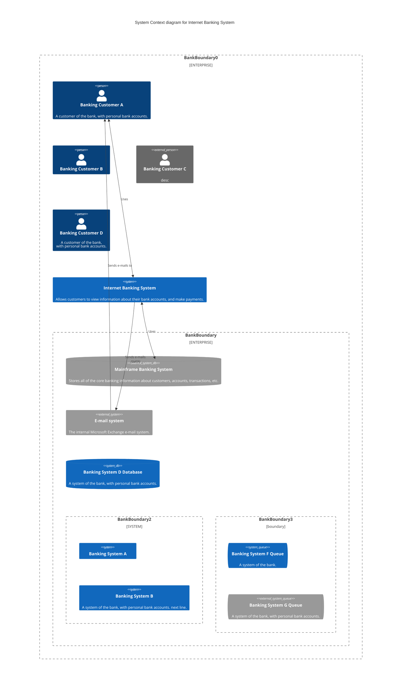

---
title: 6.07. Инструменты аналитика
---

# 6.07. Инструменты аналитика

  ОБЯЗАТЕЛЬНО
  ДЛЯ НОВИЧКОВ
  НЕ ДЛЯ НОВИЧКОВ
  В РАЗРАБОТКЕ

Аналитику
Архитектору
Руководителю
Техническому писателю

## Инструменты аналитика

Аналитик в информационных технологиях — это специалист, находящийся на стыке бизнеса, технологии и коммуникации. Его задача — выявлять, формализовать, структурировать и передавать требования, а также моделировать процессы, данные и архитектуру систем. Для выполнения этих задач аналитик использует широкий спектр инструментов, каждый из которых отвечает определённой цели: от визуализации бизнес-логики до анализа данных и представления результатов заинтересованным сторонам. Современный аналитик должен уметь не только понимать суть предметной области, но и свободно ориентироваться в инструментарии, позволяющем эффективно документировать, моделировать и коммуницировать найденные решения.

Инструменты аналитика условно можно разделить на следующие категории:

- **Средства моделирования бизнес-процессов и архитектуры**  
- **Средства визуализации данных и бизнес-аналитики (BI)**  
- **Инструменты для прототипирования и проектирования пользовательского интерфейса**  
- **Платформы для совместной работы и презентации результатов**

Ниже будет дано подробное описание основных представителей этих категорий, их функциональных возможностей, специфики применения и места в аналитическом процессе.

---

### 1. Системы моделирования бизнес-процессов

Моделирование бизнес-процессов — это фундаментальная практика анализа, позволяющая визуализировать текущее (as-is) и будущее (to-be) состояние операционной деятельности организации. Стандарт **BPMN (Business Process Model and Notation)** является де-факто основным языком описания таких моделей. Он обеспечивает единообразие, читаемость и возможность автоматизации.

#### 1.1. Специализированные BPM-платформы

**Bizagi**, **Camunda**, **ELMA**, **Business Studio**, **Studio Creatio**, **StormBPMN**, **bpmi.io** и **ARIS** — это программные решения, ориентированные на моделирование, анализ и в ряде случаев — исполнение бизнес-процессов.

- **Bizagi** сочетает визуальное моделирование по BPMN с возможностью дальнейшей автоматизации и генерации исполняемого приложения, что делает его полезным как для аналитиков, так и для разработчиков.
- **Camunda** изначально позиционируется как движок выполнения процессов с открытым исходным кодом, однако её студия моделирования (Camunda Modeler) поддерживает BPMN и интегрируется с CI/CD-процессами. Camunda активно используется в микросервисных архитектурах.
- **ELMA** (в том числе ELMA365) — российская low-code платформа с развитыми средствами BPM-моделирования, поддержкой BPMN 2.0 и интеграцией с корпоративной документацией, делопроизводством и задачами. Особенно востребована в среде российских предприятий.
- **ARIS** от Software AG — это промышленное решение класса enterprise для управления архитектурой, процессами и требованиями. ARIS поддерживает не только BPMN, но и методологии ARIS Method, а также интеграцию с ITIL, COBIT и другими стандартами корпоративного управления.
- **Business Studio** и **Studio Creatio** — решения, сочетающие BPM-моделирование с возможностями CASE-систем и low-code платформами. Business Studio традиционно ориентирован на соответствие ГОСТ и глубокую детализацию требований, что особенно ценно для проектов в госсекторе или с повышенными требованиями к документированию.
- **StormBPMN** — лёгкий инструмент с акцентом на валидацию BPMN-диаграмм, анализ циклов и логических ошибок, что особенно полезно при подготовке процессов к автоматизации.
- **bpmn.io** — open-source библиотека и веб-редактор для работы с BPMN, DMN и CMMN. Широко используется в образовательных и прототипных задачах благодаря простоте развёртывания и гибкости интеграции.

Каждый из этих инструментов предлагает разный уровень строгости, глубины моделирования и степени интеграции с разработкой. Выбор зависит от масштаба проекта, требований к автоматизации, нормативного контекста и имеющейся экспертизы в команде.

#### 1.2. Универсальные и лёгкие инструменты

В случаях, когда полномасштабная BPM-платформа избыточна, аналитики прибегают к универсальным графическим редакторам:

- **Microsoft Visio** — классический инструмент для создания диаграмм, включая BPMN, UML, сетевые схемы и оргструктуры. Хотя Visio не обеспечивает строгой валидации BPMN, его распространённость и интеграция с экосистемой Microsoft делают его стандартом в многих организациях.
- **Draw.io (diagrams.net)** — бесплатный веб-инструмент с открытым исходным кодом. Поддерживает экспорт в SVG, PNG, PDF, а также интеграцию с Confluence, Google Drive и GitHub. Обладает библиотеками BPMN-элементов и активно используется для быстрого прототипирования диаграмм.
- **Miro** — цифровая интерактивная доска, в которой можно визуализировать процессы в свободной форме. Поддерживает шаблоны BPMN и удобна для совместной работы с заказчиками в режиме реального времени, особенно на ранних этапах анализа.

Хотя такие инструменты уступают специализированным BPM-системам в строгости и автоматизации, они обеспечивают гибкость и скорость при работе с заинтересованными сторонами, особенно в условиях агил-подходов.

---

### 2. Нотации и методологии архитектурного моделирования

Помимо бизнес-процессов, аналитик (особенно системный или enterprise-аналитик) работает с моделями архитектуры информационных систем. Здесь используются другие формализмы.

#### 2.1. ArchiMate

**ArchiMate** — это открытый стандарт описания корпоративной архитектуры, разработанный The Open Group. Он позволяет моделировать взаимосвязи между бизнес-уровнем, прикладным (application) уровнем и технологическим (infrastructure) уровнем. ArchiMate особенно ценен в крупных организациях, где требуется согласование ИТ-стратегии с бизнес-целями. Инструменты вроде **Archi** (бесплатный open-source редактор) или **ARIS** поддерживают эту нотацию.

#### 2.2. C4 Model

**C4 (Context, Containers, Components, Code)** — это простая, но выразительная нотация для визуализации архитектуры программного обеспечения. Разработанная Саймоном Брауном, она фокусируется на четырёх уровнях детализации:

- **System Context** — показывает систему в контексте внешних пользователей и зависимостей.  
- **Containers** — разделяет систему на контейнеры (веб-приложение, база данных, микросервисы и т.п.).  
- **Components** — раскрывает внутреннюю структуру контейнера.  
- **Code** — опционально ссылается на конкретные классы или модули.

C4 особенно популярен среди разработчиков и технических аналитиков благодаря своей простоте и ориентации на реальные артефакты. Для построения C4-диаграмм часто используются **Structurizr**, **Mermaid**, **PlantUML** или даже **Draw.io** с кастомными шаблонами.

---

### 3. Текстовые и декларативные языки визуализации

В условиях автоматизации документации и интеграции в CI/CD-процессы всё большее значение приобретают **декларативные языки описания диаграмм**, которые могут храниться в коде и рендериться динамически.

#### 3.1. Mermaid

**Mermaid** — это один из самых распространённых таких языков. Он поддерживает:

- Flowcharts (блок-схемы)  
- Sequence diagrams (диаграммы последовательностей)  
- Gantt charts (планы работ)  
- Class diagrams (UML-подобные)  
- **State diagrams**, **Pie charts**, а также **Git graphs**

Особенно важно, что Mermaid имеет **ограниченную, но растущую поддержку BPMN** (в основном через flowcharts с условными обозначениями). Хотя это не полноценная замена BPMN-редакторам, Mermaid позволяет встраивать диаграммы непосредственно в Markdown-документацию, что критически важно для технических спецификаций, документации в репозиториях и образовательных материалов.

Mermaid интегрирован в Docusaurus, GitLab, GitHub (через расширения), Obsidian и многие другие платформы, что делает его де-факто стандартом для «документации как код».

---

### 4. Инструменты для работы с пользовательским интерфейсом и UX-анализом

Многие аналитики (особенно бизнес-аналитики в продуктовых командах) сталкиваются с необходимостью прототипирования экранов и пользовательских сценариев. Здесь ключевую роль играют инструменты проектирования интерфейсов.

#### 4.1. Figma

**Figma** — это облачный инструмент для проектирования интерфейсов, прототипирования и совместной работы. Его преимущества:

- Реальное время совместного редактирования  
- Компонентная система и стили  
- Возможность создания интерактивных прототипов  
- Интеграция с Jira, Confluence, Notion и др.

Аналитик может использовать Figma для создания wireframe-макетов, описания user flows, а также для визуализации требований к интерфейсу. Важно: Figma — не инструмент разработки, но отличный способ **зафиксировать и обсудить поведение системы** до передачи в работу дизайнерам и разработчикам.

---

### 5. Системы бизнес-аналитики (BI)

Аналитик часто работает с данными: выявляет метрики, строит дашборды, формулирует гипотезы о поведении пользователей или эффективности процессов. Для этого используются BI-платформы.

#### 5.1. Microsoft Power BI

Интегрирована в экосистему Microsoft, поддерживает подключение к сотням источников данных, обладает мощным языком **DAX** для расчётов и хорошо подходит для корпоративного использования. Power BI особенно популярен в среде, где уже используются SQL Server, Azure и Excel.

#### 5.2. Tableau

Известен своей визуальной выразительностью и скоростью построения сложных дашбордов. Tableau ориентирован на аналитиков с сильными навыками работы с данными, но минимальными знаниями программирования.

#### 5.3. Qlik Sense

Отличается ассоциативной моделью данных: при выборе значения система автоматически подсвечивает связанные и исключает несвязанные данные. Это помогает проводить exploratory-анализ без предварительного построения моделей.

#### 5.4. Yandex DataLens

Российский облачный BI-сервис, входящий в экосистему Yandex Cloud. Поддерживает подключение к YDB, ClickHouse, PostgreSQL и другим СУБД. Особенно удобен в инфраструктуре на базе Yandex Cloud и для команд, предпочитающих serverless-подход.

BI-системы позволяют аналитику не просто описывать требования к отчётности, но и **демонстрировать их в действии**, что значительно повышает качество согласования с заказчиком.

---

### 6. Презентационные инструменты

Результаты анализа необходимо доносить до аудитории — от технических команд до топ-менеджмента. Здесь применяются классические инструменты:

- **Microsoft PowerPoint** — стандарт в корпоративной среде, особенно при работе с регуляторами, инвесторами или в условиях строгой отчётности.
- **Google Slides** — предпочтителен в распределённых и agile-командах благодаря возможности совместного редактирования и интеграции с Google Workspace.

Презентации аналитика отличаются от маркетинговых: они содержат минимум декораций, максимум **структурированной информации**, диаграмм, таблиц и логических связей. Часто такие слайды становятся частью утверждаемой документации.

