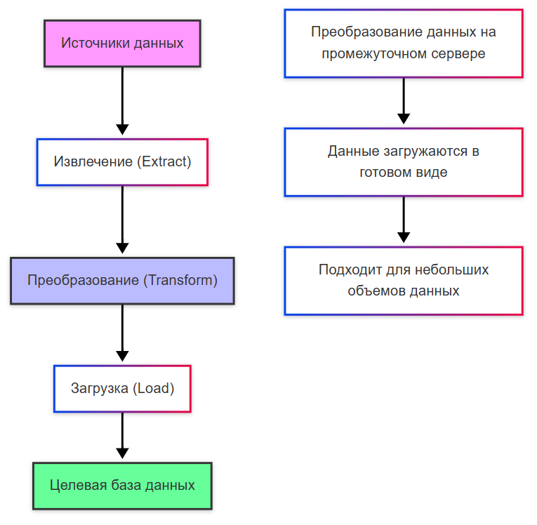
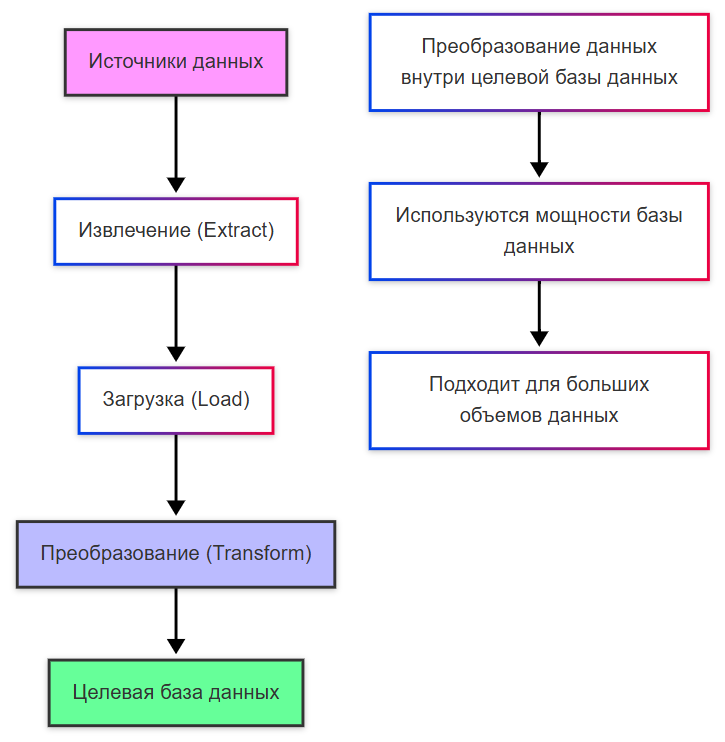
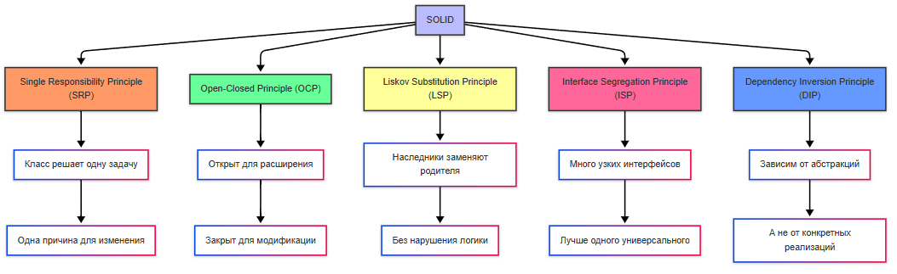

---
title: 6.11. Проектирование и архитектура
---

# 6.11. Проектирование и архитектура

<div class="article-tags">
  <span class="tag tag-inprogress">В РАЗРАБОТКЕ</span>
  <span class="tag tag-advanced">НЕ ДЛЯ НОВИЧКОВ</span>
  <span class="tag tag-notrequired">НЕ ОБЯЗАТЕЛЬНО</span>
</div>
<span class="complexity-badge">Разработчику</span>
<span class="complexity-badge">Архитектору</span>
<span class="complexity-badge">Аналитику</span>

```
Проектирование и архитектура (общее о схемах, планировании, проектировании)
Планирование
Проект
```

★ **Проектирование** – набор подходов, методов для построения проекта системы.

★ **Архитектура** – особенности организации проекта.

Программы собираются в системы – набор взаимосвязанных элементов. Архитектура ПО определяет, как эти элементы организованы, взаимодействуют между собой и с внешним окружением. Мы сначала изучим архитектуру, потом перейдём к проектированию.

## Архитектура

**Архитектура** — это высокоуровневое видение системы: какие модули есть, как они взаимодействуют, какие протоколы и технологии выбраны. Это про стратегические решения, которые трудно менять.

**Дизайн** — это более детальный уровень. Он описывает внутреннее устройство модулей, паттерны, классы, интерфейсы, алгоритмы. Дизайн можно адаптировать чаще, он ближе к реализации.

Архитектура - элементы системы, их связи и взаимоотношения. 

Есть три понятия – уровни, виды и типы (стили). На прикладном уровне определяется вид развёртывания модулей, а стиль кода определяет то, как устроен модуль.

Начнём с уровней архитектуры. Их проще понять, если смотреть по аналогии, представив, что мы строим дом:

| Уровень                     | Описание                                                                                                                               | Пример в строительстве                                                                 |
|-----------------------------|----------------------------------------------------------------------------------------------------------------------------------------|---------------------------------------------------------------------------------------|
| Функциональная архитектура  | Что система делает с точки зрения пользователя (возможности, сценарии): заказ еды, перевод денег, социальная сеть.                      | Для чего дом? Планировка: сколько в доме комнат, где кухня, где спальня.           |
| Предметная область (домен)  | Ключевые сущности, бизнес-логика, данные и правила их обработки: данные (профиль пользователя); бизнес-правила (если на счету нет денег, платеж отклоняется); алгоритмы (как считать рекомендации в ленте). | Что внутри комнат? То, чем пользуются жильцы: мебель, сантехника, розетки.         |
| Прикладная архитектура      | Как компоненты (сервисы, модули) взаимодействуют друг с другом, общение между частями системы, API, микросервисы.                      | Как комнаты связаны? Двери между комнатами, лестницы, вентиляция.                   |
| Технологическая архитектура | Инфраструктура: серверы, базы данных, сети, виртуализация, облака.                                                                     | Фундамент и коммуникация – трубы, провода, генератор, без которых не будет ни электричества, ни воды, словом – ресурсы и ресурсоснабжение. |

Вышеприведенные уровни отвечают на вопрос «что проектируется?», где описывается функционал, данные, интеграции и железо. На вопрос «как распределены компоненты между собой?» отвечает вид. А на вопрос, «как организован код?» отвечает стиль организации кода внутри прикладного уровня.
.
Рассмотрим теперь виды. Нас интересует конкретная классификация – по способу взаимодействия, где можно разделить на:
	- локальные – работают на одном устройстве (без сети);
	- распределённые – части системы находятся на разных устройствах и обмениваются данными.

Локальные системы «живут» на одном компьютере/телефоне, не требуют соединения, не взаимодействуют с другими пользователями, а данные хранятся локально, к примеру – одиночная игра, текстовый редактор, приложение для заметок.

Распределённые системы разделяются на несколько видов:

1. ★ **Файл-серверная архитектура**:

| Сервер | Клиенты |
|-------|--------|
| Просто хранит файлы | Забирают файлы с сервера; Добавляют файлы на сервер; Сами обрабатывают файлы на своих устройствах. |

Простой пример – общая папка в офисе, где все работают с набором файлов.

2. ★ **Клиент-серверная архитектура** отличается от файл-серверной тем, что сервер не просто хранит данные, но и обрабатывает их. Примеры – веб-сайты, мобильные приложения и онлайн игры. Разберём подвиды клиент-серверной архитектуры:

**Монолит** – вся логика сосредоточена в одной программе на сервере. Словом, и фронтенд, и бэкенд – единый проект. Если сломается одна часть программы – она падает целиком, со всеми своими функциями.

**SOA** (Service-Oriented Architecture, сервис-ориентированная архитектура) – система разбита на сервисы (например, «платежи», «авторизация», «отправка email»), а для связи между ними используется **ESB** (Enterprise Service Bus) – «диспетчер», который решает, куда отправить запрос. Это уже более применимо для корпоративных систем, допустим банковских – один сервис выполняет валидацию данных, другой считает проценты, третий – проверяет кредитную историю. Минус такой системы в том, что ESB отвечает за всю эту систему, и если откажет, то упадёт вся система.

**Микросервисы** – каждый сервис (модуль) полностью независим, может быть на своём языке, иметь свою СУБД. Общение между такими модулями происходит через API, без использования единых ESB-шин, но зато, если один сервис упадёт – все остальные работают. Это сложнейшая архитектура, требующая DevOps-инфраструктуру, автозапуск, логирование, мониторинг и многое другое.

★ **Сравнение архитектур**


| Архитектура     | Применение                     | Плюсы                              | Минусы                                   |
|-----------------|--------------------------------|------------------------------------|------------------------------------------|
| Локальная       | Оффлайн-приложения             | Простота                           | Нет масштабирования                      |
| Файл-сервер     | Маленькие офисы                | Дёшево                             | Конфликты данных                         |
| Монолит         | Стартапы, простые проекты      | Легко развивать и настраивать      | Всё хранится в единой «куче»             |
| SOA             | Корпоративные системы          | Гибкость развития                  | Сложность настройки и зависимость от ESB |
| Микросервисы    | Высоконагруженные системы       | Масштабируемость, отказоустойчивость | Высочайшая сложность разработки          |


Типы (стили) проектирования определяют, как код структурирован внутри компонента:
	- слоистая (layered);
	- чистая архитектура (clean architecture);
	- гексагональная (ports & adapters);
	- событийно-ориентированная (event-driven);
	- компонентно-ориентированная.

| Тип (стиль)               | Суть                                                                                                                                                                                               | Сфера применения                                                                                                                                                                                                 |
|---------------------------|----------------------------------------------------------------------------------------------------------------------------------------------------------------------------------------------------|-----------------------------------------------------------------------------------------------------------------------------------------------------------------------------------------------------------------|
| Слоистая                  | Жёсткое разделение на слои: Интерфейс (кнопки, формы); Логика (правила работы); Данные (работа с БД).                                                                                      | Корпоративные, государственные, банковские приложения. Пример: 1. Интерфейс – нажимаем на кнопку «купить»; 2. Логика – сервер проверяет, есть ли товар в наличии; 3. Данные – сервер сохраняет заказ в базу. |
| Чистая архитектура        | Ядро: бизнес-правила; Внешний слой: БД, API, интерфейс. Ядро независимо от внешнего слоя.                                                                                                      | Долгие проекты, где требования часто меняются, что обеспечивает адаптивность. Пример: 1. Ядро – правило «скидка 10% для постоянных клиентов»; 2. Внешний слой – не важно, как хранятся данные, какой интерфейс и какие инструменты используются – ядро остаётся неизменным. |
| Гексагональная            | Акцент на порты (интерфейсы) и адаптеры (реализации). Порт: интерфейс; Адаптер: реализация. Порт выступает в роли ядра, но не представляет собой бизнес-логику.                            | Системы с частыми изменениями интеграций, например, множество внешних сервисов. Пример: 1. Порт: «Способ оплаты» (интерфейс); 2. Адаптеры: СБП, карта, PayPal, криптовалюта – любые реализации, при этом порт (ядро) остаётся неизменным. |
| Event-driven              | Компоненты обмениваются событиями (сообщениями), взаимодействуя асинхронно через подписку на события. Обеспечивает масштабируемость и асинхронную обработку.                                     | Чаты, биржи, системы реального времени. Пример: 1. Событие – оформление заказа; 2. Подписчики – склад и служба доставки получают событие и параллельно начинают обработку.                           |
| Компонентно-ориентированная | Код разбит на переиспользуемые компоненты (блоки), аналогично элементам конструктора: кнопки, формы ввода, карточки товаров.                                                                       | Фронтенд. Пример: Компонент «Меню» можно использовать на главной странице и на странице акций; компонент «Корзина» работает одинаково во всём приложении.                                            |


Важно: стили могут комбинироваться. Допустим, банковская система может быть слоистая для основной логики, чистая архитектура для правил переводов, и Event-Driven для уведомлений.
```
Проектирование решений на базе монолитной архитектуры
Компоненты монолита. Двухзвенная и трехзвенная архитектура. Плюсы и минусы монолитной архитектуры.
Проектирование эффективного решения для сохранения арх целостности и возможности масштабирования решения.
Декомпозиция монолита на модули (проведение архитектурных границ, повышение уровня абстракции интерфейсов,  выделение доменов (DDD), оптимизация кодовой базы.
```
Говоря о компонентах, важно упомянуть про три закона компонентной архитектуры, описанные Робертом Мартином в его книге «Чистая архитектура» (кстати, очень рекомендую изучить):
	- **REP** – Reuse / Release Equivalence Principle, или принцип эквивалентности повторного использования и выпуска - чтобы код можно было использовать повторно (например, в других проектах), то он должен быть оформлен как отдельный выпускаемый компонент — например, библиотека, пакет или NPM-модуль, с обязательным указанием версии. Просто «копировать файл скрипта» не подпадёт под этот принцип. Каждый повторно используемый кусок - отдельная «коробочка».
	- **CCP** – Common Closure Principle, или принцип общей закрытости подразумевает, что компонент должен содержать функционал, который изменяется по одним и тем же причинам и в одно и то же время, как SRP (из SOLID) на уровне компонентов. К примеру, все классы, связанные с платежами (обработка заказов, расчёты налогов, интеграция с платёжными системами) должны находиться в одном компоненте, потому что они изменяются из-за одних и тех же бизнес-требований. То, что меняется вместе - должно жить вместе.
	- **CRP** – Common Reuse Principle, или принцип общей повторяемости - если одна часть компонента используется, но другая — нет, то такие части не должны находиться в одном компоненте, иначе получится, что пользователь зависит от лишнего кода (как принцип ISP из SOLID, но на уровне компонентов). Не делать компоненты слишком большими.

## Проектирование

★ **Проектирование ПО** включает в себя три важных компонента – подходы, принципы и паттерны. С одной стороны, покажется, будто это одно и то же, но на самом деле всё немного глубже, и мы изучим это.
```
Проектирование сервисов и методов – как выполнять, алгоритм
Проектирование БД – как выполнять, алгоритм;
Проектирование функциональных UI – как выполнять, алгоритм;
Чем проектирование интерфейса (функционального UI) отличается от работы художника?
```

Подходы к проектированию отвечают на вопрос «как мы начинаем проектировать систему?». Мы выделим следующие подходы:
	- Code First (сначала код, потом данные);
	- Database First (сначала данные, потом код);
	- ETL и ELT (особенности обработки данных).

| Подход        | Суть                                                                                                                                                                                                 | Пример                                                                                                                                                                                                 |
|---------------|------------------------------------------------------------------------------------------------------------------------------------------------------------------------------------------------------|--------------------------------------------------------------------------------------------------------------------------------------------------------------------------------------------------------|
| Code First    | Сначала пишутся классы и бизнес-логика, а база данных генерируется автоматически. Работа с данными осуществляется через код. Направление: Код → База данных                                          | Entity Framework (.NET); Django (Python)                                                                                                                                                             |
| Database First| Сначала проектируется и создаётся база данных, затем на её основе генерируется код. Направление: База данных → Код                                                                             | SQL Server + ADO.NET                                                                                                                                                                                   |
| ETL           | Extract → Transform → Load Данные извлекаются, преобразуются и затем загружаются в хранилище. Суть подхода: «Привёл в порядок и положил на полку». Извлечение → Преобразование → Загрузка | Когда нужно очистить данные перед анализом. Пример: 1. Чтение CSV-файла; 2. Удаление дубликатов, проверка корректности и конвертация; 3. Загрузка преобразованного CSV в БД.             |
| ELT           | Extract → Load → Transform Данные извлекаются и загружаются в хранилище «как есть», преобразование выполняется уже внутри хранилища. Суть подхода: «Бросил в корзину, разберу потом». Извлечение → Загрузка → Трансформация | Big Data. Получены сырые данные — сразу загружаются, нормализация выполняется позже. Пример: 1. Сбор логов; 2. Загрузка данных в облако; 3. Выполнение SQL-запросов для трансформации. |

Разница между ELT и ETL:

**ETL (Extract, Transform, Load)**



**Извлечение (Extract)**

Данные собираются из различных источников (например, базы данных, файлы, API).

**Преобразование (Transform)**

Данные преобразуются на промежуточном сервере (например, очистка, фильтрация, агрегация).

**Загрузка (Load)**

Преобразованные данные загружаются в целевую базу данных.




**Извлечение (Extract)**

Данные собираются из различных источников.

**Загрузка (Load)**

Необработанные данные загружаются напрямую в целевую базу данных.

**Преобразование (Transform)**

Данные преобразуются уже внутри целевой базы данных (например, с помощью SQL или аналитических инструментов).

★ **Принципы проектирования** – фундаментальные правила, которые помогают избегать хаоса:
	- SOLID;
	- DRY;
	- KISS;
	- Закон Конвея;
	- SOC.


| Принцип | Суть |
|--------|------|
| **SOLID** | Аббревиатура из пяти принципов объектно-ориентированного дизайна, предложенных Робертом Мартином, которые помогают делать код гибким, расширяемым и легко поддерживаемым. |
| **Single Responsibility (SRP)** | Класс решает одну задачу. Должен иметь только одну причину для изменения — одну зону ответственности. |
| **Open-Closed (OCP)** | Код можно расширять, но не изменять. Классы должны быть открыты для расширения (через наследование или композицию), но закрыты для модификации существующего кода. |
| **Liskov Substitution (LSP)** | Подтипы должны корректно заменять базовый тип. Наследник не должен нарушать поведение, ожидаемое от родительского класса. |
| **Interface Segregation (ISP)** | Предпочтительнее множество узкоспециализированных интерфейсов, чем один общий. Клиенты не должны зависеть от методов, которые они не используют. |
| **Dependency Inversion (DIP)** | Модули верхнего уровня не должны зависеть от модулей нижнего уровня. Оба должны зависеть от абстракций. Зависимости — от интерфейсов, а не от конкретных реализаций. |
| **DRY** | Don’t Repeat Yourself — «Не повторяйтесь». Дублирование кода следует избегать: общую логику нужно выносить в отдельные функции, классы или модули. |
| **KISS** | Keep It Simple, Stupid — сохраняйте простоту. Более простые решения предпочтительнее сложных, если они решают задачу эффективно. |
| **Закон Конвея** | Архитектура системы отражает организационную структуру команды, которая её разрабатывает. |
| **SOC** | Separation of Concerns — разделение ответственности. Различные аспекты системы должны быть независимыми и реализованы в отдельных компонентах. |

Закон Конвея подразумевает, что любая организация, проектирующая систему, будет производить дизайн, который копирует структуру её коммуникационных структур. Если у нас есть 5 отделов, каждый из которых отвечает за свой модуль, то система будет состоять из 5 компонентов, соединённых между собой через интерфейсы или API, даже если логично было бы сделать иначе. Пример - отделы бэкенда, фронтенда и мобильная команда. При проектировании системы нужно учитывать структуру команд.

SOC - Separation of Concerns, или разделение ответственности, предполагает разделение разных аспектов системы на отдельные модули, когда бизнес-логика остаётся в доменном слое, а представление в UI. Разделение помогает упрощать тестирование, читаемость и поддержку кода.


Давайте рассмотрим SOLID чуть глубже.



1. **S** – Single Responsibility Principle (SRP), или принцип единственной ответственности актора подразумевает, что каждый актор имеет свою зону ответственности.

**Актор** - это внешняя сущность, взаимодействующая с системой. Обычно это пользователь, но может быть и другой сервис или система. И как раз каждый актор должен иметь только одну причину изменить систему.

К примеру, у нас есть три актора:
	- Администратор - добавляет товары;
	- Клиент - делает заказы;
	- Система оплаты - обрабатывает платежи.

И каждый из них имеет свою зону ответственности, не отвечает за работу другого, что позволяет избегать ситуации, когда один и тот же объект выполняет слишком много функций.

Словом, нужно разделять ответственность.

2. **O** – Open/Closed Principle, или принцип открытости/закрытости сформулирован Бертраном Мейером в книге «Object-Oriented Software Construction» как «Программные сущности должны быть открыты для расширения, но закрыты для модификации». Вместо того чтобы менять существующий код, лучше добавить новое поведение через наследование или интерфейсы.

Архитектура строится таким образом, что внутренние слои ничего не знают о внешних. То есть, ядро бизнес-логики не зависит от БД, UI или веб-интерфейса. Внешние слои (контроллеры, представления) зависят от ядра. Такой подход реализуется в архитектуре «Clean Architecture», где зависимости направлены только внутрь.

К примеру:
	- пользователь нажимает кнопку «Купить»;
	- контроллер запускает интерактор;
	- интерактор вызывает бизнес-логику, сохраняет заказ;
	- презентатор формирует сообщение «Заказ оформлен»;
	- представление показывает это пользователю. 

Это элементы архитектурного паттерна MVP, используемые для разделения обязанностей. Интерактор содержит бизнес-логику, вызывает методы домена, контроллер управляет навигацией и принимает входящие запросы, представление отображает данные пользователю, а презентатор форматирует данные для вывода, передавая в представление.

3. **L** – Liskov Substitution Principle (LSP), Барбара Лисков и принцип подстановки гласит: «Функции, которые используют указатель или ссылку на родительский класс, должны иметь возможность использовать объекты дочернего класса, не зная об этом». То есть, подкласс должен допускать замену базового класса без нарушения логики программы.

Обычно в пример приводят, что круг не может быть прямым подклассом прямоугольника, ведь его поведение отличается. Нужно создать отдельную иерархию, где прямоугольник и круг имеют общего предка, например «фигура», но не наследуют друг от друга, становясь равноправными наследниками фигуры, без противоречий.

Барбара Хьюз Лисков получила премию Тьюринга в 2008 году за работу в области абстракции данных и объектно-ориентированного программирования, разработала концепцию абстрактных типов данных ещё в 1970-х, создала язык CLU (1975), один из первых языков, поддерживающих понятия итераторов, модулей и типов данных с множественным возвращаемым значением, и сформулировала принцип подстановки. Многие современные языки, такие как Java, C#, Python, реализуют идеи, впервые описанные ею.

Таким образом, принцип подстановки определяет, что подклассы должны вести себя так же, как и их родитель. Они могут добавлять новое поведение, но не должны нарушать ожидания, связанные с родительским классом.

4. **I** – Interface Segregation Principle (ISP), или принцип разделения интерфейсов гласит, что лучше множество специализированных интерфейсов, чем один «толстый» - клиенты не должны зависеть от интерфейсов, которые они не используют.

Принцип был сформулирован Робертом Си Мартином как часть его работы над объектно-ориентированным проектированием. Он основывался на опыте реальных проектов, где большие интерфейсы становились причиной множества багов и проблем с поддержкой кода. И для решения проблемы, создаются мелкие «тонкие» интерфейсы.

```csharp
public interface IPrinter // Интерфейс 1
{
    void Print(Document document);
}

public interface IScanner // Интерфейс 2
{
    void Scan(Document document);
}

public interface IFaxMachine // Интерфейс 3
{
    void Fax(Document document);
}

public class SimplePrinter : IPrinter // Наследование только от 1
{
    public void Print(Document document)
    {
        Console.WriteLine("Printing document...");
    }
}
// Множественная реализация - класс реализует все три интерфейса
public class OfficePrinter : IPrinter, IScanner, IFaxMachine
{
    public void Print(Document document) => Console.WriteLine("Printing...");
    public void Scan(Document document) => Console.WriteLine("Scanning...");
    public void Fax(Document document) => Console.WriteLine("Faxing...");
}

public class ScannerOnly : IScanner
{
    public void Scan(Document document) => Console.WriteLine("Scanning only...");
}

```

Множественная реализация - это не множественное наследование как таковое. Интерфейсы как раз используются для определения методов, свойств, событий, индексаторов, могут быть реализованы несколькими классами, а один класс может реализовывать несколько интерфейсов, как приведено в примере выше.

5. **D** – Dependency Inversion Principle (DIP), или инверсия зависимостей предполагает зависимость от абстракций, а не от конкретных реализаций.

Обычно для разъяснения делят на два вида компонентов - абстракции и модули, причём модули могут быть верхнего уровня и нижнего уровня. Модули верхнего уровня не должны зависеть от модулей нижнего уровня. Оба типа модулей должны зависеть от абстракций. Абстракции не должны зависеть от деталей. Детали должны зависеть от абстракций.

Смысл в том, чтобы писать программу, изначально допуская возможность замены функциональности, к примеру, чтобы класс App с логикой работы приложения мог работать независимо от того, будет выбран способ сохранения данных в БД или в файл. Базу данных можно поменять, к примеру, с MSSQL на PostgreSQL, и этот переход должен быть безболезненным, поэтому ответственный компонент выделяют, и при смене стратегии придётся переделывать лишь этот ответственный компонент (а не всё целиком).


## Типы классов

Проектирование представляет собой творческий процесс, когда нужно определить, с учётом изученных нами принципов, распределить обязанности между классами. Оно подразумевает не написание кода, а сначала определение ролей классов для работы.

Многие программисты чуть ли не дерутся за соблюдение каких-то принципов, паттернов, но если рассматривать всё это комплексно, то я бы сказал, что происходит просто структурирование системы. Конечно, мы говорим об ООП, поэтому имеем в виду, что выстраивается некий набор каталогов, классы выделяются по коду, и раскладываются по обязанностям и категориям. Но какие бывают эти типы классов?

Важно запомнить, что использование подходов, паттернов и принципов это не обязательные требования, и не стандарты, а скорее архитектурные соглашения и практические рекомендации. В больших проектах важно разделять логику на ответственные части, чтобы код был лёгким, и по названию файла/папки/элемента легко можно было понять, что он делает и зачем он нужен. Имена классов вроде Service, Handler, Listener и т.д. дают семантическую нагрузку (сразу понятно, что делает класс).

Handler (Обработчик) например, обрабатывает какое-то событие, запрос или действие, HTTP-запросы, события UI, сообщения из очередей вроде MQTT, Kafka, часто используется в REST API, и может быть частью шаблона «Цепочка обязанностей» (Chain of Responsibility). Примеры - UserLoginHandler, PaymentRequestHandler, WebSocketMessageHandler.

Listener (Слушатель) ожидает и реагирует на события. Используется в GUI (клики, движения мыши), серверах для ожидания подключений, асинхронных задач. Реализует паттерн «Наблюдатель» (Observer), может работать в фоне и запускать обработчики при наступлении события. Примеры - ButtonClickListener, OrderCreatedEventListener, WebSocketConnectionListener.

Service содержит какую-то бизнес логику, выполняет операцию, используя API, файлы, вычисления и прочие бизнес-правила вне UI. Примеры - UserService, PaymentService, NotificationService.

Creator, Factory, Builder ответственные за создание объектов (реализация порождающих паттернов). Примеры - UserFactory, ReportBuilder, DocumentCreator.

Updater или Modifier изменяют состояние объекта или системы (обновление данных, изменение состояния сущности). Примеры - UserProfileUpdater, OrderStatusUpdater, SettingsModifier.

Repository или DAO взааимодействуют с базой данных или источником данных для чтения, записи, маппинга. Примеры - UserRepository, ProductDAO, FileStorageAdapter.

Provider предоставляет данные или сервисы другим частям приложения (используется в DI или для получения данных из внешнего источника). Примеры - ConfigurationProvider, CurrencyRateProvider, AuthenticationProvider.

Manager обобщённый, может управлять какими-либо сущностями или процессами. Примеры - SessionManager, DownloadManager, CacheManager.
Validator проверяет корректность данных. Примеры - EmailValidator, OrderValidator, InputSanitizer.

Helper или Utility бывает статическим классом или набором функций для вспомогательных задач (форматирование, работа с датами, конвертация). Примеры - StringUtils, DateUtils, MathHelpers.

Constants / Consts / Config хранят в себе неизменяемые значения, к примеру, настройки или идентификаторы. Примеры - AppConstants, ApiEndpoints, FeatureFlags.

Controller принимает входящие запросы и направляет их в нужные части приложения (мост между UI и бизнес-логикой). Примеры - UserController, ProductController, ApiController.

Model / DTO / Entity представляет данные в виде объектов.  Примеры - UserEntity, OrderDTO, ProfileModel.

Всё это перечислять слишком подробно смысла особого нет, однако ознакомиться стоит. Важно придерживаться порядка, к примеру, вместо магического Abracadabra4 лучше класс назвать как UserLoginHandler. Ну или AbracadabraHandler, тогда хотя бы понятно будет, что это обработчик сущности Abracadabra. Словом, главное правильно всё это спроектировать, разделить и потом только писать.

Давайте начнём с изучения того, вообще что можно сделать в классах. Разделим их на две группы - абстрактные и конкретные.

### Абстрактные классы

Абстрактные классы - это интерфейсы, абстракции и контракты.

| Класс | Описание | Паттерны |
|------|---------|--------|
| Interface | Интерфейс описывает контракт поведения без реализации. | Strategy, Factory, Observer |
| Abstract Class | Абстрактный класс представляет собой базовый класс с частичной реализацией. | Template Method, Abstract Factory |
| Contract | Контракт по сути то же, что и интерфейс, но чаще используется в доменных слоях DDD. | Clean Architecture |
| Service Interface | Интерфейс для выполнения бизнес-операций. | MVC, MVP, MVVM, DDD |
| Repository Interface | Контракт для работы с хранилищем данных. | DDD, Clean Architecture |
| DAO (Data Access Object Interface) | Абстракция доступа к данным. | DAO Pattern, CRUD |
| Фабрика (Factory Interface) | Определяет методы создания объектов. | Factory Method, Abstract Factory |
| Билдер (Builder Interface) | Определяет шаги построения сложного объекта. | Builder Pattern |
| Стратегия (Strategy Interface) | Определяет взаимозаменяемые алгоритмы. | Strategy |
| Команда (Command Interface) | Представляет операцию в виде объекта. | Command Pattern |
| Обработчик (Handler Interface) | Обрабатывает запросы, ошибки или события. | Цепочка обязанностей (Chain of Responsibility), Middleware |
| Прослушиватель (Listener Interface) | Реагирует на события (уведомления). | Observer, Event Listener |
| Наблюдатель (Observer Interface) | Подписывается на изменения состояния другого объекта. | Observer |
| Адаптер (Adapter Interface) | Согласует несовместимые интерфейсы. | Adapter |
| Модель (Model Interface) | Представляет данные предметной области. | MVC, MVP, MVVM |
| Презентер (Presenter Interface) | Передаёт данные между моделью и представлением. | MVP |
| Представление (View Interface) | Отвечает за отображение данных пользователю. | MVC, MVP |
| Юзкейс (Use Case Interface) | Описывает бизнес-сценарии или действия пользователя. | Clean Architecture |
| Итератор (Iterator Interface) | Обеспечивает последовательный доступ к элементам коллекции. | Iterator |
| enum / Enum | Тип с фиксированным набором значений. Универсальный компонент модели. | Domain Model |
| Specification (Интерфейс спецификации) | Определяет логические правила для проверки объектов. | DDD, Specification Pattern |
| Specification Validator | Проверяет соблюдение условий заданной спецификации. | DDD |
| Port | Интерфейс для взаимодействия с внешними системами или средами. | Hexagonal Architecture |
| Subject | Объект, который уведомляет подписанные на него объекты об изменениях. | Observer |
| Aggregate Root Interface | Корневой объект агрегата в DDD, управляющий доступом и целостностью. | DDD |
| Value Object Interface | Объект, идентифицируемый по совокупности значений, а не по ID. | DDD |
| Domain Service Interface | Сервис, реализующий поведение, не принадлежащее конкретной сущности. | DDD |
| Entity Interface | Объект с уникальной идентичностью и жизненным циклом. | DDD |
| Specification Composite | Композиция спецификаций для построения сложных правил проверки. | DDD, Composite |
| Mapper Interface | Интерфейс для преобразования данных между уровнями (например, DTO `↔` Entity). | DTO, DAL, BLL |

### Конкретные классы

Конкретные классы - это реализация и функционал.

| Класс | Описание | Паттерны |
|------|---------|--------|
| Main | Точка входа в приложение. Универсальный класс. | Все |
| Controller | Обрабатывает HTTP-запросы. | MVC, REST API |
| ServiceImpl | Реализация бизнес-сервиса. | Всё — от Spring до чистой Java/PHP |
| RepositoryImpl | Конкретная реализация репозитория для работы с данными. | DDD, Clean Architecture |
| DAOImpl | Конкретная реализация доступа к данным. | DAO Pattern |
| Validator | Проверяет данные на корректность и соответствие правилам. | Validation Logic, Input Checks |
| Logger | Записывает логи выполнения приложения. | Logging Frameworks, AOP |
| ExceptionHandler | Централизованно обрабатывает исключения в приложении. | Global Exception Handling |
| ErrorHandler | Обрабатывает ошибки выполнения на уровне системы или среды. | Middleware, Error Boundaries |
| Configurator / Config | Настраивает параметры и поведение приложения. | Configuration Management |
| Router | Маршрутизирует входящие запросы к соответствующим обработчикам. | Web Frameworks, REST APIs |
| RequestHandler | Обрабатывает входящие запросы, может быть частью сервера или middleware. | Web Servers, Microservices |
| ResponseBuilder | Формирует структурированный ответ для отправки клиенту. | REST, GraphQL |
| User | Сущность, представляющая пользователя системы. | DDD, Identity Management |
| AuthService | Обеспечивает функциональность авторизации. | OAuth, JWT, Login |
| Authenticator | Проверяет подлинность учётных данных пользователя. | Authentication Flow |
| Authorizer | Проверяет права доступа к ресурсам. | RBAC, ACL |
| TokenManager | Управляет жизненным циклом токенов (создание, хранение, отзыв). | OAuth, JWT |
| JwtProvider | Выдаёт и проверяет JWT-токены. | Security Layer |
| DatabaseSeeder | Наполняет базу данных тестовыми или справочными данными. | Dev/Test Environments |
| Migrator | Применяет миграции базы данных для управления схемой. | ORM, Schema Versioning |
| Scheduler | Запускает задачи по расписанию. | Cron Jobs, Background Workers |
| TaskRunner | Выполняет фоновые или асинхронные задачи. | Queues, Workers |
| Notifier | Отправляет уведомления через различные каналы. | Email, SMS, Push |
| Mailer | Отправляет электронную почту. | Mail Services |
| SmsSender | Отправляет SMS-сообщения. | External APIs |
| EventDispatcher | Распределяет события подписчикам. | Event-Driven Architectures |
| EventListener | Реагирует на определённые события в системе. | Event Bus, Observer |
| MessageProducer | Генерирует сообщения и отправляет их в очередь. | Kafka, RabbitMQ |
| MessageConsumer | Получает и обрабатывает сообщения из очереди. | Message Queue Consumers |
| CacheManager | Управляет операциями кэширования (чтение, запись, инвалидация). | Redis, Memcached |
| HttpClient | Выполняет HTTP-запросы к внешним сервисам. | REST Clients, Integrations |
| Integrator | Инкапсулирует взаимодействие с внешними системами. | Third-party APIs |
| Parser | Анализирует и преобразует сырые данные (например, JSON, XML). | JSON/XML Parsing, Logs |
| Formatter | Форматирует данные для вывода (даты, числа и т.д.). | Dates, Numbers, Output |
| Serializer | Преобразует объекты в сериализуемый формат (например, JSON). | JSON, XML |
| Deserializer | Преобразует данные из сериализованного формата обратно в объекты. | JSON, XML |
| Transformer | Преобразует один тип данных или модель в другой. | DTO `<->` Entity |
| Mapper | Преобразует структуры данных между уровнями (например, DAL → BLL). | DTO Mapping, DAL-BLL |
| Converter | Конвертирует данные между различными форматами (CSV `↔` JSON и др.). | CSV `<->` JSON |
| Loader | Загружает данные из источников (файлы, БД, кэш). | Files, DB, Cache |
| Saver | Сохраняет данные в хранилище. | Files, DB |
| Exporter | Экспортирует данные в заданный формат (CSV, PDF, Excel). | CSV, PDF, Excel |
| Importer | Импортирует данные из внешних источников. | CSV, JSON, Excel |
| Aggregator | Собирает и объединяет данные из нескольких источников. | Reports, Analytics |
| Analyzer | Анализирует данные для извлечения метрик или инсайтов. | Business Intelligence, Metrics |
| Calculator | Выполняет вычисления (финансовые, математические и др.). | Financial, Math |
| Processor | Обрабатывает данные или запросы (платежи, загрузки и т.п.). | Payments, Uploads |
| Scanner | Сканирует файлы, данные или систему (например, на безопасность). | Security, Logs |
| ScannerWorker | Выполняет задачи сканирования в фоновом режиме. | Concurrent Processing |
| Monitor | Отслеживает состояние системы (здоровье, доступность). | Health Checks, Uptime |
| Watcher | Следит за изменениями в файлах, событиях или состояниях. | Filesystem, Events |
| Poller | Периодически опрашивает источник данных или статус. | API Polling, Status Checks |
| Bootstrapper | Инициализирует приложение и его зависимости. | Startup Logic |
| Registry | Хранит ссылки на зарегистрированные объекты или сервисы. | Dependency Registry |
| Locator | Находит и предоставляет нужные зависимости. | Service Locator Pattern |
| Container | Управляет созданием, внедрением и временем жизни зависимостей. | DI Container (Spring, Dagger) |
| Injector | Внедряет зависимости в компоненты. | DI Logic |
| Factory | Создаёт объекты по заданному шаблону. | Factory |
| SimpleFactory | Простая фабрика без интерфейса, часто как утилита. | Utility Factory |
| Singleton | Обеспечивает наличие только одного экземпляра класса. | Singleton |
| Proxy | Представляет заместителя для другого объекта. | Proxy, Lazy Loading |
| Decorator | Добавляет функциональность объекту без изменения его класса. | Decorator |
| Adapter | Адаптирует интерфейс одного класса под другой. | Adapter |
| Facade | Предоставляет упрощённый интерфейс к сложной подсистеме. | Facade |
| UnitOfWork | Отслеживает изменения объектов и координирует их сохранение. | DDD, ORM |
| Entity | Объект с уникальной идентичностью и жизненным циклом. | DDD |
| ValueObject | Объект, идентифицируемый по значению, а не по ID. | DDD |
| AggregateRoot | Корневой элемент агрегата, обеспечивающий целостность. | DDD |
| DTO (Data Transfer Object) | Объект для передачи данных между процессами или уровнями. | Data Transfer |
| VO (Value Object) | Неизменяемый объект, описывающий значение. | DDD |
| POJO / Plain Object | Простой объект без зависимости от фреймворков. | General Purpose |
| BO (Business Object) | Объект, содержащий бизнес-логику. | BLL |
| DAO | Объект доступа к данным. | DAL |
| Model | Представляет данные предметной области. | MVC, ORM |
| ViewModel | Модель, адаптированная для представления. | MVVM |
| Presenter | Управляет логикой взаимодействия между моделью и видом. | MVP |
| View | Отвечает за отображение пользовательского интерфейса. | UI Layer |
| Component | Самостоятельный компонент пользовательского интерфейса. | React, Vue, Angular |
| Helper | Вспомогательный класс с общими методами. | Utility Methods |
| Utils / Utilities | Статические методы общего назначения. | General Helpers |
| Extension | Расширяет функциональность существующих классов. | Extension Methods (C#), Mixins |
| Wrapper | Обёртка вокруг другого объекта для инкапсуляции. | Инкапсуляция |
| Starter | Запускает приложение или процесс. | CLI, Boot Process |
| Stopper | Останавливает процессы корректным образом. | Graceful Shutdown |
| TestRunner | Запускает наборы тестов. | Unit Testing |
| Mocker | Создаёт заглушки (mocks) для тестирования. | Testing |
| Spy | Отслеживает вызовы методов в тестах. | Testing |
| Stub | Заглушка, возвращающая предопределённые значения. | Testing |
| Fixture | Подготовленные данные для тестового окружения. | Testing |
| Spec | Тест-класс в BDD-подходе. | BDD Frameworks |
| Scenario | Описание тестового сценария. | BDD |
| Driver | Управляет взаимодействием с устройством или протоколом. | Drivers, Hardware |
| Client | Клиентская часть для взаимодействия с API. | REST, gRPC |
| Server | Серверная часть, обрабатывающая входящие соединения. | Network Apps |
| ConnectionManager | Управляет открытыми соединениями (БД, сокеты). | DB, Sockets |
| Pool | Управляет пулом ресурсов (соединения, потоки). | Connection Pooling |
| Buffer | Временно хранит данные при чтении/записи. | IO, Streams |
| Interceptor | Перехватывает вызовы для добавления логики (логирование, безопасность). | AOP, Middleware |

## Конструкция из классов

Так, мы рассмотрели различные типы классов. Как их правильно проектировать? Разумеется, пропускаем многие этапы, и фокусируемся на коде.

Определив нужные классы, мы выбираем наиболее точное имя и комбинируем его, к примеру, если есть Service, до можно сделать UserService. К примеру, UserEmailNotifier, UserModel, UserHelper и так далее. Затем можно свериться с паттернами, и только потом работать. 

Какие же классы нам определять?

1. Определяем класс - точку входа, к примеру, это Main, Application, Bootstrapper, Program.
2. Определяем классы-интерфейсы (абстракцию):
	- описывающие поведение (контракты) - Interface, Contract, Service, Repository, DAO;
	- создающие объекты - Factory, Builder;
	- реализующие алгоритмы - Strategy;
	- обрабатывающие события - Listener, Observer, EventListener;
	- выполняющие операции как объект - Command;
	- проверяющие бизнес-правила - Specification, Validator, Rule;
	- передающие данные между слоями - Mapper, Transformer, Converter, DTO.
3. Определяем классы, которые реализуют сервис или логику:
	- бизнес-логика - ServiceImpl, Service, UseCase, DomainService;
	- работа с данными - RepositoryImpl, DAOImpl, UnitOfWork;
	- валидация данных - Validator, RuleEngine, SpecificationValidator;
	- авторизация/аутентификация - AuthService, Authenticator, Authorizer, TokenManager;
	- логирование - Logger, AuditLogger;
	- обработка ошибок - ExceptionHandler, ErrorHandler, Notifier.
4. Определяем классы, ответственные за обработку событий и сообщений:
	- слушающие события - EventListener, MessageConsumer;
	- отправители - EventDispatcher, MessageProducer;
	- обработчики - RequestHandler, TaskRunner, Processor.
5. Определяем классы, которые работают с внешними системами:
	- внешний клиент - HttpClient, Client, Integrator, ExternalService;
	- отправка уведомлений - Mailer, SmsSender, Notifier;
	- управление кэшем - CacheManager, Cacher, CachedService.
6. Определяем классы-модели предметной области:
	- сущности с ID - Entity, User, Order, Customer;
	- объекты без ID - ValueObject, VO, Address, Money;
	- корень агрегата - AggregateRoot, OrderAggregate;
	- представление UI - Model, ViewModel, Presenter, View.
7. Определяем классы для работы с данными:
	- парсеры - Parser, JsonParser, XmlParser;
	- форматтеры - Formatter, DateFormatter, CurrencyFormatter;
	- преобразование - Mapper, Transformer, Converter;
	- загрузка/сохранение - Loader, Saver, Importer, Exporter;
	- агрегация данных - Aggregator, ReportGenerator, Analyzer.
8. Определяем классы для работы с инфраструктурой:
	- управление с соединениями - ConnectionManager, Pool, DataSource;
	- миграции - Migrator, SchemaManager;
	- кэширование - CacheManager, CachedService;
	- шедулеры (планировщики) - Scheduler, TaskScheduler, JobRunner.
9. Определяем классы для тестирования:
	- юнит-тестирование - Spec, Test, UnitTest;
	- подготовка данных - Fixture, Mocker, Stub, Spy;
	- запуск тестов - TestRunner, TestSuite.
10. Определяем утилиты и помоники:
	- вспомогательный функционал - Helper, Utils, Extensions, Wrapper;
	- конфигурация - Config, Configurator, Settings;
	- инициализация - Bootstrapper, Initializer.

Разумеется, может быть различный набор комбинаций всех этих классов, так что такое разделение весьма условно. Сначала потребуется нарисовать схему, расставить логические элементы (узлы), которые важно будет рассмотреть с точки зрения необходимости декомпозиции.
Начиная проектировать, сначала нужно все продумать на начальных верхних уровнях, потом спускаться по иерархии, разделяя по надобности. 

Когда будут понятны этапы, компоненты уже создаются по формуле:
```
<A>+<B>+<C>
```
где:
	- A - контекст/объект - что это, о ком или о чём класс (User, Book, Order, Payment);
	- B - роль/назначение - зачем нужен, какую задачу выполняет (Service, Repository, Validator, Sender);
	- C - тип/паттерн - какой тип класса или паттерн (Impl, Adapter, Helper, Handler).

Примеры:
	- UserService - контекст User, роль Service;
	- PaymentValidator - контекст Payment, роль Validator;
	- LoggerAdapter - контекст Logger, роль и тип - Adapter.

Конечно, длинных имён ради точности делать не стоит, но и не нужно сокращать до невнятности (UsrSrv будет не так понятно, как UserService). Чем конкретнее, тем лучше, и когда паттерны явно применяются, лучше прямо это указывать в названиях. Порядок элементов можно и менять, но очевидно ServiceUser воспринимается немного иначе.

## Доменная модель

Когда определяется и создаётся модель, она строится на основе некой сущности.

Такая сущность может быть чем угодно, и называется она Entity.

Модели в первую очередь являются доменными объектами. Поэтому понятия «модель», «сущность», «объект» очень тесно связаны между собой в концепции работы ORM.

**Объект** (Object), как мы помним, это экземпляр класса, представляющий конкретную сущность в программе. У него есть состояние (атрибуты) и поведение (методы). Он существует в памяти во время выполнения программы. Он есть во всех ООП-языках и может быть как простым вспомогательным, так и полноценной бизнес-сущностью.

**Сущность** (Entity) — это объект, который имеет уникальную идентификацию (ID) и жизненный цикл, даже если его данные изменяются. Сущность определяется не по своим атрибутам, а по уникальному идентификатору. Даже если все данные объекта поменять, он остаётся той же сущностью, потому что ID не изменился. Сущности можно встретить в ORM-фреймворках, а в БД обычно отображается на таблицу, где Id как раз первичный ключ.

**Модель** (Model) — это абстракция, описывающая структуру данных и часто используемая для передачи данных между слоями приложения. Она может быть просто контейнером данных, может совпадать с сущностью, и часто используется как «прокладка» между UI и бизнес-логикой, особенно в архитектуре MVC.

**Доменная модель** - это центральная часть бизнес-логики приложения, которая описывает сущности, их поведение, правила и взаимодействие между ними. Элементы такой модели называются доменными объектами.

**Domain** - это предметная область, то есть реальные процессы, которыми занимается ваше приложение. К примеру, в интернет-магазине это Товар, Заказ, Пользователь, Корзина, в банковском приложении Счёт, Перевод, Клиент, Транзакция, в мессенджере Сообщение, Чат, Пользователь, UserConnection.

В доменной модели есть ряд основных элементов.

1. Сущности (Entities), представляющие собой объекты с уникальным идентификатором. К примеру, `User {Id, Name}` - это пользователь, и у каждого есть Id.
2. Значения (Value Objects), объекты без собственного ID, определяемые своими атрибутами, к примеру, Адрес, Деньги, Цвет.
3. Агрегаты (Aggregates) - группы связанных объектов, у которых есть «корневая сущность» (aggregate root). Пример - Заказ будет корень агрегата, включающий Позиции заказа.
4. Сервисы предметной области (Domain Services), логика, не принадлежащая конкретной сущности. Пример - Рассчитать стоимость доставки, Проверить доступность товара.
5. Правила и инварианты - условия, которые должны всегда соблюдаться, к примеру Баланс счёта не может быть отрицательным.
6. События предметной области (Domain Events) - это события, происходящие в домене, к примеру, Пользователь зарегистрирован, Заказ создан.

Доменная модель позволяет изолировать бизнес-логику от технической реализации, благодаря чему изменения в UI или базе данных не влияют на саму логику работы системы.

Работе с доменами посвящены даже паттерны вроде DDD (Domain-Driven Design), и можно использовать доменную модель в паттернах Репозиторий (Repository), Фабрика (Factory).

Пример доменной модели - Пользователь:

```csharp
public class User
{
    public Guid Id { get; }
    public string Email { get; private set; }
    public bool IsEmailConfirmed { get; private set; }

    public User(Guid id, string email)
    {
        if (string.IsNullOrWhiteSpace(email))
            throw new ArgumentException("Email cannot be empty", nameof(email));

        Id = id;
        Email = email;
        IsEmailConfirmed = false;
    }

    public void ConfirmEmail()
    {
        if (IsEmailConfirmed)
            throw new InvalidOperationException("Email already confirmed");

        IsEmailConfirmed = true;
    }
}

```

В этом примере User - сущность, ConfirmEmail() - метод, реализующий бизнес-правило, а проверка Email является инвариантом.

Таким образом, доменная модель представляет собой отделение от слоя приложения, инфраструктуры, API и UI. 


## Паттерны проектирования

### Паттерны и принципы

Мы уже столько используем слово паттерн, но всё никак не дали определение. Что же такое паттерн?

**Паттерн** (шаблон проектирования) — это общее решение типовой задачи в программировании. Это не готовый код, а шаблон мышления или структура, которую можно адаптировать под конкретную ситуацию. Сам термин паттерн применяется в разных сферах, а порой можно увидеть споры о разделении «паттернов проектирования» и «паттернов программирования».

Сами задачи определяются как раз паттернами, к примеру, Singleton решает задачу «Как убедиться, что существует только один экземпляр класса?», а Strategy «Как легко менять алгоритмы в зависимости от контекста?».

Термин «паттерн» впервые использовал архитектор Кристофер Александрес в 1970-х годах для описания повторяющихся решений в дизайне пространства. В программирование его перенесли в 1994 году, когда группа из четырёх программистов — Эрих Гамма, Ричард Хелм, Ральф Джонсон и Джон Влиссидес — написали книгу «Design Patterns: Elements of Reusable Object-Oriented Software». Эта книга стала известна как «Банда четырёх» (Gof - Gang of Four).

Они описали 23 классических паттерна проектирования, которые стали основой ООП-разработки.

**Принципы** разработки (SOLID, KISS, DRY) - совсем другое, они возникли как принципы и методологии , помогающие создавать более гибкие, тестируемые и поддерживаемые системы.

Принцип является общим правилом, рекомендацией высокогоуровня, с целью правильно построить архитектуру на уровне проекта, команды.

Паттерн же является шаблоном решения конкретной задачи, конкретный способ организации кода, используемый, чтобы грамотно реализовать функционал на уровне классов и объектов.

В проекте может быть использовано несколько принципов и множество паттернов. Как можно обратить внимание, задач может быть много - интеграция по одной схеме, работа с данными по другой, авторизация по третьей - везде будут свои паттерны.

Помимо паттернов и принципов, можно выделить также подходы к проектированию и разработки (их ещё называют методологиями):

| Аббревиатура | Описание |
|-------------|---------|
| DDD | Domain-Driven Design Проектирование вокруг бизнес-области (доменная модель) |
| TDD | Test-Driven Development  Писать тесты до реализации (разработка через тестирование) |
| BDD | Behavior-Driven Development Фокус на поведении, читаемость сценариев (поведенческий подход) |


Паттерны, кстати говоря, разделяются на несколько видов:
	- паттерны проектирования - решают, как организовать классы и объекты (к примеру, Strategy, Factory, Observer);
	- паттерны моделирования - решают, как представить предметную область (Entity, ValueObject, AggregateRoot);
	- архитектурные паттерны - решают, как организовать слои и компоненты приложения (MVC, MVP, MVVM, Clean Architecture, Hexagonal).

Антипаттерн же подразумевает как раз наоборот, неприемлемую модель поведения, когда на первый взгляд всё кажется эффективным, но на деле приводит к негативным последствиям, проблемам или нежелательным результатам. Они указывают на распространённые ошибки и неоптимальные методы, которых следует избегать.

### GRASP

**GRASP** (General Responsibility Assignment Software Patterns) — это набор принципов проектирования, помогающих правильно распределять обязанности между классами и объектами в ООП. Некоторые определяют его как набор паттернов, однако всё это скорее принципы, можно даже назвать методологией назначения ответственности.

Всего там девять принципов: 
1. Information Expert (Эксперт по информации). Ответственность за операцию должна быть у того класса, который имеет все необходимые данные для её выполнения.
2. Creator (Создатель). Класс, который владеет данными или часто взаимодействует с объектом, должен создавать этот объект.
3. Controller (Контроллер). Внешние события (например, действия пользователя) обрабатываются через промежуточный объект (не напрямую в UI или модели).
4. Low Coupling (Низкая связанность). Система должна состоять из слабо связанных компонентов, чтобы изменения в одном не влияли на другие.
5. High Cohesion (Высокая связанность). Методы и данные внутри класса должны быть логически связаны, отвечать за одну задачу.
6. Polymorphism (Полиморфизм). Выбор поведения должен зависеть от типа объекта, используя переопределение методов или интерфейсы.
7. Protected Variations (Защита от изменений). Защищай код от изменений через интерфейсы и абстракции, чтобы внутренние изменения не влияли на клиентов.
8. Indirection (Косвенная связь). Добавь промежуточный объект для связи между двумя другими, чтобы снизить связанность.
9. Pure Fabrication (Чистый созданный класс). Если ни один из существующих классов не может взять на себя ответственность, создай вспомогательный класс, не связанный напрямую с предметной областью.

Таким образом, мы имеем GRASP и GoF, где первые определяют ответственность, а вторые организуют структуру.

Вроде бы масло масляное, везде говорится о том, что вроде бы кажется и так очевидным - не повторяться, не мусорить, разделять ответственность, структурировать и соблюдать порядок, но всё же от сеньоров требуют знания всего этого.

Сейчас мы говорим о проектировании. Давайте ещё раз повторим, что же такое паттерны, и рассмотрим их подробно.

★ **Паттерны проектирования** – готовые решения для типовых проблем и задач. Паттернов довольно много, это всё равно что набор чьих-то проверенных вариантов решения, и очевидно, лучше «подсмотреть», чем изобретать велосипед.

Они бывают порождающие, структурные и поведенческие.

### Порождающие

Порождающие создают объекты:

**Singleton** (синглтон) – гарантирует один экземпляр класса, которые отвечает за определённую задачу, к примеру – логгер, подключение к базе данных или глобальные настройки приложения:
	- есть класс A, который должен быть единственным (например, Logger);
	- создаем приватный конструктор (чтобы нельзя было объект извне создать);
	- указываем статическое поле `_instance` для хранения экземпляра;
	- создаем публичный метод GetInstance, который будет возвращать `_instance` (или создавать его при первом вызове).


Так, здесь Logger - это класс, который реализует паттерн синглтон. Он гарантирует, что будет создан только один экземпляр.

Приватный конструктор запрещает создание объектов класса извне. Только сам класс может создать свой экземпляр.

Статическое поле хранит единственный экземпляр класса. Если экземпляр уже создан, он используется повторно.

Метод GetInstance :
	- Проверяет, существует ли `_instance`.
	- Если `_instance` существует, возвращает его.
	- Если `_instance` не существует, создает новый экземпляр и возвращает его.

Клиентский код вызывает метод Logger.GetInstance(), чтобы получить доступ к единственному экземпляру класса Logger.

В шаблоне Singleton класс может иметь только один экземпляр и предоставляет глобальную точку доступа к нему.

**Factory** (фабрика) – создание объектов без указания точного класса, когда система работает с разными типами объектов, но не знает их заранее, к примеру – «фабрика игрушек», которой можно сказать «сделай машинку» или «сделай куклу», и в таком случае мы всегда обращаемся к фабрике игрушек, но говорим, что из её «каталога» нам нужна «машинка»:
	- есть интерфейс A (IAnimal);
	- есть классы B и C, реализующие A (Cat и Dog);
	- фабрика содержит метод Create, который возвращает объект A, но внутри решает, создать кого именно – B или C.

Классы Cat и Dog реализуют интерфейс IAnimal и предоставляют конкретную реализацию (кошка мяукает, а собака лает). Фабрика содержит метод Create, который решает, какой класс создать (Cat или Dog), на основе входных данных, и возвращает объект типа IAnimal.

Клиентский код взаимодействует только с фабрикой. Он вызывает метод AnimalFactory.Create("Cat") или AnimalFactory.Create("Dog"), чтобы получить нужный объект. Клиентский код не знает, как именно создаются объекты, и работает только с интерфейсом IAnimal.

**ClassFactory** - паттерн проектирования, который относится к паттернам создания объектов (порождающий), представляет собой часть общего паттерна Фабрика (Factory) или Фабричный метод (Factory Method). 

Самый частый пример - это UserConnection. Предположим, у нас есть класс UserConnection, представляющий соединение пользователя к чему-то (например, чату, мессенджеру и т.д.). 

UserConnection - это доменный объект (Domain Object), который может описывать состояние подключения пользователя к приложению, соединение в чате, онлайн-игре, видеоконференции, подключение по WebSocket. Он не представляет соединение с базой данных , хотя название может быть похожим. Во многих системах нужно знать, кто сейчас «в сети», нужно уметь отправлять сообщения конкретному пользователю и нужно управлять жизненным циклом подключений (открытие/закрытие).

Если UserConnection не является соединением, то в чём различие?

Соединение с БД (SqlConnection, MySqlConnection) — это низкоуровневый ресурс, который управляет доступом к данным.

А UserConnection — это логическая сущность, которая моделирует поведение пользователей в приложении. Это доменная модель.

```csharp
public class UserConnection
{
    public Guid Id { get; }
    public string Username { get; }
    public string ConnectionId { get; }

    // Конструктор
    public UserConnection(Guid id, string username, string connectionId)
    {
        Id = id;
        Username = username;
        ConnectionId = connectionId;
    }
}

```

Здесь класс UserConnection имеет несколько свойств только для чтения (Id, Username, ConnectionId), инициализируемых через конструктор. Свойства сами по себе не являются данными, это лишь контейнеры, которые требуют инициализации, аналогично конструкторам любого класса, поэтому здесь создаётся одноимённый с классом метод, который принимает параметры, аналогичные свойствам, и определяет их (инициализирует).

И в ряде случаев оптимальным подходом будет абстрагирование создания объекта, чтобы не расписывать это всё каждый раз в каждом классе, работающем с БД, к примеру, через фабрику (такой паттерн). 

В нашем случае, мы хотим абстрагировать создание объекта UserConnection. Нам нужно, чтобы ORM не вызывала напрямую new UserConnection(...), а использовала фабрику. Нужно создать интерфейс фабрики, класс фабрики и в нём сделать создание UserConnection:

```csharp
public interface IUserConnectionFactory
{
    UserConnection Create(Guid id, string username, string connectionId);
}

public class UserConnectionFactory : IUserConnectionFactory
{
    public UserConnection Create(Guid id, string username, string connectionId)
    {
        return new UserConnection(id, username, connectionId);
    }
}

```

Для C# используется Entity Framework Core, который по умолчанию может вызывать конструкторы, но только если все параметры соответствуют свойствам в БД. Но для ипользования фабрики используется несколько других подходов.

1. Фабричный метод при маппинге (LINQ + Select):
```csharp
var userConnections = dbContext.Connections
    .Where(...)
    .Select(c => factory.Create(c.Id, c.Username, c.ConnectionId))
    .ToList();

```

В этом случае ORM просто загружает данные, а создание объекта происходит через фабрику. И рабочий класс не создаёт сам через new, лишь вызывая уже готовый «создаватор» - фабрику, у которой есть метод Create. Классы Where, Select являются аналогчными SQL, это такая возможность в C#, называется LINQ.

2. Использование конструктора в классе. Это позволяет сделать поля и свойства как readonly (только для чтения), обеспечивать инварианты (обязательные поля), внедрять зависимости, если нужно. Пример:
```csharp
public class UserConnection
{
    public Guid Id { get; }
    public string Username { get; }
    public string ConnectionId { get; }

    public UserConnection(Guid id, string username, string connectionId)
    {
        Id = id;
        Username = username ?? throw new ArgumentNullException(nameof(username));
        ConnectionId = connectionId ?? throw new ArgumentNullException(nameof(connectionId));
    }
}

```

А когда полезна фабрика?

Фабрика полезна особенно, когда нужно добавлять логику создания, валидацию, преобразование, или требуется скрыть детали, подменить реализацию. Словом, такой подход даёт больше контроля над процессом создания объектов, особенно если требуется дополнительная логика.

В других языках программирования фабрика тоже есть (в ООП-языках).

К примеру, в Python:
```Python
class UserConnection:
    def __init__(self, user_id, username):
        self.user_id = user_id
        self.username = username

class UserConnectionFactory:
    @staticmethod
    def create(user_id, username):
        return UserConnection(user_id, username)

# Использование
conn = UserConnectionFactory.create(1, "Alice")

```

```Java
public class UserConnection {
    private final String id;
    private final String username;

    public UserConnection(String id, String username) {
        this.id = id;
        this.username = username;
    }
}

public interface UserConnectionFactory {
    UserConnection create(String id, String username);
}

public class DefaultUserConnectionFactory implements UserConnectionFactory {
    public UserConnection create(String id, String username) {
        return new UserConnection(id, username);
    }
}

```

JavaScript / TypeScript:
```JavaScript
class UserConnection {
    constructor(public id: string, public username: string) {}
}

class UserConnectionFactory {
    static create(id: string, username: string): UserConnection {
        return new UserConnection(id, username);
    }
}

// Использование
const conn = UserConnectionFactory.create("1", "Alice");

```

В любом языке цель одна - изолировать логику создания объектов от бизнес-логики, чтобы повысить гибкость и тестируемость.

### Структурные

Структурные паттерны организуют код, отвечают за компоновку объектов:

**Adapter** (адаптер) – адаптирует неподходящий интерфейс в нужный, когда нужно интегрировать старую библиотеку с новым кодом, или сторонний API имеет неподходящий интерфейс. 

Пример:
	- есть класс А и класс Б, они разные, допустим А – машина, Б – верблюд;
	- создаётся интерфейс В;
	- создаётся класс Г от интерфейса В – это будет адаптер;
	- в адаптере Г пишем, что метод из Г `=>` метод из Б;
	- и просто обращаемся к методу из Г (адаптера), который будет работать как Б. 


Интерфейс **IMovable** - это общий интерфейс, который определяет метод Move. Клиентский код работает только с этим интерфейсом. Он может использовать как Car напрямую, так и Camel через адаптер CamelAdapter.

Класс Car с методом Drive, который уже соответствует интерфейсу IMovable.

Класс Camel с методом Walk, который не соответствует интерфейсу IMovable.

Адаптер CamelAdapter является классом, который реализует интерфейс IMovable. Внутри адаптера вызывается метод Walk класса Camel, но он «переводится» в метод Move интерфейса IMovable.

**Decorator** (декоратор) – добавляет функциональность без изменения класса. Это «обёртка», которая добавляет новое поведение объекту. 

Пример:
	- есть базовый класс/интерфейс A (Кофе);
	- есть декоратор DecoratorA, который принимает объект A в конструктор, «обёртывает его» и добавляет к нему новое поведение (+молоко);
	- декоратор реализует тот же интерфейс A, просто с дополнением.

Здесь мы одной схемой не обойдёмся.

Так, у нас есть интерфейс ICoffee и его реализации:


Интерфейс ICoffee имеет три класса, которые его реализуют: SimpleCoffee, MilkDecorator и SugarDecorator.

Клиентский код работает так:


Клиентский код создаёт объекты и использует их, обёртывая в декораторы.

MilkDecorator:


MilkDecorator принимает объект ICoffee, добавляет молоко (увеличивает стоимость на 10) и обновляет описание.

SimpleCoffee:


SimpleCoffee реализует методы GetCost (базовая цена) и GetDescription ("Кофе").

SugarDecorator:


SugarDecorator принимает объект ICoffee, добавляет сахар (увеличивает стоимость на 5) и обновляет описание.

### Поведенческие

Поведенческие управляют взаимодействием:

**Observer** (наблюдатель) – уведомления подписчиков при изменении данных (чат-боты, уведомления в социальных сетях), допустим, погода или курс валют, акции:
	- издатель (subject) хранит список подписчиков и уведомляет их;
	- подписчик (observer) – интерфейс с методом Update;
	- конкретные подписчики – реализуют реакцию на изменения.

Так, у нас есть класс Subject (издатель):


Subject показывает основные методы и свойства издателя: 
	- Attach(Observer): Добавляет нового подписчика.
	- Detach(Observer): Удаляет подписчика.
	- Notify(): Уведомляет всех подписчиков об изменении данных.
	- Список подписчиков, который хранит ссылки на всех подписчиков.

Метод Update():


Метод Update() описывает интерфейс Observer и его реализации. Интерфейс Observer определяет метод Update(), а конкретные подписчики (ConcreteObserverA и ConcreteObserverB) реализуют этот метод для реакции на изменения.

Изменение данных в Subject:


Здесь мы видим уведомления подписчиков:
	- Когда данные в Subject изменяются, вызывается метод Notify().
	- Метод Notify() вызывает метод Update() у всех подписчиков.
	- Каждый подписчик обновляет свое состояние в зависимости от изменений.

Strategy (стратегия) – возможность динамически менять алгоритмы на лету:
	- интерфейс стратегии – алгоритм, допустим, оплата;
	- конкретные стратегии – реализации алгоритмов, допустим, оплата картой или СБП;
	- контекст – класс, который использует стратегию, допустим, корзина магазина.


Здесь Контекст (Context) это класс, который использует стратегию. Например, это может быть корзина магазина, которая выполняет оплату. Контекст имеет метод ExecuteStrategy(), который вызывает алгоритм из текущей стратегии.

Интерфейс стратегии (IStrategy) - это общий интерфейс, который определяет метод для выполнения алгоритма. Например, метод Pay() для различных способов оплаты.

Конкретные стратегии :
	- CardPayment реализует оплату банковской картой.
	- SBPPayment реализует оплату через систему быстрых платежей (СБП).
	- Каждая стратегия реализует метод интерфейса IStrategy.

Клиентский код выбирает конкретную стратегию и устанавливает ее в контекст, а также динамически меняет стратегию в зависимости от требований. Контекст использует выбранную стратегию для выполнения алгоритма. Например, пользователь выбирает способ оплаты (картой или СБП), и контекст выполняет соответствующий алгоритм.

Но это самые ключевые. Если рассматривать большинство паттернов, то их огромное множество – ибо «рецептов» для решения типовых задач в архитектуре и коде много. Их знание поможет избежать ошибок, улучшить читаемость кода и сделать его более гибким и поддерживаемым. Давайте рассмотрим и многие другие.

### Таблица паттернов


| Паттерн | Описание и особенности | Когда применять |
|--------|------------------------|-----------------|
| Абстрактная фабрика (Abstract Factory) | Создаёт семейства связанных объектов без указания их конкретных классов. Фабрика фабрик. | Когда нужно создавать группы взаимодействующих объектов, например, UI-элементы под разные темы (Windows, macOS). |
| Строитель (Builder) | Позволяет пошагово создавать сложные объекты. Можно использовать разные алгоритмы сборки. | Когда один процесс создания объекта может быть реализован по-разному, например, создание разных видов отчётов. |
| Фабричный метод (Factory Method) | Делегирует создание объектов подклассам. Класс не знает, какой именно объект будет создан. | Когда требуется создавать объекты, тип которых определяется в подклассах. |
| Прототип (Prototype) | Создаёт объекты через копирование существующего экземпляра. | Когда создание нового объекта дорого или сложно, а копию сделать проще. |
| Синглтон (Singleton) | Гарантирует, что у класса будет только один экземпляр, и предоставляет глобальную точку доступа к нему. | Для логгера, конфига приложения, пула соединений. |
| Адаптер (Adapter) | Преобразует интерфейс одного класса так, чтобы он соответствовал другому. | Интеграция старых библиотек или сторонних API. |
| Мост (Bridge) | Разделяет абстракцию и её реализацию, позволяя менять их независимо. | Когда есть два независимых варианта изменения: например, форма и цвет фигуры. |
| Компоновщик (Composite) | Объединяет объекты в древовидные структуры для представления иерархий «часть-целое». | Работа с деревьями, файловой системой, DOM. |
| Декоратор (Decorator) | Добавляет поведение объекту динамически, не изменяя его класс. | Нужно добавить функциональность без изменения исходного класса, например, шифрование или логирование. |
| Фасад (Facade) | Предоставляет простой интерфейс для сложной системы. | Упрощение работы с множеством сложных классов, например, запуск игры через один метод startGame(). |
| Летучая мышь / Приспособленец (Flyweight) | Экономит память, разделяя общую часть данных между многими мелкими объектами. | Когда создаются тысячи похожих объектов, например, символы в текстовом редакторе. |
| Заместитель / Прокси (Proxy) | Контролирует доступ к объекту, добавляя дополнительное поведение (логирование, кэширование). | Защита, кэширование, удалённый вызов. |
| Цепочка обязанностей (Chain of Responsibility) | Передаёт запрос по цепочке обработчиков, пока один из них его не обработает. | Валидация формы, обработка платежей, система уведомлений. |
| Команда (Command) | Инкапсулирует запрос как объект, позволяя параметризовать клиентов, ставить операции в очередь, логировать их. | Отмена/повтор действий, транзакции, очереди задач. |
| Интерпретатор (Interpreter) | Определяет представление грамматики языка и интерпретирует предложения этого языка. | Парсинг выражений, SQL, регулярные выражения. |
| Итератор (Iterator) | Предоставляет последовательный доступ к элементам объекта коллекции, не раскрывая её внутренней структуры. | Проход по спискам, деревьям, графам. |
| Посредник (Mediator) | Ограничивает прямую коммуникацию между объектами, вынося логику взаимодействия в отдельный объект. | Снижение связанности между компонентами, например, окно с кнопками и полями. |
| Хранитель (Memento) | Сохраняет и восстанавливает состояние объекта без нарушения инкапсуляции. | Отмена действий, сохранение состояния игры. |
| Наблюдатель (Observer) | Один объект оповещает другие объекты об изменениях своего состояния. | Реализация подписок, события, реактивные данные. |
| Состояние (State) | Изменяет поведение объекта при изменении его внутреннего состояния. | Машина состояний, например, светофор или заказ в интернет-магазине. |
| Стратегия (Strategy) | Выбирает алгоритм выполнения задачи на лету. | Разные способы доставки, оплаты, сортировки. |
| Шаблонный метод (Template Method) | Определяет скелет алгоритма в методе, перенося некоторые шаги в подклассы. | Когда основная логика остаётся общей, но детали меняются. Например, тестирование разных моделей автомобиля. |
| Посетитель (Visitor) | Добавляет новую операцию к группе объектов без изменения их классов. | Анализ, логирование, сериализация сложных структур. |
| Обёртка / Адаптер для интерфейсов (Adapter for Interfaces) | Подгоняет один интерфейс под другой, часто используется при работе с legacy кодом. | Совместимость старых и новых версий API. |
| Агрегатор событий (Event Aggregator) | Централизует управление событиями, чтобы уменьшить связность. | Когда много компонентов подписываются на одни и те же события. |
| Реактивное программирование (Reactive Extensions) | Обработка потоков событий и асинхронных данных с помощью наблюдателей и потоков. | Работа с потоками, обработка событий в реальном времени. |
| Фильтры (Specification) | Комбинируем бизнес-правила в виде объектов, которые могут быть переиспользованы и составлены вместе. | Поиск товаров по условиям, проверка прав доступа. |
| Пул объектов (Object Pool) | Хранит готовые объекты для повторного использования. | Когда создание объекта дорого, например, соединения с БД. |
| Спецификация (Specification) | Инкапсулирует бизнес-правило как объект, который можно комбинировать с другими. | Проверка условий, фильтрация данных. |
| Чистый репозиторий (Repository) | Слой, отделяющий доменную логику от источников данных. | Упрощает тестирование и замену баз данных. |
| Единая таблица (Table Data Gateway) | Представляет всю таблицу в виде объекта с методами CRUD. | Простые приложения с минимальной логикой. |
| Слой отображения данных (Data Mapper) | Переводит данные между объектами и базами данных, не загрязняя их. | Когда объекты и схемы БД сильно отличаются. |
| Сервисный слой (Service Layer) | Предоставляет набор операций, которые клиенты могут вызывать. | Централизованная бизнес-логика. |
| Модель-Вид-Контроллер (MVC) | Разделение приложения на три компонента: модель (данные), вид (UI), контроллер (логика). | Веб-приложения, десктоп-приложения. |
| Модель-Вид-Представление (MVVM) | Расширение MVC для привязки данных, особенно популярно в WPF/Xamarin. | Приложения с двусторонней привязкой данных. |
| Единая запись (Row Data Gateway) | Представляет одну строку таблицы как объект. | Простые приложения с минимальной логикой. |
| Активная запись (Active Record) | Объект, который сам себя сохраняет в БД. | ORM, где модель сама содержит методы сохранения. |
| Архитектура с чистой слоистой структурой (Clean Architecture) | Архитектура, ориентированная на отделение внешних деталей от бизнес-логики. | Масштабируемые и легко тестируемые приложения. |
| Событийное хранилище (Event Sourcing) | Вместо сохранения текущего состояния объекта хранятся все события, которые его изменили. | Когда важно знать историю изменений, например, финансы. |
| CQRS (Command Query Responsibility Segregation) | Разделяет чтение и запись данных на разные модели. | Высоконагруженные системы, когда нужны разные стратегии для записи и чтения. |
| Микросервисы (Microservices) | Архитектура, где приложение состоит из маленьких автономных сервисов. | Масштабируемые, распределённые системы. |
| API Gateway | Единая точка входа для всех клиентов, которая маршрутизирует запросы к микросервисам. | Управление маршрутами, авторизацией, балансировкой нагрузки. |
| Сервисный мост (Service Mesh) | Управление коммуникацией между сервисами с помощью прокси (sidecar). | Управление трафиком, отказоустойчивость, безопасность в микросервисах. |
| Публикация-Подписка (Pub/Sub) | Объект отправляет сообщения всем подписчикам. | Системы уведомлений, event-driven архитектура. |
| Брокер сообщений (Message Broker) | Посредник, который принимает, хранит и доставляет сообщения между компонентами. | Асинхронная обработка, децентрализация. |
| Репозиторий (Repository Pattern) | Абстрагирует работу с источниками данных. | Упрощает тестирование и позволяет менять источники данных. |
| Юнит-оф-ворк (Unit of Work) | Отслеживает изменения объектов и координирует их сохранение в единой транзакции. | Работа с ORM, транзакции, работа с несколькими репозиториями. |
| Фасад домена (Domain Facade) | Предоставляет простой интерфейс для работы с несколькими частями предметной области. | Упрощение взаимодействия с комплексными бизнес-процессами. |

## Проектирование баз данных

### Основы проектирования баз данных

Мы разобрали принципы, подходы и паттерны проектирования. Но, как заметно, мы затрагивали лишь код, файлы, структуру и прочие элементы, оставляя базы данных где-то за кадром. Роберт Мартин отмечал, что база данных - лишь деталь, намекая, что она не имеет такое фундаментальное влияние на архитектуру, приводя пример, что можно сменить СУБД без перелопачивания всей структуры.
```
Теория баз данных и проектирование баз данных

Сущность-связь, ERD
IDEF1X
CASE-технология
Функциональная зависимость
Рефлективность
Дополнение
Транзитивность
Самоопределение
Декомпозиция
Композиция
Теорема о всеобщей зависимости или всеобщего объединения
Процедура нормализации
Нежелательные функциональные зависимости
Нормальные формы
Денормализация
```

### Уровни и модели

Проектирование баз данных является важной частью разработки программного обеспечения. Я бы даже сказал, что недооцениваемой частью, так как влияет на производительность, расширяемость, чистоту логики и поддерживаемость всей системы.

Проектирование БД - это процесс определения структуры базы данных, включая то, какие таблицы будут использоваться, какие поля (колонки) у этих таблиц, как они связаны между собой, как организовать хранение, индексирование, нормализацию. Словом, это не просто создание таблиц, а целое архитектурное решение, которое определяет, как приложение будет работать с данными.

Проектирование включает в себя создание моделей, и для баз данных формируются три модели - концептуальная, логическая и физическая.


Концептуальная модель — высокослойное представление данных, независимое от технологий (ER-диаграмма).


Логическая модель — детализированное описание данных с указанием типов и связей (РЕЛЯЦИОННАЯ СХЕМА).


Физическая модель — конкретная реализация в БД с учетом хранения и производительности (ТАБЛИЦЫ, ИНДЕКСЫ).


### Этапы проектирования БД

```
Этапы проектирования БД
```
1. Анализ предметной области. 

Изучаются бизнес-требования, определяются сущности (объекты), их атрибуты и связи. Здесь важно понять, что будет сущностью - в интернет-магазине это могут быть, к примеру, пользователи, товары, заказы, категории. Сущность включает в себя набор атрибутов (свойств, полей), которые нужно изначально выделять хотя бы базово.

Можно выделить стандартные поля - идентификатор, название, дата создания, дата изменения, кем создано, кем изменено. Их лучше закладывать всегда, и иногда также к ним добавляют описание или примечание. Все прочие поля можно назвать пользовательскими.

2. Концептуальное проектирование. 

После определения сущностей, создаётся ER-диаграмма.

ER (Entity-Relationship) - это графическое представление сущностей и связей.

Здесь не так важно, как именно реализуется БД, важно понять, что и как связано (те самые сущности и связи). К примеру, заказы связаны с пользователями, товары связаны с заказом, а прямой связи между товаром и пользователем нет. В нашем случае:
	- 1:1 - Пользователь ↔ Профиль (одна запись связана с другой).
	- 1:N - Категория → Товары (один элемент связан с несколькими другими);
	- N:M - Заказ ↔ Товары (в заказе может быть несколько товаров).

Это связи и отношения сущностей в модели БД. Они бывают следующие:
	- Однозначная связь - один объект связан с одним другим объектом.
	- Многозначная связь - один объект связан с несколькими объектами.
	- Многосторонняя связь - несколько объектов связаны между собой.

Однозначная связь (One-To-One):


Здесь мы видим связь между двумя сущностями, где один объект связан только с одним другим объектом. Например, каждый пользователь имеет только один профиль, и каждый профиль принадлежит только одному пользователю.

Многозначная связь (One-to-Many):


Здесь же отображена связь между двумя сущностями, где один объект может быть связан с несколькими объектами другой сущности. Например, один автор может написать много книг, но каждая книга написана только одним автором.

Многосторонняя связь (Many-to-Many):


Данная схема показывает связь между двумя сущностями, где несколько объектов одной сущности могут быть связаны с несколькими объектами другой сущности. Например, студенты могут записываться на несколько курсов, а курсы могут иметь много студентов. Для реализации такой связи используется связующая таблица (например, «Записи на курс»).

Отношения описываются через ключи:
	- Первичный ключ (PK): уникальный идентификатор.
	- Внешний ключ (FK): ссылка на PK другой таблицы.

3. Логическое проектирование - перевод ER-модели в реляционную модель, определив таблицы, колонки, ключи. Выбираются типы данных, определяются ограничения (NOT NULL, UNIQUE), внедряется нормализация (для минимизации дублирования данных).
4. Физическое проектирование - реализация модели в конкретной СУБД (допустим, PostgreSQL). Здесь выполняется настройка индексов, партиционирования, кластеризации, учитывается производительность запросов, объём данных, частота обращений.
5. Итеративное развитие и миграции. По мере развития продукта БД меняется, и используются миграции (скрипты для изменения структуры БД без потери данных).

### Подходы к проектированию БД

Бывают ли паттерны, методологии, принципы проектирования баз данных?

Разумеется, есть распространённые шаблоны и антипаттерны:

1. Полезные паттерны:
	- Surrogate Key — искусственный числовой ID вместо натурального ключа;
	- Soft Delete — вместо удаления строки помечается флаг is_deleted;
	- History Table / Temporal Tables — хранение истории изменений;
	- Materialized Path / Closure Table — эффективное хранение иерархий (например, деревьев категорий);
	- Polymorphic Association — универсальные ссылки (например, комментарии могут принадлежать посту или фото).
2. Антипаттерны:
	- «Слишком много JOIN-ов»;
	- «Гигантская таблица»;
	- «JSON в столбцах».

А инструменты и методологии?

Конечно, в первую очередь, они связаны с моделированием диаграмм и описанием сущностей:

| Инструмент                 | Назначение                              |
|----------------------------|-----------------------------------------|
| ERD (Entity Relationship Diagram) | Диаграммы связей между сущностями        |
| DBML / UML                 | Языки описания структуры базы данных    |
| SQLAlchemy, Prisma, TypeORM| ORM-инструменты для работы с данными     |
| Liquibase / Flyway         | Менеджеры миграций базы данных          |
| pgAdmin, DBeaver, MySQL Workbench | Графические интерфейсы для администрирования и разработки с БД |

Говоря об инструментах, можно также указать и стандартные возможности языков, таких как индексирование, фрагментирование, кэширование.

**Индекс** — это структура данных, которая позволяет ускорить выполнение запросов, особенно при поиске (WHERE), сортировке (ORDER BY) и объединении (JOIN). Вместо полного сканирования таблицы, СУБД использует индекс — как оглавление в книге. Индексы часто реализуются через B-деревья или хэши. Логично, что такие индексы надо устанавливать на полях, по которым часто выполняется фильтрация, а также для внешних ключей и полей для сортировки/группировки. Они замедляют операции записи, занимают место на диске, поэтому проектирование индекса подразумевает определение рисков - в какой таблице планируется частая запись, а в какой - частое чтение? Можно ли разделить их и потом связать?

**Фрагментация** (Partitioning, партиционирование) — это разделение большой таблицы на более мелкие части (фрагменты) для повышения производительности и упрощения управления данными. Когда таблица очень большая (миллионы строк), и есть явный критерий разделения: год, месяц, пользовательский ID, география, а также нужно улучшить скорость запросов или резервного копирования, можно выполнить фрагментацию соответствующего типа:
	- горизонтальная - разделение строк по какому-то критерию (например, по дате или региону);
	- вертикальная - разделение столбцов — выносим редко используемые данные в отдельные таблицы.

**Кэширование** — временно сохраняет результаты частых запросов, чтобы не нагружать БД повторными обращениями. Используется для кэша в памяти, кэша запросов или кэша уровня приложений. Кэширование спасает при частых одинаковых запросов, когда данные редко меняются и нужна высокая производительность.

В проектировании важно учитывать и другие важные особенности:
	- триггеры автоматически выполняют действия при изменении данных (например, обновление поля);
	- представления упрощают работу - это виртуальные таблицы;
	- хранимые процедуры и функции оставляют выполнение логики внутри СУБД;
	- ограничения позволяют ставить условия на данные;
	- секционирование позволяет выполнять горизонтальное разделение между несколькими серверами;
	- репликация позволяет копировать данные между серверами для отказоустойчивости и балансировки нагрузки;
	- нормализация позволит организовать структуру БД с инимизации дублирования данных, устранения аномалий вставки/обновления/удаления и обеспечения логической целостности (если частые обновления - нужна нормализация);
	- денормализация - это осознанное нарушение принципов нормализации, чтобы повысить производительность запросов за счёт повторения данных (если больше чтение и важна скорость выборки).

И это мы говорим только об SQL.

NoSQL не используют реляционную модель, поэтому вопрос со связями и диаграммами здесь уже немного иной. Такие БД созданы для работы с большими объемами неструктурированных или полуструктурированных данных, обеспечивая гибкость, горизонтальное масштабирование и высокую производительность.

Ключ-значение (Redis, Amazon DynamoDB) подходят для простого хранения пар ключей и значений, для кэширования данных.

Документно-ориентированные (MongoDB, Couchbase) применяются для хранения JSON-подобных документов, что даёт им гибкую структуру.

Колоночные (Cassandra, HBase, ClickHouse) применяются для больших данных, а также в аналитике и OLAP.

Графовые (Neo4j, ArangoDB) для сложных связей между данными (соцсети, рекомендательные системы).

В отличие от SQL, где акцент на нормализацию, в NoSQL чаще используется денормализация и вложенная структура.

Основные принципы проектирования NoSQL.

1. Моделирование идёт под запросы - не «что хранить», а «как запрашивать». Данные изначально моделируются так, чтобы минимизировать количество запросов.
2. Вложенные документы вместо JOIN-ов. Например, в MongoDB можно хранить заказ вместе с информацией о пользователей и товарах внутри одной записи.
3. Горизонтальное масштабирование. NoSQL легко масштабируется по горизонтали: добавляешь серверы → увеличивается ёмкость и производительность.
4. Шардинг и репликация. Они есть и в SQL, однако репликация важна для отказоустойчивости, а шардинг для распределения нагрузки - вся концепция NoSQL завязана на больших данных, поэтому тут акцент более чёткий.
5. CAP-теорема. Нужно выбрать две из трёх составляющих:
	- Consistency (согласованность) - все копии данных должны иметь одинаковую информацию в одно и то же время;
	- Availability (доступность) - служба всегда работает, и никогда не будет получено сообщение об ошибке;
	- Partition tolerance (устойчивость к разбиению) - способность продолжать работу даже при отключении или недоступности частей системы.

Например, MongoDB = CA + P, Cassandra = AP.

В отличие от SQL, схема здесь гибкая и динамическая, производительность более высокая, масштабирование горизонтальное.

### Алгоритм проектирования БД

Как можно понять, проектирование БД не является разовым действием на старте проекта. Это непрерывный процесс, который может начинаться с чистого листа, но продолжается годами по мере роста продукта, команды, нагрузки. И когда проектируем базу, нужно изначально расставлять правильные связи, выполнять нормализацию, однако всегда возникают нестандартные ситуации, требующие внесения изменений в БД, и это нормально. Поэтому включается ещё требование к гибкости, безопасности изменений и уважению к данным.

Можно условно разделить процесс на две ключевые фазы:

1. Создание схемы с нуля.

Когда мы проектируем в самом начале, мы закладываем архитектурные решения, которые будут влиять на производительность, масштабируемость и поддерживаемость системы. Проблема в том, что поначалу вы можете строить структуру и проверять её работу с небольшим количеством данных, когда записей менее 100. Однако на практике данные всегда тяжелые, и их количество достигает колоссальных размеров. К примеру, вы выполняете запрос на чтение из таблицы, и выполняется он за 58 мс, вы считаете это быстрым. Но будет ли время выполнения таким же, если записей будет 700 тысяч? Или 10 миллионов? Думайте на годы вперёд.

Поэтому надо соблюдать алгоритм, а проектирование должно быть осознанным, системным и устойчивым к росту.

Сначала - понять предметную область, собрав требования - кто использует систему? Какие сущности важны (пользователи, заказы, продукты)? Потом - определить ключевые операции - частые чтения, тяжелые отчеты, частые обновления. Даже если какие-то моменты не учтены заказчиком или документацией, думайте шире - предвидьте недостающие элементы, которые «нарисуются» позже.

Допустим, у вас определены 10 таблиц, и в каждой по 10 столбцов. Всё это сущности, которые нужно разобрать и связать друг с другом. К примеру, таблица с товарами - какие параметры есть у товара - как правило, такие же будут столбцы. Когда вы разберете все нужные сущности и распределите все их свойства, переходите на следующий этап - выделение и декомпозиция. Скажем, есть четыре столбца, которые связаны друг с другом, допустим, определяют характеристики категории товара - почему бы их не выделить в отдельную таблицу? Тогда мы создаем новую таблицу, куда переносим эти столбцы, а в основной таблице делаем столбец с идентификатором, связывая внешним ключом. Если проще, то после определения ключевых сущностей нужно спроектировать вторичные сущности, связав их друг с другом. Так выстроится более широкая схема связей.

Важно изначально такую схему задокументировать. Порой новичок-разработчик или аналитик может долго разбираться в связях, и потратить больше времени из-за «вникания». А когда есть схема связей, сразу будет ясно - ага, значит в этой колонке идёт ссылка на такую-то таблицу.
Причем, этот этап всё ещё является проектированием «на бумаге». Строится диаграмма. Только после определения максимально возможного набора сущностей, можно идти дальше.

Следующий шаг - это выбор модели и СУБД. Под моделью подразумевается выбор реляционной, документной, графовой, временной, колоночной. Допустим, для связей, целостности и транзакций, очевидно нужна реляционная. А для гибких данных, иерархичных профилей с настройками - можно и выбрать документную. Здесь учтите, что не обязательно придерживаться одной базы данных и одной модели на всю систему. Что-то вынесем в одну базу SQL, что-то в другую, а что-то в NoSQL. У меня был опыт работы на проекте, где были сотни баз данных (не таблиц и не реплик, а независимых баз!), и система работала с ними всеми, так что разобраться без грамотного проектирования было бы нереально. 
После определения модели, нужно выбрать СУБД. Разумеется, если вы работаете с серьёзным и крупным проектом, то выбор встанет между PostgreSQL и MS SQL. Но всё же не выбирайте СУБД по моде и трендам, изучите предлагаемые возможности и оцените реальные потребности по согласованности, доступности, объему данных и прочему. На небольшом проекте нет нужды в дорогой флагманской Postgres Pro Enterprise.
После выбора СУБД нужно снова вернуться к проектированию связей. Точнее, когда сущности уже определены, нужно пересмотреть грамотность связей - для этого надо рисовать ER-диаграмму (или use-case модели). Здесь мы проверяем сущности, атрибуты, связи, и важно думать о типах связей - один-ко-многим или многие-ко-многим. Словом, нужно доработать концепцию, пока она не будет удовлетворительной.

Следующий шаг - переход к логической модели и оптимизация. Связи теперь можно преобразовать в первичные/внешние ключи, и подумать о нормализации. Допустим 3НФ для транзакций (OLTP), а денормализация для аналитики (OLAP). На этом этапе мы не просто рисуем стрелочки, а продумываем также и добавление ограничений, вроде NOT NULL, UNIQUE, CHECK и прочее.

Оптимизация подразумевает пересмотр типов данных (точно INT или всё-таки BIGINT? TEXT или VARCHAR(n)?), изучение возможности индексируемости полей - здесь важно понять, какие запросы будут частыми, по каким полям - и по ним добавить индексы. И конечно, определить политику хранения - партиционирование, TTL, архивация.

При этом, учитывайте, что всё не получится предусмотреть - лучше начать хотя бы с умеренной нормализации, чем сразу гнаться за производительностью, возможно по сомнительным вопросам решение лучше отложить, и оптимизировать позже, на основе метрик. Главное сделать так, чтобы смена существующих или добавление новых решений не были болезненными для проекта.

2. Эволюция существующей схемы. Если столкнулись с тем, что появились новые бизнес-требования, логика усложняется, или появились иные проблемы, то приходится менять структуру. Причем, каждое изменение - это риск потерять данные, поломать работу сервиса, заблокировать таблицу и потерять деньги. Нужно сделать это безопасно.

Бывает и такое, что изначально база была спроектирована плохо, и когда с годами разрослась до немыслимых объемов, уже назад пути нет, и ничего не переделать - вот тогда создаются новые базы, в которые записывают какие-то новые и свежие данные более структурировано.
Грамотный и безопасный подход - Expand - Contract (метод двух этапов), когда сначала происходит расширение (добавление новых полей/таблиц/индексов, настройка кода на работу как со старой структурой так и с новой), а затем переход (перевод чтения на новое поле, синхронизация данных, отключение работы со старым), и в итоге сжатие (когда удаляется старое поле/таблица и чистится код).

Словом, этакий плавный переход с возможностью отката, когда сначала добавляется новое, и какой-то период система работает с новой и старой структурами, до состояния готовности. Всё это сопровождается тестированием, фиксацией метрик, бэкапами и проверкой восстановления. Самое опасное здесь - ошибиться в зависимостях, если выключить что-то старое, и получить проблему из-за остаточных связей.

Можно встретить и менее грамотные подходы, которые в силу обстоятельств и запущенности старой структуры приводят к решению архитектора - «Пациента не спасти». Допустим, в старой таблице уже тысячи таблиц с ужасной структурой, и оптимизация с нормализацией займёт годы и будет стоить очень много ресурсов. В таком случае порой действительно проще для определенных операций сделать «костыльные решения». Примеры - использование материализованных представлений или специальных отдельных баз.

К примеру, основная база имеет тысячи таблиц с огромной структурой, и запросы в неё будут выполняться долго, что будет загружать работу сервера и убивать производительность системы, в которой работают тысячи пользователей. Для решения такой проблемы можно сделать систему, которая будет в период низкой активности основной системы (то есть, с определенной периодической работой по расписанию) будет получать или выгружать данные (а может и вовсе читать с бэкапов, если они ежедневные?) к себе, но загружать при этом с распределением в грамотную и оптимизированную структуру, которая будет содержать строго то, что нужно для решения задачи. Допустим, если заказчик хочет отдельную аналитическую систему для ведения отчетности, тогда можно для такой системы сделать отдельную хорошенькую БД, которая будет в считанные секунды выдавать всю нужную информацию. Допустим, если нужна лишь ключевая статистика по количеству продаж, но нет нужды в тонкостях вроде диагонали проданных мониторов, то можно просто не использовать лишние поля.

Проектирование базы данных является не только техникой, но и культурой, которая подразумевает качественное документирование схем, решений, причин изменений, обсуждение миграций, проведение архитектурных совещаний, автоматизацию и проверку на производительность. Можно сказать, что хорошая база - это та, которую легко понять, безопасно изменять и быстро восстановить.

Порой придётся кусаться с заказчиком. Может быть такое, что его требования недальновидны и будут ломать структуру, но он будет лезть в «низкий уровень» и «пропихивать» свои «хотелки». Что забавно, мне пришлось побыть в разных ролях - пользователя, админа, разработчика, аналитика и заказчика. Поэтому да, порой на месте заказчика можно не видеть смысл решений, и пытаться давить на изменение подхода.

Здесь самое важное запомнить - данные важнее кода. Код можно переписать, а данные - нет. Всегда проводите аудит, используйте бэкапы и будьте аккуратны.

