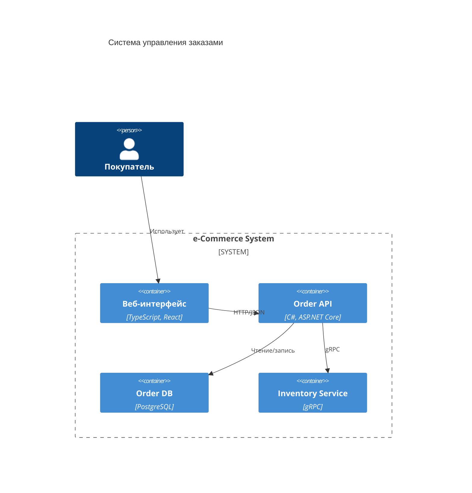

---
title: 6.11. Проектирование
---

# 6.11. Проектирование

<div class="article-tags">
  <span class="tag tag-inprogress">В РАЗРАБОТКЕ</span>
  <span class="tag tag-advanced">НЕ ДЛЯ НОВИЧКОВ</span>
  <span class="tag tag-notrequired">НЕ ОБЯЗАТЕЛЬНО</span>
</div>
<span class="complexity-badge">Разработчику</span>
<span class="complexity-badge">Архитектору</span>
<span class="complexity-badge">Аналитику</span>

## Проектирование

Проектирование программного обеспечения — это *процесс принятия архитектурных и структурных решений*, направленный на обеспечение соответствия системы её целям. Он начинается задолго до появления первой строки кода и продолжается в течение всего жизненного цикла. Ошибки на этом этапе дороже всего: исправление архитектурной несогласованности после запуска системы может требовать переписывания значительной её части, в то время как уточнение требования или изменение структуры на стадии эскиза — дело одного обсуждения.

Важно разграничить три фундаментальных слоя проектирования: **подходы**, **принципы** и **паттерны**. Они действуют на разных уровнях абстракции и отвечают за разные аспекты процесса.

- **Подходы** определяют *порядок и направление* проектирования — с чего начать, в какой последовательности формировать компоненты системы, как синхронизировать их между собой.  
- **Принципы** — это *ограничения и эвристики*, выработанные практическим опытом, которые помогают избежать системных ошибок и сохранить управляемость кода. Они не предписывают конкретных действий, но позволяют оценить качество архитектурного решения.  
- **Паттерны** — это *повторяющиеся решения* для типовых проблем в конкретных контекстах. Это уже конкретные шаблоны: как устроить взаимодействие компонентов, как организовать инициализацию объектов, как реализовать обмен сообщениями.

В этой главе рассматриваются **подходы** и **принципы проектирования** без детализации паттернов реализации или проектирования баз данных. Цель — дать системную основу для понимания последующих тем.

---

### 1. Подходы к проектированию

Подход к проектированию — это стратегия, которая определяет, *откуда* начинается работа над системой и *в каком порядке* формируются её компоненты. Выбор подхода напрямую влияет на распределение рисков, возможность итераций и степень контроля над данными.

#### 1.1. Code First

Подход «Code First» предполагает, что отправной точкой является *кодовая модель предметной области*: классы, интерфейсы, методы. База данных рассматривается как *вторичная структура*, производная от кода. Её схема генерируется автоматически (например, через миграции), либо создаётся вручную по описанию, полученному из кода.

Этот подход характерен для доминирующих в последние десятилетия парадигм: объектно-ориентированного и функционального программирования, где акцент сделан на моделировании поведения системы. Он предполагает, что бизнес-логика и правила взаимодействия сущностей выражаются в первую очередь в коде, а не в ограничениях базы данных.

**Преимущества**:
- Быстрый старт: разработчик сразу пишет код, минуя этап физического проектирования БД.
- Естественное соответствие доменной модели: классы отражают сущности предметной области без искажений, навязанных структурой таблиц.
- Легче обеспечить соответствие принципам SOLID и DDD: инкапсуляция поведения и данных происходит в классе, а не распыляется между кодом и триггерами.

**Ограничения**:
- Риск некорректного физического представления данных. Например, ORM может сгенерировать таблицы без необходимых индексов или с неоптимальными типами.
- Сложность интеграции с унаследованными системами, где схема БД фиксирована и не подлежит изменению.
- Потенциальная потеря контроля над производительностью на уровне хранилища.

Примеры реализации — **Entity Framework Core** (.NET) и **Django ORM** (Python). В обоих случаях разработчик описывает классы, а ORM генерирует DDL-скрипты и управляет синхронизацией миграций.

#### 1.2. Database First

Подход «Database First» ставит во главу угла *модель данных*. Сначала проектируется логическая и физическая схема базы данных — таблицы, связи, ограничения целостности, индексы. Затем по этой схеме генерируется код: классы сущностей, методы доступа к данным.

Этот подход исторически был доминирующим в enterprise-разработке, особенно в 2000–2010-е годы, когда сложные хранимые процедуры, триггеры и представления являлись неотъемлемой частью бизнес-логики. Он остаётся актуальным в системах с высокими требованиями к целостности данных, в финансовых или медицинских приложениях, где данные первичны.

**Преимущества**:
- Чёткий контроль над структурой данных. Требования нормализации, уникальности, ограничений проверяются на уровне СУБД.
- Поддержка сложных аналитических запросов: оптимизация выполняется на уровне плана выполнения СУБД, а не ORM.
- Простота совместной работы с DBA (администраторами баз данных), так как схема — основной артефакт.

**Ограничения**:
- Сложность выражения поведения. Бизнес-логика, распределённая между кодом и хранимыми процедурами, становится трудноотлаживаемой и плохо тестируемой.
- Проблемы с версионированием: изменения схемы требуют синхронизации между командами разработки и эксплуатации.
- Угроза нарушения принципов инкапсуляции: таблица с десятком полей превращается в «божественный класс» с десятками методов.

Типичный стек — генерация классов через **SQL Server Management Studio + Entity Framework (Database First mode)** или **Hibernate Tools** для Java.

#### 1.3. ETL и ELT

Эти подходы применимы при проектировании *систем интеграции и аналитики*, где центральной задачей является перемещение, трансформация и агрегация данных между источниками и приёмниками. Хотя они возникли в контексте хранилищ данных (data warehousing), сегодня используются и в обработке потоков (streaming), и в микросервисных архитектурах.

##### ETL (Extract — Transform — Load)

Последовательность операций чётко разделена во времени и в инфраструктуре:
1. **Extract** — данные извлекаются из источников (реляционные БД, API, файлы, очереди).
2. **Transform** — происходит обработка в *промежуточной среде*: очистка (удаление дубликатов, заполнение пропусков), нормализация (приведение к единому формату), агрегация (расчёт KPI, группировка), обогащение (добавление справочников).  
3. **Load** — результат загружается в целевую систему (хранилище, витрину данных, OLAP-куб).

Трансформация требует вычислительных ресурсов, но выполняется *до* попадания данных в целевую систему. Это позволяет снизить нагрузку на приёмник и гарантировать, что туда попадут только валидные, структурированные данные.

**Когда использовать ETL**:
- Когда требования к качеству данных строгие (например, регуляторная отчётность).
- Когда целевая система ресурсоограничена (например, embedded-устройство или legacy-СУБД без поддержки сложных запросов).
- Когда трансформация требует сложной логики, не реализуемой средствами СУБД (например, ML-модели, интеграция с внешними API).

Инструменты: **Apache NiFi**, **Talend**, **SSIS**, **Informatica PowerCenter**.

##### ELT (Extract — Load — Transform)

Здесь данные сначала загружаются *в сыром виде*, а затем трансформируются уже в целевой системе — как правило, в облачном хранилище (например, Snowflake, BigQuery, Redshift), обладающем мощными вычислительными возможностями.

1. **Extract** — те же источники.
2. **Load** — «сырые» данные (raw layer) помещаются в целевое хранилище без предварительной обработки. Часто сохраняются в формате, максимально близком к оригиналу (Parquet, Avro, JSON).
3. **Transform** — трансформация выполняется *внутри* хранилища: SQL-скрипты, stored procedures, UDF, или облачные dataflow-движки (например, dbt — data build tool).

**Когда использовать ELT**:
- Когда источник данных объёмный и изменяющийся (streaming-логи, IoT-устройства).
- Когда аналитикам нужна гибкость: возможность перестроить витрину под новый запрос без перезапуска всего ETL-конвейера.
- Когда целевая система — облачная аналитическая платформа, где вычислительные ресурсы масштабируемы и оплачиваются по использованию.

**Ключевое отличие ETL и ELT** — *место и время ответственности за трансформацию*. В ETL ответственность лежит на отдельном интеграционном слое; в ELT — на аналитической платформе и её пользователях. Это влияет на разделение ролей: в ETL доминирует инженер данных; в ELT — аналитик или data engineer с SQL-экспертизой.

> ⚠️ Обратите внимание: переход от ETL к ELT стал возможен благодаря развитию облачных MPP-СУБД (massively parallel processing), где вычисления и хранение масштабируются независимо. На классическом «железном» сервере ELT часто неприменим.

---

### 2. Принципы проектирования

Принципы — это *критерии оценки*. Они позволяют задать вопрос: *«Если бы мы сделали иначе, что пошло бы не так через год?»* Хороший код сегодня — это рабочий код и тот, который можно безопасно изменить завтра.

Ниже рассматриваются принципы, доказавшие свою ценность в реальных промышленных проектах. Их применение не гарантирует успех, но их игнорирование почти всегда ведёт к накоплению технического долга.

#### 2.1. SOLID

SOLID — это акроним, введённый Робертом Си Мартином, обобщающий пять принципов, направленных на повышение *гибкости*, *тестируемости* и *сопровождаемости* кода.

##### **S — Single Responsibility Principle (Принцип единственной ответственности)**

Формулировка: *«Класс должен иметь одну и только одну причину для изменения».*

Ключевое уточнение: «причина для изменения» — это *актор*, внешняя сущность, требования которой влияют на модуль. Актор может быть человеком (пользователем, администратором), системой (платёжным шлюзом) или процессом (аудит, регламент).

Пример нарушения: класс `OrderService`, который:
- вычисляет итоговую стоимость (для клиента),
- логирует действия в аудиторский журнал (для безопасности),
- отправляет email-уведомление (для маркетинга).

Если требования к логированию изменятся (например, нужно шифровать записи), придётся перекомпилировать и перетестировать модуль, отвечающий за расчёт. Это нарушает SRP.

Решение — выделить отдельные модули:
- `OrderCalculator` — только расчёт,
- `AuditLogger` — только запись логов,
- `NotificationService` — только отправка сообщений.

Теперь изменения в одном не затрагивают другие.

> 💡 SRP работает на уровне класса, модуля, микросервиса, даже репозитория. Например, монорепозиторий, содержащий бэкенд, фронтенд и инфраструктурные скрипты, нарушает SRP на уровне кодовой базы.

##### **O — Open/Closed Principle (Принцип открытости/закрытости)**

Формулировка: *«Программные сущности должны быть открыты для расширения, но закрыты для модификации».*

Это не означает, что код нельзя менять. Речь о том, что *новые требования должны реализовываться через добавление кода, а не изменение существующего*.

Как этого добиться? Через абстракции. Если поведение вынесено в интерфейс или абстрактный класс, то новые реализации можно добавлять без затрагивания клиентов.

Пример: система расчёта скидок. Вместо `if (customer.Type == "VIP") … else if …` — создаётся интерфейс `IDiscountStrategy`, и классы `StandardDiscount`, `VipDiscount`, `SeasonalDiscount` реализуют его. При добавлении нового типа скидки — пишется новый класс, основная логика не трогается.

ОCP лежит в основе архитектурных подходов вроде **Port and Adapters (Hexagonal Architecture)** и **Clean Architecture**. В них внутренние слои (domain, application) не содержат зависимостей от внешних (БД, UI, инфраструктуры). Все зависимости направлены *внутрь*, к абстракциям. Это позволяет, например, заменить веб-API на CLI или gRPC, не трогая бизнес-логику.

##### **L — Liskov Substitution Principle (Принцип подстановки Барбары Лисков)**

Формулировка: *«Объекты в программе могут быть заменены их подтипами без изменения правильности выполнения программы».*

Иначе говоря: подкласс не должен *нарушать контракт*, заданный суперклассом. Если метод родителя обещает: «не бросает исключений», — дочерний тоже не должен. Если родитель допускает `null` в параметрах, а дочерний — нет, это нарушение.

Классический контрпример — `Square` как подкласс `Rectangle`. У прямоугольника ширина и высота независимы; у квадрата — связаны. Если клиент рассчитывает на независимость (`rect.Width = 5; rect.Height = 10`), замена на `Square` приведёт к ошибке.

Правильное решение — вынести общий интерфейс `IShape` с методом `GetArea()`, а `Rectangle` и `Square` сделать независимыми реализациями. Наследование здесь — *установление контракта*.

LSP тесно связан с **Design by Contract** (предусловия, постусловия, инварианты), впервые формализованной в языке Eiffel. Современные языки частично поддерживают его через аннотации (`@NotNull`, `Contract.Requires`), но полный контроль остаётся за разработчиком.

##### **I — Interface Segregation Principle (Принцип разделения интерфейсов)**

Формулировка: *«Клиенты не должны зависеть от методов, которые они не используют».*

«Толстый» интерфейс — это технический долг. Если класс `DocumentProcessor` реализует `IPrintable`, `IScannable`, `IFaxable`, но на устройстве есть только сканер, ему придётся реализовывать методы `Print()` и `Fax()` как `throw new NotImplementedException()`. Это ломает полиморфизм: клиент, ожидающий `IPrintable`, получит исключение.

Решение — дробить интерфейсы до уровня *роли*:
- `IPrintJob`
- `IScanJob`
- `IFaxJob`

Теперь `SimpleScanner` реализует только `IScanJob`; `AllInOneDevice` — все три. Зависимости становятся точными.

ISP особенно важен при проектировании API. Публичный интерфейс должен быть минималистичным и сфокусированным на сценарии использования.

##### **D — Dependency Inversion Principle (Принцип инверсии зависимостей)**

Формулировка:
1. Модули верхнего уровня не должны зависеть от модулей нижнего уровня.  
2. Оба типа модулей должны зависеть от абстракций.  
3. Абстракции не должны зависеть от деталей. Детали должны зависеть от абстракций.

Это *инверсия направления зависимостей*. В традиционной архитектуре приложение зависит от БД: `App → PostgreSQL`. При DIP оба зависят от абстракции:  
`App → IPersistence ← PostgreSQL`.

Результат:
- Тестируемость: можно подменить `PostgreSQL` на `InMemoryRepository` в unit-тестах.
- Заменяемость: переход с одного хранилища на другое не затрагивает бизнес-логику.
- Стабильность: изменения в инфраструктуре не приводят к перекомпиляции ядра.

DIP реализуется через **Dependency Injection** — механизм передачи зависимостей извне (через конструктор, свойство или метод). Контейнеры DI (например, Microsoft.Extensions.DependencyInjection, Autofac, Guice) автоматизируют этот процесс.

---

#### 2.2. DRY — Don’t Repeat Yourself

Формулировка: *«Каждая единица знания должна иметь единственное, однозначное, авторитетное представление в системе».*

DRY — не про «не дублируй строки кода». Дублирование *логики* — проблема; дублирование *данных* в определённых контекстах может быть оправдано (например, денормализация для производительности).

Пример нарушения: один и тот же алгоритм расчёта налога реализован в трёх местах — в веб-сервисе, в фоновом job’е и в CLI-утилите. Изменение ставки налога потребует правки в трёх файлах, риск рассогласования высок.

Решение — вынести логику в общий модуль, библиотеку или микросервис.

Важно: не следует применять DRY слепо. Если два фрагмента похожи *сейчас*, но *причины их изменения различны*, объединение их в одну функцию приведёт к нарушению SRP и росту связанности. DRY сильнее всего работает, когда совпадают *семантика и причины изменений*.

---

#### 2.3. KISS — Keep It Simple, Stupid

Формулировка: *«Простота — предварительное условие надёжности»* (цитата Дейкстры).

KISS не означает «делай примитивно». Это призыв избегать *излишней сложности* — той, которая не оправдана требованиями.

Пример: использование Kafka для обмена сообщениями между двумя микросервисами, если нагрузка — 10 запросов в день. Здесь выигрыш от отказоустойчивости и масштабируемости не покрывает стоимость эксплуатации.

KISS требует постоянного вопроса: *«Какой самый простой способ, который всё ещё работает?»* Иногда это монолит; иногда — файловый обмен; иногда — отсутствие кэша.

Связь с другими принципами: KISS часто вступает в противоречие с «изящными» архитектурами. SOLID и DRY — инструменты, которые *помогают* сохранять простоту в масштабе; без них простота быстро превращается в беспорядок.

---

#### 2.4. Закон Конвея

Формулировка (оригинал, 1967): *«Организации, проектирующие системы, ограничены созданием конструкций, которые являются копиями структуры коммуникаций в этих организациях».*

Это не шутка и не метафора — это *эмпирически подтверждённое наблюдение*. Если в компании три отдела (фронтенд, бэкенд, инфраструктура), система почти неизбежно будет состоять из трёх слоёв, разделённых API-границами — даже если с технической точки зрения эффективнее было бы объединить два из них.

Последствия:
- При слиянии компаний — конфликты архитектур.
- При реорганизации команд — необходимость рефакторинга системы.
- При построении микросервисов — границы сервисов часто повторяют штатное расписание.

Проектировщик должен *учитывать организационный контекст*. Хорошая архитектура — та, что устойчива к изменениям в структуре команды. Это достигается через чёткие контракты (API, события), независимые циклы разработки и отказ от «серых зон» ответственности.

---

#### 2.5. SOC — Separation of Concerns (Разделение ответственности)

Формулировка: *«Разделение системы на части, каждая из которых отвечает за отдельную, независимую задачу».*

SOC — самый общий принцип, лежащий в основе всех остальных. SRP, DIP, архитектурные слои — всё это его проявления.

Примеры уровней разделения:
- **Представление / Логика / Данные** (MVC, MVP, MVVM)
- **Domain / Application / Infrastructure** (Clean Architecture)
- **UI / API / Data** (Three-tier architecture)

Цель — локализация изменений. Если меняется способ отображения, не должно требоваться переписывание расчёта. Если меняется СУБД, не должен переписываться API-контракт.

SOC выражается через:
- Чёткие интерфейсы между компонентами.
- Запрет прямых зависимостей между слоями (только через абстракции).
- Изоляцию побочных эффектов (например, логирование, кэширование — отдельные cross-cutting concerns, реализуемые через AOP или middleware).

---

### 3. Проектирование сервисов и методов

#### 3.1. Определение границ сервиса

Начнём с вопроса: *что вообще считать сервисом?*

В современной практике термин «сервис» используется в нескольких значениях:
- **Микросервис** — автономное приложение со своей БД, жизненным циклом и API.
- **Domain-сервис** — класс в доменном слое, реализующий логику, не принадлежащую конкретной сущности (например, `TransferService` для перевода денег между счетами).
- **Application-сервис** — точка входа в приложение (например, `CreateOrderCommandHandler`), координирующий транзакции и вызовы домена.
- **Интеграционный сервис** — адаптер к внешней системе (платёжный шлюз, SMS-провайдер).

Независимо от уровня, проектирование любого сервиса начинается с ответа на три вопроса:

> 1. **Какова его единственная цель?**  
>    Если не удаётся сформулировать её одним предложением — границы размыты.  
>    *Пример хорошей формулировки*: «Обеспечивает создание заказа с проверкой доступности товара, резервированием и инициацией оплаты».  
>    *Пример плохой*: «Управляет заказами» — слишком широко.

> 2. **Какие акторы инициируют его работу?**  
>    Это определяет контракт и уровень детализации. Сервис, вызываемый пользователем через UI, должен валидировать входные данные и формировать понятные сообщения об ошибках. Сервис, вызываемый другим внутренним компонентом в рамках транзакции, может полагаться на предварительную валидацию и возвращать структурированные исключения.

> 3. **Какие внешние зависимости он имеет?**  
>    Каждая зависимость — это потенциальная точка отказа и сложность интеграционного тестирования. Если сервис зависит от пяти внешних систем, вероятно, его стоит разделить или ввести уровень абстракции (например, шлюз агрегации).

##### Практический алгоритм определения границ:

1. **Выделите бизнес-транзакцию** — атомарную операцию, имеющую смысл для предметной области (например, «оформить заказ», «подтвердить email»).
2. **Определите участников** — какие сущности, агрегаты, внешние системы участвуют.
3. **Проверьте, нарушает ли операция инварианты нескольких агрегатов**.  
   - Если инвариант *одного* агрегата — логика принадлежит самому агрегату (`Order.AddLine()`).  
   - Если инвариант *нескольких* — требуется domain-сервис (`OrderFulfillmentService`).  
4. **Оцените жизненный цикл** — должен ли сервис обрабатывать асинхронные события, компенсационные действия, повторные попытки? Это влияет на выбор паттернов (Saga, Circuit Breaker).

Важно: границы сервиса должны совпадать с **границами согласованности данных**. Если для выполнения операции требуются данные из нескольких БД без распределённой транзакции — это сигнал к пересмотру: либо агрегировать данные заранее (через событийную модель), либо выделить отдельный процесс оркестрации.

---

#### 3.2. Проектирование контракта метода

Контракт метода — это его «публичное обещание»: что он принимает, что гарантирует и что может пойти не так. Хороший контракт позволяет клиенту использовать метод *без изучения его исходного кода*.

Контракт включает четыре аспекта:

##### 3.2.1. Сигнатура (имя, параметры, возвращаемое значение)

- **Имя** должно отражать *действие*, а не реализацию: `ReserveInventory()` лучше, чем `CallWarehouseApi()`.  
- **Параметры** — минимально необходимый набор. Избегайте «мешков» вроде `Dictionary<string, object>` или «god-объектов» с 15 полями. Если параметров больше трёх, стоит рассмотреть введение DTO (Data Transfer Object).  
- **Возвращаемое значение** должно быть *однозначным*:  
  - `void` — если метод идемпотентен и не требует подтверждения (например, `LogEvent()`),  
  - `Result<T, Error>` или `Either` — в функциональных стилях, где ошибки часть контракта,  
  - `Task<T>` — если асинхронно,  
  - Исключения — только для *исключительных* ситуаций (например, сбой инфраструктуры), а не для бизнес-ошибок («недостаточно средств» — не исключение).

##### 3.2.2. Предусловия

Что должно быть истинно *до* вызова метода?  
- Валидность входных данных (например, `email` соответствует RFC 5322),  
- Состояние системы (например, «пользователь аутентифицирован»),  
- Ограничения окружения (например, «доступна сеть»).

Предусловия *не проверяются внутри метода*, если они относятся к ответственности вызывающего кода. Например, метод `ProcessPayment(PaymentRequest request)` не проверяет, авторизован ли пользователь — этим должен заняться слой авторизации выше.

##### 3.2.3. Постусловия

Что гарантированно будет истинно *после* успешного выполнения?  
- Изменения в состоянии («заказ создан в статусе Draft»),  
- Побочные эффекты («отправлено email-уведомление»),  
- Инварианты («баланс неотрицателен»).

Постусловия — основа для тестирования: unit-тесты проверяют, что постусловия выполняются при заданных предусловиях.

##### 3.2.4. Обработка ошибок

Критически важный элемент. Ошибки делятся на три категории:

| Категория | Пример | Как обрабатывать |
|----------|--------|------------------|
| **Бизнес-ошибки** | «Недостаточно товара на складе», «Карта просрочена» | Возвращать структурированный результат (`Result.Fail(InsufficientStock)`), не бросать исключения. Клиент может принять решение (предложить альтернативу, запросить подтверждение). |
| **Ошибки валидации** | «Email пуст», «Сумма ≤ 0» | Возвращать список нарушений (`ValidationResult`). Часто обрабатываются на уровне представления. |
| **Системные ошибки** | «Таймаут БД», «Сбой сети» | Исключения или `Result.Fail<SystemFailure>`. Обрабатываются на уровне инфраструктуры (повтор, fallback, логирование). |

Исключение — это сигнал о *непредвиденном* состоянии. Если ошибка прогнозируема (даже если редка), она должна быть частью контракта.

---

#### 3.3. Идемпотентность и безопасность

Эти свойства определяют, как метод реагирует на повторный вызов — ключевой фактор при проектировании распределённых систем.

- **Безопасный (safe) метод** — не изменяет состояние системы. В HTTP это `GET`, `HEAD`, `OPTIONS`.  
- **Идемпотентный метод** — повторный вызов с теми же параметрами не изменяет результат после первого успешного выполнения. `PUT`, `DELETE` в REST — идемпотентны; `POST` — обычно нет.

Почему это важно?  
- Сетевые сбои делают повторные вызовы неизбежными.  
- Клиент не может отличить «метод не дошёл» от «метод выполнился, но ответ потерялся».  
- Без идемпотентности повтор приведёт к дубликатам (два заказа, два списания).

**Как обеспечить идемпотентность?**  
1. Ввести идемпотент-ключ (например, `X-Idempotency-Key: <guid>`), генерируемый клиентом.  
2. Сохранять результат первого вызова с этим ключом.  
3. При повторном вызове с тем же ключом — возвращать кэшированный результат.

Это требует дополнительного хранилища (обычно TTL-кэш на 24–72 часа), но исключает бизнес-риски.

---

#### 3.4. Версионирование и эволюция

Система живёт дольше, чем любой отдельный метод. Проектирование должно учитывать будущие изменения.

**Стратегии версионирования:**

| Подход | Как | Плюсы | Минусы |
|-------|-----|-------|--------|
| **Версия в URL** (`/api/v1/orders`) | Явная, простая | Чёткое разделение | Нарушает принцип, что URL — идентификатор ресурса |
| **Версия в заголовке** (`Accept: application/vnd.myapp.v2+json`) | Семантически корректно (RFC 7240) | Сохраняет чистоту URL | Сложнее тестировать, требует инфраструктурной поддержки |
| **Параметр запроса** (`?version=2`) | Гибко | Поддержка нескольких версий в одном endpoint’е | Риск кэширования старой версии прокси |

**Правила эволюции контракта (для обратной совместимости):**

- **Добавлять** поля можно — клиенты проигнорируют новые.  
- **Удалять** поля нельзя — сломает старые клиенты. Вместо этого помечать как `deprecated`.  
- **Изменять тип** поля нельзя. Если нужен новый формат — добавлять новое поле (`price_v2`).  
- **Изменять семантику** — только с новой версией API.

Внутри системы (не в публичном API) можно использовать более гибкие механизмы: feature flags, стратегии миграции («двумя столбцами»), события с версией схемы (`OrderCreated_v2`).

---

#### 3.5. Тестирование как часть проектирования

Метод, который нельзя протестировать изолированно, плохо спроектирован. Критерий: *можно ли написать unit-тест без запуска БД, сети, UI?*

Техники обеспечения тестируемости:
- **Инверсия зависимостей**: передавать репозитории, сервисы через интерфейсы.  
- **Чистые функции**: выносить вычисления без побочных эффектов (расчёт налогов, валидация).  
- **Изоляция времени**: вместо `DateTime.Now` — `IClock.Now`, чтобы управлять временем в тестах.  
- **Фиксированные входные данные**: избегать `Guid.NewGuid()`, использовать `IGuidGenerator`.

Unit-тест должен проверять *один сценарий поведения*. Если для покрытия метода требуется 20 тестов — он слишком велик (нарушение SRP).

---

### 4. Проектирование функциональных UI

#### 4.1. Функциональный UI и визуальный дизайн

Прежде чем перейти к проектированию, необходимо чётко развести две задачи:

- **Визуальный дизайн** — отвечает на вопрос *«как это выглядит?»*: композиция, цвет, типографика, анимации, эмоциональное восприятие. Его цель — сделать интерфейс привлекательным, интуитивным и доступным.  
- **Функциональное проектирование UI** — отвечает на вопрос *«как это работает?»*: какие действия доступны пользователю, в какой последовательности, при каких условиях, как состояние системы отражается в интерфейсе, как обрабатываются ошибки. Его цель — сделать взаимодействие корректным, предсказуемым и безопасным.

Разработчик, проектирующий функциональный UI, работает с *моделями состояний*, *контрактами API*, *ограничениями домена* и *сценариями использования*. Художник создаёт макет кнопки «Оплатить»; инженер определяет, когда она должна быть активна, что происходит при нажатии, как обрабатывается таймаут, как отображается прогресс, как восстанавливается состояние после обновления страницы.

Если визуальный дизайн нарушается — страдает удобство.  
Если функциональное проектирование нарушается — страдает корректность.  
Например: кнопка «Оплатить» серая и некрасивая — плохо. Кнопка «Оплатить» активна при нулевой сумме — критическая ошибка.

#### 4.2. UI как отражение бизнес-состояния

Фундаментальный принцип: **пользовательский интерфейс не управляет системой — он отражает её состояние и предоставляет канал для воздействия**.

Это означает:
- Любое действие пользователя — это *запрос на изменение состояния*, а не прямая команда.  
- Любое отображаемое значение — это *проекция текущего состояния*, а не кэшированная копия.  
- Любое ограничение интерфейса (недоступная кнопка, скрытое поле) — это *выражение бизнес-правила*, а не произвольное решение дизайнера.

Пример:  
В системе управления заказами статус «Оплачен» означает:  
- Нельзя изменить состав заказа,  
- Можно инициировать отгрузку,  
- Нельзя отменить без возврата средств.

Функциональный UI должен:  
- Отключать элементы редактирования при статусе «Оплачен»,  
- Делать доступной кнопку «Отгрузить»,  
- Скрывать или переключать кнопку «Отменить» на «Запросить возврат».

Если эти правила реализованы *только на фронтенде*, возможна рассогласованность: пользователь может отправить запрос на изменение состава через Postman, и бэкенд его примет (если там нет проверки).  
Если реализованы *только на бэкенде* — UI будет выглядеть «мертвым»: кнопки активны, но при нажатии возвращается ошибка 403.

Правильный подход:  
1. **Бизнес-правила декларируются в домене** (например, `Order.CanModify()` → `bool`).  
2. **Бэкенд предоставляет метаданные о доступных действиях** (например, `GET /orders/123` возвращает данные и `availableActions: ["ship", "requestRefund"]`).  
3. **Фронтенд строит UI на основе этих метаданных**, а не на основе локальной логики.

Такой подход называется **HATEOAS** (Hypermedia as the Engine of Application State) — один из принципов REST, редко реализуемый полностью, но крайне полезный как идеал.

#### 4.3. Алгоритм проектирования функционального UI

Процесс начинается с анализа *сценариев взаимодействия*.

##### Шаг 1. Выявление акторов и целей

Кто использует интерфейс и зачем?  
- Администратор хочет *массово изменить статусы заказов*.  
- Покупатель хочет *проследить этапы доставки*.  
- Оператор колл-центра хочет *быстро найти заказ по телефону и продиктовать статус*.

У каждого — разные цели, следовательно, разные приоритеты в интерфейсе:  
- Для администратора — таблица с чекбоксами и bulk-действиями,  
- Для покупателя — линейный прогресс-бар с пояснениями,  
- Для оператора — поле поиска с автодополнением и крупным отображением статуса.

Проектирование начинается с *пользовательских историй*, но как источника для выявления *ограничений и инвариантов*.

##### Шаг 2. Моделирование состояний и переходов

Каждый UI-экран — это проекция *состояния агрегата* или *процесса*. Необходимо явно описать:  
- Какие состояния возможны (например, `Draft → Confirmed → Paid → Shipped → Delivered`),  
- Какие переходы разрешены,  
- Какие условия необходимы для перехода (например, «только после оплаты можно перейти в Shipped»),  
- Какие побочные эффекты сопровождают переход (email, webhook, изменение складских остатков).

Это часто оформляется как **диаграмма состояний (state machine)** для согласования между разработчиками, тестировщиками и аналитиками.

Если переход не моделируется явно, он реализуется императивно в коде (`if (order.Status == "Paid") ...`), что ведёт к:  
- Рассогласованности между UI и бэкендом,  
- Ошибкам при параллельных изменениях,  
- Сложности добавления новых состояний.

##### Шаг 3. Определение контракта данных

UI требует *структурированный контекст*:
- Текущее состояние объекта,  
- Возможные действия,  
- Ограничения ввода (валидация в реальном времени),  
- Справочники и enum’ы (со значениями и локализацией),  
- История изменений (если нужна аудиторская трассировка).

Контракт должен быть *самодостаточным*. Пример плохого API:  
```json
{ "status": "paid", "canShip": true }
```
— откуда UI знает, что `canShip` означает? Что будет, если завтра добавится `canCancel`?

Хороший API:  
```json
{
  "status": "paid",
  "transitions": [
    { "action": "ship", "label": "Отгрузить", "requires": ["warehouseNote"] },
    { "action": "requestRefund", "label": "Запросить возврат" }
  ],
  "validationRules": {
    "warehouseNote": { "required": true, "maxLength": 255 }
  }
}
```

Такой подход:  
- Снижает связность UI и бэкенда,  
- Позволяет динамически менять логику без деплоя фронтенда,  
- Упрощает локализацию и A/B-тестирование интерфейсов.

##### Шаг 4. Управление асинхронностью и частичными состояниями

В распределённых системах UI часто работает с *неполным или устаревшим состоянием*. Проектирование должно учитывать:  
- Что показывать во время выполнения операции? (индикатор, блокировка кнопки),  
- Что делать при таймауте? (повтор, отмена, сохранение черновика),  
- Как синхронизировать состояние после переподключения? (оптимистичные обновления, операционные трансформации),  
- Как обрабатывать конфликты? («другой пользователь изменил этот заказ»).

Пример: редактирование заказа.  
- Пользователь меняет адрес,  
- В это время оператор отменяет заказ,  
- Пользователь нажимает «Сохранить».

Если UI не проверяет условие `If-Match` (ETag) или не получает события `OrderCancelled`, сохранение пройдёт — и отменённый заказ снова станет активным.

Решения:  
- Использовать **оптимистичную блокировку** (ETag в заголовках),  
- Подписываться на **события домена** через SSE или WebSocket,  
- Вводить **локальные сайд-эффекты** (например, отмена сохранения при получении события `OrderCancelled`).

##### Шаг 5. Валидация

Валидация в UI — *ускорение* проверок на бэкенде.

| Уровень | Цель | Пример |
|--------|------|--------|
| **UI-валидация (мгновенная)** | Улучшить UX, снизить нагрузку | Проверка формата email при потере фокуса (`/^[^@]+@[^@]+\.[^@]+$/`) |
| **Фронтенд-валидация (перед отправкой)** | Предотвратить заведомо невалидные запросы | Проверка общей суммы ≥ минимальной корзины |
| **Бэкенд-валидация (на входе)** | Гарантия целостности | Повторная проверка формата, бизнес-правил, доступа |
| **Доменная валидация (в сущностях)** | Защита инвариантов | `Order.AddLine()` проверяет, что товар активен и в наличии |

Важно: *никакая валидация на фронтенде не отменяет проверки на бэкенде*. UI можно обойти; бэкенд — нет.

##### Шаг 5.5. Отображение ошибок

Ошибка — *часть взаимодействия*. UX ошибки должен быть:  
- **Конкретным**: «Срок действия карты истёк» вместо «Ошибка оплаты»,  
- **Действенным**: предложить решение — «Введите новую карту» или «Свяжитесь с банком»,  
- **Локализованным**: код ошибки (`CARD_EXPIRED`) + сообщение на языке пользователя,  
- **Логируемым**: уникальный correlation ID для диагностики.

Идеальный контракт ошибки:  
```json
{
  "error": {
    "code": "INSUFFICIENT_FUNDS",
    "message": "На счёте недостаточно средств",
    "details": {
      "balance": 1200,
      "required": 1500,
      "currency": "RUB"
    },
    "resolution": {
      "actions": ["topUp", "useBonus"],
      "links": {
        "topUp": "/wallet/top-up",
        "bonus": "/profile/bonus"
      }
    }
  }
}
```

#### 4.4. Разделение ответственности между UI и бизнес-логикой

Последствия дублирования логики:
- UI содержит `if (total < 1000) shipping = 300 else shipping = 0`,  
- Бэкенд содержит ту же логику,  
- Правило меняется: доставка бесплатна от 800 ₽,  
- Забыли обновить фронтенд — пользователь видит 300 ₽, но платит 0,  
- Пользователь путается, поддержка получает жалобы.

Как избежать:  
1. **Вынос правил в shared-библиотеку** (если стек позволяет — например, TypeScript + .NET через генерацию DTO и валидаторов),  
2. **Предоставление правил через API** (например, `GET /pricing/rules` возвращает `{ "freeShippingThreshold": 800 }`),  
3. **Использование декларативных форм** (JSON Schema, form.io), где схема генерируется на бэкенде и интерпретируется на фронтенде.

Последний подход особенно эффективен для внутренних систем: схема формы — это проекция бизнес-модели, а не отдельный артефакт.

#### 4.5. Доступность и инклюзивность как требования проектирования

Функциональное проектирование UI включает обеспечение **доступности (accessibility)** — как *функциональное требование*.

Примеры:  
- Кнопка без `aria-label` — *недоступна для 1% пользователей*, что нарушает функциональность.  
- Цветовая индикация статуса (красный = ошибка) без текста — *некорректное отображение состояния*.  
- Отсутствие `tabindex` — *блокировка работы через клавиатуру*.

Стандарты (WCAG 2.1, Section 508) содержат конкретные критерии, которые можно тестировать автоматически (axe, Lighthouse) и вручную. Их соблюдение — часть контракта UI.

---

### 5. Проектирование баз данных

#### 5.1. База данных

Частая ошибка — рассматривать БД как «место, куда кладут данные после того, как всё спроектировано». На самом деле, выбор модели данных определяет:
- Какую бизнес-логику можно выразить явно (ограничения, триггеры, материализованные представления),  
- Какие операции будут эффективны (JOIN’ы, агрегации, full-text search),  
- Как будет происходить эволюция (миграции, обратная совместимость),  
- Как обеспечивается целостность (транзакции, каскадные обновления, распределённая согласованность).

База данных — это *вычислительная среда*, а не пассивный контейнер. Современные СУБД (PostgreSQL, CockroachDB, Spanner) поддерживают:
- Хранимые процедуры на полноценных языках (PL/pgSQL, PL/Python, PL/V8),  
- Расширения для геоданных (PostGIS), машинного обучения (MADlib), full-text search (Elasticsearch-интеграция),  
- Событийную модель (logical decoding, CDC — Change Data Capture).

Проектирование начинается с ответа на вопрос: **какие операции будут выполняться чаще всего, и какие требования к ним предъявляются?**

| Тип системы | Преобладающие операции | Требования к БД | Подход к проектированию |
|-------------|------------------------|-----------------|--------------------------|
| **OLTP** (онлайн-транзакционная обработка) | Короткие CRUD-транзакции, высокая частота | Низкая задержка, строгая ACID-согласованность | Нормализация, строгие ограничения, оптимизация под точечные запросы |
| **OLAP** (онлайн-аналитическая обработка) | Сложные агрегации, full-scan, ad-hoc запросы | Высокая пропускная способность, параллелизм | Денормализация, колоночное хранение, материализованные витрины |
| **HTAP** (гибридная) | Смешанные нагрузки (например, аналитика в реальном времени) | Баланс между задержкой и пропускной способностью | Разделение слоёв (raw → cleaned → aggregated), streaming-интеграция |

Выбор модели начинается *до* выбора СУБД. Попытка «подогнать» реляционную схему под документо-ориентированные данные (или наоборот) приводит к неэффективной архитектуре.

---

#### 5.2. Уровни моделирования данных

Проектирование проходит через три уровня абстракции — от предметной области к физической реализации.

##### 5.2.1. Концептуальная модель (Conceptual Model)

Цель — зафиксировать **сущности и связи** без привязки к технологии.

Инструменты: Entity-Relationship Diagram (ERD), UML-диаграммы классов (без методов), предметные карты (domain maps).  
Акцент — на *семантике*:  
- Что такое «Заказ»?  
- Чем отличается «Пользователь» от «Клиента»?  
- Является ли «Платёж» частью «Заказа» или независимой сущностью?

Важно: на этом этапе *не учитываются* технические ограничения (например, «в MongoDB нельзя делать JOIN’ы»). Цель — достичь согласия между бизнесом, аналитиками и разработчиками о предметной области.

##### 5.2.2. Логическая модель (Logical Model)

Цель — преобразовать концептуальную модель в структуру, *совместимую с выбранной парадигмой* (реляционная, документная, графовая), но ещё без деталей СУБД.

Для реляционной модели:  
- Нормализация до 3NF (третьей нормальной формы),  
- Определение первичных и внешних ключей,  
- Выделение связей «один-ко-многим», «многие-ко-многим»,  
- Решение о составных ключах.

Для документной (например, MongoDB):  
- Определение границ документа (агрегата),  
- Вложение vs. ссылки,  
- Структура массивов и вложенных объектов.

Ключевой вопрос: **где хранить данные, которые используются вместе?**  
- Если «Адрес доставки» всегда читается вместе с «Заказом» — вложить в документ заказа.  
- Если «Адрес» редактируется независимо и используется в нескольких заказах — вынести в отдельную коллекцию со ссылкой.

##### 5.2.3. Физическая модель (Physical Model)

Цель — адаптировать логическую модель под *конкретную СУБД* и *нагрузку*.

Этап включает:  
- Выбор типов данных (например, `TIMESTAMPTZ` vs `TIMESTAMP` в PostgreSQL),  
- Создание индексов (одиночных, составных, частичных, функциональных),  
- Разбиение таблиц (partitioning) по времени или идентификатору,  
- Настройку параметров хранения (TOAST в PostgreSQL, compression в ClickHouse),  
- Оптимизацию под write-heavy или read-heavy сценарии.

Пример компромисса:  
- Поле `status` часто фильтруется → индекс по `status`.  
- Но `status` имеет низкую селективность (90% записей — `completed`) → индекс неэффективен.  
- Решение: *частичный индекс* только по `status IN ('draft', 'pending')`.

Физическая модель — единственная, которая *изменяется после запуска системы*. Её эволюция управляется мониторингом (slow query log, EXPLAIN ANALYZE).

---

#### 5.3. Нормализация и денормализация

Часто нормализацию представляют как «правильный путь», а денормализацию — как «грязный хак для скорости». Это неверно. Оба подхода — инструменты для достижения разных целей.

##### Нормализация (до 3NF)

Цель: **устранить избыточность и обеспечить целостность**.  
Принцип: каждая «фактическая единица» хранится в одном месте.  
Пример:  
- Таблица `users(id, name, email, city)` →  
- `users(id, name, email, city_id)` + `cities(id, name)`.

Преимущества:  
- Обновление города — одно изменение, а не тысяча,  
- Гарантия согласованности через внешние ключи,  
- Поддержка сложных JOIN’ов и аналитики.

Недостатки:  
- Увеличение числа запросов (N+1 проблема),  
- Сложность горизонтального масштабирования (JOIN’ы между шардами),  
- Повышенная нагрузка на оптимизатор запросов.

##### Денормализация

Цель: **оптимизировать чтение за счёт избыточности**.  
Принцип: данные дублируются, чтобы минимизировать количество обращений к БД.

Примеры:  
- Хранение `user_name` в таблице `orders`, чтобы не JOIN’ить `users`,  
- Материализованное представление `order_totals(order_id, total)` с агрегированным значением,  
- Предварительно рассчитанные теги или категории в JSON-поле.

Когда оправдана:  
- Когда чтение значительно превышает запись (read-heavy),  
- Когда задержка JOIN’а неприемлема (mobile latency),  
- Когда данные не меняются часто (справочники, исторические записи).

Риски:  
- Рассогласованность при обновлении (кто отвечает за синхронизацию?),  
- Увеличение объёма данных,  
- Сложность миграций.

##### Гибридный подход

Современные системы редко используют «чистую» нормализацию или денормализацию. Вместо этого применяется **многослойная модель данных**:

1. **Raw layer** — сырые события (в Kafka, S3), нормализованные, immutable.  
2. **Cleaned layer** — обработанные данные, денормализованные для OLAP (в ClickHouse, BigQuery).  
3. **Serving layer** — витрины для UI (в Redis, PostgreSQL с материализованными представлениями).

Это соответствует архитектуре **Data Mesh** и **Lambda/Kappa Architecture**, где проектирование данных становится непрерывным процессом, а не однократным этапом.

---

#### 5.4. Эволюция схемы

База данных живёт дольше, чем любой микросервис. Её схема *обязана* поддерживать обратную совместимость — иначе деплой превращается в кошмар.

##### Основные правила обратно-совместимой эволюции:

| Изменение | Совместимо? | Как сделать безопасно |
|----------|-------------|------------------------|
| **Добавить колонку** | ✅ Да | С `DEFAULT` или `NULL`, без `NOT NULL` на старте |
| **Удалить колонку** | ❌ Нет | Сначала перестать её использовать, затем пометить как `deprecated`, через N релизов — удалить |
| **Изменить тип колонки** | ❌ Рискованно | Добавить новую колонку (`price_v2`), мигрировать данные, переключить потребителей, удалить старую |
| **Разделить таблицу** | ⚠️ С осторожностью | Сначала дублировать данные в новую таблицу (через триггер или CDC), затем переключить чтение, потом запись |
| **Изменить семантику поля** | ❌ Нет | Только через новое поле и версионирование API |

##### Стратегии миграции:

1. **Expand/Contract (двумя шагами)**  
   - Шаг 1 (Expand): добавить новую структуру (колонку, таблицу), сохраняя старую.  
   - Шаг 2 (Contract): переключить все компоненты на новую структуру.  
   - Шаг 3: удалить старую.  
   *Требует поддержки нескольких версий кода одновременно.*

2. **Dual Writing**  
   Запись ведётся в обе структуры параллельно. Позволяет сравнивать результаты и постепенно переключать чтение.  
   *Риск: рассогласованность при сбое записи в один из источников.*

3. **Event Sourcing + CDC**  
   Все изменения — через события. Схема БД — просто проекция. Эволюция происходит через новые проекции, без изменения источника.  
   *Наиболее устойчивый, но сложный подход.*

Критически важно: **миграции должны быть идемпотентными и атомарными**. Скрипт миграции должен можно запустить дважды — без дубликатов и ошибок.

---

#### 5.5. Проектирование под распределённость

В микросервисной архитектуре каждая служба владеет своей БД (Database per Service). Это решает проблему связанности, но создаёт новые:

- **Согласованность данных** между сервисами,  
- **Транзакции через границы сервисов**,  
- **Сложные запросы (JOIN’ы)**.

##### Подходы к решению:

| Проблема | Решение | Описание |
|---------|---------|----------|
| **Транзакции** | Saga Pattern | Последовательность локальных транзакций с компенсационными действиями («откат»). Управление — оркестрацией (центральный координатор) или хореографией (события). |
| **Чтение из нескольких БД** | CQRS + Materialized View | Команды (запись) — в собственной БД сервиса. Запросы (чтение) — из единой витрины, построенной через событийную шину. |
| **Согласованность** | Eventual Consistency + Conflict Resolution | Принять, что данные будут несогласованными кратковременно. Определить стратегию разрешения конфликтов (last-write-wins, application-defined merge). |

Пример: создание заказа.  
1. `OrderService` создаёт заказ в статусе `Pending`.  
2. Публикует `OrderCreated`.  
3. `InventoryService` резервирует товар, публикует `InventoryReserved` или `ReservationFailed`.  
4. `OrderService` получает событие и переводит заказ в `Confirmed` или `Failed`.

Ни одна распределённая транзакция не используется. Согласованность достигается *семантически*, через события.

---

### 6. Проектирование под нефункциональные требования

#### 6.1. Что такое нефункциональные требования

Функциональные требования отвечают на вопрос *«что система делает?»* («Пользователь может оформить заказ»).  
Нефункциональные — на вопрос *«как хорошо она это делает?»* («Заказ оформляется за ≤ 2 секунды при 10 000 одновременных пользователей»).

NFR часто формулируются расплывчато:  
- «система должна быть надёжной»,  
- «интерфейс должен быть быстрым»,  
- «данные должны быть защищены».

Для проектирования такие формулировки бесполезны. Требуется **количественная и измеримая спецификация**:

| Категория | Плохая формулировка | Хорошая формулировка |
|-----------|---------------------|----------------------|
| **Производительность** | «Быстро» | «P95 latency для API `/orders` `≤` 300 мс при нагрузке 500 RPS» |
| **Масштабируемость** | «Масштабируется» | «Поддержка горизонтального масштабирования без downtime; добавление узла даёт `≥` 80% линейного роста throughput» |
| **Отказоустойчивость** | «Надёжная» | «Система сохраняет работоспособность при отказе одного узла в кластере; RTO `≤` 5 мин, RPO = 0» |
| **Безопасность** | «Защищена» | «Все внешние API требуют аутентификации по OAuth 2.0; чувствительные данные шифруются AES-256 at rest и TLS 1.3 in transit» |
| **Сопровождаемость** | «Легко поддерживать» | «Время локализации ошибки `≤` 15 мин по correlation ID; coverage unit-тестов `≥` 80%» |

Только такая формулировка позволяет сделать *выбор*: использовать кэширование или оптимизировать запрос? Внедрять репликацию или резервное копирование? Шифровать на уровне приложения или СУБД?

---

#### 6.2. Масштабируемость

Масштабируемость — это способность системы сохранять характеристики при увеличении нагрузки. Она делится на два типа:

- **Вертикальная (scale-up)** — увеличение мощности одного узла (CPU, RAM, SSD).  
- **Горизонтальная (scale-out)** — добавление новых узлов в кластер.

Проектирование под горизонтальную масштабируемость требует соблюдения нескольких принципов.

##### 6.2.1. Отсутствие shared state

Если два экземпляра сервиса обращаются к одной общей переменной в памяти — масштабирование невозможно.  
Решение:  
- Вынос состояния во внешнее хранилище (Redis, PostgreSQL),  
- Использование stateless-сервисов (все данные — в запросе или в БД),  
- Шардирование сессий (sticky sessions — антипаттерн, но допустим при переходе).

##### 6.2.2. Идемпотентность и безопасность операций

Как обсуждалось ранее, идемпотентность (`PUT`, `DELETE`) позволяет безопасно повторять запросы при сбоях сети — что неизбежно в распределённой среде.  
Безопасные операции (`GET`) можно кэшировать на любом уровне (CDN, reverse proxy, gateway).

##### 6.2.3. Асинхронность и декомпозиция

Синхронные цепочки вызовов (`A → B → C`) создают «точки затора». При росте нагрузки задержка умножается.  
Решение:  
- Замена синхронных вызовов на события (event-driven architecture),  
- Вынос долгих операций в фон (job queues: RabbitMQ, Kafka, SQS),  
- Использование CQRS: запись — синхронно, чтение — из материализованных витрин.

Пример: оформление заказа.  
- Синхронный вариант: UI → OrderService → InventoryService → PaymentService → EmailService  
- Асинхронный: UI → OrderService (создаёт заказ, публикует `OrderCreated`) → фоновые обработчики  

Первый — проще для отладки, но хрупок. Второй — сложнее, но масштабируется линейно.

##### 6.2.4. Локальность данных (data locality)

Операции над данными должны происходить *там, где они находятся*.  
- Если данные шардированы по `user_id`, логика, работающая с пользователем, должна выполняться на том же узле.  
- В распределённых БД (CockroachDB, Yugabyte) это достигается через *коллокацию* (placement rules).  
- В микросервисах — через владение данными (service owns its data).

Нарушение локальности → сетевые вызовы → рост latency и снижение throughput.

---

#### 6.3. Отказоустойчивость

Отказоустойчивость — *управление последствиями*. Проектирование начинается с предположения: *всё, что может сломаться — сломается*.

##### 6.3.1. Принципы устойчивости

| Принцип | Описание | Реализация в коде/архитектуре |
|--------|----------|-------------------------------|
| **Изоляция (Bulkheads)** | Не дать сбою в одном компоненте повлиять на другие | Разделение пулов соединений, отдельные очереди для критических и некритических задач |
| **Отказоустойчивость по умолчанию (Fail-safe)** | При сбое — перейти в безопасное состояние | Возврат кэшированных данных, переключение на упрощённый режим («читалка работает, редактирование — нет») |
| **Постепенное деградирование (Graceful degradation)** | Сохранение частичной функциональности | Отключение аналитики при высокой нагрузке, отображение устаревших данных при недоступности БД |
| **Самовосстановление (Self-healing)** | Автоматическое восстановление без участия человека | Health-check + auto-restart, автоматическое переключение на реплику при таймауте |

##### 6.3.2. Паттерны устойчивости

- **Circuit Breaker** — «выключатель», который временно блокирует вызовы к нестабильному сервису после N сбоев. Позволяет избежать каскадного отказа.  
  *Пример*: библиотеки Polly (.NET), Resilience4j (Java), Hystrix (устаревает).

- **Retry with Backoff** — повтор с экспоненциальной задержкой. Важно: только для *идемпотентных* операций.  
  *Правило*: max 3 попытки, начальная задержка 100 мс, множитель 2.

- **Timeout** — явное ограничение времени ожидания. Без таймаута потоки «зависают», исчерпывая пул.  
  *Рекомендация*: таймаут вызова должен быть меньше, чем таймаут его клиента (правило 30-60-90: клиент 90 мс, сервис 60 мс, БД 30 мс).

- **Fallback** — альтернативный путь при сбое.  
  *Пример*: при недоступности рекомендательного движка — показать «популярные товары» из кэша.

##### 6.3.3. Тестирование отказоустойчивости

Проектирование без проверки — теория. Необходимы:  
- **Chaos Engineering** — намеренное введение сбоев (отключение узла, имитация latency) в staging/prod,  
- **Load + Failure Testing** — нагрузка + одновременный сбой компонента,  
- **Game Days** — симуляции инцидентов с участием команды.

Инструменты: Chaos Monkey, Gremlin, Toxiproxy.

---

#### 6.4. Безопасность

Безопасность — *встраивание контроля на каждом уровне*.

##### 6.4.1. Принципы безопасного проектирования

| Принцип | Описание | Пример в проектировании |
|--------|----------|-------------------------|
| **Минимальные привилегии** | Компонент имеет только те права, что необходимы | Микросервис `OrderService` имеет доступ только к таблице `orders`, не ко всей БД |
| **Защита в глубину (Defense in depth)** | Несколько независимых слоёв защиты | Валидация на gateway + на application layer + в домене + в БД (CHECK-ограничения) |
| **Безопасность по умолчанию** | Небезопасные настройки — запрещены | Все API закрыты по умолчанию; открытые — явно помечены `[AllowAnonymous]` |
| **Аудит и отслеживаемость** | Любое действие — логируется с контекстом | Запись в audit log: кто, что, когда, с каким correlation ID |

##### 6.4.2. Контроль доступа: от RBAC к ABAC

- **RBAC (Role-Based Access Control)** — права назначаются ролям (`admin`, `user`). Прост, но не гибок.  
  *Пример*: `admin` может удалять заказы → но что, если только *свои*?  

- **ABAC (Attribute-Based Access Control)** — права зависят от атрибутов:  
  - Пользователя (`department == "finance"`),  
  - Ресурса (`order.ownerId == userId`),  
  - Контекста (`time < 18:00`).  

  *Пример на псевдокоде*:  
  ```typescript
  if (user.role === 'manager' && order.status === 'draft' && order.createdBy === user.id) {
    allow('delete');
  }
  ```

ABAC сложнее, но соответствует реальным бизнес-правилам. Реализуется через политики (OPA — Open Policy Agent) или декларативные атрибуты.

##### 6.4.3. Защита данных

- **In transit** — TLS 1.3, mutual TLS (mTLS) между сервисами.  
- **At rest** — полное шифрование (TDE в СУБД) или на уровне приложения (шифрование полей `creditCard` до записи).  
- **In use** — защита памяти (secure enclaves, Intel SGX — редко, но для регуляторных систем).  

Важно: **ключи шифрования не хранятся в том же месте, что и данные**. Используются KMS (Key Management Service): HashiCorp Vault, AWS KMS, Azure Key Vault.

---

#### 6.5. Сопровождаемость

Система, которую невозможно понять, отладить или изменить — обречена. Сопровождаемость — это инвестиция в будущее.

##### 6.5.1. Наблюдаемость (Observability)

Три столпа:  
1. **Логи** — структурированные (JSON), с `level`, `service`, `traceId`, `spanId`.  
2. **Метрики** — количественные показатели (latency, error rate, saturation).  
3. **Трассировки** — end-to-end цепочка вызовов через распределённую систему (OpenTelemetry).

Проектирование под наблюдаемость:  
- Все входящие запросы получают `X-Request-ID`,  
- Каждый лог содержит `correlationId`,  
- Критические пути инструментированы `StartSpan()` / `EndSpan()`.

##### 6.5.2. Тестируемость

Как обсуждалось ранее, модуль, который нельзя протестировать изолированно, — плохо спроектирован.  
Признаки хорошей тестируемости:  
- Зависимости инжектятся,  
- Побочные эффекты вынесены (время, случайность, IO),  
- Чистые функции выделены.

##### 6.5.3. Документированность по замыслу

Документация — *продукт проектирования*:  
- Контракты API (OpenAPI/Swagger) генерируются из кода,  
- Диаграммы (C4) обновляются при изменении архитектуры,  
- Decision Log (ADR — Architectural Decision Record) фиксирует *почему* было выбрано решение.

---

### 7. Документация как инструмент проектирования

#### 7.1. Проблема «мертвой» документации

Традиционный подход:  
1. Команда проектирует систему,  
2. Пишет код,  
3. По завершении — создаёт документацию для сдачи заказчику или архивирования.

Результат — документация:  
- Устаревает через неделю после деплоя,  
- Не отражает реальных компромиссов,  
- Не помогает новому разработчику понять *почему* система устроена так, а не иначе,  
- Используется только для аудита.

Это не документация — это *археологический артефакт*.

Хорошая документация — **living artifact**:  
- Создаётся *до* и *во время* проектирования,  
- Меняется вместе с системой,  
- Используется ежедневно командой (не только техписами),  
- Автоматизирована там, где возможно.

---

#### 7.2. Типы документации в жизненном цикле проектирования

Документация делится по *цели и аудитории*.

##### 7.2.1. Контекстная документация (Context)

**Цель**: объяснить *зачем* система существует, какие проблемы решает, в каком окружении работает.  
**Аудитория**: новые разработчики, менеджеры, архитекторы, заказчики.  
**Формат**:  
- **C4 Model — Уровень 1 (System Context Diagram)** — система как чёрный ящиг, окружённый акторами (пользователи, внешние системы).  
- **ADR (Architectural Decision Record)** — фиксация ключевых решений с аргументами *за* и *против*.  
- **Non-functional Requirements** — измеримые NFR, как обсуждалось в предыдущем разделе.

**Пример ADR**:  
```markdown
## [ADR-003] Выбор Event Sourcing для Order Service

### Статус  
Принято 15.03.2025

### Контекст  
Требуется аудит всех изменений заказа, поддержка временных запросов («какой был статус 10.03?»), и компенсация ошибок через replay.

### Варианты  
1. **CRUD + Audit Table**  
   - Плюсы: простота, знакомая модель  
   - Минусы: сложность временных запросов, риск рассогласованности аудита  

2. **Event Sourcing**  
   - Плюсы: полная история, replay, естественная интеграция через события  
   - Минусы: сложность чтения, необходимость проекций  

### Решение  
Выбран Event Sourcing. Чтение реализуется через CQRS (материализованные представления).
```

Такой ADR живёт в репозитории (`/docs/adr/003-order-event-sourcing.md`) и становится частью кодовой базы.

##### 7.2.2. Структурная документация (Structure)

**Цель**: показать *из чего состоит система* и как компоненты связаны.  
**Аудитория**: разработчики, DevOps, SRE.  
**Формат**:  
- **C4 Model — Уровень 2 (Container Diagram)** — сервисы, БД, внешние API, протоколы.  
- **C4 Model — Уровень 3 (Component Diagram)** — модули внутри сервиса (domain, application, infrastructure).  
- **Deployment Diagram** — как компоненты разворачиваются (K8s, VM, serverless).

**Ключевой принцип**: диаграммы генерируются из кода или поддерживаются в актуальном состоянии *вручную, но регулярно*.  
Инструменты:  
- **Structurizr** — DSL для C4-диаграмм, интеграция с CI/CD,  
- **Mermaid** — встраивается в Markdown, поддерживается в Docusaurus, Obsidian, Confluence.  
- **PlantUML** — для сложных диаграмм с версионированием.

Пример фрагмента Mermaid для Container Diagram:


Такая диаграмма обновляется при добавлении нового сервиса как *часть процесса интеграции*.

##### 7.2.3. Поведенческая документация (Behaviour)

**Цель**: описать *как система работает* в типовых сценариях.  
**Аудитория**: тестировщики, аналитики, разработчики.  
**Формат**:  
- **Сценарии использования (Use Case)** — шаги, акторы, пред-/постусловия,  
- **Sequence Diagrams** — взаимодействие объектов во времени,  
- **State Machine Diagrams** — переходы между состояниями (например, статусы заказа).

Важно: такие диаграммы не рисуются в PowerPoint «на совещании». Они создаются *до* реализации — чтобы выявить логические разрывы.  
Пример: sequence-диаграмма для «Отмена оплаченного заказа» покажет, нужен ли возврат средств, кто его инициирует, как обрабатывается частичная отгрузка — до написания первой строки кода.

##### 7.2.4. Контрактная документация (Contracts)

**Цель**: зафиксировать *интерфейсы взаимодействия* между компонентами.  
**Аудитория**: фронтенд/бэкенд-разработчики, внешние интеграторы.  
**Формат**:  
- **OpenAPI (Swagger)** — для REST,  
- **AsyncAPI** — для событий (Kafka, RabbitMQ),  
- **Protocol Buffers (.proto)** — для gRPC,  
- **JSON Schema** — для DTO и форм.

**Ключевой принцип**: контракты — *источник истины*.  
- Клиент и сервер генерируются из одного `.yaml`/`.proto`,  
- Валидация на шлюзе (API Gateway) проверяет соответствие запроса контракту,  
- Breaking change требует новой версии контракта — не тихого изменения поля.

Пример workflow:  
1. Аналитик + разработчик проектируют API в Swagger Editor,  
2. CI проверяет, не нарушает ли новый контракт обратную совместимость (spectral, openapi-diff),  
3. При мерже в `main` — генерируются клиентские SDK и обновляется Docusaurus-документация.

##### 7.2.5. Живая документация (Living Documentation)

**Цель**: обеспечить соответствие документации и реализации *в реальном времени*.  
**Механизмы**:  
- **Tests as Documentation** — BDD-сценарии на Gherkin (`Given-When-Then`) читаются как спецификация:  
  ```gherkin
  Сценарий: Оформление заказа с недостатком товара
    Дано товар "Книга" в количестве 5 шт на складе
    Когда пользователь создаёт заказ на 10 шт
    Тогда возвращается ошибка "INSUFFICIENT_STOCK"
    И заказ не создаётся
  ```
- **API Docs from Code** — Swagger-аннотации в C# (`[ProducesResponseType]`) или Java (`@Operation`) генерируют OpenAPI-спецификацию.  
- **Interactive Examples** — Docusaurus с плагином `@docusaurus/plugin-content-docs` + `redoc` / `swagger-ui` позволяет запускать запросы прямо из документации.

---

#### 7.3. Инструменты для «живой» документации в Docusaurus

С учётом вашего стека (Docusaurus + Markdown), вот рекомендуемый стек:

| Задача | Инструмент | Как интегрируется |
|-------|------------|-------------------|
| **C4-диаграммы** | Mermaid + `@docusaurus/theme-classic` | Встроен в Docusaurus 3+; добавьте в `docusaurus.config.js`:  
```js
themeConfig: {
  mermaid: { theme: { ... } }
}
``` |
| **OpenAPI** | `@docusaurus/plugin-content-docs` + `redoc` | Используйте `@redocly/docusaurus-theme-redoc`, подключите `.yaml` как страницу:  
```md
# /docs/api/order.md
import Redoc from '@theme/Redoc';

<Redoc specUrl="/openapi/order.yaml" />
``` |
| **ADR** | Markdown-файлы в `/docs/adr/` | Подключите как отдельную sidebar в `sidebars.js`:  
```js
adr: [{ type: 'autogenerated', dirName: 'adr' }]
``` |
| **Interactive Code** | `@docusaurus/theme-live-codeblock` | Позволяет запускать JS/TS-примеры прямо в браузере (полезно для UI-логики). |

Преимущество: вся документация — в Git, версионируется вместе с кодом, проходит ревью в PR.

---

#### 7.4. Документация как часть Definition of Done

Чтобы документация не «откладывалась на потом», её включают в **Definition of Done** для задачи:

- [ ] Код написан и покрыт тестами,  
- [ ] ADR обновлён (если было архитектурное решение),  
- [ ] C4-диаграмма обновлена (если изменилась структура),  
- [ ] OpenAPI-спецификация актуальна,  
- [ ] Примеры использования добавлены в документацию.

Такой подход гарантирует, что документация *не отстаёт* — она *развивается вместе с системой*.

---

