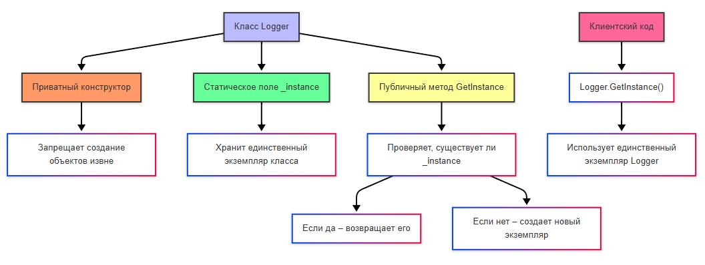
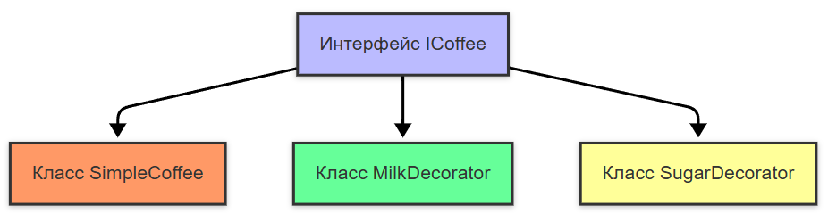
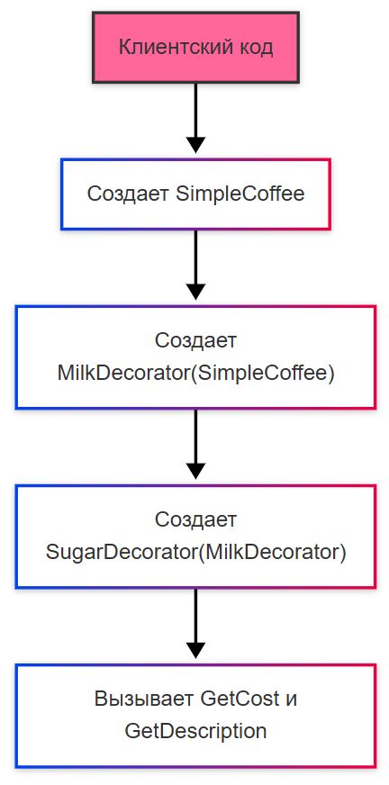
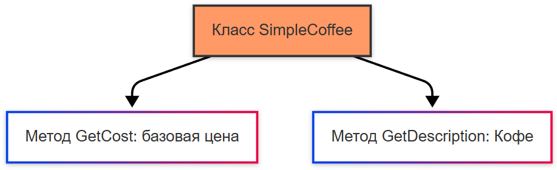
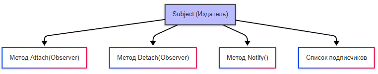
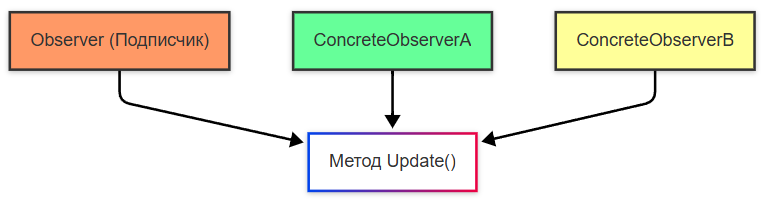
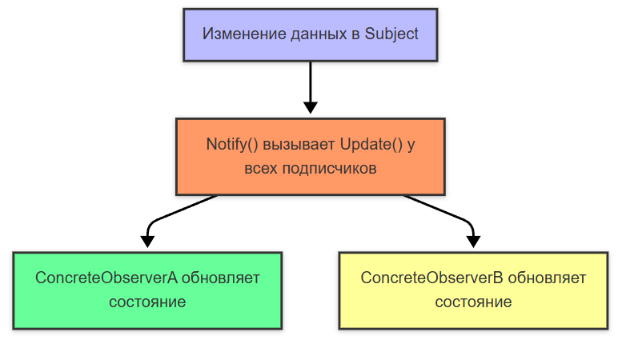
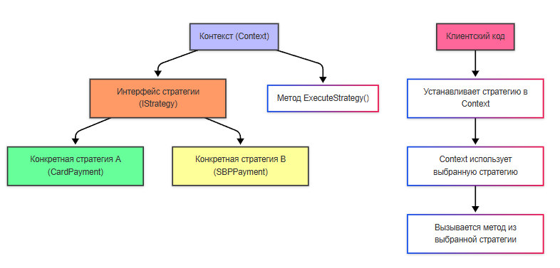

---
title: 6.11. Паттерны проектирования
---

# 6.11. Паттерны проектирования

<div class="article-tags">
  <span class="tag tag-inprogress">В РАЗРАБОТКЕ</span>
  <span class="tag tag-advanced">НЕ ДЛЯ НОВИЧКОВ</span>
  <span class="tag tag-notrequired">НЕ ОБЯЗАТЕЛЬНО</span>
</div>
<span class="complexity-badge">Разработчику</span>
<span class="complexity-badge">Архитектору</span>
<span class="complexity-badge">Аналитику</span>

## Паттерны проектирования

### Паттерны и принципы

Мы уже столько используем слово паттерн, но всё никак не дали определение. Что же такое паттерн?

**Паттерн** (шаблон проектирования) — это общее решение типовой задачи в программировании. Это не готовый код, а шаблон мышления или структура, которую можно адаптировать под конкретную ситуацию. Сам термин паттерн применяется в разных сферах, а порой можно увидеть споры о разделении «паттернов проектирования» и «паттернов программирования».

Сами задачи определяются как раз паттернами, к примеру, Singleton решает задачу «Как убедиться, что существует только один экземпляр класса?», а Strategy «Как легко менять алгоритмы в зависимости от контекста?».

Термин «паттерн» впервые использовал архитектор Кристофер Александрес в 1970-х годах для описания повторяющихся решений в дизайне пространства. В программирование его перенесли в 1994 году, когда группа из четырёх программистов — Эрих Гамма, Ричард Хелм, Ральф Джонсон и Джон Влиссидес — написали книгу «Design Patterns: Elements of Reusable Object-Oriented Software». Эта книга стала известна как «Банда четырёх» (Gof - Gang of Four).

Они описали 23 классических паттерна проектирования, которые стали основой ООП-разработки.

**Принципы** разработки (SOLID, KISS, DRY) - совсем другое, они возникли как принципы и методологии , помогающие создавать более гибкие, тестируемые и поддерживаемые системы.

Принцип является общим правилом, рекомендацией высокогоуровня, с целью правильно построить архитектуру на уровне проекта, команды.

Паттерн же является шаблоном решения конкретной задачи, конкретный способ организации кода, используемый, чтобы грамотно реализовать функционал на уровне классов и объектов.

В проекте может быть использовано несколько принципов и множество паттернов. Как можно обратить внимание, задач может быть много - интеграция по одной схеме, работа с данными по другой, авторизация по третьей - везде будут свои паттерны.

Помимо паттернов и принципов, можно выделить также подходы к проектированию и разработки (их ещё называют методологиями):

| Аббревиатура | Описание |
|-------------|---------|
| DDD | Domain-Driven Design Проектирование вокруг бизнес-области (доменная модель) |
| TDD | Test-Driven Development  Писать тесты до реализации (разработка через тестирование) |
| BDD | Behavior-Driven Development Фокус на поведении, читаемость сценариев (поведенческий подход) |


Паттерны, кстати говоря, разделяются на несколько видов:
	- паттерны проектирования - решают, как организовать классы и объекты (к примеру, Strategy, Factory, Observer);
	- паттерны моделирования - решают, как представить предметную область (Entity, ValueObject, AggregateRoot);
	- архитектурные паттерны - решают, как организовать слои и компоненты приложения (MVC, MVP, MVVM, Clean Architecture, Hexagonal).

Антипаттерн же подразумевает как раз наоборот, неприемлемую модель поведения, когда на первый взгляд всё кажется эффективным, но на деле приводит к негативным последствиям, проблемам или нежелательным результатам. Они указывают на распространённые ошибки и неоптимальные методы, которых следует избегать.

### GRASP

**GRASP** (General Responsibility Assignment Software Patterns) — это набор принципов проектирования, помогающих правильно распределять обязанности между классами и объектами в ООП. Некоторые определяют его как набор паттернов, однако всё это скорее принципы, можно даже назвать методологией назначения ответственности.

Всего там девять принципов: 
1. Information Expert (Эксперт по информации). Ответственность за операцию должна быть у того класса, который имеет все необходимые данные для её выполнения.
2. Creator (Создатель). Класс, который владеет данными или часто взаимодействует с объектом, должен создавать этот объект.
3. Controller (Контроллер). Внешние события (например, действия пользователя) обрабатываются через промежуточный объект (не напрямую в UI или модели).
4. Low Coupling (Низкая связанность). Система должна состоять из слабо связанных компонентов, чтобы изменения в одном не влияли на другие.
5. High Cohesion (Высокая связанность). Методы и данные внутри класса должны быть логически связаны, отвечать за одну задачу.
6. Polymorphism (Полиморфизм). Выбор поведения должен зависеть от типа объекта, используя переопределение методов или интерфейсы.
7. Protected Variations (Защита от изменений). Защищай код от изменений через интерфейсы и абстракции, чтобы внутренние изменения не влияли на клиентов.
8. Indirection (Косвенная связь). Добавь промежуточный объект для связи между двумя другими, чтобы снизить связанность.
9. Pure Fabrication (Чистый созданный класс). Если ни один из существующих классов не может взять на себя ответственность, создай вспомогательный класс, не связанный напрямую с предметной областью.

Таким образом, мы имеем GRASP и GoF, где первые определяют ответственность, а вторые организуют структуру.

Вроде бы масло масляное, везде говорится о том, что вроде бы кажется и так очевидным - не повторяться, не мусорить, разделять ответственность, структурировать и соблюдать порядок, но всё же от сеньоров требуют знания всего этого.

Сейчас мы говорим о проектировании. Давайте ещё раз повторим, что же такое паттерны, и рассмотрим их подробно.

★ **Паттерны проектирования** – готовые решения для типовых проблем и задач. Паттернов довольно много, это всё равно что набор чьих-то проверенных вариантов решения, и очевидно, лучше «подсмотреть», чем изобретать велосипед.

Они бывают порождающие, структурные и поведенческие.

### Порождающие

Порождающие создают объекты:

**Singleton** (синглтон) – гарантирует один экземпляр класса, которые отвечает за определённую задачу, к примеру – логгер, подключение к базе данных или глобальные настройки приложения:
	- есть класс A, который должен быть единственным (например, Logger);
	- создаем приватный конструктор (чтобы нельзя было объект извне создать);
	- указываем статическое поле `_instance` для хранения экземпляра;
	- создаем публичный метод GetInstance, который будет возвращать `_instance` (или создавать его при первом вызове).



Так, здесь Logger - это класс, который реализует паттерн синглтон. Он гарантирует, что будет создан только один экземпляр.

Приватный конструктор запрещает создание объектов класса извне. Только сам класс может создать свой экземпляр.

Статическое поле хранит единственный экземпляр класса. Если экземпляр уже создан, он используется повторно.

Метод GetInstance :
	- Проверяет, существует ли `_instance`.
	- Если `_instance` существует, возвращает его.
	- Если `_instance` не существует, создает новый экземпляр и возвращает его.

Клиентский код вызывает метод Logger.GetInstance(), чтобы получить доступ к единственному экземпляру класса Logger.

В шаблоне Singleton класс может иметь только один экземпляр и предоставляет глобальную точку доступа к нему.

**Factory** (фабрика) – создание объектов без указания точного класса, когда система работает с разными типами объектов, но не знает их заранее, к примеру – «фабрика игрушек», которой можно сказать «сделай машинку» или «сделай куклу», и в таком случае мы всегда обращаемся к фабрике игрушек, но говорим, что из её «каталога» нам нужна «машинка»:
	- есть интерфейс A (IAnimal);
	- есть классы B и C, реализующие A (Cat и Dog);
	- фабрика содержит метод Create, который возвращает объект A, но внутри решает, создать кого именно – B или C.

Классы Cat и Dog реализуют интерфейс IAnimal и предоставляют конкретную реализацию (кошка мяукает, а собака лает). Фабрика содержит метод Create, который решает, какой класс создать (Cat или Dog), на основе входных данных, и возвращает объект типа IAnimal.

Клиентский код взаимодействует только с фабрикой. Он вызывает метод AnimalFactory.Create("Cat") или AnimalFactory.Create("Dog"), чтобы получить нужный объект. Клиентский код не знает, как именно создаются объекты, и работает только с интерфейсом IAnimal.

**ClassFactory** - паттерн проектирования, который относится к паттернам создания объектов (порождающий), представляет собой часть общего паттерна Фабрика (Factory) или Фабричный метод (Factory Method). 

Самый частый пример - это UserConnection. Предположим, у нас есть класс UserConnection, представляющий соединение пользователя к чему-то (например, чату, мессенджеру и т.д.). 

UserConnection - это доменный объект (Domain Object), который может описывать состояние подключения пользователя к приложению, соединение в чате, онлайн-игре, видеоконференции, подключение по WebSocket. Он не представляет соединение с базой данных , хотя название может быть похожим. Во многих системах нужно знать, кто сейчас «в сети», нужно уметь отправлять сообщения конкретному пользователю и нужно управлять жизненным циклом подключений (открытие/закрытие).

Если UserConnection не является соединением, то в чём различие?

Соединение с БД (SqlConnection, MySqlConnection) — это низкоуровневый ресурс, который управляет доступом к данным.

А UserConnection — это логическая сущность, которая моделирует поведение пользователей в приложении. Это доменная модель.

```csharp
public class UserConnection
{
    public Guid Id { get; }
    public string Username { get; }
    public string ConnectionId { get; }

    // Конструктор
    public UserConnection(Guid id, string username, string connectionId)
    {
        Id = id;
        Username = username;
        ConnectionId = connectionId;
    }
}

```

Здесь класс UserConnection имеет несколько свойств только для чтения (Id, Username, ConnectionId), инициализируемых через конструктор. Свойства сами по себе не являются данными, это лишь контейнеры, которые требуют инициализации, аналогично конструкторам любого класса, поэтому здесь создаётся одноимённый с классом метод, который принимает параметры, аналогичные свойствам, и определяет их (инициализирует).

И в ряде случаев оптимальным подходом будет абстрагирование создания объекта, чтобы не расписывать это всё каждый раз в каждом классе, работающем с БД, к примеру, через фабрику (такой паттерн). 

В нашем случае, мы хотим абстрагировать создание объекта UserConnection. Нам нужно, чтобы ORM не вызывала напрямую new UserConnection(...), а использовала фабрику. Нужно создать интерфейс фабрики, класс фабрики и в нём сделать создание UserConnection:

```csharp
public interface IUserConnectionFactory
{
    UserConnection Create(Guid id, string username, string connectionId);
}

public class UserConnectionFactory : IUserConnectionFactory
{
    public UserConnection Create(Guid id, string username, string connectionId)
    {
        return new UserConnection(id, username, connectionId);
    }
}

```

Для C# используется Entity Framework Core, который по умолчанию может вызывать конструкторы, но только если все параметры соответствуют свойствам в БД. Но для ипользования фабрики используется несколько других подходов.

1. Фабричный метод при маппинге (LINQ + Select):
```csharp
var userConnections = dbContext.Connections
    .Where(...)
    .Select(c => factory.Create(c.Id, c.Username, c.ConnectionId))
    .ToList();

```

В этом случае ORM просто загружает данные, а создание объекта происходит через фабрику. И рабочий класс не создаёт сам через new, лишь вызывая уже готовый «создаватор» - фабрику, у которой есть метод Create. Классы Where, Select являются аналогчными SQL, это такая возможность в C#, называется LINQ.

2. Использование конструктора в классе. Это позволяет сделать поля и свойства как readonly (только для чтения), обеспечивать инварианты (обязательные поля), внедрять зависимости, если нужно. Пример:
```csharp
public class UserConnection
{
    public Guid Id { get; }
    public string Username { get; }
    public string ConnectionId { get; }

    public UserConnection(Guid id, string username, string connectionId)
    {
        Id = id;
        Username = username ?? throw new ArgumentNullException(nameof(username));
        ConnectionId = connectionId ?? throw new ArgumentNullException(nameof(connectionId));
    }
}

```

А когда полезна фабрика?

Фабрика полезна особенно, когда нужно добавлять логику создания, валидацию, преобразование, или требуется скрыть детали, подменить реализацию. Словом, такой подход даёт больше контроля над процессом создания объектов, особенно если требуется дополнительная логика.

В других языках программирования фабрика тоже есть (в ООП-языках).

К примеру, в Python:
```Python
class UserConnection:
    def __init__(self, user_id, username):
        self.user_id = user_id
        self.username = username

class UserConnectionFactory:
    @staticmethod
    def create(user_id, username):
        return UserConnection(user_id, username)

# Использование
conn = UserConnectionFactory.create(1, "Alice")

```

```Java
public class UserConnection {
    private final String id;
    private final String username;

    public UserConnection(String id, String username) {
        this.id = id;
        this.username = username;
    }
}

public interface UserConnectionFactory {
    UserConnection create(String id, String username);
}

public class DefaultUserConnectionFactory implements UserConnectionFactory {
    public UserConnection create(String id, String username) {
        return new UserConnection(id, username);
    }
}

```

JavaScript / TypeScript:
```JavaScript
class UserConnection {
    constructor(public id: string, public username: string) {}
}

class UserConnectionFactory {
    static create(id: string, username: string): UserConnection {
        return new UserConnection(id, username);
    }
}

// Использование
const conn = UserConnectionFactory.create("1", "Alice");

```

В любом языке цель одна - изолировать логику создания объектов от бизнес-логики, чтобы повысить гибкость и тестируемость.

### Структурные

Структурные паттерны организуют код, отвечают за компоновку объектов:

**Adapter** (адаптер) – адаптирует неподходящий интерфейс в нужный, когда нужно интегрировать старую библиотеку с новым кодом, или сторонний API имеет неподходящий интерфейс. 

Пример:
	- есть класс А и класс Б, они разные, допустим А – машина, Б – верблюд;
	- создаётся интерфейс В;
	- создаётся класс Г от интерфейса В – это будет адаптер;
	- в адаптере Г пишем, что метод из Г `=>` метод из Б;
	- и просто обращаемся к методу из Г (адаптера), который будет работать как Б. 


Интерфейс **IMovable** - это общий интерфейс, который определяет метод Move. Клиентский код работает только с этим интерфейсом. Он может использовать как Car напрямую, так и Camel через адаптер CamelAdapter.

Класс Car с методом Drive, который уже соответствует интерфейсу IMovable.

Класс Camel с методом Walk, который не соответствует интерфейсу IMovable.

Адаптер CamelAdapter является классом, который реализует интерфейс IMovable. Внутри адаптера вызывается метод Walk класса Camel, но он «переводится» в метод Move интерфейса IMovable.

**Decorator** (декоратор) – добавляет функциональность без изменения класса. Это «обёртка», которая добавляет новое поведение объекту. 

Пример:
	- есть базовый класс/интерфейс A (Кофе);
	- есть декоратор DecoratorA, который принимает объект A в конструктор, «обёртывает его» и добавляет к нему новое поведение (+молоко);
	- декоратор реализует тот же интерфейс A, просто с дополнением.

Здесь мы одной схемой не обойдёмся.

Так, у нас есть интерфейс ICoffee и его реализации:



Интерфейс ICoffee имеет три класса, которые его реализуют: SimpleCoffee, MilkDecorator и SugarDecorator.

Клиентский код работает так:



Клиентский код создаёт объекты и использует их, обёртывая в декораторы.

MilkDecorator:


MilkDecorator принимает объект ICoffee, добавляет молоко (увеличивает стоимость на 10) и обновляет описание.

SimpleCoffee:



SimpleCoffee реализует методы GetCost (базовая цена) и GetDescription ("Кофе").

SugarDecorator:


SugarDecorator принимает объект ICoffee, добавляет сахар (увеличивает стоимость на 5) и обновляет описание.

### Поведенческие

Поведенческие управляют взаимодействием:

**Observer** (наблюдатель) – уведомления подписчиков при изменении данных (чат-боты, уведомления в социальных сетях), допустим, погода или курс валют, акции:
	- издатель (subject) хранит список подписчиков и уведомляет их;
	- подписчик (observer) – интерфейс с методом Update;
	- конкретные подписчики – реализуют реакцию на изменения.

Так, у нас есть класс Subject (издатель):



Subject показывает основные методы и свойства издателя: 
	- Attach(Observer): Добавляет нового подписчика.
	- Detach(Observer): Удаляет подписчика.
	- Notify(): Уведомляет всех подписчиков об изменении данных.
	- Список подписчиков, который хранит ссылки на всех подписчиков.

Метод Update():



Метод Update() описывает интерфейс Observer и его реализации. Интерфейс Observer определяет метод Update(), а конкретные подписчики (ConcreteObserverA и ConcreteObserverB) реализуют этот метод для реакции на изменения.

Изменение данных в Subject:



Здесь мы видим уведомления подписчиков:
	- Когда данные в Subject изменяются, вызывается метод Notify().
	- Метод Notify() вызывает метод Update() у всех подписчиков.
	- Каждый подписчик обновляет свое состояние в зависимости от изменений.

Strategy (стратегия) – возможность динамически менять алгоритмы на лету:
	- интерфейс стратегии – алгоритм, допустим, оплата;
	- конкретные стратегии – реализации алгоритмов, допустим, оплата картой или СБП;
	- контекст – класс, который использует стратегию, допустим, корзина магазина.



Здесь Контекст (Context) это класс, который использует стратегию. Например, это может быть корзина магазина, которая выполняет оплату. Контекст имеет метод ExecuteStrategy(), который вызывает алгоритм из текущей стратегии.

Интерфейс стратегии (IStrategy) - это общий интерфейс, который определяет метод для выполнения алгоритма. Например, метод Pay() для различных способов оплаты.

Конкретные стратегии :
	- CardPayment реализует оплату банковской картой.
	- SBPPayment реализует оплату через систему быстрых платежей (СБП).
	- Каждая стратегия реализует метод интерфейса IStrategy.

Клиентский код выбирает конкретную стратегию и устанавливает ее в контекст, а также динамически меняет стратегию в зависимости от требований. Контекст использует выбранную стратегию для выполнения алгоритма. Например, пользователь выбирает способ оплаты (картой или СБП), и контекст выполняет соответствующий алгоритм.

Но это самые ключевые. Если рассматривать большинство паттернов, то их огромное множество – ибо «рецептов» для решения типовых задач в архитектуре и коде много. Их знание поможет избежать ошибок, улучшить читаемость кода и сделать его более гибким и поддерживаемым. Давайте рассмотрим и многие другие.

### Таблица паттернов


| Паттерн | Описание и особенности | Когда применять |
|--------|------------------------|-----------------|
| Абстрактная фабрика (Abstract Factory) | Создаёт семейства связанных объектов без указания их конкретных классов. Фабрика фабрик. | Когда нужно создавать группы взаимодействующих объектов, например, UI-элементы под разные темы (Windows, macOS). |
| Строитель (Builder) | Позволяет пошагово создавать сложные объекты. Можно использовать разные алгоритмы сборки. | Когда один процесс создания объекта может быть реализован по-разному, например, создание разных видов отчётов. |
| Фабричный метод (Factory Method) | Делегирует создание объектов подклассам. Класс не знает, какой именно объект будет создан. | Когда требуется создавать объекты, тип которых определяется в подклассах. |
| Прототип (Prototype) | Создаёт объекты через копирование существующего экземпляра. | Когда создание нового объекта дорого или сложно, а копию сделать проще. |
| Синглтон (Singleton) | Гарантирует, что у класса будет только один экземпляр, и предоставляет глобальную точку доступа к нему. | Для логгера, конфига приложения, пула соединений. |
| Адаптер (Adapter) | Преобразует интерфейс одного класса так, чтобы он соответствовал другому. | Интеграция старых библиотек или сторонних API. |
| Мост (Bridge) | Разделяет абстракцию и её реализацию, позволяя менять их независимо. | Когда есть два независимых варианта изменения: например, форма и цвет фигуры. |
| Компоновщик (Composite) | Объединяет объекты в древовидные структуры для представления иерархий «часть-целое». | Работа с деревьями, файловой системой, DOM. |
| Декоратор (Decorator) | Добавляет поведение объекту динамически, не изменяя его класс. | Нужно добавить функциональность без изменения исходного класса, например, шифрование или логирование. |
| Фасад (Facade) | Предоставляет простой интерфейс для сложной системы. | Упрощение работы с множеством сложных классов, например, запуск игры через один метод startGame(). |
| Летучая мышь / Приспособленец (Flyweight) | Экономит память, разделяя общую часть данных между многими мелкими объектами. | Когда создаются тысячи похожих объектов, например, символы в текстовом редакторе. |
| Заместитель / Прокси (Proxy) | Контролирует доступ к объекту, добавляя дополнительное поведение (логирование, кэширование). | Защита, кэширование, удалённый вызов. |
| Цепочка обязанностей (Chain of Responsibility) | Передаёт запрос по цепочке обработчиков, пока один из них его не обработает. | Валидация формы, обработка платежей, система уведомлений. |
| Команда (Command) | Инкапсулирует запрос как объект, позволяя параметризовать клиентов, ставить операции в очередь, логировать их. | Отмена/повтор действий, транзакции, очереди задач. |
| Интерпретатор (Interpreter) | Определяет представление грамматики языка и интерпретирует предложения этого языка. | Парсинг выражений, SQL, регулярные выражения. |
| Итератор (Iterator) | Предоставляет последовательный доступ к элементам объекта коллекции, не раскрывая её внутренней структуры. | Проход по спискам, деревьям, графам. |
| Посредник (Mediator) | Ограничивает прямую коммуникацию между объектами, вынося логику взаимодействия в отдельный объект. | Снижение связанности между компонентами, например, окно с кнопками и полями. |
| Хранитель (Memento) | Сохраняет и восстанавливает состояние объекта без нарушения инкапсуляции. | Отмена действий, сохранение состояния игры. |
| Наблюдатель (Observer) | Один объект оповещает другие объекты об изменениях своего состояния. | Реализация подписок, события, реактивные данные. |
| Состояние (State) | Изменяет поведение объекта при изменении его внутреннего состояния. | Машина состояний, например, светофор или заказ в интернет-магазине. |
| Стратегия (Strategy) | Выбирает алгоритм выполнения задачи на лету. | Разные способы доставки, оплаты, сортировки. |
| Шаблонный метод (Template Method) | Определяет скелет алгоритма в методе, перенося некоторые шаги в подклассы. | Когда основная логика остаётся общей, но детали меняются. Например, тестирование разных моделей автомобиля. |
| Посетитель (Visitor) | Добавляет новую операцию к группе объектов без изменения их классов. | Анализ, логирование, сериализация сложных структур. |
| Обёртка / Адаптер для интерфейсов (Adapter for Interfaces) | Подгоняет один интерфейс под другой, часто используется при работе с legacy кодом. | Совместимость старых и новых версий API. |
| Агрегатор событий (Event Aggregator) | Централизует управление событиями, чтобы уменьшить связность. | Когда много компонентов подписываются на одни и те же события. |
| Реактивное программирование (Reactive Extensions) | Обработка потоков событий и асинхронных данных с помощью наблюдателей и потоков. | Работа с потоками, обработка событий в реальном времени. |
| Фильтры (Specification) | Комбинируем бизнес-правила в виде объектов, которые могут быть переиспользованы и составлены вместе. | Поиск товаров по условиям, проверка прав доступа. |
| Пул объектов (Object Pool) | Хранит готовые объекты для повторного использования. | Когда создание объекта дорого, например, соединения с БД. |
| Спецификация (Specification) | Инкапсулирует бизнес-правило как объект, который можно комбинировать с другими. | Проверка условий, фильтрация данных. |
| Чистый репозиторий (Repository) | Слой, отделяющий доменную логику от источников данных. | Упрощает тестирование и замену баз данных. |
| Единая таблица (Table Data Gateway) | Представляет всю таблицу в виде объекта с методами CRUD. | Простые приложения с минимальной логикой. |
| Слой отображения данных (Data Mapper) | Переводит данные между объектами и базами данных, не загрязняя их. | Когда объекты и схемы БД сильно отличаются. |
| Сервисный слой (Service Layer) | Предоставляет набор операций, которые клиенты могут вызывать. | Централизованная бизнес-логика. |
| Модель-Вид-Контроллер (MVC) | Разделение приложения на три компонента: модель (данные), вид (UI), контроллер (логика). | Веб-приложения, десктоп-приложения. |
| Модель-Вид-Представление (MVVM) | Расширение MVC для привязки данных, особенно популярно в WPF/Xamarin. | Приложения с двусторонней привязкой данных. |
| Единая запись (Row Data Gateway) | Представляет одну строку таблицы как объект. | Простые приложения с минимальной логикой. |
| Активная запись (Active Record) | Объект, который сам себя сохраняет в БД. | ORM, где модель сама содержит методы сохранения. |
| Архитектура с чистой слоистой структурой (Clean Architecture) | Архитектура, ориентированная на отделение внешних деталей от бизнес-логики. | Масштабируемые и легко тестируемые приложения. |
| Событийное хранилище (Event Sourcing) | Вместо сохранения текущего состояния объекта хранятся все события, которые его изменили. | Когда важно знать историю изменений, например, финансы. |
| CQRS (Command Query Responsibility Segregation) | Разделяет чтение и запись данных на разные модели. | Высоконагруженные системы, когда нужны разные стратегии для записи и чтения. |
| Микросервисы (Microservices) | Архитектура, где приложение состоит из маленьких автономных сервисов. | Масштабируемые, распределённые системы. |
| API Gateway | Единая точка входа для всех клиентов, которая маршрутизирует запросы к микросервисам. | Управление маршрутами, авторизацией, балансировкой нагрузки. |
| Сервисный мост (Service Mesh) | Управление коммуникацией между сервисами с помощью прокси (sidecar). | Управление трафиком, отказоустойчивость, безопасность в микросервисах. |
| Публикация-Подписка (Pub/Sub) | Объект отправляет сообщения всем подписчикам. | Системы уведомлений, event-driven архитектура. |
| Брокер сообщений (Message Broker) | Посредник, который принимает, хранит и доставляет сообщения между компонентами. | Асинхронная обработка, децентрализация. |
| Репозиторий (Repository Pattern) | Абстрагирует работу с источниками данных. | Упрощает тестирование и позволяет менять источники данных. |
| Юнит-оф-ворк (Unit of Work) | Отслеживает изменения объектов и координирует их сохранение в единой транзакции. | Работа с ORM, транзакции, работа с несколькими репозиториями. |
| Фасад домена (Domain Facade) | Предоставляет простой интерфейс для работы с несколькими частями предметной области. | Упрощение взаимодействия с комплексными бизнес-процессами. |
